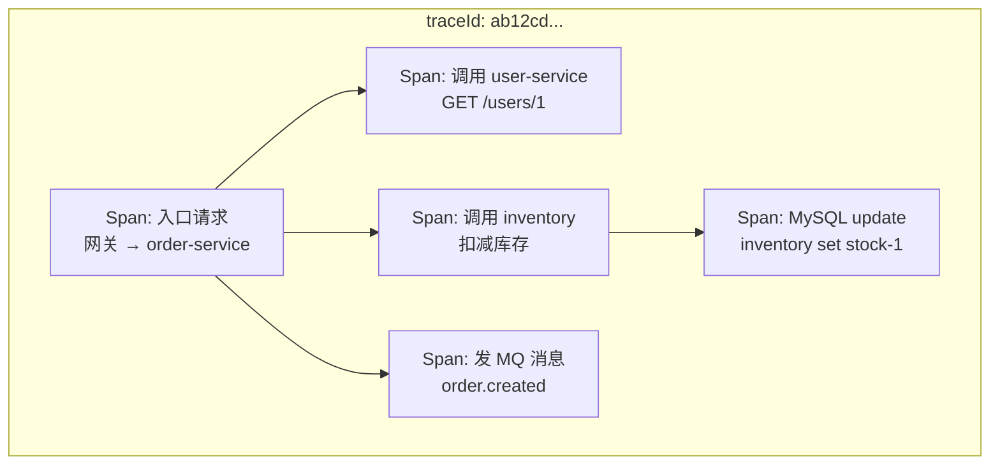
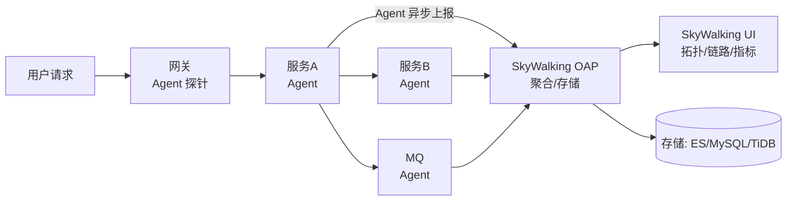

# 链路追踪与 APM（SkyWalking / Jaeger / Zipkin）

> 「请求到底慢在哪一跳？」——微服务排障的灵魂拷问，靠链路追踪回答。本文讲透 Trace/Span/SpanContext 模型、采样与透传、SkyWalking 落地（国内 Java 主流）、与 OpenTelemetry 的关系。
> 开源参考：[apache/skywalking](https://github.com/apache/skywalking)（Apache 2.0，国内 APM 事实标准）、[jaegertracing/jaeger](https://github.com/jaegertracing/jaeger)（CNCF，OpenTelemetry 官方后端）、[openzipkin/zipkin](https://github.com/openzipkin/zipkin)（Twitter 出品，老牌）。

---

## 〇、本体介绍（它是什么 / 适用场景 / 核心概念）

**它是什么**：链路追踪（Distributed Tracing）记录**一次请求在分布式系统中的完整调用路径与每跳耗时**，配上 APM（应用性能监控）能力（拓扑、指标、告警、剖析），回答「慢在哪、挂在哪、依赖谁」。

**解决什么痛点**：微服务一次请求可能穿 5~20 个服务，只靠日志无法还原「路径」与「各跳耗时」；链路追踪给每个请求一个全局 traceId，把散落的调用按树形串联，一眼定位瓶颈与故障点。

**核心概念**：Trace（整条调用链）、Span（一次调用单元，含父子关系）、SpanContext（traceId/spanId 透传）、采样（Sampling）、上下文透传（HTTP Header / MQ 属性）、拓扑图、SkyWalking Agent（字节码注入探针）。

**适用场景**：微服务性能瓶颈定位、故障根因分析、依赖拓扑梳理、SLA 保障、容量评估。
**不适用**：单机单体应用（无跨进程调用，意义不大）；已用商业云 APM 且覆盖全链路的中小团队（可先不自建）。

---

## 一、核心模型：Trace / Span

| 概念 | 说明 |
|------|------|
| **Trace** | 一次完整请求的所有 Span 组成的树，唯一 **traceId** 标识 |
| **Span** | 一次调用单元：服务名、操作名、开始/结束时间、标签（tag）、日志（log）、状态 |
| **parent/child** | Span 的父子关系构成调用树（含 **spanId / parentSpanId**） |
| **SpanContext** | 跨进程传递的上下文（traceId + spanId + 采样标记） |
| **采样** | 不采样 100%（成本），按比例/头部采样保留典型数据 |

### 数据流（SkyWalking 为例）

### 探针原理（SkyWalking Agent 为什么不用改代码）

- **字节码注入（Java Agent）**：`-javaagent:skywalking-agent.jar` 启动，通过 instrument 动态增强框架字节码（HTTP/RPC/MQ/JDBC 客户端），自动采集 Span——**对业务代码零侵入**。
- 同类：Jaeger/Zipkin 通常需要代码埋点或框架集成（也有 agent 方案），OTel Java Agent 同原理。

---

## 二、上下文透传（链路跨服务串起来的核心）

一次调用从一个进程传到下一个进程，必须把 SpanContext 带过去：

| 通道 | 透传方式 |
|------|----------|
| HTTP | Header：`sw8`（SkyWalking）/ `traceparent`（W3C Trace Context）/ `uber-trace-id`（Jaeger） |
| MQ 消息 | 消息属性/Header 携带 traceId，消费者还原上下文并开新 Span |
| gRPC | metadata 透传（W3C traceparent） |
| 线程池 | 手动传递上下文（TraceContext 快照 → 新线程恢复） |
| 日志 | 打点输出 traceId，与链路/日志联动排障 |

> 坑：**线程池/异步调用不自动透传上下文**——`@Async`、CompletableFuture、MQ 消费者里丢了 traceId，链路断成碎片；需显式传递（SkyWalking 的 ContextCarrier / OTel 的 context 传播）。

---

## 三、采样策略（成本与覆盖的平衡）

| 策略 | 说明 |
|------|------|
| 固定比例 | 如 10%：简单但高峰期样本少 |
| 头部采样（Head-based） | 入口决定是否采样，整链一致（推荐，配链路完整） |
| 尾部采样（Tail-based） | 按结果（如错误/慢请求）事后补齐，覆盖关键样本，成本高 |
| 自适应采样 | 按流量动态调比例（开源里少，商业 APM 多） |

- 生产建议：**默认 10%~30% 头部采样** + 「错误/慢请求强制采样」，保证排障样本不丢。

---

## 四、SkyWalking vs Jaeger vs Zipkin 对比

| 维度 | SkyWalking | Jaeger | Zipkin |
|------|-----------|--------|--------|
| 出身 | 中国开源（Apache） | CNCF / Uber | Twitter |
| 采集方式 | **Java Agent 字节码注入（零侵入）** | SDK 埋点/OTel | SDK 埋点 |
| 语言生态 | Java 最强（也支持多语言） | Go/多语言（OTel） | Java/多语言 |
| 附带能力 | 拓扑/指标/告警/日志关联（APM 全家桶） | 纯链路 + 服务图 | 纯链路 |
| 存储 | ES/MySQL/TiDB | 多后端（ES/Cassandra） | ES/Cassandra |
| OTel 兼容 | 兼容（作为后端/前端） | 原生对接 OTel | 原生对接 OTel |
| 选型 | **国内 Java 微服务首选** | 云原生/多语言 + OTel 生态 | 老项目存量 |

---

## 五、与 OpenTelemetry 的关系（重要认知）

- **OpenTelemetry（OTel）** 是**标准与 SDK**：统一采集口径（API + SDK + 导出器），不提供存储与 UI。
- **SkyWalking/Jaeger/Zipkin 是「后端」**：接收 trace 数据存储展示。
- 现代姿势：应用装 **OTel SDK/Agent** 采集 → 导出到 SkyWalking/Jaeger/云厂商后端；或直接用 SkyWalking Agent（国内 Java 零侵入最省事）。
- **OTel 关键概念**：Resource（服务元数据）、SpanProcessor、Exporter（OTLP/gRPC）、Propagator（W3C traceparent）；标准化的意义是「一套埋点，换后端不换代码」。

---

## 六、生产实践与避坑

### 6.1 落地清单

1. 网关/入口配置采样率（头部采样 + 错误强制采样）。
2. 所有服务统一装 Agent/SDK，版本一致（避免协议不兼容）。
3. **日志打 traceId**：与 ELK 联动，链路里跳日志、日志里回链路。
4. MQ/异步/线程池透传上下文（最容易断链的点）。
5. 存储规划：链路数据量大，按天/小时索引 + 保留期（如 7~30 天）；采样率控制总量。
6. 告警联动：慢 Span（如 p99 > 500ms）与错误 Span 触发告警。

### 6.2 常见坑

1. **链路断在异步**：`@Async`/线程池/消息消费没透传上下文 → 链路碎片化。
2. **采样不一致**：入口采样但下游强制全采/入口全采下游低采 → 链路不完整、排障缺数据。
3. **Agent 版本混乱**：与 OAP 不兼容 → 数据上报失败，升级要全链路同步。
4. **存储爆炸**：未按天索引 + 未设保留期 + 采样率过高 → ES 撑爆（见「ELK日志体系」的容量治理）。
5. **只装了链路没联动日志/指标**：单看链路树能定位「哪跳慢」，但要结合日志（为什么慢）与指标（是否整体趋势）。
6. **开发环境不采样**：链路数据缺失导致「上线前没验证过链路完整性」；测试环境至少开 100% 采样跑冒烟。
7. **网关层没接入**：从网关开始的 trace 最完整；只接部分服务会丢「第一跳」。

### 6.3 用链路定位慢请求的 SOP

1. 入口找 traceId（日志/抓包/入口大盘）。
2. 链路树里看各 Span 耗时：**哪个服务、哪个操作慢**（跨服务红色 Span）。
3. 点进慢 Span 看 tag/log：慢 SQL？下游超时？线程池排队？
4. 跳日志（traceId 关联）看应用侧细节；对照指标大盘确认是否普遍。
5. 对症：索引/缓存/扩容/限流/降级（见「场景设计/稳定性三板斧」）。

---

## 面试高频问题（20+ 条）

1. **链路追踪是什么？** 给每次请求生成全局 traceId，记录跨服务的调用路径与每跳耗时（Span 树），用于定位性能瓶颈与故障根因。

2. **Trace 和 Span 的关系？** Trace = 一次请求的全部 Span 树；Span = 一次调用单元（含 parentSpanId 形成父子结构）；spanId/traceId 标识。

3. **上下文怎么跨服务传递？** HTTP Header（sw8/traceparent）、MQ 消息属性、gRPC metadata；接收端还原 SpanContext 并创建子 Span。

4. **SkyWalking Agent 原理？** Java Agent 字节码注入（instrument），动态增强 HTTP/MQ/JDBC 框架字节码，自动采集——业务代码零侵入。

5. **为什么要采样？** 全量采样成本高（上报/存储/查询）；头部采样 10~30% + 错误/慢请求强制采样，保证样本有效且成本可控。

6. **头部采样和尾部采样区别？** 头部：入口决定整链是否采样（一致性好、简单）；尾部：按结果事后补齐关键样本（成本高、覆盖精准）。

7. **SkyWalking、Jaeger、Zipkin 区别？** SkyWalking：Java 零侵入 + APM 全家桶（拓扑/告警），国内主流；Jaeger：CNCF，多语言 OTel 原生；Zipkin：老牌轻量。

8. **OpenTelemetry 和 SkyWalking 什么关系？** OTel 是采集标准（API/SDK/导出器），SkyWalking/Jaeger 是可对接的后端；现代做法：OTel 埋点 + SkyWalking/Jaeger 存储展示。

9. **链路在 MQ 场景怎么串？** 生产端把 SpanContext 放入消息属性，消费端取出还原上下文再建 Span；断了链就查不到「消息下游为什么慢」。

10. **异步/线程池为什么断链？** 线程切换上下文丢失；需显式传递（ContextCarrier 快照 + 恢复），`@Async` 与 CompletableFuture 是重灾区。

11. **怎么用链路定位慢请求？** 链路树看各 Span 耗时找最慢一跳 → 看该 Span 的 tag/log（慢 SQL/下游超时）→ 日志/指标联动 → 对症优化。

12. **链路数据量太大怎么办？** 采样率控制 + 按天索引 + 保留期（7~30 天）+ 存储后端水平扩展（ES 分片）。

13. **跨语言怎么追踪？** 统一协议（W3C traceparent / OTLP）+ 各语言 SDK/Agent；SkyWalking 也支持多语言探针。

14. **链路和日志怎么联动？** 日志输出 traceId，链路 UI 可以「跳转到该 trace 的日志」，排障从链路找慢点、从日志找原因。

15. **全链路追踪还有什么用？** 拓扑依赖梳理（谁调谁）、容量评估、SLA 验证、混沌演练观测（故障注入看链路表现）。

16. **网关必须接入吗？** 必须：入口 Span 决定整条 trace 完整性；网关不接入则「第一跳」缺失，外部流量来源看不清。

17. **Span 里通常记录什么？** 服务/操作名、时间戳与耗时、状态（OK/ERROR）、tag（SQL/URL/参数摘要）、日志事件、异常堆栈。

18. **采样率怎么定？** 流量大默认 10~30% 头部采样；错误与慢 Span 强制采样（不管比例）；低流量系统可 100% 或接近。

19. **SkyWalking 存储用什么？** ES 最常用（链路+指标索引）、MySQL/TiDB 可作轻量后端；存储规划按天索引 + 保留期。

20. **自己实现链路追踪可行吗？** 可行（traceId 透传 + 埋点 + 上报 + 存储展示），但工程量大（采样/时序/UI/告警）；生产直接用 SkyWalking/Jaeger + OTel 更划算。

21. **链路追踪和 APM 什么关系？** APM 包含链路 + 指标 + 拓扑 + 告警 + 剖析；链路是 APM 的核心组件；SkyWalking 就是「带链路的 APM」。

22. **线上「请求慢」怎么从链路下手？** 取 traceId → 看链路树最慢 Span（服务/操作）→ 看该 Span tag（SQL/下游）→ 结合日志与指标确认根因 → 修复后对比优化前后 p99。

---

## 七、与其他板块的关系

- 和「**基础知识/中间件/ELK日志体系**」：链路 + 日志双剑合璧（traceId 关联），排障黄金组合。
- 和「**云原生/可观测性**」：可观测性三支柱中，链路由 SkyWalking/Jaeger/OTel 承载，与 Prometheus（指标）、Loki/ELK（日志）并列。
- 和「**基础知识/网络协议深挖**」：RPC/gRPC 调用的 context 透传是链路的跨进程载体。
- 和「**SRE与稳定性工程/06-日志与告警规则库**」：告警模板里「慢 Span / 错误 Span」是 SLO 看护的重要手段。
- 和「**场景设计/问题定位**」「**SRE与稳定性工程/04-On-call与事故管理**」：链路是事故定位的「第一视角」。

---

## 八、速查表

| 项 | 结论 |
|----|------|
| 核心模型 | Trace（整链）+ Span（每跳）+ SpanContext（透传） |
| 探针方式 | SkyWalking Java Agent 字节码注入（零侵入）/ OTel SDK |
| 透传通道 | HTTP Header / MQ 属性 / gRPC metadata（W3C traceparent） |
| 采样 | 头部采样为主 + 错误/慢请求强制采样 |
| 国内主流 | SkyWalking（拓扑/指标/告警全家桶） |
| 标准 | OpenTelemetry（采集标准）+ Jaeger/SkyWalking（后端） |
| 许可证 | Apache 2.0（三家） |
| 一句话 | 「微服务排障第一视角」——慢在哪一跳、坏在哪一环，一目了然 |
