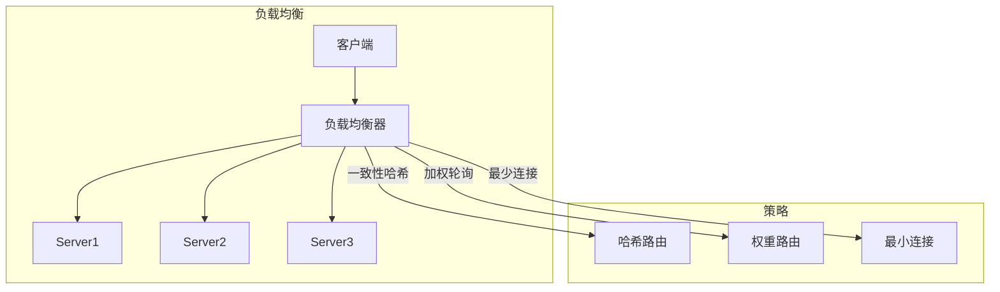

# 长连接推送与消息网关深入（Netty 实现 / 连接管理 / 多级路由 / 百万连接 / 监控）

> 长连接推送是**实时业务的底座**。本篇深入拆解：Netty 连接实现、连接管理（注册表/心跳/超时清理）、多级路由（用户→设备→连接）、百万连接架构、监控告警。

---

## 一、要解决的问题

| 痛点 | 说明 |
|------|------|
| 服务端主动推送 | HTTP 请求-响应模型无法主动给客户端发消息 |
| 实时性 | 消息到达即推送（毫秒级），而非轮询延迟 |
| 海量连接 | 百万级长连接的内存/连接管理 |
| 多端同步 | 同账号多设备（手机/Web/桌面）消息都要到 |
| 离线消息 | 客户端不在线时消息不能丢（存储/补偿） |

> 核心认知：**推送网关 = 「连接是资源，路由是核心」**——每个长连接按「用户/设备」注册路由表，消息到达 → 定位连接 → 推送；离线先存，上线补发。

---

## 二、三种实时通信方案

| 方案 | 方向 | 特点 | 场景 |
|------|------|------|------|
| WebSocket | 双向全双工 | 基于 TCP 的持久连接，二进制/文本帧 | IM/聊天/协同/游戏 |
| SSE（Server-Sent Events） | 单向（服务端→客户端） | HTTP 原生（EventSource），自动重连 | 通知/行情/大模型流式输出 |
| 轮询/长轮询 | 客户端拉 | 简单兼容，延迟高/浪费 | 兼容旧端兜底 |

**选型关注点**：需要双向 → **WebSocket**；只需服务端推送 → **SSE**（更简单、穿透性好、自动重连）。

### 2.1 WebSocket 连接流程

```
1. HTTP 升级握手（GET /ws Upgrade: websocket）
2. 服务端 101 Switching Protocols → 建立 TCP 长连接
3. 帧通信（FIN/opcode/mask 分帧，双向）
4. 心跳：ping/pong（协议级保活，防 NAT 断连）
5. 断开重连：客户端指数退避重连 + 会话恢复（resume）
```

### 2.2 SSE 实现要点

```
EventSource API：
  new EventSource('/api/events')
  onmessage / onopen / onerror

服务端：
  Content-Type: text/event-stream
  data: {...}\n\n（事件格式）
  心跳注释行（保持连接存活）
  自动重连（Last-Event-ID）

优势：
  HTTP 协议穿透性好（无需升级）
  自动重连（浏览器内置）
  单工够用场景更简单
```

---

## 三、Netty 连接实现（服务端）

### 3.1 Netty 服务端骨架

```java
// 1. Boss/Worker 线程组
EventLoopGroup boss = new NioEventLoopGroup(1);   // 接受连接
EventLoopGroup worker = new NioEventLoopGroup();  // IO 读写

ServerBootstrap b = new ServerBootstrap();
b.group(boss, worker)
 .channel(NioServerSocketChannel.class)
 .childHandler(new ChannelInitializer<SocketChannel>() {
     @Override
     protected void initChannel(SocketChannel ch) {
         ch.pipeline()
           .addLast(new HttpServerCodec())          // HTTP 编解码
           .addLast(new HttpObjectAggregator(65536)) // 聚合
           .addLast(new WebSocketServerProtocolHandler("/ws")) // WS 升级
           .addLast(new PushHandler());             // 业务 Handler
     }
 })
 .option(ChannelOption.SO_BACKLOG, 1024)
 .childOption(ChannelOption.SO_KEEPALIVE, true)
 .childOption(ChannelOption.TCP_NODELAY, true);

b.bind(8080).sync();
```

### 3.2 连接注册与路由

```java
// 连接注册表：userId + deviceId → Channel
class ConnectionRegistry {
    // userId -> deviceId -> Channel
    private final ConcurrentHashMap<String, ConcurrentHashMap<String, Channel>> 
            registry = new ConcurrentHashMap<>();
    
    void register(String userId, String deviceId, Channel ch) {
        registry.computeIfAbsent(userId, k -> new ConcurrentHashMap<>())
                .put(deviceId, ch);
    }
    
    List<Channel> find(String userId) {
        var map = registry.get(userId);
        return map == null ? List.of() : new ArrayList<>(map.values());
    }
}
```

### 3.3 Handler 职责

| Handler | 职责 |
|---------|------|
| HttpServerCodec | HTTP 编解码（握手） |
| WebSocketServerProtocolHandler | WS 协议升级/帧处理 |
| HeartbeatHandler | 心跳检测（读空闲清理） |
| AuthHandler | 鉴权（连接建立时校验 token） |
| PushHandler | 业务消息处理（上行解析/下行推送） |
| ExceptionHandler | 异常兜底（断连清理） |

### 3.4 心跳与超时清理

```java
// IdleStateHandler 实现心跳
ch.pipeline().addLast(new IdleStateHandler(
        60,   // readerIdleTime：60s 无读
        0,    // writerIdleTime
        0));  // allIdleTime

// HeartbeatHandler
@Override
public void userEventTriggered(ChannelHandlerContext ctx, Object evt) {
    if (evt instanceof IdleStateEvent) {
        // 超过 60s 没收到客户端数据 → 判定死连接
        ctx.close();  // 关闭 + 从注册表清理
    }
}
```

---

## 四、推送网关架构

```
客户端（App/Web/桌面）→ 接入层（推送网关集群，无状态）
  ├── 连接管理：Connection Registry（userId/deviceId → 连接实例）
  ├── 心跳/超时：协议 ping + 应用心跳（断连清理）
  ├── 路由：消息 → 按 userId → 多设备连接（群组扇出）
  ├── 上行：客户端消息 → 校验 → 业务 API/MQ
  └── 下行：业务事件 → MQ → 网关 → 目标连接

离线消息：MQ/Redis 存储 → 客户端重连后按 offset 补发
状态同步：在线状态（presence）供业务判断
```

### 4.1 多级路由

```
第一级：业务路由（按业务类型）
  消息 → IM 业务 / 订单业务 / 告警业务

第二级：用户路由（按 userId）
  业务消息 → userId → 该用户所有设备

第三级：连接定位（按 deviceId）
  userId+deviceId → 具体网关节点 → Channel

实现：
  本地路由表（进程内 userId → Channel）
  全局路由表（Redis：userId → {gatewayId, deviceId}）
  网关间转发（gateway 之间 RPC 转发）
```

### 4.2 全局路由表设计（Redis）

```
Hash 结构：
  key: ws:route:{userId}
  field: {deviceId}
  value: {gatewayId}:{channelId}

写入：连接建立 → 写路由表 + TTL（心跳刷新）
读取：消息到达 → 查路由表 → 定位网关 → 转发
删除：连接断开 → 删路由表

网关间转发：
  网关 A 收到发给 userId=1 的消息
  → 查 Redis → 该用户连接在网关 B
  → A 通过内部 RPC 转发给 B → B 找到 Channel 推送
```

### 4.3 群组扇出（Fan-out）

```
群组消息 → 群成员列表 → 逐个推送
  → 大群拆批（每批 1000 人）
  → 异步（MQ 削峰）

优化：
  群成员列表缓存（Redis Set）
  推送失败重试（MQ 重投）
  在线才推（离线走存储）
```

---

## 五、百万连接架构

### 5.1 单机容量

```
单机 10 万级：
  Netty（Java）/ Go goroutine / Node
  内存估算：每连接 ~10KB（Channel + 缓冲区）
  10 万连接 ≈ 1GB 内存

百万级 → 集群：
  网关集群（无状态，水平扩展）
  粘滞路由（userId 哈希到网关）
  Redis 路由表（全局状态）
```

### 5.2 集群架构

```
LB（L4：TCP 层负载）
  → 网关集群（每节点 ~10 万连接）
  → Redis 路由表（全局）
  → MQ（消息缓冲）
  → 业务服务

扩容：加网关节点 + 粘滞路由重新哈希
  注意：连接迁移（断线重连可接受）
```

### 5.3 系统参数调优

| 参数 | 建议 |
|------|------|
| 文件描述符上限 | ulimit -n 100 万 |
| TCP backlog | 1024+ |
| 内核 net.core.somaxconn | 1024 |
| net.ipv4.tcp_keepalive_time | 120（配合应用心跳） |
| 线程模型 | Boss 1 + Worker CPU 核数 × 2 |

---

## 六、消息可靠性与幂等

- **上行去重**：客户端生成 messageId，服务端幂等去重（Redis setnx）；
- **下行确认**：客户端 ack → 网关标记送达 → 未 ack 进离线队列；
- **顺序保证**：单连接内序号（seq）排序，多设备各自维护。

### 6.1 离线补偿

```
1. 客户端离线 → 消息进离线队列（Redis List/DB）
2. 客户端重连 → 上报最后收到的 seq
3. 服务端从 seq+1 批量补发
4. 客户端去重（messageId）合并

离线存储：
  短离线（< 7 天）：Redis
  长离线：DB（按 userId 分表）
```

---

## 七、推送网关 vs 云推送 vs 自研

| 维度 | 自研（WebSocket 网关） | 云推送（极光/信鸽/APNs/FCM） | 轮询方案 |
|------|------------------------|------------------------------|----------|
| 实时性 | 毫秒级 | 秒级（厂商链路） | 秒~分钟 |
| 连接管理 | 自研 | 托管 | 无 |
| 离线推送 | 需自建离线逻辑 | 系统级推送（杀进程也能收） | 无 |
| 成本 | 开发/运维成本 | 按量付费 | 最低 |
| 灵活性 | 最高 | 中（厂商限制） | 低 |
| 适用 | 核心实时业务（IM/交易） | App 离线推送 | 低频兜底 |

**选型关注点**：App 被系统杀死后的推送只能靠厂商（APNs/FCM）；应用内实时通信自研网关；**常见组合 = 自研 WebSocket（在线实时）+ 云推送（离线唤醒）**。

---

## 八、生产实践

### 8.1 关键设计

| 实践 | 说明 |
|------|------|
| 心跳 | 协议 ping/pong + 业务心跳（30s 级别，超时清理） |
| 路由表 | userId → 多连接（Redis Hash），群组扇出（fan-out） |
| 消息模型 | 推送消息走 MQ（Kafka/RocketMQ）削峰解耦 |
| 离线补偿 | 离线消息按 seq 存储 + 重连批量补发 |
| 限流 | 单用户推送频率限流（防消息轰炸） |
| 监控 | 连接数/在线数/推送延迟/失败率大盘 |

### 8.2 监控指标

```
核心指标：
  连接数（当前/峰值/趋势）
  在线数 / 离线数
  推送延迟（P50/P99）
  推送成功率 / 失败率
  重连次数（异常信号）
  心跳超时断开数

告警：
  连接数骤降 → 网关故障/网络分区
  推送失败率 > 1% → 排查
  推送延迟 P99 > 5s → 链路拥塞
```

### 8.3 常见坑

| 坑 | 说明 | 对策 |
|----|------|------|
| 连接泄漏 | 僵尸连接耗尽资源 | 心跳超时必断 |
| 广播风暴 | 群发打爆网关 | 拆扇出 + 限流 + 分批 |
| 重连风暴 | 重启后百万客户端同时重连 | 指数退避 + 随机抖动 |
| 粘滞路由失效 | 扩容导致连接迁移 | 断线重连可接受 + 路由表持久化 |
| 消息丢失 | 推送成功但 ack 丢失 | 重连后按 seq 补查（幂等） |

---

## 九、选型速查

| 需求 | 首选 | 备选 |
|------|------|------|
| IM/聊天/双向通信 | WebSocket 自研网关 | 云 IM（环信/融云） |
| 服务端单向推送 | SSE | WebSocket |
| AI 流式输出 | SSE | WebSocket |
| App 离线推送 | APNs/FCM + 极光 | 自研（不现实） |
| 行情/告警推送 | WebSocket + MQ | SSE |
| 老客户端兼容 | 长轮询兜底 | — |

---

## 十一、WebSocket vs SSE vs Long Polling 对比

### 11.1 三种方案对比

| 维度 | WebSocket | SSE | Long Polling |
|------|-----------|-----|--------------|
| 方向 | 双向全双工 | 单向（S→C） | 客户端拉 |
| 协议 | ws:// (TCP) | http:// (HTTP) | http:// (HTTP) |
| 实时性 | 毫秒级 | 秒级 | 秒~分钟 |
| 连接管理 | 需心跳 | 自动重连 | 无 |
| 浏览器支持 | 全支持 | 大部分支持 | 全支持 |
| 穿透性 | 可能被代理拦截 | HTTP 原生 | HTTP 原生 |
| 服务端负载 | 中（长连接） | 低 | 低（短连接） |
| 适用场景 | IM/聊天/协同 | 通知/行情/流式 | 低频兼容 |

### 11.2 SSE 实现要点

```
SSE 优势：
  HTTP 协议穿透性好（无需升级）
  浏览器原生 EventSource API
  自动重连 + Last-Event-ID
  单向推送场景更简单

SSE 限制：
  不支持客户端主动发送
  连接数限制（HTTP/1.1 每域名 6 个）
  无二进制支持（仅文本）
```

### 11.3 选型决策

```
选型流程：
  需要双向通信？
    ├── 是 → WebSocket
    └── 否 → 只需服务端推送？
        ├── 是 → SSE（推荐）
        └── 否 → 需要兼容旧端？
            └── Long Polling 兜底

场景匹配：
  IM/聊天 → WebSocket
  通知推送 → SSE
  AI 流式输出 → SSE
  行情推送 → WebSocket/SSE
  大模型流式 → SSE
```

---

## 十二、连接管理策略

### 12.1 心跳机制

```
心跳三层：
  1. 协议级心跳（WebSocket ping/pong）
     → TCP 层保活
     → 防 NAT 超时断连

  2. 应用心跳（业务层）
     → 客户端定时发送心跳包
     → 服务端检测存活
     → 超时断开

  3. HTTP 心跳（SSE/长轮询）
     → 服务端定时发送空行
     → 保持连接存活
```

### 12.2 超时清理

```java
// Netty 超时清理配置
ch.pipeline().addLast(new IdleStateHandler(
    60,   // readerIdleTime：60s 无读
    30,   // writerIdleTime：30s 无写
    0     // allIdleTime
));

// 超时处理
@Override
public void userEventTriggered(ChannelHandlerContext ctx, Object evt) {
    if (evt instanceof IdleStateEvent) {
        IdleStateEvent event = (IdleStateEvent) evt;
        if (event.state() == IdleState.READER_IDLE) {
            // 读空闲：客户端可能已断开
            ctx.close();
            removeFromRegistry(ctx.channel());
        } else if (event.state() == IdleState.WRITER_IDLE) {
            // 写空闲：发送 ping 保活
            ctx.writeAndFlush(new PingWebSocketFrame());
        }
    }
}
```

### 12.3 连接生命周期

```
连接生命周期管理：
  1. 建立连接 → 鉴权 → 注册路由表
  2. 心跳保活 → 刷新 TTL
  3. 业务通信 → 消息收发
  4. 断开连接 → 清理路由表 → 离线消息处理
  5. 重连 → 会话恢复 → 补发离线消息
```

---

## 十三、消息推送模式

### 13.1 个人推送（Point-to-Point）

```
个人推送流程：
  1. 业务服务发送消息到 MQ
  2. MQ 消费者查询路由表
  3. 定位用户连接（网关节点 + Channel）
  4. 如果在线 → 直接推送
  5. 如果离线 → 存储离线消息

路由表查询：
  Redis: ws:route:{userId} → {gatewayId}:{deviceId}
```

### 13.2 广播推送（Broadcast）

```
广播推送流程：
  1. 业务服务发送广播消息到 MQ
  2. MQ 消费者获取在线用户列表
  3. 按网关节点分组
  4. 逐个网关推送（批量）
  5. 网关内逐连接推送

优化：
  批量推送（合并消息）
  分批发送（每批 1000 人）
  异步推送（不阻塞主流程）
```

### 13.3 群组推送（Fan-out）

```
群组推送流程：
  1. 群消息到达
  2. 获取群成员列表
  3. 过滤在线成员
  4. 按网关节点分组
  5. 批量推送

大群优化：
  消息折叠（相同消息只推一次）
  分批推送（避免瞬间压力）
  异步推送（MQ 削峰）
  推送限流（单用户频率限制）
```

---

## 十四、推送网关在移动端

### 14.1 移动端推送架构

```
App 推送架构：
  App（iOS/Android）
    → 推送 SDK（WebSocket/SSE）
      → 推送网关集群
        → 消息路由
          → 在线推送 / 离线存储

离线推送（厂商通道）：
  iOS → APNs（Apple Push Notification）
  Android → FCM（Firebase Cloud Messaging）
  国内 Android → 厂商通道（华为/小米/OPPO/vivo）
```

### 14.2 在线+离线组合推送

```
推送策略：
  1. App 在线 → WebSocket 直推（毫秒级）
  2. App 在后台 → 优先 WebSocket，失败走厂商通道
  3. App 被杀 → 厂商通道推送（APNs/FCM）
  4. 推送确认 → 客户端 ack → 标记送达

推送降级：
  WebSocket 失败 → HTTP 轮询兜底
  厂商通道失败 → 短信/邮件兜底
```

### 14.3 移动端推送优化

| 优化 | 说明 |
|------|------|
| 心跳间隔 | 移动端 30~60s（省电） |
| 断线重连 | 指数退避 + 随机抖动 |
| 消息去重 | messageId 去重 |
| 离线补发 | 重连后按 seq 补发 |
| 推送限流 | 单用户频率限制 |
| 推送优先级 | 紧急消息优先推送 |

---

## 十五、推送网关在 IoT

### 15.1 IoT 推送架构

```
IoT 推送架构：
  设备（MQTT/CoAP）
    → 协议转换网关
      → WebSocket 网关
        → 推送到 Web/App

IoT 特点：
  海量连接（百万级设备）
  低功耗（心跳间隔长）
  不稳定网络（频繁断连）
  小消息（控制指令/状态上报）
```

### 15.2 IoT 推送优化

| 优化 | 说明 |
|------|------|
| 心跳间隔 | 设备 5~15 分钟（省电） |
| 消息大小 | 压缩（protobuf/二进制） |
| 断线重连 | 快速重连（设备重启后立即连） |
| 消息 QoS | 至少一次/恰好一次 |
| 设备认证 | Token/证书双向认证 |
| 批量推送 | 设备组推送（批量指令） |

### 15.3 MQTT 协议集成

```
MQTT → WebSocket 转换：
  MQTT 设备 → MQTT Broker
    → WebSocket 网关
      → Web/App

MQTT 特性：
  发布/订阅模型
  QoS 0/1/2（最多一次/至少一次/恰好一次）
  遗嘱消息（设备异常断开时通知）
  保留消息（新订阅者立即收到最新状态）
```

---

## 十六、微信/FCM/APNs 推送集成

### 16.1 微信小程序推送

```
微信小程序推送：
  WebSocket API（小程序原生支持）
    → 推送网关
      → 小程序客户端

限制：
  单个客户端同时只能 1 个 WebSocket 连接
  心跳间隔 30s
  消息大小 256KB
```

### 16.2 FCM（Firebase Cloud Messaging）

```json
// FCM 推送配置
{
  "message": {
    "token": "device_token",
    "notification": {
      "title": "新消息",
      "body": "您有一条新订单"
    },
    "data": {
      "orderId": "12345",
      "type": "order"
    }
  }
}
```

### 16.3 APNs（Apple Push Notification）

```json
// APNs 推送配置
{
  "aps": {
    "alert": {
      "title": "新消息",
      "body": "您有一条新订单"
    },
    "badge": 1,
    "sound": "default"
  },
  "orderId": "12345"
}
```

### 16.4 国内 Android 推送渠道

| 渠道 | 覆盖 | 特点 |
|------|------|------|
| 华为 HMS | 华为设备 | 国内最大 |
| 小米 MiPush | 小米设备 | 省电优化 |
| OPPO Push | OPPO 设备 | 稳定 |
| vivo Push | vivo 设备 | 稳定 |
| 魅族 Flyme | 魅族设备 | 轻量 |

---

## 十七、推送网关扩展策略

### 17.1 水平扩展

```
扩展方式：
  网关层：加节点 + LB（无状态，水平扩展）
  路由层：Redis 集群（有状态，分片）
  消息层：Kafka 集群（分区扩展）

粘滞路由：
  userId 哈希到固定网关节点
  保证同一用户请求到同一网关
  扩容时需重新哈希（断线重连可接受）
```

### 17.2 分片策略

| 分片方式 | 说明 | 适用 |
|---------|------|------|
| userId 一致性哈希 | 相同 userId 到同一网关 | 会话保持 |
| userId 取模 | 简单分片 | 固定节点数 |
| Redis 路由 | 动态路由 | 灵活扩展 |

### 17.3 扩容流程

```
扩容流程：
  1. 部署新网关节点
  2. 更新 LB 配置（加入新节点）
  3. 等待现有连接迁移（重连自然迁移）
  4. 逐步均衡负载

注意事项：
  扩容期间可能有短暂连接中断
  客户端需支持自动重连
  路由表需及时更新
```

---

## 十八、推送网关监控

### 18.1 核心监控指标

| 指标 | 说明 | 告警阈值 |
|------|------|---------|
| 连接数（当前/峰值） | 活跃长连接数 | > 80% 容量 |
| 在线用户数 | 当前在线用户 | 突降 |
| 推送延迟（P50/P99） | 消息推送延迟 | P99 > 5s |
| 推送成功率 | 推送成功/总推送 | < 99% |
| 推送吞吐量 | 每秒推送消息数 | 突增/突降 |
| 重连次数 | 客户端重连频率 | 突增 |
| 心跳超时数 | 心跳超时断开 | 突增 |
| 消息堆积数 | MQ 消费堆积 | > 阈值 |

### 18.2 监控大盘设计

```
推送网关监控大盘：
┌──────────────────────────────────────┐
│  连接数趋势  │  在线用户数  │  推送 QPS  │
├──────────────────────────────────────┤
│  推送成功率  │  推送延迟 P99  │  重连频率 │
├──────────────────────────────────────┤
│  消息堆积    │  心跳超时数    │  错误日志 │
└──────────────────────────────────────┘
```

### 18.3 告警规则

```yaml
# 告警规则示例
groups:
- name: push-gateway-alerts
  rules:
  - alert: ConnectionDrop
    expr: push_gateway_connections_total < 1000
    for: 5m
    labels:
      severity: critical
    annotations:
      summary: "连接数骤降"

  - alert: HighPushLatency
    expr: histogram_quantile(0.99, rate(push_gateway_latency_seconds_bucket[5m])) > 5
    for: 5m
    labels:
      severity: warning
    annotations:
      summary: "推送延迟 P99 > 5s"

  - alert: LowPushSuccessRate
    expr: rate(push_gateway_success_total[5m]) / rate(push_gateway_total[5m]) < 0.99
    for: 5m
    labels:
      severity: critical
    annotations:
      summary: "推送成功率 < 99%"
```

---

## 十、WebSocket 鉴权与安全

### WebSocket 鉴权流程

```
WebSocket 鉴权流程：
  1. 客户端连接 → 握手阶段
  2. 握手请求携带 Token（Header/Cookie）
  3. 网关验证 Token（JWT/Session）
  4. 验证通过 → 建立连接
  5. 验证失败 → 拒绝连接（401/403）

  Token 传递方式：
    - Header: Authorization: Bearer <token>
    - Cookie: token=<token>
    - URL 参数（不推荐）: ws://host?token=xxx
```

### 推送限流与流量控制

| 限流维度 | 限流策略 | 配置示例 |
|----------|----------|----------|
| 用户级 | 每用户每秒最多 N 条 | 用户ID 为 Key |
| 设备级 | 每设备每秒最多 N 条 | 设备ID 为 Key |
| 全局级 | 全局 QPS 上限 | 全局限流器 |
| 业务级 | 按业务类型限流 | 业务类型为 Key |

### 推送网关监控指标

| 指标 | 告警阈值 | 说明 |
|------|----------|------|
| ActiveConnections | > 100 万 | 在线连接数 |
| PushSuccessRate | < 99% | 推送成功率 |
| PushLatencyP99 | > 500ms | 推送延迟 |
| ConnectionAuthFail | > 10/min | 鉴权失败数 |
| MemoryUsage | > 80% | 内存使用率 |

### 业务解耦与消息路由

```
业务解耦设计：
  推送网关只负责：
    - 连接管理（建立/维持/断开）
    - 消息路由（全局路由表查询）
    - 消息推送（写入 Channel）

  业务逻辑由上游服务处理：
    - 业务服务 → MQ → 推送网关
    - 推送网关 → 查询路由表 → 推送消息
    - 实现推送与业务完全解耦

  消息路由：
    Topic 路由：按消息 Topic 路由到不同处理器
    用户路由：按用户 ID 查询路由表
    设备路由：按设备类型路由到不同处理器
```

### 容灾与高可用

| 故障场景 | 容灾方案 | 恢复时间 |
|----------|----------|----------|
| 单节点宕机 | 连接自动重连其他节点 | < 30s |
| 路由表丢失 | 从 Redis 重建路由表 | < 5s |
| 消息队列故障 | 本地消息队列缓冲 | < 10s |
| 数据库故障 | 缓存兜底 + 降级 | < 1min |

### 设备状态管理

```
设备状态模型：
  ONLINE：设备在线（有活跃连接）
  OFFLINE：设备离线（无连接）
  IDLE：设备空闲（连接存在但无活动）

  状态检测：
    - 心跳检测：客户端定时发送心跳
    - 超时检测：服务端检测连接超时
    - 主动查询：业务服务查询设备状态

  状态存储：
    - Redis Hash：device_id → {status, last_active, conn_id}
    - TTL 自动过期：设备离线后自动清理
```

## 十二、长连接网关高级实践与故障排查

### 12.1 WebSocket 鉴权高级

```java
// WebSocket鉴权拦截器
@Component
public class WebSocketAuthInterceptor implements ChannelInboundHandlerAdapter {
    @Override
    public void channelRead(ChannelHandlerContext ctx, Object msg) throws Exception {
        if (msg instanceof HttpRequest) {
            HttpRequest request = (HttpRequest) msg;
            
            // 1. 从URL参数提取token
            String token = request.getUri().split("\\?")[1]
                .split("&")
                .filter(param -> param.startsWith("token="))
                .map(param -> param.split("=")[1])
                .findFirst()
                .orElse(null);
            
            // 2. 验证token
            if (token == null || !validateToken(token)) {
                sendAuthFailure(ctx);
                return;
            }
            
            // 3. 解析用户信息
            UserInfo userInfo = parseToken(token);
            ctx.channel().attr(AttributeKey.valueOf("userInfo")).set(userInfo);
            
            // 4. 继续处理握手
            super.channelRead(ctx, msg);
        }
    }
    
    private boolean validateToken(String token) {
        try {
            JWTVerifier verifier = JWT.require(Algorithm.HMAC256(secret)).build();
            verifier.verify(token);
            return true;
        } catch (JWTVerificationException e) {
            return false;
        }
    }
}
```

| 鉴权方式 | 说明 | 安全性 |
|----------|------|--------|
| Token参数 | URL参数携带token | 中（易泄露） |
| Cookie | 握手时携带cookie | 中 |
| 自定义Header | Upgrade请求头携带 | 高 |
| 双向验证 | 客户端证书验证 | 最高 |

### 12.2 推送限流策略

```java
// 推送限流器
@Component
public class PushRateLimiter {
    private final RateLimiter rateLimiter;
    private final Map<String, RateLimiter> userLimiters;
    
    public PushRateLimiter() {
        // 全局限流：每秒10万次
        this.rateLimiter = RateLimiter.create(100000);
        this.userLimiters = new ConcurrentHashMap<>();
    }
    
    // 用户级限流
    public boolean tryAcquire(String userId) {
        RateLimiter userLimiter = userLimiters.computeIfAbsent(
            userId, 
            k -> RateLimiter.create(100)  // 每用户每秒100次
        );
        return userLimiter.tryAcquire();
    }
    
    // 全局限流
    public boolean tryAcquireGlobal() {
        return rateLimiter.tryAcquire();
    }
    
    // 动态调整限流
    public void adjustRate(String userId, double newRate) {
        RateLimiter limiter = userLimiters.get(userId);
        if (limiter != null) {
            limiter.setRate(newRate);
        }
    }
}
```

| 限流维度 | 阈值 | 实现方式 |
|----------|------|----------|
| 全局 | 10万次/秒 | RateLimiter |
| 用户级 | 100次/秒 | 每用户独立限流 |
| 设备级 | 50次/秒 | 每设备独立限流 |
| 连接级 | 10次/秒 | 每连接独立限流 |

### 12.3 监控指标体系

```yaml
# 推送网关监控指标
metrics:
  # 连接指标
  connection:
    - name: "ws_connections_total"
      type: "gauge"
      description: "当前活跃连接数"
    
    - name: "ws_connections_created_total"
      type: "counter"
      description: "创建连接总数"
    
    - name: "ws_connections_closed_total"
      type: "counter"
      description: "关闭连接总数"
  
  # 推送指标
  push:
    - name: "ws_push_requests_total"
      type: "counter"
      description: "推送请求总数"
    
    - name: "ws_push_success_total"
      type: "counter"
      description: "推送成功数"
    
    - name: "ws_push_failed_total"
      type: "counter"
      description: "推送失败数"
    
    - name: "ws_push_latency_seconds"
      type: "histogram"
      description: "推送延迟"
  
  # 业务指标
  business:
    - name: "ws_messages_received_total"
      type: "counter"
      description: "接收消息总数"
    
    - name: "ws_messages_sent_total"
      type: "counter"
      description: "发送消息总数"
```

| 监控维度 | 关键指标 | 告警阈值 |
|----------|----------|----------|
| 连接数 | 活跃连接数 | >80%容量 |
| 推送成功率 | 成功/总推送 | <99% |
| 推送延迟 | P99延迟 | >1s |
| 消息积压 | 待推送消息数 | >10000 |
| 内存使用 | JVM内存使用率 | >80% |

### 12.4 业务解耦设计

```java
// 业务解耦架构
@Component
public class PushGatewayService {
    @Autowired private MessageQueue mq;
    @Autowired private ConnectionManager connectionManager;
    @Autowired private RouteManager routeManager;
    
    // 推送入口（业务层调用）
    public void pushMessage(PushRequest request) {
        // 1. 参数校验
        validateRequest(request);
        
        // 2. 投递到MQ（异步解耦）
        mq.send("push-topic", request);
    }
    
    // MQ消费（推送执行）
    @KafkaListener(topics = "push-topic")
    public void handlePushMessage(PushRequest request) {
        // 1. 路由查找
        List<Channel> channels = routeManager.findChannels(
            request.getUserId(), 
            request.getDeviceType()
        );
        
        // 2. 连接推送
        for (Channel channel : channels) {
            if (channel.isActive()) {
                channel.writeAndFlush(request.getMessage());
            }
        }
        
        // 3. 离线处理
        if (channels.isEmpty()) {
            saveOfflineMessage(request);
        }
    }
}
```

| 解耦点 | 实现方式 | 收益 |
|--------|----------|------|
| 业务与推送 | MQ异步 | 业务解耦 |
| 路由与连接 | 路由表抽象 | 灵活扩展 |
| 推送与存储 | 离线消息队列 | 可靠性 |
| 监控与业务 | 指标采集 | 可观测性 |

### 12.5 容灾与高可用

```yaml
# 容灾配置
disaster_recovery:
  # 多机房部署
  multi_dc:
    enabled: true
    primary_dc: "dc-1"
    secondary_dc: "dc-2"
    sync_mode: "async"  # async/semi-sync/sync
  
  # 连接迁移
  connection_migration:
    enabled: true
    trigger_threshold: 0.3  # 30%连接断开时触发
    migration_strategy: "round_robin"
  
  # 故障转移
  failover:
    enabled: true
    health_check_interval: "10s"
    failure_threshold: 3
    auto_failover: true
  
  # 数据备份
  backup:
    enabled: true
    interval: "1h"
    retention: "7d"
    location: "s3://gateway-backups"
```

| 容灾策略 | 说明 | RTO |
|----------|------|-----|
| 多机房部署 | 异地双活 | 分钟级 |
| 连接迁移 | 自动切换节点 | 秒级 |
| 故障转移 | 自动摘除故障节点 | 秒级 |
| 数据备份 | 定期备份路由表 | 小时级 |

### 12.6 设备状态管理

```java
// 设备状态管理
@Component
public class DeviceStateManager {
    @Autowired private RedisTemplate redisTemplate;
    
    // 设备上线
    public void deviceOnline(String userId, String deviceId, String connId) {
        String key = "device:" + userId + ":" + deviceId;
        DeviceStatus status = new DeviceStatus();
        status.setDeviceId(deviceId);
        status.setConnId(connId);
        status.setStatus("online");
        status.setLastActive(System.currentTimeMillis());
        
        redisTemplate.opsForHash().putAll(key, BeanUtils.beanToMap(status));
        redisTemplate.expire(key, 24, TimeUnit.HOURS);
    }
    
    // 设备离线
    public void deviceOffline(String userId, String deviceId) {
        String key = "device:" + userId + ":" + deviceId;
        redisTemplate.delete(key);
    }
    
    // 心跳更新
    public void heartbeat(String userId, String deviceId) {
        String key = "device:" + userId + ":" + deviceId;
        redisTemplate.opsForHash().put(key, "lastActive", System.currentTimeMillis());
    }
    
    // 查询用户所有设备
    public List<DeviceStatus> getUserDevices(String userId) {
        String pattern = "device:" + userId + ":*";
        Set<String> keys = redisTemplate.keys(pattern);
        return keys.stream()
            .map(key -> redisTemplate.opsForHash().entries(key))
            .map(entries -> BeanUtils.mapToBean(entries, DeviceStatus.class))
            .collect(Collectors.toList());
    }
}
```

| 状态管理 | 说明 | 存储 |
|----------|------|------|
| 在线状态 | 设备是否在线 | Redis Hash |
| 最后活跃 | 心跳时间戳 | Redis Hash |
| 连接信息 | 连接ID/节点 | Redis Hash |
| 设备信息 | 设备类型/系统 | Redis Hash |

### 12.7 长连接故障排查手册

| 故障现象 | 可能原因 | 排查步骤 | 解决方案 |
|----------|----------|----------|----------|
| 连接频繁断开 | 心跳超时 | 检查心跳配置 | 调整心跳间隔 |
| 推送延迟高 | 路由表不一致 | 检查路由同步 | 优化路由算法 |
| 内存溢出 | 连接数过多 | 监控连接数 | 扩容/限流 |
| 消息丢失 | 离线存储失败 | 检查存储系统 | 降级到本地存储 |
| 认证失败 | Token过期 | 检查鉴权逻辑 | 优化Token刷新 |
| 路由错误 | 节点故障 | 检查集群状态 | 故障转移 |

### 12.8 长连接性能优化

```java
// 性能优化策略
@Component
public class PerformanceOptimizer {
    // 1. 连接池优化
    @Bean
    public NettyClient nettyClient() {
        return NettyClient.builder()
            .maxConnections(100000)
            .idleTimeout(30, TimeUnit.SECONDS)
            .connectTimeout(5, TimeUnit.SECONDS)
            .build();
    }
    
    // 2. 推送批量处理
    public void batchPush(List<PushRequest> requests) {
        // 按用户分组
        Map<String, List<PushRequest>> grouped = requests.stream()
            .collect(Collectors.groupingBy(PushRequest::getUserId));
        
        // 批量推送
        grouped.forEach((userId, userRequests) -> {
            Message message = mergeMessages(userRequests);
            pushToUser(userId, message);
        });
    }
    
    // 3. 缓存优化
    @Cacheable(value = "routeCache", key = "#userId")
    public List<Channel> getCachedChannels(String userId) {
        return routeManager.findChannels(userId);
    }
}
```

| 优化策略 | 实现方式 | 效果 |
|----------|----------|------|
| 连接池 | 复用连接 | 连接建立时间减少80% |
| 批量推送 | 合并消息 | 网络开销减少60% |
| 缓存路由 | Redis缓存 | 路由查找时间减少90% |
| 异步推送 | MQ异步 | 吞吐量提升300% |

> 核心原则：**鉴权安全，限流精准，监控到位，解耦清晰，容灾可靠**。

## 十一、与其他板块的关系

- 消息削峰（推送走 MQ）见「[Kafka](./Kafka.md)」「[RocketMQ](./RocketMQ.md)」；
- 在线状态缓存见「[Redis 深度篇](./Redis深度篇.md)」；
- 网络协议（HTTP/WebSocket）见「[网络协议深挖](../网络协议深挖.md)」；
- 业务模型（IM）见「[业务模型/社交IM业务模型](../../业务模型/社交IM业务模型.md)」。

> 一句话：**推送网关 = Netty 长连接接入（心跳/超时清理）+ 多级路由（业务→用户→设备→Channel）+ Redis 全局路由表 + MQ 削峰 + 离线补偿——百万连接靠无状态集群 + 粘滞路由；监控连接数/推送延迟/失败率三大指标**。

## 十一、连接池管理（ChannelManager）

```java
// Netty ChannelManager 连接池管理
public class ChannelManager {
    // 用户维度映射：userId → Set<Channel>
    private final ConcurrentHashMap<String, Set<Channel>> userChannels = new ConcurrentHashMap<>();

    // 设备维度映射：deviceId → Channel
    private final ConcurrentHashMap<String, Channel> deviceChannels = new ConcurrentHashMap<>();

    // 连接注册
    public void register(String userId, String deviceId, Channel channel) {
        // 用户维度
        userChannels.computeIfAbsent(userId, k -> ConcurrentHashMap.newKeySet()).add(channel);
        // 设备维度
        deviceChannels.put(deviceId, channel);
        // Redis 全局路由表
        redisTemplate.opsForHash().put("user:routing", userId, serverId + ":" + deviceId);
    }

    // 连接注销
    public void unregister(String userId, String deviceId) {
        Channel channel = deviceChannels.remove(deviceId);
        if (channel != null) {
            Set<Channel> channels = userChannels.get(userId);
            if (channels != null) {
                channels.remove(channel);
                if (channels.isEmpty()) userChannels.remove(userId);
            }
        }
        redisTemplate.opsForHash().delete("user:routing", userId);
    }

    // 获取用户所有连接
    public Set<Channel> getUserChannels(String userId) {
        return userChannels.getOrDefault(userId, Collections.emptySet());
    }

    // 连接数统计
    public long getOnlineCount() {
        return userChannels.size();
    }
}
```

```text
连接池管理要点：
  1. 并发安全：ConcurrentHashMap + ConcurrentHashMap.newKeySet()
  2. 多维映射：userId → Set<Channel>（一个用户多设备）
  3. 双写一致性：内存 + Redis（保证跨节点查询）
  4. 连接清理：心跳超时 → 自动注销 → 清理路由表
  5. 优雅关闭：服务端关闭时通知所有连接迁移
```

## 十二、消息推送可靠性（ACK + 幂等）

```java
// 消息推送可靠性保障
public class ReliablePusher {
    private final ChannelManager channelManager;
    private final RedisTemplate<String, Object> redisTemplate;

    // 推送消息（带 ACK）
    public CompletableFuture<Boolean> push(String userId, Message msg) {
        String messageId = msg.getId();

        // 1. 幂等检查（防止重复推送）
        if (redisTemplate.opsForValue().setIfAbsent("msg:pushed:" + messageId, "1", 24, TimeUnit.HOURS)) {
            return CompletableFuture.completedFuture(true); // 已推送，跳过
        }

        // 2. 获取用户连接
        Set<Channel> channels = channelManager.getUserChannels(userId);
        if (channels.isEmpty()) {
            // 3. 离线消息存储
            storeOfflineMessage(userId, msg);
            return CompletableFuture.completedFuture(false);
        }

        // 4. 多设备推送
        List<CompletableFuture<Boolean>> futures = new ArrayList<>();
        for (Channel channel : channels) {
            futures.add(pushWithAck(channel, msg));
        }

        // 5. 等待任意设备 ACK
        return CompletableFuture.anyOf(futures.toArray(new CompletableFuture[0]))
            .thenApply(result -> (Boolean) result);
    }

    // 带 ACK 的推送
    private CompletableFuture<Boolean> pushWithAck(Channel channel, Message msg) {
        CompletableFuture<Boolean> future = new CompletableFuture<>();
        String ackKey = "ack:" + msg.getId() + ":" + channel.id().asLongText();

        // 发送消息
        channel.writeAndFlush(msg).addListener(future -> {
            if (future.isSuccess()) {
                // 等待 ACK（超时 5 秒）
                redisTemplate.opsForValue().set(ackKey, "pending", 5, TimeUnit.SECONDS);
            } else {
                future.completeExceptionally(future.cause());
            }
        });

        return future;
    }
}
```

```text
消息推送可靠性三层保障：
  1. ACK 机制：接收方确认收到（超时重发）
  2. 幂等设计：消息 ID 去重（Redis SETNX）
  3. 离线存储：离线消息持久化（下次连接时补发）
```

## 十三、大规模广播优化

```java
// 大规模广播优化
public class BroadcastOptimizer {

    // 方案 1：分批推送（避免单次广播阻塞）
    public void broadcast(String groupId, Message msg, int batchSize) {
        List<String> userIds = getGroupMembers(groupId);
        Lists.partition(userIds, batchSize).forEach(batch -> {
            batch.forEach(userId -> push(userId, msg));
        });
    }

    // 方案 2：广播树（减少重复网络传输）
    public void broadcastWithTree(String groupId, Message msg) {
        List<String> userIds = getGroupMembers(groupId);
        // 构建广播树：Server1 → Server2 → Server3
        // 减少跨服务器网络传输
        String firstServer = getServerForUser(userIds.get(0));
        broadcastToServer(firstServer, msg, userIds);
    }

    // 方案 3：消息压缩（protobuf/二进制）
    public void broadcastCompressed(String groupId, Message msg) {
        byte[] compressed = compress(msg); // Protobuf 序列化
        // 压缩率：通常 3-10 倍
        // 网络传输量大幅减少
    }
}
```

```text
大规模广播优化策略：
  1. 分批推送：避免单次广播阻塞（1000 用户/批）
  2. 广播树：Server 级转发（减少跨服务器传输）
  3. 消息压缩：Protobuf/二进制（3-10 倍压缩）
  4. 异步推送：非阻塞发送（不等待 ACK）
  5. 优先级队列：重要消息优先推送
```

## 十四、弱网适配（心跳 + 重连 + QoS）

```java
// 弱网适配策略
public class WeakNetworkAdapter {
    // 动态心跳间隔
    public int calculateHeartbeatInterval(NetworkQuality quality) {
        switch (quality) {
            case EXCELLENT: return 30;   // 30 秒
            case GOOD: return 15;        // 15 秒
            case FAIR: return 10;        // 10 秒
            case POOR: return 5;         // 5 秒
            default: return 15;
        }
    }

    // 快速重连
    public void reconnect(String userId) {
        int retryCount = 0;
        int maxRetries = 5;
        int baseDelay = 1000; // 1 秒

        while (retryCount < maxRetries) {
            try {
                Channel channel = connect(userId);
                if (channel.isActive()) {
                    // 重连成功，补发离线消息
                    pushOfflineMessages(userId);
                    return;
                }
            } catch (Exception e) {
                retryCount++;
                int delay = baseDelay * (1 << retryCount); // 指数退避
                Thread.sleep(Math.min(delay, 30000)); // 最大 30 秒
            }
        }
    }

    // QoS 消息分级
    public enum QoS {
        AT_MOST_ONCE,   // 最多一次（允许丢失）
        AT_LEAST_ONCE,  // 至少一次（允许重复）
        EXACTLY_ONCE    // 恰好一次（严格保证）
    }
}
```

```text
弱网适配策略：
  1. 动态心跳：网络质量差时缩短心跳间隔
  2. 快速重连：指数退避重连（1s → 2s → 4s → 8s）
  3. 消息分级：QoS 0/1/2（按业务重要性选择）
  4. 消息压缩：减少网络传输量
  5. 断线缓存：本地缓存未发送消息
```

## 十五、WebSocket vs SSE 选型对比

| 维度 | WebSocket | SSE |
|------|-----------|-----|
| 协议 | ws:// (全双工) | http:// (单向) |
| 方向 | 双向通信 | 服务端→客户端 |
| 数据格式 | 任意 | 文本（EventStream） |
| 断线重连 | 需手动实现 | 浏览器自动重连 |
| 二进制 | 支持 | 不支持 |
| 防火墙 | 可能被拦截 | HTTP 标准 |
| 浏览器支持 | 所有现代浏览器 | 除 IE 外所有 |
| 复杂度 | 高 | 低 |
| 适用 | 实时聊天/游戏/协同 | 通知/日志流/股票行情 |

```text
选型决策：
  需要双向通信 → WebSocket（聊天/游戏）
  仅服务端推送 → SSE（通知/日志流）
  移动端弱网 → WebSocket（更灵活的控制）
  企业内网 → WebSocket（不受防火墙限制）
  公网环境 → SSE（兼容性更好）
```

## 十六、水平扩展（一致性哈希）

```java
// 一致性哈希实现水平扩展
public class ConsistentHashRing {
    private final TreeMap<Long, String> ring = new TreeMap<>();
    private final int virtualNodes = 160; // 虚拟节点数

    // 添加节点
    public void addNode(String serverId) {
        for (int i = 0; i < virtualNodes; i++) {
            long hash = hash(serverId + "#" + i);
            ring.put(hash, serverId);
        }
    }

    // 移除节点
    public void removeNode(String serverId) {
        for (int i = 0; i < virtualNodes; i++) {
            long hash = hash(serverId + "#" + i);
            ring.remove(hash);
        }
    }

    // 获取节点
    public String getNode(String key) {
        long hash = hash(key);
        Map.Entry<Long, String> entry = ring.ceilingEntry(hash);
        if (entry == null) entry = ring.firstEntry();
        return entry.getValue();
    }

    // 用户路由
    public String getServerForUser(String userId) {
        return getNode(userId);
    }
}
```

```text
水平扩展架构：
  一致性哈希环（160 虚拟节点/物理节点）
    → 用户均匀分布到多个 Server
    → 扩缩容只影响 1/N 的用户

  扩容流程：
    1. 新 Server 加入哈希环
    2. 仅迁移相邻节点的数据
    3. 不影响其他节点

  缩容流程：
    1. Server 移除
    2. 数据迁移到下一个节点
    3. 无缝切换
```

## WebSocket 性能优化

```java
// WebSocket 连接池配置
@Configuration
public class WebSocketConfig {
    
    @Bean
    public WebSocketClient webSocketClient() {
        StandardWebSocketClient client = new StandardWebSocketClient();
        client.setDefaultTimeout(30000);
        return client;
    }
    
    @Bean
    public WebSocketContainer webSocketContainer() {
        WebSocketContainer container = new WebSocketContainer();
        container.setMaxSessionIdleTimeout(300000);
        container.setMaxBinaryMessageBufferSize(8192);
        container.setMaxTextMessageBufferSize(8192);
        return container;
    }
}
```

### WebSocket 优化策略

| 策略 | 说明 | 效果 |
|------|------|------|
| 连接复用 | 多请求复用连接 | 减少握手开销 |
| 二进制传输 | 使用MessagePack | 减少序列化开销 |
| 心跳优化 | 智能心跳间隔 | 保持连接活跃 |
| 消息压缩 | Per-Message Deflate | 减少网络传输 |
| 批量发送 | 合并小消息 | 减少系统调用 |

## 推送协议设计

```protobuf
// Protocol Buffers 定义
message PushMessage {
    string message_id = 1;
    string user_id = 2;
    string topic = 3;
    bytes payload = 4;
    int64 timestamp = 5;
    int32 message_type = 6;  // 0:文本 1:图片 2:语音 3:视频
    map<string, string> extensions = 7;
}

message HeartBeat {
    int64 client_time = 1;
    int64 server_time = 2;
    string device_id = 3;
}
```

### 协议对比

| 协议 | 格式 | 体积 | 序列化速度 | 适用场景 |
|------|------|------|------------|----------|
| JSON | 文本 | 大 | 慢 | 简单场景 |
| Protobuf | 二进制 | 小 | 快 | 高性能 |
| MessagePack | 二进制 | 中 | 快 | 多语言 |
| FlatBuffers | 二进制 | 小 | 极快 | 游戏 |

## 负载均衡策略



### 负载均衡策略对比

| 策略 | 说明 | 优势 | 劣势 |
|------|------|------|------|
| 一致性哈希 | 相同用户路由到相同节点 | 会话保持 | 节点变化影响大 |
| 加权轮询 | 按权重分配请求 | 简单公平 | 不考虑节点状态 |
| 最少连接 | 优先选择连接少的节点 | 负载均衡 | 实现复杂 |
| IP哈希 | 按IP路由 | 简单 | 不均匀 |

## 安全认证机制

```java
// WebSocket 安全配置
@Configuration
public class WebSocketSecurityConfig {
    
    @Bean
    public SecurityFilterChain securityFilterChain(HttpSecurity http) throws Exception {
        http
            .authorizeHttpRequests(auth -> auth
                .requestMatchers("/ws/**").authenticated()
                .anyRequest().permitAll()
            )
            .oauth2ResourceServer(oauth2 -> oauth2
                .jwt(jwt -> jwt.decoder(jwtDecoder()))
            );
        return http.build();
    }
    
    @Bean
    public JwtDecoder jwtDecoder() {
        return NimbusJwtDecoder.withJwkSetUri("http://auth-server/.well-known/jwks.json")
            .build();
    }
}
```

### 安全机制

| 机制 | 说明 | 适用场景 |
|------|------|----------|
| Token认证 | JWT/Session | 通用 |
| API Key | 应用级认证 | 服务间调用 |
| 双向TLS | 客户端证书 | 高安全场景 |
| 限流 | 防止滥用 | 所有场景 |

## 性能监控指标

```yaml
# Prometheus 监控配置
metrics:
  - name: websocket_connections_total
    type: gauge
    help: "WebSocket连接数"
    
  - name: websocket_messages_total
    type: counter
    help: "WebSocket消息总数"
    labels: [type, status]
    
  - name: websocket_message_duration_seconds
    type: histogram
    help: "WebSocket消息处理时间"
    buckets: [0.01, 0.05, 0.1, 0.5, 1.0]
```

### 监控指标

| 指标 | 说明 | 告警阈值 |
|------|------|----------|
| 连接数 | 活跃连接数 | > 10万 |
| 消息吞吐 | 消息数/秒 | < 1000 |
| 消息延迟 | 消息处理时间 | > 100ms |
| 错误率 | 消息发送失败 | > 1% |
| 内存使用 | 堆内存使用 | > 80% |

## 十七、与其他板块的关系
