# 其他框架技术
## ZooKeeper 如何保证数据一致性？
ZooKeeper Atomic Broadcast

Zab 协议中的 Zxid

Zxid 在 ZooKeeper 的一致性流程中非常重要，在详细分析 Zab 协议之前，先来看下 Zxid 的概念。

Zxid 是 Zab 协议的一个事务编号，Zxid 是一个 64 位的数字，其中低 32 位是一个简单的单调递增计数器，针对客户端每一个事务请求，计数器加 1；而高 32 位则代表 Leader 周期年代的编号。

这里 Leader 周期的英文是 epoch，可以理解为当前集群所处的年代或者周期，对比另外一个一致性算法 Raft 中的 Term 概念。在 Raft 中，每一个任期的开始都是一次选举，Raft 算法保证在给定的一个任期最多只有一个领导。

Zab 流程分析

Zab 的具体流程可以拆分为消息广播、崩溃恢复和数据同步三个过程，下面我们分别进行分析。

消息广播

在 ZooKeeper 中所有的事务请求都由 Leader 节点来处理，其他服务器为 Follower，Leader 将客户端的事务请求转换为事务 Proposal，并且将 Proposal 分发给集群中其他所有的 Follower。

完成广播之后，Leader 等待 Follwer 反馈，当有过半数的 Follower 反馈信息后，Leader 将再次向集群内 Follower 广播 Commit 信息，Commit 信息就是确认将之前的 Proposal 提交。

这里的 Commit 可以对比 SQL 中的 COMMIT 操作来理解，MySQL 默认操作模式是 autocommit 自动提交模式，如果你显式地开始一个事务，在每次变更之后都要通过 COMMIT 语句来确认，将更改提交到数据库中。

Leader 节点的写入也是一个两步操作，第一步是广播事务操作，第二步是广播提交操作，其中过半数指的是反馈的节点数 >=N/2+1，N 是全部的 Follower 节点数量。

崩溃恢复

消息广播通过 Quorum 机制，解决了 Follower 节点宕机的情况，但是如果在广播过程中 Leader 节点崩溃呢？

这就需要 Zab 协议支持的崩溃恢复，崩溃恢复可以保证在 Leader 进程崩溃的时候可以重新选出 Leader，并且保证数据的完整性。

崩溃恢复和集群启动时的选举过程是一致的，也就是说，下面的几种情况都会进入崩溃恢复阶段：

初始化集群，刚刚启动的时候

Leader 崩溃，因为故障宕机

Leader 失去了半数的机器支持，与集群中超过一半的节点断连

崩溃恢复模式将会开启新的一轮选举，选举产生的 Leader 会与过半的 Follower 进行同步，使数据一致，当与过半的机器同步完成后，就退出恢复模式， 然后进入消息广播模式

数据同步

崩溃恢复完成选举以后，接下来的工作就是数据同步，在选举过程中，通过投票已经确认 Leader 服务器是最大Zxid 的节点，同步阶段就是利用 Leader 前一阶段获得的最新Proposal历史，同步集群中所有的副本。

## 对比sentinel和hystrix
|   | Sentinel | Hystrix |
| -- | -- | -- |
| 隔离策略 | 信号量隔离 | 线程池隔离/信号量隔离 |
| 熔断降级策略 | 基于响应时间或失败比率 | 线程池隔离/基于响应时间或失败比率 |
| 实时指标实现 | 滑动窗口 | 滑动窗口（基于 RxJava） |
| 规则配置 | 支持多种数据源 | 支持多种数据源 |
| 扩展性 | 多个扩展点 | 插件的形式 |
| 基于注解的支持 | 支持 | 支持 |
| 限流 | 基于 QPS，支持基于调用关系的限流 | 有限的支持 |
| 流量整形 | 支持慢启动、匀速器模式 | 不支持 |
| 系统负载保护 | 支持 | 不支持 |
| 控制台 | 开箱即用，可配置规则、查看秒级监控、机器发现等 | 不完善 |
| 常见框架的适配 | Servlet、Spring Cloud、Dubbo、gRPC 等 | Servlet、Spring Cloud Netflix |

## 分布式ID生成
[https://zhuanlan.zhihu.com/p/86074823](https://zhuanlan.zhihu.com/p/86074823)

## 分布式事务
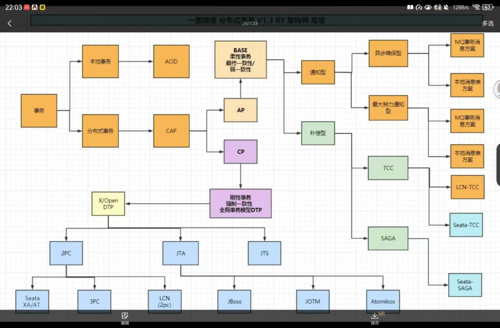
> 图：分布式事务 相关截图

**2PC 主要有三大缺点**：同步阻塞、单点故障和数据不一致问题

### TCC 的注意点

这几个点很关键，在实现的时候一定得注意了。
    

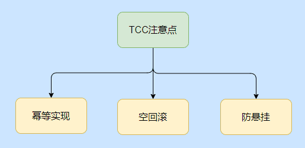
> 图：TCC 的注意点 相关截图

**幂等问题**，因为网络调用无法保证请求一定能到达，所以都会有重调机制，因此对于 Try、Confirm、Cancel 三个方法都需要幂等实现，避免重复执行产生错误。

**空回滚问题**，指的是 Try 方法由于网络问题没收到超时了，此时事务管理器就会发出 Cancel 命令，那么需要支持 Cancel  在未执行 Try 的情况下能正常的 Cancel。

**悬挂问题**，这个问题也是指 Try 方法由于网络阻塞超时触发了事务管理器发出了 Cancel 命令，**但是执行了 Cancel 命令之后 Try 请求到了，你说气不气**。

这都 Cancel 了你来个 Try，对于事务管理器来说这时候事务已经是结束了的，这冻结操作就被“悬挂”了，所以空回滚之后还得记录一下，防止 Try 的再调用。

### nginx高效原因

    

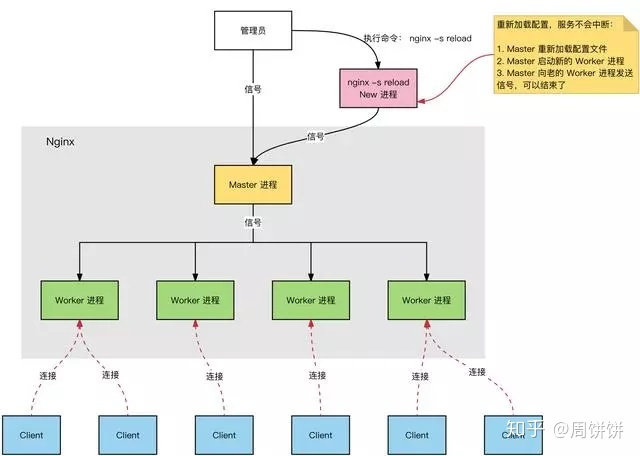
> 图：nginx高效原因 相关截图

- 多进程：一个 Master 进程、多个 Worker 进程

- Master 进程：管理 Worker 进程

- 对外接口：接收外部的操作（信号）

- 对内转发：根据外部的操作的不同，通过信号管理 Worker

- 监控：监控 worker 进程的运行状态，worker 进程异常终止后，自动重启 worker 进程

- Worker 进程：所有 Worker 进程都是平等的

- 实际处理：网络请求，由 Worker 进程处理；

- Worker 进程数量：在 nginx.conf 中配置，一般设置为核心数，充分利用 CPU 资源，同时，避免进程数量过多，避免进程竞争 CPU 资源，增加上下文切换的损耗。

## mmap
[https://zhuanlan.zhihu.com/p/526494418](https://zhuanlan.zhihu.com/p/526494418)

- 内存映射的读写操作主要的过程如下：

1. 创建虚拟映射区域，其在当前进程的虚拟地址空间中，寻找一段满足大小要求的虚拟地址，并且为此虚拟地址分配一个虚拟内存区域(vm_area_struct结构)，初始化该虚拟内存区域，插入到进程虚拟地址区域的链表和红黑树中

1. 实现地址映射关系，建立页表，该过程在mmap函数中并未实现，此时只是创建了映射关系，并不将任何文件数据拷贝至主存中，真正的数据拷贝是通过进程发起读写操作时

1. 进程访问该映射空间，实现文件内容到物理内存的数据拷贝，当进程读写访问该映射地址时，如果进程写操作改变了内容，并不会立即更新，而是一定时间后系统会自动会写脏数据到对应硬盘的地址空间

- 使用mmap来创建文件映射，由于只建立了进程地址空间VMA，并没有马上分配page cache和建立映射关系。那么就会导致一个问题，当创建一个很大的VMA，会频繁发生缺页中断。

1. 内存映射机制mmap是POSIX标准的系统调用，有匿名映射和文件映射两种。

1. 匿名映射使用进程的虚拟内存空间，它和malloc(3)类似，实际上有些malloc实现会使用mmap匿名映射分配内存，不过匿名映射不是POSIX标准中规定的。

1. 文件映射有MAP_PRIVATE和MAP_SHARED两种。前者使用COW的方式，把文件映射到当前的进程空间，修改操作不会改动源文件。后者直接把文件映射到当前的进程空间，所有的修改会直接反应到文件的page cache，然后由内核自动同步到映射文件上。

- 相比于IO函数调用，基于文件的mmap的一大优点是把文件映射到进程的地址空间，避免了数据从用户缓冲区到内核page cache缓冲区的复制过程；当然还有一个优点就是不需要频繁的read/write系统调用。

### 如何查看进程发生缺页中断的次数？

用ps -o majflt,minflt -C program命令查看。

majflt代表major fault，中文名-叫大错误，minflt代表minor fault，中文名叫小错误。

这两个数值表示一个进程自启动以来所发生的缺页中断的次数。

发成缺页中断后，执行了那些操作？

当一个进程发生缺页中断的时候，进程会陷入内核态，执行以下操作： 

1、检查要访问的虚拟地址是否合法 

2、查找/分配一个物理页 

3、填充物理页内容（读取磁盘，或者直接置0，或者啥也不干） 

4、建立映射关系（虚拟地址到物理地址） 

重新执行发生缺页中断的那条指令 

如果第3步，需要读取磁盘，那么这次缺页中断就是majflt，否则就是minflt。

## NGINX负载均衡策略有哪些
| 轮询（默认） | upstream backserver {  |
| -- | -- |
| 指定权重 | upstream backserver {  |
| IP绑定 ip_hash | upstream backserver {  |
| fair（第三方） | upstream backserver {  |
| url_hash（第三方） | upstream backserver {  |

## guava RateLimiter限流
平滑突发限流

RateLimiter由于会累积令牌，所以可以应对突发流量。在下面代码中，有一个请求会直接请求5个令牌，但是由于此时令牌桶中有累积的令牌，足以快速响应。  RateLimiter在没有足够令牌发放时，采用滞后处理的方式，也就是前一个请求获取令牌所需等待的时间由下一次请求来承受，也就是代替前一个请求进行等待。

平滑预热限流 计算图形面积

## 使用etcd实现分布式锁
基于raft 强一致

[https://zhuanlan.zhihu.com/p/369680338](https://zhuanlan.zhihu.com/p/369680338)

## nginx的负载均衡策略
**Nginx的upstream支持5种分配方式，下面将会详细介绍，其中前三种为Nginx原生支持的分配方式，后两种为第三方支持的分配方式。**

### 1、轮询

轮询是upstream的默认分配方式，即每个请求按照时间顺序轮流分配到不同的后端服务器，如果某个后端服务器down掉后，能自动剔除。

upstream backend {
    server 192.168.1.101:8888;
    server 192.168.1.102:8888;
    server 192.168.1.103:8888;
}

### 2、weight(权重比)

轮询的加强版，即可以指定轮询比率，weight和访问几率成正比，主要应用于后端服务器异质的场景下。

upstream backend {
    server 192.168.1.101 weight=1;
    server 192.168.1.102 weight=2;
    server 192.168.1.103 weight=3;
}

### 3、ip_hash

每个请求按照访问ip（即Nginx的前置服务器或者客户端IP）的hash结果分配，这样每个访客会固定访问一个后端服务器，可以解决session一致问题。

upstream backend {
    ip_hash;
    server 192.168.1.101:7777;
    server 192.168.1.102:8888;
    server 192.168.1.103:9999;
}

### 4、fair

fair顾名思义，公平地按照后端服务器的响应时间（rt）来分配请求，响应时间短即rt小的后端服务器优先分配请求。如果需要使用这种调度算法，必须下载Nginx的upstr_fair模块。

upstream backend {
    server 192.168.1.101;
    server 192.168.1.102;
    server 192.168.1.103;
    fair;
}

### 5、url_hash，目前用consistent_hash替代url_hash

与ip_hash类似，但是按照访问url的hash结果来分配请求，使得每个url定向到同一个后端服务器，主要应用于后端服务器为缓存时的场景下。

upstream backend {
    server 192.168.1.101;
    server 192.168.1.102;
    server 192.168.1.103;
    hash $request_uri;
    hash_method crc32;
}

其中，hash_method为使用的hash算法，需要注意的是：此时，server语句中不能加weight等参数。

提示：url_hash用途cache服务业务，memcached，squid，varnish。特点：每个rs都是不同的。

## Eureka
基于rest接口实现的注册，在系统启动的时候

Eurka 工作流程

了解完 Eureka 核心概念，自我保护机制，以及集群内的工作原理后，我们来整体梳理一下 Eureka 的工作流程：

1、Eureka Server 启动成功，等待服务端注册。在启动过程中如果配置了集群，集群之间定时通过 Replicate 同步注册表，每个 Eureka Server 都存在独立完整的服务注册表信息

2、Eureka Client 启动时根据配置的 Eureka Server 地址去注册中心注册服务

3、Eureka Client 会每 30s 向 Eureka Server 发送一次心跳请求，证明客户端服务正常

4、当 Eureka Server 90s 内没有收到 Eureka Client 的心跳，注册中心则认为该节点失效，会注销该实例

5、单位时间内 Eureka Server 统计到有大量的 Eureka Client 没有上送心跳，则认为可能为网络异常，进入自我保护机制，不再剔除没有上送心跳的客户端

6、当 Eureka Client 心跳请求恢复正常之后，Eureka Server 自动退出自我保护模式

7、Eureka Client 定时全量或者增量从注册中心获取服务注册表，并且将获取到的信息缓存到本地

8、服务调用时，Eureka Client 会先从本地缓存找寻调取的服务。如果获取不到，先从注册中心刷新注册表，再同步到本地缓存

9、Eureka Client 获取到目标服务器信息，发起服务调用

10、Eureka Client 程序关闭时向 Eureka Server 发送取消请求，Eureka Server 将实例从注册表中删除

这就是Eurka基本工作流程

## Nacos
[https://zhuanlan.zhihu.com/p/340564476](https://zhuanlan.zhihu.com/p/340564476)

[https://zhuanlan.zhihu.com/p/432534729](https://zhuanlan.zhihu.com/p/432534729)

## Zookeeper的watch机制
ZooKeeper 实现Watch机制是通过客户端和服务端分别创建有观察者的信息列表。

- 客户端调用 getData、exist 等接口时，首先将对应的 Watch 事件放到本地的 ZKWatchManager 中进行管理。

- 服务端在接收到客户端的请求后根据请求类型判断是否含有 Watch 事件，并将对应事件放到 WatchManager 中进行管理。

在「事件触发」的时候服务端通过节点的路径信息查询相应的 Watch 事件通知给客户端，客户端在接收到通知后，首先查询本地的 ZKWatchManager 获得对应的 Watch 信息处理回调操作。

「这种设计不但实现了一个分布式环境下的观察者模式，而且通过将客户端和服务端各自处理 Watch 事件所需要的额外信息分别保存在两端，减少彼此通信的内容，大大提升了服务的处理性能。」

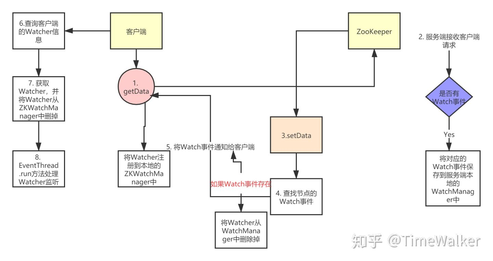
> 图：Zookeeper的watch机制 相关截图

## Quartz
[https://zhuanlan.zhihu.com/p/102934987](https://zhuanlan.zhihu.com/p/102934987)

Quartz的核心元素主要有Scheduler、Trigger、Job、JobDetail。其中

- Scheduler为调度器负责整个定时系统的调度，内部通过线程池进行调度，下文阐述。

- Trigger为触发器记录着调度任务的时间规则，主要有四种类型：SimpleTrigger、CronTrigger、DataIntervalTrigger、NthIncludedTrigger，在项目中常用的为：SimpleTrigger和CronTrigger。

- JobDetail为定时任务的信息载体，可以记录Job的名字、组及任务执行的具体类和任务执行所需要的参数

- Job为任务的真正执行体，承载着具体的业务逻辑。

元素之间的关系如下：

介绍：先由SchedulerFactory创建Scheduler调度器后，由调度器去调取即将执行的Trigger，执行时获取到对于的JobDetail信息，找到对应的Job类执行业务逻辑。

quartz中线程主要分为执行线程和调度线程。

- 执行线程主要由一个线程池维护，在需要执行定时的时候使用

- 调度线程主要分为regular Scheduler Thread和Misfire Scheduler Thread；其中Regular Thread 轮询Trigger，如果有将要触发的Trigger，则从任务线程池中获取一个空闲线程，然后执行与改Trigger关联的job；Misfire Thraed则是扫描所有的trigger，查看是否有错失的，如果有的话，根据一定的策略进行处理。

## Zookeeper 保证了如下分布式一致性特性
- 「顺序一致性」：从同一客户端发起的事务请求，最终将会严格地按照顺序被应用到 ZooKeeper 中去。

- 「原子性」：所有事务请求的处理结果在整个集群中所有机器上的应用情况是一致的，也就是说，要么整个集群中所有的机器都成功应用了某一个事务，要么都没有应用。

- 「单一视图」：无论客户端连到哪一个 ZooKeeper 服务器上，其看到的服务端数据模型都是一致的。

- 「可靠性：」 一旦服务端成功地应用了一个事务，并完成对客户端的响应，那么该事务所引起的服务端状态变更将会被一直保留下来。

- 「实时性（最终一致性）：」 Zookeeper 仅仅能保证在一定的时间段内，客户端最终一定能够从服务端上读取到最新的数据状态。

## 好用且轻量的鉴权框架 
[https://sa-token.dev33.cn/doc/index.html#/use/login-auth](https://sa-token.dev33.cn/doc/index.html#/use/login-auth)

## Trie树简介及应用

Trie树，即字典树，又称单词查找树或键树，是一种树形结构，典型应用是用于统计，排序和保存大量的字符串（但不仅限于字符串），所以经常被搜索引擎系统用于文本词频统计。它的优点是：利用字符串的公共前缀来减少查询时间，最大限度地减少无谓的字符串比较，查询效率比哈希树高。

## LSM Tree简介

首先要从索引结构更新的两种方式说起，一种是in-place updates, 另一种是out-of-place updates。

- In-place updates 会直接通过新的数据覆盖写旧的数据，来达到数据更新的目的。比如：B+ -tree 索引。

比如下图(a)：将(k1,V1) 的value v1更改为v4, 则直接覆盖修改就可以。

- Out-of-place updates 会追加新的记录，而不是直接覆盖原有记录。比如: LSM-tree

由以上两种数据更新方式，我们能够看到一些两者的对比差异：

- B+-tree 这样的更新方式对读友好，因为不论怎样读到的数据一定是最新的，不需要像LSM-tree 不断更新追加，在读的时候需要扫描到最新的记录才行

- B+ -tree 因为覆盖写方式， 在更新/删除 场景会造成一些空间碎片（不断的更新会有B+ -tree的分裂），从而一定程度降低了B+ -tree的空间利用率；当然LSM-tree传统实现则有空间放大问题，旧的数据得不到及时清理，仍然消耗存储空间。

1. 多个横跨内存和磁盘的树状数据结构构成的森林

1. 不同 level (一般来说也可以理解为新旧或冷热)数据分级，从 level-0 到 level-n ，一般只有 level-0 在内存中，其他的level通常落在磁盘上。

1. level-0 通常采用平衡的排序树、跳表或 TreeMap 等有序的数据结构，方便从内存顺序写到磁盘中。磁盘中的 level 本质是排序好后 appendonly 写到磁盘上的文件(也可以认为是中序遍历后的“树”)。

1. 定期归并，每层子树一般有一个阈值大小，达到阈值后会归并本 level 的块并到下一 level。

1. 通常只允许内存中的 level (一般特指 level-0 )原地更新，磁盘上不允许数据变更，而是选择采用 appendonly 的方式写日志。

[https://juejin.cn/post/7215485778029477946](https://juejin.cn/post/7215485778029477946)

## 布谷鸟过滤器

[https://blog.csdn.net/JavaShark/article/details/125542745](https://blog.csdn.net/JavaShark/article/details/125542745)

## OHC堆外内存

[https://zhuanlan.zhihu.com/p/345071202](https://zhuanlan.zhihu.com/p/345071202)

## JMH微基准测试

[https://zhuanlan.zhihu.com/p/396776578](https://zhuanlan.zhihu.com/p/396776578)

## RAID

RAID，即独立硬盘冗余阵列，将多块硬盘通过硬件RAID卡或者软件RAID的方案管理起来，使其共同对外提供服务。RAID的核心思路其实是利用文件系统将数据写入硬盘中不同数据块的特性，将多块硬盘上的空闲空间看做一个整体，进行数据写入，也就是说，一个文件的多个数据块可能写入多个硬盘。

根据硬盘组织和使用方式不同，常用RAID有五种，分别是RAID 0、RAID 1、RAID 10、RAID 5和RAID 6

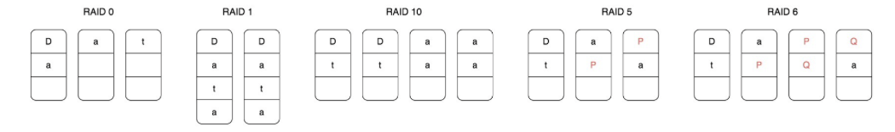
> 图：RAID 相关截图

RAID 0将一个文件的数据分成N片，同时向N个硬盘写入，这样单个文件可以存储在N个硬盘上，文件容量可以扩大N倍，（理论上）读写速度也可以扩大N倍。但是使用RAID 0的最大问题是文件数据分散在N块硬盘上，任何一块硬盘损坏，就会导致数据不完整，整个文件系统全部损坏，文件的可用性极大地降低了。

RAID 1则是利用两块硬盘进行数据备份，文件同时向两块硬盘写入，这样任何一块硬盘损坏都不会出现文件数据丢失的情况，文件的可用性得到提升。

RAID 10结合RAID 0和RAID 1，将多块硬盘进行两两分组，文件数据分成N片，每个分组写入一片，每个分组内的两块硬盘再进行数据备份。这样既扩大了文件的容量，又提高了文件的可用性。但是这种方式硬盘的利用率只有50%，有一半的硬盘被用来做数据备份。

RAID 5针对RAID 10硬盘浪费的情况，将数据分成N-1片，再利用这N-1片数据进行位运算，计算一片校验数据，然后将这N片数据写入N个硬盘。这样任何一块硬盘损坏，都可以利用校验片的数据和其他数据进行计算得到这片丢失的数据，而硬盘的利用率也提高到N-1/N。

RAID 5可以解决一块硬盘损坏后文件不可用的问题，那么如果两块文件损坏？RAID 6的解决方案是，用两种位运算校验算法计算两片校验数据，这样两块硬盘损坏还是可以计算得到丢失的数据片。

## TransmittableThreadLocal

用于在线程池中，实现ThreadLocal的功能

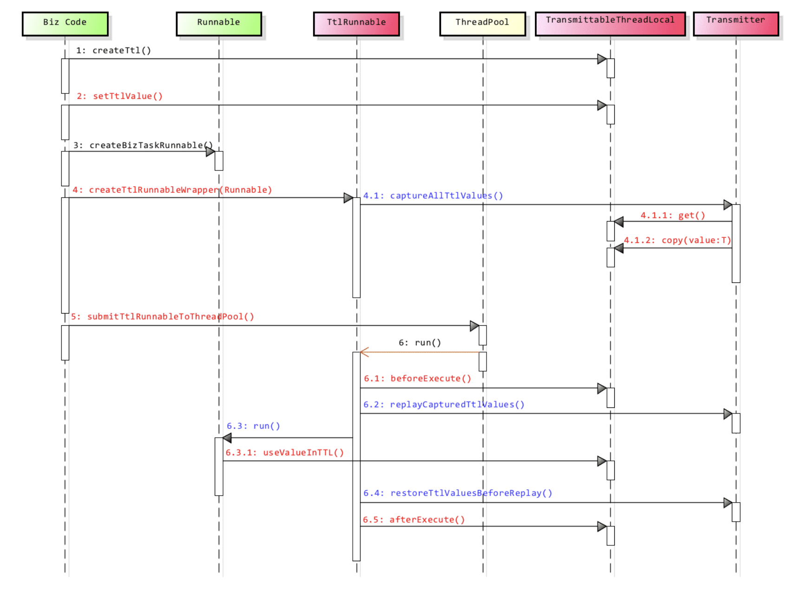
> 图：TransmittableThreadLocal 相关截图

## Bean SearcherGenericService

[https://bs.zhxu.cn/guide/latest/introduction.html](https://bs.zhxu.cn/guide/latest/introduction.html)

## 性能监控系统的实现

涉及到的一些重点技术

以下是关于 Attach、JVMTI、Instrumentation 和 JMX 的简要解释：

1. Attach：Attach 是一种用于在 Java 虚拟机（JVM）运行时连接到正在运行的 Java 进程的机制。通过 Attach 机制，可以在运行中的 JVM 上执行诸如监视、诊断、调试等操作，例如通过 Java Attach API 提供的接口来动态加载代理代理类、获取线程信息、监控内存使用等。这对于进行 JVM 内部状态的监控和调试非常有用。

1. JVMTI（Java Virtual Machine Tool Interface）：JVMTI 是一种用于与 Java 虚拟机（JVM）交互的编程接口。它允许开发者编写 Java 代理（Agent）程序，通过代理程序可以在 JVM 运行时监控和调试 Java 程序，例如在方法调用、对象创建和销毁、线程状态等方面进行监控和干预。JVMTI 提供了丰富的功能，用于开发 JVM 相关的工具和应用。

1. Instrumentation（Instrumentation API）：Instrumentation API 是 Java 提供的一组用于在运行时修改、监控和测量 Java 程序的工具。通过 Instrumentation API，开发者可以在 Java 程序启动前，以代理方式对类进行转换，从而实现对程序行为的监控、修改和控制。Instrumentation API 提供了一种在运行时修改 Java 类字节码的能力，从而实现一些高级的应用，如性能分析、代码覆盖率测试、字节码注入等。

Instrumentation API主要包括两个核心接口：instrument和retransform。其中，instrument接口允许在Java应用程序启动时，在类加载之前，对Java类的字节码进行修改，例如添加、删除、替换类的字段或方法等；retransform接口允许在Java应用程序运行时，对已经加载的Java类的字节码进行修改，例如修改类的字段值、替换方法的实现等。

1. JMX（Java Management Extensions）：JMX 是一套用于管理和监控 Java 应用程序的标准 API。它提供了一种在运行时监控和管理 Java 应用程序的方式，包括对应用程序内部状态的监控、配置和控制。JMX 可以用于监控和管理各种 Java 应用程序，包括服务器、中间件、框架等。通过 JMX，开发者可以通过远程或本地方式与运行中的 Java 应用程序进行交互，获取应用程序的运行时信息、配置参数、性能指标等，从而实现对应用程序的管理和监控。

这些技术在 Java 应用程序的监控、诊断、调试、性能优化等方面都具有重要作用，可以帮助开发者深入了解和管理运行中的 Java 应用程序的状态和行为。

## docker架构图

CLI 是 "Command-Line Interface" 的缩写，意为命令行界面

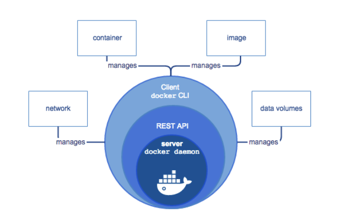
> 图：docker架构图 相关截图

## 计算机架构图

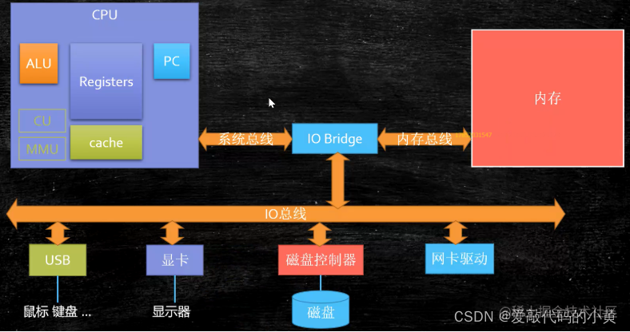
> 图：计算机架构图 相关截图

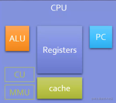
> 图：计算机架构图 相关截图

- PC（Programme Counter）：程序技术器当前指令的地址

- Registers：寄存器，暂时存储CPU计算需要的数据

- ALU（Arithmetic & logic Unit）：运算单元，做运算使用

- CU（Control Unit）：控制单元

- MMU（memory Mangagement unit）：内存处理单元

- Cache：缓存

 之前的CPU属于单核情况，这样的话，会只有一个 Registers，我们的 PC 会不断的进行切换来指向新的线程，将所对应的数据存放到 Registers，对于切换（context switch）而言，会严重影响我们的效率。

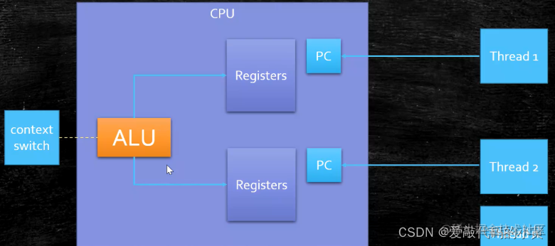
> 图：计算机架构图 相关截图

现在的CPU通常是多核状态，在进行计算时，我们会有两个以上 Registers，这样的话，我们的PC就不需要频繁的进行切换，我们的 ALU 处理计算的切换即可。

### 寄存器

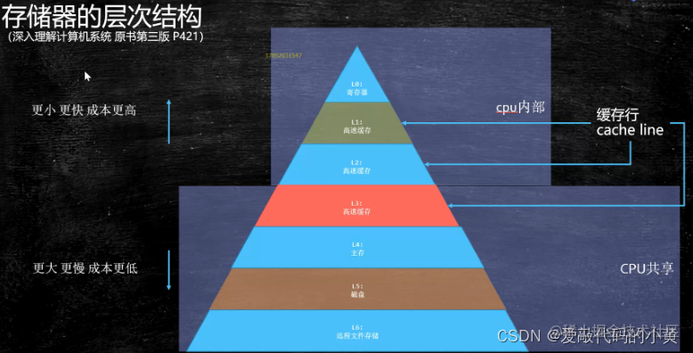
> 图：寄存器 相关截图

### Cache

我们通过上面的图可以看出，我们的计算机为了获取数据的方便性，增加了三级缓存，对于不同的缓存，获取的时间的长短也是不一样的 

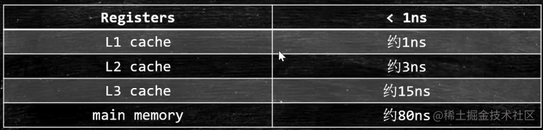
> 图：Cache 相关截图

对于多核CPU来说，如下图所示： 

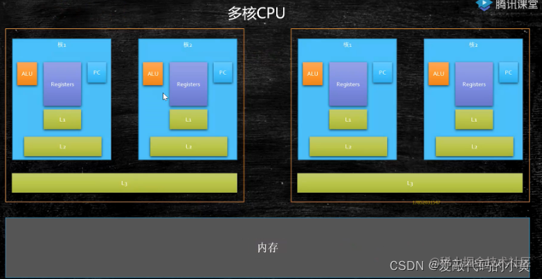
> 图：Cache 相关截图

- L1、L2存储在不同的核中

- L3存储在同一个 

CPU 中

局部性原理

简单来说，我们的CPU在读取数据时，将数据按快读取，不单独取一个字节，如下图所示：  当前的CPU需要 X这个目标值，步骤如下：

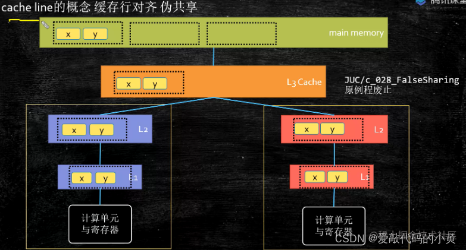
> 图：Cache 相关截图

- 第一步：去寄存器里寻找，有没有 

X 这个字段

- 第二步：去 

L1、L2、L3 Cache 去寻找 

X 这个字段

- 第三步：去内存、磁盘等寻找 

X 这个字段

- 第四步：找到后，

将以 X 开头的 64个字节 形成一个块

- 第五步：在 

L3、L2、L1 中分别存入这个数据，方便下次去拿缓存

- 第六步：将 

X 写入寄存器，进行数据处理、
### MESI Cache一致性协议
我们可以看到，对于上述两个核的 L1、L2 的缓存行要保持一致，保持一致的协议被称为：MESI 缓存一致性协议

CPU 每个 Cache line 标记四种状态

- M（已修改）：该 

Cache line 有效，数据被修改了，和内存中的数据不一致，数据只存在于本Cache中。

- E（独占）：该 

Cache line 有效，数据和内存中的数据一致，数据只存在于本Cache中。

- S（共享）：该 

Cache line 有效，数据和内存中的数据一致，数据存在于很多Cache中。

- I（无效）：

Cache line 是无效的 

因特尔——缓存行

- 缓存行越大，局部性空间效率越高，但读取时间慢

- 缓存行越小，局部性空间效率越低，但读取时间快

- 因特尔通过实验规定，缓存行的大小为：

64 字节

总线锁（缓存行装不下的情况下，就必须锁总线）

缓存锁实现之一，有些无法被缓存的数据或者跨越多个缓存行的数据，依然必须使用总线锁

我们怎么测试我们的猜想是正确的呢？

我们测试两个程序

篇幅受限，源码的话这里暂时不展示了，有兴趣的可以关注公众号，回复：算法源码

- 第一个程序：数值的更改在同一个缓存行 

- 第二个程序：数值的更改不在同一个缓存行  有上述程序验证我们的猜想，两个线程频繁的更快缓存区中的缓存快，导致运行时间加长
### 缓存行对齐
对于有些特别敏感的数字，会存在线程高竞争的访问，为了保证不发生伪共享，我们一般不要求缓存行对齐

简单来说，我们不希望我们获取 X 数字的同时，把 Y 也给获取进来

在我们 JDK7 和 disruptor 都采取long cache line padding

```java
public long p1, p2, p3, p4, p5, p6, p7; // cache line padding
private volatile long cursor = INITIAL_CURSOR_VALUE;
public long p8, p9, p10, p11, p12, p13, p14; //cache line padding
```

这样的话，当我们缓存行获取时，就会把 cursor 前面的 long 或者 后面的 long 加载到缓存块中，避免 cursor的缓存行对齐

在我们的 JDK8 中，我们可以给该参数加入 @Contended（根据底层的CPU来进行设定，保证不会让两个参数共享一个缓存行），需要加上  -XX:-RestrictContended 生效

## 在Linux下的文件存储系统

[https://zhuanlan.zhihu.com/p/571235218](https://zhuanlan.zhihu.com/p/571235218)

## nginx缓存

Nginx 的缓存是通过 ngx_http_proxy_module 模块和 ngx_http_fastcgi_module 模块来实现的，这两个模块允许 Nginx 作为反向代理服务器或 FastCGI 服务器来缓存 HTTP 响应。下面是 Nginx 缓存实现的主要步骤：

1. 配置缓存代理：

在 Nginx 的配置文件中，你需要定义一个缓存代理位置，以指定哪些请求应该被缓存以及缓存的存储位置。这通常在 location 指令中完成。例如：

```nginx
proxy_cache_path /path/to/cache levels=1:2 keys_zone=my_cache:10m max_size=10g inactive=60m;
server {
    location / {
        proxy_cache my_cache;
        proxy_pass 
    }
}

```

	- proxy_cache_path

	- proxy_cache

	- proxy_pass

1. 缓存键的生成：

缓存键是用来唯一标识缓存项的字符串，通常基于请求的 URL 和其他一些信息生成。你可以使用变量和指令来构建缓存键。例如：

```nginx
location / {
    proxy_cache my_cache;
    proxy_cache_key "$host$uri$is_args$args";
    proxy_pass 
}

```

在上面的例子中，proxy_cache_key 使用了请求的主机名、URI 和参数来生成缓存键。

1. 缓存存储：

当 Nginx接收到一个请求时，它会检查缓存，看是否已经有匹配的缓存项。如果有匹配项并且未过期，Nginx会直接返回缓存的响应，而不请求后端服务器。如果没有匹配项或者缓存项已经过期，Nginx会将请求发送给后端服务器，并在收到响应后将响应内容存储到缓存中。

1. 缓存过期策略：

缓存项通常有一个过期时间，可以通过配置项 proxy_cache_valid 来设置。例如：

```nginx
proxy_cache_valid 200 302 10m;
proxy_cache_valid 404      1m;

```

上述配置表示对于 200 和 302 响应，缓存将在 10 分钟后过期；对于 404 响应，缓存将在 1 分钟后过期。

1. 缓存清理和管理：

Nginx 提供了一些指令和工具来管理缓存，包括手动清除缓存项、设置缓存的最大大小、设置缓存的最大数量等。这些工具可以确保缓存不会无限增长并且可以手动刷新缓存。

通过这些步骤，Nginx 实现了一个灵活的缓存机制，可以帮助提高性能并降低后端服务器的负载。但需要注意的是，Nginx 缓存需要谨慎配置，以确保不会缓存不应该缓存的敏感数据，同时也需要考虑缓存的过期策略，以确保缓存数据的时效性。

## HTTP请求的缓存

下图是强制缓存和协商缓存的工作流程：

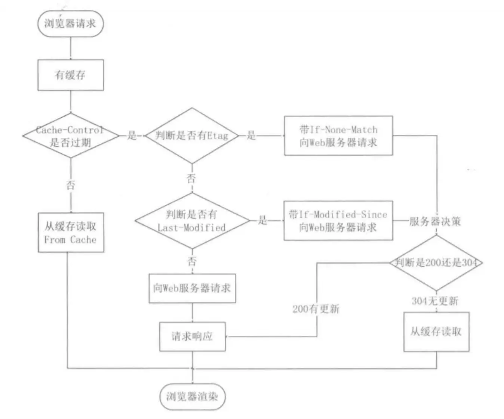
> 图：HTTP请求的缓存 相关截图

## CDC

CDC（Change Data Capture，变更数据捕获）是一种数据库技术，用于跟踪和捕获数据库中数据的变化，从而实现实时或近实时的数据同步。CDC 技术在数据集成、数据复制、数据仓库、实时数据分析等多个领域都有广泛应用。

CDC 的基本概念

CDC 的主要目的是捕获数据库中的更改事件，这些事件包括：

插入（Insert）

更新（Update）

删除（Delete）

CDC 的工作原理

CDC 通常通过以下几种方式来实现：

基于日志（Log-based）：

归档日志（Archived Logs）：读取数据库的归档日志（例如 Oracle 的归档日志）来捕获更改。

重做日志（Redo Logs）：读取数据库的重做日志（例如 MySQL 的 Binlog）来捕获更改。

事务日志（Transaction Logs）：读取数据库的事务日志（例如 SQL Server 的事务日志）来捕获更改。

基于触发器（Trigger-based）：

在数据库中创建触发器（Triggers），每当数据发生变化时，触发器会捕获变化并记录到一个专门的表（Audit Table）中。

基于快照（Snapshot-based）：

定期生成数据库表的快照（Snapshot），通过比较前后两次快照来发现变化。

基于数据库 API（API-based）：

一些现代数据库提供了专门的 API，可以直接捕获数据变化事件。

CDC 的应用场景

CDC 在多个场景中都有广泛的应用，包括但不限于：

数据仓库：实时捕获源系统的数据变化，并同步到数据仓库中。

实时数据处理：将数据库中的变化数据实时传递给实时处理引擎（如 Apache Kafka、Apache Flink）进行处理。

数据同步：将数据变化同步到其他数据库或应用中，实现数据的实时复制。

数据订阅：将数据变化作为事件发布出去，供其他系统订阅。

CDC 工具和技术

目前市场上有许多工具和技术支持 CDC，包括：

Debezium：一个开源的分布式平台，支持多种数据库（如 MySQL、PostgreSQL、MongoDB 等）的 CDC。

Oracle GoldenGate：Oracle 提供的企业级数据复制解决方案，支持多种数据库的 CDC。

SQL Server Change Data Capture：Microsoft SQL Server 内置的 CDC 功能。

MySQL Binlog：MySQL 的二进制日志（Binlog）支持 CDC。

阿里云 DataHub：阿里云提供的实时数据接入和处理服务，支持 CDC。

Amazon RDS Change Data Capture：AWS 提供的 RDS 数据库服务中的 CDC 功能。

## 数据中心同步

Otter、Canal联合起来使用，用于两个mysql数据库的实时同步，简单通俗地说就是，源mysql一旦有变更动作（也就是操作日志），就传递给Canal，Canal再传递给Otter，Otter再在目标mysql里重做该动作，由于双方做了相同动作，双方就一致。这种传递-重做的过程一直在进行，双方就一直相同。DataX则不同，它是直接读取源库的数据，并写入目标库，从而使双方一致。这种动作执行完成后，程序就退出了，如果以后需要再同步，需要再执行一次。Otter, Canal, DataX都是开源软件，优点是免费，但缺点是需要java开发人员安装配置，需要编写各种语句，非常复杂。如果你不是技术人员，又想做数据库同步，可以使用华创DBSync，是一款windows成品软件，简单易用，能同步各种数据库，不需要编写任何语句。

## Istio

Istio 是目前主流的 Service Mesh 开源框架

## 存储引擎常用的数据结构

### LSM-Tree（Log-Structured Merge-Tree）

核心思想：将随机写转化为顺序写，通过分层合并（Compaction）优化读性能。

结构特点：

内存层（MemTable）：写入先到内存（有序结构如跳表），写满后转为 Immutable MemTable。

磁盘层（SSTables）：内存数据刷到磁盘形成多个有序文件（Sorted String Table），通过多层级合并（Leveled或Tiered Compaction）减少文件数量。

优点：高写入吞吐、顺序I/O友好、适合写多读少场景。

缺点：读放大（需查多级文件）、Compaction 可能引起写停顿。

典型应用：Cassandra、RocksDB、LevelDB、HBase。

### B-Tree（Balanced Tree）

核心思想：基于磁盘优化的平衡搜索树，支持高效随机读写。

结构特点：

节点大小通常等于磁盘页（如4KB），减少I/O次数。

通过分裂和合并维持树平衡，保证操作复杂度为 O(log N)。

优缺点：

优点：读性能稳定、支持范围查询和事务（MVCC+锁机制）。

缺点：写放大（更新需写整页）、随机写性能差（需维护WAL日志）。

典型应用：MySQL InnoDB、PostgreSQL、Oracle

### Bitcask（日志型哈希索引）

核心思想：基于追加写日志（Append-Only Log）和内存哈希表，简化写流程。

结构特点：

写入：数据追加到日志文件，内存哈希表记录键值的位置。

读取：通过内存哈希表直接定位磁盘位置。

合并：定期合并旧日志文件，回收无效数据。

优缺点：

优点：写入极快（顺序写）、故障恢复简单（重放日志）。

缺点：内存占用高（需全量键值索引）、范围查询效率低。

典型应用：Riak KV、早期版本的Dynamo。

## 在dubbo中，两个协议的对比

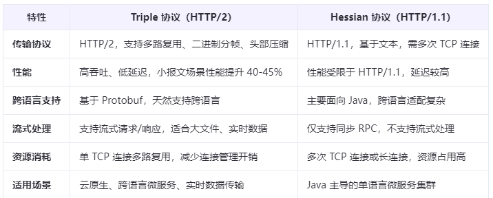
> 图：在dubbo中，两个协议的对比 相关截图

## 五种主流的API架构风格

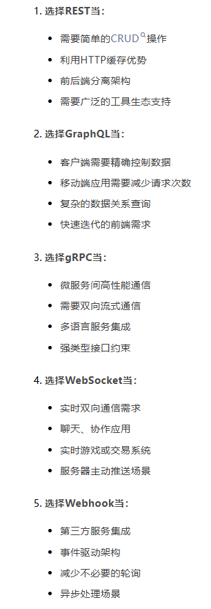
> 图：五种主流的API架构风格 相关截图

## 补充：未覆盖框架与技术选型

### Spring Cloud Alibaba 生态

与 Netflix 套件（Eureka/Hystrix 停更）互补：Nacos（注册中心+配置中心二合一）、Sentinel（流控熔断）、Seata（分布式事务）、RocketMQ（消息）。相较 Spring Cloud Netflix，Alibaba 在国内落地更顺、组件活跃。

### Seata 分布式事务

- **AT 模式**：自动生成前后镜像 + 全局锁，对业务无侵入，基于 undo_log 回滚；适合大部分场景。
- **TCC 模式**：手工编码 Try/Confirm/Cancel，无全局锁、性能高但侵入强。
- **Saga 模式**：长事务用状态机编排，补偿型。

### ShardingSphere（分库分表中间件）

- `ShardingSphere-JDBC`：jar 包形式，SQL 解析→路由→归并，对应用侵入小；
- `ShardingSphere-Proxy`：独立代理，异构语言可用。
- 能力：分库分表、读写分离、加密、影子库（压测引流）。

### RPC 框架对比：Dubbo vs gRPC

| 维度 | Dubbo | gRPC |
| --- | --- | --- |
| 协议 | Dubbo/ Triple(基于HTTP/2) | HTTP/2 + ProtoBuf |
| 序列化 | Hessian2/JSON/FastJson | Protobuf（强 schema） |
| 服务治理 | 完善（注册中心/路由/限流） | 较弱，需配生态 |
| 跨语言 | 一般 | 一等公民 |

选型：内部 Java 体系重治理选 Dubbo；跨语言/高性能契约选 gRPC。

### 配置中心对比

- **Nacos**：AP/CP 可切，配置+注册一体；
- **Apollo**：配置维度完善（灰度/发布审计/多环境），Java 生态强；
- **etcd/Consul**：强一致 KV，偏基础设施。

### 数据同步与调度

- **Canal / Debezium**：基于 MySQL binlog 的 CDC，用于缓存刷新、异构同步、MQ 投递。
- **ElasticJob / XXL-JOB**：分布式调度；XXL-JOB 轻量中心化，ElasticJob 基于 ZK 分片弹性。
- **Prometheus + Grafana**：拉模型监控，适合云原生；Alertmanager 告警。

### 技术选型原则

- 先问"是否必要"，避免过早引入中间件（奥卡姆剃刀）；
- 优先社区活跃、文档完善、团队熟悉的组件；
- 关注可观测性、运维成本、故障边界；用绞杀者模式渐进替换旧系统。

---

# 第二轮深度优化：gRPC / Netty / Hibernate·JPA / Quarkus 简介与对比

> 前文已述 Dubbo vs gRPC 概要、配置中心、数据同步与调度，本节深入并补齐 Netty / Hibernate / JPA / Quarkus。

## 一、Netty 应用（高性能网络框架）

- **Reactor 模型**：`BossGroup`（accept 连接）+ `WorkerGroup`（读写为 Channel 处理），主从多线程 Reactor；基于 JDK NIO（`Selector` / `SocketChannel`），比裸 NIO 更易用。
- **核心概念**：`Channel`（连接抽象）、`ChannelPipeline`（责任链，`ChannelHandler` 有序处理入站/出站）、`ByteBuf`（零拷贝友好、读写双指针、引用计数）、`EventLoop`（绑定线程，单线程处理多个 Channel 事件）。
- **粘包/拆包**：TCP 流式无边界，Netty 提供 `LineBasedFrameDecoder`（按行）、`DelimiterBased`（分隔符）、`LengthFieldBasedFrameDecoder`（长度字段）解决。
- **心跳与空闲**：`IdleStateHandler` 检测读/写空闲，触发 `userEventTriggered` 发心跳或断连；`writeBufferWaterMark` 做写背压（水位超限停止写）。
- **实战**：RPC（Dubbo/gRPC 底层）、IM、网关、代理都用 Netty；注意 `ByteBuf` 用完 `release()` 防泄漏，`ctx.flush()` 才真正写出。

## 二、gRPC 深入

- **契约优先**：用 `.proto` 定义 service 与 message（强 schema），`protoc` 生成多语言 stub。序列化用 **Protobuf**（二进制、体积小、速度快）。
- **传输**：HTTP/2 多路复用（单连接并发多 stream，无队头阻塞）；支持四种模式：一元（Unary）、服务端流、客户端流、双向流。
- **拦截器**：`ClientInterceptor` / `ServerInterceptor` 统一做鉴权、链路追踪、限流（如注入 traceId）。
- **生态短板**：服务发现/限流/熔断需配 sidecar 或上层框架；跨语言强，但浏览器直连需 grpc-web 网关。
- **对比 Dubbo**：前文已比协议/序列化/治理；补充——Dubbo 体系治理完善（注册中心/路由/限流开箱），gRPC 更轻、契约强、跨语言一等公民。

## 三、Hibernate / JPA（与 MyBatis 对比）

- **JPA**（规范）+ **Hibernate**（最主流实现）：ORM 全自动，`@Entity` 映射表，用 JPQL / `Criteria` 面向对象查询，**屏蔽 SQL**；提供一级/二级缓存、脏检查（dirty checking）、懒加载（`LAZY`）。
- **对比 MyBatis**：
  - MyBatis：半自动，手写 SQL，灵活可控、易优化，复杂查询/高性能场景占优；学习成本低。
  - Hibernate：全自动，开发快、对象化，但**复杂 SQL 难调优**、N+1、缓存一致性易坑；适合 CRUD 为主、对象模型稳定的业务。
- **N+1 问题**：关联懒加载循环查询；用 `JOIN FETCH` / `EntityGraph` / 批量（`@BatchSize`）解决；Spring Data JPA 的 `@EntityGraph` 指定抓取策略。
- **选型**：报表/复杂联表/极致性能 → MyBatis；标准 CRUD 业务、重对象模型 → JPA/Hibernate；也可混用（JPA 管写、MyBatis 管复杂读）。

## 四、Quarkus（云原生 Java）

- **定位**："Supersonic Subatomic Java"——为容器/Serverless 优化。构建期（build-time）尽量多做（CDI 注入、配置解析），运行时极轻、启动毫秒级、内存低。
- **原生镜像**：基于 GraalVM `native-image` 把 Java 编译为原生可执行文件，**启动快、内存小、无 JIT 预热**，适合 Serverless / FaaS / 短生命周期容器；代价：反射/动态代理需显式注册（`reflect-config`），部分库不兼容原生。
- **特性**：内置扩展（Hibernate、Panache、RESTEasy、Kafka、Redis），Dev Services 自动起依赖（如测试时自动起 PG 容器）；与 Kubernetes 亲和。
- **对比 Spring Boot**：开发体验与生态 Spring 更成熟；Quarkus 在原生镜像/云原生指标上领先。新项目若强调容器密度与冷启动，可评估 Quarkus。

## 五、框架选型对比速查

| 框架 | 定位 | 强项 | 弱项 | 适用 |
| --- | --- | --- | --- | --- |
| MyBatis | 半自动 ORM | SQL 可控、易优化 | 样板代码多 | 复杂查询/高性能 |
| Hibernate/JPA | 全自动 ORM | 开发快、对象化 | 复杂 SQL 难调、N+1 | 标准 CRUD |
| Netty | 网络框架 | 高并发、低延迟 | 需自建协议/业务 | RPC/网关/IM |
| gRPC | RPC | 跨语言、强契约、流式 | 治理需配套 | 内部高性能契约 |
| Dubbo | RPC | 治理完善 | 跨语言一般 | Java 体系重治理 |
| Quarkus | 云原生框架 | 原生镜像、启动快 | 生态较新 | 容器/Serverless |

## 六、Spring Cloud 生态

- 注册/发现：Eureka / Nacos / Consul；网关：**Spring Cloud Gateway**（基于 WebFlux 响应式，优于 Zuul）；熔断：**Resilience4j** / Sentinel；配置：Config / Nacos / Apollo；声明式调用：**OpenFeign**（注解即 HTTP 客户端，集成负载均衡与熔断）。
- **对比 Dubbo**：Spring Cloud 全家桶但 RPC 性能与治理精细度弱于 Dubbo；Dubbo 重 RPC 治理（路由/限流/分组），Cloud 重"开箱即用"生态；二者可通过 Dubbo 提供的 Spring Cloud 适配共存。

## 七、流处理：Flink / Kafka Streams

- **Flink**：有状态流计算，精确一次（checkpoint + 两阶段提交 Sink），窗口/CEP/状态后端（RocksDB）；适合实时数仓、风控、实时聚合。
- **Kafka Streams**：轻量库，嵌应用内做流处理，与 Kafka 紧耦合，无独立集群；适合中等复杂度流任务。
- 对比：Flink 能力全、运维重；Kafka Streams 轻、绑定 Kafka。

## 八、容器与编排：Docker / K8s 简述

- **Docker**：镜像分层（copy-on-write）、容器（namespace 隔离 + cgroup 限额）；镜像小化（distroless/alpine）、多阶段构建（编译与运行分离）。
- **K8s**：Pod / Deployment / Service / Ingress；自愈、滚动发布、HPA 自动扩缩；探针 `liveness`（存活）/ `readiness`（就绪）控制流量；ConfigMap/Secret 管配置与密钥。

## 九、可观测性深入

- **日志**：ELK / Loki，结构化（JSON）、采集（Filebeat/Fluentd）、检索；**指标**：Prometheus（拉模型 + Exporter）、Grafana 展示；**链路**：OpenTelemetry 标准，Jaeger / SkyWalking；三者靠 `traceId`/`spanId` 关联，形成"一请求全链路透视"。

## 十、Spring 与 Jakarta / 选型再述

- **Jakarta EE**：Java EE 捐给 Eclipse 后改名，包名 `javax.*` → `jakarta.*`（Spring Boot 3 必须 Jakarta）。升级老项目注意 `import javax.persistence` 等要改。
- **框架选型再述**：没有"最好框架"，只有"最合场景"。重治理 Java 内选 Dubbo/Spring Cloud；跨语言高性能契约选 gRPC；对象模型重选 JPA；复杂查询/性能选 MyBatis；云原生密度选 Quarkus；高并发网络自研选 Netty。
- **隐性成本**：每个引入的组件都带来部署、监控、排障、升级负担；能用简单方案解决的别引重型武器，用"绞杀者模式"渐进替换旧系统。
