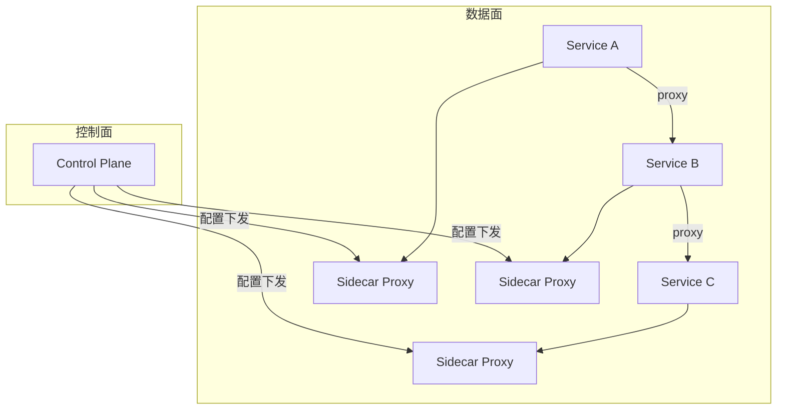

# 分布式系统实战（时钟与顺序 / 一致性模型 / 复制分区 / 共识算法 / 分布式事务 / 锁·ID·幂等·限流）

> 分布式系统的所有难题，根源就四个词：**没有全局时钟、网络会丢会慢、节点会挂、脑裂会来**。
> 本篇在原有 CAP/Raft/分布式锁/ID/缓存/幂等基础上，**补全最容易被忽略却最关键的底层**：逻辑时钟与顺序、一致性模型全谱系、复制与分区模型、Quorum 与反熵、Paxos/PBFT 共识、2PC/3PC/TCC/Saga 理论、容错与租约，形成完整知识网。

---

## 一、分布式系统的本质难题

```text
1) 时钟：各节点物理时钟无法完美同步（NTP 误差毫秒级，跨地域更大）。
2) 网络：消息可能延迟、丢失、重复、乱序（异步网络，FLP 不可能定理：异步下无法在有限时间检测故障）。
3) 故障：节点随时崩溃、重启、磁盘坏；拜占庭故障（节点作恶/数据被篡改）更棘手。
4) 脑裂：网络分区导致原主与新主同时存在（split-brain）。
```

> 因此，**不能依赖"本地时间先后"判断事件全局顺序**——必须靠逻辑时钟或共识。

---

## 二、时间与顺序

### 2.1 Lamport 逻辑时钟

```text
规则：
- 本地事件：counter++
- 发消息：附上当前 counter
- 收消息：counter = max(本地, 收到值) + 1
性质：若 A → B（hb），则 C(A) < C(B)；但 C(A) < C(B) 不能反推 A → B（仅偏序）。
```

### 2.2 向量时钟（Vector Clock）

```text
每个节点维护向量 V[i]，记录"我对各节点的已知最大计数"。
事件可比：V 全 ≤ W ⇒ 确定因果序；存在分量一大于一小于 ⇒ 并发冲突。
典型用途：Dynamo/Cassandra 检测"写冲突"（并发写需应用层合并）。
```

### 2.3 TrueTime 与 HLC

```text
TrueTime（Google Spanner）：GPS+原子钟提供有界误差时钟 [earliest, latest]，
  用不确定性窗口提交，实现"外部一致性"（线性一致）强事务。
HLC（Hybrid Logical Clock）：物理时间 + 逻辑计数，兼顾因果序与可读时间戳。
```

---

## 三、一致性模型（全谱系）

```text
强 ←──────────────────────────────────────→ 弱
线性一致   顺序一致   因果一致   前缀一致   最终一致
(Linearizable)(Sequential)(Causal)  (Monotonic)(Eventual)

线性一致(Linearizable)：等价于"单副本顺序执行"，读一定看到最新写（最强，性能最差）。
顺序一致：各节点看到的操作顺序相同，但不必是真实时间顺序。
因果一致：有因果关系的操作保序（A 回复 B 则看到 A），无因果的并发可乱。
最终一致：无新写后，最终所有副本一致（DNS/缓存典型，需处理"中间态不一致"）。
```

| 一致性变体（最终一致子族） | 保证 |
|--------------------------|------|
| 读己之写（Read-Your-Writes） | 自己写后总能读到 |
| 单调读（Monotonic Read） | 不会读到更旧的值 |
| 单调写（Monotonic Write） | 写按顺序生效 |
| 一致前缀读 | 不会读到"前半旧后半新"的因果断裂 |

> 选型：金融账务要线性一致（事务+共识）；评论/ Feed 流可接受因果或最终一致（换性能与可用）。

---

## 四、CAP 与 BASE

### 4.1 CAP 定理

```text
一致性(C) / 可用性(A) / 分区容错(P) 三者不可兼得 —— 网络分区(P)必选，故 C 与 A 二选一。
- CP：保一致，分区时拒绝部分请求（ZooKeeper/etcd/HBase）。
- AP：保可用，分区时返回旧数据（Cassandra/Dynamo/Riak）。
```

### 4.2 BASE 理论

```text
Basically Available（基本可用）+ Soft state（软状态）+ Eventually consistent（最终一致）。
是对 CAP 中 AP 系统的工程化描述：接受短暂不一致，换取高可用与分区容忍。
```

---

## 五、复制（Replication）

```text
主从复制（Leader-Follower）：
- 同步复制：主等所有从确认，强一致但慢/怕从挂。
- 异步复制：主写本地即返回，从异步追，快但可能丢（主挂时）。
- 半同步：主等至少一个从确认（折中，主流 DB 默认）。

多主复制：多节点都可写，需解决写冲突（冲突检测/合并）。
无主复制（Dynamo 风格）：客户端写多个副本，读多个版本合并（Quorum）。
```

> 复制延迟引发的问题靠"读己之写/单调读/一致前缀"等保证缓解（见第三节）。

---

## 六、分区（Partition / Sharding）

```text
分区目的：数据量/吞吐超出单节点 → 拆分到多节点。
- 范围分区：按 key 区间（易范围查询，易热点）。
- 哈希分区：hash(key) % N（均匀，难范围查询）。
- 一致性哈希：哈希环 + 虚拟节点，节点增删仅迁移 1/N 数据（扩缩容友好）。
```

> 与「分库分表与数据迁移」板块联动（ShardingSphere 路由、平滑扩容实战）。

---

## 七、Quorum、反熵与 Hinted Handoff

```text
NWR 模型：N=副本数, W=写成功数, R=读成功数。
- W+R > N ⇒ 读写必相交 ⇒ 强一致读（如 W=2,R=2,N=3）。
- W=1,R=1 ⇒ 最终一致（高性能）。
Sloppy Quorum：临时写入健康节点，原节点恢复后"hinted handoff"回传。
Read Repair：读时检测版本陈旧，异步修复。
Merkle Tree（反熵）：各节点对数据分块算哈希树，只同步差异块（高效对账）。
```

---

## 八、共识算法

> 共识 = 让多个节点对"某值/某日志顺序"达成一致，即使部分节点故障。

### 8.1 Paxos（Lamport）

```text
角色：Proposer / Acceptor / Learner。
两阶段：
- Prepare(n) → Acceptor 承诺不接收 <n 的提案，并返回已接受的最大值。
- Accept(n, v) → 若 n 仍是最大，Acceptor 接受。
Multi-Paxos：选稳定 Leader 后省略 Prepare，退化为类 Raft 日志复制。
难点：难理解、活锁（竞争提案号），工程多用 Raft。
```

### 8.2 Raft（易于理解）

```text
三个核心子问题：Leader 选举、日志复制、安全性。
- 任期(Term)单调递增；节点角色 Follower/Candidate/Leader。
- 选举：超时触发，拉票需多数，同任期一节点一票。
- 日志复制：Leader AppendEntries 广播，多数确认即提交。
- 安全性：选举限制（只有含全部已提交日志者能当选）、日志匹配、提交位置约束。
```

### 8.3 Zab（ZooKeeper）与 PBFT

```text
Zab：为 ZK 设计，类似 Raft，强 Leader + 事务原子广播（zxid 全局有序）。
PBFT（实用拜占庭容错）：容忍 f 个作恶节点需 3f+1 个节点，三阶段(预准备/准备/提交)，
  用于区块链/联盟链/需防内部作恶场景；普通分布式系统用 Crash Fault Tolerant（Raft）即可。
```

| 算法 | 容错模型 | 工程代表 | 特点 |
|------|----------|----------|------|
| Paxos | Crash | Chubby/Multi-Paxos | 理论基石，难实现 |
| Raft | Crash | etcd/Consul/TiKV | 易理解，主流 |
| Zab | Crash | ZooKeeper | ZK 事务广播 |
| PBFT | Byzantine | 联盟链/Hyperledger | 防作恶，开销大 |
| VR/Viewstamped | Crash | 早期系统 | Raft 前身 |

---

## 九、分布式事务

### 9.1 两阶段提交（2PC）

```text
阶段一(投票)：协调者问所有参与者"能否提交"，参与者锁资源并回答 Yes/No。
阶段二(提交)：全 Yes ⇒ 提交；任一 No ⇒ 回滚。
缺点：
- 同步阻塞（全程持锁）；
- 协调者单点（它挂了参与者一直阻塞）；
- 数据不一致（提交阶段部分参与者收不到指令）。
```

### 9.2 三阶段提交（3PC）

```text
在 2PC 前加 CanCommit（预询问，不锁资源），并把提交拆成 PreCommit/DoCommit。
引入超时机制减少阻塞；仍无法彻底解决网络分区下的不一致，且实现复杂，工程少用。
```

### 9.3 TCC / Saga（业务层补偿）

```text
TCC：Try(预留资源) → Confirm(确认)/Cancel(释放)。强隔离，代码侵入大，适合核心交易。
Saga：长事务拆为本地事务序列，任一步失败则反向执行补偿（向后恢复）。
     编排式(Choreography, 事件驱动) vs 编排式(Orchestrator 中心协调)。
本地消息表 / 事务消息：本地事务+消息表，异步最终一致（RocketMQ 事务消息）。
```

> 与「分库分表与数据迁移/04-分布式事务」「业务模型/金融」联动。选型：**强一致用 2PC/Seata AT，高性能用 TCC/Saga/事务消息**。

---

## 十、分布式锁（全方案对比）

### 10.1 方案对比

| 方案 | 优点 | 缺点 | 适用 |
|------|------|------|------|
| 数据库唯一索引 | 简单 | 无自动续期、DB 压力 | 低频 |
| Redis SET NX + 过期 | 高性能 | 需处理过期/误删/时钟 | 高频、可容忍极小误差 |
| Redlock | 多节点容错 | Martin 争议（需 fencing） | 强安全场景慎用 |
| ZooKeeper 临时节点 | 会话断自动释放、顺序节点 | 依赖 ZK 集群 | 协调类 |
| etcd Lease | 租约自动过期、Watch | 依赖 etcd | K8s 生态 |

### 10.2 安全三要素与 Fencing

```text
1) 互斥：同一时刻只有一个持有者。
2) 不死锁：持有者崩溃后锁能自动释放（过期/租约/临时节点）。
3) 容错：部分节点故障仍能加锁。
Fencing Token：锁带单调递增令牌，处理"旧持有者过期后仍在跑并写数据"——下游校验令牌，旧者写入被拒。
```

> 防误删：用唯一 value（UUID）+ Lua 原子释放：`if redis.call('get',KEYS[1])==ARGV[1] then return redis.call('del',KEYS[1]) end`

---

## 十一、分布式 ID 选型

```text
雪花算法 Snowflake：41 位时间戳 + 10 位机器 + 12 位序列（毫秒 4096 个）。
  - 痛点：时钟回拨（闰秒/手工校时）→ 冲突；解决：回拨检测+等待/借位。
号段模式 Leaf-Segment：DB/号段批量取，本地自增，DB 压力大降；双 buffer 预取防抖动。
趋势递增 vs UUID：前者利于 B+ 树索引顺序写，后者无序但无中心化。
```

---

## 十二、分布式缓存策略

```text
缓存模式：
- Cache-Aside：读时回填、写时更新+删缓存（最常用）。
- Read/Write-Through：缓存层代理读写。
- Write-Behind：异步写回，高性能高风险。
一致性：延迟双删、binlog 订阅(Canal)失效、版本号。
三大问题：缓存穿透(空值/布隆)、击穿(热点 key 互斥重建)、雪崩(随机过期+多级)。
多级缓存：本地(Caffeine) → Redis → DB，抗热点。
```

---

## 十三、幂等设计（全链路）

```text
为什么：网络重试、MQ 重投、浏览器重复提交都会造成"重复操作"。
方案：
- 天然幂等：GET、SELECT。
- 去重表/唯一索引：防重复插入（订单号唯一）。
- 状态机：仅允许合法状态流转（已支付不可再支付）。
- Token 机制：提交前领 token，提交校验一次。
- MQ 消费幂等：msgId 去重表、业务唯一键。
```

---

## 十四、分布式限流

```text
单机：计数器/滑动窗口/令牌桶/漏桶。
分布式：集中计数（Redis+Lua）、网关层(Sentinel/Envoy)、配额(Quota)按租户。
算法对比：
- 计数器：简单，临界突刺问题。
- 滑动窗口：平滑，内存稍多。
- 令牌桶：允许突发（桶满），常用于入口限流。
- 漏桶：恒定速率，削峰填谷。
```

> 与「SRE 与稳定性工程」「场景设计/雪崩」联动：限流+熔断+降级=稳定性三板斧。

---

## 十五、容错、租约与脑裂防护

```text
故障检测：心跳 + Phi-accrual（基于历史动态判定疑似失败，减少误判）。
超时与重试：重试必须幂等 + 指数退避 + 抖动（防重试风暴）。
熔断：错误率超阈值则快速失败（半开探测恢复），见 Hystrix/Sentinel。
降级：核心保底，非核心返回默认值/排队。
租约(Lease)：中心节点定期续约授权（如 etcd/Chubby），过期自动失效 → 防脑裂。
脑裂防护：Quorum（少数派拒绝写）+ Fencing Token（旧主写入被拒）。
```

---

## 十六、典型系统剖析（与中间件板块呼应）

| 系统 | 核心思想 |
|------|----------|
| GFS / HDFS | 中心 Master + 多 Chunk/DN，大文件切块多副本 |
| Bigtable / HBase | 列式 + 有序分区 + WAL + LSM-Tree |
| Dynamo / Cassandra | 一致性哈希 + 无主复制 + Quorum + 向量时钟 |
| Spanner | TrueTime + 多副本 Paxos + 外部一致事务 |
| ZooKeeper / etcd | Zab/Raft 共识 + 顺序一致 + 强 Leader |
| Kafka | 分区 + ISR + 顺序写 + 多副本（见中间件板块） |

---

## 十七、CAP 定理实践意义

### 17.1 CAP 不是理论选择题

```text
CAP 定理实际含义：
  - 网络分区（P）必然发生（物理定律不可抗）
  - 真正选择是：分区发生时，保 C 还是 A
  - CP 系统：分区时拒绝部分请求（ZooKeeper/etcd/HBase）
  - AP 系统：分区时返回旧数据（Cassandra/DynamoDB）

工程实践：
  - 同一系统不同模块可选择不同策略
  - 读操作可以 AP（返回缓存），写操作必须 CP
  - 大部分系统是 AP + 最终一致（BASE）
```

### 17.2 CAP 实战权衡

| 场景 | 选择 | 原因 |
|------|------|------|
| 支付扣款 | CP | 金融数据强一致 |
| 用户评论 | AP | 允许短暂不一致 |
| 库存扣减 | CP | 超卖不可接受 |
| 点赞计数 | AP | 最终一致即可 |
| 配置中心 | CP | 配置必须一致 |
| CDN 缓存 | AP | 性能优先 |

---

## 十八、PACELC 模型

### 18.1 比 CAP 更精确

```text
PACELC = PAC + ELC

PAC：网络分区（Partition）时
  - 选 A（可用性）→ EC（一致性的代价）
  - 选 C（一致性）→ EA（可用性的代价）

ELC：正常运行（Else）时
  - 选 L（延迟）→ C（牺牲一致性）
  - 选 C（一致性）→ L（牺牲延迟）

示例：
  - DynamoDB：PA/EL（分区时选可用，正常时选低延迟）
  - Spanner：PC/EC（分区时选一致，正常时也选一致）
  - MongoDB：PA/EL（分区时选可用，正常时选低延迟）
  - Cassandra：PA/EL（同 DynamoDB）
```

### 18.2 PACELC 选型

| 系统 | PAC | ELC | 适用场景 |
|------|-----|-----|----------|
| Spanner | PC | EC | 强一致事务 |
| DynamoDB | PA | EL | 高可用 KV |
| MongoDB | PA | EL | 文档数据库 |
| Cassandra | PA | EL | 大数据存储 |
| Redis Cluster | PA | EL | 缓存/KV |
| ZooKeeper | PC | EC | 协调服务 |
| etcd | PC | EC | K8s 元数据 |

---

## 十九、共识算法深度对比

### 19.1 Raft vs Paxos vs ZAB

| 维度 | Raft | Paxos | ZAB |
|------|------|-------|-----|
| 核心思想 | Leader 主导 | Proposer/Acceptor | Leader 主导 |
| 可理解性 | **高** | 低 | 中 |
| Leader 选举 | 必须有 | 可无 | 必须有 |
| 日志复制 | AppendEntries | Accept | Proposal |
| 工程实现 | etcd/Consul/TiKV | Chubby/Multi-Paxos | ZooKeeper |
| 安全性 | 选举限制 | Acceptor 承诺 | zxid 全局有序 |
| 日志压缩 | Snapshot | Snapshot | Snapshot |

### 19.2 Raft 核心机制

```text
Leader 选举：
  1. Follower 超时未收到心跳 → 提升为 Candidate
  2. Candidate 增加 term，请求投票
  3. 获得多数票 → 当选 Leader
  4. Leader 发送心跳维持权威

日志复制：
  1. Leader 收到客户端请求
  2. Leader 追加日志条目
  3. Leader 广播 AppendEntries 给 Followers
  4. 多数确认后提交（commit）
  5. Leader 通知 Followers 提交

安全性保证：
  1. 选举限制：只有包含全部已提交日志的 Candidate 才能当选
  2. 日志匹配：AppendEntries 检查前一条日志是否匹配
  3. 提交约束：Leader 只能提交当前 term 的日志
```

---

## 二十、分布式快照（Chandy-Lamport）

### 20.1 算法原理

```text
Chandy-Lamport 分布式快照算法：

目标：在不暂停系统的情况下，记录分布式系统的全局状态

步骤：
  1. 初始化者记录本地状态
  2. 初始化者向所有出站通道发送 Marker
  3. 收到 Marker 的节点：
     - 首次收到：记录本地状态 + 标记该通道已收到
     - 非首次：标记该通道已收到
  4. 所有通道都收到 Marker → 快照完成
```

### 20.2 应用场景

| 场景 | 说明 |
|------|------|
| 系统调试 | 记录分布式系统状态进行分析 |
| 故障恢复 | 从快照恢复系统状态 |
| 检查点 | 定期保存状态用于恢复 |
| 模拟 | 回放分布式系统执行 |

---

## 二十一、向量时钟（Vector Clock）深度

### 21.1 原理

```text
每个节点维护向量 V[i]，记录"我对各节点的已知最大计数"

规则：
  1. 本地事件：V[my_id]++
  2. 发消息：附上当前向量 V
  3. 收消息：对每个 j，V[j] = max(本地V[j], 收到V[j])，然后 V[my_id]++

比较：
  - V 全 ≤ W ⇒ 确定因果序（V happens-before W）
  - 存在分量一大于一小于 ⇒ 并发冲突
```

### 21.2 应用场景

```text
Dynamo/Cassandra：
  - 每个写操作带向量时钟
  - 读时检测并发写冲突
  - 应用层合并冲突（Last-Write-Wins 或自定义）

版本向量（Version Vector）：
  - 变体：只记录自己和直接依赖
  - 用于数据库版本跟踪
```

### 21.3 局限性

```
1. 向量大小随节点数增长
2. 长期运行后向量可能膨胀
3. 需要垃圾回收旧向量条目
4. 不能区分"未发生"和"发生但计数为0"
```

---

## 二十二、CRDTs（无冲突复制数据类型）

### 22.1 核心思想

```text
CRDT = Conflict-free Replicated Data Type

核心原理：
  - 数据类型设计满足交换律、结合律、幂等性
  - 任意顺序合并操作，最终结果一致
  - 无需协调或锁

三种类型：
  1. 基于状态的 CRDT（CvRDT）
     - 合并状态
     - merge(s1, s2) → 新状态
     - 如：G-Counter（Grow-only Counter）

  2. 基于操作的 CRDT（CmRDT）
     - 合并操作
     - 操作需满足交换律+结合律+幂等
     - 如：LWW-Register（Last-Write-Wins Register）

  3. Delta CRDT
     - 只传播增量操作
     - 减少网络开销
     - 如：Delta-CRDT Counter
```

### 22.2 常见 CRDT 数据类型

| CRDT 类型 | 功能 | 应用 |
|-----------|------|------|
| G-Counter | 只增计数器 | 点赞数、浏览量 |
| PN-Counter | 增减计数器 | 库存、余额 |
| G-Set | 只增集合 | 标签、权限 |
| OR-Set | 观察删除集合 | 购物车 |
| LWW-Register | 最后写入获胜 | 配置值 |
| MV-Register | 多版本寄存器 | 保留冲突版本 |
| 2P-Set | 两阶段集合 | 删除标记 |
| LWW-Element-Set | LWW 元素集合 | 成员列表 |
| Sequence CRDT | 有序序列 | 协作文档 |
| Map CRDT | 键值映射 | 分布式配置 |

### 22.3 应用场景

```
1. Redis CRDB（Conflict-free Replicated Database）
   - Redis Enterprise 使用 CRDT 实现多主复制

2. 协作编辑
   - Google Docs 类似实现
   - 文本编辑操作用 CRDT 合并

3. 分布式缓存
   - 多地缓存最终一致
   - G-Counter 做计数同步

4. 边缘计算
   - 离线优先应用
   - 联网后自动合并
```

---

## 二十三、一致性哈希深度

### 23.1 基本原理

```text
一致性哈希（Consistent Hashing）：

问题：hash(key) % N，N 变化时几乎所有 key 重新映射
解决：哈希环 + 虚拟节点

步骤：
  1. 将哈希空间映射到环（0 ~ 2^32-1）
  2. 节点映射到环上（hash(node) % 2^32）
  3. key 顺时针找到第一个节点
  4. 节点增删只影响相邻 key（1/N 迁移）
```

### 23.2 虚拟节点

```text
问题：节点少时分布不均匀
解决：每个物理节点映射多个虚拟节点

示例：
  物理节点：A, B, C
  虚拟节点：A1, A2, A3, B1, B2, B3, C1, C2, C3
  
好处：
  - 数据分布更均匀
  - 节点增删影响更小
  - 支持异构节点（性能好→更多虚拟节点）
```

### 23.3 应用场景

| 系统 | 一致性哈希应用 |
|------|---------------|
| DynamoDB | 数据分片 |
| Cassandra | Token Ring |
| Memcached | 客户端分片 |
| Redis Cluster | 16384 槽位（类似思想） |
| CDN | 就近访问 |
| P2P | DHT（分布式哈希表） |

---

## 二十四、Service Mesh 数据面 vs 控制面

### 24.1 架构分层



### 24.2 数据面（Data Plane）

```
职责：
  - 服务间流量代理（Sidecar Proxy）
  - 负载均衡
  - 服务发现
  - 故障注入
  - 可观测性采集
  - 安全（mTLS）

代表：
  - Envoy（Istio/Consul Connect）
  - Linkerd-proxy
  - Cilium（eBPF 数据面）
```

### 24.3 控制面（Control Plane）

```
职责：
  - 流量管理策略（路由/限流/熔断）
  - 安全策略（证书/mTLS/ACL）
  - 可观测性配置（追踪/指标/日志）
  - 服务发现与负载均衡配置
  - 配置分发到数据面

代表：
  - Istiod（Istio 控制面）
  - Linkerd Control Plane
  - Consul Connect
```

---

## 二十五、混沌工程（Chaos Engineering）

### 25.1 核心原则

```text
1. 建立稳态假设
   - 定义系统正常行为的指标基线

2. 引入真实事件
   - 模拟网络延迟/丢包
   - 模拟节点宕机
   - 模拟磁盘满/CPU 打满

3. 持续实验
   - 在生产环境小范围验证
   - 自动化持续运行

4. 自动化实验
   - CI/CD 集成混沌实验
   - 故障自动注入+恢复

5. 最小化爆炸半径
   - 从开发环境开始
   - 逐步扩大到生产
```

### 25.2 混沌工程工具

| 工具 | 适用场景 | 特点 |
|------|----------|------|
| Chaos Monkey | AWS 实例 | Netflix 开源，随机杀实例 |
| Litmus | Kubernetes | K8s 原生，CRD 定义实验 |
| Chaos Mesh | Kubernetes | PingCAP 开源，功能丰富 |
| ChaosBlade | Java/Docker/K8s | 阿里开源，支持多种故障类型 |
| Toxiproxy | 网络 | Shopify 开源，网络故障代理 |

### 25.3 混沌实验流程


---

## 二十六、与其他板块的关系

```text
分布式系统 ↔ 知识库：
- 分库分表与数据迁移：复制/分区/事务的工程落地
- 中间件(75篇)：Kafka/ZooKeeper/etcd/Redis 等即上述理论的实现
- 缓存与幂等：场景设计/生产问题排查的高频主题
- SRE与稳定性：限流/熔断/降级/容错同源
- 技术选型：一致性/可用性的权衡决策
- 业务模型：金融(强一致)/电商(最终一致) 的底层约束
```

> **终极口诀**：先判 CAP 取舍（CP or AP）；要强一致就上共识(Raft/Paxos)+Quorum；事务能避则避（本地事务+幂等），避不开用 TCC/Saga；锁必带过期/租约+ fencing；ID 选雪花或号段；限流熔断降级三板斧常备；时钟不可信，靠逻辑时钟/共识定序。
