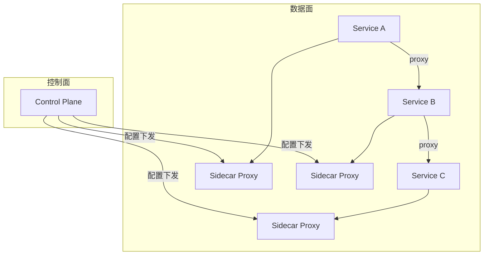
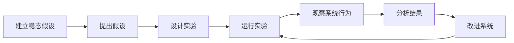
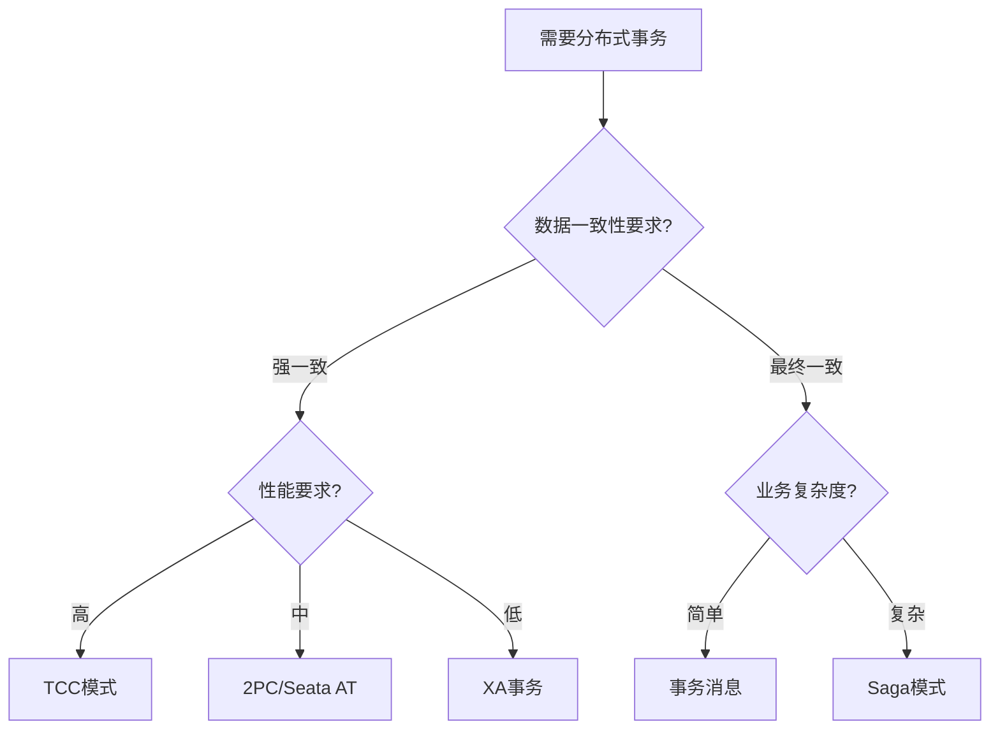

# 分布式系统实战（时钟与顺序 / 一致性模型 / 复制分区 / 共识算法 / 分布式事务 / 锁·ID·幂等·限流）

> 分布式系统的所有难题，根源就四个词：**没有全局时钟、网络会丢会慢、节点会挂、脑裂会来**。
> 本篇在原有 CAP/Raft/分布式锁/ID/缓存/幂等基础上，**补全最容易被忽略却最关键的底层**：逻辑时钟与顺序、一致性模型全谱系、复制与分区模型、Quorum 与反熵、Paxos/PBFT 共识、2PC/3PC/TCC/Saga 理论、容错与租约，形成完整知识网。

---

## 一、分布式系统的本质难题

```text
1) 时钟：各节点物理时钟无法完美同步（NTP 误差毫秒级，跨地域更大）。
2) 网络：消息可能延迟、丢失、重复、乱序（异步网络，FLP 不可能定理：异步下无法在有限时间检测故障）。
3) 故障：节点随时崩溃、重启、磁盘坏；拜占庭故障（节点作恶/数据被篡改）更棘手。
4) 脑裂：网络分区导致原主与新主同时存在（split-brain）。
```

> 因此，**不能依赖"本地时间先后"判断事件全局顺序**——必须靠逻辑时钟或共识。

---

## 二、时间与顺序

### 2.1 Lamport 逻辑时钟

```text
规则：
- 本地事件：counter++
- 发消息：附上当前 counter
- 收消息：counter = max(本地, 收到值) + 1
性质：若 A → B（hb），则 C(A) < C(B)；但 C(A) < C(B) 不能反推 A → B（仅偏序）。
```

### 2.2 向量时钟（Vector Clock）

```text
每个节点维护向量 V[i]，记录"我对各节点的已知最大计数"。
事件可比：V 全 ≤ W ⇒ 确定因果序；存在分量一大于一小于 ⇒ 并发冲突。
典型用途：Dynamo/Cassandra 检测"写冲突"（并发写需应用层合并）。
```

### 2.3 TrueTime 与 HLC

```text
TrueTime（Google Spanner）：GPS+原子钟提供有界误差时钟 [earliest, latest]，
  用不确定性窗口提交，实现"外部一致性"（线性一致）强事务。
HLC（Hybrid Logical Clock）：物理时间 + 逻辑计数，兼顾因果序与可读时间戳。
```

---

## 三、一致性模型（全谱系）

```text
强 ←──────────────────────────────────────→ 弱
线性一致   顺序一致   因果一致   前缀一致   最终一致
(Linearizable)(Sequential)(Causal)  (Monotonic)(Eventual)

线性一致(Linearizable)：等价于"单副本顺序执行"，读一定看到最新写（最强，性能最差）。
顺序一致：各节点看到的操作顺序相同，但不必是真实时间顺序。
因果一致：有因果关系的操作保序（A 回复 B 则看到 A），无因果的并发可乱。
最终一致：无新写后，最终所有副本一致（DNS/缓存典型，需处理"中间态不一致"）。
```

| 一致性变体（最终一致子族） | 保证 |
|--------------------------|------|
| 读己之写（Read-Your-Writes） | 自己写后总能读到 |
| 单调读（Monotonic Read） | 不会读到更旧的值 |
| 单调写（Monotonic Write） | 写按顺序生效 |
| 一致前缀读 | 不会读到"前半旧后半新"的因果断裂 |

> 选型：金融账务要线性一致（事务+共识）；评论/ Feed 流可接受因果或最终一致（换性能与可用）。

---

## 四、CAP 与 BASE

### 4.1 CAP 定理

```text
一致性(C) / 可用性(A) / 分区容错(P) 三者不可兼得 —— 网络分区(P)必选，故 C 与 A 二选一。
- CP：保一致，分区时拒绝部分请求（ZooKeeper/etcd/HBase）。
- AP：保可用，分区时返回旧数据（Cassandra/Dynamo/Riak）。
```

### 4.2 BASE 理论

```text
Basically Available（基本可用）+ Soft state（软状态）+ Eventually consistent（最终一致）。
是对 CAP 中 AP 系统的工程化描述：接受短暂不一致，换取高可用与分区容忍。
```

---

## 五、复制（Replication）

```text
主从复制（Leader-Follower）：
- 同步复制：主等所有从确认，强一致但慢/怕从挂。
- 异步复制：主写本地即返回，从异步追，快但可能丢（主挂时）。
- 半同步：主等至少一个从确认（折中，主流 DB 默认）。

多主复制：多节点都可写，需解决写冲突（冲突检测/合并）。
无主复制（Dynamo 风格）：客户端写多个副本，读多个版本合并（Quorum）。
```

> 复制延迟引发的问题靠"读己之写/单调读/一致前缀"等保证缓解（见第三节）。

---

## 六、分区（Partition / Sharding）

```text
分区目的：数据量/吞吐超出单节点 → 拆分到多节点。
- 范围分区：按 key 区间（易范围查询，易热点）。
- 哈希分区：hash(key) % N（均匀，难范围查询）。
- 一致性哈希：哈希环 + 虚拟节点，节点增删仅迁移 1/N 数据（扩缩容友好）。
```

> 与「分库分表与数据迁移」板块联动（ShardingSphere 路由、平滑扩容实战）。

---

## 七、Quorum、反熵与 Hinted Handoff

```text
NWR 模型：N=副本数, W=写成功数, R=读成功数。
- W+R > N ⇒ 读写必相交 ⇒ 强一致读（如 W=2,R=2,N=3）。
- W=1,R=1 ⇒ 最终一致（高性能）。
Sloppy Quorum：临时写入健康节点，原节点恢复后"hinted handoff"回传。
Read Repair：读时检测版本陈旧，异步修复。
Merkle Tree（反熵）：各节点对数据分块算哈希树，只同步差异块（高效对账）。
```

---

## 八、共识算法

> 共识 = 让多个节点对"某值/某日志顺序"达成一致，即使部分节点故障。

### 8.1 Paxos（Lamport）

```text
角色：Proposer / Acceptor / Learner。
两阶段：
- Prepare(n) → Acceptor 承诺不接收 <n 的提案，并返回已接受的最大值。
- Accept(n, v) → 若 n 仍是最大，Acceptor 接受。
Multi-Paxos：选稳定 Leader 后省略 Prepare，退化为类 Raft 日志复制。
难点：难理解、活锁（竞争提案号），工程多用 Raft。
```

### 8.2 Raft（易于理解）

```text
三个核心子问题：Leader 选举、日志复制、安全性。
- 任期(Term)单调递增；节点角色 Follower/Candidate/Leader。
- 选举：超时触发，拉票需多数，同任期一节点一票。
- 日志复制：Leader AppendEntries 广播，多数确认即提交。
- 安全性：选举限制（只有含全部已提交日志者能当选）、日志匹配、提交位置约束。
```

### 8.3 Zab（ZooKeeper）与 PBFT

```text
Zab：为 ZK 设计，类似 Raft，强 Leader + 事务原子广播（zxid 全局有序）。
PBFT（实用拜占庭容错）：容忍 f 个作恶节点需 3f+1 个节点，三阶段(预准备/准备/提交)，
  用于区块链/联盟链/需防内部作恶场景；普通分布式系统用 Crash Fault Tolerant（Raft）即可。
```

| 算法 | 容错模型 | 工程代表 | 特点 |
|------|----------|----------|------|
| Paxos | Crash | Chubby/Multi-Paxos | 理论基石，难实现 |
| Raft | Crash | etcd/Consul/TiKV | 易理解，主流 |
| Zab | Crash | ZooKeeper | ZK 事务广播 |
| PBFT | Byzantine | 联盟链/Hyperledger | 防作恶，开销大 |
| VR/Viewstamped | Crash | 早期系统 | Raft 前身 |

---

## 九、分布式事务

### 9.1 两阶段提交（2PC）

```text
阶段一(投票)：协调者问所有参与者"能否提交"，参与者锁资源并回答 Yes/No。
阶段二(提交)：全 Yes ⇒ 提交；任一 No ⇒ 回滚。
缺点：
- 同步阻塞（全程持锁）；
- 协调者单点（它挂了参与者一直阻塞）；
- 数据不一致（提交阶段部分参与者收不到指令）。
```

### 9.2 三阶段提交（3PC）

```text
在 2PC 前加 CanCommit（预询问，不锁资源），并把提交拆成 PreCommit/DoCommit。
引入超时机制减少阻塞；仍无法彻底解决网络分区下的不一致，且实现复杂，工程少用。
```

### 9.3 TCC / Saga（业务层补偿）

```text
TCC：Try(预留资源) → Confirm(确认)/Cancel(释放)。强隔离，代码侵入大，适合核心交易。
Saga：长事务拆为本地事务序列，任一步失败则反向执行补偿（向后恢复）。
     编排式(Choreography, 事件驱动) vs 编排式(Orchestrator 中心协调)。
本地消息表 / 事务消息：本地事务+消息表，异步最终一致（RocketMQ 事务消息）。
```

> 与「分库分表与数据迁移/04-分布式事务」「业务模型/金融」联动。选型：**强一致用 2PC/Seata AT，高性能用 TCC/Saga/事务消息**。

---

## 十、分布式锁（全方案对比）

### 10.1 方案对比

| 方案 | 优点 | 缺点 | 适用 |
|------|------|------|------|
| 数据库唯一索引 | 简单 | 无自动续期、DB 压力 | 低频 |
| Redis SET NX + 过期 | 高性能 | 需处理过期/误删/时钟 | 高频、可容忍极小误差 |
| Redlock | 多节点容错 | Martin 争议（需 fencing） | 强安全场景慎用 |
| ZooKeeper 临时节点 | 会话断自动释放、顺序节点 | 依赖 ZK 集群 | 协调类 |
| etcd Lease | 租约自动过期、Watch | 依赖 etcd | K8s 生态 |

### 10.2 安全三要素与 Fencing

```text
1) 互斥：同一时刻只有一个持有者。
2) 不死锁：持有者崩溃后锁能自动释放（过期/租约/临时节点）。
3) 容错：部分节点故障仍能加锁。
Fencing Token：锁带单调递增令牌，处理"旧持有者过期后仍在跑并写数据"——下游校验令牌，旧者写入被拒。
```

> 防误删：用唯一 value（UUID）+ Lua 原子释放：`if redis.call('get',KEYS[1])==ARGV[1] then return redis.call('del',KEYS[1]) end`

---

## 十一、分布式 ID 选型

```text
雪花算法 Snowflake：41 位时间戳 + 10 位机器 + 12 位序列（毫秒 4096 个）。
  - 痛点：时钟回拨（闰秒/手工校时）→ 冲突；解决：回拨检测+等待/借位。
号段模式 Leaf-Segment：DB/号段批量取，本地自增，DB 压力大降；双 buffer 预取防抖动。
趋势递增 vs UUID：前者利于 B+ 树索引顺序写，后者无序但无中心化。
```

---

## 十二、分布式缓存策略

```text
缓存模式：
- Cache-Aside：读时回填、写时更新+删缓存（最常用）。
- Read/Write-Through：缓存层代理读写。
- Write-Behind：异步写回，高性能高风险。
一致性：延迟双删、binlog 订阅(Canal)失效、版本号。
三大问题：缓存穿透(空值/布隆)、击穿(热点 key 互斥重建)、雪崩(随机过期+多级)。
多级缓存：本地(Caffeine) → Redis → DB，抗热点。
```

---

## 十三、幂等设计（全链路）

```text
为什么：网络重试、MQ 重投、浏览器重复提交都会造成"重复操作"。
方案：
- 天然幂等：GET、SELECT。
- 去重表/唯一索引：防重复插入（订单号唯一）。
- 状态机：仅允许合法状态流转（已支付不可再支付）。
- Token 机制：提交前领 token，提交校验一次。
- MQ 消费幂等：msgId 去重表、业务唯一键。
```

---

## 十四、分布式限流

```text
单机：计数器/滑动窗口/令牌桶/漏桶。
分布式：集中计数（Redis+Lua）、网关层(Sentinel/Envoy)、配额(Quota)按租户。
算法对比：
- 计数器：简单，临界突刺问题。
- 滑动窗口：平滑，内存稍多。
- 令牌桶：允许突发（桶满），常用于入口限流。
- 漏桶：恒定速率，削峰填谷。
```

> 与「SRE 与稳定性工程」「场景设计/雪崩」联动：限流+熔断+降级=稳定性三板斧。

---

## 十五、容错、租约与脑裂防护

```text
故障检测：心跳 + Phi-accrual（基于历史动态判定疑似失败，减少误判）。
超时与重试：重试必须幂等 + 指数退避 + 抖动（防重试风暴）。
熔断：错误率超阈值则快速失败（半开探测恢复），见 Hystrix/Sentinel。
降级：核心保底，非核心返回默认值/排队。
租约(Lease)：中心节点定期续约授权（如 etcd/Chubby），过期自动失效 → 防脑裂。
脑裂防护：Quorum（少数派拒绝写）+ Fencing Token（旧主写入被拒）。
```

---

## 十六、典型系统剖析（与中间件板块呼应）

| 系统 | 核心思想 |
|------|----------|
| GFS / HDFS | 中心 Master + 多 Chunk/DN，大文件切块多副本 |
| Bigtable / HBase | 列式 + 有序分区 + WAL + LSM-Tree |
| Dynamo / Cassandra | 一致性哈希 + 无主复制 + Quorum + 向量时钟 |
| Spanner | TrueTime + 多副本 Paxos + 外部一致事务 |
| ZooKeeper / etcd | Zab/Raft 共识 + 顺序一致 + 强 Leader |
| Kafka | 分区 + ISR + 顺序写 + 多副本（见中间件板块） |

---

## 十七、CAP 定理实践意义

### 17.1 CAP 不是理论选择题

```text
CAP 定理实际含义：
  - 网络分区（P）必然发生（物理定律不可抗）
  - 真正选择是：分区发生时，保 C 还是 A
  - CP 系统：分区时拒绝部分请求（ZooKeeper/etcd/HBase）
  - AP 系统：分区时返回旧数据（Cassandra/DynamoDB）

工程实践：
  - 同一系统不同模块可选择不同策略
  - 读操作可以 AP（返回缓存），写操作必须 CP
  - 大部分系统是 AP + 最终一致（BASE）
```

### 17.2 CAP 实战权衡

| 场景 | 选择 | 原因 |
|------|------|------|
| 支付扣款 | CP | 金融数据强一致 |
| 用户评论 | AP | 允许短暂不一致 |
| 库存扣减 | CP | 超卖不可接受 |
| 点赞计数 | AP | 最终一致即可 |
| 配置中心 | CP | 配置必须一致 |
| CDN 缓存 | AP | 性能优先 |

---

## 十八、PACELC 模型

### 18.1 比 CAP 更精确

```text
PACELC = PAC + ELC

PAC：网络分区（Partition）时
  - 选 A（可用性）→ EC（一致性的代价）
  - 选 C（一致性）→ EA（可用性的代价）

ELC：正常运行（Else）时
  - 选 L（延迟）→ C（牺牲一致性）
  - 选 C（一致性）→ L（牺牲延迟）

示例：
  - DynamoDB：PA/EL（分区时选可用，正常时选低延迟）
  - Spanner：PC/EC（分区时选一致，正常时也选一致）
  - MongoDB：PA/EL（分区时选可用，正常时选低延迟）
  - Cassandra：PA/EL（同 DynamoDB）
```

### 18.2 PACELC 选型

| 系统 | PAC | ELC | 适用场景 |
|------|-----|-----|----------|
| Spanner | PC | EC | 强一致事务 |
| DynamoDB | PA | EL | 高可用 KV |
| MongoDB | PA | EL | 文档数据库 |
| Cassandra | PA | EL | 大数据存储 |
| Redis Cluster | PA | EL | 缓存/KV |
| ZooKeeper | PC | EC | 协调服务 |
| etcd | PC | EC | K8s 元数据 |

---

## 十九、共识算法深度对比

### 19.1 Raft vs Paxos vs ZAB

| 维度 | Raft | Paxos | ZAB |
|------|------|-------|-----|
| 核心思想 | Leader 主导 | Proposer/Acceptor | Leader 主导 |
| 可理解性 | **高** | 低 | 中 |
| Leader 选举 | 必须有 | 可无 | 必须有 |
| 日志复制 | AppendEntries | Accept | Proposal |
| 工程实现 | etcd/Consul/TiKV | Chubby/Multi-Paxos | ZooKeeper |
| 安全性 | 选举限制 | Acceptor 承诺 | zxid 全局有序 |
| 日志压缩 | Snapshot | Snapshot | Snapshot |

### 19.2 Raft 核心机制

```text
Leader 选举：
  1. Follower 超时未收到心跳 → 提升为 Candidate
  2. Candidate 增加 term，请求投票
  3. 获得多数票 → 当选 Leader
  4. Leader 发送心跳维持权威

日志复制：
  1. Leader 收到客户端请求
  2. Leader 追加日志条目
  3. Leader 广播 AppendEntries 给 Followers
  4. 多数确认后提交（commit）
  5. Leader 通知 Followers 提交

安全性保证：
  1. 选举限制：只有包含全部已提交日志的 Candidate 才能当选
  2. 日志匹配：AppendEntries 检查前一条日志是否匹配
  3. 提交约束：Leader 只能提交当前 term 的日志
```

---

## 二十、分布式快照（Chandy-Lamport）

### 20.1 算法原理

```text
Chandy-Lamport 分布式快照算法：

目标：在不暂停系统的情况下，记录分布式系统的全局状态

步骤：
  1. 初始化者记录本地状态
  2. 初始化者向所有出站通道发送 Marker
  3. 收到 Marker 的节点：
     - 首次收到：记录本地状态 + 标记该通道已收到
     - 非首次：标记该通道已收到
  4. 所有通道都收到 Marker → 快照完成
```

### 20.2 应用场景

| 场景 | 说明 |
|------|------|
| 系统调试 | 记录分布式系统状态进行分析 |
| 故障恢复 | 从快照恢复系统状态 |
| 检查点 | 定期保存状态用于恢复 |
| 模拟 | 回放分布式系统执行 |

---

## 二十一、向量时钟（Vector Clock）深度

### 21.1 原理

```text
每个节点维护向量 V[i]，记录"我对各节点的已知最大计数"

规则：
  1. 本地事件：V[my_id]++
  2. 发消息：附上当前向量 V
  3. 收消息：对每个 j，V[j] = max(本地V[j], 收到V[j])，然后 V[my_id]++

比较：
  - V 全 ≤ W ⇒ 确定因果序（V happens-before W）
  - 存在分量一大于一小于 ⇒ 并发冲突
```

### 21.2 应用场景

```text
Dynamo/Cassandra：
  - 每个写操作带向量时钟
  - 读时检测并发写冲突
  - 应用层合并冲突（Last-Write-Wins 或自定义）

版本向量（Version Vector）：
  - 变体：只记录自己和直接依赖
  - 用于数据库版本跟踪
```

### 21.3 局限性

```
1. 向量大小随节点数增长
2. 长期运行后向量可能膨胀
3. 需要垃圾回收旧向量条目
4. 不能区分"未发生"和"发生但计数为0"
```

---

## 二十二、CRDTs（无冲突复制数据类型）

### 22.1 核心思想

```text
CRDT = Conflict-free Replicated Data Type

核心原理：
  - 数据类型设计满足交换律、结合律、幂等性
  - 任意顺序合并操作，最终结果一致
  - 无需协调或锁

三种类型：
  1. 基于状态的 CRDT（CvRDT）
     - 合并状态
     - merge(s1, s2) → 新状态
     - 如：G-Counter（Grow-only Counter）

  2. 基于操作的 CRDT（CmRDT）
     - 合并操作
     - 操作需满足交换律+结合律+幂等
     - 如：LWW-Register（Last-Write-Wins Register）

  3. Delta CRDT
     - 只传播增量操作
     - 减少网络开销
     - 如：Delta-CRDT Counter
```

### 22.2 常见 CRDT 数据类型

| CRDT 类型 | 功能 | 应用 |
|-----------|------|------|
| G-Counter | 只增计数器 | 点赞数、浏览量 |
| PN-Counter | 增减计数器 | 库存、余额 |
| G-Set | 只增集合 | 标签、权限 |
| OR-Set | 观察删除集合 | 购物车 |
| LWW-Register | 最后写入获胜 | 配置值 |
| MV-Register | 多版本寄存器 | 保留冲突版本 |
| 2P-Set | 两阶段集合 | 删除标记 |
| LWW-Element-Set | LWW 元素集合 | 成员列表 |
| Sequence CRDT | 有序序列 | 协作文档 |
| Map CRDT | 键值映射 | 分布式配置 |

### 22.3 应用场景

```
1. Redis CRDB（Conflict-free Replicated Database）
   - Redis Enterprise 使用 CRDT 实现多主复制

2. 协作编辑
   - Google Docs 类似实现
   - 文本编辑操作用 CRDT 合并

3. 分布式缓存
   - 多地缓存最终一致
   - G-Counter 做计数同步

4. 边缘计算
   - 离线优先应用
   - 联网后自动合并
```

---

## 二十三、一致性哈希深度

### 23.1 基本原理

```text
一致性哈希（Consistent Hashing）：

问题：hash(key) % N，N 变化时几乎所有 key 重新映射
解决：哈希环 + 虚拟节点

步骤：
  1. 将哈希空间映射到环（0 ~ 2^32-1）
  2. 节点映射到环上（hash(node) % 2^32）
  3. key 顺时针找到第一个节点
  4. 节点增删只影响相邻 key（1/N 迁移）
```

### 23.2 虚拟节点

```text
问题：节点少时分布不均匀
解决：每个物理节点映射多个虚拟节点

示例：
  物理节点：A, B, C
  虚拟节点：A1, A2, A3, B1, B2, B3, C1, C2, C3
  
好处：
  - 数据分布更均匀
  - 节点增删影响更小
  - 支持异构节点（性能好→更多虚拟节点）
```

### 23.3 应用场景

| 系统 | 一致性哈希应用 |
|------|---------------|
| DynamoDB | 数据分片 |
| Cassandra | Token Ring |
| Memcached | 客户端分片 |
| Redis Cluster | 16384 槽位（类似思想） |
| CDN | 就近访问 |
| P2P | DHT（分布式哈希表） |

---

## 二十四、Service Mesh 数据面 vs 控制面

### 24.1 架构分层



### 24.2 数据面（Data Plane）

```
职责：
  - 服务间流量代理（Sidecar Proxy）
  - 负载均衡
  - 服务发现
  - 故障注入
  - 可观测性采集
  - 安全（mTLS）

代表：
  - Envoy（Istio/Consul Connect）
  - Linkerd-proxy
  - Cilium（eBPF 数据面）
```

### 24.3 控制面（Control Plane）

```
职责：
  - 流量管理策略（路由/限流/熔断）
  - 安全策略（证书/mTLS/ACL）
  - 可观测性配置（追踪/指标/日志）
  - 服务发现与负载均衡配置
  - 配置分发到数据面

代表：
  - Istiod（Istio 控制面）
  - Linkerd Control Plane
  - Consul Connect
```

---

## 二十五、混沌工程（Chaos Engineering）

### 25.1 核心原则

```text
1. 建立稳态假设
   - 定义系统正常行为的指标基线

2. 引入真实事件
   - 模拟网络延迟/丢包
   - 模拟节点宕机
   - 模拟磁盘满/CPU 打满

3. 持续实验
   - 在生产环境小范围验证
   - 自动化持续运行

4. 自动化实验
   - CI/CD 集成混沌实验
   - 故障自动注入+恢复

5. 最小化爆炸半径
   - 从开发环境开始
   - 逐步扩大到生产
```

### 25.2 混沌工程工具

| 工具 | 适用场景 | 特点 |
|------|----------|------|
| Chaos Monkey | AWS 实例 | Netflix 开源，随机杀实例 |
| Litmus | Kubernetes | K8s 原生，CRD 定义实验 |
| Chaos Mesh | Kubernetes | PingCAP 开源，功能丰富 |
| ChaosBlade | Java/Docker/K8s | 阿里开源，支持多种故障类型 |
| Toxiproxy | 网络 | Shopify 开源，网络故障代理 |

### 25.3 混沌实验流程



---

## 二十六、两阶段提交 vs 三阶段提交

### 2PC vs 3PC 对比

```text
两阶段提交（2PC）：
  阶段一（投票）：协调者问所有参与者"能否提交"
    参与者锁资源，回答 Yes/No
  阶段二（提交）：全 Yes → 提交；任一 No → 回滚

  优点：实现简单、强一致
  缺点：同步阻塞（全程持锁）、协调者单点、数据不一致风险

三阶段提交（3PC）：
  阶段一（CanCommit）：预询问，不锁资源
  阶段二（PreCommit）：锁资源，准备提交
  阶段三（DoCommit）：真正提交

  优点：减少阻塞、超时自动提交
  缺点：网络分区下仍可能不一致、实现复杂、工程少用
```

| 维度 | 2PC | 3PC |
|------|-----|-----|
| 阻塞程度 | 全程持锁 | 预询问不锁 |
| 协调者单点 | 是（参与者阻塞等待） | 部分解决（超时自动提交） |
| 网络分区 | 可能不一致 | 仍可能不一致 |
| 实现复杂度 | 低 | 高 |
| 工程应用 | Seata AT 模式 | 极少 |
| 性能 | 差（同步阻塞） | 中等 |
| 数据一致性 | 强（成功时） | 弱（分区时） |

## 二十七、Saga 模式深入

### Saga 架构设计

```text
Saga = 长事务拆为本地事务序列 + 补偿操作

编排式（Orchestrator）：
  中心协调器按顺序调用各服务
  ├── T1 → T2 → T3 → T4 → T5
  │   失败 → C3 → C2 → C1（反向补偿）
  优点：流程清晰、易调试
  缺点：协调器单点

编排式（Choreography）：
  事件驱动，各服务监听事件自主决策
  ├── T1 完成 → 发布 Event1 → T2 监听并执行
  │   T2 失败 → 发布 Event2 → T1 监听并补偿
  优点：去中心化、松耦合
  缺点：流程分散、难调试
```

### Saga 补偿策略

```
Saga 补偿策略：
  1. 向后恢复（Backward Recovery）
     失败后反向执行补偿操作
     C3 → C2 → C1
     适用：大部分场景

  2. 向前恢复（Forward Recovery）
     失败后重试，直到成功
     T3 → T3 → T3（重试）
     适用：操作必须成功（如扣款）

  3. 混合策略
     重试 N 次后执行补偿
     T3 → T3 → T3 → C3 → C2 → C1
     适用：不确定操作

补偿操作设计原则：
  ├── 补偿操作必须是幂等的
  ├── 补偿操作不能失败（或有最终兜底）
  ├── 补偿操作必须可审计
  └── 补偿操作有超时机制
```

### Saga 实现代码

```java
// Saga 编排器实现
@Component
public class OrderSaga {

    @SagaStep compensation = @SagaStep(compensation = "cancelOrder")
    public void createOrder(Order order) {
        orderService.create(order);
    }

    @SagaStep(compensation = "releaseInventory")
    public void deductInventory(Order order) {
        inventoryService.deduct(order.getItems());
    }

    @SagaStep(compensation = "refundPayment")
    public void processPayment(Order order) {
        paymentService.charge(order.getPaymentInfo());
    }

    // 补偿方法
    public void cancelOrder(Order order) {
        orderService.cancel(order.getId());
    }

    public void releaseInventory(Order order) {
        inventoryService.release(order.getItems());
    }

    public void refundPayment(Order order) {
        paymentService.refund(order.getPaymentId());
    }
}

// Saga 执行引擎
@Service
public class SagaExecutor {

    public void execute(Saga saga) {
        List<SagaStep> completed = new ArrayList<>();
        try {
            for (SagaStep step : saga.getSteps()) {
                step.execute();
                completed.add(step);
            }
        } catch (Exception e) {
            // 反向补偿
            Collections.reverse(completed);
            for (SagaStep step : completed) {
                try {
                    step.compensate();
                } catch (Exception ce) {
                    log.error("补偿失败: {}", step.getName(), ce);
                }
            }
            throw new SagaFailedException(saga, e);
        }
    }
}
```

## 二十八、事件溯源架构

### 事件溯源核心思想

```text
事件溯源（Event Sourcing）：
  不存储当前状态，而是存储所有状态变更事件
  当前状态 = 重放所有事件

事件存储：
  Event Store：存储所有事件的数据库
  ├── 事件不可变（append-only）
  ├── 事件有序（全局递增 ID）
  ├── 事件包含完整信息（谁、何时、改了什么）

快照（Snapshot）：
  问题：事件太多，重放慢
  解决：定期保存当前状态快照
  恢复：快照 + 重放后续事件

事件溯源 + CQRS：
  写入：事件存储（写模型）
  读取：物化视图（读模型，从事件投影生成）
  分离读写，各自优化
```

### 事件溯源实现

```java
// 事件定义
public abstract class DomainEvent {
    private String eventId;
    private Instant timestamp;
    private int version;
}

public class OrderCreatedEvent extends DomainEvent {
    private String orderId;
    private String userId;
    private List<OrderItem> items;
    private BigDecimal totalAmount;
}

public class OrderPaidEvent extends DomainEvent {
    private String orderId;
    private String paymentId;
    private BigDecimal amount;
    private Instant paidAt;
}

// 事件存储
@Repository
public class EventStore {
    @Autowired
    private JdbcTemplate jdbcTemplate;

    public void appendEvents(String aggregateId, List<DomainEvent> events) {
        for (DomainEvent event : events) {
            jdbcTemplate.update(
                "INSERT INTO events (aggregate_id, event_type, event_data, version) VALUES (?, ?, ?, ?)",
                aggregateId,
                event.getClass().getSimpleName(),
                objectMapper.writeValueAsString(event),
                event.getVersion()
            );
        }
    }

    public List<DomainEvent> getEvents(String aggregateId) {
        return jdbcTemplate.query(
            "SELECT * FROM events WHERE aggregate_id = ? ORDER BY version",
            new Object[]{aggregateId},
            (rs, rowNum) -> objectMapper.readValue(rs.getString("event_data"), DomainEvent.class)
        );
    }
}

// 聚合根
public class OrderAggregate {
    private String orderId;
    private OrderStatus status;
    private List<OrderItem> items;
    private BigDecimal totalAmount;
    private List<DomainEvent> uncommittedEvents = new ArrayList<>();

    // 从事件重建状态
    public void rebuild(List<DomainEvent> events) {
        for (DomainEvent event : events) {
            apply(event);
        }
    }

    // 创建订单
    public void createOrder(String userId, List<OrderItem> items) {
        OrderCreatedEvent event = new OrderCreatedEvent();
        event.setOrderId(UUID.randomUUID().toString());
        event.setUserId(userId);
        event.setItems(items);
        event.setTotalAmount(calculateTotal(items));
        apply(event);
        uncommittedEvents.add(event);
    }

    // 应用事件（状态变更）
    private void apply(DomainEvent event) {
        if (event instanceof OrderCreatedEvent e) {
            this.orderId = e.getOrderId();
            this.items = e.getItems();
            this.totalAmount = e.getTotalAmount();
            this.status = OrderStatus.CREATED;
        } else if (event instanceof OrderPaidEvent e) {
            this.status = OrderStatus.PAID;
        }
    }
}
```

## 二十九、CQRS 模式

### CQRS 架构

```text
CQRS（Command Query Responsibility Segregation）：
  命令（写操作）和查询（读操作）使用不同的模型

写模型：
  处理命令（Create/Update/Delete）
  强一致性
  范式化数据
  事件存储

读模型：
  处理查询（Get/List/Search）
  最终一致性
  反范式化数据（物化视图）
  读优化索引

同步方式：
  ├── 同步：写模型直接更新读模型
  ├── 异步：写模型发布事件，读模型异步消费
  └── 混合：关键查询同步，非关键异步
```

### CQRS + Event Sourcing 实现

```java
// 命令处理器
@Service
public class OrderCommandHandler {

    @Autowired
    private EventStore eventStore;

    @Transactional
    public void handle(CreateOrderCommand cmd) {
        // 1. 创建聚合根
        OrderAggregate order = new OrderAggregate();
        order.createOrder(cmd.getUserId(), cmd.getItems());

        // 2. 持久化事件
        eventStore.appendEvents(order.getOrderId(), order.getUncommittedEvents());

        // 3. 发布事件（异步更新读模型）
        eventPublisher.publish(order.getUncommittedEvents());
    }
}

// 事件处理器（更新读模型）
@Component
public class OrderEventHandler {

    @EventHandler
    public void on(OrderCreatedEvent event) {
        // 更新读模型（物化视图）
        jdbcTemplate.update(
            "INSERT INTO order_read_model (order_id, user_id, status, total_amount, created_at) VALUES (?, ?, ?, ?, ?)",
            event.getOrderId(),
            event.getUserId(),
            "CREATED",
            event.getTotalAmount(),
            event.getTimestamp()
        );
    }

    @EventHandler
    public void on(OrderPaidEvent event) {
        jdbcTemplate.update(
            "UPDATE order_read_model SET status = 'PAID', paid_at = ? WHERE order_id = ?",
            event.getPaidAt(),
            event.getOrderId()
        );
    }
}

// 查询处理器
@Service
public class OrderQueryHandler {

    @Autowired
    private JdbcTemplate jdbcTemplate;

    public OrderReadModel getOrder(String orderId) {
        return jdbcTemplate.queryForObject(
            "SELECT * FROM order_read_model WHERE order_id = ?",
            new Object[]{orderId},
            OrderReadModel.class
        );
    }

    public List<OrderReadModel> getUserOrders(String userId) {
        return jdbcTemplate.query(
            "SELECT * FROM order_read_model WHERE user_id = ? ORDER BY created_at DESC",
            new Object[]{userId},
            OrderReadModel.class
        );
    }
}
```

## 三十、分布式系统故障模式

### 网络分区（Network Partition）

```text
网络分区：集群被分割成多个无法通信的子集
  ├── 完全分区：两部分完全不能通信
  ├── 部分分区：某些节点间不能通信
  └── 间歇性分区：网络时断时续

后果：
  ├── 脑裂（Split Brain）：两个子集各自选出 Leader
  ├── 数据不一致：两个 Leader 各自写入
  └── 服务不可用：部分节点无法访问

防护：
  ├── Quorum 机制：少数派拒绝写入
  ├── Fencing Token：旧 Leader 写入被拒
  ├── Lease 机制：租约过期自动失效
  └── 监控告警：分区发生时及时通知
```

### 时钟偏移（Clock Skew）

```text
时钟偏移：各节点物理时钟不同步
  ├── NTP 误差：通常毫秒级，跨地域更大
  ├── 闰秒：时钟回拨
  └── 硬件故障：时钟漂移

后果：
  ├── 事件顺序错乱：A 发送在 B 之后，但时间戳 A < B
  ├── 过期判断错误：Token 未过期但被判断为过期
  └── 缓存失效异常：缓存提前/延迟过期

解决：
  ├── 逻辑时钟：Lamport 时钟、向量时钟
  ├── 混合逻辑时钟（HLC）：物理时间 + 逻辑计数
  ├── TrueTime（Spanner）：GPS + 原子钟
  └── 容忍偏移：时间窗口 + 幂等设计
```

### 脑裂（Split Brain）

```text
脑裂：网络分区导致多个 Leader 同时存在
  ├── 原 Leader（分区少数派）仍在服务
  ├── 新 Leader（分区多数派）被选出
  └── 两个 Leader 同时写入 → 数据不一致

防护策略：
  1. Quorum 机制
     ├── 写入需多数节点确认（W > N/2）
     ├── 少数派分区无法写入
     └── 多数派分区正常服务

  2. Fencing Token
     ├── 锁带单调递增令牌
     ├── 旧 Leader 的令牌过期
     └── 下游校验令牌，旧者写入被拒

  3. Lease 机制
     ├── Leader 定期续约
     ├── 分区时无法续约
     └── 租约过期自动失效

  4. 监控告警
     ├── 检测分区发生
     ├── 自动降级/切换
     └── 人工介入处理
```

## 三十一、一致性哈希与虚拟节点

### 一致性哈希深入

```text
一致性哈希（Consistent Hashing）：
  问题：hash(key) % N，N 变化时几乎所有 key 重新映射
  解决：哈希环 + 虚拟节点

哈希环：
  0 ─────────────────────────────── 2^32-1
  │
  ├── Node A (hash(A))
  ├── Node B (hash(B))
  └── Node C (hash(C))

  Key 顺时针找到第一个节点
  节点增删只影响相邻 key（1/N 迁移）

虚拟节点：
  问题：节点少时分布不均匀
  解决：每个物理节点映射多个虚拟节点

  物理节点：A, B, C
  虚拟节点：A1, A2, A3, B1, B2, B3, C1, C2, C3

  好处：
    ├── 数据分布更均匀
    ├── 节点增删影响更小
    └── 支持异构节点（性能好→更多虚拟节点）
```

### 虚拟节点实现

```java
// 一致性哈希环实现
public class ConsistentHash<T> {
    private final TreeMap<Integer, T> ring = new TreeMap<>();
    private final int virtualNodes;

    public ConsistentHash(List<T> nodes, int virtualNodes) {
        this.virtualNodes = virtualNodes;
        for (T node : nodes) {
            addNode(node);
        }
    }

    public void addNode(T node) {
        for (int i = 0; i < virtualNodes; i++) {
            int hash = hash(node.toString() + "#" + i);
            ring.put(hash, node);
        }
    }

    public void removeNode(T node) {
        for (int i = 0; i < virtualNodes; i++) {
            int hash = hash(node.toString() + "#" + i);
            ring.remove(hash);
        }
    }

    public T getNode(String key) {
        int hash = hash(key);
        Map.Entry<Integer, T> entry = ring.ceilingEntry(hash);
        if (entry == null) {
            entry = ring.firstEntry();
        }
        return entry.getValue();
    }

    private int hash(String key) {
        return Math.abs(key.hashCode()) % Integer.MAX_VALUE;
    }
}
```

## 三十二、CAP 定理实践

### CAP 实战权衡

```text
CAP 定理实践含义：
  - 网络分区（P）必然发生
  - 真正选择是：分区发生时，保 C 还是 A
  - 同一系统不同模块可选择不同策略

工程实践：
  - 读操作可以 AP（返回缓存），写操作必须 CP
  - 大部分系统是 AP + 最终一致（BASE）
  - 根据业务场景选择 CP 或 AP
```

### CAP 选型决策

| 场景 | 选择 | 原因 | 实现方案 |
|------|------|------|----------|
| 支付扣款 | CP | 金融数据强一致 | Raft + Quorum |
| 用户评论 | AP | 允许短暂不一致 | 最终一致 + 冲突合并 |
| 库存扣减 | CP | 超卖不可接受 | 分布式锁 + 乐观锁 |
| 点赞计数 | AP | 最终一致即可 | CRDT 计数器 |
| 配置中心 | CP | 配置必须一致 | Raft 共识 |
| CDN 缓存 | AP | 性能优先 | 最终一致 + TTL |
| 用户 Feed | AP | 允许短暂不一致 | 事件驱动 + 最终一致 |
| 消息队列 | CP | 消息不丢失 | ISR + Quorum |

### CAP 在微服务中的应用

```text
微服务 CAP 策略：
  ├── 服务间调用：AP（可用性优先，超时降级）
  ├── 数据存储：根据业务选择 CP 或 AP
  ├── 缓存层：AP（最终一致）
  ├── 消息队列：CP（消息不丢失）
  └── 配置中心：CP（配置一致）

示例：
  订单服务：
    ├── 订单创建：CP（强一致）
    ├── 订单查询：AP（读缓存，最终一致）
    └── 订单搜索：AP（搜索引擎，最终一致）

  库存服务：
    ├── 库存扣减：CP（强一致，防超卖）
    └── 库存查询：AP（读缓存，最终一致）
```

## 补充：CAP/PACELC 深入

### PACELC 模型

```text
PACELC 模型：
  P（Partition）：分区发生时
    ├── A（Available）：可用性优先
    └── C（Consistent）：一致性优先

  E（Else）：无分区时
    ├── L（Latency）：延迟优先
    └── C（Consistency）：一致性优先

示例：
  ZooKeeper：PA/EC（分区时可用，无分区时一致）
  Cassandra：PA/EL（分区时可用，无分区时延迟）
  MySQL：PC/EC（分区时一致，无分区时一致）
  MongoDB：PC/EC（分区时一致，无分区时一致）
```

### CAP 定理局限性

```text
CAP 定理局限性：
  1. 只考虑网络分区，未考虑其他故障
  2. 假设系统只有三种状态：一致性、可用性、分区容错
  3. 未考虑延迟、吞吐量等其他指标
  4. 实际系统中，分区是暂时的，非永久的

实际应用：
  ├── 大多数系统选择 AP + 最终一致性
  ├── 关键业务选择 CP + 强一致性
  └── 需要根据业务场景权衡
```

---

## 补充：一致性模型

### 一致性模型对比

| 模型 | 描述 | 实现 | 适用场景 |
|------|------|------|----------|
| 强一致性 | 读操作一定返回最新值 | Paxos/Raft | 金融/交易 |
| 顺序一致性 | 所有进程看到一致的顺序 | ZAB | 分布式锁 |
| 因果一致性 | 有因果关系的操作有序 | 向量时钟 | 社交网络 |
| 最终一致性 | 最终达到一致状态 | Gossip | DNS/缓存 |
| 线性一致性 | 实时顺序一致 | CAS | 数据库 |

### 向量时钟

```text
向量时钟原理：
  每个节点维护一个向量（版本号数组）
  写入时递增本地版本号
  比较时比较向量大小

示例：
  节点 A：[A:1, B:0, C:0]
  节点 B：[A:0, B:1, C:0]
  节点 C：[A:0, B:0, C:1]

  冲突检测：
    [A:2, B:1, C:0] vs [A:1, B:2, C:0]
    无法比较 → 冲突
```

---

## 补充：分布式事务

### 分布式事务模型

```text
分布式事务模型：
  ├── 2PC（两阶段提交）
  │   ├── 准备阶段：所有参与者准备
  │   ├── 提交阶段：所有参与者提交
  │   └── 问题：阻塞、单点故障

  ├── 3PC（三阶段提交）
  │   ├── CanCommit：询问是否可以提交
  │   ├── PreCommit：预提交
  │   └── DoCommit：提交
  │   └── 改进：减少阻塞

  ├── TCC（Try-Confirm-Cancel）
  │   ├── Try：预留资源
  │   ├── Confirm：确认提交
  │   └── Cancel：取消预留
  │   └── 应用：电商下单

  ├── Saga
  │   ├── 长事务分解为多个本地事务
  │   ├── 每个事务有补偿操作
  │   └── 应用：跨服务业务流程

  └── 本地消息表
      ├── 消息与业务事务绑定
      ├── 消息表与业务表同一事务
      └── 应用：异步保证最终一致
```

### 2PC 与 3PC 对比

| 特性 | 2PC | 3PC |
|------|-----|-----|
| 阶段 | 2个 | 3个 |
| 阻塞 | 高 | 低 |
| 单点故障 | 有（协调者） | 有（协调者） |
| 数据一致性 | 强一致 | 弱一致 |
| 性能 | 低 | 中 |
| 实现复杂度 | 低 | 高 |

---

## 补充：故障模型

### 故障类型

```text
故障类型：
  ├── 崩溃故障：进程停止但不执行错误操作
  │   ├── 崩溃-停止单故障
  │   └── 崩溃-恢复故障

  ├── 遗漏故障：进程遗漏某些操作
  │   ├── 发送遗漏
  │   └── 接收遗漏

  ├── 时序故障：消息到达顺序与发送顺序不一致
  │   └── 网络延迟导致

  └── 拜占庭故障：进程执行任意操作
      ├── 恶意攻击
      └── 软件bug
```

### 容错策略

```text
容错策略：
  ├── 复制：数据多副本
  ├── 冗余：组件多实例
  ├── 检测：故障发现
  ├── 恢复：故障修复
  └── 降级：功能降级

容错算法：
  ├── Paxos：强一致性
  ├── Raft：强一致性（易实现）
  ├── ZAB：强一致性（ZooKeeper）
  ├── Gossip：最终一致性
  └── Quorum：多数派一致
```

---

## 补充：分布式锁

### 分布式锁实现

```text
分布式锁实现方式：
  ├── 基于数据库
  │   ├── MySQL：唯一索引/乐观锁
  │   ├── PostgreSQL：Advisory Lock
  │   └── 问题：性能差、可用性低

  ├── 基于 Redis
  │   ├── SETNX + 过期时间
  │   ├── Redlock（多节点）
  │   └── 问题：时钟漂移、主从切换

  ├── 基于 ZooKeeper
  │   ├── 临时顺序节点
  │   ├── Watch 监听
  │   └── 问题：性能中等

  └── 基于 etcd
      ├── Lease + Revision
      ├── Watch 监听
      └── 问题：性能中等
```

### Redis 分布式锁

```python
# Redis 分布式锁实现
import redis
import uuid
import time

class RedisLock:
    def __init__(self, redis_client, lock_name, timeout=10):
        self.redis = redis_client
        self.lock_name = lock_name
        self.timeout = timeout
        self.identifier = str(uuid.uuid4())
    
    def acquire(self):
        end_time = time.time() + self.timeout
        while time.time() < end_time:
            if self.redis.set(self.lock_name, self.identifier, nx=True, ex=self.timeout):
                return True
            time.sleep(0.1)
        return False
    
    def release(self):
        # 使用 Lua 脚本保证原子性
        lua_script = """
        if redis.call("get", KEYS[1]) == ARGV[1] then
            return redis.call("del", KEYS[1])
        else
            return 0
        end
        """
        self.redis.eval(lua_script, 1, self.lock_name, self.identifier)
```

---

## 补充：分布式 ID

### 分布式 ID 方案

| 方案 | 原理 | 优点 | 缺点 |
|------|------|------|------|
| UUID | 全局唯一 | 简单 | 无序、性能差 |
| 数据库自增 | 单点生成 | 简单 | 单点故障、性能差 |
| 号段模式 | 批量获取 | 性能好 | 有短暂重复 |
| Redis INCR | 原子递增 | 性能好 | 依赖 Redis |
| 雪花算法 | 时间戳+机器ID | 有序、高性能 | 依赖时钟 |
| 百度 UidGenerator | 改进雪花 | 灵活 | 复杂 |

### 雪花算法

```text
雪花算法结构（64位）：
  1位符号位（固定0）
  41位时间戳（毫秒）
  10位机器ID（5位数据中心 + 5位工作机器）
  12位序列号（毫秒内递增）

示例：
  0 | 00000000 00000000 00000000 00000000 00000000 0 | 00000 | 00000 | 000000000000
  符号位   时间戳（41位）                               数据中心  工作机器  序列号

特点：
  - 全局唯一
  - 趋势递增
  - 高性能（每秒400万ID）
  - 依赖时钟（时钟回拨问题）
```

---

## 补充：分布式限流

### 限流算法

```text
限流算法：
  ├── 固定窗口：简单计数
  │   ├── 优点：简单
  │   └── 缺点：窗口边界突发

  ├── 滑动窗口：时间窗口滑动
  │   ├── 优点：平滑
  │   └── 缺点：实现复杂

  ├── 漏桶算法：固定速率流出
  │   ├── 优点：平滑
  │   └── 缺点：无法应对突发

  └── 令牌桶算法：固定速率生成令牌
      ├── 优点：允许突发
      └── 缺点：实现复杂
```

### Redis 限流

```python
# Redis 滑动窗口限流
import redis
import time

class SlidingWindowRateLimiter:
    def __init__(self, redis_client, key, window_size, max_requests):
        self.redis = redis_client
        self.key = key
        self.window_size = window_size
        self.max_requests = max_requests
    
    def is_allowed(self):
        now = time.time()
        window_start = now - self.window_size
        
        # 使用 Redis 有序集合
        pipe = self.redis.pipeline()
        pipe.zremrangebyscore(self.key, 0, window_start)
        pipe.zadd(self.key, {str(now): now})
        pipe.zcard(self.key)
        pipe.expire(self.key, self.window_size)
        
        results = pipe.execute()
        current_requests = results[2]
        
        return current_requests <= self.max_requests
```

---

## 补充：分布式缓存

### 缓存模式

```text
缓存模式：
  ├── Cache Aside（旁路缓存）
  │   ├── 读：先读缓存，miss 读数据库
  │   └── 写：先写数据库，再删缓存

  ├── Read/Write Through（读写穿透）
  │   ├── 读：缓存代理读数据库
  │   └── 写：缓存代理写数据库

  └── Write Behind（异步写入）
      ├── 写：只写缓存
      └── 异步：缓存异步写数据库
```

### 缓存问题

| 问题 | 描述 | 解决方案 |
|------|------|----------|
| 缓存穿透 | 查询不存在的数据 | 布隆过滤器/空值缓存 |
| 缓存击穿 | 热点key过期 | 互斥锁/永不过期 |
| 缓存雪崩 | 大量key同时过期 | 随机过期时间/集群 |
| 数据不一致 | 缓存与数据库不一致 | 延迟双删/最终一致 |

### 布隆过滤器

```python
# 布隆过滤器原理
class BloomFilter:
    def __init__(self, size, hash_count):
        self.size = size
        self.hash_count = hash_count
        self.bit_array = [0] * size
    
    def add(self, item):
        for i in range(self.hash_count):
            index = self._hash(item, i)
            self.bit_array[index] = 1
    
    def contains(self, item):
        for i in range(self.hash_count):
            index = self._hash(item, i)
            if self.bit_array[index] == 0:
                return False
        return True
    
    def _hash(self, item, seed):
        hash_value = 0
        for char in str(item):
            hash_value = hash_value * seed + ord(char)
        return hash_value % self.size
```

---

## 补充：分布式消息

### 消息模式

```text
消息模式：
  ├── 点对点（Queue）
  │   ├── 生产者 → 队列 → 消费者
  │   └── 一条消息只被消费一次

  ├── 发布/订阅（Topic）
  │   ├── 生产者 → 主题 → 订阅者
  │   └── 一条消息被所有订阅者消费

  └── 请求/回复（Request-Reply）
      ├── 客户端 → 服务端 → 回复队列
      └── 同步等待回复
```

### 消息可靠性

```text
消息可靠性保证：
  1. 生产者确认
     ├── 同步发送：等待 Broker 确认
     ├── 异步发送：回调确认
     └── 单向发送：无确认

  2. Broker 存储
     ├── 同步刷盘：消息写入磁盘
     ├── 异步刷盘：消息写入缓存
     └── 副本同步：主从同步

  3. 消费者确认
     ├── 自动提交：消费后自动提交 offset
     ├── 手动提交：手动提交 offset
     └── 事务消费：消费与提交原子
```

---

## 补充：分布式监控

### 监控体系

```text
监控体系：
  ├── 基础设施监控
  │   ├── CPU/内存/磁盘/网络
  │   ├── 服务健康检查
  │   └── 资源使用率

  ├── 应用监控
  │   ├── 请求量/延迟/错误率
  │   ├── JVM 监控
  │   └── 业务指标

  ├── 链路追踪
  │   ├── 调用链
  │   ├── 耗时分析
  │   └── 依赖分析

  └── 日志监控
      ├── 日志收集
      ├── 日志分析
      └── 告警
```

### 监控工具对比

| 工具 | 类型 | 特点 | 适用场景 |
|------|------|------|----------|
| Prometheus | 时序数据库 | 指标监控 | 基础设施/应用 |
| Jaeger | 链路追踪 | 分布式追踪 | 微服务 |
| ELK | 日志分析 | 日志收集/分析 | 日志监控 |
| Grafana | 可视化 | 仪表盘 | 统一展示 |
| SkyWalking | APM | 应用性能 | Java 应用 |

---

## 补充：分布式测试

### 测试策略

```text
测试策略：
  ├── 单元测试
  │   ├── 测试单个组件
  │   ├── Mock 外部依赖
  │   └── 快速反馈

  ├── 集成测试
  │   ├── 测试组件间交互
  │   ├── 使用真实依赖
  │   └── 验证集成

  ├── 端到端测试
  │   ├── 测试完整流程
  │   ├── 模拟用户操作
  │   └── 验证业务逻辑

  └── 混沌测试
      ├── 注入故障
      ├── 验证容错
      └── 提高系统韧性
```

### 混沌测试工具

```text
混沌测试工具：
  ├── Chaos Monkey（Netflix）
  │   ├── 随机终止实例
  │   └── 验证系统韧性

  ├── Litmus（CNCF）
  │   ├── Kubernetes 混沌工程
  │   ├── 丰富的故障注入
  │   └── 云原生支持

  ├── Chaos Mesh（PingCAP）
  │   ├── Kubernetes 混沌工程
  │   ├── 网络/IO/时间故障
  │   └── 可视化管理

  └── ChaosBlade（阿里）
      ├── 多平台支持
      ├── 丰富的场景
      └── 中文文档
```

---

## 补充：设计模式

### CQRS 模式

```text
CQRS（Command Query Responsibility Segregation）：
  命令查询职责分离

架构：
  命令端（Write Side）：
    ├── 处理写操作
    ├── 写入主数据库
    └── 发布事件

  查询端（Read Side）：
    ├── 处理读操作
    ├── 读取读数据库
    └── 生成查询模型

流程：
  1. 客户端发送命令
  2. 命令端处理命令
  3. 写入主数据库
  4. 发布事件
  5. 查询端订阅事件
  6. 更新读数据库
  7. 客户端查询读数据库
```

### Event Sourcing 模式

```text
Event Sourcing（事件溯源）：
  存储事件而非状态

架构：
  事件存储：
    ├── 事件流
    ├── 事件版本
    └── 事件重放

  聚合根：
    ├── 从事件重建状态
    ├── 应用事件
    └── 发布新事件

流程：
  1. 客户端发送命令
  2. 聚合根处理命令
  3. 生成事件
  4. 存储事件
  5. 发布事件
  6. 从事件重建状态
```

### 最终一致性模式

```text
最终一致性模式：
  ├── 基于事件的最终一致
  │   ├── 生产者发布事件
  │   ├── 消费者订阅事件
  │   └── 异步更新状态

  ├── 基于轮询的最终一致
  │   ├── 定期检查差异
  │   ├── 同步数据
  │   └── 简单但不实时

  └── 基于变更的最终一致
      ├── CDC 捕获变更
      ├── 同步变更
      └── 实时但复杂
```

---

## 与其他板块的关系

```text
分布式系统 ↔ 知识库：
- 分库分表与数据迁移：复制/分区/事务的工程落地
- 中间件(75篇)：Kafka/ZooKeeper/etcd/Redis 等即上述理论的实现
- 缓存与幂等：场景设计/生产问题排查的高频主题
- SRE与稳定性：限流/熔断/降级/容错同源
- 技术选型：一致性/可用性的权衡决策
- 业务模型：金融(强一致)/电商(最终一致) 的底层约束
```

> **终极口诀**：先判 CAP 取舍（CP or AP）；要强一致就上共识(Raft/Paxos)+Quorum；事务能避则避（本地事务+幂等），避不开用 TCC/Saga；锁必带过期/租约+ fencing；ID 选雪花或号段；限流熔断降级三板斧常备；时钟不可信，靠逻辑时钟/共识定序。

## 三十三、Raft 共识算法深入

### Leader 选举流程

```
Leader 选举流程：
  1. Follower 超时
     → 未收到 Leader 心跳
     → 变为 Candidate

  2. Candidate 发起投票
     → 递增任期号（Term）
     → 向其他节点请求投票

  3. 投票规则
     → 每个节点每任期只投一票
     → 先到先得
     → 日志至少一样新

  4. 获得多数票
     → 成为 Leader
     → 发送心跳确认
```

### 日志复制流程

```
日志复制流程：
  1. 客户端请求
     → 发送到 Leader

  2. Leader 复制日志
     → 写入本地日志
     → 并行发送到 Follower

  3. 多数确认
     → 多数节点写入成功
     → 提交日志

  4. 应用到状态机
     → 执行命令
     → 返回结果
```

## 三十四、Paxos 与 Multi-Paxos

### Paxos 算法

```
Paxos 三阶段：
  1. Prepare 阶段
     → Proposer 发送 Prepare(n)
     → Acceptor 承诺不接受编号 < n 的提案

  2. Accept 阶段
     → Proposer 发送 Accept(n, v)
     → Acceptor 接受提案

  3. Learn 阶段
     → Learner 学习已接受的值

  问题：
    每次选举需要两轮通信
    效率低下
```

### Multi-Paxos

```
Multi-Paxos 优化：
  选举稳定 Leader
    → 避免重复选举
    → 减少通信轮次

  流水线处理
    → 连续提案
    → 提高吞吐

  日志压缩
    → 快照（Snapshot）
    → 减少日志量
```

## 三十五、分布式系统监控

### 监控指标体系

```
分布式系统监控指标：
  1. 基础设施监控
     → CPU、内存、磁盘、网络
     → 节点状态

  2. 应用监控
     → QPS、延迟、错误率
     → 业务指标

  3. 中间件监控
     → 消息队列、缓存、数据库
     → 连接池、线程池

  4. 分布式追踪
     → 调用链路
     → 依赖关系
```

### 监控工具对比

| 工具 | 功能 | 适用场景 |
|------|------|----------|
| Prometheus | 指标采集 | 云原生 |
| Grafana | 可视化 | 监控面板 |
| Jaeger | 链路追踪 | 分布式追踪 |
| ELK | 日志分析 | 日志聚合 |

---

## 分布式系统深度实战补充

### 分布式事务选型决策



| 场景 | 推荐方案 | 一致性 | 性能 | 侵入性 |
|------|---------|--------|------|--------|
| 金融转账 | 2PC / XA | 强 | 低 | 低 |
| 电商下单 | TCC | 强 | 中 | 高 |
| 长流程业务 | Saga | 最终 | 高 | 中 |
| 异步解耦 | 事务消息 | 最终 | 高 | 低 |
| 跨库操作 | Seata AT | 强 | 中 | 低 |

### TCC 补偿设计模式

```java
// TCC Try 阶段：预留资源
public interface InventoryTccService {
    
    @TwoPhaseBusinessAction(name = "deductInventory", commitMethod = "commit", rollbackMethod = "rollback")
    boolean tryDeduct(@BusinessActionContextParameter(paramName = "items") List<OrderItem> items);
    
    boolean commit(BusinessActionContext context);
    
    boolean rollback(BusinessActionContext context);
}

// Try：冻结库存（不实际扣减）
@Override
public boolean tryDeduct(List<OrderItem> items) {
    for (OrderItem item : items) {
        // 扣减可用库存，增加冻结库存
        int affected = inventoryMapper.freeze(item.getSkuId(), item.getQuantity());
        if (affected == 0) {
            throw new RuntimeException("库存不足: " + item.getSkuId());
        }
    }
    return true;
}

// Commit：确认扣减（冻结 → 实际扣减）
@Override
public boolean commit(BusinessActionContext context) {
    List<OrderItem> items = context.getActionContext("items");
    for (OrderItem item : items) {
        inventoryMapper.confirmDeduct(item.getSkuId(), item.getQuantity());
    }
    return true;
}

// Rollback：释放冻结（冻结 → 可用）
@Override
public boolean rollback(BusinessActionContext context) {
    List<OrderItem> items = context.getActionContext("items");
    for (OrderItem item : items) {
        inventoryMapper.releaseFreeze(item.getSkuId(), item.getQuantity());
    }
    return true;
}
```

### Saga 模式实战

```java
// Saga 编排器
@Component
public class OrderSagaOrchestrator {
    
    @Autowired private OrderService orderService;
    @Autowired private InventoryService inventoryService;
    @Autowired private PaymentService paymentService;
    @Autowired private PointService pointService;
    
    public void executeCreateOrder(CreateOrderCommand cmd) {
        List<SagaStep> steps = new ArrayList<>();
        List<SagaStep> completedSteps = new ArrayList<>();
        
        // 定义步骤
        steps.add(SagaStep.of(
            "创建订单",
            () -> orderService.createOrder(cmd),
            () -> orderService.cancelOrder(cmd.getOrderId())
        ));
        
        steps.add(SagaStep.of(
            "扣减库存",
            () -> inventoryService.deduct(cmd.getItems()),
            () -> inventoryService.restore(cmd.getItems())
        ));
        
        steps.add(SagaStep.of(
            "处理支付",
            () -> paymentService.charge(cmd.getPaymentInfo()),
            () -> paymentService.refund(cmd.getPaymentId())
        ));
        
        steps.add(SagaStep.of(
            "增加积分",
            () -> pointService.addPoints(cmd.getUserId(), cmd.getPoints()),
            () -> pointService.deductPoints(cmd.getUserId(), cmd.getPoints())
        ));
        
        // 执行
        try {
            for (SagaStep step : steps) {
                step.execute();
                completedSteps.add(step);
            }
        } catch (Exception e) {
            // 失败：反向补偿
            log.error("Saga 执行失败，开始补偿", e);
            Collections.reverse(completedSteps);
            for (SagaStep step : completedSteps) {
                try {
                    step.compensate();
                } catch (Exception ce) {
                    log.error("补偿失败: {}", step.getName(), ce);
                    // 记录补偿失败，人工介入
                }
            }
            throw new SagaExecutionException(cmd, e);
        }
    }
}

// Saga 状态机
public enum SagaStatus {
    STARTED,
    STEP1_COMPLETED,
    STEP2_COMPLETED,
    STEP3_COMPLETED,
    COMPLETED,
    COMPENSATING,
    COMPENSATED,
    FAILED
}
```

### 分布式锁实战对比

| 方案 | 实现 | 优点 | 缺点 | 适用场景 |
|------|------|------|------|---------|
| Redis SET NX | `SET key value NX PX timeout` | 高性能、简单 | 需处理续期/误删 | 高频、可容忍极小误差 |
| Redlock | 多个独立 Redis 实例 | 多节点容锁 | Martin 争议、复杂 | 强安全场景 |
| ZooKeeper | 临时顺序节点 | 自动释放、顺序 | 依赖 ZK 集群 | 协调类、需要顺序 |
| etcd | Lease + Watch | 租约自动过期 | 依赖 etcd | K8s 生态 |
| 数据库 | 唯一索引 | 简单 | 无自动续期 | 低频 |

```java
// Redis 分布式锁 + Lua 释放
@Component
public class RedisDistributedLock {
    
    @Autowired
    private RedisTemplate<String, String> redisTemplate;
    
    private static final String LOCK_SCRIPT = 
        "if redis.call('get', KEYS[1]) == ARGV[1] then " +
        "  return redis.call('del', KEYS[1]) " +
        "else " +
        "  return 0 " +
        "end";
    
    public boolean tryLock(String lockKey, String requestId, long timeoutMs) {
        String result = redisTemplate.opsForValue()
            .setIfAbsent(lockKey, requestId, timeoutMs, TimeUnit.MILLISECONDS);
        return "OK".equals(result);
    }
    
    public boolean releaseLock(String lockKey, String requestId) {
        DefaultRedisScript<Long> script = new DefaultRedisScript<>(LOCK_SCRIPT, Long.class);
        Long result = redisTemplate.execute(script, List.of(lockKey), requestId);
        return result != null && result == 1L;
    }
    
    // 可重入锁
    public boolean tryReentrantLock(String lockKey, String requestId, long timeoutMs) {
        // 检查是否已持有锁
        String current = redisTemplate.opsForValue().get(lockKey);
        if (requestId.equals(current)) {
            // 重入计数 +1
            redisTemplate.opsForValue().increment(lockKey + ":reentrant");
            redisTemplate.expire(lockKey, timeoutMs, TimeUnit.MILLISECONDS);
            return true;
        }
        return tryLock(lockKey, requestId, timeoutMs);
    }
}

// Redisson 分布式锁（推荐）
RLock lock = redissonClient.getLock("order:" + orderId);
try {
    // 尝试加锁，最多等待 5 秒，自动释放 30 秒
    if (lock.tryLock(5, 30, TimeUnit.SECONDS)) {
        // 业务逻辑
    }
} finally {
    if (lock.isHeldByCurrentThread()) {
        lock.unlock();
    }
}
```

### 分布式 ID 生成方案对比

| 方案 | 原理 | 优点 | 缺点 | 适用场景 |
|------|------|------|------|---------|
| UUID | 随机生成 | 简单、无中心化 | 无序、B+树不友好 | 分布式标识 |
| Snowflake | 时间戳+机器+序列 | 有序、高性能 | 时钟回拨问题 | 高并发 |
| 号段模式 | DB号段批量取 | 简单、趋势递增 | 依赖DB | 中等并发 |
| Leaf | 美团号段+双Buffer | 高可用、低延迟 | 依赖DB | 大规模系统 |
| 数据库自增 | DB自增ID | 简单、有序 | 单点瓶颈 | 低并发 |

```java
// Snowflake ID 生成器
public class SnowflakeIdGenerator {
    
    private final long epoch = 1609459200000L; // 2021-01-01 00:00:00
    private final long workerIdBits = 5L;
    private final long datacenterIdBits = 5L;
    private final long sequenceBits = 12L;
    
    private final long maxWorkerId = ~(-1L << workerIdBits);
    private final long maxDatacenterId = ~(-1L << datacenterIdBits);
    private final long sequenceMask = ~(-1L << sequenceBits);
    
    private final long workerIdShift = sequenceBits;
    private final long datacenterIdShift = sequenceBits + workerIdBits;
    private final long timestampLeftShift = sequenceBits + workerIdBits + datacenterIdBits;
    
    private long workerId;
    private long datacenterId;
    private long sequence = 0L;
    private long lastTimestamp = -1L;
    
    public synchronized long nextId() {
        long timestamp = System.currentTimeMillis();
        
        // 时钟回拨检测
        if (timestamp < lastTimestamp) {
            long offset = lastTimestamp - timestamp;
            if (offset <= 5) {
                // 等待时钟追上
                try {
                    Thread.sleep(offset << 1);
                    timestamp = System.currentTimeMillis();
                } catch (InterruptedException e) {
                    throw new RuntimeException("时钟回拨等待失败");
                }
            } else {
                throw new RuntimeException("时钟回拨超过5ms: " + offset);
            }
        }
        
        if (timestamp == lastTimestamp) {
            sequence = (sequence + 1) & sequenceMask;
            if (sequence == 0) {
                // 同一毫秒序列号用完，等待下一毫秒
                timestamp = tilNextMillis(lastTimestamp);
            }
        } else {
            sequence = 0L;
        }
        
        lastTimestamp = timestamp;
        
        return ((timestamp - epoch) << timestampLeftShift) |
               (datacenterId << datacenterIdShift) |
               (workerId << workerIdShift) |
               sequence;
    }
    
    private long tilNextMillis(long lastTimestamp) {
        long timestamp = System.currentTimeMillis();
        while (timestamp <= lastTimestamp) {
            timestamp = System.currentTimeMillis();
        }
        return timestamp;
    }
}
```

### 分布式限流算法对比

| 算法 | 原理 | 优点 | 缺点 | 适用场景 |
|------|------|------|------|---------|
| 固定窗口 | 时间窗口计数 | 实现简单 | 临界突刺 | 简单限流 |
| 滑动窗口 | 滑动时间窗口 | 平滑 | 内存较多 | 精确限流 |
| 令牌桶 | 恒定速率放令牌 | 允许突发 | 实现复杂 | API网关 |
| 漏桶 | 恒定速率消费 | 平滑流量 | 无突发 | 流量整形 |

```java
// 滑动窗口限流
@Component
public class SlidingWindowRateLimiter {
    
    @Autowired
    private RedisTemplate<String, String> redisTemplate;
    
    private static final String SLIDING_WINDOW_SCRIPT = 
        "local key = KEYS[1]\n" +
        "local window = tonumber(ARGV[1])\n" +
        "local limit = tonumber(ARGV[2])\n" +
        "local now = tonumber(ARGV[3])\n" +
        "\n" +
        "redis.call('ZREMRANGEBYSCORE', key, 0, now - window)\n" +
        "local count = redis.call('ZCARD', key)\n" +
        "\n" +
        "if count < limit then\n" +
        "  redis.call('ZADD', key, now, now .. math.random())\n" +
        "  redis.call('EXPIRE', key, window)\n" +
        "  return 1\n" +
        "else\n" +
        "  return 0\n" +
        "end";
    
    public boolean isAllowed(String key, int limit, int windowSeconds) {
        Long now = System.currentTimeMillis();
        DefaultRedisScript<Long> script = new DefaultRedisScript<>(SLIDING_WINDOW_SCRIPT, Long.class);
        Long result = redisTemplate.execute(script, List.of(key), windowSeconds, limit, now);
        return result != null && result == 1L;
    }
}

// 令牌桶限流
@Component
public class TokenBucketRateLimiter {
    
    private final Map<String, TokenBucket> buckets = new ConcurrentHashMap<>();
    
    public boolean isAllowed(String key, int capacity, int refillRate) {
        TokenBucket bucket = buckets.computeIfAbsent(key, 
            k -> new TokenBucket(capacity, refillRate));
        return bucket.tryConsume();
    }
    
    static class TokenBucket {
        private final int capacity;
        private final int refillRate;
        private int tokens;
        private long lastRefillTime;
        
        public TokenBucket(int capacity, int refillRate) {
            this.capacity = capacity;
            this.refillRate = refillRate;
            this.tokens = capacity;
            this.lastRefillTime = System.currentTimeMillis();
        }
        
        public synchronized boolean tryConsume() {
            refill();
            if (tokens > 0) {
                tokens--;
                return true;
            }
            return false;
        }
        
        private void refill() {
            long now = System.currentTimeMillis();
            long elapsed = (now - lastRefillTime) / 1000;
            if (elapsed > 0) {
                tokens = Math.min(capacity, tokens + (int)(elapsed * refillRate));
                lastRefillTime = now;
            }
        }
    }
}
```

## 分布式系统故障排查

### 常见故障处理

| 故障类型 | 排查步骤 | 解决方案 |
|----------|----------|----------|
| 网络分区 | 检查网络/防火墙 | 恢复网络 |
| 节点宕机 | 检查进程/资源 | 重启节点 |
| 数据不一致 | 检查复制/同步 | 修复数据 |
| 性能下降 | 检查资源/负载 | 优化配置 |

### 故障排查命令

```bash
# 检查节点状态
ping node1
telnet node1 8080

# 检查进程
ps aux | grep myservice
netstat -tlnp | grep 8080

# 检查资源
top
free -m
df -h

# 检查日志
tail -f /var/log/myservice/myservice.log
```
