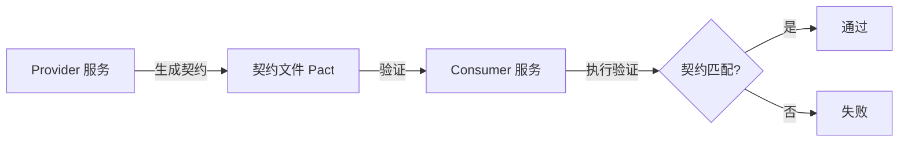
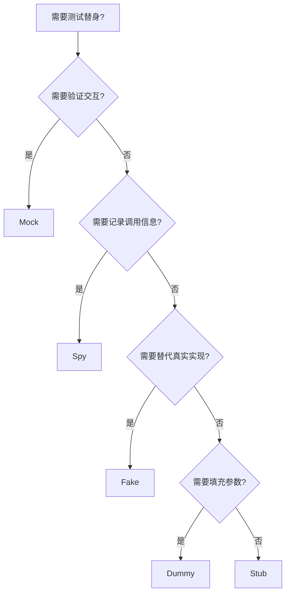
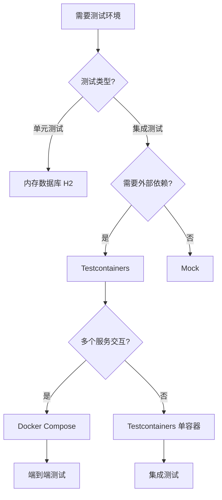
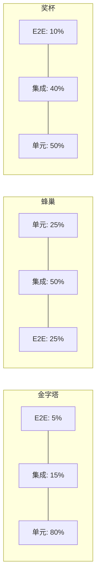

# 单元测试工程（JUnit5 / Mockito / 测试金字塔 / 覆盖率 / TDD）

> 单元测试 = **验证最小可测试单元（函数/方法）的正确性**。核心价值：**防止回归 + 文档化行为 + 重构安全网 + 降低修复成本**。本篇聚焦 Java 后端的单元测试工程实践：JUnit5 深入 + Mockito 实战 + 测试金字塔 + 覆盖率治理 + TDD/BDD。

---

## 一、测试金字塔

```
        /  E2E  \          5%
       / 集成测试 \         15%
      /  单元测试  \        80%

  单元测试：验证单个函数/方法（快速、稳定、成本低）
  集成测试：验证模块间交互（数据库/缓存/MQ）
  E2E 测试：验证完整用户流程（UI/API 全链路）

原则：
  越底层测试越多（快速/稳定/便宜）
  越顶层测试越少（慢/不稳定/昂贵）
  单元测试占比 > 80%
```

---

## 二、JUnit5 深入

### 2.1 核心注解

```java
@Test                          // 标记测试方法
@BeforeAll                     // 所有测试前执行（static）
@AfterAll                      // 所有测试后执行（static）
@BeforeEach                    // 每个测试前执行
@AfterEach                     // 每个测试后执行
@DisplayName("描述")            // 可读的测试名称
@Disabled("跳过原因")           // 跳过测试
@RepeatedTest(5)               // 重复执行 5 次
@ParameterizedTest             // 参数化测试
@Timeout(5)                    // 超时 5 秒
```

### 2.2 断言

```java
// 基础断言
assertEquals(expected, actual, "消息");
assertNotEquals(0, result);
assertTrue(result > 0);
assertNull(obj);
assertNotNull(obj);

// 异常断言
assertThrows(IllegalArgumentException.class, () -> {
    service.query(-1);
});

// 超时断言
assertTimeout(Duration.ofSeconds(3), () -> {
    service.slowOperation();
});

// 分组断言
assertAll("分组",
    () -> assertEquals("a", result.getName()),
    () -> assertEquals(1, result.getId())
);

// 数组/集合断言
assertArrayEquals(expectedArray, actualArray);
assertIterableEquals(expectedList, actualList);
```

### 2.3 参数化测试

```java
@ParameterizedTest
@ValueSource(strings = {"", "  ", "null"})
void blankStringTest(String input) {
    assertTrue(input.isBlank());
}

@ParameterizedTest
@CsvSource({"1,2,3", "0,0,0", "-1,1,0"})
void addTest(int a, int b, int expected) {
    assertEquals(expected, calculator.add(a, b));
}

@ParameterizedTest
@MethodSource("dataProvider")
void complexTest(int input, String expected) {
    assertEquals(expected, service.process(input));
}

static Stream<Arguments> dataProvider() {
    return Stream.of(
        Arguments.of(1, "one"),
        Arguments.of(2, "two")
    );
}
```

### 2.4 嵌套测试

```java
@DisplayName("用户服务测试")
class UserServiceTest {
    
    @Nested
    @DisplayName("查询用户")
    class QueryUser {
        @Test
        void shouldReturnUserWhenExists() { /* ... */ }
        
        @Test
        void shouldThrowWhenNotExists() { /* ... */ }
    }
    
    @Nested
    @DisplayName("创建用户")
    class CreateUser {
        @Test
        void shouldCreateWithValidData() { /* ... */ }
    }
}
```

---

## 三、Mockito 实战

### 3.1 核心概念

```
Mock：模拟对象（不真实执行，返回预设值）
Stub：桩（预设返回值）
Spy：间谍（真实执行，可部分 Mock）
Verify：验证交互（是否调用了某方法）
```

### 3.2 常用 API

```java
// Mock 对象
UserService mockService = mock(UserService.class);
when(mockService.getById(1L)).thenReturn(new User("test"));
when(mockService.getById(anyLong())).thenThrow(new NotFoundException());

// 验证交互
verify(mockService, times(1)).getById(1L);
verify(mockService, never()).deleteById(anyLong());
verify(mockService, timeout(1000)).someMethod();

// Spy（部分 Mock）
UserService spyService = spy(new UserServiceImpl());
doReturn(new User("mock")).when(spyService).getById(1L);

// 参数捕获
ArgumentCaptor<User> captor = ArgumentCaptor.forClass(User.class);
verify(mockRepo).save(captor.capture());
User savedUser = captor.getValue();
assertEquals("test", savedUser.getName());
```

### 3.3 实际测试示例

```java
@ExtendWith(MockitoExtension.class)
class OrderServiceTest {
    
    @Mock private OrderRepository orderRepo;
    @Mock private UserService userService;
    @Mock private StockService stockService;
    @InjectMocks private OrderServiceImpl orderService;
    
    @Test
    @DisplayName("创建订单成功")
    void createOrder_success() {
        // Given
        CreateOrderDTO dto = new CreateOrderDTO(1L, 2, 100L);
        when(userService.getById(1L)).thenReturn(new User(1L, "Alice"));
        when(orderRepo.save(any())).thenAnswer(inv -> {
            Order o = inv.getArgument(0);
            o.setId(1L);
            return o;
        });
        
        // When
        Order order = orderService.createOrder(dto);
        
        // Then
        assertNotNull(order.getId());
        assertEquals(1L, order.getUserId());
        verify(stockService).deduct(1L, 2);
        verify(orderRepo).save(any(Order.class));
    }
    
    @Test
    @DisplayName("库存不足时抛异常")
    void createOrder_insufficientStock() {
        // Given
        CreateOrderDTO dto = new CreateOrderDTO(1L, 100, 100L);
        when(userService.getById(1L)).thenReturn(new User(1L, "Alice"));
        when(stockService.getAvailable(1L)).thenReturn(5);
        
        // When & Then
        InsufficientStockException ex = assertThrows(
            InsufficientStockException.class,
            () -> orderService.createOrder(dto)
        );
        assertEquals(95, ex.getShortage());
        verify(orderRepo, never()).save(any());
    }
}
```

---

## 四、Mock 最佳实践

### 4.1 Mock 粒度

```
原则：只 Mock 你不控制的东西

Mock 对象：
  外部服务（HTTP 调用）
  数据库（Repository）
  消息队列（MQ Producer）
  时间（Clock/Instant）

不 Mock：
  本地工具类
  值对象（DTO/VO）
  纯函数
```

### 4.2 BDDMockito 风格

```java
// Given-When-Then（推荐风格）
given(userService.getById(1L)).willReturn(new User("test"));
given(orderRepo.save(any())).willAnswer(inv -> inv.getArgument(0));

// When
Order order = orderService.createOrder(dto);

// Then
then(orderRepo).should().save(any(Order.class));
then(stockService).should().deduct(1L, 2);
```

### 4.3 常见错误

| 错误 | 正确做法 |
|------|----------|
| Mock 太多（10+ 依赖） | 拆分职责 / 提取接口 |
| 断言太多（一个测试 20+ 断言） | 每个测试只验证一个行为 |
| Mock 实现细节 | Mock 接口/契约，不 Mock 内部实现 |
| 测试依赖执行顺序 | 每个测试独立，不依赖其他测试 |
| 测试含随机性 | 用固定种子 / 固定数据 |

---

## 五、覆盖率治理

### 5.1 覆盖率指标

| 指标 | 含义 | 目标 |
|------|------|------|
| 行覆盖率 | 每行代码是否被执行 | >80% |
| 分支覆盖率 | 每个 if/else 是否被覆盖 | >70% |
| 方法覆盖率 | 每个方法是否被调用 | >90% |
| 类覆盖率 | 每个类是否被测试 | >90% |

### 5.2 工具

```bash
# JaCoCo（Java 默认）
# Maven
mvn verify
# 报告：target/site/jacoco/index.html

# 覆盖率配置（.mvn/jacoco.xml）
# 覆盖率阈值：<limit><counter/><minimum>0.80</minimum></limit>
```

### 5.3 覆盖率陷阱

```
覆盖率 100% ≠ 无 Bug

陷阱一：只测正常路径（异常/边界未覆盖）
陷阱二：只执行不验证（assert 缺失）
陷阱三：Mock 太多（真实逻辑未执行）

建议：
  核心业务逻辑 100%
  工具类 90%+
  整体 80%+
  不追求 100%（投入产出比低）
```

---

## 六、TDD 与 BDD

### 6.1 TDD（测试驱动开发）

```
红 → 绿 → 重构

1. 红：写一个失败的测试（描述期望行为）
2. 绿：写最少的代码让测试通过
3. 重构：优化代码结构（测试仍然通过）

优势：
  设计先行：先想接口，再写实现
  信心保证：每行代码都有测试
  重构安全：改完代码跑测试即可
```

### 6.2 BDD（行为驱动开发）

```
Given（前置条件）→ When（操作）→ Then（期望结果）

示例：
  Given 用户购物车有 3 件商品
  When 用户结算
  Then 生成订单，总金额 = 商品价格之和

工具：Cucumber / JGiven / Serenity BDD
```

---

## 七、集成测试

### 7.1 Spring Boot 测试

```java
@SpringBootTest
@Testcontainers
class UserRepositoryTest {
    
    @Container
    static MySQLContainer<?> mysql = new MySQLContainer<>("mysql:8.0")
        .withDatabaseName("test");
    
    @DynamicPropertySource
    static void configure(DynamicPropertyRegistry registry) {
        registry.add("spring.datasource.url", mysql::getJdbcUrl);
    }
    
    @Autowired private UserRepository repo;
    
    @Test
    void shouldSaveAndFindUser() {
        User user = repo.save(new User("Alice"));
        Optional<User> found = repo.findById(user.getId());
        assertTrue(found.isPresent());
        assertEquals("Alice", found.get().getName());
    }
}
```

### 7.2 测试数据管理

```
原则：测试数据隔离，不互相影响

方法：
  @Transactional + @Rollback：每个测试后回滚
  @DirtiesContext：重置 Spring 上下文
  Testcontainers：每个测试类启动独立容器
  测试数据构建器：Builder 模式构造测试数据
```

---

## 八、Mock 框架深入对比

### 8.1 Mockito vs PowerMock vs MockStatic

| 框架 | 能力 | 适用 | 代价 |
|------|------|------|------|
| Mockito | Mock 接口/类/方法 | 大部分场景 | 无 |
| Mockito-inline | Mock static/final/constructor | Java 11+ | 需 inline agent |
| PowerMock | Mock 静态/私有/构造 | 老项目遗留 | 维护停滞 |
| EasyMock | 接口 Mock | 老项目 | 过时 |

```java
// Mockito-inline: Mock 静态方法
try (MockedStatic<Utils> mocked = mockStatic(Utils.class)) {
    mocked.when(() -> Utils.getCurrentTime()).thenReturn(Instant.parse("2026-08-24T10:00:00Z"));
    assertEquals(Instant.parse("2026-08-24T10:00:00Z"), service.getCurrentTime());
}

// Mockito: Mock final 类
Mockito.mock(FinalClass.class, withSettings().withoutAnnotations());

// Mockito: Mock 构造函数
try (MockedConstruction<HttpClient> mocked = mockConstruction(HttpClient.class,
    (mock, ctx) -> {
        when(mock.get(anyString())).thenReturn("mocked response");
    })) {
    assertEquals("mocked response", service.callExternal());
}
```

> **选型口诀**：优先 Mockito-inline（Mockito 5.x 默认支持 static/final），PowerMock 仅用于无法重构的老代码。

## 九、Testcontainers 集成测试

### 9.1 核心概念

```java
@Testcontainers
class UserRepositoryTest {

    @Container
    static PostgreSQLContainer<?> postgres = new PostgreSQLContainer<>("postgres:16")
        .withDatabaseName("test_db")
        .withUsername("test")
        .withPassword("test");

    @Container
    static RedisContainer<?> redis = new RedisContainer<>("redis:7-alpine");

    @DynamicPropertySource
    static void configure(DynamicPropertyRegistry registry) {
        registry.add("spring.datasource.url", postgres::getJdbcUrl);
        registry.add("spring.data.redis.host", redis::getHost);
        registry.add("spring.data.redis.port", redis::getFirstMappedPort);
    }

    @Autowired private UserRepository repo;

    @Test
    void shouldSaveUser() {
        User user = repo.save(new User("Alice", "alice@test.com"));
        assertNotNull(user.getId());
    }
}
```

### 9.2 Testcontainers 优势

| 优势 | 说明 |
|------|------|
| 真实环境 | 用真实 DB/Redis/MQ，不 Mock |
| 隔离性 | 每个测试类独立容器 |
| 可重复 | 固定版本镜像，CI 一致 |
| 易清理 | 测试结束自动销毁容器 |

## 十、契约测试（Contract Testing）

### 10.1 契约测试原理



### 10.2 Pact 契约测试示例

```java
// Consumer 端：定义期望
@ExtendWith(PactConsumerTestExt.class)
@PactTestFor(pactVersion = PactVerVersion.PACT_3)
class OrderServiceConsumerTest {

    @Pact(consumer = "order-service", provider = "user-service")
    public RequestResponsePact userPact(PactDslWithProvider.Builder builder) {
        return builder
            .given("user 1 exists")
            .uponReceiving("get user by id")
            .path("/users/1")
            .method("GET")
            .willRespondWith()
            .status(200)
            .body(new PactDslJsonBody().stringType("name"))
            .toPact();
    }
}
```

> **选型口诀**：微服务间接口约定用契约测试（Pact），防上游变更破坏下游。

## 十一、突变测试（Mutation Testing）

### 11.1 原理

```
突变测试 = 人为注入代码变异 → 检查测试是否能发现变异

突变操作：
  条件反转：if(x > 0) → if(x <= 0)
  返回值修改：return true → return false
  数值偏移：x + 1 → x + 2
  方法删除：跳过方法调用

评估指标：
  Mutation Score = 被发现的变异数 / 总变异数
  Score > 80%：测试质量高
  Score < 50%：测试覆盖有盲区
```

### 11.2 PIT（Pitest）使用

```xml
<!-- Maven 配置 -->
<plugin>
    <groupId>org.pitest</groupId>
    <artifactId>pitest-maven</artifactId>
    <configuration>
        <targetClasses>com.example.service.*</targetClasses>
        <targetTests>com.example.service.*Test</targetTests>
        <mutationThreshold>70</mutationThreshold>
    </configuration>
</plugin>
```

```bash
mvn org.pitest:pitest-maven:mutationCoverage
# 报告：target/pit-reports/index.html
```

## 十二、覆盖率指标深入

### 12.1 覆盖率类型对比

| 指标 | 含义 | 典型目标 | 工具 |
|------|------|----------|------|
| 行覆盖率 | 每行代码是否被执行 | > 80% | JaCoCo/coverage.py |
| 分支覆盖率 | 每个 if/else 是否被覆盖 | > 70% | JaCoCo |
| 方法覆盖率 | 每个方法是否被调用 | > 90% | JaCoCo |
| 条件覆盖率 | 每个布尔子表达式 | > 60% | JaCoCo |
| 突变覆盖率 | 测试是否能发现变异 | > 70% | PIT |

### 12.2 覆盖率陷阱

| 陷阱 | 说明 | 对策 |
|------|------|------|
| 只覆盖不验证 | 执行了但没 assert | 每个测试必须有断言 |
| Mock 太多 | 真实逻辑未执行 | 减少 Mock，用真实依赖 |
| 无意义覆盖 | getter/setter 覆盖 | 关注业务逻辑覆盖 |
| 覆盖率虚高 | 测试数量多但质量差 | 结合突变测试评估 |

## 十三、TDD/BDD/ATDD 对比

| 方法 | 核心 | 做法 | 工具 |
|------|------|------|------|
| TDD | 测试先行 | 红→绿→重构 | JUnit/TestNG |
| BDD | 行为驱动 | Given-When-Then + 非技术人员可读 | Cucumber/JGiven |
| ATDD | 验收先行 | 验收测试先行，开发再实现 | FitNesse/Robot |

```
TDD 流程：
  1. 写一个失败的测试（描述期望行为）
  2. 写最少代码让测试通过
  3. 重构代码（测试仍通过）

BDD 场景示例（Gherkin）：
  Feature: 用户下单
    Scenario: 购物车结算
      Given 用户购物车有 3 件商品
      When 用户点击结算
      Then 生成订单
      And 订单总金额等于商品价格之和
```

## 十四、集成测试模式

### 14.1 Spring Boot 测试模式

| 模式 | 注解 | 启动速度 | 适用 |
|------|------|----------|------|
| MockMvc | `@WebMvcTest` | 快（只启动 Web 层） | Controller 测试 |
| Slice | `@DataJpaTest` / `@RedisTest` | 中（启动特定层） | Repository 测试 |
| Full | `@SpringBootTest` | 慢（启动全部上下文） | 端到端集成 |
| TestContainers | `@Testcontainers` | 中（启动容器） | 外部依赖测试 |

### 14.2 测试数据管理

```
原则：测试数据隔离，不互相影响

方法：
  @Transactional + @Rollback：每个测试后回滚
  @Sql：测试前初始化数据
  @DirtiesContext：重置 Spring 上下文
  Testcontainers：每个测试类独立容器
  Builder 模式：构造测试数据
```

## 十五、测试替身五兄弟详解

### 15.1 五种测试替身

| 替身类型 | 英文 | 行为 | 适用场景 |
|----------|------|------|---------|
| Dummy | Dummy | 不使用，仅填充参数 | 参数占位，不关心值 |
| Stub | Stub | 返回预设值，不验证交互 | 提供间接输入 |
| Spy | Spy | 记录调用信息，可验证 | 监控方法是否被调用 |
| Mock | Mock | 预设行为 + 验证交互 | 验证交互是否正确 |
| Fake | Fake | 简化真实实现（如内存DB） | 替代外部依赖 |

### 15.2 决策树



### 15.3 代码示例

```java
// Dummy：仅填充参数
User dummyUser = new User();
orderService.process(dummyUser);

// Stub：返回预设值
when(userService.getById(1L)).thenReturn(new User(1L, "Alice"));

// Spy：记录调用
OrderService spy = spy(new OrderServiceImpl());
orderService.createOrder(dto);
verify(spy, times(1)).createOrder(dto);

// Mock：预设行为 + 验证交互
@Mock OrderRepository orderRepo;
when(orderRepo.save(any())).thenReturn(savedOrder);
orderService.createOrder(dto);
verify(orderRepo).save(any(Order.class));

// Fake：简化实现（内存版）
class InMemoryUserRepo implements UserRepository {
    Map<Long, User> db = new HashMap<>();
    public User findById(long id) { return db.get(id); }
}
```

> **口诀：Stub 给输入，Mock 验交互，Spy 记调用，Fake 替实现，Dummy 填参数。**

---

## 十六、JUnit5 参数化测试实践

### 16.1 参数源注解

| 注解 | 参数来源 | 示例 |
|------|---------|------|
| @ValueSource | 内联值 | `@ValueSource(strings = {"", "  "})` |
| @CsvSource | CSV 字符串 | `@CsvSource({"1,2,3", "0,0,0"})` |
| @CsvFileSource | CSV 文件 | `@CsvFileSource(resources = "/data.csv")` |
| @MethodSource | 方法返回 Stream | `@MethodSource("dataProvider")` |
| @EnumSource | 枚举值 | `@EnumSource(TimeUnit.class)` |

### 16.2 高级用法

```java
@ParameterizedTest
@CsvSource(delimiter = '|', textBlock = """
    1 | hello | 5
    2 | world | 5
    """)
void testWithCustomDelimiter(int a, String b, int expected) {
    assertEquals(expected, a + b.length());
}

@ParameterizedTest
@NullSource
@EmptySource
@ValueSource(strings = {"  ", "\t"})
void blankInputTest(String input) {
    assertTrue(validator.isBlank(input));
}
```

> **口诀：参数化测试 = 一组逻辑 x 多组数据——@MethodSource 最灵活，@CsvSource 最简洁。**

---

## 十七、测试代码坏味道清单

| 坏味道 | 症状 | 修复 |
|--------|------|------|
| Assertion Roulette | 多个无消息的 assert | 每个 assert 加消息 |
| Test for Test's sake | 执行了但没 assert | 每个测试必须有断言 |
| Excessive Mocking | Mock 10+ 对象 | 拆分职责 |
| Fragile Tests | 改实现就改测试 | Mock 接口不 Mock 实现 |
| Slow Tests | 单测跑 > 1 秒 | 异步转同步 / Mock 外部 |
| Dependent Tests | 测试依赖执行顺序 | 每个测试独立 setup |
| Over-Specified Tests | 测试内部实现细节 | 测试行为不测实现 |
| Sleeping Tests | Thread.sleep 等待 | 用 Awaitility 替代 |

```java
// 反模式：Thread.sleep 等待异步
Thread.sleep(3000);
assertTrue(order.isProcessed());

// 正确：Awaitility 等待
Awaitility.await().atMost(5, TimeUnit.SECONDS)
    .until(() -> order.isProcessed());
```

## 测试代码命名规范与组织

### 测试方法命名模式

| 模式 | 示例 | 适用 |
|------|------|------|
| `shouldExpectedBehavior_whenCondition` | `shouldReturnUser_whenExists` | BDD 风格，推荐 |
| `testMethodName_Scenario_ExpectedResult` | `testGetById_UserExists_ReturnsUser` | JUnit 4 遗留 |
| `methodName_condition_result` | `getById_existingUser_success` | 简洁风格 |
| `given_condition_when_action_then_result` | `givenUserExists_whenQuery_thenReturnUser` | 完整 Given-When-Then |

```java
// 推荐：should...when... 语义清晰
@Test
void shouldThrowException_whenUserNotFound() { }

@Test
void shouldCreateOrder_whenStockSufficient() { }

// 不推荐：无意义命名
@Test
void test1() { }

@Test
void testGetById() { }
```

### 测试类命名规范

| 类型 | 命名规则 | 示例 |
|------|---------|------|
| 单元测试 | `{ClassUnderTest}Test` | `UserServiceTest` |
| 集成测试 | `{ClassUnderTest}IT` 或 `{Feature}IntegrationTest` | `OrderRepositoryIT` |
| 参数化测试 | `{ClassUnderTest}ParameterizedTest` | `CalculatorParameterizedTest` |
| 测试套件 | `{Module}TestSuite` | `PaymentModuleTestSuite` |

### 测试固件（Fixture）管理

```java
// 固件清理：避免测试间污染
@ExtendWith(MockitoExtension.class)
class UserServiceTest {

    @Mock private UserRepository userRepo;
    @InjectMocks private UserServiceImpl userService;

    // 共享测试数据（只读）
    private static User sharedUser;

    @BeforeAll
    static void setupAll() {
        sharedUser = new User(1L, "Alice", "ACTIVE");
    }

    @BeforeEach
    void setUp() {
        // 每个测试前重置 Mock 行为
        lenient().when(userRepo.findById(1L)).thenReturn(Optional.of(sharedUser));
    }

    @AfterEach
    void tearDown() {
        // 清理线程本地变量等
        SecurityContextHolder.clearContext();
    }
}
```

```text
测试固件清理策略：
  Mock 对象：@BeforeEach 重新初始化（MockitoExtension 自动重置）
  静态状态：@AfterEach 清理（SecurityContext/ThreadLocal）
  外部资源：@AfterAll 关闭（数据库连接/容器）
  测试数据：@Transactional + @Rollback 自动回滚
  测试隔离：每个测试独立，不依赖执行顺序
```

## 测试数据构建高级模式

### Nested Builder（嵌套构建器）

```java
// 支持嵌套层级的 Builder
public class OrderBuilder {
    private Long id = 1L;
    private UserBuilder userBuilder = new UserBuilder();
    private List<OrderItemBuilder> items = new ArrayList<>();

    public static OrderBuilder anOrder() { return new OrderBuilder(); }

    public OrderBuilder withUser(Consumer<UserBuilder> consumer) {
        consumer.accept(userBuilder);
        return this;
    }

    public OrderBuilder withItem(Consumer<OrderItemBuilder> consumer) {
        OrderItemBuilder item = new OrderItemBuilder();
        consumer.accept(item);
        items.add(item);
        return this;
    }

    public Order build() {
        Order order = new Order();
        order.setId(id);
        order.setUser(userBuilder.build());
        order.setItems(items.stream()
            .map(OrderItemBuilder::build)
            .collect(Collectors.toList()));
        return order;
    }
}

// 使用：语义化构建复杂对象
Order order = OrderBuilder.anOrder()
    .withUser(u -> u.withName("Alice").withEmail("alice@test.com"))
    .withItem(i -> i.withProductId(100L).withQuantity(2).withPrice(BigDecimal.valueOf(99.9)))
    .withItem(i -> i.withProductId(200L).withQuantity(1).withPrice(BigDecimal.valueOf(199.9)))
    .build();
```

### 测试数据工厂（Factory）

```java
// 集中管理测试数据工厂
public class TestDataFactory {

    public static User createActiveUser() {
        return User.builder()
            .name("testuser")
            .email("test@example.com")
            .status(UserStatus.ACTIVE)
            .createdAt(Instant.now())
            .build();
    }

    public static Order createPendingOrder(User user) {
        return Order.builder()
            .user(user)
            .status(OrderStatus.PENDING)
            .items(List.of(createOrderItem()))
            .totalAmount(BigDecimal.valueOf(100))
            .build();
    }

    public static OrderItem createOrderItem() {
        return OrderItem.builder()
            .productId(1L)
            .quantity(1)
            .price(BigDecimal.valueOf(50))
            .build();
    }
}
```

```text
测试数据构建选型：
  Object Mother：固定组合，适合常用场景（如 createDefaultUser）
  Builder：灵活组合，适合复杂对象（如 UserBuilder.withName().withEmail()）
  Nested Builder：层级嵌套，适合聚合根（如 OrderBuilder.withUser().withItem()）
  Factory：集中管理，适合跨测试共享数据（如 TestDataFactory.createActiveUser()）
  @DataProvider/TestData：参数化测试专用（如 @MethodSource）
```

## 测试环境隔离策略详解

### Testcontainers vs Docker Compose vs Test Profile

| 策略 | 启动方式 | 隔离级别 | 适用场景 | 启动时间 |
|------|---------|---------|---------|---------|
| Testcontainers | 每测试类独立容器 | 测试类级 | 单元/集成测试 | 中（秒级） |
| Docker Compose | 共享容器组 | 测试套件级 | 端到端测试 | 慢（分钟级） |
| Test Profile | 切换配置 | Profile 级 | 多环境测试 | 快（毫秒级） |
| 内存数据库 | 进程内 | 方法级 | 快速单元测试 | 极快 |

```java
// Testcontainers：测试类级隔离
@Testcontainers
class UserRepositoryTest {
    @Container
    static PostgreSQLContainer<?> postgres = new PostgreSQLContainer<>("postgres:16")
        .withDatabaseName("test")
        .withUsername("test")
        .withPassword("test");

    @DynamicPropertySource
    static void configure(DynamicPropertyRegistry registry) {
        registry.add("spring.datasource.url", postgres::getJdbcUrl);
    }
}

// Test Profile：按 Profile 切换配置
@SpringBootTest
@ActiveProfiles("integration-test")
class UserServiceIntegrationTest {
    // 使用 integration-test profile 的配置
}
```

```yaml
# application-integration-test.yml
spring:
  datasource:
    url: jdbc:tc:postgresql:16:///test
  data:
    redis:
      host: localhost
      port: 6379
```

### 测试环境隔离决策流程



## 测试金字塔 vs 测试蜂巢 vs 奖杯模型对比

### 三种测试模型

| 模型 | 形状 | 分布 | 适用场景 |
|------|------|------|----------|
| 测试金字塔 | 三角形 | 单元 80% / 集成 15% / E2E 5% | 传统项目、微服务 |
| 测试蜂巢 | 六边形 | 单元 60% / 集成 30% / E2E 10% | 现代应用 |
| 奖杯模型 | 奖杯形 | 单元 50% / 集成 40% / E2E 10% | React/前端 |

```
测试金字塔：
  E2E 少（慢/贵/脆弱）
  集成适中（中速/可靠）
  单元多（快/便宜/稳定）

测试蜂巢：
  单元测试减少（不需要 mock 所有东西）
  集成测试增加（验证真实交互）
  E2E 适中（覆盖关键路径）

奖杯模型（React Kent C. Dodds）：
  单元：纯逻辑测试
  集成：组件交互测试（推荐主力）
  E2E：用户关键路径测试
```

## JUnit5 Extensions 实战

### 扩展点 / 自定义注解 / 生命周期

```java
// 自定义扩展
public class TimerExtension implements BeforeEachCallback, AfterEachCallback {
    private long startTime;
    
    @Override
    public void beforeEach(ExtensionContext context) {
        startTime = System.currentTimeMillis();
    }
    
    @Override
    public void afterEach(ExtensionContext context) {
        long duration = System.currentTimeMillis() - startTime;
        System.out.println(context.getDisplayName() + " took " + duration + "ms");
    }
}

// 使用
@ExtendWith(TimerExtension.class)
class UserServiceTest {
    @Test
    void shouldCreateUser() {
        // 测试逻辑
    }
}

// 自定义注解
@Retention(RetentionPolicy.RUNTIME)
@Target(ElementType.METHOD)
@ExtendWith(TimerExtension.class)
public @interface Timed {
}

// 使用
@Test
@Timed
void shouldFastOperation() {
    // 自动计时
}
```

## Mock vs Spy 选择指南

### Mockito mock() / spy() / 区别

| 方法 | 行为 | 适用 |
|------|------|------|
| mock() | 全部模拟（返回 null/0/false） | 外部依赖（DB/HTTP） |
| spy() | 真实调用 + 可覆写 | 部分模拟（只想 mock 部分方法） |

```java
// mock：完全模拟
UserRepository mockRepo = mock(UserRepository.class);
when(mockRepo.findById(1L)).thenReturn(Optional.of(new User()));

// spy：部分模拟
List<String> realList = new ArrayList<>();
List<String> spyList = spy(realList);
doReturn("mocked").when(spyList).get(0);  // mock get(0)
spyList.add("real");  // 真实调用 add
spyList.size();  // 真实调用 size → 1

// 选择原则：
// 外部依赖（DB/Redis/HTTP）→ mock
// 自己的类（只想部分模拟）→ spy
// 不确定 → 用 mock（更安全）
```

## 测试工厂模式

### TestFactory / DynamicTest / 参数化

```java
// DynamicTest（JUnit5 动态测试）
@TestFactory
Collection<DynamicTest> dynamicTests() {
    return Arrays.asList(
        DynamicTest.dynamicTest("2 + 2 should equal 4", 
            () -> assertEquals(4, 2 + 2)),
        DynamicTest.dynamicTest("3 + 3 should equal 6", 
            () -> assertEquals(6, 3 + 3))
    );
}

// 参数化测试
@ParameterizedTest
@CsvSource({
    "1, user1, true",
    "2, user2, false",
    "3, user3, true"
})
void shouldValidateUser(Long id, String name, boolean active) {
    User user = new User(id, name, active);
    assertEquals(id, user.getId());
}

// 方法源参数化
@ParameterizedTest
@MethodSource("userProvider")
void shouldProcessUser(User user) {
    assertNotNull(user);
}

static Stream<User> userProvider() {
    return Stream.of(
        new User(1L, "Alice", true),
        new User(2L, "Bob", false)
    );
}
```

## Testcontainers 集成测试

### Docker 容器化测试 / 数据库测试

```java
// MySQL 集成测试
@Testcontainers
class UserRepositoryTest {
    
    @Container
    static MySQLContainer<?> mysql = new MySQLContainer<>("mysql:8.0")
        .withDatabaseName("testdb")
        .withUsername("test")
        .withPassword("test");
    
    @DynamicPropertySource
    static void configure(DynamicPropertyRegistry registry) {
        registry.add("spring.datasource.url", mysql::getJdbcUrl);
        registry.add("spring.datasource.username", mysql::getUsername);
        registry.add("spring.datasource.password", mysql::getPassword);
    }
    
    @Test
    void shouldInsertUser() {
        // 使用真实数据库测试
        User user = new User("test@example.com");
        repository.save(user);
        assertNotNull(user.getId());
    }
}

// Redis 集成测试
@Container
static GenericContainer<?> redis = new GenericContainer<>("redis:7")
    .withExposedPorts(6379);

@Test
void shouldCacheUser() {
    String key = "user:1";
    redis.exec("SET", key, "test");
    String value = redis.exec("GET", key);
    assertEquals("test", value);
}
```

## 单元测试命名规范

### Given-When-Then / 应该 + 动词 + 条件

```
命名规范：

1. 应该 + 动词 + 条件
  shouldReturnUserWhenIdExists
  shouldThrowExceptionWhenIdNotFound
  shouldSaveUserWhenValid

2. Given-When-Then
  givenExistingUser_whenFindById_thenReturnUser
  givenInvalidId_whenFindById_thenThrowException

3. 测试方法命名
  正常场景：shouldDoSomething
  异常场景：shouldThrowWhenSomething
  边界场景：shouldHandleEmptyCase

4. 测试类命名
  原类名 + Test
  UserService → UserServiceTest
  UserRepository → UserRepositoryTest

5. 测试目录结构
  src/main/java/com/example/UserService.java
  src/test/java/com/example/UserServiceTest.java
```

| 命名风格 | 示例 | 适用 |
|----------|------|------|
| should + 动词 | shouldReturnUser | JUnit 推荐 |
| Given-When-Then | givenUser_whenFind_thenReturn | BDD 风格 |
| test + 方法名 | testFindById | 简单直接 |
| descriptive | userNotFoundThrowsException | 描述行为 |

## 十五、与其他板块的关系

- CI/CD 中的测试见「[测试体系总论](../测试与代码质量/01-测试体系总论.md)」；

### 三种测试模型

| 模型 | 形状 | 分布 | 适用场景 |
|------|------|------|----------|
| 测试金字塔 | 三角形 | 单元 80% / 集成 15% / E2E 5% | 传统项目、微服务 |
| 测试蜂巢 | 六边形 | 集成为核心，单元和 E2E 两侧 | 集成密集型系统 |
| 测试奖杯 | 奖杯形 | 单元 50% / 集成 40% / E2E 10% | 云原生、分布式系统 |



| 维度 | 金字塔 | 蜂巢 | 奖杯 |
|------|--------|------|------|
| 单元测试占比 | 80% | 25% | 50% |
| 集成测试占比 | 15% | 50% | 40% |
| E2E 测试占比 | 5% | 25% | 10% |
| 核心理念 | 快速反馈 | 集成为中心 | 平衡速度与信心 |
| 适用 | 微服务、TDD | 集成密集系统 | 云原生、分布式 |

### 选型建议

```
选择金字塔：传统项目、TDD 实践、微服务架构
选择蜂巢：集成测试覆盖充分、系统交互复杂
选择奖杯：云原生系统、分布式架构、依赖外部服务多

趋势：现代项目从「金字塔」向「奖杯」演进
原因：集成测试用 Testcontainers 真实环境，信心更高
```

## JUnit5 扩展模型（Extension API）

### 扩展点类型

| 扩展点 | 说明 | 适用 |
|--------|------|------|
| BeforeAllCallback | 所有测试前执行 | 资源初始化 |
| AfterAllCallback | 所有测试后执行 | 资源清理 |
| BeforeEachCallback | 每个测试前执行 | 测试数据准备 |
| AfterEachCallback | 每个测试后执行 | 测试数据清理 |
| TestInstancePostProcessor | 测试实例创建后处理 | 注入依赖 |
| TestMethodInvocationContext | 方法级扩展 | 参数化测试 |
| Condition | 条件执行（@Disabled 替代） | 环境判断 |

### 自定义扩展示例

```java
public class DatabaseExtension implements BeforeAllCallback, AfterAllCallback {
    private static PostgreSQLContainer<?> postgres;
    
    @Override
    public void beforeAll(ExtensionContext context) {
        postgres = new PostgreSQLContainer<>("postgres:16")
            .withDatabaseName("test_db");
        postgres.start();
        Store store = context.getStore(Namespace.create(getClass()));
        store.put("url", postgres.getJdbcUrl());
    }
    
    @Override
    public void afterAll(ExtensionContext context) {
        if (postgres != null) postgres.stop();
    }
}
```

## Mockito mock vs spy 使用场景

| 维度 | mock | spy |
|------|------|-----|
| 行为 | 完全模拟（真实代码不执行） | 部分模拟（真实代码执行） |
| 适用 | 外部依赖（DB/MQ/HTTP） | 内部逻辑（需验证部分行为） |
| 性能 | 快（不执行真实代码） | 慢（执行真实代码） |
| 测试重点 | 交互验证 | 行为验证 + 状态验证 |
| 风险 | Mock 过多导致测试失真 | 调试困难（真实+模拟混合） |

```
选择 mock：验证外部依赖的交互（调用了几次、参数是什么）
选择 spy：验证内部逻辑的分支（哪些方法被调用、哪些没调用）
组合使用：mock 外部依赖 + spy 被测服务
```

## 测试数据工厂模式（Object Mother / Builder）

```java
// Object Mother：集中管理测试数据
public class UserObjectMother {
    public static User createDefault() {
        return new User("testuser", "test@example.com", "ACTIVE");
    }
    public static User createWithRole(String role) {
        User user = createDefault();
        user.setRole(role);
        return user;
    }
}

// Builder：灵活构造复杂对象
public class UserBuilder {
    private String name = "default";
    private String email = "default@test.com";
    public static UserBuilder aUser() { return new UserBuilder(); }
    public UserBuilder withName(String name) { this.name = name; return this; }
    public UserBuilder withEmail(String email) { this.email = email; return this; }
    public User build() { return new User(name, email); }
}
```

| 维度 | Object Mother | Builder |
|------|---------------|---------|
| 创建方式 | 静态工厂方法 | 链式构建 |
| 灵活性 | 低（固定组合） | 高（任意组合） |
| 适用 | 常用固定数据 | 复杂对象、个性化数据 |

## 测试环境隔离（Testcontainers / Docker Compose）

```java
@Testcontainers
class IntegrationTest {
    @Container
    static PostgreSQLContainer<?> postgres = new PostgreSQLContainer<>("postgres:16")
        .withDatabaseName("test");
    @Container
    static RedisContainer<?> redis = new RedisContainer<>("redis:7-alpine");
    
    @DynamicPropertySource
    static void configure(DynamicPropertyRegistry registry) {
        registry.add("spring.datasource.url", postgres::getJdbcUrl);
        registry.add("spring.data.redis.host", redis::getHost);
    }
}
```

| 策略 | 说明 | 适用 |
|------|------|------|
| Testcontainers | 每测试类启动独立容器 | 单元/集成测试 |
| Docker Compose | 共享一组容器 | 端到端测试 |
| Profile 隔离 | 按 Profile 切换配置 | 多环境测试 |
| 内存数据库 | H2/HSQLDB 替代 | 快速单元测试 |

## 测试代码可维护性（Given-When-Then 命名）

```java
// 推荐：Given-When-Then 语义命名
@Test
void shouldReturnUser_whenExists() {
    // Given
    User user = createTestUser("Alice");
    when(userRepo.findById(1L)).thenReturn(Optional.of(user));
    // When
    User result = userService.getById(1L);
    // Then
    assertThat(result.getName()).isEqualTo("Alice");
}
```

| 坏味道 | 症状 | 修复 |
|--------|------|------|
| Mystery Guest | 测试依赖外部状态 | 显式 Given 数据 |
| Overassertion | 单测试 20+ 断言 | 拆分为多个测试 |
| Slow Test | 单测 >1 秒 | Mock 外部、用内存 DB |
| Fragile Test | 改实现就改测试 | Mock 接口不 Mock 实现 |
- 代码质量见「[架构/系统架构](../架构/系统架构.md)」；
- Java 体系见「[Java 体系](./java体系.md)」；
- Spring Boot 配置见「[Spring Cloud 微服务](./SpringCloud微服务.md)」。

> 一句话：**单元测试 = JUnit5（结构）+ Mockito（隔离）+ 断言（验证）——核心原则：金字塔（80% 单元/15% 集成/5% E2E）、Given-When-Then、只 Mock 不控制的东西、不追求 100% 覆盖率**。
