# 大数据 · 01 概述与业务体系（4V 特征 / 治理体系 / 元数据 / 资产化 / Data Agent / 组织分工）

> 大数据不是"更大的数据库"，而是"用数据驱动决策"的能力工程。本篇深入拆解：大数据 4V 特征、与传统数仓的本质区别、数据治理体系、元数据管理、数据资产化、Data Agent 趋势与组织分工。

---

## 一、要解决的问题

| 痛点 | 说明 |
|------|------|
| 数据分散 | 多源异构数据散落各处，无法统一分析 |
| 单机瓶颈 | 数据量超出单机处理能力 |
| 时效不足 | 离线 T+1 跟不上业务节奏 |
| 质量不可信 | 数据缺失/错误/口径不一，没人敢用 |
| 价值难兑现 | 数据有了但找不到、用不上、评不了价值 |

> 核心认知：**大数据 = 「数据驱动决策的能力工程」**——不是更大数据库，而是从采集、存储、计算到治理、服务的完整体系，最终把数据变成可复用资产。

---

## 二、什么是大数据

### 2.1 经典 4V 特征

| 维度 | 含义 | 工程挑战 |
|------|------|---------|
| Volume（大量） | TB→PB→EB 级数据量 | 分布式存储、存算分离 |
| Velocity（高速） | 数据实时产生 | 流式计算、低延迟管道 |
| Variety（多样） | 结构化/半结构化/非结构化 | 多源接入、schema-on-read |
| Veracity（真实） | 数据质量与可信度 | 数据治理、质量规则 |

```
4V 应对：
  Volume → 分布式存储（HDFS/对象存储）+ 列式压缩
  Velocity → 流式计算（Kafka + Flink）+ 批流一体
  Variety → 多源接入（DataX/CDC）+ schema-on-read（数据湖）
  Veracity → 质量规则 + 治理体系
```

### 2.2 与传统数仓的本质区别

| 对比 | 传统数仓 | 大数据平台 |
|------|---------|-----------|
| 数据规模 | GB~TB，结构化 | PB~EB，多源异构 |
| 处理模式 | T+1 批处理 | 批+流，近实时/实时 |
| 存储成本 | 高（专有硬件） | 低（X86+对象存储） |
| schema | 写时建模 | 读时建模 |
| 场景 | 报表/BI | 推荐/风控/画像/AI |

---

## 三、数据治理体系（深入）

### 3.1 治理框架

```
数据治理 = 确保数据的「质量、安全、可用、合规」

四大支柱：
  1. 数据质量：准确性、完整性、一致性、时效性
  2. 数据安全：分级分类、脱敏、加密、审计
  3. 数据标准：统一定义、口径、编码
  4. 数据生命周期：采集→存储→使用→归档→销毁

治理闭环：盘点 → 标准 → 质量 → 安全 → 考核 → 优化
```

### 3.2 数据质量管理

| 指标 | 计算方式 | 告警阈值 |
|------|----------|----------|
| 完整性 | 非空行数 / 总行数 | < 99% |
| 准确性 | 符合规则的行数 / 总行数 | < 99.9% |
| 一致性 | 跨表/跨系统一致行数 / 总行数 | < 100% |
| 时效性 | 数据到达时间 - 事件发生时间 | > 1h |
| 唯一性 | 去重后行数 / 总行数 | < 100% |

### 3.3 数据安全治理

| 措施 | 说明 |
|------|------|
| 分级分类 | 公开/内部/机密/绝密 |
| 动态脱敏 | 查询时脱敏（手机号、身份证） |
| 静态脱敏 | 测试/开发环境脱敏 |
| 行级权限 | 不同用户看不同行 |
| 审计日志 | 谁查了什么、改了什么 |
| 数据水印 | 追踪数据泄露源头 |

---

## 四、元数据管理

### 4.1 元数据类型

| 类型 | 说明 | 示例 |
|------|------|------|
| 技术元数据 | 表结构、字段、分区、Schema | 表名、字段类型、分区键 |
| 业务元数据 | 指标定义、口径、Owner | "日活"的定义、计算公式 |
| 操作元数据 | ETL 任务、调度、依赖 | 任务成功率、运行时长 |
| 治理元数据 | 质量规则、安全等级 | 数据质量评分、敏感度标记 |

### 4.2 元数据管理工具

| 工具 | 能力 | 适用 |
|------|------|------|
| Apache Atlas | Hadoop 生态元数据 | Hadoop 集群 |
| DataHub | LinkedIn 开源，易扩展 | 现代数据栈 |
| Amundsen | Lyft 开源，搜索友好 | 数据发现 |
| OpenMetadata | 标准化元数据 | 多源集成 |
| 阿里 DataWorks | 数据开发+治理一体 | 国内 |

### 4.3 元数据应用场景

```
数据发现：搜"订单"→ 找到所有订单相关表/指标
数据血缘：查看指标 A 依赖哪些表/任务
影响分析：字段变更 → 影响下游哪些报表/任务
数据质量：自动检查字段完整性/一致性
数据安全：自动识别敏感字段并脱敏
```

---

## 五、数据资产化

### 5.1 什么是数据资产

```
数据资产 = 被确权、可计量、可复用、能产生价值的数据

资产化步骤：
  1. 找数（扫描库表/接口）
  2. 认数（标注 owner/口径/敏感级）
  3. 理数（血缘/依赖）
  4. 用数（目录检索/订阅）
  5. 评数（热度/质量/价值打分）
```

### 5.2 数据目录

```
数据目录 = 数据的"搜索引擎"

功能：
  搜索：按关键词/标签/Owner 搜索
  浏览：按业务域/数据域浏览
  元数据：查看表结构/字段/样本数据
  血缘：查看上下游依赖
  质量：查看数据质量评分
  评论：数据使用反馈

产出：数据资产目录 + 数据地图
让"找得到、看得懂、信得过、用得上"
```

### 5.3 资产度量

```
数据价值 = 用数深度 × 覆盖广度 × 可信度

量化指标：
  访问热度：查询次数、使用人数
  业务价值：支撑的业务场景、ROI
  质量评分：完整性、准确性、时效性
  复用次数：被多少下游任务/报表引用

淘汰僵尸表：
  6 个月无查询 + 无下游引用 → 标记为僵尸表
  定期清理（释放存储资源）
```

---

## 六、Data Agent（2025 趋势）

### 6.1 概念

```
Data Agent = 具备自主感知/推理/执行的数据智能体

能力：
  1. 自动盘点资产（发现数据、标注元数据）
  2. 匹配权限与脱敏（自动推荐脱敏策略）
  3. 生成优化建议（索引优化、SQL 优化）
  4. 异常检测（自动发现数据异常）
  5. 自然语言查询（Text-to-SQL）
```

### 6.2 落地场景

| 场景 | 说明 |
|------|------|
| 智能数据发现 | 自然语言搜索 → 自动找到相关数据 |
| 智能质检 | 自动发现数据质量问题 |
| 智能建模 | 自动推荐表设计/索引 |
| 智能脱敏 | 自动识别敏感字段并推荐脱敏策略 |
| 智能 SQL 生成 | 自然语言 → SQL（Text-to-SQL） |

### 6.3 AI × Metadata

```
"AI × Metadata"正循环：
  资产热度、血缘深度、质量波动实时评估
  形成"治理—使用—反馈—优化"闭环

趋势：治理从"人工规则"走向"智能自治"，降低治理人力
详见 [13-新技术趋势与生态全景](13-新技术趋势与生态全景.md)
```

---

## 七、业务价值体系

### 7.1 六大典型场景

| 场景 | 价值 | 关键技术 |
|------|------|----------|
| 用户画像 | 千人千面推荐 | 标签体系、特征工程 |
| 实时风控 | 毫秒级反欺诈 | 流式计算、规则引擎 |
| BI 分析 | 经营决策支持 | OLAP、数据仓库 |
| 日志监控 | 排障、可观测 | 日志检索、链路追踪 |
| 供应链 | 预测性维护 | IoT、时序分析 |
| AI/大模型 | 训练样本、RAG | 特征存储、向量库 |

### 7.2 数据中台

```
数据中台 = 企业级数据能力复用平台

核心能力：
  数据汇聚与治理：统一数据湖 + 元数据 + 质量规则
  数据服务化：封装为 API（RESTful）
  业务赋能：直接驱动推荐、预警等应用

口诀：汇数据、治数据、服业务
```

---

## 八、组织与角色

| 角色 | 职责 |
|------|------|
| 数据工程师（DE） | 管道开发、ETL/ELT、平台建设 |
| 数据平台/运维（SRE） | 集群、调度、监控、成本 |
| 数据分析师（DA） | 报表、洞察、指标体系 |
| 数据科学家（DS） | 建模、特征、算法 |
| 数据治理专员 | 标准、质量、元数据、安全 |
| 首席数据官（CDO） | 数据战略、资产化 |

```
组织协作：
  DE 建管道 → DA/DS 用数据
  治理专员定标准 → SRE 保稳定
  CDO 定方向 → 全员兑现价值

分工原则：
  数据质量：DE 负责源头，治理专员负责规则
  口径定义：业务方（DA）定口径，数据方落实
  权限审批：治理专员审批，SRE 落地
```

---

## 九、设计 Checklist

- [ ] 明确业务目标（增长/风控/效率），再规划技术栈。
- [ ] 数据治理从第一天内建（质量/安全/口径），不事后补课。
- [ ] 元数据 + 血缘自动采集（Atlas/DataHub），建资产目录。
- [ ] 资产化闭环：找数→认数→理数→用数→评数。
- [ ] 设僵尸表清理机制（无查询+无引用 → 标记清理）。
- [ ] 引入 Data Agent 提效（盘点/脱敏建议/SQL 生成）。
- [ ] 明确数据 owner（业务+数据双负责人）。

---

## 大数据行业全景

### 行业数据规模与增速

| 行业 | 年数据量（2025） | 增速 | 关键数据类型 |
|------|-----------------|------|-------------|
| 金融 | 2.5 EB | 28% | 交易流水、风控日志、客户画像 |
| 医疗 | 1.8 EB | 36% | 影像、电子病历、基因组 |
| 零售 | 1.2 EB | 32% | 交易、点击流、供应链 |
| 制造 | 0.8 EB | 30% | IoT传感器、MES日志、质检 |
| 电信 | 1.0 EB | 25% | 信令、CDR、网络日志 |
| 政务 | 0.6 EB | 20% | 政务数据、城市感知 |

### 数据工程 vs 数据科学 vs 数据分析

```
三角色分工：
  数据工程师（DE）：建管道、ETL、平台建设 → "让数据流动"
  数据分析师（DA）：报表、洞察、指标体系 → "让数据说话"
  数据科学家（DS）：建模、特征、算法 → "让数据预测"

技能栈差异：
  DE：SQL/Python/Java/Scala + Spark/Flink/Kafka + Airflow
  DA：SQL + Python/R + BI工具（Tableau/Superset）
  DS：Python/R + ML框架（Sklearn/PyTorch）+ 统计学
```

### 数据平台架构模式

| 模式 | 核心思想 | 优点 | 缺点 |
|------|---------|------|------|
| Lambda | 批层+速度层双链路 | 容错好、结果准 | 维护两套代码、口径不一致 |
| Kappa | 一切皆流，不可变日志重放 | 架构简单、一套代码 | 历史重算困难、批类ETL复杂 |
| Lakehouse | 对象存储+开放表格式 | 一份数据多引擎、存算分离 | 生态仍在演进、运维新范式 |

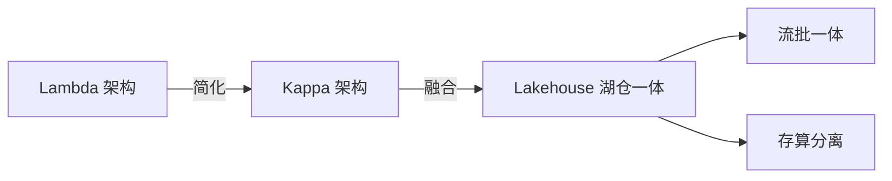

### 数据成熟度模型

| 阶段 | 特征 | 能力 |
|------|------|------|
| L1 初始 | 数据孤岛、手工报表 | 无系统化能力 |
| L2 受管理 | 统一数仓、BI报表 | 数据仓库+OLAP |
| L3 定义 | 实时数仓、数据治理 | 流批一体+元数据管理 |
| L4 量化 | 数据资产化、自助分析 | 资产目录+语义层+Data Agent |
| L5 优化 | AI驱动自治、数据产品化 | ML自治+Data Mesh |

### 大数据ROI计算

```
ROI = (业务价值 − 投入成本) / 投入成本 × 100%

业务价值量化：
  效率提升：减少人工报表时间 × 人力成本
  风险降低：避免损失金额（风控/反欺诈）
  收入增长：推荐/精准营销带来的增量收入
  合规收益：避免罚款（GDPR/个保法）

投入成本：
  硬件/云资源：存储+计算+网络
  人力：数据团队薪资
  工具：商业软件许可
  时间：建设周期的机会成本

案例：
  某电商大数据平台年投入 500 万
  精准营销带来增量 GMV 5000 万（按1%转化率估算）
  风控拦截欺诈损失 800 万
  ROI = (5000+800−500)/500 = 10.6倍
```

### 数据驱动决策框架

| 层次 | 能力 | 用户 | 价值 |
|------|------|------|------|
| 描述性 | 发生了什么 | 管理层 | 报表/看板 |
| 诊断性 | 为什么发生 | 分析师 | 下钻/归因 |
| 预测性 | 将要发生什么 | 数据科学家 | ML模型 |
| 处理性 | 应该怎么做 | 业务系统 | 自动化决策 |

```
数据驱动决策闭环：
  数据采集 → 数据治理 → 分析洞察 → 决策执行 → 效果反馈
  ↑                                                    ↓
  ←←←←←←←←←←←←←←←←←←←←←←←←←←←←←←←←←←←←←←←←←←←←←←

关键要素：
  数据质量：信得过的数据是决策基础
  口径一致：同一指标全局唯一定义
  时效匹配：决策周期决定数据时效要求
  组织文化：数据文化 > 工具技术
```

### 各行业大数据应用场景

| 行业 | 典型场景 | 关键技术 | 数据特点 |
|------|---------|---------|---------|
| 金融 | 实时风控、反洗钱、信用评估 | Flink CEP、图计算、特征工程 | 高一致性、低延迟 |
| 医疗 | 影像辅助诊断、药物研发、流行病预测 | 深度学习、联邦学习、基因分析 | 隐私敏感、多模态 |
| 零售 | 千人千面推荐、供应链优化、需求预测 | 推荐算法、时序预测、知识图谱 | 高并发、实时 |
| 制造 | 预测性维护、质量检测、工艺优化 | IoT时序分析、边缘计算、数字孪生 | 海量IoT、实时 |
| 政务 | 城市大脑、一网通办、舆情分析 | 图计算、NLP、知识图谱 | 多源融合、安全 |

### 大数据投资决策矩阵

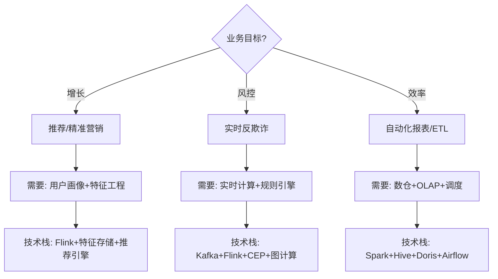

---

## 数据平台技术栈选型决策流程

```
选型流程六步法：
  Step 1 业务目标明确
    增长/风控/效率 → 不同技术方向
    避免「为建平台而建平台」
  
  Step 2 现状评估
    数据规模（TB/PB）
    团队技能栈（Java/Python/SQL）
    现有基础设施（Hadoop/云上）
  
  Step 3 候选方案收集
    按业务场景选型（实时/离线/混合）
    按团队能力选型（Python→Spark，Java→Flink）
  
  Step 4 POC 验证
    用真实数据集跑 Top10 查询
    评估性能、稳定性、运维复杂度
  
  Step 5 成本评估
    TCO（总拥有成本）= 硬件+软件+人力+时间
    云 vs 自建 3 年 TCO 对比
  
  Step 6 决策与灰度
    评分卡（需求匹配/性能/成本/生态/运维）
    灰度上线（10%→50%→100%）
```

| 评估维度 | 权重 | 评估方法 |
|----------|------|----------|
| 业务匹配度 | 30% | 需求覆盖率 |
| 性能 | 25% | POC 压测基准 |
| 成本 | 20% | TCO 计算 |
| 社区生态 | 15% | 活跃度、文档质量 |
| 运维复杂度 | 10% | 团队能力匹配 |

## 数据仓库 vs 数据湖 vs 数据湖仓三者边界

| 维度 | 数据仓库 | 数据湖 | 湖仓一体 |
|------|---------|--------|---------|
| 存储 | 专有存储 | 对象存储/HDFS | 对象存储+表格式 |
| Schema | 写时建模 | 读时建模 | 两者兼有 |
| 数据类型 | 结构化 | 原始多格式 | 结构化+原始 |
| 用户 | 分析师 | 数据科学家 | 全角色 |
| 成本 | 高 | 低 | 低 |
| 治理 | 强 | 弱 | 中→强 |
| 事务 | ACID | 无 | ACID（Iceberg） |
| 适用 | BI 报表 | 推荐/ML | 通用 |

```
边界判断：
  只有结构化数据 + T+1 报表 → 数据仓库
  多源原始数据 + 灵活探索 → 数据湖
  既要 BI 又要 ML + 低成本 → 湖仓一体
  
趋势：湖仓一体正在统一数据仓库与数据湖
```

## 数据产品经理与数据工程师协作模式

```
协作模式：

  需求阶段：
    产品经理（PM）定义业务需求 → 数据产品经理梳理指标口径
    → 数据工程师（DE）评估技术可行性 → 排期
  
  开发阶段：
    DE 建模/开发/自测 → PM 验收业务逻辑
    → 联调（数据正确性 + 时效性）
  
  上线阶段：
    DE 部署上线 → PM 确认数据准确
    → 运营监控（使用率/质量/性能）
  
  迭代阶段：
    业务反馈 → PM 收集需求 → DE 优化
    → 持续改进（质量/性能/功能）
```

| 角色 | 职责 | 交付物 |
|------|------|--------|
| 产品经理 | 业务需求、用户故事 | PRD |
| 数据产品经理 | 指标口径、数据模型 | 指标字典、数据模型图 |
| 数据工程师 | ETL 开发、管道建设 | ETL 代码、调度 DAG |
| 数据分析师 | 报表、洞察 | BI 看板、分析报告 |

## 数据需求文档模板要素

```markdown
# 数据需求文档模板

## 1. 需求背景
  业务场景、痛点、价值

## 2. 数据需求
  数据来源、字段清单、数据量预估

## 3. 指标定义
  原子指标/派生指标、口径、计算公式

## 4. 维度定义
  时间/地域/渠道/设备等分析维度

## 5. 输出要求
  报表/API/标签/模型

## 6. SLA 要求
  数据新鲜度、可用性、准确性

## 7. 非功能需求
  性能、安全、合规

## 8. 排期
  开发周期、上线时间
```

## 数据平台 SLA 体系（数据新鲜度/可用性/准确性）

| SLA 维度 | 定义 | 目标值 | 度量方式 |
|----------|------|--------|----------|
| 数据新鲜度 | 数据从产生到可用的时间 | < 5min（实时）/ < 1h（准实时） | 数据到达时间戳 - 事件时间戳 |
| 数据可用性 | 服务正常运行时间 | 99.9%（L1）/ 99.99%（L0） | 正常时间 / 总时间 |
| 数据准确性 | 数据与源端一致率 | > 99.9% | 对账 diff 率 |
| 查询延迟 | 查询响应时间 | < 3s（P99） | 延迟分布监控 |
| 数据完整性 | 非空/不缺失率 | > 99% | 质量规则检查 |

```text
SLA 分级：
  L0（核心交易）：99.99% 可用性，<200ms 延迟，秒级新鲜度
  L1（重要业务）：99.9% 可用性，<1s 延迟，分钟级新鲜度
  L2（一般分析）：99% 可用性，<3s 延迟，小时级新鲜度
  L3（低优批量）：95% 可用性，分钟级延迟，T+1 新鲜度

SLA 告警：
  新鲜度超 SLA → 触发告警 + 通知 Owner
  可用性低于 SLA → 自动升级到故障响应流程
  准确性低于阈值 → 阻断下游 + 生成修复工单
```

## 十、数据平台 ROI 计算

### ROI 计算公式

```
ROI = (收益 - 成本) / 成本 × 100%

收益分类：
  直接收益：精准营销增量、风控损失减少
  间接收益：效率提升、决策质量改善
  避免损失：合规罚款、数据泄露损失

成本分类：
  硬件/云资源：存储+计算+网络
  人力：数据团队薪资
  工具：商业软件许可
  时间：建设周期机会成本
```

### ROI 计算案例

| 指标 | 计算方式 | 数值 |
|------|----------|------|
| 精准营销增量 | GMV×转化率提升 | ¥5000万/年 |
| 风控损失减少 | 拦截欺诈金额 | ¥800万/年 |
| 效率提升 | 节省人工报表时间 | ¥200万/年 |
| 合规收益 | 避免GDPR罚款 | ¥100万/年 |
| 总收益 | — | ¥6100万/年 |
| 平台投入 | 云+人力+工具 | ¥500万/年 |
| ROI | (6100-500)/500 | 11.2倍 |

### 投资回收期

```
回收期 = 总投资 / 年净收益

示例：
  总投资：¥500万（建设期）
  年净收益：¥5600万（收益-运营成本）
  回收期：500/5600 ≈ 1.1个月

决策标准：
  回收期 < 6个月：强烈推荐
  回收期 6-12个月：推荐
  回收期 12-24个月：谨慎
  回收期 > 24个月：不推荐
```

## 数据团队结构

### 团队角色配置

| 角色 | 职责 | 技能要求 | 人数比例 |
|------|------|----------|----------|
| 数据工程师(DE) | 管道开发、ETL/ELT | SQL/Python/Java+Spark/Flink | 40% |
| 数据分析师(DA) | 报表、洞察、指标 | SQL+Python+BI工具 | 25% |
| 数据科学家(DS) | 建模、特征、算法 | Python+ML框架+统计学 | 20% |
| 数据架构师 | 技术选型、架构设计 | 全栈+业务理解 | 5% |
| 数据治理专员 | 标准、质量、安全 | 治理框架+工具 | 5% |
| 数据平台运维(SRE) | 集群、调度、监控 | 运维+K8s+监控 | 5% |

### 团队协作模式

```
协作流程：
  业务方提需求 → DA定义指标口径 → DE建管道 → DS建模 → 服务化上线

沟通机制：
  周会：同步进度、解决问题
  评审：需求评审、架构评审
  复盘：项目复盘、故障复盘
  知识分享：技术分享、业务分享

工具链：
  需求管理：Jira/Confluence
  代码协作：GitLab/GitHub
  数据开发：DataWorks/DataHub
  BI工具：Tableau/Superset
```

## 数据成熟度评估框架

### 成熟度模型

| 等级 | 名称 | 特征 | 能力 |
|------|------|------|------|
| L1 | 初始级 | 数据孤岛、手工报表 | 无系统化能力 |
| L2 | 受管理级 | 统一数仓、BI报表 | 数据仓库+OLAP |
| L3 | 已定义级 | 实时数仓、数据治理 | 流批一体+元数据管理 |
| L4 | 量化管理级 | 数据资产化、自助分析 | 资产目录+语义层+Data Agent |
| L5 | 优化级 | AI驱动自治、数据产品化 | ML自治+Data Mesh |

### 评估维度

| 维度 | L1 | L2 | L3 | L4 | L5 |
|------|----|----|----|----|----|
| 数据架构 | 无标准 | 统一数仓 | 湖仓一体 | 数据网格 | 智能自治 |
| 数据治理 | 无 | 基础治理 | 全面治理 | 自动化 | AI驱动 |
| 数据质量 | 无监控 | 基础规则 | 自动检测 | 预测预防 | 自愈 |
| 数据安全 | 无 | 基础权限 | 分级分类 | 动态脱敏 | 零信任 |
| 数据文化 | 无意识 | 被动响应 | 主动分析 | 数据驱动 | 数据产品 |

### 成熟度提升路径

```
L1→L2（6-12个月）：
  建立统一数仓
  实现基础BI报表
  建立数据开发流程

L2→L3（12-18个月）：
  实时数仓建设
  数据治理体系
  元数据管理

L3→L4（18-24个月）：
  数据资产化
  自助分析平台
  语义层建设

L4→L5（24-36个月）：
  AI驱动治理
  Data Mesh
  数据产品化
```

## 数据战略与业务对齐

### 对齐框架

```
业务战略 → 数据战略 → 技术实现

业务目标：
  增长：精准营销、推荐系统
  效率：自动化报表、智能决策
  风控：实时反欺诈、信用评估
  合规：数据安全、隐私保护

数据能力：
  数据采集：多源接入、实时CDC
  数据存储：湖仓一体、存算分离
  数据分析：OLAP、机器学习
  数据服务：API、标签、指标

技术实现：
  基础设施：云原生、弹性计算
  数据平台：采集→存储→计算→治理→服务
  工具链：开发→测试→部署→监控
```

### 优先级矩阵

| 优先级 | 业务价值 | 技术复杂度 | 投入 |
|--------|----------|------------|------|
| P0 | 高 | 低 | 立即 |
| P1 | 高 | 高 | 规划 |
| P2 | 低 | 低 | 有空做 |
| P3 | 低 | 高 | 不做 |

## 大数据失败模式

### 常见失败原因

| 原因 | 表现 | 预防 |
|------|------|------|
| 目标不清 | 建了平台没人用 | 先明确业务场景 |
| 技术驱动 | 为技术而技术 | 业务价值优先 |
| 治理缺失 | 数据质量差、没人敢用 | 治理先行 |
| 人才不足 | 建了不会用 | 培训+招聘 |
| 组织障碍 | 部门墙、数据孤岛 | 高层推动 |
| 口径不一 | 同指标多个数 | 统一口径定义 |

### 失败案例分析

```
案例1：平台没人用
  原因：只建平台，不建数据文化
  教训：平台+文化+培训三管齐下

案例2：数据质量差
  原因：治理缺失，事后补课
  教训：治理从第一天内建

案例3：成本失控
  原因：存储爆炸、计算浪费
  教训：成本优化前置

案例4：人才流失
  原因：数据团队边缘化
  教训：数据团队与业务融合
```

---

## 数据平台组织协同模式（嵌入式 / 集中式 / Hub-and-Spoke）

| 模式 | 结构 | 优点 | 缺点 | 适用 |
|------|------|------|------|------|
| 集中式 | 统一数据团队承接所有需求 | 标准统一、平台复用高 | 排期拥堵、离业务远 | 初创/数据团队 <10 人 |
| 嵌入式 | 数据工程师编入各业务线 | 响应快、懂业务 | 标准漂移、重复造轮子 | 业务差异大、成熟度高 |
| Hub-and-Spoke | 平台组（Hub）+ 各域数据接口人（Spoke） | 兼顾标准与响应 | 需要强治理机制 | 中大型企业主流选择 |

```text
Hub 职责：平台底座（存储/计算/调度/治理工具）、全局标准（命名/口径/安全）、
         专家支持与评审
Spoke 职责：本域数据建模、指标落地、质量 Owner、需求一线承接
关键机制：Spoke 人员「双线汇报」（行政归业务、专业归 Hub），
         否则三个月内必然退化为纯嵌入式
```

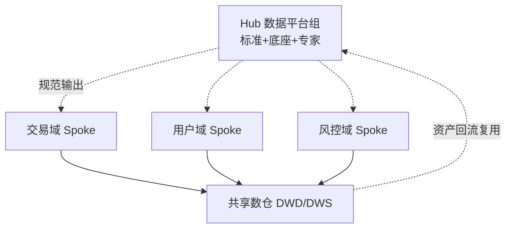

## 数据需求优先级评估框架（价值/成本/风险打分）

```text
综合得分 = 业务价值 × 40% + 紧急度 × 20% − 实现成本 × 25% − 合规风险 × 15%
（各维度 1~5 分，负向项取反后加权；>3.5 分进当月迭代，<2 分挂起）
```

| 维度 | 打分要点 | 示例评分 |
|------|---------|---------|
| 业务价值 | 影响收入/成本金额、决策层级 | GMV 看板服务 VP 决策=5 |
| 紧急度 | 有无监管/大促硬截止 | 审计整改=5，锦上添花=1 |
| 实现成本 | 人日 × 数据就绪度 × 上游改造量 | 源头字段缺失=4（高） |
| 合规风险 | 是否涉及个人信息跨境/二次利用 | 含手机号明文出域=5（高风险） |

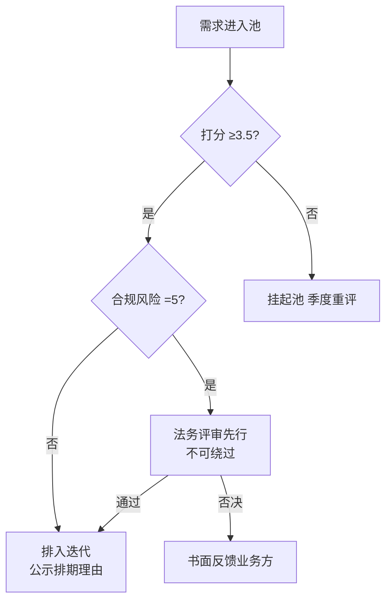

运营要点：打分公开透明（每周需求池例会）；拒绝的需求必须给出量化理由；每季度回溯已交付需求的实际使用率，校准价值权重。

## 典型业务数据指标体系搭建步骤

```text
Step1 北极星定位：与业务负责人对齐唯一核心目标
      （电商=GMV/利润，内容=LTV 时长，SaaS=NRR）
Step2 OSM 拆解：Objective → Strategy → Measurement
      目标「GMV +20%」→ 策略「提升复购」→ 度量「30 日复购率」
Step3 三层指标树：
      一级（管理层看）：北极星 + 5 个以内核心结果指标
      二级（部门看）：过程指标（转化漏斗各环节）
      三级（一线用）：可操作诊断指标（按钮点击率等）
Step4 口径定义：每指标登记 原子指标/维度/修饰词/Owner/更新频率
Step5 落地验证：新旧口径并行一周，差异 >0.5% 必须解释
```

| 层级 | 指标示例 | 更新频率 | 服务对象 |
|------|---------|---------|---------|
| L1 北极星 | 月度有效 GMV | 日 | CEO/VP |
| L2 过程 | 下单转化率、支付成功率 | 小时 | 部门负责人 |
| L3 诊断 | 各渠道点击率、失败支付原因分布 | 准实时 | 运营/产品 |

常见坑：一上来建几百个指标（没人看）、只有结果没有过程指标（异常无法下钻）、口径由 BI 工程师单方面拍板（业务不认）。

## 数据平台建设路线图（0→1→2→3 阶段）

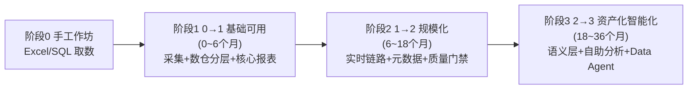

| 阶段 | 关键交付 | 团队配置 | 成功标志 |
|------|---------|---------|---------|
| 0→1 | 数仓三层模型、Top20 报表、调度上线 | 3~5 DE + 1 架构 | 核心报表 T+1 稳定供给 |
| 1→2 | 实时数仓、血缘/质量平台、SLA 机制 | +平台运维 +治理专员 | 报表故障 MTTR < 1h |
| 2→3 | 指标字典全覆盖、API 服务化、自助分析 | +数据产品经理 | 自助取数占比 >60% |

路线图纪律：**每个阶段有明确「毕业条件」才进入下一阶段**——最常见的翻车是地基未稳（阶段 1 质量没闭环）就上马实时与 AI，最后所有问题在实时链路上以 10 倍代价重现。

## 数据平台常见失败原因复盘

| 失败模式 | 表面现象 | 根因分析 | 复盘对策 |
|----------|---------|---------|---------|
| 平台建成无人用 | 调用量趋零 | 只做技术不做运营，无种子场景 | 先绑定 3 个高频业务场景再谈平台 |
| 口径罗生门 | 两个会报两个数 | 无指标 Owner 制，BI 私自定义 | 指标字典 + 变更评审 + 双 Owner 签字 |
| 治理烂尾 | 质量规则建完即荒废 | 治理无考核挂钩，纯运动式 | 合格率纳入团队 OKR，月度通报 |
| 成本失控 | 账单季度翻倍 | 无配额/生命周期/账单归因 | 按域分账单 + 冷热分层 + 僵尸表清理 |
| 关键人依赖 | 一人离职系统瘫痪 | 文档缺失，知识在个人 | 血缘自动化 + 强制文档 + 结对备份 |
| 技术追新踩坑 | 新引擎半年换一次 | 选型跟风，无 POC 评估流程 | 选型评分卡 + 至少一个季度 POC |

复盘方法论：每次事故输出「时间线 → 直接原因 → 体制原因 → 行动项（带 Owner 和期限）」，行动项进下季度跟踪。组织层面最高频根因不是技术，而是**数据团队与业务的权责边界不清**——先解决组织问题，再解决技术问题。

## 数据需求接入标准流程（SLA 化）

| 环节 | 动作 | 时限 SLA | 产出物 |
|------|------|---------|--------|
| 提交 | 业务方填需求单（背景/口径/期望时间） | — | 需求单 |
| 澄清 | DA 与业务对齐口径与维度 | ≤2 工作日 | 口径确认书 |
| 评估 | 打分（价值/成本/风险）+ 排期公示 | ≤3 工作日 | 评分卡 + 排期 |
| 开发 | DE 建模/开发/自测 | 按人日评估 | 上线申请 |
| 验收 | 业务确认数据正确性 | ≤5 工作日 | 验收记录 |
| 回访 | 30 天后统计使用率 | 自动化 | 使用率报告 |

```text
流程红线：
  无口径确认书不开发（避免返工第一杀手）
  无验收不上线（上线即默认业务认可）
  使用率连续 90 天为 0 的产出自动进入下线评审
  需求变更超过原评估人日 50% 需重新排期
```

| 度量指标 | 计算方式 | 健康值 |
|----------|---------|--------|
| 需求按时交付率 | 按期交付数 / 总交付数 | > 85% |
| 口径返工率 | 因口径不清返工 / 总需求 | < 5% |
| 资产沉淀率 | 进入 DWS+ 的产出 / 总需求 | > 40% |
| 需求自助率 | 自助工具完成 / 全部取数需求 | > 60% |

> 一句话总结：**组织定模式（Hub-and-Spoke）、需求靠打分（价值/成本/风险）、指标有体系（北极星→三层树）、建设按路线图（0→1→2→3 毕业制）、失败要复盘（根因到体制层）**。

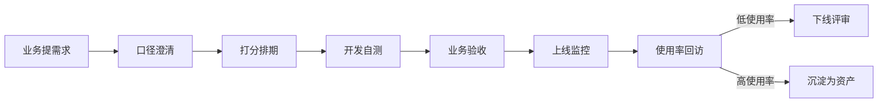

---

## 数据文化建设

### 文化要素

| 要素 | 说明 | 落地方式 |
|------|------|----------|
| 数据意识 | 全员重视数据 | 培训+宣导 |
| 数据素养 | 会用数据 | 数据素养培训 |
| 数据驱动 | 用数据决策 | 建立数据决策流程 |
| 数据共享 | 打破孤岛 | 数据开放平台 |
| 数据质量 | 质量第一 | 质量考核机制 |

### 数据素养培训

```
培训体系：
  管理层：数据思维、ROI计算
  业务层：SQL基础、BI工具使用
  技术层：数据开发、治理工具
  全员：数据安全、合规意识

培训方式：
  内训：定期技术分享
  外训：认证培训
  实战：项目中学习
  社区：数据社区交流

考核机制：
  数据使用率：报表访问频率
  数据质量：上报数据准确率
  数据共享：开放数据集数量
```

> 一句话：**大数据 = 4V 特征（大量/高速/多样/真实）+ 治理体系（质量/安全/标准/生命周期）+ 元数据（找得到）+ 资产化（能复用）——趋势是 Data Agent（AI 驱动的智能数据管理）；组织靠「DE 建管道、DA/DS 用数据、治理定标准」协作闭环**。

---

## 二十一、数据平台组织协同模式（嵌入式 / 集中式 / Hub-and-Spoke）

### 21.1 三种协同模式

| 模式 | 结构 | 优点 | 缺点 | 适用场景 |
|------|------|------|------|---------|
| 嵌入式 | 数据工程师嵌入业务团队 | 响应快、理解业务 | 资源分散、标准不一 | 小团队/初创 |
| 集中式 | 独立数据平台团队 | 资源集中、标准统一 | 响应慢、脱离业务 | 中大型企业 |
| Hub-and-Spoke | 平台团队+业务数据团队 | 兼得灵活与标准化 | 协调成本高 | 大型组织 |

### 21.2 协同模式选择

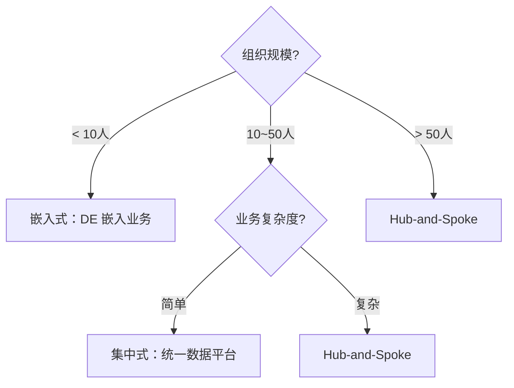

## 二十二、数据需求优先级评估框架（价值/成本/风险三维打分）

### 22.1 评估维度

| 维度 | 权重 | 评估指标 | 评分标准 |
|------|------|---------|---------|
| 价值 | 40% | 业务影响/用户数/收入 | 1-5 分 |
| 成本 | 30% | 开发工时/资源/维护 | 1-5 分（越低成本越高分） |
| 风险 | 30% | 技术风险/数据质量/合规 | 1-5 分（越低风险越高分） |

### 22.2 评估模板

```text
数据需求优先级评估表

需求名称：_______________
申请人：_______________  日期：_______________

| 维度 | 权重 | 得分 | 加权分 |
|------|------|------|--------|
| 业务价值 | 40% | /5 | |
| 实施成本 | 30% | /5 | |
| 技术风险 | 30% | /5 | |
| 综合得分 | 100% | | |

优先级：P0/P1/P2/P3
决策：批准/延后/拒绝
```

## 二十六、数据平台组织模式深度对比

### 26.1 三种组织模式详解

```text
嵌入式（Embedded）：
  结构：数据工程师嵌入各业务团队
  优点：
    响应快（直接对接业务）
    理解业务（深度参与业务）
    决策快（无跨团队协调）
  缺点：
    资源分散（重复建设）
    标准不一（各团队各搞一套）
    技术债（缺乏统一架构）
  适用：
    小团队（<10人）
    初创公司
    业务差异大

集中式（Centralized）：
  结构：独立数据平台团队承接所有需求
  优点：
    资源集中（避免重复建设）
    标准统一（全局规范）
    技术深度（专业团队）
  缺点：
    响应慢（排期拥堵）
    脱离业务（不懂业务场景）
    瓶颈效应（需求积压）
  适用：
    中大型企业
    数据团队10-50人
    业务相对统一

Hub-and-Spoke：
  结构：平台组（Hub）+ 各域数据接口人（Spoke）
  优点：
    兼顾标准与响应
    资源复用（Hub底座）
    业务理解（Spoke深入）
  缺点：
    协调成本高
    需要强治理机制
    双线汇报复杂
  适用：
    大型组织
    数据团队>50人
    多业务线
```

### 26.2 组织模式选择决策

| 组织规模 | 业务复杂度 | 推荐模式 | 理由 |
|----------|------------|----------|------|
| <10人 | 低 | 嵌入式 | 资源有限，快速响应 |
| <10人 | 高 | 嵌入式+轻量Hub | 业务差异大，需统一标准 |
| 10-50人 | 低 | 集中式 | 资源集中，标准统一 |
| 10-50人 | 高 | Hub-and-Spoke | 兼顾标准与响应 |
| >50人 | 低 | 集中式+子团队 | 大团队分领域 |
| >50人 | 高 | Hub-and-Spoke | 大型组织主流选择 |

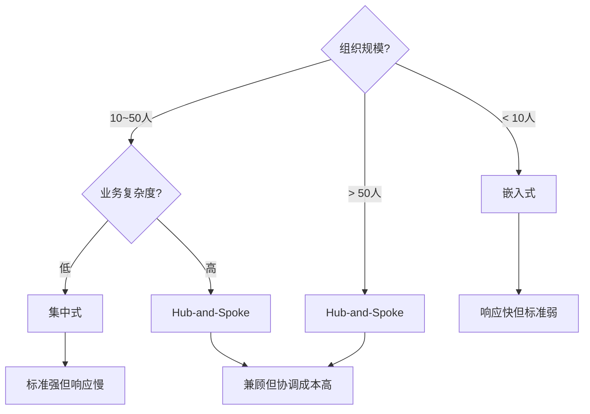

## 二十七、数据中台与数据湖概念边界

### 27.1 概念定义

```text
数据中台（Data Middle Platform）：
  定义：企业级数据能力复用平台
  核心能力：
    数据汇聚与治理：统一数据湖+元数据+质量规则
    数据服务化：封装为API（RESTful）
    业务赋能：直接驱动推荐、预警等应用
  产出：数据资产目录+数据服务API+指标平台
  口诀：汇数据、治数据、服业务

数据湖（Data Lake）：
  定义：存储原始数据的集中式存储库
  核心能力：
    多源存储：结构化/半结构化/非结构化
    低成本：对象存储/HDFS
    灵活分析：schema-on-read
  产出：原始数据存储+数据探索环境
  口诀：存原始、按需读、灵活分析

数据湖仓（Lakehouse）：
  定义：数据湖+数据仓库的融合架构
  核心能力：
    湖的灵活性：存储原始数据
    仓的治理：ACID事务+Schema管理
    存算分离：低成本+弹性扩展
  产出：统一数据平台+多引擎分析
  口诀：湖的灵活+仓的治理
```

### 27.2 概念边界对比

| 维度 | 数据中台 | 数据湖 | 数据湖仓 |
|------|---------|--------|---------|
| 核心价值 | 能力复用 | 原始存储 | 融合架构 |
| 数据格式 | 处理后数据 | 原始数据 | 原始+处理后 |
| 治理能力 | 强（治理平台） | 弱（原始存储） | 中→强 |
| 服务化 | API服务 | 数据探索 | API+探索 |
| 技术栈 | 治理工具+API网关 | 存储+查询引擎 | 表格式+多引擎 |
| 适用场景 | 企业级数据服务 | 数据探索/ML | 通用数据平台 |

```text
边界判断：
  只有数据存储 → 数据湖
  有数据存储+治理+服务 → 数据中台
  有数据存储+治理+服务+ACID → 数据湖仓
  
趋势：数据湖仓正在统一数据湖与数据仓库
      数据中台正在从"平台建设"走向"能力服务化"
```

## 二十八、典型行业数据架构

### 28.1 电商数据架构

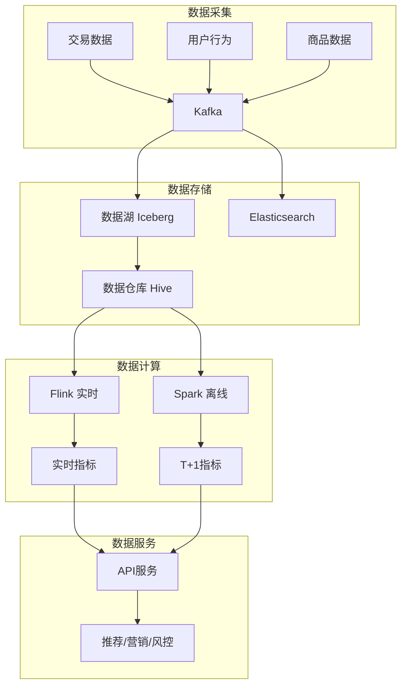

```text
电商数据架构特点：
  数据类型：交易+行为+商品+物流
  实时性要求：高（推荐/风控需秒级响应）
  数据量：TB~PB级
  关键技术：Kafka+Flink+Iceberg+推荐引擎
  
核心场景：
  千人千面推荐：用户画像+实时特征+推荐算法
  实时风控：交易监控+规则引擎+图计算
  供应链优化：需求预测+库存优化+物流调度
  精准营销：用户分群+个性化推送+效果归因
```

### 28.2 金融数据架构

```text
金融数据架构特点：
  数据类型：交易+风控+客户+市场
  实时性要求：极高（交易监控需毫秒级）
  数据量：PB级
  关键技术：Flink CEP+图计算+特征工程
  
核心场景：
  实时风控：交易监控+反欺诈+反洗钱
  信用评估：特征工程+模型训练+实时决策
  合规报告：监管报送+审计日志+数据脱敏
  量化交易：实时行情+策略回测+执行引擎

架构要点：
  数据安全：分级分类+加密+审计
  数据质量：实时校验+对账+异常检测
  数据时效：实时+准实时+离线多级
  合规要求：GDPR+个保法+行业监管
```

### 28.3 制造数据架构

```text
制造数据架构特点：
  数据类型：IoT传感器+MES日志+质检+供应链
  实时性要求：高（设备监控需秒级响应）
  数据量：TB~PB级（海量IoT数据）
  关键技术：时序数据库+边缘计算+数字孪生
  
核心场景：
  预测性维护：设备监控+故障预测+维护调度
  质量检测：视觉检测+工艺优化+根因分析
  供应链优化：需求预测+库存优化+物流调度
  能源管理：能耗监控+优化调度+成本控制

架构要点：
  边缘计算：数据预处理+本地决策+减少传输
  时序存储：高效写入+压缩+快速查询
  数字孪生：设备建模+仿真优化+预测分析
  实时告警：异常检测+实时通知+自动处理
```

### 28.4 IoT数据架构

```text
IoT数据架构特点：
  数据类型：传感器+设备+位置+环境
  实时性要求：高（设备控制需毫秒级）
  数据量：EB级（海量设备持续上报）
  关键技术：MQTT+时序数据库+流计算+边缘计算
  
核心场景：
  设备监控：实时状态+异常告警+远程控制
  数据分析：时序分析+趋势预测+异常检测
  智能决策：边缘AI+云端训练+协同优化
  资产管理：设备画像+维护预测+生命周期

架构要点：
  分层处理：边缘预处理+云端深度分析
  数据压缩：时序压缩+降采样+生命周期
  协议适配：MQTT+CoAP+HTTP多协议支持
  安全防护：设备认证+数据加密+访问控制
```

## 二十九、数据平台成熟度评估模型

### 29.1 五级成熟度模型

```text
L1 初始级（Initial）：
  特征：数据孤岛、手工报表
  能力：无系统化数据能力
  组织：无专职数据团队
  工具：Excel+SQL手动取数
  指标：无数据度量
  适用：初创公司/小型团队

L2 受管理级（Managed）：
  特征：统一数仓、BI报表
  能力：数据仓库+OLAP
  组织：有专职数据团队
  工具：数仓+BI工具+调度
  指标：基础数据质量监控
  适用：成长期公司/中型团队

L3 已定义级（Defined）：
  特征：实时数仓、数据治理
  能力：流批一体+元数据管理
  组织：数据治理专员+数据架构师
  工具：实时数仓+治理平台+元数据
  指标：全面数据质量+SLA机制
  适用：成熟期公司/大型团队

L4 量化管理级（Quantitatively Managed）：
  特征：数据资产化、自助分析
  能力：资产目录+语义层+Data Agent
  组织：数据产品经理+自助分析平台
  工具：资产平台+语义层+AI辅助
  指标：资产使用率+自助率+价值度量
  适用：大型企业/数据驱动型公司

L5 优化级（Optimizing）：
  特征：AI驱动自治、数据产品化
  能力：ML自治+Data Mesh+自动优化
  组织：数据产品团队+AI驱动治理
  工具：AI Agent+自动化平台+智能优化
  指标：自治率+优化效果+业务价值
  适用：领先企业/数据原生公司
```

### 29.2 评估维度

| 维度 | L1 | L2 | L3 | L4 | L5 |
|------|----|----|----|----|----|
| 数据架构 | 无标准 | 统一数仓 | 湖仓一体 | 数据网格 | 智能自治 |
| 数据治理 | 无 | 基础治理 | 全面治理 | 自动化 | AI驱动 |
| 数据质量 | 无监控 | 基础规则 | 自动检测 | 预测预防 | 自愈 |
| 数据安全 | 无 | 基础权限 | 分级分类 | 动态脱敏 | 零信任 |
| 数据文化 | 无意识 | 被动响应 | 主动分析 | 数据驱动 | 数据产品 |

### 29.3 成熟度提升路径

```text
L1→L2（6-12个月）：
  建立统一数仓
  实现基础BI报表
  建立数据开发流程
  团队：3-5人数据团队

L2→L3（12-18个月）：
  实时数仓建设
  数据治理体系
  元数据管理
  团队：+治理专员+架构师

L3→L4（18-24个月）：
  数据资产化
  自助分析平台
  语义层建设
  团队：+数据产品经理

L4→L5（24-36个月）：
  AI驱动治理
  Data Mesh
  数据产品化
  团队：+AI工程师+产品团队
```

## 三十、数据平台常见失败案例复盘

### 30.1 典型失败案例

```text
案例1：平台建成无人用
  表面现象：调用量趋零，ROI极低
  根因分析：
    只做技术不做运营
    无种子场景绑定
    缺乏数据文化建设
  复盘对策：
    先绑定3个高频业务场景再谈平台
    建立数据运营机制
    数据文化建设先行

案例2：口径罗生门
  表现：两个会报两个数，业务不信任数据
  根因分析：
    无指标Owner制度
    BI私自定义口径
    缺乏口径变更流程
  复盘对策：
    指标字典+Owner制度
    变更评审流程
    双Owner签字确认

案例3：治理烂尾
  表现：质量规则建完即荒废
  根因分析：
    治理无考核挂钩
    纯运动式治理
    缺乏持续运营
  复盘对策：
    合格率纳入团队OKR
    月度通报机制
    治理效果度量

案例4：成本失控
  表现：账单季度翻倍
  根因分析：
    无配额机制
    无生命周期管理
    缺乏账单归因
  复盘对策：
    按域分账单
    冷热分层存储
    僵尸表清理机制

案例5：关键人依赖
  表现：一人离职系统瘫痪
  根因分析：
    文档缺失
    知识在个人
    无备份机制
  复盘对策：
    血缘自动化
    强制文档要求
    结对备份机制

案例6：技术追新踩坑
  表现：新引擎半年换一次
  根因分析：
    选型跟风
    无POC评估流程
    缺乏技术选型标准
  复盘对策：
    选型评分卡
    至少一个季度POC
    技术选型评审流程
```

### 30.2 复盘方法论

```text
复盘流程：
  1. 时间线还原：事故/项目的关键时间节点
  2. 直接原因：导致问题的直接技术/操作原因
  3. 体制原因：导致问题的组织/流程/文化原因
  4. 行动项：带Owner和期限的改进措施
  5. 跟踪机制：下季度跟踪行动项完成情况

复盘原则：
  对事不对人：聚焦问题本身，不追究个人责任
  根因深挖：从技术原因挖到体制原因
  行动具体：每个行动项有明确Owner和期限
  闭环管理：行动项必须跟踪到完成
```

### 30.3 避坑指南

| 阶段 | 常见坑 | 避坑建议 |
|------|--------|----------|
| 规划 | 目标不清 | 先明确业务场景，再规划技术 |
| 选型 | 技术驱动 | 业务价值优先，技术选型评分卡 |
| 建设 | 治理缺失 | 治理从第一天内建 |
| 上线 | 人才不足 | 培训+招聘并行 |
| 运营 | 组织障碍 | 高层推动，建立数据文化 |
| 持续 | 成本失控 | 成本优化前置，配额机制 |

## 三十一、数据平台成熟度评估模型

### 成熟度等级

| 等级 | 特征 | 能力 | 组织 |
|------|------|------|------|
| L1 初始 | 手工取数 | 无统一平台 | 个人英雄 |
| L2 可重复 | 基础ETL | 离线数仓 | 小团队 |
| L3 已定义 | 实时+离线 | 数据湖仓 | 中型团队 |
| L4 量化管理 | 数据服务化 | 指标平台 | 专业团队 |
| L5 优化 | 智能决策 | AI平台 | 数据驱动 |

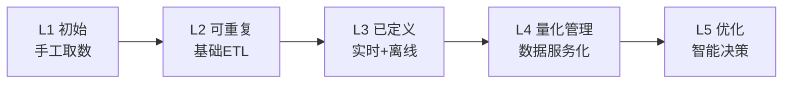

### 成熟度评估维度

| 维度 | L1 | L2 | L3 | L4 | L5 |
|------|-----|-----|-----|-----|-----|
| 数据采集 | 手工 | 批量 | 实时 | 流批一体 | 智能采集 |
| 数据存储 | 文件 | 关系型 | 湖仓 | 多模 | 自动分层 |
| 数据处理 | 手工 | ETL | 流处理 | 服务化 | 自动化 |
| 数据质量 | 无 | 基础检查 | 规则引擎 | 平台化 | AI驱动 |
| 数据安全 | 无 | 基础权限 | 分级分类 | 智能管控 | 自动化 |
| 数据服务 | 取数 | 报表 | API | 产品化 | 智能推荐 |

## SLA 定义与数据合约

### SLA 指标体系

| SLA指标 | 定义 | 计算公式 | 目标值 |
|---------|------|---------|--------|
| 数据新鲜度 | 数据从产生到可用时间 | 可用时间-产生时间 | <15min |
| 数据准确率 | 数据正确比例 | 正确记录/总记录 | >99.9% |
| 服务可用性 | 数据服务可用时间比例 | 可用时间/总时间 | >99.9% |
| 查询响应时间 | 用户查询平均响应 | 平均响应时间 | <3s |

```python
# SLA监控示例
class SLAMonitor:
    def __init__(self):
        self.metrics = {
            "freshness": [],  # 数据新鲜度
            "accuracy": [],   # 数据准确率
            "availability": [],  # 服务可用性
            "latency": []  # 查询响应时间
        }
    
    def check_sla(self, metric_name, value, target):
        """检查SLA是否达标"""
        if metric_name == "freshness":
            return value < target  # 新鲜度越小越好
        elif metric_name == "accuracy":
            return value > target  # 准确率越大越好
        return True
    
    def generate_report(self):
        """生成SLA报告"""
        report = {}
        for metric, values in self.metrics.items():
            report[metric] = {
                "avg": sum(values) / len(values),
                "p99": sorted(values)[int(len(values) * 0.99)],
                "target": self.get_target(metric)
            }
        return report
```

### 数据合约模板

| 合约项 | 定义 | 示例 |
|--------|------|------|
| 数据源 | 数据来源系统 | MySQL主库 |
| 更新频率 | 数据更新周期 | 每小时 |
| 数据格式 | 数据结构定义 | Parquet |
| 质量规则 | 数据质量要求 | 非空率>99% |
| 依赖关系 | 上下游依赖 | 依赖T+1报表 |
| 责任人 | 数据负责人 | 数据团队 |
| 保留期限 | 数据保存时间 | 3年 |

### 数据组织模式

| 模式 | 特征 | 适用场景 | 挑战 |
|------|------|---------|------|
| 集中式 | 统一数据团队 | 中小企业 | 响应慢 |
| 域式 | 各业务域自治 | 大型企业 | 口径不一致 |
| 混合式 | 平台+域协同 | 转型期企业 | 组织复杂 |
| 联邦式 | 虚拟数据层 | 多实体集团 | 治理困难 |

### 数据平台建设路径

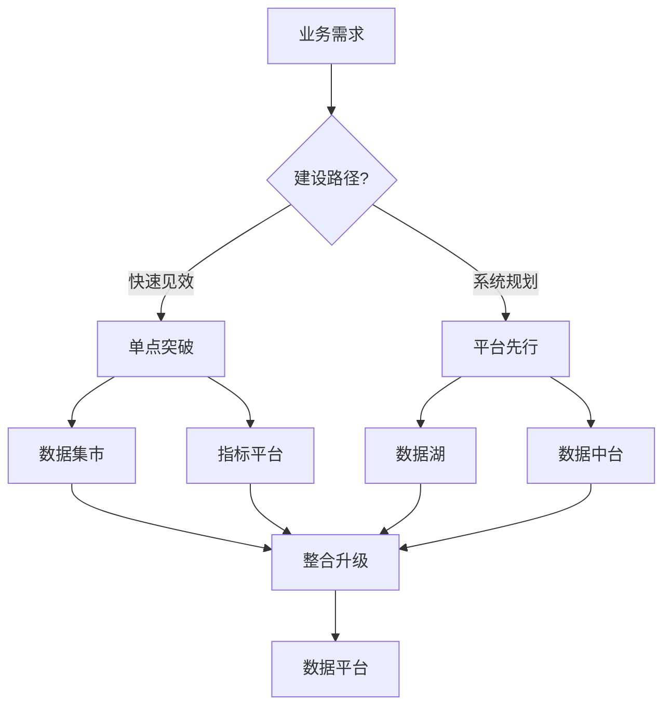

## 数据平台组织模式

### 组织架构对比

| 模式 | 说明 | 优点 | 缺点 | 适用场景 |
|------|------|------|------|---------|
| 中心化 | 独立数据团队 | 资源集中、标准化 | 响应慢、不了解业务 | 大型企业 |
| 去中心化 | 业务线自有数据 | 业务贴合、响应快 | 重复建设、标准不一 | 业务多元 |
| 混合模式 | 平台+业务双轨 | 平衡效率与标准 | 协调复杂 | 成长期企业 |
| 数据中台 | 共享数据能力 | 复用性高、成本低 | 建设周期长 | 技术驱动 |

### 组织架构设计

```
数据平台组织：
  数据平台部：基础设施、工具链、数据治理
  业务数据组：业务分析、指标开发、数据应用
  数据工程组：数据管道、ETL、数据质量
  数据科学组：算法、模型、AI应用

职责划分：
  平台部：提供数据存储、计算、调度、监控能力
  业务组：定义业务指标、开发数据产品
  工程组：保障数据质量、维护数据管道
  科学组：构建算法模型、支持业务决策
```

## 数据中台 vs 数据湖

| 维度 | 数据中台 | 数据湖 |
|------|---------|--------|
| 定位 | 数据能力复用平台 | 原始数据存储 |
| 数据格式 | 结构化为主 | 多格式（结构化/半结构化/非结构化） |
| 处理方式 | ETL（预处理） | ELT（后处理） |
| 用户 | 数据开发、分析师 | 数据科学家、工程师 |
| 价值 | 业务赋能 | 数据探索 |
| 技术栈 | Hadoop/Spark/Flink | S3/HDFS/Delta Lake |

```
数据中台 vs 数据湖：
  数据中台：数据治理 + 数据服务 + 数据应用
  数据湖：数据存储 + 数据探索 + 数据科学

  两者关系：
    数据湖 → 原始数据存储层
    数据中台 → 数据加工和服务层
    数据中台可以基于数据湖构建
```

## 典型行业架构

### 电商行业架构

```
电商数据架构：
  数据源：
    交易系统（订单、支付、库存）
    用户系统（注册、登录、行为日志）
    商品系统（SKU、价格、库存）
    营销系统（优惠券、活动、推荐）

  数据应用：
    实时推荐（用户画像、商品匹配）
    风控系统（交易风险、反欺诈）
    运营分析（GMV、转化率、复购率）
    供应链（库存预测、补货策略）
```

### 金融行业架构

```
金融数据架构：
  数据源：
    核心系统（账户、交易、清算）
    风控系统（反欺诈、信用评估）
    合规系统（监管报送、反洗钱）
    客户系统（CRM、KYC）

  数据应用：
    实时风控（交易监控、风险预警）
    监管报送（央行、银保监）
    客户画像（精准营销、产品推荐）
    经营分析（利润、资产、负债）
```

### 制造业架构

```
制造业数据架构：
  数据源：
    MES系统（生产过程、质量检测）
    ERP系统（采购、生产、销售）
    IoT传感器（设备状态、环境数据）
    PLM系统（产品设计、工艺流程）

  数据应用：
    预测性维护（设备故障预警）
    质量分析（缺陷根因分析）
    供应链优化（库存、物流）
    能源管理（能耗优化、成本控制）
```

## 数据成熟度评估

### 评估模型

| 等级 | 名称 | 特征 | 能力 |
|------|------|------|------|
| L1 | 初始级 | 临时分析 | Excel/SQL 手工分析 |
| L2 | 可重复 | 报表系统 | 定期报表、基础指标 |
| L3 | 已定义 | 数据仓库 | 主题域建模、ETL |
| L4 | 已管理 | 数据平台 | 实时计算、数据服务 |
| L5 | 优化级 | 数据智能 | AI驱动、自动化决策 |

### 评估维度

```
数据成熟度评估维度：
  数据质量：完整性、准确性、一致性、时效性
  数据治理：标准、安全、隐私、合规
  数据架构：存储、计算、调度、监控
  数据应用：报表、分析、AI、决策
  数据文化：意识、能力、流程、组织
```

## 失败案例复盘

### 常见失败原因

| 原因 | 表现 | 解决方案 |
|------|------|---------|
| 技术驱动 | 技术先进但业务不用 | 业务导向 |
| 数据质量差 | 分析结果不可信 | 数据治理 |
| 组织阻力 | 部门不配合 | 高层支持 |
| 人才短缺 | 项目无人维护 | 培养/引进 |
| 需求不清 | 做了没人用 | 需求调研 |
| 过度设计 | 架构复杂难维护 | 简单优先 |

### 成功关键因素

```
数据项目成功关键：
  1. 业务价值驱动（解决真实问题）
  2. 高层支持（资源+推动力）
  3. 数据质量保障（可信的数据）
  4. 快速迭代（小步快跑+持续交付）
  5. 人才培养（内部能力建设）
```

## SLA 定义

### SLA 分级

| 级别 | 可用性 | 延迟 | 恢复时间 | 适用场景 |
|------|--------|------|---------|---------|
| P0 | 99.99% | <1s | <5min | 核心交易 |
| P1 | 99.9% | <5s | <30min | 重要业务 |
| P2 | 99.5% | <30s | <4h | 一般业务 |
| P3 | 99% | <5min | <24h | 非关键 |

### SLA 指标定义

```
数据平台 SLA 指标：
  可用性：系统正常运行时间比例
  延迟：数据从产生到可查询的时间
  吞吐：单位时间处理的数据量
  准确性：数据处理的准确率
  恢复时间：故障后恢复服务的时间
```

## 建设路线图

### 阶段划分

```
数据平台建设路线：
  第一阶段（0-3月）：数据治理
    - 数据标准制定
    - 数据质量监控
    - 元数据管理

  第二阶段（3-6月）：数据仓库
    - 主题域建模
    - ETL 开发
    - 报表系统

  第三阶段（6-12月）：数据平台
    - 实时计算
    - 数据服务
    - 数据应用

  第四阶段（12月+）：数据智能
    - 机器学习
    - 智能推荐
    - 自动化决策
```

## 技术选型

### 选型原则

| 原则 | 说明 | 权重 |
|------|------|------|
| 业务匹配 | 满足业务需求 | 40% |
| 技术成熟 | 社区活跃、文档完善 | 25% |
| 运维成本 | 部署、监控、升级 | 20% |
| 扩展性 | 水平扩展、功能扩展 | 15% |

### 选型矩阵

```
大数据技术选型：
  存储：HDFS/S3/Hive/Iceberg
  计算：Spark/Flink/Presto
  调度：Airflow/DolphinScheduler
  消息：Kafka/Pulsar/RocketMQ
  查询：Trino/ClickHouse/Doris
```

## ICE 评分法

### ICE 评分模型

| 维度 | 说明 | 评分标准 |
|------|------|---------|
| Impact | 业务影响 | 1-10分（用户量×收益） |
| Confidence | 置信度 | 1-10分（数据支撑度） |
| Ease | 实施难度 | 1-10分（资源+时间） |

### ICE 评分计算

```
ICE Score = (Impact × Confidence × Ease) / 100

示例：
  项目A：Impact=8, Confidence=7, Ease=6 → ICE=3.36
  项目B：Impact=6, Confidence=8, Ease=8 → ICE=3.84
  项目C：Impact=9, Confidence=5, Ease=4 → ICE=1.80

排序：B > A > C（优先做B）
```

### ICE 评分决策

```
ICE 评分决策：
  ICE > 3.5：高优先级，立即启动
  ICE 2.5-3.5：中优先级，规划启动
  ICE < 2.5：低优先级，暂缓或放弃

  评分要点：
    Impact：量化业务价值（用户量、收入、成本）
    Confidence：数据支撑度（历史数据、调研数据）
    Ease：实施难度（技术、资源、时间）
```