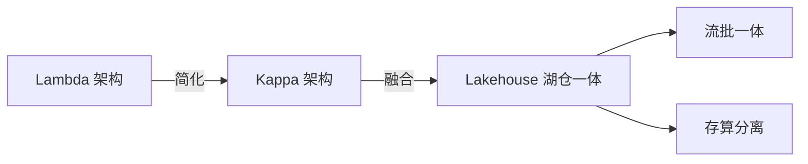
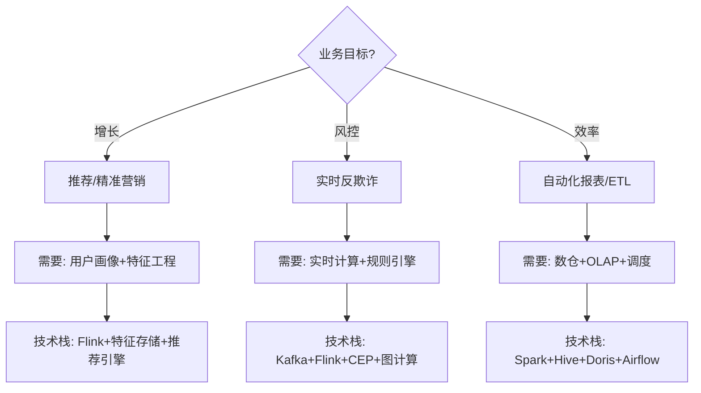

# 大数据 · 01 概述与业务体系（4V 特征 / 治理体系 / 元数据 / 资产化 / Data Agent / 组织分工）

> 大数据不是"更大的数据库"，而是"用数据驱动决策"的能力工程。本篇深入拆解：大数据 4V 特征、与传统数仓的本质区别、数据治理体系、元数据管理、数据资产化、Data Agent 趋势与组织分工。

---

## 一、要解决的问题

| 痛点 | 说明 |
|------|------|
| 数据分散 | 多源异构数据散落各处，无法统一分析 |
| 单机瓶颈 | 数据量超出单机处理能力 |
| 时效不足 | 离线 T+1 跟不上业务节奏 |
| 质量不可信 | 数据缺失/错误/口径不一，没人敢用 |
| 价值难兑现 | 数据有了但找不到、用不上、评不了价值 |

> 核心认知：**大数据 = 「数据驱动决策的能力工程」**——不是更大数据库，而是从采集、存储、计算到治理、服务的完整体系，最终把数据变成可复用资产。

---

## 二、什么是大数据

### 2.1 经典 4V 特征

| 维度 | 含义 | 工程挑战 |
|------|------|---------|
| Volume（大量） | TB→PB→EB 级数据量 | 分布式存储、存算分离 |
| Velocity（高速） | 数据实时产生 | 流式计算、低延迟管道 |
| Variety（多样） | 结构化/半结构化/非结构化 | 多源接入、schema-on-read |
| Veracity（真实） | 数据质量与可信度 | 数据治理、质量规则 |

```
4V 应对：
  Volume → 分布式存储（HDFS/对象存储）+ 列式压缩
  Velocity → 流式计算（Kafka + Flink）+ 批流一体
  Variety → 多源接入（DataX/CDC）+ schema-on-read（数据湖）
  Veracity → 质量规则 + 治理体系
```

### 2.2 与传统数仓的本质区别

| 对比 | 传统数仓 | 大数据平台 |
|------|---------|-----------|
| 数据规模 | GB~TB，结构化 | PB~EB，多源异构 |
| 处理模式 | T+1 批处理 | 批+流，近实时/实时 |
| 存储成本 | 高（专有硬件） | 低（X86+对象存储） |
| schema | 写时建模 | 读时建模 |
| 场景 | 报表/BI | 推荐/风控/画像/AI |

---

## 三、数据治理体系（深入）

### 3.1 治理框架

```
数据治理 = 确保数据的「质量、安全、可用、合规」

四大支柱：
  1. 数据质量：准确性、完整性、一致性、时效性
  2. 数据安全：分级分类、脱敏、加密、审计
  3. 数据标准：统一定义、口径、编码
  4. 数据生命周期：采集→存储→使用→归档→销毁

治理闭环：盘点 → 标准 → 质量 → 安全 → 考核 → 优化
```

### 3.2 数据质量管理

| 指标 | 计算方式 | 告警阈值 |
|------|----------|----------|
| 完整性 | 非空行数 / 总行数 | < 99% |
| 准确性 | 符合规则的行数 / 总行数 | < 99.9% |
| 一致性 | 跨表/跨系统一致行数 / 总行数 | < 100% |
| 时效性 | 数据到达时间 - 事件发生时间 | > 1h |
| 唯一性 | 去重后行数 / 总行数 | < 100% |

### 3.3 数据安全治理

| 措施 | 说明 |
|------|------|
| 分级分类 | 公开/内部/机密/绝密 |
| 动态脱敏 | 查询时脱敏（手机号、身份证） |
| 静态脱敏 | 测试/开发环境脱敏 |
| 行级权限 | 不同用户看不同行 |
| 审计日志 | 谁查了什么、改了什么 |
| 数据水印 | 追踪数据泄露源头 |

---

## 四、元数据管理

### 4.1 元数据类型

| 类型 | 说明 | 示例 |
|------|------|------|
| 技术元数据 | 表结构、字段、分区、Schema | 表名、字段类型、分区键 |
| 业务元数据 | 指标定义、口径、Owner | "日活"的定义、计算公式 |
| 操作元数据 | ETL 任务、调度、依赖 | 任务成功率、运行时长 |
| 治理元数据 | 质量规则、安全等级 | 数据质量评分、敏感度标记 |

### 4.2 元数据管理工具

| 工具 | 能力 | 适用 |
|------|------|------|
| Apache Atlas | Hadoop 生态元数据 | Hadoop 集群 |
| DataHub | LinkedIn 开源，易扩展 | 现代数据栈 |
| Amundsen | Lyft 开源，搜索友好 | 数据发现 |
| OpenMetadata | 标准化元数据 | 多源集成 |
| 阿里 DataWorks | 数据开发+治理一体 | 国内 |

### 4.3 元数据应用场景

```
数据发现：搜"订单"→ 找到所有订单相关表/指标
数据血缘：查看指标 A 依赖哪些表/任务
影响分析：字段变更 → 影响下游哪些报表/任务
数据质量：自动检查字段完整性/一致性
数据安全：自动识别敏感字段并脱敏
```

---

## 五、数据资产化

### 5.1 什么是数据资产

```
数据资产 = 被确权、可计量、可复用、能产生价值的数据

资产化步骤：
  1. 找数（扫描库表/接口）
  2. 认数（标注 owner/口径/敏感级）
  3. 理数（血缘/依赖）
  4. 用数（目录检索/订阅）
  5. 评数（热度/质量/价值打分）
```

### 5.2 数据目录

```
数据目录 = 数据的"搜索引擎"

功能：
  搜索：按关键词/标签/Owner 搜索
  浏览：按业务域/数据域浏览
  元数据：查看表结构/字段/样本数据
  血缘：查看上下游依赖
  质量：查看数据质量评分
  评论：数据使用反馈

产出：数据资产目录 + 数据地图
让"找得到、看得懂、信得过、用得上"
```

### 5.3 资产度量

```
数据价值 = 用数深度 × 覆盖广度 × 可信度

量化指标：
  访问热度：查询次数、使用人数
  业务价值：支撑的业务场景、ROI
  质量评分：完整性、准确性、时效性
  复用次数：被多少下游任务/报表引用

淘汰僵尸表：
  6 个月无查询 + 无下游引用 → 标记为僵尸表
  定期清理（释放存储资源）
```

---

## 六、Data Agent（2025 趋势）

### 6.1 概念

```
Data Agent = 具备自主感知/推理/执行的数据智能体

能力：
  1. 自动盘点资产（发现数据、标注元数据）
  2. 匹配权限与脱敏（自动推荐脱敏策略）
  3. 生成优化建议（索引优化、SQL 优化）
  4. 异常检测（自动发现数据异常）
  5. 自然语言查询（Text-to-SQL）
```

### 6.2 落地场景

| 场景 | 说明 |
|------|------|
| 智能数据发现 | 自然语言搜索 → 自动找到相关数据 |
| 智能质检 | 自动发现数据质量问题 |
| 智能建模 | 自动推荐表设计/索引 |
| 智能脱敏 | 自动识别敏感字段并推荐脱敏策略 |
| 智能 SQL 生成 | 自然语言 → SQL（Text-to-SQL） |

### 6.3 AI × Metadata

```
"AI × Metadata"正循环：
  资产热度、血缘深度、质量波动实时评估
  形成"治理—使用—反馈—优化"闭环

趋势：治理从"人工规则"走向"智能自治"，降低治理人力
详见 [13-新技术趋势与生态全景](13-新技术趋势与生态全景.md)
```

---

## 七、业务价值体系

### 7.1 六大典型场景

| 场景 | 价值 | 关键技术 |
|------|------|----------|
| 用户画像 | 千人千面推荐 | 标签体系、特征工程 |
| 实时风控 | 毫秒级反欺诈 | 流式计算、规则引擎 |
| BI 分析 | 经营决策支持 | OLAP、数据仓库 |
| 日志监控 | 排障、可观测 | 日志检索、链路追踪 |
| 供应链 | 预测性维护 | IoT、时序分析 |
| AI/大模型 | 训练样本、RAG | 特征存储、向量库 |

### 7.2 数据中台

```
数据中台 = 企业级数据能力复用平台

核心能力：
  数据汇聚与治理：统一数据湖 + 元数据 + 质量规则
  数据服务化：封装为 API（RESTful）
  业务赋能：直接驱动推荐、预警等应用

口诀：汇数据、治数据、服业务
```

---

## 八、组织与角色

| 角色 | 职责 |
|------|------|
| 数据工程师（DE） | 管道开发、ETL/ELT、平台建设 |
| 数据平台/运维（SRE） | 集群、调度、监控、成本 |
| 数据分析师（DA） | 报表、洞察、指标体系 |
| 数据科学家（DS） | 建模、特征、算法 |
| 数据治理专员 | 标准、质量、元数据、安全 |
| 首席数据官（CDO） | 数据战略、资产化 |

```
组织协作：
  DE 建管道 → DA/DS 用数据
  治理专员定标准 → SRE 保稳定
  CDO 定方向 → 全员兑现价值

分工原则：
  数据质量：DE 负责源头，治理专员负责规则
  口径定义：业务方（DA）定口径，数据方落实
  权限审批：治理专员审批，SRE 落地
```

---

## 九、设计 Checklist

- [ ] 明确业务目标（增长/风控/效率），再规划技术栈。
- [ ] 数据治理从第一天内建（质量/安全/口径），不事后补课。
- [ ] 元数据 + 血缘自动采集（Atlas/DataHub），建资产目录。
- [ ] 资产化闭环：找数→认数→理数→用数→评数。
- [ ] 设僵尸表清理机制（无查询+无引用 → 标记清理）。
- [ ] 引入 Data Agent 提效（盘点/脱敏建议/SQL 生成）。
- [ ] 明确数据 owner（业务+数据双负责人）。

---

## 大数据行业全景

### 行业数据规模与增速

| 行业 | 年数据量（2025） | 增速 | 关键数据类型 |
|------|-----------------|------|-------------|
| 金融 | 2.5 EB | 28% | 交易流水、风控日志、客户画像 |
| 医疗 | 1.8 EB | 36% | 影像、电子病历、基因组 |
| 零售 | 1.2 EB | 32% | 交易、点击流、供应链 |
| 制造 | 0.8 EB | 30% | IoT传感器、MES日志、质检 |
| 电信 | 1.0 EB | 25% | 信令、CDR、网络日志 |
| 政务 | 0.6 EB | 20% | 政务数据、城市感知 |

### 数据工程 vs 数据科学 vs 数据分析

```
三角色分工：
  数据工程师（DE）：建管道、ETL、平台建设 → "让数据流动"
  数据分析师（DA）：报表、洞察、指标体系 → "让数据说话"
  数据科学家（DS）：建模、特征、算法 → "让数据预测"

技能栈差异：
  DE：SQL/Python/Java/Scala + Spark/Flink/Kafka + Airflow
  DA：SQL + Python/R + BI工具（Tableau/Superset）
  DS：Python/R + ML框架（Sklearn/PyTorch）+ 统计学
```

### 数据平台架构模式

| 模式 | 核心思想 | 优点 | 缺点 |
|------|---------|------|------|
| Lambda | 批层+速度层双链路 | 容错好、结果准 | 维护两套代码、口径不一致 |
| Kappa | 一切皆流，不可变日志重放 | 架构简单、一套代码 | 历史重算困难、批类ETL复杂 |
| Lakehouse | 对象存储+开放表格式 | 一份数据多引擎、存算分离 | 生态仍在演进、运维新范式 |



### 数据成熟度模型

| 阶段 | 特征 | 能力 |
|------|------|------|
| L1 初始 | 数据孤岛、手工报表 | 无系统化能力 |
| L2 受管理 | 统一数仓、BI报表 | 数据仓库+OLAP |
| L3 定义 | 实时数仓、数据治理 | 流批一体+元数据管理 |
| L4 量化 | 数据资产化、自助分析 | 资产目录+语义层+Data Agent |
| L5 优化 | AI驱动自治、数据产品化 | ML自治+Data Mesh |

### 大数据ROI计算

```
ROI = (业务价值 − 投入成本) / 投入成本 × 100%

业务价值量化：
  效率提升：减少人工报表时间 × 人力成本
  风险降低：避免损失金额（风控/反欺诈）
  收入增长：推荐/精准营销带来的增量收入
  合规收益：避免罚款（GDPR/个保法）

投入成本：
  硬件/云资源：存储+计算+网络
  人力：数据团队薪资
  工具：商业软件许可
  时间：建设周期的机会成本

案例：
  某电商大数据平台年投入 500 万
  精准营销带来增量 GMV 5000 万（按1%转化率估算）
  风控拦截欺诈损失 800 万
  ROI = (5000+800−500)/500 = 10.6倍
```

### 数据驱动决策框架

| 层次 | 能力 | 用户 | 价值 |
|------|------|------|------|
| 描述性 | 发生了什么 | 管理层 | 报表/看板 |
| 诊断性 | 为什么发生 | 分析师 | 下钻/归因 |
| 预测性 | 将要发生什么 | 数据科学家 | ML模型 |
| 处理性 | 应该怎么做 | 业务系统 | 自动化决策 |

```
数据驱动决策闭环：
  数据采集 → 数据治理 → 分析洞察 → 决策执行 → 效果反馈
  ↑                                                    ↓
  ←←←←←←←←←←←←←←←←←←←←←←←←←←←←←←←←←←←←←←←←←←←←←←

关键要素：
  数据质量：信得过的数据是决策基础
  口径一致：同一指标全局唯一定义
  时效匹配：决策周期决定数据时效要求
  组织文化：数据文化 > 工具技术
```

### 各行业大数据应用场景

| 行业 | 典型场景 | 关键技术 | 数据特点 |
|------|---------|---------|---------|
| 金融 | 实时风控、反洗钱、信用评估 | Flink CEP、图计算、特征工程 | 高一致性、低延迟 |
| 医疗 | 影像辅助诊断、药物研发、流行病预测 | 深度学习、联邦学习、基因分析 | 隐私敏感、多模态 |
| 零售 | 千人千面推荐、供应链优化、需求预测 | 推荐算法、时序预测、知识图谱 | 高并发、实时 |
| 制造 | 预测性维护、质量检测、工艺优化 | IoT时序分析、边缘计算、数字孪生 | 海量IoT、实时 |
| 政务 | 城市大脑、一网通办、舆情分析 | 图计算、NLP、知识图谱 | 多源融合、安全 |

### 大数据投资决策矩阵



---

## 十、与其他板块的关系

- 技术体系见「[02-技术体系与架构演进](02-技术体系与架构演进.md)」；
- 数据仓库见「[09-数据仓库与OLAP引擎](09-数据仓库与OLAP引擎.md)」；
- 数据治理见「[12-数据治理与数据质量](12-数据治理与数据质量.md)」；
- 数据服务化见「[17-数据服务化与指标管理](17-数据服务化与指标管理.md)」；
- 安全合规见「[15-数据安全与隐私合规](15-数据安全与隐私合规.md)」。

> 一句话：**大数据 = 4V 特征（大量/高速/多样/真实）+ 治理体系（质量/安全/标准/生命周期）+ 元数据（找得到）+ 资产化（能复用）——趋势是 Data Agent（AI 驱动的智能数据管理）；组织靠「DE 建管道、DA/DS 用数据、治理定标准」协作闭环**。