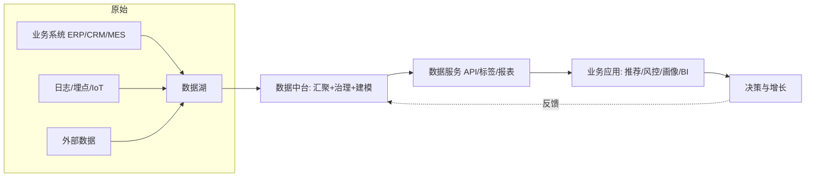
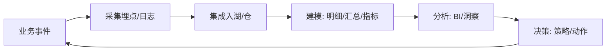

# 大数据 · 01 概述与业务体系

> 大数据不是"更大的数据库"，而是一种"用数据驱动决策"的能力工程：它用一套分布式技术体系，把海量、多源、实时的数据变成可复用、可信、可消费的数据资产。

本篇讲清两件事：**大数据是什么（概念与特征）**，以及**它为企业创造了什么业务价值（业务体系）**。技术体系见 [02-技术体系与架构演进](02-技术体系与架构演进.md)。

## 一、什么是大数据：4V 与演进

### 1.1 经典 4V 特征
| 维度 | 含义 | 工程挑战 |
|------|------|---------|
| Volume（大量） | TB→PB→EB 级数据量 | 分布式存储、存算分离、压缩 |
| Velocity（高速） | 数据实时产生（日志/交易/传感器） | 流式计算、低延迟管道 |
| Variety（多样） | 结构化/半结构化/非结构化 | 多源接入、 schema-on-read |
| Veracity（真实） | 数据质量与可信度 | 数据治理、质量规则 |

> 演进：从 3V（IBM 早期定义）→ 4V（加 Veracity）→ 5V（再加 Value 价值）。核心转型是从"数据大"到"数据有用"。

### 1.2 与传统数仓的本质区别
| 对比 | 传统数仓 | 大数据平台 |
|------|---------|-----------|
| 数据规模 | GB~TB，结构化为主 | PB~EB，多源异构 |
| 处理模式 | T+1 批处理 | 批 + 流，近实时/实时 |
| 存储成本 | 高（专有硬件） | 低（廉价 X86 + 对象存储） |
| schema | 写时建模（schema-on-write） | 读时建模（schema-on-read） |
| 场景 | 报表/BI | 推荐/风控/画像/AI |

## 二、业务价值：从数据孤岛到数据资产

企业建大数据的根本动机是**把分散的数据变成可复用的能力**，解决"数据孤岛、重复建设、口径不一"三大痛点。

### 2.1 六大典型业务场景
1. **用户画像与精准营销**：整合行为/交易/社交数据，构建标签体系，支撑千人千面推荐（某零售推荐转化率从 3%→12%）。
2. **实时风控与反欺诈**：流式计算 + 规则/模型，毫秒级识别盗刷、套现、刷单。
3. **商业智能（BI）与经营分析**：多维分析、即席查询、管理驾驶舱。
4. **日志/监控/可观测性**：海量日志实时检索与告警（ClickHouse/Druid/Pinot）。
5. **供应链与IoT**：设备传感器实时监测、预测性维护。
6. **AI/大模型训练**：特征工程、训练样本、向量化数据、RAG 知识库。

### 2.2 数据中台：业务能力的复用平台
数据中台本质是企业级**数据能力复用平台**，定位"数据资产的承载平台"：
- **数据汇聚与治理**：统一数据湖 + 元数据 + 质量规则（如 Apache Griffin）。
- **数据服务化**：封装为 API（RESTful），通过服务网格做流量管控与熔断。
- **业务赋能**：直接驱动推荐、预警等应用。

> 口诀：**"汇数据、治数据、服业务"**——汇聚是基础，治理是命脉，服务是出口。

## 三、数据资产化与数据驱动

- **数据资产**：被确权、可计量、可复用、能产生价值的数据（表/字段/指标/标签/模型）。
- **数据驱动决策**：用数据而非经验做经营判断，需要指标体系（OneData）统一口径。
- **数据主人制**：源头责任人认领数据，形成"发现问题—派发—治理—反馈"闭环。

## 四、组织与角色

| 角色 | 职责 |
|------|------|
| 数据工程师（DE） | 管道开发、ETL/ELT、平台建设 |
| 数据平台/运维（SRE） | 集群、调度、监控、成本 |
| 数据分析师（DA） | 报表、洞察、指标体系 |
| 数据科学家（DS） | 建模、特征、算法 |
| 数据治理专员 | 标准、质量、元数据、安全 |
| 首席数据官（CDO） | 数据战略、资产化 |

## 五、与大模型（AI）的关系（2025–2026 趋势）

- 大数据平台是 LLM 的**燃料厂**：训练语料清洗、特征存储、向量库、RAG 知识库。
- **Data Agent**（2025 兴起）：具备自主感知/推理/执行的数据智能体，自动盘点资产、匹配权限与脱敏、生成优化建议（如阿里 Dataphin 的 DataAgent）。
- 数据治理从"人工规则"走向"AI×Metadata"动态治理。

## 六、业务体系建设 Checklist

- [ ] 明确业务目标（增长/风控/效率），避免"为建平台而建平台"。
- [ ] 打通多源数据，建逻辑统一、物理分布的数据资源池（湖仓一体思想）。
- [ ] 先立数据标准与主数据，再谈分析（治理先行）。
- [ ] 把数据能力服务化（API/标签/报表），降低业务用数门槛。
- [ ] 建指标体系（OneData），统一口径，避免"同数不同义"。
  - [ ] 数据安全合规（分级分类、脱敏、审计）贯穿全链路。

> 参考：阿里 OneData 方法论、DAMA-DMBOK 数据治理框架、Dataphin/WeData/DataArts 等数据中台实践、IDC/前瞻产业研究院数字化治理报告。

## 七、数据驱动决策链路

- 决策闭环：**事件→数据→信息→知识→决策→行动→新事件**。每一环都要可度量（如"推荐策略上线后转化率 +2%"）。

## 八、数据资产盘点

- 步骤：① 找数（扫描库表/接口）→ ② 认数（标注 owner/口径/敏感级）→ ③ 理数（血缘/依赖）→ ④ 用数（目录检索/订阅）→ ⑤ 评数（热度/质量/价值打分）。
- 产出：**数据资产目录** + **数据地图**，让"找得到、看得懂、信得过、用得上"。
- 量化：按"访问热度 × 业务价值 × 质量分"给资产打分，淘汰僵尸表。

## 九、业务域建模

- 按**业务过程**（下单/支付/退款）切分数据域，每个域定义总线矩阵（维度 × 业务过程）。
- 示例：交易域 = 订单事实 + [用户/商品/时间/渠道] 维度；域间共享一致维度（一致性维度）。
- 落地：用 OneData 的"数据域→业务过程→原子指标→派生指标"逐层沉淀。

## 十、数据闭环与价值度量

| 闭环环节 | 关键动作 | 度量指标 |
|---------|---------|---------|
| 采集 | 埋点规范、全量+增量 | 采集覆盖率、延迟 |
| 集成 | 入湖/仓、标准化 | 集成成功率 |
| 建模 | 分层、口径统一 | 复用率、口径一致率 |
| 服务 | API/标签/报表 | 调用量、NPS |
| 反馈 | 业务效果回收 | ROI、转化率提升 |

- 数据价值 = **用数深度 × 覆盖广度 × 可信度**；治理就是持续提升这三项的工程。
