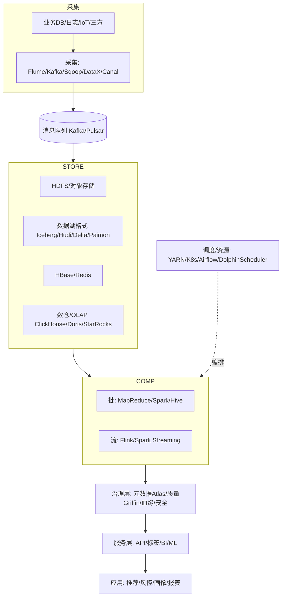
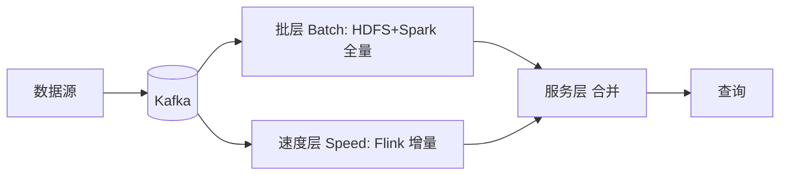
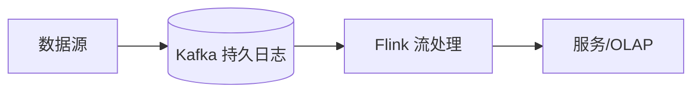
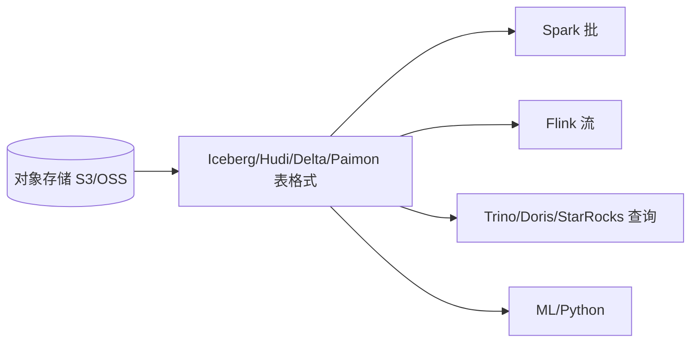
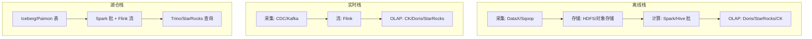

# 大数据 · 02 技术体系与架构演进（技术栈地图 / 批流对比 / Lambda-Kappa / 湖仓一体 / 选型矩阵）

> 大数据技术体系是一张"采集→存储→计算→治理→服务"的流水线。理解它，关键是抓住两条主线：**批 vs 流**（怎么算）、**湖 vs 仓**（怎么存）。本篇给出整体技术栈地图、架构演进（Lambda→Kappa→流批一体→湖仓一体）、存算分离与选型矩阵。

---

## 一、要解决的问题

| 痛点 | 说明 |
|------|------|
| 组件繁多 | 大数据组件几十个，不知各司何职 |
| 架构混乱 | 批流混用、湖仓不清，选型困难 |
| 双链路负债 | Lambda 两套代码难维护、口径不一致 |
| 存算耦合 | 扩容成本高、弹性差 |
| 演进路径 | 从离线到实时到湖仓的合理路径 |

> 核心认知：**大数据技术体系 = 「采集→存储→计算→治理→服务」流水线**——抓住「批 vs 流（怎么算）」和「湖 vs 仓（怎么存）」两条主线，就能看懂整个生态。

---

## 二、整体技术栈地图



---

## 三、批处理 vs 流处理

| 维度 | 批处理（Batch） | 流处理（Streaming） |
|------|----------------|---------------------|
| 数据边界 | 有界（固定数据集） | 无界（持续到达） |
| 时延 | 分钟~小时（T+1） | 秒~毫秒 |
| 典型引擎 | MapReduce、Spark、Hive | Flink、Kafka Streams、Storm |
| 场景 | 离线报表、建模 | 实时监控、风控、实时大屏 |
| 代表架构 | 离线数仓 | 实时数仓 |

```
批流关系：
  现实是"批流并存"：同一份数据，离线条做宽表建模，实时条做秒级指标
  批流的本质区别：数据边界（有界 vs 无界）+ 时延要求

如何选择：
  结果需求 T+1 可接受 → 批处理（简单成本低）
  需要秒级响应 → 流处理
  既要准又要快 → 流批一体（同一逻辑两种模式）
```

---

## 四、架构演进四阶段

### 4.1 Lambda 架构（批流双链路）



- **思想**：批层算准确全量结果，速度层补实时增量，服务层合并。
- **优点**：容错好、结果准。
- **缺点**：**维护两套代码/两套存储**，成本高、一致性难保证。
- **现状**：经典但渐被替代，适合对历史准确性要求高的场景。

### 4.2 Kappa 架构（流为中心）



- **思想**：一切皆流，用**不可变日志（Kafka）**重放代替批层，只用一套流引擎。
- **优点**：架构简单、一套代码。
- **缺点**：历史重算依赖重放长日志，批类复杂 ETL 在流上实现困难。
- **适用**：以实时为主的业务。

### 4.3 流批一体（Unified Batch+Stream）

- **核心**：用**同一套 API/引擎**处理有界与无界数据。Flink "有界流=批"模型、Spark micro-batch 都朝此演进。
- 开发者写一份逻辑，引擎自动适配批/流，消除 Lambda 双链路。

```
实现方式：
  Flink：批=有界流（同算子/SQL）
  Spark：Structured Streaming 同 DataFrame API
  存储：Paimon/Iceberg 同时承流承批
```

### 4.4 湖仓一体（Lakehouse）—— 当前主流终点

- **核心**：在**廉价对象存储（数据湖）**之上一层开放表格式（Iceberg/Hudi/Delta/Paimon），获得数据仓库的 ACID、schema 演进、时间旅行、高性能查询。
- **价值**：一份存储同时服务 BI（数仓式）与 ML/科学计算（湖式），消除"湖仓两套拷贝"。
- 详见 [11-实时数仓与湖仓一体](11-实时数仓与湖仓一体.md)、[05-列式存储与数据湖格式](05-列式存储与数据湖格式.md)。



---

## 五、存算分离：成本与弹性的关键

| 模式 | 说明 | 优劣 |
|------|------|------|
| 存算耦合（传统 Hadoop） | 计算与存储在同节点 | 本地读快，但扩容不灵活、资源浪费 |
| 存算分离（云原生） | 存储用对象存储，计算弹性扩缩 | 弹性好、成本低；网络 IO 成瓶颈，需缓存 |

```
存算分离形态：
  存储：对象存储（S3/OSS）+ 开放表格式（Iceberg/Paimon）
  计算：弹性集群（Spark/Flink on K8s）
  缓存：本地/分布式缓存补网络 IO

趋势：Iceberg + S3 + 弹性计算 + 本地缓存 = 2025 主流形态
```

---

## 六、组件角色速查（按层）

| 层 | 主流组件 |
|----|---------|
| 采集/同步 | Flume、Sqoop、DataX、Canal、Debezium、Logstash、Kafka Connect |
| 消息队列 | Kafka、Pulsar、RocketMQ（见 [MQ](../MQ.md)） |
| 分布式存储 | HDFS、S3/OSS 对象存储、Kudu |
| 表格式 | Iceberg、Hudi、Delta Lake、Paimon、DuckLake |
| NoSQL | HBase、Redis（见 [redis知识](../redis知识.md)）、Cassandra |
| 批计算 | MapReduce、Spark、Hive |
| 流计算 | Flink、Spark Streaming、Kafka Streams、Storm |
| OLAP/数仓 | ClickHouse、Doris、StarRocks、Kylin、Druid、Greenplum、Hive |
| 调度/资源 | YARN、Kubernetes、Airflow、DolphinScheduler |
| 治理 | Atlas（元数据/血缘）、Griffin（质量）、Ranger（权限）、Nessie/Polaris（湖仓 catalog） |

---

## 七、离线/实时/湖仓三层技术栈全景



- **离线栈**：T+1 建模、高吞吐、成本低，承载经营报表与宽表。
- **实时栈**：秒级、有状态、精确一次，承载风控/大屏/画像。
- **湖仓栈**：一份存储同时服务批/流/ML，是演进终点。

---

## 八、各层职责清单

| 层 | 核心职责 | 关键 SLA |
|----|---------|---------|
| 采集层 | 多源接入、格式归一 | 延迟、不丢 |
| 存储层 | 可靠、低成本、可扩展 | 耐久 99.999% |
| 计算层 | 批/流处理、建模 | 吞吐/时延 |
| 服务层 | API/标签/BI | 可用性、QPS |
| 治理层 | 元数据/质量/安全 | 合格率、合规 |

---

## 九、技术选型矩阵

| 需求 | 推荐组合 |
|------|---------|
| 纯离线数仓 | DataX + Hive/Spark + Doris |
| 纯实时大屏 | CDC + Kafka + Flink + StarRocks |
| 湖仓一体 | Flink CDC + Iceberg + Trino/StarRocks |
| 流式湖仓 | Flink + Paimon + StarRocks |
| 多云互操作 | Iceberg + Polaris + 多引擎 |
| 轻量快速 | DataX + Doris + DolphinScheduler |

### 9.1 选型决策要点

```
采集层：离线 DataX/Sqoop；实时 CDC（Canal/Debezium）；日志 Agent
存储层：批处理/湖 → 对象存储+表格式；低延迟随机 → HBase/Redis
计算层：批 Spark、流 Flink、交互 Trino
OLAP：单表聚合 CK、高并发 BI StarRocks、轻量 Doris
调度：资源 YARN/K8s；编排 Airflow/DS
治理：元数据 Atlas/DataHub、质量 Griffin、权限 Ranger
```

---

## 十、选型与演进 Checklist

- [ ] 新项目优先"湖仓一体 + 流批一体"，避免 Lambda 双链路负债。
- [ ] 实时优先选 Kappa/流批一体；需历史重算与高准确选 Lambda 改造。
- [ ] 存储选对象存储 + 开放表格式（Iceberg 通用性最强）。
- [ ] 计算按负载选：批 Spark、流 Flink、交互查询 Trino/Doris/StarRocks。
- [ ] 资源调度云原生化（K8s），保留 YARN 兼容旧作业。
- [ ] 治理与权限从第一天内建，而非事后补课。
- [ ] 按业务目标选型，不为建平台而建平台。

---

## 十一、与其他板块的关系

- 采集见「[03-数据采集与同步](03-数据采集与同步.md)」；
- 存储见「[04-分布式存储与HDFS](04-分布式存储与HDFS.md)」「[05-列式存储与数据湖格式](05-列式存储与数据湖格式.md)」；
- 计算见「[07-批处理计算：MapReduce与Spark](07-批处理计算：MapReduce与Spark.md)」「[08-流处理计算：Flink](08-流处理计算：Flink.md)」；
- 湖仓见「[11-实时数仓与湖仓一体](11-实时数仓与湖仓一体.md)」；
- 调度见「[10-资源调度：YARN与Kubernetes](10-资源调度：YARN与Kubernetes.md)」。

> 一句话：**大数据体系 = 采集→存储→计算→治理→服务流水线；演进主线是「批流双链路（Lambda）→ 流为中心（Kappa）→ 流批一体 → 湖仓一体」——选型先看「批 vs 流、湖 vs 仓」两条主线，再按负载选组件；新项目默认湖仓一体 + 流批一体 + 存算分离**。