# 大数据 · 02 技术体系与架构演进（技术栈地图 / 批流对比 / Lambda-Kappa / 湖仓一体 / 选型矩阵）

> 大数据技术体系是一张"采集→存储→计算→治理→服务"的流水线。理解它，关键是抓住两条主线：**批 vs 流**（怎么算）、**湖 vs 仓**（怎么存）。本篇给出整体技术栈地图、架构演进（Lambda→Kappa→流批一体→湖仓一体）、存算分离与选型矩阵。

---

## 一、要解决的问题

| 痛点 | 说明 |
|------|------|
| 组件繁多 | 大数据组件几十个，不知各司何职 |
| 架构混乱 | 批流混用、湖仓不清，选型困难 |
| 双链路负债 | Lambda 两套代码难维护、口径不一致 |
| 存算耦合 | 扩容成本高、弹性差 |
| 演进路径 | 从离线到实时到湖仓的合理路径 |

> 核心认知：**大数据技术体系 = 「采集→存储→计算→治理→服务」流水线**——抓住「批 vs 流（怎么算）」和「湖 vs 仓（怎么存）」两条主线，就能看懂整个生态。

---

## 二、整体技术栈地图

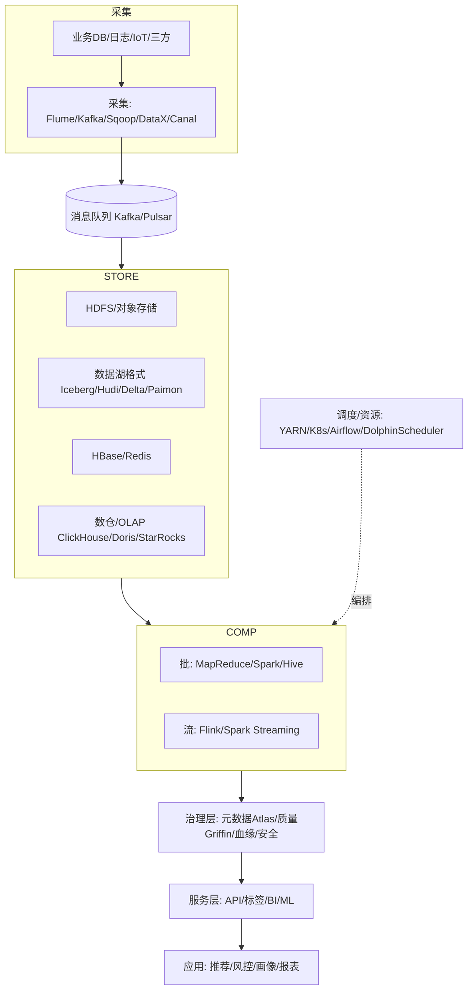

---

## 三、批处理 vs 流处理

| 维度 | 批处理（Batch） | 流处理（Streaming） |
|------|----------------|---------------------|
| 数据边界 | 有界（固定数据集） | 无界（持续到达） |
| 时延 | 分钟~小时（T+1） | 秒~毫秒 |
| 典型引擎 | MapReduce、Spark、Hive | Flink、Kafka Streams、Storm |
| 场景 | 离线报表、建模 | 实时监控、风控、实时大屏 |
| 代表架构 | 离线数仓 | 实时数仓 |

```
批流关系：
  现实是"批流并存"：同一份数据，离线条做宽表建模，实时条做秒级指标
  批流的本质区别：数据边界（有界 vs 无界）+ 时延要求

如何选择：
  结果需求 T+1 可接受 → 批处理（简单成本低）
  需要秒级响应 → 流处理
  既要准又要快 → 流批一体（同一逻辑两种模式）
```

---

## 四、架构演进四阶段

### 4.1 Lambda 架构（批流双链路）

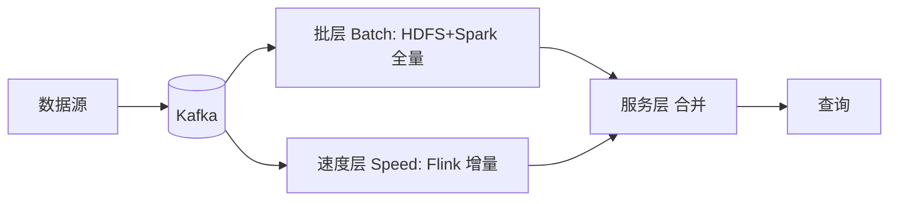

- **思想**：批层算准确全量结果，速度层补实时增量，服务层合并。
- **优点**：容错好、结果准。
- **缺点**：**维护两套代码/两套存储**，成本高、一致性难保证。
- **现状**：经典但渐被替代，适合对历史准确性要求高的场景。

### 4.2 Kappa 架构（流为中心）

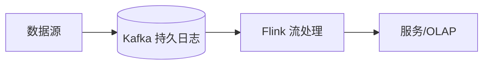

- **思想**：一切皆流，用**不可变日志（Kafka）**重放代替批层，只用一套流引擎。
- **优点**：架构简单、一套代码。
- **缺点**：历史重算依赖重放长日志，批类复杂 ETL 在流上实现困难。
- **适用**：以实时为主的业务。

### 4.3 流批一体（Unified Batch+Stream）

- **核心**：用**同一套 API/引擎**处理有界与无界数据。Flink "有界流=批"模型、Spark micro-batch 都朝此演进。
- 开发者写一份逻辑，引擎自动适配批/流，消除 Lambda 双链路。

```
实现方式：
  Flink：批=有界流（同算子/SQL）
  Spark：Structured Streaming 同 DataFrame API
  存储：Paimon/Iceberg 同时承流承批
```

### 4.4 湖仓一体（Lakehouse）—— 当前主流终点

- **核心**：在**廉价对象存储（数据湖）**之上一层开放表格式（Iceberg/Hudi/Delta/Paimon），获得数据仓库的 ACID、schema 演进、时间旅行、高性能查询。
- **价值**：一份存储同时服务 BI（数仓式）与 ML/科学计算（湖式），消除"湖仓两套拷贝"。
- 详见 [11-实时数仓与湖仓一体](11-实时数仓与湖仓一体.md)、[05-列式存储与数据湖格式](05-列式存储与数据湖格式.md)。

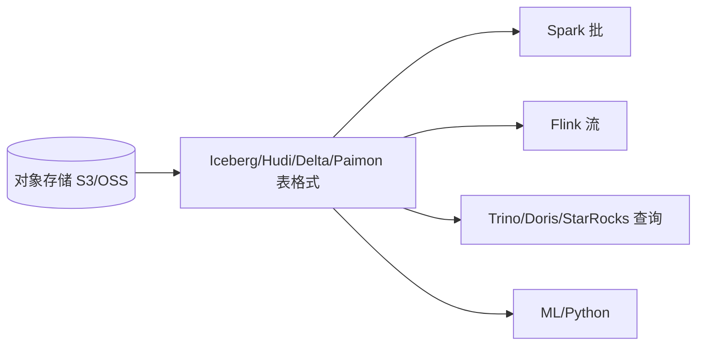

---

## 五、存算分离：成本与弹性的关键

| 模式 | 说明 | 优劣 |
|------|------|------|
| 存算耦合（传统 Hadoop） | 计算与存储在同节点 | 本地读快，但扩容不灵活、资源浪费 |
| 存算分离（云原生） | 存储用对象存储，计算弹性扩缩 | 弹性好、成本低；网络 IO 成瓶颈，需缓存 |

```
存算分离形态：
  存储：对象存储（S3/OSS）+ 开放表格式（Iceberg/Paimon）
  计算：弹性集群（Spark/Flink on K8s）
  缓存：本地/分布式缓存补网络 IO

趋势：Iceberg + S3 + 弹性计算 + 本地缓存 = 2025 主流形态
```

---

## 六、组件角色速查（按层）

| 层 | 主流组件 |
|----|---------|
| 采集/同步 | Flume、Sqoop、DataX、Canal、Debezium、Logstash、Kafka Connect |
| 消息队列 | Kafka、Pulsar、RocketMQ（见 [MQ](../MQ.md)） |
| 分布式存储 | HDFS、S3/OSS 对象存储、Kudu |
| 表格式 | Iceberg、Hudi、Delta Lake、Paimon、DuckLake |
| NoSQL | HBase、Redis（见 [redis知识](../redis知识.md)）、Cassandra |
| 批计算 | MapReduce、Spark、Hive |
| 流计算 | Flink、Spark Streaming、Kafka Streams、Storm |
| OLAP/数仓 | ClickHouse、Doris、StarRocks、Kylin、Druid、Greenplum、Hive |
| 调度/资源 | YARN、Kubernetes、Airflow、DolphinScheduler |
| 治理 | Atlas（元数据/血缘）、Griffin（质量）、Ranger（权限）、Nessie/Polaris（湖仓 catalog） |

---

## 七、离线/实时/湖仓三层技术栈全景

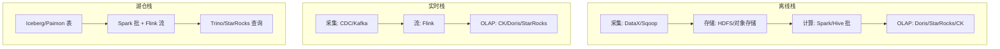

- **离线栈**：T+1 建模、高吞吐、成本低，承载经营报表与宽表。
- **实时栈**：秒级、有状态、精确一次，承载风控/大屏/画像。
- **湖仓栈**：一份存储同时服务批/流/ML，是演进终点。

---

## 八、各层职责清单

| 层 | 核心职责 | 关键 SLA |
|----|---------|---------|
| 采集层 | 多源接入、格式归一 | 延迟、不丢 |
| 存储层 | 可靠、低成本、可扩展 | 耐久 99.999% |
| 计算层 | 批/流处理、建模 | 吞吐/时延 |
| 服务层 | API/标签/BI | 可用性、QPS |
| 治理层 | 元数据/质量/安全 | 合格率、合规 |

---

## 九、技术选型矩阵

| 需求 | 推荐组合 |
|------|---------|
| 纯离线数仓 | DataX + Hive/Spark + Doris |
| 纯实时大屏 | CDC + Kafka + Flink + StarRocks |
| 湖仓一体 | Flink CDC + Iceberg + Trino/StarRocks |
| 流式湖仓 | Flink + Paimon + StarRocks |
| 多云互操作 | Iceberg + Polaris + 多引擎 |
| 轻量快速 | DataX + Doris + DolphinScheduler |

### 9.1 选型决策要点

```
采集层：离线 DataX/Sqoop；实时 CDC（Canal/Debezium）；日志 Agent
存储层：批处理/湖 → 对象存储+表格式；低延迟随机 → HBase/Redis
计算层：批 Spark、流 Flink、交互 Trino
OLAP：单表聚合 CK、高并发 BI StarRocks、轻量 Doris
调度：资源 YARN/K8s；编排 Airflow/DS
治理：元数据 Atlas/DataHub、质量 Griffin、权限 Ranger
```

---

## 十、选型与演进 Checklist

- [ ] 新项目优先"湖仓一体 + 流批一体"，避免 Lambda 双链路负债。
- [ ] 实时优先选 Kappa/流批一体；需历史重算与高准确选 Lambda 改造。
- [ ] 存储选对象存储 + 开放表格式（Iceberg 通用性最强）。
- [ ] 计算按负载选：批 Spark、流 Flink、交互查询 Trino/Doris/StarRocks。
- [ ] 资源调度云原生化（K8s），保留 YARN 兼容旧作业。
- [ ] 治理与权限从第一天内建，而非事后补课。
- [ ] 按业务目标选型，不为建平台而建平台。

---

## Hadoop 生态组件深度拆解

### 核心组件职责

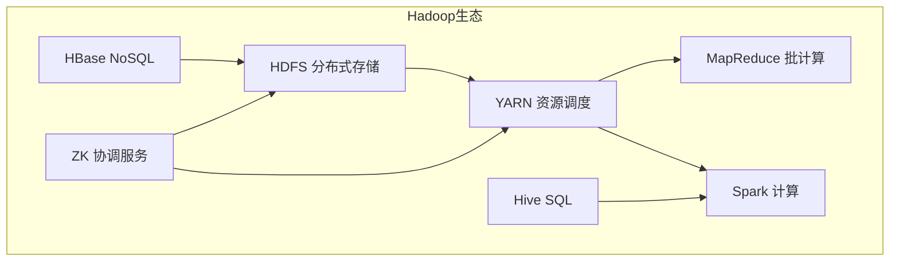

| 组件 | 角色 | 关键特性 |
|------|------|---------|
| HDFS | 分布式文件系统 | 分块128MB、3副本、机架感知 |
| YARN | 资源调度 | 容器化、多租户、弹性 |
| Hive | SQL on Hadoop | 元数据管理、HiveQL→MR/Spark |
| HBase | 列族NoSQL | 实时读写、LSM-Tree、Region分裂 |
| ZooKeeper | 分布式协调 | 选主、配置管理、分布式锁 |
| Sqoop | 数据同步 | RDBMS↔HDFS批量导入导出 |
| Flume | 日志采集 | 多级Agent、高可用管道 |

### YARN 资源管理内部机制

```
YARN 架构：
  ResourceManager（RM）：全局资源分配
    调度器（Scheduler）：容量/公平/先进先出
    应用管理器（ASM）：Application生命周期
  NodeManager（NM）：单节点资源管理
    容器（Container）：CPU+内存资源包
  ApplicationMaster（AM）：单任务资源协商
    向RM申请容器 → 向NM启动容器

调度器对比：
  FIFO：先进先出，简单但不共享
  Capacity：按队列预留容量，保证配额
  Fair：公平分配，支持抢占
  主流选择：Capacity（企业）+ Fair（弹性）

资源分配流程：
  客户端提交 → RM分配AM容器
  AM启动 → 向RM请求更多容器
  RM根据调度策略分配 → AM在NM上启动任务
```

### HDFS 架构深入

```
NameNode 架构（HA模式）：
  Active NN：处理所有客户端请求
  Standby NN：热备，同步元数据
  QJM（JournalNode）：共享editlog，多数派写入
  ZKFC：ZK故障检测，自动切换

DataNode 内部：
  数据块存储：磁盘目录（BP-pool/current/finalized）
  心跳汇报：每3秒一次，汇报块状态
  块汇报：全量块列表，启动时+定期
  块扫描：后台校验数据完整性

元数据内存估算：
  每文件inode：约200字节
  每块引用：约150字节
  1亿文件 × 3块 = 3亿块 → 约90GB堆内存
  → 小文件是NameNode杀手
```

### 数据序列化格式对比

| 格式 | 类型 | 编码方式 | 压缩 | Schema演进 | 适用场景 |
|------|------|---------|------|-----------|---------|
| Avro | 行式 | 二进制 | 可压缩 | Schema嵌入，强演进 | Kafka消息、Hive |
| Protobuf | 行式 | 二进制 | 不内置 | .proto文件，向后兼容 | gRPC、API |
| Thrift | 行式 | 二进制 | 不内置 | .thrift IDL | RPC、跨语言 |
| Parquet | 列式 | 二进制 | RLE/Dict | Footer嵌入 | OLAP分析、数据湖 |
| ORC | 列式 | 二进制 | Zlib/Snappy | Stripe元数据 | Hive、Trino |

```
选择建议：
  存储/分析 → Parquet/ORC（列式压缩比高）
  消息传输 → Avro（Schema演进友好）
  RPC/微服务 → Protobuf/Thrift（性能最优）
  生态兼容 → Parquet（Spark/Flink/Trino全支持）
```

### 数据压缩编码对比

| 编码 | 压缩率 | 解压速度 | 是否可分割 | 适用 |
|------|--------|---------|-----------|------|
| GZIP | 高(6:1) | 慢 | 否 | 冷数据归档 |
| Snappy | 中(4:1) | 极快 | 否 | 中间数据、流式 |
| LZ4 | 中(4:1) | 极快 | 否 | 实时场景 |
| ZSTD | 高(5:1) | 快 | 是 | 列式存储默认 |
| BZIP2 | 最高(7:1) | 很慢 | 是 | 归档 |

```
压缩策略：
  HDFS文件：ZSTD（可分割+高压缩率）
  Kafka消息：Snappy（低延迟优先）
  Parquet/ORC：ZSTD默认，列间+列内双重压缩
  冷数据：GZIP/BZIP2（压缩率优先）
```

### Schema 演进策略

```
Schema Evolution 规则：
  加列：新数据有新列，旧数据填默认值
  删列：旧数据忽略已删列
  改名：别名映射，兼容旧数据
  改类型：仅支持widening（int→long）

工具支持：
  Avro：Schema嵌入文件头，读时自动匹配
  Parquet：Schema写入Footer，支持列裁剪
  Iceberg：Schema ID版本化，快照绑定Schema
  Hive：ALTER TABLE ADD COLUMN（需重写元数据）

最佳实践：
  只做兼容性变更（加列/加字段）
  避免删列/改类型（破坏性变更走新表）
  写入时写入当前Schema，读时指定目标Schema
```

### 元数据管理架构

```
Hive Metastore：
  角色：表元数据存储（表名/字段/分区/位置）
  存储：MySQL/PostgreSQL（关系库存储元数据）
  接口：Thrift API（Hive/Presto/Spark共用）
  局限：无血缘、无质量、单点

Apache Atlas：
  定位：Hadoop生态元数据治理
  组件：Type System（类型定义）+ JanusGraph（图存储）+ Hook/Collector
  能力：自动血缘（Hook采集Hive/Spark作业）、分类标签、安全策略
  集成：Hive Hook → 自动注册表/列血缘

DataHub：
  定位：现代元数据平台（LinkedIn开源）
  架构：MySQL+Kafka+ES+Frontend
  能力：Push/Pull式采集、UI搜索、API、Impact Analysis
  优势：轻量、易扩展、多源集成

OpenMetadata：
  定位：标准化元数据（开源+协作）
  能力：数据发现、血缘、质量、术语表、治理工作流
  特点：API-first、REST+GraphQL
```

### 数据目录（Data Catalog）概念

```
数据目录 = 数据资产的"搜索引擎+管理系统"

核心能力：
  1. 资产发现：按关键词/标签/Owner搜索表/字段/指标
  2. 元数据管理：技术+业务+操作元数据统一存储
  3. 数据血缘：表级+字段级血缘，影响分析
  4. 数据质量：质量规则+评分+告警
  5. 数据安全：分级分类+权限+脱敏策略
  6. 数据治理：Owner认领、问题派单、考核

与数据湖的关系：
  数据湖 = 原始数据存储
  数据目录 = 数据湖的"治理层"，让湖中数据可管理
  湖仓一体 = 数据湖 + 数据仓库能力 + 数据目录治理

工具选型：
  Hadoop生态 → Apache Atlas
  现代数据栈 → DataHub / OpenMetadata
  云原生 → AWS Glue Catalog / Unity Catalog
  商业平台 → Alation / Collibra / Atlan
```

---

## 十一、Lambda vs Kappa 架构深度对比

### 对比矩阵

| 维度 | Lambda | Kappa |
|------|--------|-------|
| 核心思想 | 批+流双链路 | 一切皆流 |
| 代码维护 | 两套代码 | 一套代码 |
| 历史重算 | 批层处理 | 事件重放 |
| 运维复杂度 | 高（两套系统） | 低（一套系统） |
| 结果一致性 | 难保证（两套口径） | 好（一套逻辑） |
| 成本 | 高（双链路资源） | 低（单链路） |
| 适用场景 | 历史准确性要求高 | 实时为主 |

### 选型决策树

```
选择架构：
  需要历史准确性？
    ├── 是 → Lambda（批层保证准确）
    └── 否 → 实时为主？
         ├── 是 → Kappa（简单高效）
         └── 否 → 批处理即可

  实时性要求？
    ├── 秒级 → 流处理
    ├── 分钟级 → 微批处理
    └── 小时级 → 批处理

  混合场景：
    Lambda + 流批一体（Flink批=有界流）
```

## 数据湖 vs 数据仓库 vs 湖仓一体

| 维度 | 数据湖 | 数据仓库 | 湖仓一体 |
|------|--------|----------|----------|
| 存储 | 对象存储/HDFS | 专有存储 | 对象存储+表格式 |
| Schema | 读时建模 | 写时建模 | 两者兼有 |
| 数据类型 | 原始数据 | 清洗后数据 | 原始+清洗 |
| 用户 | 数据科学家 | 分析师 | 全角色 |
| 成本 | 低 | 高 | 低 |
| 能力 | 灵活探索 | 结构化分析 | 全能力 |

### 湖仓一体优势

```
湖仓一体 = 数据湖 + 数据仓库

优势：
  1. 一份数据多引擎（Spark/Flink/Trino/Python）
  2. ACID事务（快照隔离）
  3. Schema演进（加列不重写）
  4. 时间旅行（历史快照查询）
  5. 存算分离（弹性计算+低成本存储）

技术栈：
  存储：S3/OSS/对象存储
  表格式：Iceberg/Hudi/Delta/Paimon
  计算：Spark/Flink/Trino/Python
  Catalog：Polaris/Nessie/Glue
```

## Data Mesh 原则

### 核心原则

| 原则 | 说明 | 落地方式 |
|------|------|----------|
| 领域所有权 | 数据归业务域所有 | 领域团队负责数据产品 |
| 数据即产品 | 数据可复用、可发现 | 数据产品化、资产目录 |
| 自助平台 | 自助式数据平台 | 数据平台即服务 |
| 联邦治理 | 统一标准+领域自治 | 治理框架+自动化 |

### 与传统架构对比

```
传统集中式：
  中心数据团队负责所有数据
  瓶颈：响应慢、资源紧张
  优势：统一标准、易于治理

Data Mesh：
  各业务域负责自己的数据
  优势：响应快、业务理解深
  挑战：标准统一、数据共享

混合模式：
  核心数据（用户/交易）→ 集中管理
  领域数据（行为/日志）→ 领域自治
  平台层 → 自助数据平台
```

## Data Fabric 概念

### 核心能力

| 能力 | 说明 | 实现方式 |
|------|------|----------|
| 数据发现 | 自动发现数据资产 | 元数据采集+AI分类 |
| 数据集成 | 跨源数据集成 | 虚拟化+CDC |
| 数据治理 | 统一治理策略 | 策略引擎+自动化 |
| 数据安全 | 统一安全策略 | 加密+脱敏+审计 |

### 与Data Mesh区别

```
Data Fabric：技术驱动，自动化数据集成与治理
  强调：自动化、智能化
  实现：元数据管理+AI

Data Mesh：组织驱动，领域自治的数据产品
  强调：组织变革、领域所有权
  实现：团队结构+平台

互补关系：
  Data Mesh提供组织模式
  Data Fabric提供技术平台
```

## 现代数据栈组件

### 核心组件

| 层 | 组件 | 代表产品 |
|----|------|----------|
| 采集 | CDC/日志采集 | Debezium/Filebeat |
| 消息 | 事件流 | Kafka/Pulsar |
| 存储 | 数据湖 | S3/OSS+Iceberg |
| 计算 | 批+流 | Spark/Flink |
| OLAP | 交互查询 | ClickHouse/Doris/StarRocks |
| 治理 | 元数据 | DataHub/Atlas |
| BI | 可视化 | Superset/Tableau |
| AI/ML | 机器学习 | MLflow/Vertex AI |

### 技术栈选型

```
选型原则：
  开源优先：避免厂商锁定
  云原生：存算分离、弹性
  湖仓一体：一份数据多引擎
  流批一体：统一API

推荐栈：
  采集：Debezium + Kafka Connect
  存储：S3 + Iceberg
  计算：Spark(批) + Flink(流)
  OLAP：StarRocks
  治理：DataHub + Ranger
  BI：Superset
```

## 数据平台演进路线图

### 四阶段演进

```
阶段1：基础建设（0-6个月）
  目标：数据可用
  技术：数仓+基础ETL
  产出：基础报表

阶段2：实时化（6-12个月）
  目标：实时洞察
  技术：Kafka+Flink+实时OLAP
  产出：实时大屏、实时监控

阶段3：资产化（12-24个月）
  目标：数据复用
  技术：元数据+资产目录+语义层
  产出：自助分析、数据API

阶段4：智能化（24-36个月）
  目标：AI驱动
  技术：Data Agent+自动治理
  产出：智能决策、自治数据平台
```

---

## Hadoop 时代 → 云原生时代的架构演进动因分析

| 驱动因素 | Hadoop 时代的问题 | 云原生时代的解法 |
|----------|-------------------|------------------|
| 硬件形态 | 自建机房、3 副本 HDFS 成本高 | 对象存储 11 个 9 耐久 + 按量付费 |
| 扩容方式 | 存算耦合，加存储必须加计算 | 存算分离，各自独立弹性 |
| 部署运维 | 数十个组件手工部署、版本地狱 | K8s 容器化 + Operator 声明式管理 |
| 利用率 | 按峰值建集群，闲时浪费 50%+ | 弹性伸缩 + Spot 实例 |
| 数据开放性 | HDFS 私有协议，跨引擎要拷数据 | 开放表格式，一份存储多引擎直读 |

```text
演进的经济学本质：
  Hadoop：CAPEX 主导——按三年峰值负载一次性采购
  云原生：OPEX 主导——按实际用量付费 + 弹性削峰

  典型对比（日均 10h 峰值负载场景）：
    自建 100 节点 Hadoop：硬件 ¥800 万/3 年 + 运维 2 FTE
    云上存算分离：存储 ¥30 万/年 + 计算 ≈ ¥290 万/年
    → 低利用率场景云原生 TCO 更低；7×24 满载场景自建可能更划算
```

演进不是「重写」而是「渐进迁移」：存量 Hive 作业继续跑 YARN，新作业直接对象存储 + Iceberg + K8s，通过 HMS 兼容层统一元数据视图。

## 存算分离带来的收益与挑战

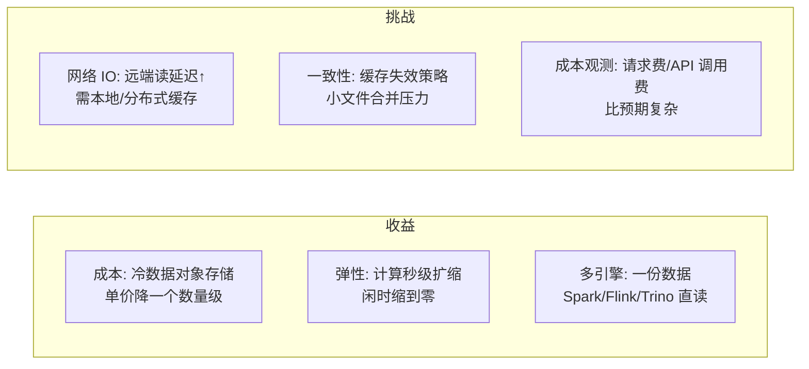

| 维度 | 收益 | 应对的挑战 |
|------|------|-----------|
| 性能 | — | Alluxio/JindoFS 缓存命中后接近本地读；热分区常驻缓存 |
| 一致性 | 快照隔离（Iceberg）保证读一致 | 元数据 QPS 高时 Catalog 成为瓶颈 |
| 成本 | 存储单价降 5~10 倍 | S3 GET/LIST 请求费、egress 要单独监控 |
| 运维 | 免去 NameNode 扩容焦虑 | K8s + 表格式 + Catalog 新技能栈 |

结论：**读写比越高、热点越集中的负载，存算分离收益越大**；纯随机点查密集型（KV 在线服务）仍适合本地盘。

## 元数据中心统一（Hive Metastore → Unity Catalog / DataHub）

```text
三代元数据架构：
第一代：Hive Metastore（HMS）
  只有表结构/分区/位置；问题：无血缘、无权限、无语义、单实例

第二代：Catalog 即服务（Glue / Unity Catalog / Polaris/Nessie）
  HMS 兼容之上加：统一鉴权（列/行级）、跨引擎血缘、
  多格式托管（Iceberg/Delta/Hudi）、REST 标准接口

第三代：开放元数据平台（DataHub/OpenMetadata）
  技术+业务+操作元数据统一；血缘图搜索；
  与上游 Catalog 通过 Push/Pull 同步而非替代
```

| 能力 | HMS | Glue/Unity Catalog | DataHub |
|------|-----|--------------------|---------|
| 引擎接入 | Thrift 私有 | REST（Iceberg 标准） | API 采集旁挂 |
| 权限 | 无（依赖 Ranger） | 内建列/行级 | 不做运行时鉴权 |
| 血缘 | 无 | 引擎级自动 | 覆盖 BI/ETL 全链路 |
| 定位 | 运行时必需 | 运行时控制面 | 治理与发现平面 |

落地路径：保留 HMS 作兼容层 → 引擎逐步切 REST Catalog → DataHub 同步做治理视图 → 血缘反哺影响分析。

## 批流一体演进路径（Lambda → Kappa → Fluss / Paimon）

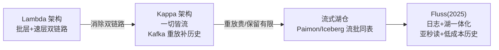

| 方案 | 补历史方式 | 存储 | 口径一致性 | 局限 |
|------|-----------|------|-----------|------|
| Lambda | 批层全量重算 | 双份 | 差（两套代码） | 维护成本最高 |
| Kappa | Kafka 日志重放 | 单份日志 | 好 | 重放窗口受保留期限制 |
| Paimon 流式湖仓 | 湖表直接批读 | 单份湖表 | 好（同引擎） | 亚秒读取弱于日志 |
| Fluss | 日志+列存混合视图 | 单份双视图 | 好（同主键模型） | 较新，生态成熟中 |

选型建议：秒级以内且回溯少 → Kappa；需天级以上回溯与多引擎分析 → Paimon/Iceberg 流式湖仓；追求极致新鲜度 + 低成本历史关注 Fluss 类方案。

## 技术债识别与偿还策略

| 债务类型 | 典型表现 | 识别信号 | 偿还手段 |
|----------|---------|---------|---------|
| 架构债 | Lambda 双链路、直连业务库抽数 | 两套口径对不上 | 迁 CDC + 统一 ODS |
| 数据债 | 无 Owner 僵尸表、无口径黑盒报表 | 90 天零访问、字段无注释 | 下线评审 + 血缘补全 |
| 平台债 | 手工跑批、脚本散落 crontab | 故障靠「谁写的谁知道」 | 迁调度平台 DAG 化 |
| 版本债 | 组件滞后无法升级 | 安全 CVE 无法修复 | 分批灰度升级计划 |
| 质量债 | 上游随意改 schema 打爆下游 | 下游任务连环失败 | Schema 契约 + 变更通知 |

```text
偿还节奏（20% 法则）：
  每迭代固定预留 ~20% 工时偿债，
  优先偿还「正在造成新故障」的债（利息最高的先还）

量化利息：
  债务利息 = 月均故障时长 × 时延成本 + 重复人工工时 × 人力成本
  利息 > 偿还成本时立项重构，否则容忍并记录
```

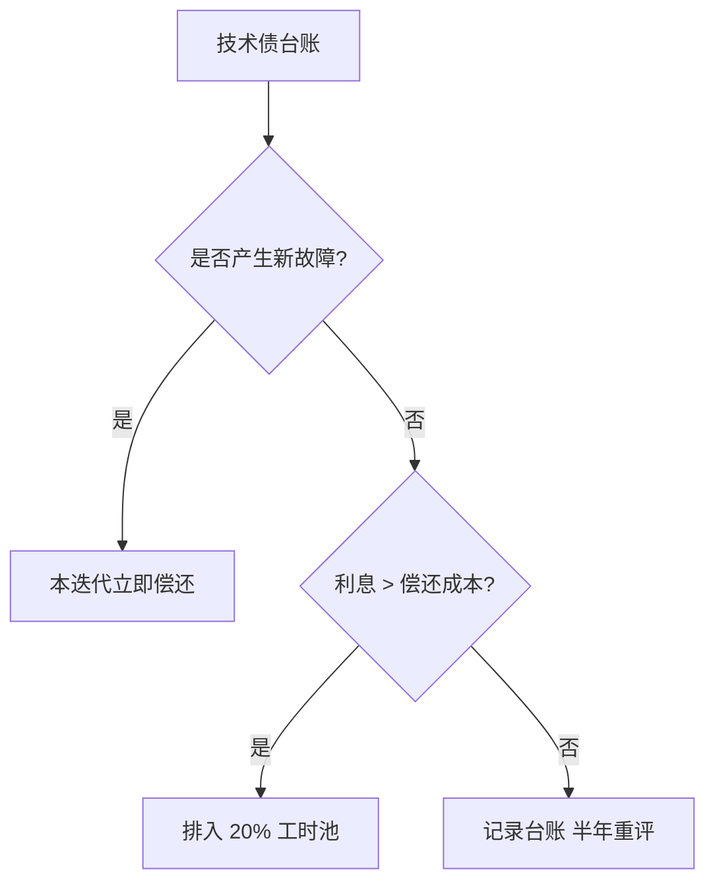

## 架构迁移实施 Checklist（Hadoop → 云原生）

- [ ] 盘点存量作业：按「引擎 × 数据量 × SLA」四象限分级，低价值作业直接下线。
- [ ] 元数据先行：HMS → 新 Catalog 双写期，表位置逐批切对象存储。
- [ ] 历史数据冷热分层：90 天内热分区保留原格式，冷数据转 Parquet+ZSTD 归档。
- [ ] 双跑验证：新旧链路并行 1~2 个调度周期，聚合值 diff < 0.1% 才切流。
- [ ] 成本基线：迁移前先建账单归因（标签/科目），否则无法证明收益。
- [ ] 技能储备：K8s + Iceberg + Catalog 各培养至少 2 名内部专家。
- [ ] 回滚预案：每个批次保留回切开关，旧集群只读保留至稳定后一个季度。

| 迁移阶段 | 目标 | 退出条件 |
|----------|------|---------|
| POC | 选定表格式与 Catalog 组合 | 一条完整业务链路跑通双跑 |
| 试点 | 10~20% 非核心作业迁云 | 故障率不高于旧平台 |
| 主力 | 核心数仓分批迁移 | 全部 SLA 达标 + 账单可归因 |
| 收尾 | 旧集群缩容下线 | 只读保留期满 |

```text
迁移期常见翻车点：
① 冷数据转 Parquet 后列名大小写/时区行为差异 → 下游 SQL 隐性出错
② 对象存储 LIST 慢导致动态分区插入变慢 → 改用 Iceberg 写路径
③ Catalog 切换瞬间双引擎元数据漂移 → 锁定切换窗口
④ Spot 实例抢占率高导致批任务重试风暴 → 关键链路用按需实例
⑤ 迁移期新旧两套监控告警并存 → 统一指标口径避免漏告
⑥ 团队并行维护双平台超 6 个月 → 设硬性下线日期倒逼收敛
```

---

## Hadoop 1.x → 2.x → 3.x 架构演进动因

| 版本 | 核心变化 | 动因 |
|------|---------|------|
| 1.x | MapReduce + HDFS + 单 NameNode | 初始架构，存算耦合 |
| 2.x | YARN 资源调度 + HA NameNode + Federation | 多引擎共存（Spark/Flink） |
| 3.x | 纠删码（EC）+ 多 NameNode + S3 兼容 | 存储成本 + 云原生适配 |

```
演进动因分析：
  1.x→2.x：
    MR 唯一引擎 → YARN 调度多引擎（Spark/Tez/Flink）
    单 NameNode 单点 → HA NameNode + Federation
    存储成本高 → 保留 3 副本 + 无 EC

  2.x→3.x：
    3 副本存储浪费 → 纠删码（1.5x 冗余 vs 3x）
    自建集群 → S3/OSS 兼容（存算分离）
    硬件成本高 → 更高效的存储格式
```

## YARN 资源调度 vs K8s 资源调度核心差异

| 维度 | YARN | Kubernetes |
|------|------|-----------|
| 资源模型 | Container（CPU+内存） | Pod（CPU+内存+GPU+自定义） |
| 调度器 | Capacity/Fair Scheduler | kube-scheduler |
| 弹性 | 弱（队列静态分配） | 强（HPA/KEDA 自动扩缩） |
| 多租户 | 队列隔离 | Namespace + ResourceQuota |
| 生态 | Hadoop 生态（MR/Spark/Flink） | 通用（容器化应用） |
| 存算分离 | 弱（HDFS 耦合） | 强（对象存储+弹性计算） |

```
选型决策：
  纯 Hadoop 生态 → YARN
  云原生/多引擎 → K8s
  混合场景 → YARN + K8s 共存（存量走 YARN，新作业走 K8s）
```

## 批流融合技术路线（Flink Unbounded Table）

```
批流融合 = 同一套引擎/逻辑处理有界（批）与无界（流）数据

Flink 实现方式：
  有界流 = 批（同一 API/SQL）
  无界流 = 流（同一 API/SQL）

Unbounded Table 概念：
  一张表 = 有界部分（历史快照）+ 无界部分（实时增量）
  Flink SQL 查询自动判断：有界 → 批模式；无界 → 流模式

存储层融合：
  Paimon/Iceberg 同一张表承流承批
  Flink 流写 + Spark 批读
  口径天然一致（同一数据源）
```

## 数据平台技术选型评分卡模板

| 评估项 | 权重 | 候选A | 候选B | 候选C |
|--------|:---:|:---:|:---:|:---:|
| 业务需求匹配度 | 30% | 9 | 8 | 7 |
| 性能（吞吐/延迟） | 25% | 8 | 9 | 7 |
| 成本（TCO） | 20% | 7 | 6 | 9 |
| 社区生态 | 15% | 8 | 9 | 6 |
| 运维复杂度 | 10% | 6 | 7 | 8 |
| **加权总分** | 100% | **7.9** | **8.1** | **7.3** |

```
使用方法：
  ① 各维度 1-10 分打分
  ② 按权重计算加权总分
  ③ 总分差距 < 0.5 分时看团队匹配度
  ④ 评分卡 + POC 验证 + 专家评审 = 选型决策
```

## 数据平台架构演进路线图（OLTP→OLAP→实时分析→AI 平台）

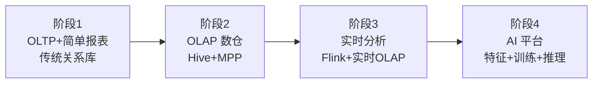

```
演进路径：
  阶段1（OLTP+报表）：
    MySQL/PostgreSQL + BI 工具
    痛点：数据量增长后性能下降

  阶段2（OLAP 数仓）：
    Hive/Spark 数仓 + Doris/StarRocks OLAP
    价值：T+1 分析、BI 报表

  阶段3（实时分析）：
    Kafka+Flink 实时链路 + 实时 OLAP
    价值：秒级指标、实时大屏

  阶段4（AI 平台）：
    特征平台 + 模型训练 + 推理服务
    价值：数据驱动智能决策

每阶段退出条件：
  基础设施稳定 + 核心场景覆盖 + 团队能力匹配
  → 才进入下一阶段
```

## 技术选型标准

### 选型维度

| 维度 | 权重 | 评估方法 |
|------|------|----------|
| 业务匹配度 | 30% | 需求覆盖率 |
| 性能 | 25% | 压测基准 |
| 成本 | 20% | TCO计算 |
| 社区生态 | 15% | 活跃度、文档 |
| 运维复杂度 | 10% | 团队能力匹配 |

### 选型流程

```
选型流程：
  1. 需求分析：明确业务需求
  2. 方案调研：收集候选方案
  3. 技术评估：POC验证
  4. 成本评估：TCO计算
  5. 风险评估：锁定风险、迁移成本
  6. 决策：综合评分
  7. 试点：小范围验证
  8. 推广：全量部署

决策矩阵：
  方案A：需求90分，性能85分，成本70分 → 综合82
  方案B：需求80分，性能90分，成本85分 → 综合84
  方案C：需求85分，性能80分，成本90分 → 综合85
  选择：方案C
```

> 一句话：**大数据体系 = 采集→存储→计算→治理→服务流水线；演进主线是「批流双链路（Lambda）→ 流为中心（Kappa）→ 流批一体 → 湖仓一体」——选型先看「批 vs 流、湖 vs 仓」两条主线，再按负载选组件；新项目默认湖仓一体 + 流批一体 + 存算分离**。

---

## 二十一、Hadoop 1.x → 2.x → 3.x 架构演进动因分析

### 21.1 演进动因

| 版本 | 核心架构 | 演进动因 |
|------|---------|---------|
| Hadoop 1.x | MR + NameNode + DataNode | 单点瓶颈：NN 单点、MR 耦合 |
| Hadoop 2.x | YARN + HDFS Federation + MRv2 | 资源调度解耦：MR 不再独占集群 |
| Hadoop 3.x | Erasure Coding + 多 NN + YARN Timeline v2 | 存储效率 + 运维增强 |

### 21.2 关键变化

```text
Hadoop 1.x → 2.x 变化：
  1. NameNode HA：Active/Standby 双节点 + QJM 共享日志
  2. HDFS Federation：多 NN 管理不同命名空间
  3. YARN：资源调度与计算框架解耦
     - 支持 MR、Spark、Flink、Storm 等多框架
     - 支持长服务（Docker/容器）

Hadoop 2.x → 3.x 变化：
  1. Erasure Coding：纠删码替代 3 副本（存储节省 50%+）
  2. 多 NN 支持：多 Active NameNode
  3. YARN Timeline Service v2：增强历史服务
  4. Intra-NN 并行加载：NN 启动加速
```

## 二十二、YARN 资源调度 vs K8s 资源调度核心差异

### 22.1 核心差异对比

| 维度 | YARN | K8s |
|------|------|-----|
| 调度模型 | 集中式 RM | 分布式 Scheduler |
| 资源模型 | vCore + Memory | CPU/Memory/GPU/Pod |
| 调度策略 | 容量/公平调度 | 亲和性/反亲和性/污点 |
| 弹性扩缩 | 基于应用 | 基于 Pod/Deployment |
| 容器运行时 | Docker/Container | Docker/containerd/CRI-O |
| 状态管理 | ApplicationMaster | Pod/Deployment 状态 |
| 服务发现 | 无原生 | Service/DNS |

### 22.2 选型建议

| 场景 | 推荐 | 理由 |
|------|------|------|
| 纯大数据计算 | YARN | 成熟稳定 |
| 混合负载 | K8s | 统一调度 |
| 云原生迁移 | K8s + YARN 共存 | 渐进式迁移 |
| 新平台建设 | K8s | 未来趋势 |

## 二十三、批流融合技术路线（Flink Unbounded Table / Batch Table 统一）

### 23.1 批流融合架构

```text
Flink 批流融合：
  Unbounded Table（无界表）：流处理
    - 持续接收新数据
    - 事件时间处理
    - 窗口/状态/Checkpoint
  
  Batch Table（有界表）：批处理
    - 有限数据集
    - 全量计算
    - 无状态/无 Checkpoint

统一方式：
  Flink SQL 统一语法
  StreamExecutionEnvironment → executeBatch() 切换模式
  Table API 同一接口
```

### 23.2 融合路线

| 路线 | 工具 | 说明 |
|------|------|------|
| 流优先 | Flink + Kafka | 以流为基础，批是流的特例 |
| 批优先 | Spark + Kafka | 以批为基础，微批模拟流 |
| 原生融合 | Flink + Paimon | 流批一体表格式 |
| 湖仓融合 | Iceberg + Flink | 统一存储+计算 |

## 二十四、数据平台技术选型评分卡模板

### 24.1 评分维度

| 维度 | 权重 | 评估指标 | 评分标准 |
|------|------|---------|---------|
| 功能 | 30% | 特性完整性、易用性 | 1-5 分 |
| 性能 | 25% | 吞吐、延迟、扩展性 | 1-5 分 |
| 生态 | 20% | 社区活跃度、集成能力 | 1-5 分 |
| 运维 | 15% | 监控、告警、升级难度 | 1-5 分 |
| 成本 | 10% | License、硬件、人力成本 | 1-5 分 |

### 24.2 评分卡模板

```text
数据平台技术选型评分卡

项目：_______________  评估日期：_______________

| 维度 | 权重 | 方案A | 方案B | 方案C |
|------|------|-------|-------|-------|
| 功能 | 30% | /5 | /5 | /5 |
| 性能 | 25% | /5 | /5 | /5 |
| 生态 | 20% | /5 | /5 | /5 |
| 运维 | 15% | /5 | /5 | /5 |
| 成本 | 10% | /5 | /5 | /5 |
| 综合 | 100% | /5 | /5 | /5 |

评估结论：_______________
决策依据：_______________
```

## Hadoop 3.x 新特性与升级指南

### Hadoop 3.x 关键改进

| 特性 | Hadoop 2.x | Hadoop 3.x | 收益 |
|------|-----------|-----------|------|
| 纠删码 | 3 副本（200% 冗余） | 纠删码（50% 冗余） | 存储节省 50% |
| YARN Timeline Service v2 | 旧版 ATS | 基于 HBase 的新版 | 可扩展性提升 |
| 多 NameNode | 最多 2 个 NN | 最多 5 个 NN | HA 更强 |
| GPU/FPGA 调度 | 不支持 | YARN 原生支持 | AI 训练友好 |
| Intra-Node 并行 | 不支持 | 支持 | 性能提升 |
| 份文件（S3A） | 无 | S3 原生支持 | 云存储优化 |

### 纠删码配置示例

```xml
<!-- hdfs-site.xml：启用纠删码策略 -->
<property>
  <name>dfs.namenode.ec.system.default.policy</name>
  <value>RS-6-3-1024k</value>
</property>
<property>
  <name>dfs.datanode.erasurecode.buffer.size</name>
  <value>1048576</value>
</property>
```

```bash
# 创建纠删码策略
hdfs ec -setPolicy -policy RS-6-3-1024k -path /data/cold

# 查看策略
hdfs ec -getPolicy -path /data/cold

# 查看所有策略
hdfs ec -listPolicies
```

```text
纠删码策略选型：
┌──────────────┬───────────┬───────────┬──────────────┐
│ 策略          │ 数据块     │ 校验块     │ 冗余率        │
├──────────────┼───────────┼───────────┼──────────────┤
│ RS-6-3-1024k │ 6         │ 3         │ 50%          │
│ RS-3-2-1024k │ 3         │ 2         │ 67%          │
│ RS-10-4-1024k│ 10        │ 4         │ 40%          │
│ XOR-2-1-1024k│ 2         │ 1         │ 50%          │
└──────────────┴───────────┴───────────┴──────────────┘
  推荐：冷数据用 RS-6-3（均衡），极冷数据用 RS-10-4（省存储）
```

## Lakehouse 技术栈全景

### Lakehouse 核心组件

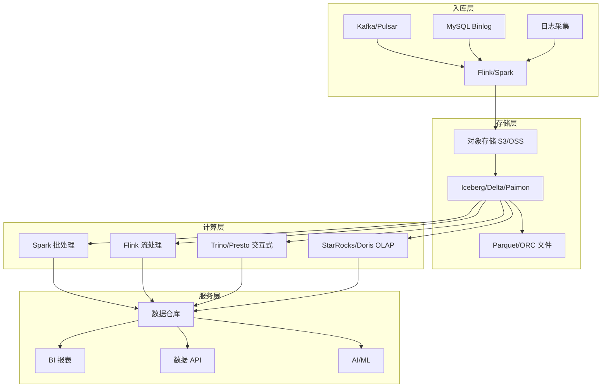

### 典型 Lakehouse 技术栈选型

| 场景 | 存储格式 | 计算引擎 | 查询引擎 | 调度 |
|------|---------|---------|---------|------|
| 离线数仓 | Iceberg | Spark | Trino | Airflow |
| 实时数仓 | Paimon | Flink | StarRocks | Flink SQL |
| 湖仓一体 | Iceberg | Spark + Flink | Trino + Doris | Airflow |
| 数据湖分析 | Delta Lake | Spark | Databricks SQL | Databricks |
| 成本敏感 | Iceberg | EMR Spark | Athena | Step Functions |

```python
# PySpark：Lakehouse 入门示例
from pyspark.sql import SparkSession

spark = SparkSession.builder \
    .appName("Lakehouse Demo") \
    .config("spark.sql.catalogatalog", "org.apache.iceberg.spark.SparkCatalog") \
    .config("spark.sql.catalogatalog.type", "hadoop") \
    .config("spark.sql.catalogatalog.warehouse", "s3://my-lake/warehouse") \
    .getOrCreate()

# 创建 Iceberg 表
spark.sql("""
    CREATE TABLE catalog.db.events (
        event_id STRING,
        user_id STRING,
        event_type STRING,
        payload STRING,
        event_time TIMESTAMP
    ) USING iceberg
    PARTITIONED BY (days(event_time))
    TBLPROPERTIES ('format-version' = '2')
""")

# 增量写入
events_df.writeTo("catalog.db.events").append()

# 时间旅行查询
spark.sql("SELECT * FROM catalog.db.events VERSION AS OF 5")
```

## 数据平台 SLA 保障体系

### SLA 分级标准

| SLA 等级 | 可用性 | RTO | RPO | 适用场景 |
|---------|-------|-----|-----|---------|
| P0-核心 | 99.99% | < 5min | 0 | 交易、支付 |
| P1-重要 | 99.9% | < 30min | < 5min | 实时报表 |
| P2-一般 | 99.5% | < 4h | < 1h | 离线分析 |
| P3-低优 | 99% | < 24h | < 24h | 历史归档 |

### SLA 保障措施

```text
数据平台 SLA 保障四层体系：
  第一层：架构冗余
    - 存储：3 副本 / 纠删码 + 跨 AZ 部署
    - 计算：多节点故障域隔离
    - 网络：多链路冗余
  第二层：监控告警
    - 数据延迟：Flink Checkpoint 延迟告警
    - 数据质量：空值率、重复率、Schema 变更检测
    - 资源利用率：CPU/内存/磁盘阈值告警
  第三层：自动恢复
    - 任务失败自动重试（指数退避）
    - 节点故障自动迁移
    - 数据回滚到上一个正确版本
  第四层：人工干预
    - 值班制度 + On-Call 轮转
    - 故障演练（Chaos Engineering）
    - 事后复盘（Postmortem）
```

```sql
-- Flink SQL：数据延迟监控告警
CREATE TABLE data_delay_alert (
    alert_id STRING,
    source_table STRING,
    delay_seconds BIGINT,
    alert_time TIMESTAMP(3),
    PRIMARY KEY (alert_id) NOT ENFORCED
) WITH (
    'connector' = 'kafka',
    'topic' = 'data-delay-alerts',
    'properties.bootstrap.servers' = 'kafka:9092',
    'format' = 'json'
);

-- 监控数据延迟超过 5 分钟
INSERT INTO data_delay_alert
SELECT
    CONCAT(source_table, '-', DATE_FORMAT(NOW(), 'yyyyMMddHHmm')) AS alert_id,
    source_table,
    UNIX_TIMESTAMP() - UNIX_TIMESTAMP(MAX(event_time)) AS delay_seconds,
    NOW() AS alert_time
FROM source_events
WHERE event_time < TIMESTAMPADD(MINUTE, -5, NOW())
GROUP BY source_table
HAVING UNIX_TIMESTAMP() - UNIX_TIMESTAMP(MAX(event_time)) > 300;
```

## 二十五、数据平台架构演进路线图（OLTP → OLAP → 实时分析 → AI 平台）

### 25.1 演进阶段

```text
数据平台架构演进：
  阶段 0：OLTP
    - 关系型数据库（MySQL/PG）
    - 业务数据存储
  
  阶段 1：OLAP
    - 数据仓库（Hive/Redshift）
    - 离线报表分析
  
  阶段 2：实时分析
    - 流处理（Flink/Kafka）
    - 实时数仓
  
  阶段 3：AI 平台
    - 特征工程
    - 模型训练/推理
    - MLOps

演进驱动因素：
  业务需求：从"看报表"到"实时决策"
  技术成熟：从批处理到流处理
  成本压力：从单体到存算分离
```

### 25.2 各阶段技术栈

| 阶段 | 存储 | 计算 | 调度 | 服务 |
|------|------|------|------|------|
| OLTP | MySQL/PG | 无 | 无 | 业务 API |
| OLAP | Hive/Redshift | Spark | Airflow | BI 工具 |
| 实时 | Kafka/OLAP | Flink | Flink/K8s | 实时 API |
| AI | 数据湖 | Spark/PyTorch | Kubeflow | ML API |

## 二十六、Hadoop 1.x→2.x→3.x 架构演进动因分析

### 架构演进

| 版本 | 架构 | 核心组件 | 动因 |
|------|------|----------|------|
| 1.x | JobTracker/TaskTracker | HDFS + MapReduce | 单点瓶颈 |
| 2.x | YARN | HDFS + YARN + MapReduce | 资源调度分离 |
| 3.x | 联邦 HDFS + YARN | HDFS Federation + YARN | 横向扩展 |

### 演进原因

```
1.x → 2.x：
  JobTracker 单点故障 → YARN 资源调度分离
  MapReduce 限制 → YARN 支持多种计算框架

2.x → 3.x：
  HDFS NameNode 单点 → HDFS Federation
  YARN 单点 → YARN HA
  存储效率 → 纠删码（Erasure Coding）
```

## 二十七、YARN 资源调度 vs K8s 核心差异表

| 维度 | YARN | Kubernetes |
|------|------|------------|
| 调度对象 | 应用 | Pod |
| 资源模型 | 内存+CPU | 内存+CPU+GPU |
| 调度算法 | FIFO/Capacity/Fair | 优先级+配额 |
| 弹性伸缩 | 手动 | 自动（HPA/VPA） |
| 容器支持 | 原生 | 原生 |
| 生态 | 大数据 | 通用 |

## 二十八、批流融合技术路线（Flink Unbounded/Batch Table 统一）

### 批流融合

```sql
-- Flink 统一 SQL
-- 无界流（实时）
SELECT 
    TUMBLE_START(event_time, INTERVAL '1' HOUR) AS window_start,
    COUNT(*) AS cnt
FROM user_events
GROUP BY TUMBLE(event_time, INTERVAL '1' HOUR);

-- 有界批（离线）
SELECT 
    TUMBLE_START(event_time, INTERVAL '1' DAY) AS day,
    COUNT(*) AS cnt
FROM user_events
WHERE event_time BETWEEN '2026-01-01' AND '2026-01-31'
GROUP BY TUMBLE(event_time, INTERVAL '1' DAY);
```

### 技术路线

| 技术 | 批处理 | 流处理 | 统一 |
|------|--------|--------|------|
| Flink | Batch Table | Unbounded Stream | ✅ |
| Spark | Batch | Structured Streaming | ✅ |
| Kafka Streams | 无 | Stream | ❌ |
| Beam | Batch | Stream | ✅ |

## 二十九、数据平台技术选型评分卡模板

### 评分卡模板

| 维度 | 权重 | Hive | Spark | Flink | ClickHouse |
|------|------|------|-------|-------|------------|
| 吞吐量 | 25% | 7 | 9 | 8 | 8 |
| 延迟 | 25% | 3 | 6 | 9 | 8 |
| 易用性 | 20% | 8 | 7 | 6 | 7 |
| 生态 | 15% | 9 | 9 | 8 | 7 |
| 成本 | 15% | 8 | 7 | 7 | 8 |
| **加权总分** | 100% | **6.4** | **7.7** | **7.7** | **7.6** |

### 选型建议

```
批处理为主：Spark
流处理为主：Flink
实时查询：ClickHouse
离线分析：Hive
批流融合：Flink
```

## 三十、数据平台架构演进路线图（OLTP→OLAP→实时分析→AI 平台）

### 演进路线图

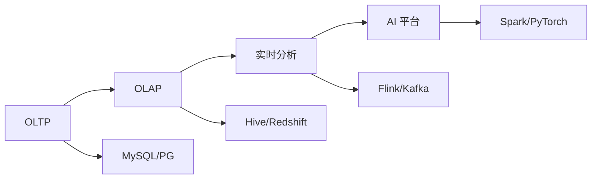

### 各阶段关键能力

| 阶段 | 关键能力 | 技术栈 |
|------|----------|--------|
| OLTP | 事务处理 | MySQL/PG |
| OLAP | 离线分析 | Hive/Redshift |
| 实时分析 | 流处理+实时查询 | Flink+ClickHouse |
| AI 平台 | 特征工程+模型训练 | Spark+PyTorch |

## 三十一、数据湖 vs 数据仓库 vs 数据中台辨析

### 概念辨析

| 概念 | 存储格式 | 数据模型 | 适用场景 |
|------|----------|----------|----------|
| 数据仓库 | 结构化 | Schema-on-Write | BI 分析 |
| 数据湖 | 任意格式 | Schema-on-Read | 数据科学 |
| 数据中台 | 混合 | 统一服务 | 企业级数据服务 |

### 架构对比

```
数据仓库：
  存储：Parquet/ORC
  计算：Spark/Hive
  特点：预定义 Schema，ACID 事务

数据湖：
  存储：原始格式（JSON/CSV/Parquet）
  计算：Spark/Presto/Trino
  特点：灵活 Schema，成本低

数据中台：
  存储：混合
  计算：混合
  特点：统一数据服务，数据资产化
```

## 三十二、Hadoop 生态演进与 YARN vs K8s 调度

### Hadoop 生态演进

| 版本 | 关键特性 | 适用场景 | 状态 |
|------|---------|---------|------|
| Hadoop 1.x | MR+HDFS+YARN | 基础批处理 | 已淘汰 |
| Hadoop 2.x | YARN+HA+联邦 | 生产主力 | 维护中 |
| Hadoop 3.x |纠删码+ER+GPU | 云原生兼容 | 推荐 |

### YARN vs Kubernetes 调度对比

| 维度 | YARN | Kubernetes |
|------|------|-----------|
| 资源模型 | slot(MR) + container | Pod(request/limit) |
| 调度策略 | FIFO/Capacity/Fair | Priority/Preemption |
| 弹性能力 | 静态分配 | 动态伸缩(HPA/VPA) |
| 作业类型 | MR/Spark/Flink | 任意容器化作业 |
| 运维复杂度 | 中 | 高 |
| 适用规模 | 10000+节点 | 5000+节点 |

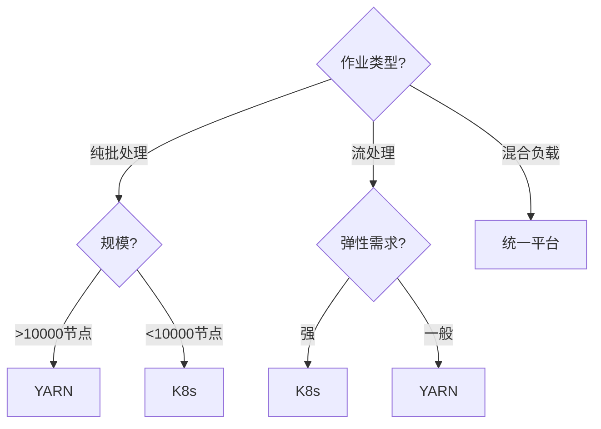

### 批流融合架构

```
批流融合技术栈：
  统一计算引擎：Apache Beam / Flink
  统一存储：数据湖(Iceberg/Hudi/Delta Lake)
  统一调度：K8s + Volcano/Spark Operator
  统一监控：Prometheus + Grafana

  批处理：Spark on K8s / Flink Batch
  流处理：Flink Streaming / Kafka Streams
  交互查询：Trino/StarRocks
```

## 三十三、数据平台选型评分卡进阶

### 多维度评分

| 维度 | 权重 | Hive | Spark | Flink | ClickHouse | StarRocks |
|------|------|------|-------|-------|------------|-----------|
| 吞吐量 | 20% | 7 | 9 | 8 | 8 | 8 |
| 延迟 | 20% | 3 | 6 | 9 | 8 | 9 |
| 易用性 | 15% | 8 | 7 | 6 | 7 | 7 |
| 生态 | 15% | 9 | 9 | 8 | 7 | 7 |
| 成本 | 15% | 8 | 7 | 7 | 8 | 7 |
| 可维护 | 15% | 8 | 7 | 7 | 6 | 7 |
| **加权总分** | 100% | **6.8** | **7.5** | **7.5** | **7.4** | **7.6** |

### 架构演进路线图

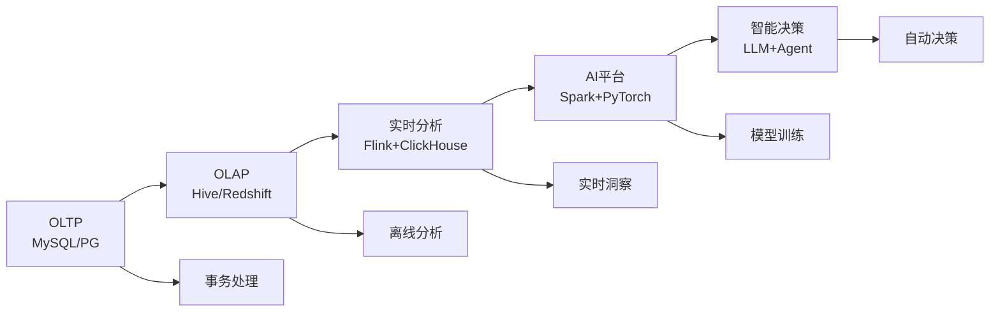

## 三十四、数据湖 vs 数据仓库 vs 数据中台辨析