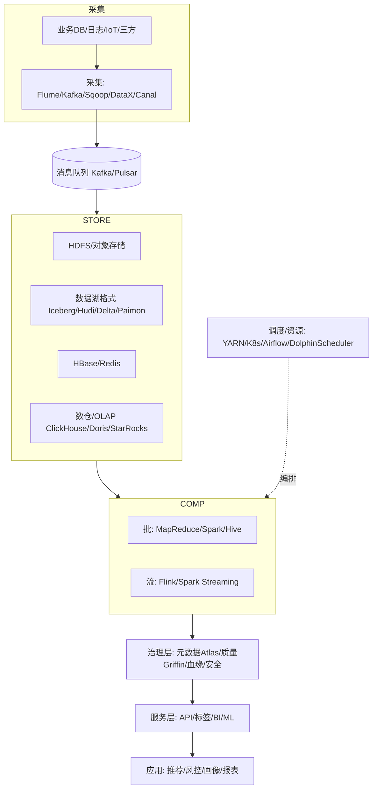
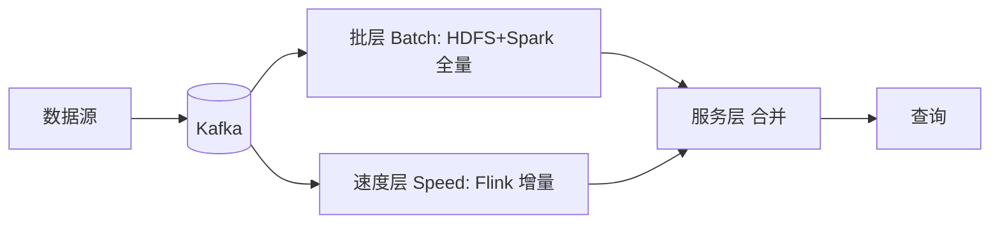
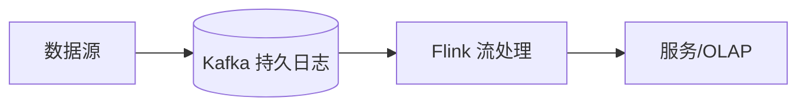
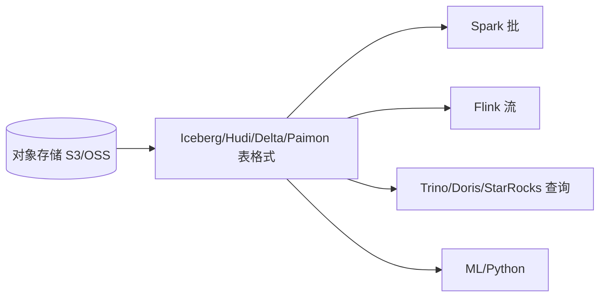

# 大数据 · 02 技术体系与架构演进

> 大数据技术体系是一张"采集→存储→计算→治理→服务"的流水线。理解它，关键是抓住两条主线：**批 vs 流**（怎么算）、**湖 vs 仓**（怎么存）。

本篇给出整体技术栈地图、架构演进（Lambda→Kappa→流批一体→湖仓一体），并定位各组件角色。组件细节见后续分篇。

## 一、整体技术栈地图

## 二、批处理 vs 流处理

| 维度 | 批处理（Batch） | 流处理（Streaming） |
|------|----------------|---------------------|
| 数据边界 | 有界（固定数据集） | 无界（持续到达） |
| 时延 | 分钟~小时（T+1） | 秒~毫秒 |
| 典型引擎 | MapReduce、Spark、Hive | Flink、Kafka Streams、Storm |
| 场景 | 离线报表、建模 | 实时监控、风控、实时大屏 |
| 代表架构 | 离线数仓 | 实时数仓 |

> 现实是"批流并存"：同一份数据，离线条做宽表建模，实时条做秒级指标。

## 三、架构演进四阶段

### 3.1 Lambda 架构（批流双链路）

- **思想**：批层算准确全量结果，速度层补实时增量，服务层合并。
- **优点**：容错好、结果准。
- **缺点**：**维护两套代码/两套存储**，成本高、一致性难保证。
- **现状**：经典但渐被替代，适合对历史准确性要求高的场景。

### 3.2 Kappa 架构（流为中心）

- **思想**：一切皆流，用**不可变日志（Kafka）**重放代替批层，只用一套流引擎。
- **优点**：架构简单、一套代码。
- **缺点**：历史重算依赖重放长日志，批类复杂 ETL 在流上实现困难。
- **适用**：以实时为主的业务。

### 3.3 流批一体（Unified Batch+Stream）
- **核心**：用**同一套 API/引擎**处理有界与无界数据。Flink "有界流=批"模型、Spark micro-batch 都朝此演进。
- 开发者写一份逻辑，引擎自动适配批/流，消除 Lambda 双链路。

### 3.4 湖仓一体（Lakehouse）—— 当前主流终点
- **核心**：在**廉价对象存储（数据湖）**之上一层开放表格式（Iceberg/Hudi/Delta/Paimon），获得数据仓库的 ACID、 schema 演进、时间旅行、高性能查询。
- **价值**：一份存储同时服务 BI（数仓式）与 ML/科学计算（湖式），消除"湖仓两套拷贝"。
- 详见 [11-实时数仓与湖仓一体](11-实时数仓与湖仓一体.md)、[05-列式存储与数据湖格式](05-列式存储与数据湖格式.md)。

## 四、存算分离：成本与弹性的关键

| 模式 | 说明 | 优劣 |
|------|------|------|
| 存算耦合（传统 Hadoop） | 计算与存储在同节点 | 本地读快，但扩容不灵活、资源浪费 |
| 存算分离（云原生） | 存储用对象存储，计算弹性扩缩 | 弹性好、成本低；网络 IO 成瓶颈，需缓存 |

> 趋势：Iceberg + S3 + 弹性计算（Spark/Flink on K8s）+ 本地缓存，是 2025 主流形态。

## 五、组件角色速查（按层）

| 层 | 主流组件 |
|----|---------|
| 采集/同步 | Flume、Sqoop、DataX、Canal、Debezium、Logstash、Kafka Connect |
| 消息队列 | Kafka、Pulsar、RocketMQ（见 [MQ](../MQ.md)） |
| 分布式存储 | HDFS、S3/OSS 对象存储、Kudu |
| 表格式 | Iceberg、Hudi、Delta Lake、Paimon、DuckLake |
| NoSQL | HBase、Redis（见 [redis知识](../redis知识.md)）、Cassandra |
| 批计算 | MapReduce、Spark、Hive |
| 流计算 | Flink、Spark Streaming、Kafka Streams、Storm |
| OLAP/数仓 | ClickHouse、Doris、StarRocks、Kylin、Druid、Greenplum、Hive |
| 调度/资源 | YARN、Kubernetes、Airflow、DolphinScheduler |
| 治理 | Atlas（元数据/血缘）、Griffin（质量）、Ranger（权限）、Nessie/Polaris（湖仓 catalog） |

## 六、选型与演进 Checklist

- [ ] 新项目优先"湖仓一体 + 流批一体"，避免 Lambda 双链路负债。
- [ ] 实时优先选 Kappa/流批一体；需历史重算与高准确选 Lambda 改造。
- [ ] 存储选对象存储 + 开放表格式（Iceberg 通用性最强）。
- [ ] 计算按负载选：批 Spark、流 Flink、交互查询 Trino/Doris/StarRocks。
- [ ] 资源调度云原生化（K8s），保留 YARN 兼容旧作业。
- [ ] 治理与权限从第一天内建，而非事后补课。

> 参考：Lambda/Kappa（Nathan Marz / Jay Kreps 原文）、Databricks Lakehouse 论文、Iceberg/Paimon 官方文档、多家大厂架构复盘。
