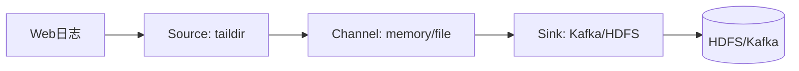
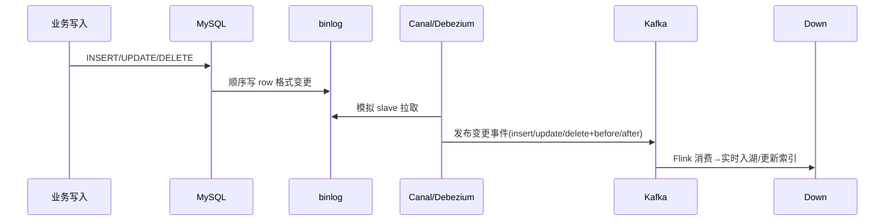
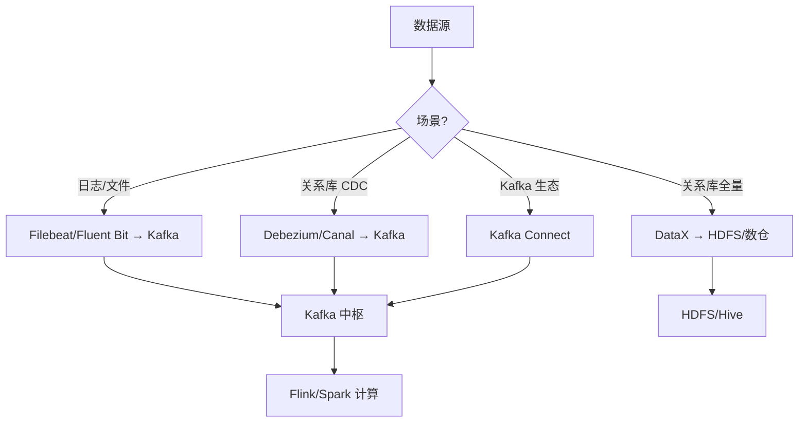
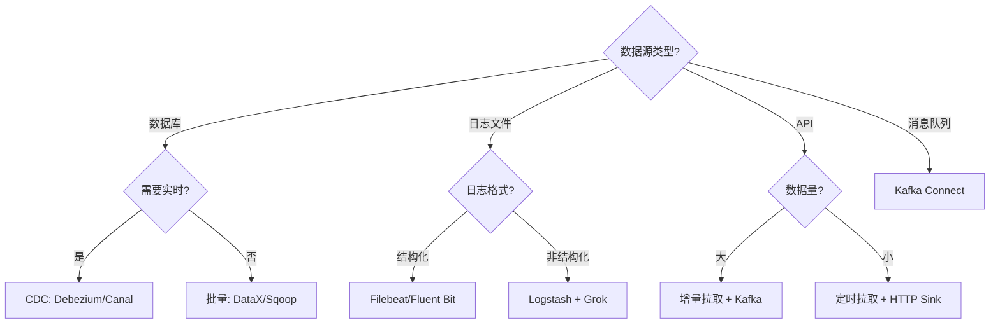
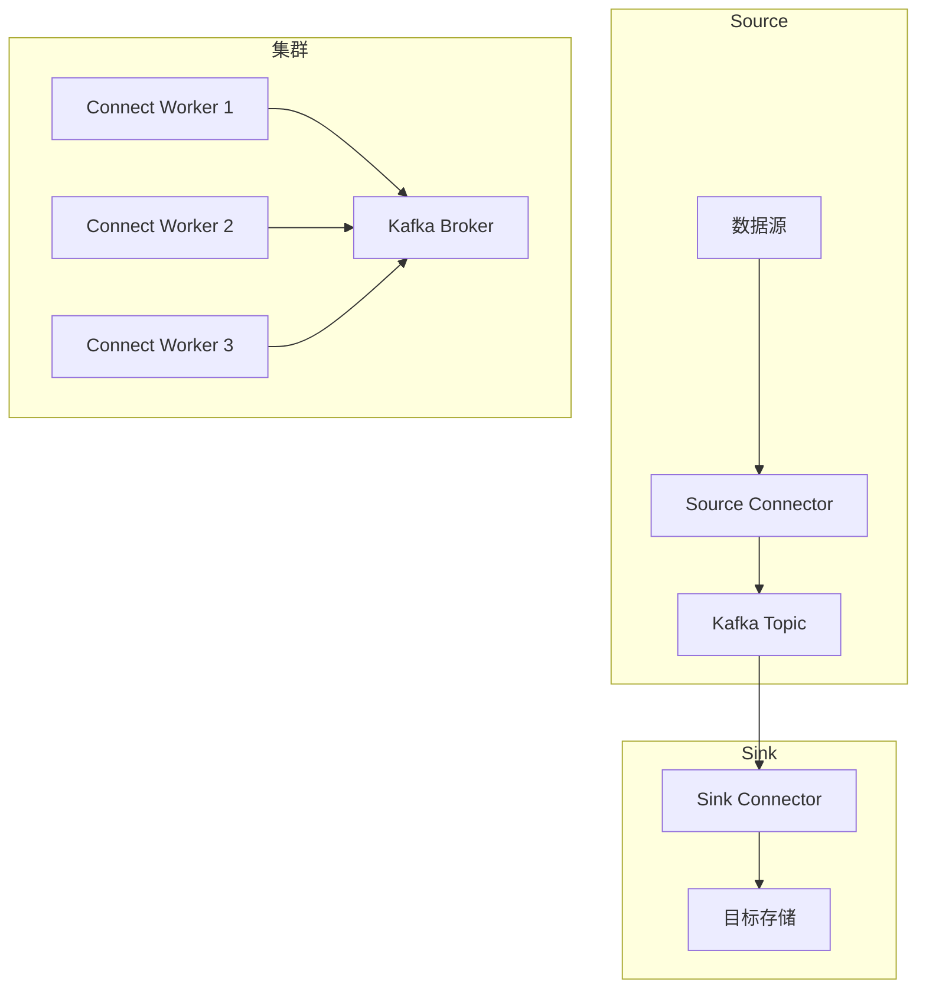
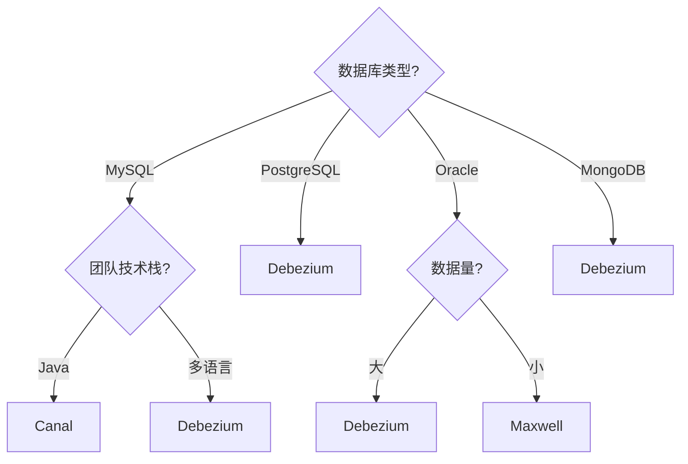
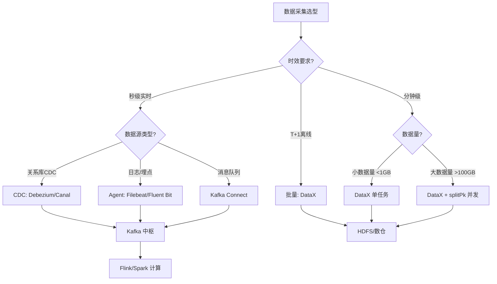

# 大数据 · 03 数据采集与同步（日志采集 / 批量同步 / CDC 原理 / Kafka 中枢 / Schema 演进 / 断点续传）

> 数据是"喂"进大数据平台的。采集与同步解决"把数据从各处搬到湖/仓"的问题，是整条链路的入口，决定了下游的时效与质量。本文覆盖**日志采集（Flume/Filebeat）、数据库同步（Sqoop/DataX）、实时 CDC（Canal/Debezium）**，以及消息队列（Kafka）这一中枢。

---

## 一、要解决的问题

| 痛点 | 说明 |
|------|------|
| 多源接入 | 日志/关系库/消息/文件多种数据源 |
| 时效分层 | 离线全量 + 实时增量需并存 |
| 数据丢失 | 采集过程必须可靠不丢 |
| 源库压力 | 采集不能拖垮业务库 |
| 下游幂等 | CDC 至少一次需下游去重 |

> 核心认知：**采集 = 「搬运」不丢失 + 「同步」保时效**——离线用批量抽取（DataX/Sqoop），实时用 CDC（binlog），统一经 Kafka 削峰解耦。

---

## 二、采集场景分类

| 场景 | 数据源 | 方式 | 时效 |
|------|--------|------|------|
| 日志/埋点 | 服务器日志、App 埋点 | Agent 采集（Flume/Filebeat） | 近实时 |
| 关系库全量 | MySQL/Oracle | 批量抽取（Sqoop/DataX） | 离线 |
| 关系库增量 | binlog | CDC（Canal/Debezium） | 秒级 |
| 消息/流 | Kafka 主题 | Kafka Connect | 实时 |
| 对象/文件 | FTP/S3/HDFS | DataX/DistCp | 批量 |

### 2.1 采集决策

```
日志 → Agent（Filebeat/Fluent Bit）直发 Kafka（轻量优先）
关系库全量 → DataX（插件多、轻量）
关系库增量 → CDC（Canal/Debezium）
消息 → Kafka Connect（现成连接器）
文件 → DataX/DistCp
```

---

## 三、日志采集：Flume 与新一代

### 3.1 Flume（经典）

```
Flume 基于 Agent = Source + Channel + Sink 模型：

  Source：数据入口（taildir 监听文件、Kafka Source、Avro）
  Channel：缓冲（Memory 快但不持久；File 持久但慢）
  Sink：出口（HDFS、Kafka、HBase）
  拦截器/选择器：清洗、分流（按事件头路由到不同 Channel）
  可靠性：Channel 用 File 时支持端到端确认，故障不丢
```



### 3.2 新一代替代

```
现状：Flume 仍用，但云上多被 Filebeat + Kafka 或 Fluent Bit 取代（更轻量）

Filebeat：轻量 Go Agent，tail 文件 → Kafka/ES
Fluent Bit：嵌入式 C 采集器，插件丰富、资源占用极小
对比：
  Flume：功能全但重（JVM）
  Filebeat：轻量但功能简单
  Fluent Bit：轻量 + 插件多
```

---

## 四、关系库批量同步：Sqoop 与 DataX

### 4.1 Sqoop（Hadoop↔RDB 桥梁）

```
把 RDB 数据导入 HDFS/Hive，或导出回 RDB；底层转成 MapReduce 并行。
```

```bash
sqoop import --connect jdbc:mysql://db/order \
  --username u --password p \
  --table orders --target-dir /user/hive/orders \
  --split-by id --m 4          # 4 个并行 map 按 id 分片
```

```
局限：
  依赖 Hadoop/MR（重）
  增量靠 --incremental（只能按单调列，捕获不了 update/delete）
  社区已不活跃
```

### 4.2 DataX（阿里开源，离线同步首选）

```
异构数据源离线同步框架，插件式 Reader/Writer
支持 MySQL/Oracle/HDFS/Hive/ES/ClickHouse 等几十种
单进程多线程，不依赖 Hadoop；JSON 配置作业
优势：轻量、插件多、易扩展；配 DolphinScheduler 做定时同步
```

```json
{
  "job": {
    "setting": { "speed": { "channel": 8, "byte": 10485760 } },
    "content": [{
      "reader": { "name": "mysqlreader",
        "parameter": { "connection": [{"jdbcUrl":["jdbc:mysql://db/order"],
          "table":["orders"],"splitPk":"id"}],
          "column":["id","user_id","amount","update_time"] } },
      "writer": { "name": "hdfswriter",
        "parameter": { "path":"/ods/orders","fileName":"orders",
          "fieldDelimiter":",","fileType":"text" } }
    }]
  }
}
```

```
DataX 关键：
  speed.channel 控制并发
  speed.byte 限流保护源库
  增量：where 拼 update_time >= '${bizdate}'
```

---

## 五、实时 CDC：Canal / Debezium（核心）

### 5.1 MySQL Binlog 原理

```
Binlog = MySQL 的变更日志（ROW 格式记录每行 before/after）

CDC 原理：
  工具伪装成 MySQL 从库（slave）→ 拉取 binlog → 解析成事件 → 推送 Kafka
```



### 5.2 Canal（阿里，MySQL 专用）

```
伪装成 MySQL 从库，解析 binlog 推送到 Kafka/RocketMQ
输出事件含 type(INSERT/UPDATE/DELETE) 与 before/after 行
典型链路：MySQL → Canal → Kafka → Flink → Iceberg/Paimon/HBase/ES
```

### 5.3 Debezium（RedHat，多源）

```
支持 MySQL/PostgreSQL/Oracle/MongoDB 等
基于 Kafka Connect 输出统一变更格式（op=c/u/d + before/after）
snapshot（全量快照）+ streaming（增量 binlog）无缝衔接
可直接接 Flink/Spark
```

### 5.4 CDC 注意事项

```
⚠️ 1. binlog 必须开 ROW 格式（非 STATEMENT），否则拿不到行级前后像。
⚠️ 2. CDC 是至少一次语义，下游需幂等（upsert by 主键）防重复。
⚠️ 3. 大事务/长事务会撑大 binlog，需监控位点延迟与 Canal 积压。
⚠️ 4. 源库压力：CDC 限流、批量读分页，避免拖垮业务库。
```

---

## 六、消息队列：Kafka（数据中枢）

```
Kafka 是大数据管道的事实标准缓冲与解耦层
  角色：采集与计算之间的削峰、解耦、重放（按 offset 重放是 Kappa 架构基础）
  关键概念：Topic/Partition、Producer/Consumer、Consumer Group、Offset、副本

选型对比：
  Kafka：高吞吐、生态全（默认）
  Pulsar：存算分离、多租户
  RocketMQ：事务/顺序，偏业务消息
```

---

## 七、全量 + 增量一体化（Debezium / Flink CDC）

```
现代 CDC 用 snapshot（全量快照）+ streaming（增量 binlog）无缝衔接：
  先扫全表打快照 → 再从快照位点续接 binlog → 下游零丢失
  Debezium 输出统一格式：op=c/u/d + before/after
  Kafka Connect 自动管理 offset 与 schema
```

### 7.1 Flink CDC 实战

```java
// Flink 1.17+ 捕获 MySQL 变更并写 Iceberg
MySqlSource<String> src = MySqlSource.<String>builder()
    .hostname("mysql-host").port(3306).databaseList("shop")
    .tableList("shop.orders")
    .username("flink").password("pw")
    .deserializationSchema(new JsonDebeziumDeserializationSchema())
    .startupOptions(StartupOptions.initial())   // 先全量快照再增量
    .build();

StreamExecutionEnvironment env = StreamExecutionEnvironment.getExecutionEnvironment();
env.enableCheckpointing(5000, CheckpointingMode.EXACTLY_ONCE);

env.fromSource(src, WatermarkStrategy.noWatermarks(), "MySQL CDC")
   .sinkTo(IcebergSink.forRowData(/* 表配置 */).build());

env.execute("mysql-to-iceberg");
```

```sql
-- Flink SQL 更简洁
CREATE TABLE orders_cdc WITH ('connector'='mysql-cdc',
  'hostname'='mysql-host','port'='3306','username'='flink',
  'password'='pw','database-name'='shop','table-name'='orders',
  'scan.startup.mode'='initial');
INSERT INTO iceberg_orders SELECT * FROM orders_cdc;
```

```
StartupOptions.initial() = 全量+增量一体化
精确一次靠 Checkpoint + Iceberg 幂等 upsert
```

---

## 八、Schema 演进与兼容性

| 变更 | 兼容性 | 处理 |
|------|--------|------|
| 加列 | 向后兼容 | 下游用默认值 |
| 删列 | 需评估 | 保留期后下线 |
| 改类型 | 可能不兼容 | 双写过渡/新列替代 |
| 改名 | 不兼容 | 别名过渡 |

```
用 Confluent Schema Registry / Apicurio 做 Avro/Protobuf schema 版本管理与兼容性校验（BACKWARD/FORWARD/FULL）
```

---

## 九、DataX vs Sqoop vs Canal 速查

| 工具 | 类型 | 时效 | 数据源 | 依赖 |
|------|------|------|--------|------|
| Sqoop | 批量离线 | T+1 | RDB↔HDFS | Hadoop/MR |
| DataX | 批量离线 | 定时 | 异构几十种 | 无 |
| Canal | 实时 CDC | 秒级 | MySQL | MySQL binlog |
| Debezium | 实时 CDC | 秒级 | 多 RDB | Kafka Connect |

```
选型决策树：
  离线全量 → DataX（无依赖）> Sqoop（Hadoop 生态）
  MySQL 实时 → Canal（轻量）> Debezium（多源）
  多源实时 → Debezium（PostgreSQL/Oracle/MongoDB）
  日志 → Filebeat/Fluent Bit
```

---

## 十、采集同步设计 Checklist

- [ ] 日志用 Agent（Filebeat/Fluent Bit）直发 Kafka，避免 Flume 重。
- [ ] 离线同步用 DataX + 调度（DolphinScheduler），按业务时间增量。
- [ ] 实时同步必须 CDC（Canal/Debezium），下游 upsert 幂等。
- [ ] 所有实时流先进 Kafka 削峰解耦，再进 Flink。
- [ ] 大表用 splitPk/channel 并发，限流保护源库。
- [ ] Schema 变更走 Registry 兼容校验，禁止破坏性改。
- [ ] 断点续传：DataX 记录位点、CDC 用 Kafka offset。
- [ ] 监控：同步延迟、binlog 位点滞后、同步失败率、数据量波动。

---

## 十一、Flume vs Kafka Connect vs DataX 深度对比

| 维度 | Flume | Kafka Connect | DataX |
|------|-------|---------------|-------|
| 架构 | Agent = Source+Channel+Sink | Worker+Task 分布式 | 单进程多线程 |
| 数据源 | 日志/文件/HDFS | Kafka 生态（数百连接器） | 异构几十种 |
| 依赖 | JVM 重 | Kafka 集群 | 无依赖（独立进程） |
| 吞吐 | 中 | 高（分布式） | 中（单进程） |
| 可靠性 | Channel 确认 | Kafka offset | 位点记录 |
| 适用 | 日志采集（存量） | Kafka 生态连接 | 离线批量同步 |
| 维护状态 | 维护模式 | 活跃 | 活跃 |



## 十二、批式 vs 流式数据摄入对比

| 维度 | 批式（DataX/Sqoop） | 流式（CDC/Debezium） |
|------|----------------------|----------------------|
| 时效 | T+1 / 小时级 | 秒级~分钟级 |
| 源库压力 | 高（全表扫描） | 低（读 binlog） |
| 数据完整性 | 全量（可对账） | 增量（可能丢） |
| 实现复杂度 | 低 | 中高 |
| 适用 | 离线报表/历史分析 | 实时数仓/实时大屏 |

> **口诀**：批式保证完整但慢，流式快但需对账；生产中两者并存——批式补存量，流式保增量。

## Kafka Connect 架构详解

### Worker / Connector / Task

```
Kafka Connect 架构：

Worker（工作节点）：
  执行 Connector 和 Task
  管理偏移量（Offset）
  水平扩展（多 Worker）

Connector（连接器）：
  定义数据流（Source/Sink）
  管理 Task 生命周期
  配置管理

Task（任务）：
  实际数据搬运
  并行执行（分片）
  自动故障转移

Source Connector：
  数据库 → Kafka
  文件 → Kafka
  API → Kafka

Sink Connector：
  Kafka → 数据库
  Kafka → 搜索引擎
  Kafka → 对象存储
```

## Exactly-Once 语义

### Source / Sink / 事务性写入

```
Exactly-Once 实现：

Source（写入端）：
  Kafka Connect 幂等写入
  事务性提交（Atomic Offset + Data）
  
  配置：
    transactions.enabled=true
    offsets.storage=kafka
    offsets.topic=connect-offsets

Sink（消费端）：
  幂等写入（数据库唯一约束）
  事务性写入（Kafka Transactions）

Kafka Transactions：
  producer.initTransactions();
  producer.beginTransaction();
  producer.send(record);
  producer.sendOffsetsToTransaction(offsets, consumerGroupId);
  producer.commitTransaction();

效果：
  端到端 Exactly-Once
  消费者重启不重复消费
  故障恢复不丢数据
```

## Flume 配置详解

### Agent / Channel / Sink

```
Flume Agent 配置：

a1.sources = s1
a1.channels = c1
a1.sinks = k1

# Source（数据源）
a1.sources.s1.type = avro
a1.sources.s1.bind = 0.0.0.0
a1.sources.s1.port = 4141

# Channel（缓冲区）
a1.channels.c1.type = memory
a1.channels.c1.capacity = 10000
a1.channels.c1.transactionCapacity = 1000

# Sink（输出）
a1.sinks.k1.type = kafka
a1.sinks.k1.kafka.bootstrap.servers = kafka:9092
a1.sinks.k1.kafka.topic = flume-events

# 拦截器
a1.sources.s1.interceptors = i1
a1.sources.s1.interceptors.i1.type = timestamp

# 连接
a1.sources.s1.channels = c1
a1.sinks.k1.channel = c1
```

## DataX 模型

### Writer / Reader / Job

```
DataX 架构：

Job（作业）：
  数据同步任务
  管理拆分和调度

TaskGroup（任务组）：
  并行执行单元
  管理子任务

Task（子任务）：
  单通道数据搬运
  Reader → Writer

Reader（读取器）：
  mysqlreader：MySQL 全量/增量
  hdfsreader：HDFS 文件
  httpreader：HTTP API

Writer（写入器）：
  mysqlwriter：MySQL 写入
  hdfswriter：HDFS 写入
  elasticsearchwriter：ES 写入

配置示例：
{
  "job": {
    "content": [{
      "reader": {
        "name": "mysqlreader",
        "parameter": {
          "connection": [{
            "jdbcUrl": ["jdbc:mysql://localhost:3306/db"],
            "table": ["users"]
          }]
        }
      },
      "writer": {
        "name": "hdfswriter",
        "parameter": {
          "path": "/data/users",
          "fileName": "users"
        }
      }
    }]
  }
}
```

## 实时 vs 批量数据摄入决策树

### 时效 / 数据量 / 成本 / 复杂度

```
决策树：

1. 时效要求？
   秒级 → 流式（Kafka Connect CDC）
   分钟级 → 流式（Kafka Connect）
   小时级 → 批式（DataX）
   T+1 → 批式（DataX/Sqoop）

2. 数据量？
   < 1GB/天 → 批式
   > 100GB/天 → 流式
   > 1TB/天 → 流式 + 分片

3. 成本预算？
   低 → 批式（无流式基础设施）
   中 → 流式（Kafka Connect）
   高 → 流式 + 批式混合

4. 复杂度？
   简单 → 批式（DataX）
   中等 → 流式（Kafka Connect）
   复杂 → 流式（Debezium + 自定义）
```

## 数据质量门禁

### Schema 检查 / 空值检查 / 范围检查

```
数据质量检查：

1. Schema 检查
  消息格式验证（Avro/Protobuf）
  字段类型检查
  必填字段检查

2. 空值检查
  关键字段不能为空
  空值率 < 阈值（如 5%）

3. 范围检查
  数值范围（年龄 0-150）
  时间范围（不早于昨天）

4. 唯一性检查
  主键唯一
  业务键唯一

5. 一致性检查
  数据库与 Kafka 一致
  跨系统数据一致

实现：
  Kafka Connect SMT（Single Message Transform）
  自定义 Transformer
  数据质量工具（Great Expectations）
```

```
Schema Registry 的价值：
  ① 生产者写入前校验 Schema 兼容性（防止破坏性变更）
  ② 消费者读取时自动反序列化（无需手动解析）
  ③ 版本管理（向前/向后兼容）
  ④ 数据质量第一道门禁（类型错误拦截）
```

```bash
# Confluent Schema Registry 示例
# 注册 Schema
curl -X POST -H "Content-Type: application/vnd.schemaregistry.v1+json" \
  --data '{"schema": "{\"type\":\"record\",\"name\":\"Order\",\"fields\":[{\"name\":\"id\",\"type\":\"long\"},{\"name\":\"amount\",\"type\":\"double\"}]}"}' \
  http://schema-registry:8081/subjects/orders-value/versions

# 兼容性检查
curl -X POST -H "Content-Type: application/vnd.schemaregistry.v1+json" \
  --data '{"schema": "..."}' \
  http://schema-registry:8081/subjects/orders-value/compatibility
```

## 十四、Exactly-Once 数据摄入

### 14.1 语义保证对比

| 语义 | 说明 | 实现 |
|------|------|------|
| At-Most-Once | 可能丢数据 | 不确认 offset |
| At-Least-Once | 可能重复 | 确认 offset 但可能失败重发 |
| Exactly-Once | 不丢不重 | 事务 + 幂等 |

### 14.2 Exactly-Once 实现方式

```
方式一：Kafka Transactions + 幂等 Producer
  Producer 启用幂等：enable.idempotence=true
  事务写入：producer.initTransactions() → begin → send → commit

方式二：Flink Checkpoint + Kafka Source
  Source 记录 offset 到 Flink 状态
  Sink 用 Kafka 事务写入
  恢复时从 checkpoint 重放，幂等消费

方式三：Iceberg/Paimon 幂等写入
  主键表 upsert，重复写入自动去重
  Flink Checkpoint 保证 exactly-once 处理
```

## 十五、数据摄入质量保障

### 15.1 质量校验点

| 校验点 | 说明 | 对策 |
|--------|------|------|
| 数据量波动 | 突然增多或减少 | 监控日增量，超阈值告警 |
| Schema 变更 | 下游不兼容 | Schema Registry 兼容检查 |
| 数据延迟 | CDC 位点滞后 | 监控 binlog lag |
| 数据丢失 | 采集过程丢数据 | 全量对账 + 增量 offset 监控 |
| 数据重复 | 重复写入 | 下游幂等 upsert |

### 15.2 监控指标

| 指标 | 告警阈值 | 说明 |
|------|----------|------|
| binlog lag | > 5min | CDC 延迟 |
| 同步失败率 | > 0.1% | 同步任务失败 |
| 日数据量波动 | > 30% | 数据量异常 |
| Schema 不兼容 | > 0 | 破坏性 Schema 变更 |
| 数据延迟 | > 1h | 批量同步超时 |

## 十六、数据摄入成本优化

| 策略 | 做法 | 省多少 |
|------|------|--------|
| 压缩传输 | gzip/snappy 压缩 | 50~70% |
| 限流保护 | DataX speed.byte 限流 | 避免源库被打挂 |
| 批量合并 | 小批量合并为大批量 | 减少网络往返 |
| 增量替代全量 | CDC 增量替代每日全量 | 90%+ |
| 复用连接 | 连接池复用 DB 连接 | 减少连接开销 |

```json
// DataX 限流配置
{
  "job": {
    "setting": {
      "speed": {
        "channel": 4,
        "byte": 5242880,
        "record": 10000
      }
    }
  }
}
```

## 十七、断点续传深入

### 17.1 各工具断点续传机制

| 工具 | 机制 | 说明 |
|------|------|------|
| DataX | 位点记录（taskGroupId） | 任务失败后从位点恢复 |
| Debezium | Kafka Connect offset | 自动管理 offset |
| Canal | binlog 位点（position） | 手动/自动记录位点 |
| Filebeat | registry 文件 | 记录已发送文件偏移 |
| Flume | Channel 持久化 | File Channel 保证不丢 |

### 17.2 断点续传最佳实践

```
① 位点存储：binlog 位点/Kafka offset 存外部（Redis/文件），不只存内存
② 定期持久化：每 N 批记录一次位点
③ 故障恢复：重启后从最后持久化位点恢复
④ 幂等消费：即使位点回退，重复数据不影响结果
```

## 十八、采集同步设计 Checklist

- [ ] 日志用 Agent（Filebeat/Fluent Bit）直发 Kafka，避免 Flume 重。
- [ ] 离线同步用 DataX + 调度（DolphinScheduler），按业务时间增量。
- [ ] 实时同步必须 CDC（Canal/Debezium），下游 upsert 幂等。
- [ ] 所有实时流先进 Kafka 削峰解耦，再进 Flink。
- [ ] 大表用 splitPk/channel 并发，限流保护源库。
- [ ] Schema 变更走 Registry 兼容校验，禁止破坏性改。
- [ ] 断点续传：DataX 记录位点、CDC 用 Kafka offset。
- [ ] 监控：同步延迟、binlog 位点滞后、同步失败率、数据量波动。

## Kafka Connect 深度（worker/task/converter 架构）

```
Kafka Connect 架构：

  Worker：执行任务的 JVM 进程
    独立模式：单 Worker（开发测试）
    分布式模式：多 Worker，自动负载均衡+容错
  
  Task：数据搬运单元（Worker 内线程）
    Source Task：从外部系统读取 → 写入 Kafka
    Sink Task：从 Kafka 读取 → 写入外部系统
    Task 分配： Coordinator 按 Worker 能力分配
  
  Converter：数据格式转换
    JsonConverter：JSON 格式
    AvroConverter：Avro 格式（需 Schema Registry）
    ProtobufConverter：Protobuf 格式
  
  Schema Registry：Schema 管理
    版本管理、兼容性检查
    与 Converter 联动自动编解码
```

## Kafka Connect Exactly-Once 语义实现

```
Source Connector Exactly-Once：
  1. 读取外部系统数据（事务内）
  2. 写入 Kafka（事务提交）
  3. 提交外部系统位点（commit）
  4. 如果步骤2失败 → 外部系统不提交位点
  5. 重启后从上次位点读取（不丢不重）

Sink Connector Exactly-Once：
  1. 从 Kafka 读取数据（事务消费）
  2. 写入目标系统（幂等写入）
  3. 提交 Kafka offset（事务提交）
  4. 如果步骤2失败 → offset 不提交
  5. 重启后重新消费（幂等保证不重复）

配置：
  errors.tolerance: all（容错）
  errors.deadletterqueue.topic.name: dead-letter
  errors.deadletterqueue.topic.replication.factor: 3
```

## Flume Agent 配置实例（taildir/kafka source）

```properties
# taildir Source：监控多个日志文件
a1.sources.s1.type = taildir
a1.sources.s1.filegroups = f1
a1.sources.s1.filegroups.f1 = /var/log/app/.*log
a1.sources.s1.positionFile = /var/log/flume/taildir_position.json

# Kafka Source：从 Kafka 消费
a1.sources.s2.type = org.apache.flume.source.kafka.KafkaSource
a1.sources.s2.kafka.bootstrap.servers = kafkabroker:9092
a1.sources.s2.kafka.topics = events
a1.sources.s2.kafka.consumer.group.id = flume-group

# Channel：缓冲
a1.channels.c1.type = memory
a1.channels.c1.capacity = 10000
a1.channels.c1.transactionCapacity = 1000

# Sink：输出到 Kafka/HDFS
a1.sinks.k1.type = kafka
a1.sinks.k1.kafka.bootstrap.servers = kafkabroker:9092
a1.sinks.k1.kafka.topic = processed-events
```

## DataX 通道模型（job/task/channel）

```
DataX 通道模型：

  Job：一个同步任务（JSON 配置）
    包含 reader + writer + setting
  
  TaskGroup：一组 Task 的集合
    并行度由 channel 控制
  
  Task：最小执行单元
    一个 Reader + 一个 Writer
    单进程多线程执行
  
  Channel：数据缓冲
    MemoryChannel：快但不持久
    FileChannel：持久但慢
    BusChannel：Kafka 中转（高吞吐）

  数据流：
    Reader → Channel → Writer
    Channel 控制并发+限流
```

## 实时 vs 批量采集选型决策树

```
选型决策树：

  数据源类型？
    ├── 关系库 binlog → CDC（Canal/Debezium）
    │    └── 实时性要求？
    │         ├── 秒级 → Canal/Debezium → Kafka
    │         └── 分钟级 → Debezium + 定时批量
    │
    ├── 关系库全量 → DataX（批量）
    │    └── 数据量？
    │         ├── <100GB → DataX 单任务
    │         └── >100GB → DataX + splitPk 并发
    │
    ├── 日志/埋点 → Agent（Filebeat/Fluent Bit）
    │    └── → Kafka
    │
    └── 文件/对象 → DataX/DistCp
```

## 数据质量门禁（ingestion-time 校验）

```
采集时质量校验：

  校验点：
    数据量波动：日增量 ±30% 告警
    Schema 变更：不兼容变更阻断
    数据延迟：CDC 位点 >5min 告警
    数据丢失：全量对账 diff >0.1% 告警
    数据重复：重复记录 >0 告警

  门禁实现：
    采集管道 → 质量校验节点 → 合格通过/不合格阻断
    
    阻断型：主键重复、Schema 不兼容 → 阻断下游
    告警型：数据量波动、延迟 → 告警+放行
    监控型：数据漂移 → 只记录趋势

  监控指标：
    binlog lag > 5min → 告警
    同步失败率 > 0.1% → 严重告警
    日数据量波动 > 30% → 告警
    Schema 不兼容 > 0 → 阻断
```

## 十九、Kafka Connect 深入

### 架构组件

```
Kafka Connect 架构：
  Worker：执行任务的进程
    独立模式：单Worker
    分布式模式：多Worker，自动负载均衡
  Task：数据搬运单元
    Source Task：从外部系统读取数据
    Sink Task：写入外部系统
  Converter：数据格式转换
    JsonConverter：JSON格式
    AvroConverter：Avro格式
    ProtobufConverter：Protobuf格式
  Schema Registry：Schema管理
    版本管理、兼容性检查
```

### 连接器分类

| 类型 | 连接器 | 数据源 |
|------|--------|--------|
| Source | JDBC Source | MySQL/PostgreSQL |
| Source | Debezium MySQL | MySQL CDC |
| Source | Debezium PostgreSQL | PostgreSQL CDC |
| Source | File Source | 文件系统 |
| Sink | JDBC Sink | MySQL/PostgreSQL |
| Sink | Elasticsearch Sink | Elasticsearch |
| Sink | S3 Sink | S3对象存储 |
| Sink | HDFS Sink | HDFS |
| Sink | Redis Sink | Redis |

### Exactly-Once 实现

```
Kafka Connect Exactly-Once：

Source Connector：
  1. 读取外部系统数据
  2. 写入Kafka（事务）
  3. 提交外部系统位点
  4. 如果步骤2失败，外部系统不提交位点
  5. 重启后从上次位点读取

Sink Connector：
  1. 从Kafka读取数据（事务）
  2. 写入目标系统
  3. 提交Kafka offset
  4. 如果步骤2失败，offset不提交
  5. 重启后重新消费

配置示例：
  tasks.max：并行度
  errors.tolerance：all（容错）
  errors.deadletterqueue.topic.name：死信队列
  errors.deadletterqueue.topic.replication.factor：3
```

## Flume Agent 高级配置

### 多级Agent配置

```properties
# Agent1: 应用服务器
a1.sources = s1
a1.channels = c1
a1.sinks = k1

a1.sources.s1.type = taildir
a1.sources.s1.filegroups = f1
a1.sources.s1.filegroups.f1 = /var/log/app/.*log
a1.sources.s1.positionFile = /var/log/flume/taildir_position.json

a1.channels.c1.type = memory
a1.channels.c1.capacity = 10000
a1.channels.c1.transactionCapacity = 1000

a1.sinks.k1.type = avro
a1.sinks.k1.hostname = collector1
a1.sinks.k1.port = 4545

# Agent2: 收集器
a2.sources = s1
a2.channels = c1
a2.sinks = k1

a2.sources.s1.type = avro
a2.sources.s1.bind = 0.0.0.0
a2.sources.s1.port = 4545

a2.channels.c1.type = file
a2.channels.c1.checkpointDir = /var/log/flume/checkpoint
a2.channels.c1.dataDirs = /var/log/flume/data

a2.sinks.k1.type = hdfs
a2.sinks.k1.hdfs.path = /flume/events/%Y-%m-%d
a2.sinks.k1.hdfs.filePrefix = events-
a2.sinks.k1.hdfs.fileSuffix = .log
a2.sinks.k1.hdfs.rollInterval = 3600
a2.sinks.k1.hdfs.rollSize = 134217728
a2.sinks.k1.hdfs.rollCount = 0
```

## DataX 架构深入

### 插件机制

```
DataX 插件体系：
  Reader插件：数据读取
    MySQLReader：JDBC读取
    HdfsReader：HDFS读取
    ElasticsearchReader：ES读取
  Writer插件：数据写入
    HdfsWriter：HDFS写入
    MySQLWriter：JDBC写入
    ElasticSearchWriter：ES写入
  Transform插件：数据转换
    SubstrTransform：字符串处理
    PadTransform：填充处理

插件开发：
  实现Reader/Writer接口
  配置插件参数
  打包为jar
  放入plugin目录
```

### 调度集成

```
DataX + DolphinScheduler集成：

1. 创建DataX作业模板
2. 配置数据源连接
3. 设置调度周期（Cron）
4. 配置依赖关系
5. 设置告警通知

调度策略：
  增量同步：每天凌晨同步前一天数据
  实时同步：每小时/每分钟同步
  手动触发：运维手动执行
  依赖触发：上游任务完成后触发
```

## 批式 vs 流式摄入对比

| 维度 | 批式(DataX/Sqoop) | 流式(CDC/Debezium) |
|------|-------------------|-------------------|
| 时效 | T+1/小时级 | 秒级~分钟级 |
| 源库压力 | 高(全表扫描) | 低(读binlog) |
| 数据完整性 | 全量(可对账) | 增量(可能丢) |
| 实现复杂度 | 低 | 中高 |
| 适用 | 离线报表/历史分析 | 实时数仓/实时大屏 |
| 成本 | 低(资源少) | 中(需Kafka/Flink) |
| 一致性 | 强(全量对账) | 最终一致 |

```
生产建议：
  批式：离线报表、数据对账、历史分析
  流式：实时数仓、实时监控、实时推荐
  混合：批式补存量，流式保增量
```

## Schema 演进在采集中的作用

### Schema 兼容性规则

| 类型 | 说明 | 示例 |
|------|------|------|
| BACKWARD | 新Schema能读旧数据 | 加列(有默认值) |
| FORWARD | 旧Schema能读新数据 | 加列(忽略) |
| FULL | 双向兼容 | 加列(有默认值+忽略) |

### Schema 变更最佳实践

```
Schema变更流程：
  1. 生产者定义新Schema
  2. 注册到Schema Registry
  3. 兼容性检查(BACKWARD/FORWARD)
  4. 通过后发布
  5. 消费者自动适配

破坏性变更处理：
  1. 创建新Topic
  2. 双写过渡期
  3. 验证新Topic数据
  4. 切换消费者
  5. 停止旧Topic

工具：
  Confluent Schema Registry
  Apicurio Registry
  AWS Glue Schema Registry
```

## 数据摄入质量门禁

### 质量检查点

| 检查点 | 说明 | 阈值 | 处理 |
|--------|------|------|------|
| 数据量波动 | 日增量异常 | ±30% | 告警+人工检查 |
| Schema变更 | 字段类型变化 | 0 | 阻断+通知 |
| 数据延迟 | CDC位点滞后 | >5min | 告警+限流 |
| 数据丢失 | 全量对账差异 | >0.1% | 告警+补数 |
| 数据重复 | 重复记录 | >0 | 去重+告警 |

### 质量检查代码

```python
# 数据质量检查示例
def check_data_quality(df):
    checks = {
        "row_count": len(df) > 0,
        "null_check": df.isnull().sum().sum() / df.size < 0.01,
        "schema_check": set(df.columns) == expected_columns,
        "value_check": df['amount'].min() >= 0,
        "uniqueness_check": df['id'].is_unique
    }
    
    failed_checks = [k for k, v in checks.items() if not v]
    
    if failed_checks:
        raise DataQualityError(f"Failed checks: {failed_checks}")
    
    return True
```

## 采集监控与告警

### 监控指标

| 指标 | 说明 | 告警阈值 |
|------|------|----------|
| binlog lag | CDC延迟 | >5min |
| 同步失败率 | 任务失败比例 | >0.1% |
| 数据量波动 | 日增量变化 | ±30% |
| 数据延迟 | 端到端延迟 | >1h |
| 消费者lag | Kafka消费延迟 | >10000 |

### 告警规则

```yaml
# Prometheus告警规则
groups:
  - name: data_ingestion
    rules:
      - alert: BinlogLagHigh
        expr: mysql_slave_status_seconds_behind_master > 300
        for: 5m
        labels:
          severity: warning
        annotations:
          summary: "Binlog延迟超过5分钟"
          
      - alert: SyncFailureRateHigh
        expr: data_sync_failure_total / data_sync_total > 0.001
        for: 10m
        labels:
          severity: critical
        annotations:
          summary: "同步失败率超过0.1%"
          
      - alert: DataVolumeAnomaly
        expr: abs(data_volume_today - data_volume_avg_7d) / data_volume_avg_7d > 0.3
        for: 5m
        labels:
          severity: warning
        annotations:
          summary: "数据量波动超过30%"
```

> 一句话：**采集 = 日志 Agent（Filebeat/Fluent Bit）+ 批量同步（DataX/Sqoop）+ 实时 CDC（Canal/Debezium）+ Kafka 中枢——生产四守则：CDC 必须 ROW 格式、下游 upsert 幂等（至少一次语义）、源库限流保护、断点续传（offset/位点）+ 全量增量无缝衔接**。

---

## 二十四、Kafka Connect 架构（Worker / Task / Converter）

### 24.1 架构组件

```text
Kafka Connect 架构：
  Worker（进程）：运行 Connector 和 Task
    ├── Source Worker：从外部系统读取数据
    └── Sink Worker：向外部系统写入数据
  
  Connector（配置）：定义数据流拓扑
    ├── Source Connector：定义从哪读
    └── Sink Connector：定义往哪写
  
  Task（执行）：实际的数据搬运单元
    ├── Source Task：从外部系统读取
    └── Sink Task：向外部系统写入
  
  Converter（格式）：数据序列化/反序列化
    ├── Key Converter：Key 格式
    └── Value Converter：Value 格式
```

### 24.2 Connector 配置示例

```json
// Source Connector：MySQL → Kafka
{
  "name": "mysql-source",
  "config": {
    "connector.class": "io.debezium.connector.mysql.MySqlConnector",
    "database.hostname": "mysql-host",
    "database.port": "3306",
    "database.user": "debezium",
    "database.password": "${file:/opt/kafka/config/secrets.properties:db.password}",
    "database.server.id": "1",
    "database.include.list": "mydb",
    "table.include.list": "mydb.users,mydb.orders",
    "topic.prefix": "mysql",
    "key.converter": "io.confluent.connect.avro.AvroConverter",
    "value.converter": "io.confluent.connect.avro.AvroConverter"
  }
}
```

### 24.3 Converter 对比

| Converter | 格式 | 适用场景 | Schema 支持 |
|-----------|------|---------|------------|
| JsonConverter | JSON | 通用 | 可选 |
| AvroConverter | Avro | 强 Schema | 强 |
| ProtobufConverter | Protobuf | 高性能 | 强 |
| StringConverter | 字符串 | 简单场景 | 无 |

## 二十五、Kafka Connect Exactly-Once 语义实现

### 25.1 Exactly-Once 实现机制

```text
Kafka Connect Exactly-Once：
  Source Task：
    1. Source Task 读取外部系统数据
    2. 写入 Kafka（事务性 Producer）
    3. 提交 offset 到 Kafka（事务内）
    4. 事务提交 → 数据+Offset 原子写入
  
  Sink Task：
    1. 从 Kafka 读取数据
    2. 写入外部系统（幂等/事务）
    3. 提交 Kafka offset
    4. 外部写入+Offset 原子提交
```

### 25.2 配置示例

```json
{
  "name": "exactly-once-source",
  "config": {
    "connector.class": "io.confluent.connect.jdbc.JdbcSourceConnector",
    "tasks.max": "1",
    "producer.override.enable.idempotence": "true",
    "producer.override.acks": "all",
    "producer.override.transactional.id": "connect-source-1",
    "exactly.once.support": "required"
  }
}
```

## 二十六、Flume Agent 配置实例（Taildir Source / Kafka Sink）

### 26.1 Flume Agent 配置

```properties
# Flume Agent 配置：Taildir → Kafka
a1.sources = s1
a1.channels = c1
a1.sinks = k1

# Taildir Source：监听日志文件
a1.sources.s1.type = TAILDIR
a1.sources.s1.filegroups = f1
a1.sources.s1.filegroups.f1 = /var/log/app/.*log
a1.sources.s1.positionFile = /var/flume/taildir_position.json
a1.sources.s1.headers.f1.topic = app-logs

# Memory Channel
a1.channels.c1.type = memory
a1.channels.c1.capacity = 10000
a1.channels.c1.transactionCapacity = 1000

# Kafka Sink
a1.sinks.k1.type = org.apache.flume.sink.kafka.KafkaSink
a1.sinks.k1.kafka.bootstrap.servers = kafka1:9092,kafka2:9092
a1.sinks.k1.kafka.topic = app-logs
a1.sinks.k1.kafka.producer.acks = 1
a1.sinks.k1.kafka.producer.linger.ms = 100

# 绑定
a1.sources.s1.channels = c1
a1.sinks.k1.channel = c1
```

### 26.2 Flume vs Kafka Connect 对比

| 维度 | Flume | Kafka Connect |
|------|-------|--------------|
| 部署模型 | Agent 独立进程 | Worker 集群 |
| 扩展性 | 水平扩 Agent | 水平扩 Worker |
| 可靠性 | Channel 保障 | Kafka 保障 |
| 监控 | JMX + Web UI | JMX + REST API |
| 适用场景 | 日志采集 | 通用数据集成 |

## 二十七、DataX 通道模型（Job / Task / Channel）与并发模型

### 27.1 DataX 架构

```text
DataX 架构：
  Job（作业）：一次数据同步任务
    ├── 1 个 JobMaster：调度和监控
    └── N 个 TaskGroup：任务分组
  
  TaskGroup（任务组）：一组 Task 的集合
    └── N 个 Task：实际的数据搬运单元
  
  Channel（通道）：Task 内的数据缓冲
    MemoryChannel：内存缓冲
    ByteChannel：字节缓冲
    DbChannel：数据库缓冲
```

### 27.2 并发模型

```json
{
  "job": {
    "setting": {
      "speed": {
        "channel": 32,
        "byte": 10485760,
        "record": 10000
      },
      "errorLimit": {
        "record": 0,
        "percentage": 0.02
      }
    },
    "content": {
      "reader": {
        "name": "mysqlreader",
        "parameter": {
          "connection": [{
            "jdbcUrl": ["jdbc:mysql://mysql:3306/mydb"],
            "table": ["users"]
          }]
        }
      },
      "writer": {
        "name": "kafkawriter",
        "parameter": {
          "bootstrapServers": "kafka:9092",
          "topic": "users"
        }
      }
    }
  }
}
```

## 二十八、实时 vs 批量采集选型决策树

### 28.1 选型决策树



### 28.2 选型对比

| 维度 | 实时采集 | 批量采集 |
|------|---------|---------|
| 延迟 | 秒级 | 小时/天级 |
| 资源消耗 | 高（持续运行） | 低（定时执行） |
| 数据一致性 | 至少一次 | 精确一次 |
| 实现复杂度 | 高 | 低 |
| 适用场景 | 实时数仓/监控 | 报表/分析 |

## 二十九、Kafka Connect 架构与 Exactly-Once 语义

### Kafka Connect 架构



### Exactly-Once 语义实现

| 语义 | 实现方式 | 适用场景 | 复杂度 |
|------|---------|---------|--------|
| At-Least-Once | 自动重试 | 通用(默认) | 低 |
| At-Most-Once | 手动提交offset | 容忍丢失 | 低 |
| Exactly-Once | 事务+幂等 | 金融/计数 | 高 |

```json
// Exactly-Once Source Connector 配置
{
  "name": "eos-source",
  "config": {
    "connector.class": "io.debezium.connector.mysql.MySqlConnector",
    "database.server.id": "1",
    "topic.prefix": "dbserver",
    "producer.override.enable.idempotence": true,
    "producer.override.acks": "all",
    "producer.override.transactional.id": "mysql-source-1",
    "transforms": "route",
    "transforms.route.type": "org.apache.kafka.connect.transforms.RegexRouter",
    "transforms.route.regex": "([^.]+)\\.([^.]+)\\.([^.]+)",
    "transforms.route.replacement": "$3"
  }
}
```

### Flume vs DataX vs Kafka Connect 选型

| 维度 | Flume | DataX | Kafka Connect |
|------|-------|-------|---------------|
| 架构 | Agent/Channel/Sink | Framework/Plugin | Worker/Connector |
| 数据模型 | 事件流 | 批量记录 | 事件流 |
| 可靠性 | Channel事务 | 任务级事务 | 分布式事务 |
| 吞吐量 | 中 | 高 | 极高 |
| 运维 | 复杂 | 简单 | 中等 |
| 适用场景 | 日志采集 | 批量同步 | 实时集成 |

### 数据质量门禁配置

```python
# Great Expectations 质量检查
import great_expectations as gx

context = gx.get_context()

# 定义检查规则
validator = context.sources.pandas_default.read_csv("data.csv")
validator.expect_column_values_to_not_be_null("user_id")
validator.expect_column_values_to_be_unique("order_id")
validator.expect_column_values_to_be_between("amount", min_value=0, max_value=10000)
validator.expect_table_row_count_to_be_between(min_value=1000, max_value=1000000)

# 执行检查
results = validator.validate()
if not results.success:
    raise ValueError("数据质量检查未通过")
```

| 质量规则 | 检查内容 | 阻断条件 | 修复方案 |
|----------|---------|---------|---------|
| 完整性 | 非空检查 | 空值率>5% | 源端修复 |
| 唯一性 | 主键唯一 | 重复>0 | 去重处理 |
| 准确性 | 值范围 | 越界 | 源端校验 |
| 一致性 | 跨表一致 | 差异>0 | 数据对账 |
| 时效性 | 延迟检查 | 延迟>阈值 | 增量优化 |

## 三十、数据质量门禁（Ingestion-Time Schema Validation）

### 29.1 Schema 校验策略

| 校验层级 | 校验内容 | 工具 | 阻断条件 |
|----------|---------|------|---------|
| 源端校验 | 字段类型/非空 | Debezium Schema History | Schema 不匹配 |
| 传输校验 | 完整性/格式 | Kafka Connect Converter | 格式错误 |
| 目标校验 | 数据质量规则 | Great Expectations/dbt | 质量规则不通过 |

### 29.2 Schema 校验配置

```json
// Kafka Connect Schema 校验
{
  "name": "validated-sink",
  "config": {
    "connector.class": "io.confluent.connect.jdbc.JdbcSinkConnector",
    "schemas.enable": true,
    "schema.compatibility": "BACKWARD",
    "errors.tolerance": "none",
    "errors.deadletterqueue.topic.name": "dlq-sink",
    "errors.deadletterqueue.topic.replication.factor": 3
  }
}
```

### 29.3 数据质量门禁规则

| 规则类型 | 检查内容 | 阻断条件 |
|----------|---------|---------|
| Schema 一致性 | 字段类型匹配 | 类型不兼容 |
| 数据完整性 | 非空字段 | 空值率 > 阈值 |
| 数据时效性 | 延迟时间 | 延迟 > 阈值 |
| 数据准确性 | 值范围/格式 | 越界/格式错误 |
| 数据一致性 | 源端 vs 目标端 | 差异 > 阈值 |

### Kafka Connect 运维监控

| 监控指标 | 告警阈值 | 处理方案 |
|----------|---------|---------|
| connector-failed | >0 | 重启connector |
| task-failed | >0 | 检查任务配置 |
| consumer-lag | >10000 | 增加task数 |
| error-rate | >1% | 检查数据格式 |
| throughput | 基线±50% | 检查数据源 |

### CDC 工具选型决策树



### 数据质量门禁配置示例

```python
# Great Expectations 质量检查
import great_expectations as gx

context = gx.get_context()

# 定义检查规则
validator = context.sources.pandas_default.read_csv("data.csv")
validator.expect_column_values_to_not_be_null("user_id")
validator.expect_column_values_to_be_unique("order_id")
validator.expect_column_values_to_be_between("amount", min_value=0, max_value=10000)
validator.expect_table_row_count_to_be_between(min_value=1000, max_value=1000000)

# 执行检查
results = validator.validate()
if not results.success:
    raise ValueError("数据质量检查未通过")
```

| 质量规则 | 检查内容 | 阻断条件 | 修复方案 |
|----------|---------|---------|---------|
| 完整性 | 非空检查 | 空值率>5% | 源端修复 |
| 唯一性 | 主键唯一 | 重复>0 | 去重处理 |
| 准确性 | 值范围 | 越界 | 源端校验 |
| 一致性 | 跨表一致 | 差异>0 | 数据对账 |
| 时效性 | 延迟检查 | 延迟>阈值 | 增量优化 |

## Kafka Connect Exactly-Once 语义配置

### 核心配置项

```properties
# Source Connector Exactly-Once 配置
connector.class=io.debezium.connector.mysql.MySqlConnector
tasks.max=1
producer.override.enable.idempotence=true
producer.override.acks=all
producer.override.transactional.id=connect-source-1
exactly.once.support=required
offsets.storage=kafka
offsets.topic=connect-offsets
```

| 配置项 | 说明 | 推荐值 |
|--------|------|--------|
| `exactly.once.support` | EOS 支持模式 | `required`/`preferred`/`none` |
| `producer.override.enable.idempotence` | 幂等 Producer | `true` |
| `producer.override.acks` | 确认级别 | `all` |
| `producer.override.transactional.id` | 事务 ID | 唯一标识 |
| `offsets.storage` | Offset 存储位置 | `kafka` |
| `offsets.topic.replication.factor` | Offset Topic 副本数 | `3` |

### Sink Connector Exactly-Once 流程

```
Sink Exactly-Once 三步走：
  1. 从 Kafka 消费消息（事务性消费）
  2. 写入目标系统（幂等写入，如数据库 UPSERT）
  3. 在同一事务内提交 Kafka offset

关键保证：
  目标系统必须支持幂等写入（唯一约束/UPSERT）
  写入失败 → offset 不提交 → 重启后重新消费
  Kafka Transactions 保证数据+offset 原子写入
```

## Flume Channel 对比（Memory / JDBC / File）

| Channel 类型 | 存储介质 | 吞吐量 | 持久性 | 恢复时间 | 适用场景 |
|-------------|---------|--------|--------|---------|---------|
| Memory Channel | 内存 | 极高 | 不持久（重启丢失） | 无法恢复 | 开发测试/允许少量丢失 |
| File Channel | 磁盘 | 中 | 持久 | 秒级 | 生产环境首选 |
| JDBC Channel | 数据库 | 低 | 持久 | 分钟级 | 需要事务保证 |
| Kafka Channel | Kafka | 高 | 持久 | 秒级 | 高吞吐+持久化 |

```properties
# Memory Channel 配置（高吞吐低可靠）
a1.channels.c1.type = memory
a1.channels.c1.capacity = 100000
a1.channels.c1.transactionCapacity = 10000

# File Channel 配置（生产推荐）
a1.channels.c1.type = file
a1.channels.c1.checkpointDir = /var/flume/checkpoint
a1.channels.c1.dataDirs = /var/flume/data1,/var/flume/data2
a1.channels.c1.capacity = 1000000
a1.channels.c1.transactionCapacity = 10000

# JDBC Channel 配置（事务保证）
a1.channels.c1.type = jdbc
a1.channels.c1.jdbc.url = jdbc:mysql://localhost:3306/flume
a1.channels.c1.jdbc.driver = com.mysql.jdbc.Driver
```

## DataX 任务并发模型

```
DataX 并发层级：
  Job（作业）→ TaskGroup（任务组）→ Task（子任务）

并发控制：
  speed.channel：控制 TaskGroup 级并发数
  speed.byte：限流（字节/秒），保护源库
  speed.record：限流（记录数/秒）
  errorLimit.record：允许的最大错误记录数
  errorLimit.percentage：允许的最大错误百分比

并发模型：
  单 Job 多 TaskGroup：TaskGroup 间并行
  单 TaskGroup 多 Task：Task 间并行（通过 splitPk 分片）
  Reader 并行：按 splitPk 将源表分片
  Writer 并行：多线程写入目标
```

```json
{
  "job": {
    "setting": {
      "speed": {
        "channel": 8,
        "byte": 10485760,
        "record": 10000
      },
      "errorLimit": {
        "record": 0,
        "percentage": 0.02
      }
    },
    "content": [{
      "reader": {
        "name": "mysqlreader",
        "parameter": {
          "splitPk": "id",
          "column": ["id", "name", "amount"]
        }
      },
      "writer": {
        "name": "hdfswriter",
        "parameter": {
          "path": "/ods/orders",
          "fileName": "orders"
        }
      }
    }]
  }
}
```

## 实时 vs 批量选型决策树



### 选型决策矩阵

| 维度 | 实时采集 | 批量采集 |
|------|---------|---------|
| 延迟 | 秒级~分钟级 | 小时级~天级 |
| 资源消耗 | 高（持续运行） | 低（定时执行） |
| 数据一致性 | 至少一次 | 精确一次 |
| 实现复杂度 | 高（需维护 Kafka/Flink） | 低（DataX 配置即可） |
| 成本 | 高（基础设施） | 低（按需执行） |
| 适用场景 | 实时数仓/风控/推荐 | 报表/分析/对账 |

### 选型口诀

```
秒级实时选 CDC（Debezium/Canal）
日志埋点选 Agent（Filebeat/Fluent Bit）
离线全量选 DataX（无依赖、轻量）
Kafka 生态选 Kafka Connect（现成连接器）
混合场景：批式补存量 + 流式保增量
```

## 数据质量门禁（Ingestion-Time Schema Validation）

### 门禁架构

```
数据质量门禁三级校验：
  ① 源端校验：数据源写入前校验（Schema/类型/非空）
  ② 传输校验：采集管道内校验（完整性/格式/一致性）
  ③ 目标校验：写入目标后校验（质量规则/业务约束）

门禁流程：
  数据源 → 质量校验节点 → 合格通过 / 不合格阻断
  阻断型：主键重复、Schema 不兼容 → 阻断下游
  告警型：数据量波动、延迟 → 告警 + 放行
  监控型：数据漂移 → 只记录趋势
```

### CHECK 约束配置

```sql
-- MySQL CHECK 约束示例
ALTER TABLE orders ADD CONSTRAINT chk_amount CHECK (amount > 0);
ALTER TABLE orders ADD CONSTRAINT chk_status CHECK (status IN ('pending','paid','shipped','completed'));

-- PostgreSQL CHECK 约束
ALTER TABLE orders ADD CONSTRAINT chk_amount CHECK (amount >= 0 AND amount <= 1000000);

-- DataX 质量检查配置
{
  "job": {
    "setting": {
      "errorLimit": {
        "record": 0,
        "percentage": 0.01
      }
    }
  }
}
```

### 质量门禁监控指标

| 指标 | 说明 | 告警阈值 | 处理方式 |
|------|------|---------|---------|
| Schema 不兼容率 | 不兼容 Schema 消息占比 | >0 | 阻断 |
| 空值率 | 关键字段空值占比 | >5% | 告警 |
| 数据量波动 | 日增量环比变化 | ±30% | 告警 |
| 主键重复率 | 主键重复记录占比 | >0 | 阻断 |
| 延迟超标 | CDC 位点延迟 | >5min | 告警 |
| 数据漂移 | 字段值分布变化 | >20% | 监控 |

## 采集 Agent 选型（Filebeat vs Fluent Bit vs Telegraf）

| 维度 | Filebeat | Fluent Bit | Telegraf |
|------|----------|------------|----------|
| 语言 | Go | C | Go |
| 内存占用 | ~30MB | ~1MB | ~20MB |
| 插件生态 | 丰富（Elastic 生态） | 丰富（200+ 插件） | 极丰富（300+ 插件） |
| 部署模型 | 轻量 DaemonSet | 极轻量 DaemonSet | 轻量 DaemonSet |
| 输出目标 | Kafka/ES/Logstash | Kafka/ES/S3/多目标 | Kafka/ES/InfluxDB/多目标 |
| 解析能力 | 较弱（需 Logstash） | 中（内置解析器） | 强（内置 Parser） |
| 资源消耗 | 中 | 极低 | 低 |
| 适用场景 | ELK 生态 | 资源受限/边缘 | IoT/多协议采集 |

```yaml
# Filebeat 配置示例
filebeat.inputs:
- type: log
  paths:
    - /var/log/app/*.log
  fields:
    service: order-service
output.kafka:
  hosts: ["kafka:9092"]
  topic: "app-logs"

# Fluent Bit 配置示例
[INPUT]
    Name tail
    Path /var/log/app/*.log
    Tag app.logs
[OUTPUT]
    Name kafka
    Brokers kafka:9092
    Topic app-logs

# Telegraf 配置示例
[[inputs.tail]]
  files = ["/var/log/app/*.log"]
  data_format = "grok"
  grok_patterns = ["%{COMBINED_LOG_FORMAT}"]
[[outputs.kafka]]
  brokers = ["kafka:9092"]
  topic = "app-logs"
```

## 增量同步机制（CDC vs Binning vs Timestamp）

| 机制 | 原理 | 优点 | 缺点 | 适用场景 |
|------|------|------|------|---------|
| CDC（Binlog） | 捕获数据库变更日志 | 实时、精准、不漏 | 依赖 Binlog 格式 | 实时同步、数据湖 |
| Binning（分片） | 按 ID 范围分片并行拉取 | 并行度高、实现简单 | 无法捕获 Update/Delete | 全量初始化 |
| Timestamp | 按 update_time 过滤增量 | 简单、通用 | 无法捕获 Delete | 定时增量同步 |

```sql
-- Timestamp 增量同步 SQL
SELECT * FROM orders
WHERE update_time >= '${bizdate}' AND update_time < '${bizdate_next}'

-- Binning 分片同步 SQL（DataX splitPk）
-- DataX 自动按 splitPk 分片并行
{
  "reader": {
    "parameter": {
      "splitPk": "id",
      "where": "update_time >= '${bizdate}'"
    }
  }
}
```

### 增量同步选型决策

```
增量同步选型：
  需要实时？→ CDC（Canal/Debezium）
  只需要 T+1？→ Timestamp（update_time 过滤）
  全量初始化？→ Binning（splitPk 分片）
  混合场景？→ CDC + Timestamp 组合
    首次全量用 Timestamp 过滤
    后续增量用 CDC 实时捕获
    两者结合实现零丢失
```

## 数据采集监控体系

### 核心监控指标

| 指标类别 | 指标名 | 说明 | 告警阈值 |
|---------|--------|------|---------|
| 延迟 | binlog_lag | CDC 延迟（秒） | >300s |
| 延迟 | sync_delay | 端到端同步延迟 | >300s |
| 丢积 | consumer_lag | Kafka 消费积压 | >100000 |
| 丢积 | backlog_size | 数据积压量 | >1GB |
| 错误率 | sync_failure_rate | 同步失败率 | >0.1% |
| 错误率 | error_count | 错误消息数 | >0 |
| 吞吐 | throughput_mbps | 同步吞吐量 | 基线±50% |
| 吞吐 | records_per_sec | 每秒记录数 | 基线±50% |
| 数据量 | daily_volume | 日数据量 | 基线±30% |

### Prometheus 告警规则

```yaml
groups:
  - name: data_ingestion_alerts
    rules:
      - alert: CDCBinlogLagHigh
        expr: mysql_slave_status_seconds_behind_master > 300
        for: 5m
        labels:
          severity: warning
        annotations:
          summary: "CDC binlog 延迟超过 5 分钟"
          
      - alert: KafkaConsumerLagHigh
        expr: kafka_consumer_lag_sum > 100000
        for: 5m
        labels:
          severity: warning
        annotations:
          summary: "Kafka 消费积压超过 10 万条"
          
      - alert: SyncFailureRateHigh
        expr: rate(sync_failures_total[5m]) / rate(sync_total[5m]) > 0.001
        for: 10m
        labels:
          severity: critical
        annotations:
          summary: "同步失败率超过 0.1%"
          
      - alert: DataVolumeAnomaly
        expr: abs(daily_volume - daily_volume_avg_7d) / daily_volume_avg_7d > 0.3
        for: 5m
        labels:
          severity: warning
        annotations:
          summary: "日数据量波动超过 30%"
```

### Grafana Dashboard 面板规划

```
数据采集监控大盘：
  ┌────────────────────────────────────────────────┐
  │  CDC 延迟趋势  │  Kafka 消费积压  │  同步吞吐量  │
  ├────────────────────────────────────────────────┤
  │  同步错误率    │  日数据量趋势    │  消息延迟分布 │
  ├────────────────────────────────────────────────┤
  │  各任务状态    │  Schema 变更记录  │  质量门禁通过率│
  └────────────────────────────────────────────────┘
```

### 采集监控最佳实践

```
监控分层：
  基础设施层：Kafka Broker 状态、Canal/Debezium 进程存活
  数据管道层：消费积压、同步延迟、错误率
  数据质量层：Schema 兼容性、数据量波动、空值率
  业务指标层：数据时效性 SLA、数据准确率

告警分级：
  P0（严重）：CDC 完全停止、数据丢失 → 立即响应
  P1（重要）：延迟 >5min、错误率 >0.1% → 5 分钟响应
  P2（一般）：数据量波动、Schema 变更 → 30 分钟响应
  P3（低优）：性能下降、容量预警 → 次日处理
```