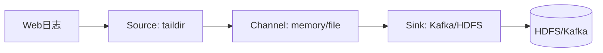
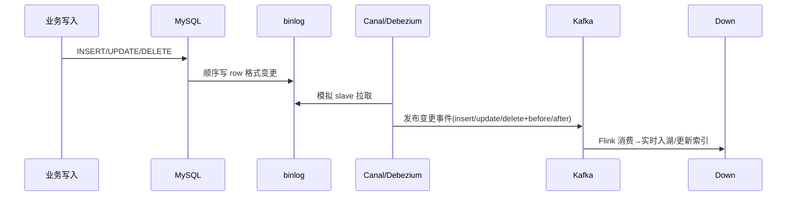

# 大数据 · 03 数据采集与同步

> 数据是"喂"进大数据平台的。采集与同步解决"把数据从各处搬到湖/仓"的问题，是整条链路的入口，决定了下游的时效与质量。

本文覆盖**日志采集（Flume）、数据库同步（Sqoop/DataX）、实时 CDC（Canal/Debezium）**，以及消息队列（Kafka）这一中枢。

## 一、采集场景分类

| 场景 | 数据源 | 方式 | 时效 |
|------|--------|------|------|
| 日志/埋点 | 服务器日志、App 埋点 | Agent 采集（Flume/Filebeat） | 近实时 |
| 关系库全量 | MySQL/Oracle | 批量抽取（Sqoop/DataX） | 离线 |
| 关系库增量 | binlog | CDC（Canal/Debezium） | 秒级 |
| 消息/流 | Kafka 主题 | Kafka Connect | 实时 |
| 对象/文件 | FTP/S3/HDFS | DataX/DistCp | 批量 |

## 二、日志采集：Flume

Flume 是 Cloudera 的分布式、可靠、可配置的日志收集系统，基于**Agent=Source+Channel+Sink** 模型。



- **Source**：数据入口（taildir 监听文件、Kafka Source、Avro）。
- **Channel**：缓冲（Memory 快但不持久；File 持久但慢）。
- **Sink**：出口（HDFS、Kafka、HBase）。
- **拦截器/选择器**：清洗、分流（按事件头路由到不同 Channel）。
- **可靠性**：Channel 用 File 时支持端到端确认，故障不丢。

> 现状：Flume 仍用，但云上多被 **Filebeat + Kafka** 或 **Fluent Bit** 取代，更轻量。

## 三、关系库批量同步：Sqoop 与 DataX

### 3.1 Sqoop（Hadoop↔RDB 桥梁）
- 把 RDB 数据导入 HDFS/Hive，或导出回 RDB；底层转成 MapReduce 并行。
- 命令示例：
```bash
sqoop import --connect jdbc:mysql://db/order \
  --username u --password p \
  --table orders --target-dir /user/hive/orders \
  --split-by id --m 4          # 4 个并行 map 按 id 分片
```
- 局限：依赖 Hadoop/MR，增量靠 `--incremental`，对实时不友好；社区已不活跃。

### 3.2 DataX（阿里开源，离线同步首选）
- 异构数据源离线同步框架，**插件式 Reader/Writer**，支持 MySQL/Oracle/HDFS/Hive/ES/ClickHouse 等几十种。
- 单进程多线程，不依赖 Hadoop；JSON 配置作业：
```json
{
  "job": {
    "content": [{
      "reader": { "name": "mysqlreader", "parameter": { "connection": [...] } },
      "writer": { "name": "hdfswriter", "parameter": { "path": "/ods/orders" } }
    }]
  }
}
```
- 优势：轻量、插件多、易扩展；配 DolphinScheduler 做定时同步。

## 四、实时 CDC：Canal / Debezium（核心）

CDC（Change Data Capture）捕获数据库变更，**基于 binlog**，实现秒级实时同步，是实时数仓/画像的命脉。

### 4.1 MySQL Binlog 原理


### 4.2 Canal（阿里，MySQL 专用）
- 伪装成 MySQL 从库，解析 binlog 推送到 Kafka/ RocketMQ。
- 输出事件含 `type`(INSERT/UPDATE/DELETE) 与 `before/after` 行，下游据此 upsert。
- 典型链路：`MySQL → Canal → Kafka → Flink → Iceberg/Paimon/HBase/ES`。

### 4.3 Debezium（RedHat，多源）
- 支持 MySQL/PostgreSQL/Oracle/MongoDB 等，基于 Kafka Connect 输出统一变更格式。
- 输出含 `op`(c/u/d) 与 `before/after`，可直接接 Flink/Spark。

> ⚠️ **注意**：
> 1. binlog 必须开 `ROW` 格式（非 STATEMENT），否则拿不到行级前后像。
> 2. CDC 是**至少一次**语义，下游需幂等（upsert by 主键）防重复。
> 3. 大事务/长事务会撑大 binlog，需监控位点延迟与 Canal 积压。

## 五、消息队列：Kafka（数据中枢）

Kafka 是大数据管道的**事实标准缓冲与解耦层**（深入见 [MQ](../MQ.md) 与 [08-流处理](../大数据/08-流处理计算：Flink.md)）。
- 角色：采集与计算之间的削峰、解耦、重放（按 offset 重放是 Kappa 架构基础）。
- 关键概念：Topic/Partition、Producer/Consumer、Consumer Group、Offset、副本。
- 选型对比：Kafka（高吞吐、生态全）vs Pulsar（存算分离、多租户）vs RocketMQ（事务/顺序，偏业务消息）。

## 六、DataX vs Sqoop vs Canal 速查

| 工具 | 类型 | 时效 | 数据源 | 依赖 |
|------|------|------|--------|------|
| Sqoop | 批量离线 | T+1 | RDB↔HDFS | Hadoop/MR |
| DataX | 批量离线 | 定时 | 异构几十种 | 无 |
| Canal | 实时 CDC | 秒级 | MySQL | MySQL binlog |
| Debezium | 实时 CDC | 秒级 | 多 RDB | Kafka Connect |

## 七、采集同步设计 Checklist

- [ ] 日志用 Agent（Filebeat/Fluent Bit）直发 Kafka，避免 Flume 重。
- [ ] 离线同步用 DataX + 调度（DolphinScheduler），按业务时间增量。
- [ ] 实时同步必须 CDC（Canal/Debezium），下游 upsert 幂等。
- [ ] 所有实时流先进 Kafka 削峰解耦，再进 Flink。
- [ ] 监控：采集延迟、binlog 位点滞后、同步失败率、数据量波动。
  - [ ] 源端压力保护：CDC 限流、批量读分页，避免拖垮业务库。

> 参考：Apache Flume/Sqoop/DataX 文档、Canal/Debezium 官方、Kafka 文档、MySQL binlog 原理。

## 八、Sqoop 实战与增量同步

```bash
# 全量导入为 Parquet
sqoop import --connect jdbc:mysql://db/order \
  --username u -P --table orders \
  --target-dir /ods/orders/dt=2026-07-29 \
  --split-by id --m 8 --as-parquetfile

# 增量（按自增 id）
sqoop import --incremental append --check-column id \
  --last-value 100000 --target-dir /ods/orders
```

- 局限：增量只能按单调列（id/时间戳），**无法捕获 update/delete** → 实时场景必须用 CDC。

## 九、DataX 全量 + 限速实战

```json
{
  "job": {
    "setting": { "speed": { "channel": 8, "byte": 10485760 } },
    "content": [{
      "reader": { "name": "mysqlreader",
        "parameter": { "connection": [{"jdbcUrl":["jdbc:mysql://db/order"],
          "table":["orders"],"splitPk":"id"}],
          "column":["id","user_id","amount","update_time"] } },
      "writer": { "name": "hdfswriter",
        "parameter": { "path":"/ods/orders","fileName":"orders",
          "fieldDelimiter":",","fileType":"text" } }
    }]
  }
}
```

- `speed.channel` 控制并发，`byte` 限流保护源库；增量用 `where` 拼 `update_time >= '${bizdate}'`。

## 十、CDC 全量 + 增量一体化（Debezium）

- 现代 CDC 用 **snapshot（全量快照）+ streaming（增量 binlog）** 无缝衔接：先扫全表打快照，再从快照位点续接 binlog，下游零丢失。
- Debezium 输出统一格式：`op=c/u/d` + `before/after`，Kafka Connect 自动管理 offset 与 schema。

## 十一、Schema 演进与兼容性

| 变更 | 兼容性 | 处理 |
|------|--------|------|
| 加列 | 向后兼容 | 下游用默认值 |
| 删列 | 需评估 | 保留期后下线 |
| 改类型 | 可能不兼容 | 双写过渡/新列替代 |
| 改名 | 不兼容 | 别名过渡 |

- 用 **Confluent Schema Registry / Apicurio** 做 Avro/Protobuf schema 版本管理与兼容性校验（BACKWARD/FORWARD/FULL）。

## 十二、Flink CDC 实战代码

```java
// Flink 1.17+ 捕获 MySQL 变更并写 Iceberg
MySqlSource<String> src = MySqlSource.<String>builder()
    .hostname("mysql-host").port(3306).databaseList("shop")
    .tableList("shop.orders")
    .username("flink").password("pw")
    .deserializationSchema(new JsonDebeziumDeserializationSchema())
    .startupOptions(StartupOptions.initial())   // 先全量快照再增量
    .build();

StreamExecutionEnvironment env = StreamExecutionEnvironment.getExecutionEnvironment();
env.enableCheckpointing(5000, CheckpointingMode.EXACTLY_ONCE);

env.fromSource(src, WatermarkStrategy.noWatermarks(), "MySQL CDC")
   .sinkTo(IcebergSink.forRowData(/* 表配置 */).build());

env.execute("mysql-to-iceberg");
```

- `StartupOptions.initial()` = 全量+增量一体化；精确一次靠 Checkpoint + Iceberg 幂等 upsert。
- 用 **Flink SQL** 更简洁：

```sql
CREATE TABLE orders_cdc WITH ('connector'='mysql-cdc',
  'hostname'='mysql-host','port'='3306','username'='flink',
  'password'='pw','database-name'='shop','table-name'='orders',
  'scan.startup.mode'='initial');
INSERT INTO iceberg_orders SELECT * FROM orders_cdc;
```

## 十三、同步链路生产 Checklist

- [ ] 全量用 DataX/Sqoop，增量用 CDC；CDC 覆盖 update/delete。
- [ ] 大表用 `splitPk`/`channel` 并发，限流保护源库。
- [ ] Schema 变更走 Registry 兼容校验，禁止破坏性改。
- [ ] 下游 upsert 幂等（按主键），容忍 CDC 至少一次。
- [ ] 断点续传：DataX 记录位点、CDC 用 Kafka offset。
- [ ] 监控：同步延迟、失败率、源库负载、目标一致性对账。
