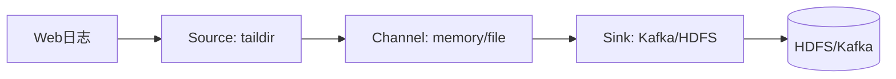
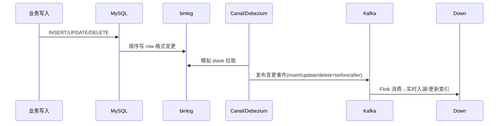
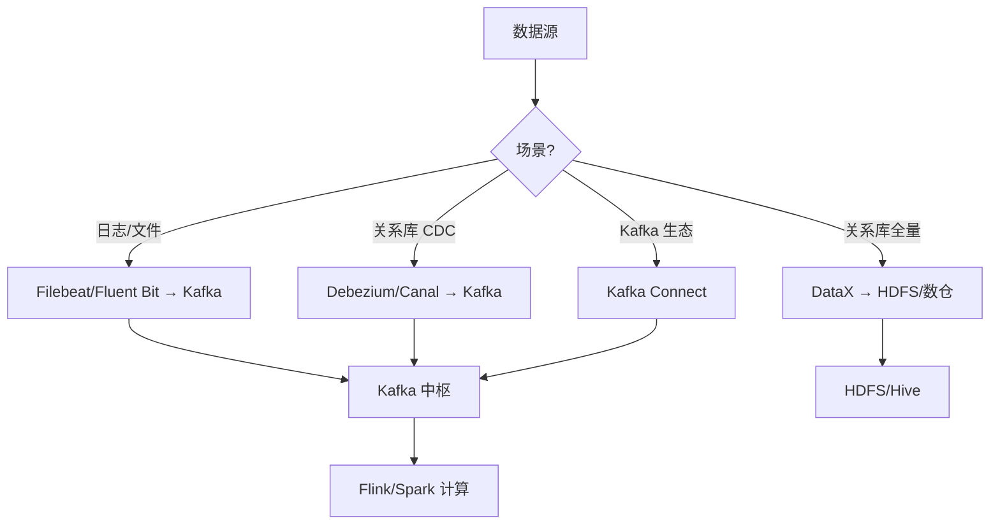

# 大数据 · 03 数据采集与同步（日志采集 / 批量同步 / CDC 原理 / Kafka 中枢 / Schema 演进 / 断点续传）

> 数据是"喂"进大数据平台的。采集与同步解决"把数据从各处搬到湖/仓"的问题，是整条链路的入口，决定了下游的时效与质量。本文覆盖**日志采集（Flume/Filebeat）、数据库同步（Sqoop/DataX）、实时 CDC（Canal/Debezium）**，以及消息队列（Kafka）这一中枢。

---

## 一、要解决的问题

| 痛点 | 说明 |
|------|------|
| 多源接入 | 日志/关系库/消息/文件多种数据源 |
| 时效分层 | 离线全量 + 实时增量需并存 |
| 数据丢失 | 采集过程必须可靠不丢 |
| 源库压力 | 采集不能拖垮业务库 |
| 下游幂等 | CDC 至少一次需下游去重 |

> 核心认知：**采集 = 「搬运」不丢失 + 「同步」保时效**——离线用批量抽取（DataX/Sqoop），实时用 CDC（binlog），统一经 Kafka 削峰解耦。

---

## 二、采集场景分类

| 场景 | 数据源 | 方式 | 时效 |
|------|--------|------|------|
| 日志/埋点 | 服务器日志、App 埋点 | Agent 采集（Flume/Filebeat） | 近实时 |
| 关系库全量 | MySQL/Oracle | 批量抽取（Sqoop/DataX） | 离线 |
| 关系库增量 | binlog | CDC（Canal/Debezium） | 秒级 |
| 消息/流 | Kafka 主题 | Kafka Connect | 实时 |
| 对象/文件 | FTP/S3/HDFS | DataX/DistCp | 批量 |

### 2.1 采集决策

```
日志 → Agent（Filebeat/Fluent Bit）直发 Kafka（轻量优先）
关系库全量 → DataX（插件多、轻量）
关系库增量 → CDC（Canal/Debezium）
消息 → Kafka Connect（现成连接器）
文件 → DataX/DistCp
```

---

## 三、日志采集：Flume 与新一代

### 3.1 Flume（经典）

```
Flume 基于 Agent = Source + Channel + Sink 模型：

  Source：数据入口（taildir 监听文件、Kafka Source、Avro）
  Channel：缓冲（Memory 快但不持久；File 持久但慢）
  Sink：出口（HDFS、Kafka、HBase）
  拦截器/选择器：清洗、分流（按事件头路由到不同 Channel）
  可靠性：Channel 用 File 时支持端到端确认，故障不丢
```



### 3.2 新一代替代

```
现状：Flume 仍用，但云上多被 Filebeat + Kafka 或 Fluent Bit 取代（更轻量）

Filebeat：轻量 Go Agent，tail 文件 → Kafka/ES
Fluent Bit：嵌入式 C 采集器，插件丰富、资源占用极小
对比：
  Flume：功能全但重（JVM）
  Filebeat：轻量但功能简单
  Fluent Bit：轻量 + 插件多
```

---

## 四、关系库批量同步：Sqoop 与 DataX

### 4.1 Sqoop（Hadoop↔RDB 桥梁）

```
把 RDB 数据导入 HDFS/Hive，或导出回 RDB；底层转成 MapReduce 并行。
```

```bash
sqoop import --connect jdbc:mysql://db/order \
  --username u --password p \
  --table orders --target-dir /user/hive/orders \
  --split-by id --m 4          # 4 个并行 map 按 id 分片
```

```
局限：
  依赖 Hadoop/MR（重）
  增量靠 --incremental（只能按单调列，捕获不了 update/delete）
  社区已不活跃
```

### 4.2 DataX（阿里开源，离线同步首选）

```
异构数据源离线同步框架，插件式 Reader/Writer
支持 MySQL/Oracle/HDFS/Hive/ES/ClickHouse 等几十种
单进程多线程，不依赖 Hadoop；JSON 配置作业
优势：轻量、插件多、易扩展；配 DolphinScheduler 做定时同步
```

```json
{
  "job": {
    "setting": { "speed": { "channel": 8, "byte": 10485760 } },
    "content": [{
      "reader": { "name": "mysqlreader",
        "parameter": { "connection": [{"jdbcUrl":["jdbc:mysql://db/order"],
          "table":["orders"],"splitPk":"id"}],
          "column":["id","user_id","amount","update_time"] } },
      "writer": { "name": "hdfswriter",
        "parameter": { "path":"/ods/orders","fileName":"orders",
          "fieldDelimiter":",","fileType":"text" } }
    }]
  }
}
```

```
DataX 关键：
  speed.channel 控制并发
  speed.byte 限流保护源库
  增量：where 拼 update_time >= '${bizdate}'
```

---

## 五、实时 CDC：Canal / Debezium（核心）

### 5.1 MySQL Binlog 原理

```
Binlog = MySQL 的变更日志（ROW 格式记录每行 before/after）

CDC 原理：
  工具伪装成 MySQL 从库（slave）→ 拉取 binlog → 解析成事件 → 推送 Kafka
```



### 5.2 Canal（阿里，MySQL 专用）

```
伪装成 MySQL 从库，解析 binlog 推送到 Kafka/RocketMQ
输出事件含 type(INSERT/UPDATE/DELETE) 与 before/after 行
典型链路：MySQL → Canal → Kafka → Flink → Iceberg/Paimon/HBase/ES
```

### 5.3 Debezium（RedHat，多源）

```
支持 MySQL/PostgreSQL/Oracle/MongoDB 等
基于 Kafka Connect 输出统一变更格式（op=c/u/d + before/after）
snapshot（全量快照）+ streaming（增量 binlog）无缝衔接
可直接接 Flink/Spark
```

### 5.4 CDC 注意事项

```
⚠️ 1. binlog 必须开 ROW 格式（非 STATEMENT），否则拿不到行级前后像。
⚠️ 2. CDC 是至少一次语义，下游需幂等（upsert by 主键）防重复。
⚠️ 3. 大事务/长事务会撑大 binlog，需监控位点延迟与 Canal 积压。
⚠️ 4. 源库压力：CDC 限流、批量读分页，避免拖垮业务库。
```

---

## 六、消息队列：Kafka（数据中枢）

```
Kafka 是大数据管道的事实标准缓冲与解耦层
  角色：采集与计算之间的削峰、解耦、重放（按 offset 重放是 Kappa 架构基础）
  关键概念：Topic/Partition、Producer/Consumer、Consumer Group、Offset、副本

选型对比：
  Kafka：高吞吐、生态全（默认）
  Pulsar：存算分离、多租户
  RocketMQ：事务/顺序，偏业务消息
```

---

## 七、全量 + 增量一体化（Debezium / Flink CDC）

```
现代 CDC 用 snapshot（全量快照）+ streaming（增量 binlog）无缝衔接：
  先扫全表打快照 → 再从快照位点续接 binlog → 下游零丢失
  Debezium 输出统一格式：op=c/u/d + before/after
  Kafka Connect 自动管理 offset 与 schema
```

### 7.1 Flink CDC 实战

```java
// Flink 1.17+ 捕获 MySQL 变更并写 Iceberg
MySqlSource<String> src = MySqlSource.<String>builder()
    .hostname("mysql-host").port(3306).databaseList("shop")
    .tableList("shop.orders")
    .username("flink").password("pw")
    .deserializationSchema(new JsonDebeziumDeserializationSchema())
    .startupOptions(StartupOptions.initial())   // 先全量快照再增量
    .build();

StreamExecutionEnvironment env = StreamExecutionEnvironment.getExecutionEnvironment();
env.enableCheckpointing(5000, CheckpointingMode.EXACTLY_ONCE);

env.fromSource(src, WatermarkStrategy.noWatermarks(), "MySQL CDC")
   .sinkTo(IcebergSink.forRowData(/* 表配置 */).build());

env.execute("mysql-to-iceberg");
```

```sql
-- Flink SQL 更简洁
CREATE TABLE orders_cdc WITH ('connector'='mysql-cdc',
  'hostname'='mysql-host','port'='3306','username'='flink',
  'password'='pw','database-name'='shop','table-name'='orders',
  'scan.startup.mode'='initial');
INSERT INTO iceberg_orders SELECT * FROM orders_cdc;
```

```
StartupOptions.initial() = 全量+增量一体化
精确一次靠 Checkpoint + Iceberg 幂等 upsert
```

---

## 八、Schema 演进与兼容性

| 变更 | 兼容性 | 处理 |
|------|--------|------|
| 加列 | 向后兼容 | 下游用默认值 |
| 删列 | 需评估 | 保留期后下线 |
| 改类型 | 可能不兼容 | 双写过渡/新列替代 |
| 改名 | 不兼容 | 别名过渡 |

```
用 Confluent Schema Registry / Apicurio 做 Avro/Protobuf schema 版本管理与兼容性校验（BACKWARD/FORWARD/FULL）
```

---

## 九、DataX vs Sqoop vs Canal 速查

| 工具 | 类型 | 时效 | 数据源 | 依赖 |
|------|------|------|--------|------|
| Sqoop | 批量离线 | T+1 | RDB↔HDFS | Hadoop/MR |
| DataX | 批量离线 | 定时 | 异构几十种 | 无 |
| Canal | 实时 CDC | 秒级 | MySQL | MySQL binlog |
| Debezium | 实时 CDC | 秒级 | 多 RDB | Kafka Connect |

```
选型决策树：
  离线全量 → DataX（无依赖）> Sqoop（Hadoop 生态）
  MySQL 实时 → Canal（轻量）> Debezium（多源）
  多源实时 → Debezium（PostgreSQL/Oracle/MongoDB）
  日志 → Filebeat/Fluent Bit
```

---

## 十、采集同步设计 Checklist

- [ ] 日志用 Agent（Filebeat/Fluent Bit）直发 Kafka，避免 Flume 重。
- [ ] 离线同步用 DataX + 调度（DolphinScheduler），按业务时间增量。
- [ ] 实时同步必须 CDC（Canal/Debezium），下游 upsert 幂等。
- [ ] 所有实时流先进 Kafka 削峰解耦，再进 Flink。
- [ ] 大表用 splitPk/channel 并发，限流保护源库。
- [ ] Schema 变更走 Registry 兼容校验，禁止破坏性改。
- [ ] 断点续传：DataX 记录位点、CDC 用 Kafka offset。
- [ ] 监控：同步延迟、binlog 位点滞后、同步失败率、数据量波动。

---

## 十一、Flume vs Kafka Connect vs DataX 深度对比

| 维度 | Flume | Kafka Connect | DataX |
|------|-------|---------------|-------|
| 架构 | Agent = Source+Channel+Sink | Worker+Task 分布式 | 单进程多线程 |
| 数据源 | 日志/文件/HDFS | Kafka 生态（数百连接器） | 异构几十种 |
| 依赖 | JVM 重 | Kafka 集群 | 无依赖（独立进程） |
| 吞吐 | 中 | 高（分布式） | 中（单进程） |
| 可靠性 | Channel 确认 | Kafka offset | 位点记录 |
| 适用 | 日志采集（存量） | Kafka 生态连接 | 离线批量同步 |
| 维护状态 | 维护模式 | 活跃 | 活跃 |



## 十二、批式 vs 流式数据摄入对比

| 维度 | 批式（DataX/Sqoop） | 流式（CDC/Debezium） |
|------|----------------------|----------------------|
| 时效 | T+1 / 小时级 | 秒级~分钟级 |
| 源库压力 | 高（全表扫描） | 低（读 binlog） |
| 数据完整性 | 全量（可对账） | 增量（可能丢） |
| 实现复杂度 | 低 | 中高 |
| 适用 | 离线报表/历史分析 | 实时数仓/实时大屏 |

> **口诀**：批式保证完整但慢，流式快但需对账；生产中两者并存——批式补存量，流式保增量。

## 十三、Schema Registry 在数据采集中的作用

```
Schema Registry 的价值：
  ① 生产者写入前校验 Schema 兼容性（防止破坏性变更）
  ② 消费者读取时自动反序列化（无需手动解析）
  ③ 版本管理（向前/向后兼容）
  ④ 数据质量第一道门禁（类型错误拦截）
```

```bash
# Confluent Schema Registry 示例
# 注册 Schema
curl -X POST -H "Content-Type: application/vnd.schemaregistry.v1+json" \
  --data '{"schema": "{\"type\":\"record\",\"name\":\"Order\",\"fields\":[{\"name\":\"id\",\"type\":\"long\"},{\"name\":\"amount\",\"type\":\"double\"}]}"}' \
  http://schema-registry:8081/subjects/orders-value/versions

# 兼容性检查
curl -X POST -H "Content-Type: application/vnd.schemaregistry.v1+json" \
  --data '{"schema": "..."}' \
  http://schema-registry:8081/subjects/orders-value/compatibility
```

## 十四、Exactly-Once 数据摄入

### 14.1 语义保证对比

| 语义 | 说明 | 实现 |
|------|------|------|
| At-Most-Once | 可能丢数据 | 不确认 offset |
| At-Least-Once | 可能重复 | 确认 offset 但可能失败重发 |
| Exactly-Once | 不丢不重 | 事务 + 幂等 |

### 14.2 Exactly-Once 实现方式

```
方式一：Kafka Transactions + 幂等 Producer
  Producer 启用幂等：enable.idempotence=true
  事务写入：producer.initTransactions() → begin → send → commit

方式二：Flink Checkpoint + Kafka Source
  Source 记录 offset 到 Flink 状态
  Sink 用 Kafka 事务写入
  恢复时从 checkpoint 重放，幂等消费

方式三：Iceberg/Paimon 幂等写入
  主键表 upsert，重复写入自动去重
  Flink Checkpoint 保证 exactly-once 处理
```

## 十五、数据摄入质量保障

### 15.1 质量校验点

| 校验点 | 说明 | 对策 |
|--------|------|------|
| 数据量波动 | 突然增多或减少 | 监控日增量，超阈值告警 |
| Schema 变更 | 下游不兼容 | Schema Registry 兼容检查 |
| 数据延迟 | CDC 位点滞后 | 监控 binlog lag |
| 数据丢失 | 采集过程丢数据 | 全量对账 + 增量 offset 监控 |
| 数据重复 | 重复写入 | 下游幂等 upsert |

### 15.2 监控指标

| 指标 | 告警阈值 | 说明 |
|------|----------|------|
| binlog lag | > 5min | CDC 延迟 |
| 同步失败率 | > 0.1% | 同步任务失败 |
| 日数据量波动 | > 30% | 数据量异常 |
| Schema 不兼容 | > 0 | 破坏性 Schema 变更 |
| 数据延迟 | > 1h | 批量同步超时 |

## 十六、数据摄入成本优化

| 策略 | 做法 | 省多少 |
|------|------|--------|
| 压缩传输 | gzip/snappy 压缩 | 50~70% |
| 限流保护 | DataX speed.byte 限流 | 避免源库被打挂 |
| 批量合并 | 小批量合并为大批量 | 减少网络往返 |
| 增量替代全量 | CDC 增量替代每日全量 | 90%+ |
| 复用连接 | 连接池复用 DB 连接 | 减少连接开销 |

```json
// DataX 限流配置
{
  "job": {
    "setting": {
      "speed": {
        "channel": 4,
        "byte": 5242880,
        "record": 10000
      }
    }
  }
}
```

## 十七、断点续传深入

### 17.1 各工具断点续传机制

| 工具 | 机制 | 说明 |
|------|------|------|
| DataX | 位点记录（taskGroupId） | 任务失败后从位点恢复 |
| Debezium | Kafka Connect offset | 自动管理 offset |
| Canal | binlog 位点（position） | 手动/自动记录位点 |
| Filebeat | registry 文件 | 记录已发送文件偏移 |
| Flume | Channel 持久化 | File Channel 保证不丢 |

### 17.2 断点续传最佳实践

```
① 位点存储：binlog 位点/Kafka offset 存外部（Redis/文件），不只存内存
② 定期持久化：每 N 批记录一次位点
③ 故障恢复：重启后从最后持久化位点恢复
④ 幂等消费：即使位点回退，重复数据不影响结果
```

## 十八、采集同步设计 Checklist

- [ ] 日志用 Agent（Filebeat/Fluent Bit）直发 Kafka，避免 Flume 重。
- [ ] 离线同步用 DataX + 调度（DolphinScheduler），按业务时间增量。
- [ ] 实时同步必须 CDC（Canal/Debezium），下游 upsert 幂等。
- [ ] 所有实时流先进 Kafka 削峰解耦，再进 Flink。
- [ ] 大表用 splitPk/channel 并发，限流保护源库。
- [ ] Schema 变更走 Registry 兼容校验，禁止破坏性改。
- [ ] 断点续传：DataX 记录位点、CDC 用 Kafka offset。
- [ ] 监控：同步延迟、binlog 位点滞后、同步失败率、数据量波动。

## 十九、与其他板块的关系

- Kafka 深入见「[中间件/Kafka](../中间件/Kafka.md)」；
- Flink 消费见「[08-流处理计算：Flink](08-流处理计算：Flink.md)」；
- CDC 工具见「[中间件/数据同步CDC-Canal](../中间件/数据同步CDC-Canal.md)」；
- Schema 见「[中间件/SchemaRegistry与消息序列化](../中间件/SchemaRegistry与消息序列化.md)」；
- 实时链路见「[11-实时数仓与湖仓一体](11-实时数仓与湖仓一体.md)」。

> 一句话：**采集 = 日志 Agent（Filebeat/Fluent Bit）+ 批量同步（DataX/Sqoop）+ 实时 CDC（Canal/Debezium）+ Kafka 中枢——生产四守则：CDC 必须 ROW 格式、下游 upsert 幂等（至少一次语义）、源库限流保护、断点续传（offset/位点）+ 全量增量无缝衔接**。