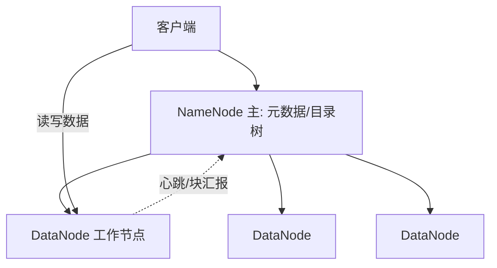
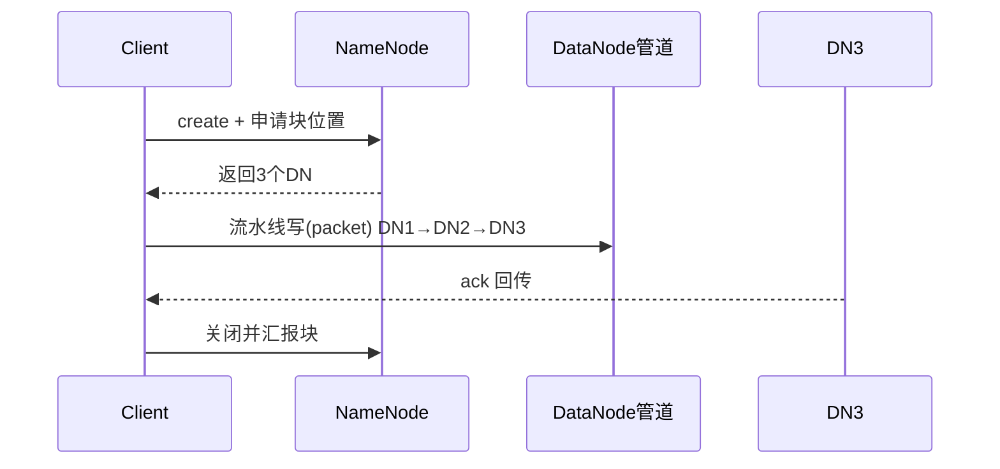
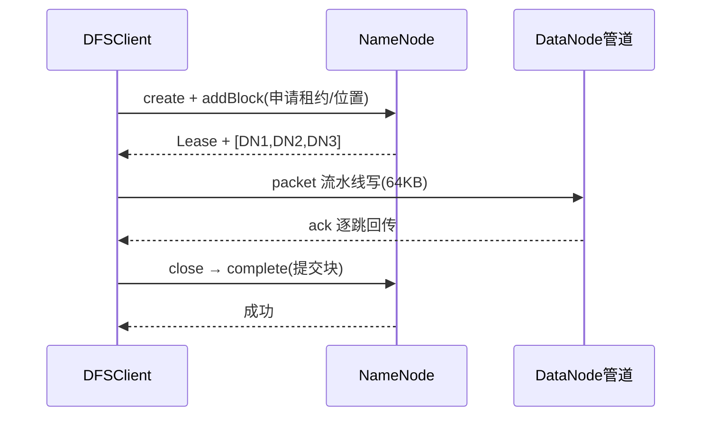

# 大数据 · 04 分布式存储与 HDFS

> 存储是大数据底座。HDFS 用"分块 + 多副本"把海量文件摊到廉价机器集群上；对象存储（S3/OSS）则把存算彻底解耦，成为湖仓一体的地基。

本篇讲 HDFS 架构与原理，以及对象存储、Kudu 等演进方向。文件/表格式见 [05-列式存储与数据湖格式](05-列式存储与数据湖格式.md)。

## 一、HDFS 架构

HDFS（Hadoop Distributed File System）是 Google GFS 的开源实现，**一次写入、多次读取**，为批处理优化。

| 角色 | 职责 | 高可用 |
|------|------|--------|
| NameNode（NN） | 管理命名空间、文件→块映射、块位置 | 主备（ZKFC + JournalNode/QJM） |
| DataNode（DN） | 实际存储数据块（默认 128MB/块） | 多副本，故障自动剔除 |
| Secondary NN | 合并 fsimage 与 edits（旧版） | 非热备，仅 checkpoint |
| Client | 与 NN 拿元数据、与 DN 直连读写 | — |

## 二、核心机制

### 2.1 分块（Block）
- 文件按固定大小切块（Hadoop 2.x 起默认 **128MB**，早期 64MB），每块独立存储。
- 大块减少元数据量、提升顺序读吞吐；太小则 NN 元数据爆炸。

### 2.2 多副本（Replication）
- 默认 3 副本，放置策略：同机架 1 份、同 IDC 另一机架 2 份（机架感知）。
- **作用**：容错（丢节点不丢数据）+ 就近读（本地性 locality）。

### 2.3 写入流程

- 客户端以**管道（pipeline）**方式顺序写入多副本，acked 后再向 NN 汇报。

### 2.4 读取流程
- Client 向 NN 取块位置，优先选**最近副本**直连 DN 流式读，失败换副本。

### 2.5 容错
- DN 心跳/块汇报超时 → NN 标记死亡，触发副本复制补足 3 份。
- NN 单点风险：用 **QJM（Quorum Journal Manager）+ ZKFC** 做 Active/Standby 热备。

> ⚠️ **HDFS 局限**：
> 1. 不适合**小文件**（每个文件占 NN 内存一条元数据，百万小文件拖垮 NN）→ 用 HAR/CombineFileInputFormat/HBase 缓解。
> 2. 不支持随机写/改文件（只能 append），高并发写的实时性弱 → 实时场景转向 Kafka/对象存储+表格式。
> 3. 存算耦合，扩容需加 DataNode。

## 三、对象存储：湖仓一体的地基

| 特性 | HDFS | 对象存储（S3/OSS/COS） |
|------|------|------------------------|
| 接口 | HDFS API | REST（HTTP PUT/GET） |
| 存算 | 耦合 | **分离**，计算弹性 |
| 成本 | 自管机器 | 按量付费、极低 |
| 生态 | Hadoop 系 | 全云原生、Iceberg/Paimon 原生支持 |
| 适合 | 传统 Hadoop 集群 | 湖仓一体、云原生 |

- 2025 主流：**对象存储 + 开放表格式** 取代"HDFS 上裸 Parquet"，实现存算分离与多云互通。
- 性能补丁：本地/集群缓存（Alluxio、SSD cache）、向量化读，抵消网络 IO 损耗。

## 四、Kudu：实时分析型存储

- Cloudera Kudu 弥补 HDFS（慢更新）与 HBase（弱分析）之间空白。
- **列式存储 + 快速 upsert + 低延迟随机读**，适合"既要点查又要分析"的场景（如实时明细）。
- 与 Impala/Spark 配合，做实时数仓明细层。

## 五、存储选型速查

| 需求 | 选 |
|------|----|
| 海量离线批处理、廉价 | HDFS / 对象存储 |
| 湖仓一体、ACID、多引擎 | 对象存储 + Iceberg/Paimon |
| 低延迟随机读写/宽表 | HBase |
| 实时 upsert + 分析 | Kudu / Paimon |
| 高吞吐消息缓冲 | Kafka |

## 六、存储设计 Checklist

- [ ] 块大小按文件特征调（大文件 256MB，小文件合并）。
- [ ] 副本数权衡成本与可靠（跨机架至少 2 副本分布）。
- [ ] NN 用 QJM 高可用，避免单点。
- [ ] 小文件治理：合并、HAR、或用 HBase/对象存储。
- [ ] 新平台优先对象存储 + 表格式，保留 HDFS 兼容旧作业。
  - [ ] 监控：容量、副本缺失、NN 延迟、DN 心跳。

> 参考：Apache Hadoop HDFS 架构文档、Google GFS 论文、对象存储（S3/OSS）文档、Apache Kudu 文档。

## 七、HDFS 写入流程（源码级）

1. `DFSClient.create()` 向 NameNode 申请租约（Lease）与块位置，NN 按**机架感知**返回 3 个 DataNode。
2. 客户端把数据切为 64KB packet，经 **DataStreamer** 以管道写 DN1→DN2→DN3，每跳确认（ack queue）。
3. 块写满或关闭时，`Complete` 上报 NN，NN 提交块、释放租约。
4. 容错：`ResponseProcessor` 收到异常则从 ack queue 重发；DN 故障则换管、NN 后续补副本。

## 八、副本放置策略（机架感知）

- 默认 3 副本：**第 1 份本地节点**，第 2 份同机架另一节点，第 3 份**跨机架**节点。
- 目的：本地读快（前两份常能本地/近地）+ 跨机架容灾（丢一机架不丢数据）。
- 配置 `net.topology.script.file.name` 定义机架映射；云上常用可用区（AZ）替代机架。

## 九、NameNode 元数据与高可用

- **元数据**：`fsimage`（命名空间快照）+ `editlog`（增量操作），Secondary/Standby NN 定期合并。
- **HA**：Active/Standby 两 NN，通过 **QJM（JournalNode 多数派）** 共享 editlog；**ZKFC** 监听健康、抢锁做故障转移。
- 联邦（Federation）：多 NameService 横向扩展元数据，缓解单 NN 内存上限。

## 十、小文件治理

| 手段 | 做法 |
|------|------|
| 合并写 | Hive `INSERT OVERWRITE` 合并、Spark `coalesce` |
| HAR 归档 | `hadoop archive` 把小文件打包为 har |
| CombineInputFormat | 合并输入分片，减少 map 数 |
| 对象存储+表格式 | 用 Iceberg 大文件 + compaction |
| 避源头 | 控制分区粒度，避免按分钟分区 |

- 经验法则：单文件 ≥ 128MB（与块对齐），分区不宜过细（日优于小时）。

## 十一、纠删码（Erasure Coding）

- 副本 3 份存储放大 3×；**EC（如 RS-6-3）** 用校验块替代副本，存储开销降到 ~1.5×，适合冷数据。
- 代价：重建需网络读多块，计算开销高；默认对冷数据目录开启 `xor`/`rs` 策略。
- 与对象存储的 EC 同理（S3 默认 EC），是降本关键。

## 十二、HDFS vs 对象存储（工程对比）

| 维度 | HDFS | 对象存储 |
|------|------|---------|
| 一致性 | 强（NN 中心） | 最终/强（取决于实现） |
| 小文件 | 极差 | 好（无 NN 元数据瓶颈） |
| 存算 | 耦合 | 分离 |
| 运维 | 重 | 托管免运维 |
| 生态 | Hadoop 原生 | Iceberg/Paimon 原生 |

- 结论：新平台用对象存储 + 表格式；HDFS 保留跑存量 MR/Hive 作业。
