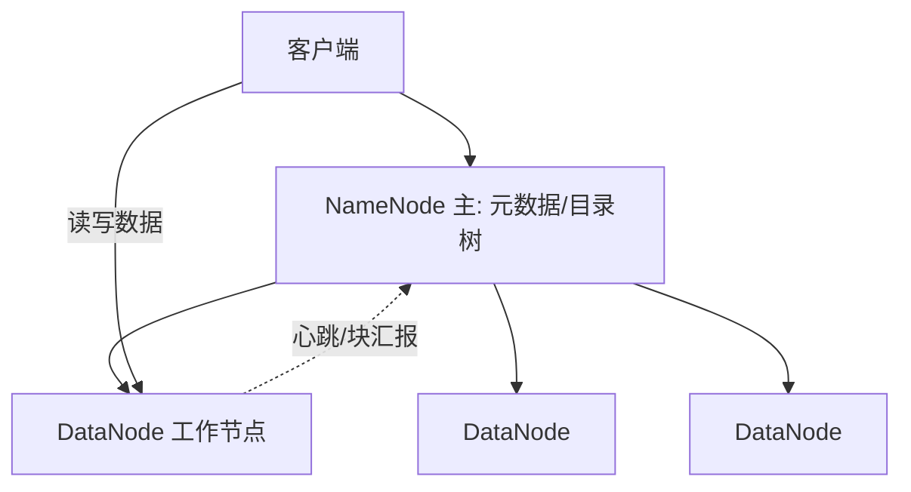
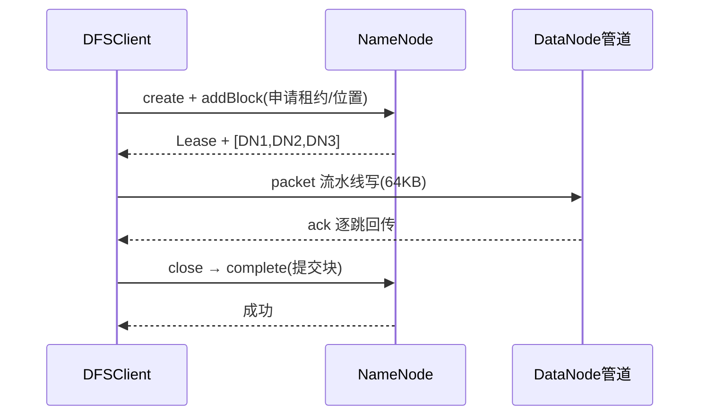
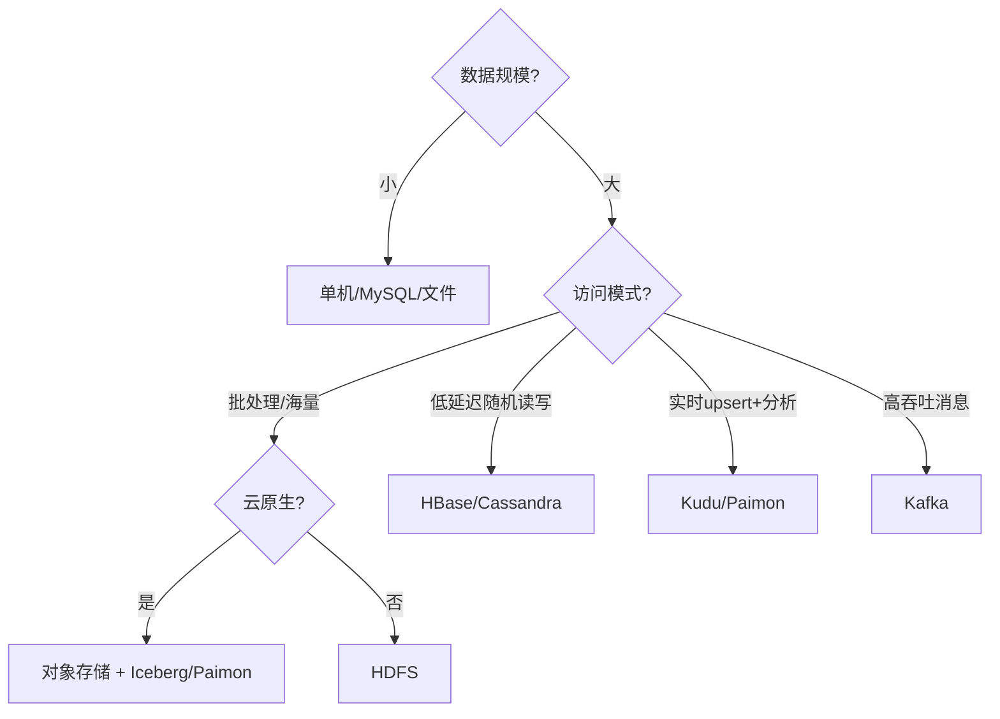

# 大数据 · 04 分布式存储与 HDFS（架构原理 / 数据管理机制 / 对象存储演进 / 选型决策）

> 存储是大数据底座。HDFS 用"分块 + 多副本"把海量文件摊到廉价机器集群上；对象存储（S3/OSS）则把存算彻底解耦，成为湖仓一体的地基。本篇深入拆解 HDFS 架构、核心机制、容错、元数据管理、对象存储演进与存储选型决策。

---

## 一、要解决的问题

| 痛点 | 说明 |
|------|------|
| 单机容量有限 | PB 级数据单机磁盘放不下 |
| 数据可靠性 | 磁盘/节点故障需自动恢复 |
| 存算一体成本高 | 计算和存储绑定，扩容浪费 |
| 海量小文件 | 元数据膨胀拖垮集群 |
| 随机写难 | 传统文件系统不适合流式分析 |

> 核心认知：**HDFS = 「分块 + 多副本 + 中心元数据」的分布式文件系统**，面向"一次写入、多次读取"的批处理；对象存储进一步**存算分离**，成为现代湖仓一体底座。

---

## 二、HDFS 架构

### 2.1 角色与职责



| 角色 | 职责 | 高可用 |
|------|------|--------|
| NameNode（NN） | 管理命名空间、文件→块映射、块位置 | 主备（ZKFC + JournalNode/QJM） |
| DataNode（DN） | 实际存储数据块（默认 128MB/块） | 多副本，故障自动剔除 |
| Secondary NN | 合并 fsimage 与 edits（旧版） | 非热备，仅 checkpoint |
| Client | 与 NN 拿元数据、与 DN 直连读写 | — |

### 2.2 分块（Block）

- 文件按固定大小切块（Hadoop 2.x 起默认 **128MB**，早期 64MB），每块独立存储。
- **大块好处**：减少元数据量（NN 内存）、提升顺序读吞吐；太大则并行度不足、文件尾部浪费。
- **块与文件关系**：文件 = 块列表（元数据）+ 块数据（DataNode）。

### 2.3 副本放置策略（机架感知）

```
默认 3 副本放置：
  第 1 份：本地节点
  第 2 份：同机架另一节点
  第 3 份：跨机架节点

目的：
  本地读快（前两份常能本地/近地）
  跨机架容灾（丢一机架不丢数据）

配置：net.topology.script.file.name 定义机架映射
云上：可用区（AZ）替代机架
```

---

## 三、核心机制（深入）

### 3.1 写入流程（源码级）



```
1. DFSClient.create() 向 NN 申请租约（Lease）与块位置，NN 按机架感知返回 3 个 DN。
2. 客户端把数据切为 64KB packet，经 DataStreamer 以管道写 DN1→DN2→DN3，每跳确认（ack queue）。
3. 块写满或关闭时，Complete 上报 NN，NN 提交块、释放租约。
4. 容错：ResponseProcessor 收到异常则从 ack queue 重发；DN 故障换管，NN 后续补副本。
```

### 3.2 读取流程

- Client 向 NN 取块位置，优先选**最近副本**直连 DN 流式读，失败换副本。

### 3.3 容错

```
DataNode 容错：
  DN 心跳/块汇报超时（默认 10 分钟未心跳）→ NN 标记死亡
  → 触发副本复制补足 3 份（后台，限速）

NameNode 高可用：
  Active/Standby 两 NN
  QJM（Quorum Journal Manager）共享 editlog（多数派写入）
  ZKFC 监听健康、抢锁做故障转移
  联邦（Federation）：多 NameService 横向扩展元数据
```

---

## 四、NameNode 元数据（深入）

### 4.1 元数据构成

```
fsimage：命名空间快照（文件/目录/权限/块映射）
editlog：增量操作日志（append 每条变更）

加载流程：
  启动：加载 fsimage → 重放 editlog → 服务
  合并：Standby/Secondary NN 定期 checkpoint（合并 fsimage+editlog）

内存估算：
  每个文件约占用 NN 150~250 字节内存
  10 亿文件 ≈ 150~250GB 堆内存 → 小文件是 NN 杀手
```

### 4.2 联邦（Federation）

```
多 NameService（NS）：
  每个 NS 管理一部分目录（/data/a、/data/b）
  共享底层 DataNode 存储池

解决：单 NN 内存/吞吐瓶颈
适用：超大集群（万级节点）元数据横向扩展
```

### 4.3 快照（Snapshot）

```
功能：文件系统只读快照（灾难恢复/误删回滚）
用法：hdfs dfsadmin -allowSnapshot /data
      hdfs dfs -createSnapshot /data snap1
原理：基于 inode 复制（diff 记录），不复制数据块
```

---

## 五、小文件治理

| 手段 | 做法 |
|------|------|
| 合并写 | Hive `INSERT OVERWRITE` 合并、Spark `coalesce` |
| HAR 归档 | `hadoop archive` 把小文件打包为 har |
| CombineInputFormat | 合并输入分片，减少 map 数 |
| 对象存储+表格式 | 用 Iceberg 大文件 + compaction |
| 避源头 | 控制分区粒度，避免按分钟分区 |

```
经验法则：
  单文件 ≥ 128MB（与块对齐）
  分区不宜过细（日优于小时）
  目标：每文件 ≥ 块大小，减少 NN 元数据
```

---

## 六、纠删码（Erasure Coding）

```
副本 3 份存储放大 3×；EC（如 RS-6-3）用校验块替代副本：
  6 数据块 + 3 校验块 = 9 块，冗余 1.5×
  任意 3 块丢失可恢复

代价：重建需网络读多块、计算开销高
适用：冷数据目录（xor/rs 策略）

配置示例：
  hdfs ec -enablePolicy -policy RS-6-3-1024k /cold_data
  hdfs ec -setPolicy -path /cold_data -policy RS-6-3-1024k

说明：EC 对追加写友好，随机写差 → 适合归档/日志/冷数据
```

---

## 七、HDFS vs 对象存储（工程对比）

| 维度 | HDFS | 对象存储（S3/OSS） |
|------|------|-------------------|
| 接口 | HDFS API | REST（HTTP PUT/GET） |
| 一致性 | 强（NN 中心） | 最终/强（取决于实现） |
| 小文件 | 极差（NN 元数据） | 好（无 NN 瓶颈） |
| 存算 | 耦合 | **分离**，计算弹性 |
| 成本 | 自管机器 | 按量付费、极低 |
| 生态 | Hadoop 系 | 全云原生、Iceberg/Paimon 原生 |
| 运维 | 重（NN/DN 管理） | 托管免运维 |
| 适合 | 传统 Hadoop 集群 | 湖仓一体、云原生 |

### 7.1 对象存储性能补丁

```
问题：网络 IO 延迟高于本地磁盘
解决：
  本地/集群缓存（Alluxio、SSD cache）
  向量化读、Parquet/ORC 列式下推
  大文件顺序读（避免小对象）

2025 主流：
  对象存储 + 开放表格式 取代"HDFS 上裸 Parquet"
  实现存算分离与多云互通
```

---

## 八、Kudu：实时分析型存储

```
定位：Cloudera Kudu 弥补 HDFS（慢更新）与 HBase（弱分析）之间空白
特性：列式存储 + 快速 upsert + 低延迟随机读
适用：既要点查又要分析（实时明细层）

架构：
  Tablet（类似 HBase Region，Raft 复制）
  列式 + 主键唯一 + 快速更新

与 Impala/Spark 配合：做实时数仓明细层
```

---

## 九、存储选型决策树



| 需求 | 选 |
|------|----|
| 海量离线批处理、廉价 | HDFS / 对象存储 |
| 湖仓一体、ACID、多引擎 | 对象存储 + Iceberg/Paimon |
| 低延迟随机读写/宽表 | HBase |
| 实时 upsert + 分析 | Kudu / Paimon |
| 高吞吐消息缓冲 | Kafka |

---

## 十、存储设计 Checklist

- [ ] 块大小按文件特征调（大文件 256MB，小文件合并）。
- [ ] 副本数权衡成本与可靠（跨机架至少 2 副本分布）。
- [ ] NN 用 QJM 高可用，避免单点。
- [ ] 小文件治理：合并、HAR、或用 HBase/对象存储。
- [ ] 冷数据用 EC 降本，热数据用副本保性能。
- [ ] 新平台优先对象存储 + 表格式，保留 HDFS 兼容旧作业。
- [ ] 监控：容量、副本缺失、NN 延迟、DN 心跳。

---

## 十一、与其他板块的关系

- 文件/表格式见「[05-列式存储与数据湖格式](05-列式存储与数据湖格式.md)」；
- HBase（HDFS 之上）见「[06-分布式NoSQL与HBase](06-分布式NoSQL与HBase.md)」；
- 存算分离调度见「[10-资源调度：YARN与Kubernetes](10-资源调度：YARN与Kubernetes.md)」；
- 存储中间件对比见「[中间件/Ceph](../中间件/Ceph.md)」「[中间件/对象存储MinIO-OSS](../中间件/对象存储MinIO-OSS.md)」。

> 一句话：**HDFS = 分块（128MB）+ 多副本（机架感知）+ 中心元数据（NN+QJM HA）——理解"小文件是杀手、随机写是弱项、EC 是冷数据降本神器"；新平台转对象存储 + 开放表格式实现存算分离**。