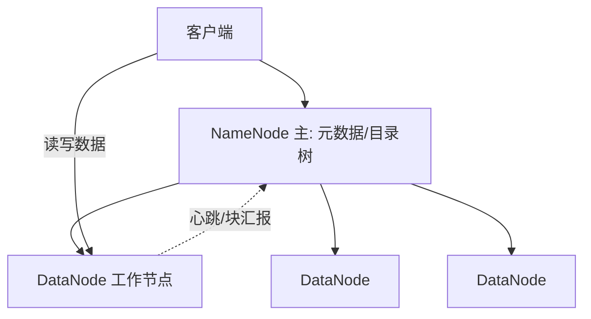
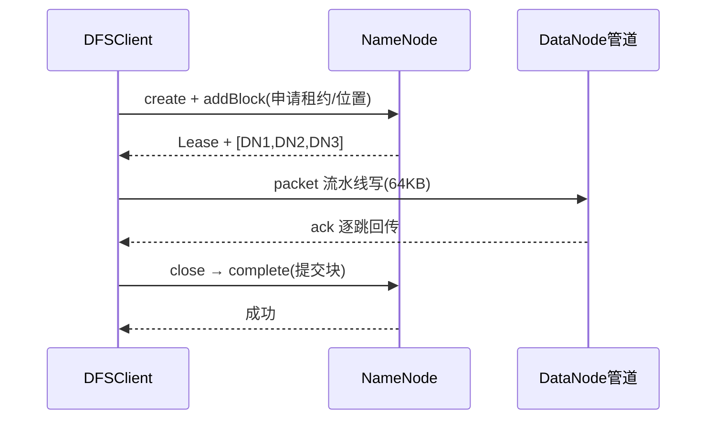
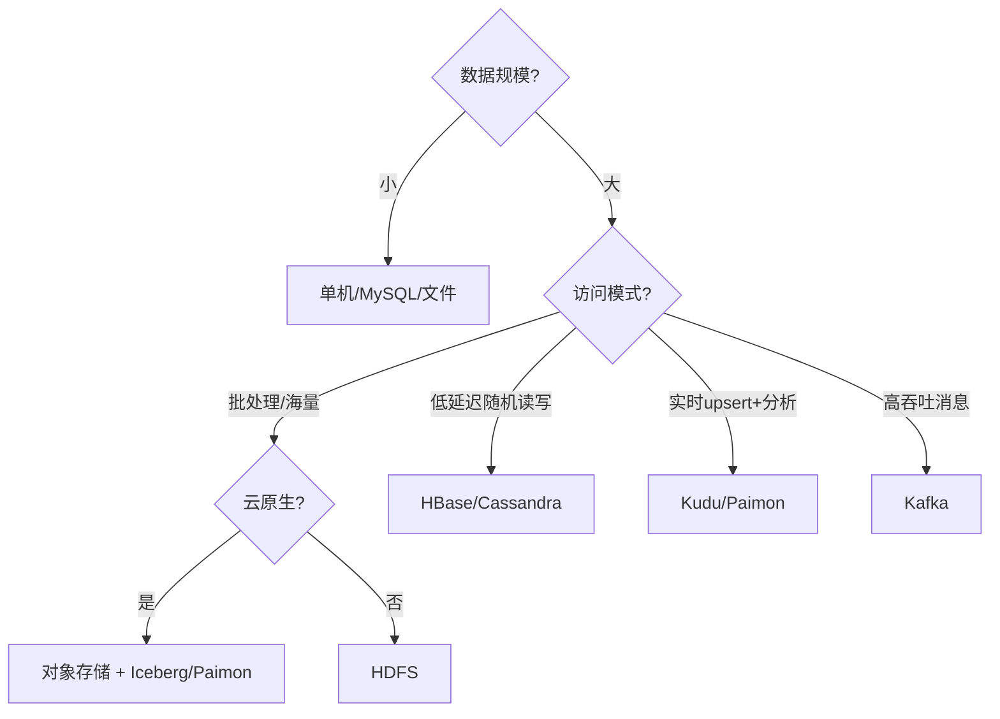
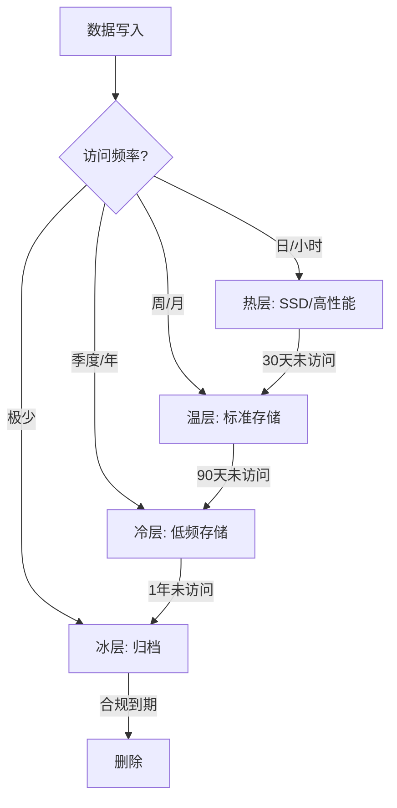
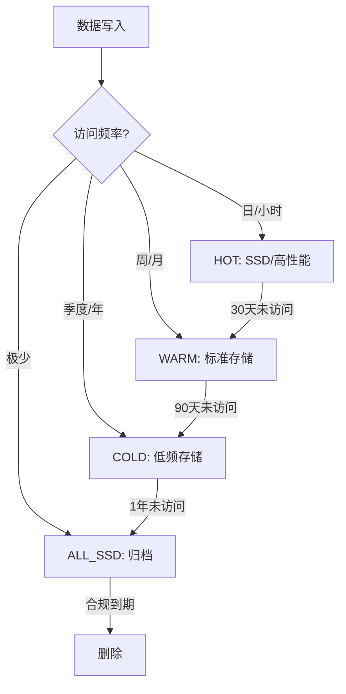

# 大数据 · 04 分布式存储与 HDFS（架构原理 / 数据管理机制 / 对象存储演进 / 选型决策）

> 存储是大数据底座。HDFS 用"分块 + 多副本"把海量文件摊到廉价机器集群上；对象存储（S3/OSS）则把存算彻底解耦，成为湖仓一体的地基。本篇深入拆解 HDFS 架构、核心机制、容错、元数据管理、对象存储演进与存储选型决策。

---

## 一、要解决的问题

| 痛点 | 说明 |
|------|------|
| 单机容量有限 | PB 级数据单机磁盘放不下 |
| 数据可靠性 | 磁盘/节点故障需自动恢复 |
| 存算一体成本高 | 计算和存储绑定，扩容浪费 |
| 海量小文件 | 元数据膨胀拖垮集群 |
| 随机写难 | 传统文件系统不适合流式分析 |

> 核心认知：**HDFS = 「分块 + 多副本 + 中心元数据」的分布式文件系统**，面向"一次写入、多次读取"的批处理；对象存储进一步**存算分离**，成为现代湖仓一体底座。

---

## 二、HDFS 架构

### 2.1 角色与职责



| 角色 | 职责 | 高可用 |
|------|------|--------|
| NameNode（NN） | 管理命名空间、文件→块映射、块位置 | 主备（ZKFC + JournalNode/QJM） |
| DataNode（DN） | 实际存储数据块（默认 128MB/块） | 多副本，故障自动剔除 |
| Secondary NN | 合并 fsimage 与 edits（旧版） | 非热备，仅 checkpoint |
| Client | 与 NN 拿元数据、与 DN 直连读写 | — |

### 2.2 分块（Block）

- 文件按固定大小切块（Hadoop 2.x 起默认 **128MB**，早期 64MB），每块独立存储。
- **大块好处**：减少元数据量（NN 内存）、提升顺序读吞吐；太大则并行度不足、文件尾部浪费。
- **块与文件关系**：文件 = 块列表（元数据）+ 块数据（DataNode）。

### 2.3 副本放置策略（机架感知）

```
默认 3 副本放置：
  第 1 份：本地节点
  第 2 份：同机架另一节点
  第 3 份：跨机架节点

目的：
  本地读快（前两份常能本地/近地）
  跨机架容灾（丢一机架不丢数据）

配置：net.topology.script.file.name 定义机架映射
云上：可用区（AZ）替代机架
```

---

## 三、核心机制（深入）

### 3.1 写入流程（源码级）



```
1. DFSClient.create() 向 NN 申请租约（Lease）与块位置，NN 按机架感知返回 3 个 DN。
2. 客户端把数据切为 64KB packet，经 DataStreamer 以管道写 DN1→DN2→DN3，每跳确认（ack queue）。
3. 块写满或关闭时，Complete 上报 NN，NN 提交块、释放租约。
4. 容错：ResponseProcessor 收到异常则从 ack queue 重发；DN 故障换管，NN 后续补副本。
```

### 3.2 读取流程

- Client 向 NN 取块位置，优先选**最近副本**直连 DN 流式读，失败换副本。

### 3.3 容错

```
DataNode 容错：
  DN 心跳/块汇报超时（默认 10 分钟未心跳）→ NN 标记死亡
  → 触发副本复制补足 3 份（后台，限速）

NameNode 高可用：
  Active/Standby 两 NN
  QJM（Quorum Journal Manager）共享 editlog（多数派写入）
  ZKFC 监听健康、抢锁做故障转移
  联邦（Federation）：多 NameService 横向扩展元数据
```

---

## 四、NameNode 元数据（深入）

### 4.1 元数据构成

```
fsimage：命名空间快照（文件/目录/权限/块映射）
editlog：增量操作日志（append 每条变更）

加载流程：
  启动：加载 fsimage → 重放 editlog → 服务
  合并：Standby/Secondary NN 定期 checkpoint（合并 fsimage+editlog）

内存估算：
  每个文件约占用 NN 150~250 字节内存
  10 亿文件 ≈ 150~250GB 堆内存 → 小文件是 NN 杀手
```

### 4.2 联邦（Federation）

```
多 NameService（NS）：
  每个 NS 管理一部分目录（/data/a、/data/b）
  共享底层 DataNode 存储池

解决：单 NN 内存/吞吐瓶颈
适用：超大集群（万级节点）元数据横向扩展
```

### 4.3 快照（Snapshot）

```
功能：文件系统只读快照（灾难恢复/误删回滚）
用法：hdfs dfsadmin -allowSnapshot /data
      hdfs dfs -createSnapshot /data snap1
原理：基于 inode 复制（diff 记录），不复制数据块
```

---

## 五、小文件治理

| 手段 | 做法 |
|------|------|
| 合并写 | Hive `INSERT OVERWRITE` 合并、Spark `coalesce` |
| HAR 归档 | `hadoop archive` 把小文件打包为 har |
| CombineInputFormat | 合并输入分片，减少 map 数 |
| 对象存储+表格式 | 用 Iceberg 大文件 + compaction |
| 避源头 | 控制分区粒度，避免按分钟分区 |

```
经验法则：
  单文件 ≥ 128MB（与块对齐）
  分区不宜过细（日优于小时）
  目标：每文件 ≥ 块大小，减少 NN 元数据
```

---

## 六、纠删码（Erasure Coding）

```
副本 3 份存储放大 3×；EC（如 RS-6-3）用校验块替代副本：
  6 数据块 + 3 校验块 = 9 块，冗余 1.5×
  任意 3 块丢失可恢复

代价：重建需网络读多块、计算开销高
适用：冷数据目录（xor/rs 策略）

配置示例：
  hdfs ec -enablePolicy -policy RS-6-3-1024k /cold_data
  hdfs ec -setPolicy -path /cold_data -policy RS-6-3-1024k

说明：EC 对追加写友好，随机写差 → 适合归档/日志/冷数据
```

---

## 七、HDFS vs 对象存储（工程对比）

| 维度 | HDFS | 对象存储（S3/OSS） |
|------|------|-------------------|
| 接口 | HDFS API | REST（HTTP PUT/GET） |
| 一致性 | 强（NN 中心） | 最终/强（取决于实现） |
| 小文件 | 极差（NN 元数据） | 好（无 NN 瓶颈） |
| 存算 | 耦合 | **分离**，计算弹性 |
| 成本 | 自管机器 | 按量付费、极低 |
| 生态 | Hadoop 系 | 全云原生、Iceberg/Paimon 原生 |
| 运维 | 重（NN/DN 管理） | 托管免运维 |
| 适合 | 传统 Hadoop 集群 | 湖仓一体、云原生 |

### 7.1 对象存储性能补丁

```
问题：网络 IO 延迟高于本地磁盘
解决：
  本地/集群缓存（Alluxio、SSD cache）
  向量化读、Parquet/ORC 列式下推
  大文件顺序读（避免小对象）

2025 主流：
  对象存储 + 开放表格式 取代"HDFS 上裸 Parquet"
  实现存算分离与多云互通
```

---

## 八、Kudu：实时分析型存储

```
定位：Cloudera Kudu 弥补 HDFS（慢更新）与 HBase（弱分析）之间空白
特性：列式存储 + 快速 upsert + 低延迟随机读
适用：既要点查又要分析（实时明细层）

架构：
  Tablet（类似 HBase Region，Raft 复制）
  列式 + 主键唯一 + 快速更新

与 Impala/Spark 配合：做实时数仓明细层
```

---

## 九、存储选型决策树



| 需求 | 选 |
|------|----|
| 海量离线批处理、廉价 | HDFS / 对象存储 |
| 湖仓一体、ACID、多引擎 | 对象存储 + Iceberg/Paimon |
| 低延迟随机读写/宽表 | HBase |
| 实时 upsert + 分析 | Kudu / Paimon |
| 高吞吐消息缓冲 | Kafka |

---

## 十、存储设计 Checklist

- [ ] 块大小按文件特征调（大文件 256MB，小文件合并）。
- [ ] 副本数权衡成本与可靠（跨机架至少 2 副本分布）。
- [ ] NN 用 QJM 高可用，避免单点。
- [ ] 小文件治理：合并、HAR、或用 HBase/对象存储。
- [ ] 冷数据用 EC 降本，热数据用副本保性能。
- [ ] 新平台优先对象存储 + 表格式，保留 HDFS 兼容旧作业。
- [ ] 监控：容量、副本缺失、NN 延迟、DN 心跳。

---

## HDFS Federation 与 Erasure Coding

### HDFS Federation（联邦）

```
单NameNode瓶颈：
  元数据内存受限 → 10亿文件需150GB+堆内存
  吞吐受限 → 所有请求经单NN

Federation解决：
  多NameService（NN1、NN2...）横向扩展
  每个NN管理独立命名空间（/data/a、/data/b）
  共享底层DataNode存储池
  客户端挂载表（Mount Table）统一入口

架构：
  NN1 → /data/a/*（DN1,DN2,DN3）
  NN2 → /data/b/*（DN1,DN2,DN3）
  DN同时注册到多个NN
  Client通过挂载表路由到对应NN

适用：超大集群（万级节点）、多租户隔离
```

### HDFS Erasure Coding（纠删码）

```
副本次本 vs EC：
  3副本：3×存储开销，任2块丢失可恢复
  RS-6-3：1.5×开销，6数据+3校验，任3块丢失可恢复
  RS-10-4：1.4×开销，10数据+4校验

EC原理：
  数据块切分为6个单元
  生成3个校验块（XOR/Reed-Solomon）
  存储9个块到不同节点
  恢复时读取剩余块，数学计算恢复丢失块

代价：
  写入需计算校验（CPU开销）
  恢复需网络读多个块（重建慢）
  不适合频繁写入场景

适用：
  冷数据目录（归档/日志）
  WORM数据（Write Once Read Many）
  存储成本敏感场景

配置：
  hdfs ec -enablePolicy -policy RS-6-3-1024k /cold_data
  hdfs ec -setPolicy -path /cold_data -policy RS-6-3-1024k
```

### HDFS 存储策略

| 策略 | 副本/EC | 适用数据 | 存储介质 |
|------|--------|---------|---------|
| HOT | 3副本 | 频繁访问 | 高性能磁盘 |
| WARM | 1副本+EC | 低频访问 | 标准磁盘 |
| COLD | EC-6-3 | 极少访问 | 低频存储 |
| ALL_SSD | 3副本(SSD) | 实时分析 | SSD |
| ONE_SSD | 1副本(SSD)+2副本磁盘 | 混合 | SSD+磁盘 |
| LAZY_PERSIST | 内存→异步落盘 | 临时数据 | 内存+磁盘 |

```
策略切换：
  hdfs storagepolicies -setStoragePolicy -path /data -policy WARM
  hdfs mover -p /data（触发数据迁移）

自动分层：
  结合访问热度（块访问统计）
  定期执行mover迁移数据
  与对象存储Lifecycle类似
```

### HDFS Balancer

```
问题：新节点加入后数据不均衡，老节点过载
解决：HDFS Balancer在节点间迁移数据块

执行：
  hdfs balancer -threshold 10（允许10%偏差）
  按带宽限制：dfs.datanode.balance.bandwidthPerSec

自动平衡：
  定时调度（如每周一次）
  阈值设为5%~10%
  注意：迁移时占用网络带宽，避峰执行

云上替代：
  对象存储自动均衡（无需手动balancer）
  HDFS → 对象存储迁移替代balancer
```

### DataNode Decommissioning（退役）

```
退役流程：
  1. 配置退役节点名单（dfs.hosts.exclude）
  2. NameNode检测到退役节点
  3. 后台复制该节点所有块到其他节点
  4. 副本数恢复后，节点进入退役完成状态
  5. 物理下线节点

注意：
  退役期间占网络带宽（副本复制）
  同时退役多节点可能导致副本不足
  监控：副本不足告警、退役进度
```

### 云存储对比：S3 vs HDFS vs GCS vs ADLS

| 维度 | S3 | HDFS | GCS | ADLS |
|------|-----|------|-----|------|
| 类型 | 对象存储 | 分布式文件系统 | 对象存储 | 对象存储 |
| 接口 | REST API | HDFS API | REST API | REST API |
| 一致性 | 最终一致 | 强一致 | 最终一致 | 最终一致 |
| 定价 | $0.023/GB/月 | 自管硬件 | $0.020/GB/月 | $0.018/GB/月 |
| 小文件 | 无限制 | 受NN限制 | 无限制 | 无限制 |
| 生态 | AWS全栈+Iceberg | Hadoop全栈 | GCP BigQuery | Azure Synapse |
| 加密 | SSE/SSE-KMS | 传输+静态 | CMEK | SSE |
| 生命周期 | 自动分层 | 手动策略 | 自动分层 | 自动分层 |

```
选型建议：
  云原生 → S3/GCS/ADLS（免运维、按量付费）
  混合云 → HDFS（本地）+ S3（云端）用DistCp同步
  湖仓底座 → 对象存储 + Iceberg（最通用）
  传统Hadoop → HDFS（兼容性最好）
```

### MinIO 作为 HDFS 替代

```
MinIO定位：高性能对象存储（S3兼容API）

优势：
  100% S3 API兼容，HDFS数据可无缝迁移
  部署简单：单二进制、K8s原生
  性能：NVMe SSD，单对象读写极快
  扩展：线性扩展，PB级
  开源：AGPLv3许可

与HDFS对比：
  MinIO：REST API、无元数据单点、云原生
  HDFS：HDFS API、NameNode单点、Hadoop生态

适用场景：
  替代小规模HDFS集群
  湖仓底座（+Iceberg/Hudi）
  K8s原生数据平台
  多云/混合云存储统一

迁移路径：
  HDFS → DistCp → S3A → MinIO
  Iceberg表：直接修改catalog指向MinIO
```

### 数据湖存储格式深度对比

| 维度 | Delta Lake | Apache Iceberg | Apache Hudi |
|------|-----------|---------------|-------------|
| ACID事务 | ✅ | ✅ | ✅ |
| 时间旅行 | ✅ | ✅ | ✅ |
| Schema演进 | ✅ | ✅ | ✅ |
| 分区演进 | 有限 | ✅ 隐藏分区 | ✅ |
| 流式写入 | 有限 | 增强中 | ✅ Flink集成 |
| 流式读取 | 有限 | 增量读 | ✅ |
| 引擎支持 | Spark为主 | 全引擎 | Spark/Flink |
| 开放程度 | 半开放 | Apache顶级 | Apache顶级 |
| 社区 | Databricks主导 | 社区驱动 | Uber发起 |

```
选型决策：
  Databricks生态 → Delta Lake
  通用互操作+多引擎 → Iceberg（推荐）
  Flink实时链路 → Paimon（Apache孵化）
  传统Hive+Hudi → Hudi

2025趋势：
  Iceberg成为事实标准（Snowflake/Databricks/AWS共支持）
  Paimon在Flink生态崛起
  DuckLake探索元数据简化
```

### 存储分层策略



| 层级 | 媒介 | $/GB/月 | 访问延迟 | 适用 |
|------|------|---------|---------|------|
| Hot | SSD | $0.10 | ms级 | 实时分析 |
| Warm | 标准S3 | $0.023 | 100ms | 日常查询 |
| Cold | S3 IA | $0.0125 | 分钟级 | 季度报表 |
| Archive | Glacier | $0.004 | 小时级 | 合规归档 |

```
成本收益：
  Hot→Warm：降成本75%
  Warm→Cold：降成本50%
  Cold→Archive：降成本70%
  合理分层可降存储总成本40%~60%

执行方式：
  对象存储：Lifecycle Policy自动迁移
  Iceberg：按分区时间戳归档到低频
  HDFS：Storage Policy + HDFS Mover
```

---

## 十一、HDFS NameNode HA（QJM）

### QJM 架构

```
QJM（Quorum Journal Manager）架构：
  Active NN：处理所有客户端请求
  Standby NN：热备，同步元数据
  JournalNode（JN）：共享editlog，多数派写入
  ZKFC：ZK故障检测，自动切换

工作流程：
  1. Active NN写editlog到JN（多数派写入成功才返回）
  2. Standby NN从JN读取editlog同步
  3. ZKFC监控NN健康状态
  4. Active NN故障时，ZKFC触发故障转移
  5. Standby NN提升为Active

配置示例：
  dfs.namenode.name.dir：元数据存储目录
  dfs.namenode.shared.edits.dir：JN地址列表
  dfs.ha.fencing.methods：隔离方法
  dfs.ha.automatic-failover.enabled：自动故障转移
```

### QJM 配置要点

| 配置项 | 说明 | 推荐值 |
|--------|------|--------|
| dfs.ha.journalnode.rpc-address | JN RPC地址 | 0.0.0.0:8485 |
| dfs.ha.journalnode.http-address | JN HTTP地址 | 0.0.0.0:8480 |
| dfs.namenode.shared.edits.dir | JN存储目录 | qjournal://jn1:8485;jn2:8485;jn3:8485/ns1 |
| dfs.ha.fencing.methods | 隔离方法 | sshfence(hdfs:22) |
| dfs.ha.automatic-failover.enabled | 自动故障转移 | true |

### Federation + HA

```
Federation + HA架构：
  NS1：Active NN1 + Standby NN1
  NS2：Active NN2 + Standby NN2
  共享DataNode存储池
  客户端挂载表路由

优势：
  元数据横向扩展（多NS）
  高可用（每个NS有HA）
  多租户隔离（不同NS管理不同目录）
```

## HDFS 分层存储（HOT/WARM/COLD/ALL_SSD）

### 存储策略详解

| 策略 | 副本/EC | 介质 | 访问延迟 | 成本 | 适用数据 |
|------|--------|------|----------|------|----------|
| HOT | 3副本 | 高性能磁盘 | ms级 | 高 | 频繁访问 |
| WARM | 1副本+EC | 标准磁盘 | 100ms | 中 | 低频访问 |
| COLD | EC-6-3 | 低频存储 | 分钟级 | 低 | 极少访问 |
| ALL_SSD | 3副本(SSD) | SSD | ms级 | 最高 | 实时分析 |
| ONE_SSD | 1副本(SSD)+2磁盘 | SSD+磁盘 | ms级 | 中高 | 混合 |
| LAZY_PERSIST | 内存→异步落盘 | 内存+磁盘 | ms级 | 中 | 临时数据 |

### 自动分层策略



### 配置命令

```bash
# 设置存储策略
hdfs storagepolicies -setStoragePolicy -path /data -policy WARM

# 触发数据迁移
hdfs mover -p /data

# 查看存储策略
hdfs storagepolicies -getStoragePolicy -path /data

# 自动分层脚本
#!/bin/bash
# HOT → WARM（30天未访问）
find /data -type f -atime +30 -exec hdfs dfs -setStoragePolicy -path {} -policy WARM \;

# WARM → COLD（90天未访问）
find /data -type f -atime +90 -exec hdfs dfs -setStoragePolicy -path {} -policy COLD \;
```

## HDFS 纠删码（EC）开销分析

### EC vs 副本对比

| 指标 | 3副本 | RS-6-3 | RS-10-4 |
|------|-------|--------|---------|
| 存储开销 | 3× | 1.5× | 1.4× |
| 冗余能力 | 丢2块可恢复 | 丢3块可恢复 | 丢4块可恢复 |
| 写入开销 | 低 | 中(计算校验) | 中高 |
| 读取开销 | 低 | 中(可能需恢复) | 中高 |
| 恢复开销 | 低(直接复制) | 高(读多块+计算) | 高 |
| 适用场景 | 热数据 | 温/冷数据 | 冷数据 |

### EC 开销计算

```
EC写入开销：
  数据块：6块 × 128MB = 768MB
  校验块：3块 × 128MB = 384MB
  总写入：1152MB（1.5×原始数据）
  计算开销：RS编码计算（CPU密集）

EC读取开销：
  正常读：6块 × 128MB = 768MB
  恢复读：读剩余块 + 计算恢复（网络+CPU）
  延迟：比副本读高2-5倍

EC恢复开销：
  丢失1块：读5块 + 计算恢复（最常见）
  丢失2块：读4块 + 计算恢复
  丢失3块：读3块 + 计算恢复（极限）
  恢复时间：取决于网络带宽和CPU
```

### EC 最佳实践

```
EC适用场景：
  冷数据目录（归档/日志）
  WORM数据（Write Once Read Many）
  存储成本敏感场景
  数据量大但访问少

EC不适用场景：
  频繁写入（CPU开销大）
  低延迟读取（恢复慢）
  小文件（EC块对齐问题）
  高IOPS场景（网络开销）

配置建议：
  策略选择：RS-6-3（平衡性能和冗余）
  块大小：1024KB（默认）
  目录规划：冷数据单独目录
  监控：EC块健康状态、恢复进度
```

## 云对象存储作为 HDFS 替代（S3A）

### S3A 客户端配置

```xml
<!-- core-site.xml -->
<property>
  <name>fs.s3a.impl</name>
  <value>org.apache.hadoop.fs.s3a.S3AFileSystem</value>
</property>
<property>
  <name>fs.s3a.endpoint</name>
  <value>s3.amazonaws.com</value>
</property>
<property>
  <name>fs.s3a.access.key</name>
  <value>YOUR_ACCESS_KEY</value>
</property>
<property>
  <name>fs.s3a.secret.key</name>
  <value>YOUR_SECRET_KEY</value>
</property>
<property>
  <name>fs.s3a.path.style.access</name>
  <value>false</value>
</property>
<property>
  <name>fs.s3a.connection.maximum</name>
  <value>200</value>
</property>
<property>
  <name>fs.s3a.fast.upload</name>
  <value>true</value>
</property>
```

### HDFS vs S3A 性能对比

| 维度 | HDFS | S3A |
|------|------|-----|
| 顺序读 | 高(本地磁盘) | 中(网络IO) |
| 顺序写 | 高(本地磁盘) | 中(网络IO) |
| 随机读 | 低(不支持) | 低(不支持) |
| 小文件 | 差(NN瓶颈) | 好(无NN) |
| 并发 | 中(NN瓶颈) | 高(REST API) |
| 成本 | 高(自管硬件) | 低(按量付费) |

```
性能优化：
  1. 大文件顺序读（避免小对象）
  2. 列式存储（Parquet/ORC）下推
  3. 本地缓存（Alluxio/SSD cache）
  4. 向量化读（Arrow格式）
  5. 多线程并发读
```

## 数据湖文件格式对比

### Parquet/ORC/Avro 对比

| 维度 | Parquet | ORC | Avro |
|------|---------|-----|------|
| 存储方式 | 列式 | 列式 | 行式 |
| 压缩率 | 高 | 最高 | 中 |
| Schema演进 | Footer嵌入 | Stripe元数据 | Schema嵌入 |
| 查询性能 | 高 | 最高 | 低 |
| 写入性能 | 中 | 中 | 高 |
| 生态支持 | 最广 | Hive为主 | Kafka/Hive |
| 适用场景 | OLAP分析 | Hive/Trino | 消息传输 |

### 格式选择决策

```
选择建议：
  OLAP分析 → Parquet（Spark/Trino全支持）
  Hive查询 → ORC（压缩率最高）
  消息传输 → Avro（Schema演进友好）
  数据湖底座 → Parquet（通用性最强）

组合使用：
  Kafka消息 → Avro（Schema演进）
  数据湖存储 → Parquet（列式压缩）
  Hive查询 → ORC（Hive原生支持）
```

## 数据湖 Compaction 策略

### 小文件问题

```
小文件成因：
  1. 流式写入（每条记录一个文件）
  2. 分区过细（按小时/分钟分区）
  3. 频繁更新（每次更新生成新文件）
  4. 并发写入（多个writer同时写入）

影响：
  1. NameNode/S3元数据膨胀
  2. 查询性能下降（读取大量小文件）
  3. 存储效率低（文件头尾浪费）
  4. Compaction成本高
```

### Compaction 策略

| 策略 | 说明 | 适用 | 工具 |
|------|------|------|------|
| 大文件合并 | 合并小文件为大文件 | 冷数据 | Spark/Flink |
| 增量合并 | 只合并新增小文件 | 实时写入 | Iceberg/Hudi |
| 时间窗口合并 | 按时间窗口合并 | 定时任务 | Airflow/DolphinScheduler |
| 访问热度合并 | 热数据优先合并 | 混合负载 | 自定义脚本 |

### Iceberg Compaction

```sql
-- Iceberg compaction
-- 手动触发
CALL catalog.system.rewrite_data_files(
  table => 'db.orders',
  strategy => 'sort',
  sort_order => 'ts DESC',
  options => map('target-file-size-bytes', '134217728')
);

-- 自动compaction配置
-- spark.sql/catalog/iceberg.properties
spark.sql.catalog.prod.catalog-impl=org.apache.iceberg.aws.glue.GlueCatalog
spark.sql.catalog.prod.io-impl=org.apache.iceberg.aws.s3.S3FileIO
```

## 数据湖治理

### 治理维度

| 维度 | 说明 | 工具 |
|------|------|------|
| 表管理 | 表生命周期、权限 | Catalog |
| Schema管理 | 版本演进、兼容性 | Schema Registry |
| 数据质量 | 质量规则、监控 | Great Expectations |
| 安全治理 | 加密、脱敏、审计 | Ranger |
| 成本治理 | 存储分层、清理 | Lifecycle Policy |

### 治理最佳实践

```
表治理：
  1. 表Owner负责制
  2. 表生命周期管理（热→温→冷→归档→删除）
  3. 僵尸表清理（无查询+无引用→标记删除）
  4. 数据血缘（表级+字段级）

Schema治理：
  1. Schema版本管理
  2. 兼容性检查（BACKWARD/FORWARD）
  3. 破坏性变更审批
  4. 代码生成（多语言绑定）

数据质量：
  1. 质量规则定义（非空、范围、一致性）
  2. 质量监控（实时+离线）
  3. 质量告警（P0/P1/P2分级）
  4. 质量修复（自动+人工）
```

> 一句话：**HDFS = 分块（128MB）+ 多副本（机架感知）+ 中心元数据（NN+QJM HA）——理解"小文件是杀手、随机写是弱项、EC 是冷数据降本神器"；新平台转对象存储 + 开放表格式实现存算分离**。