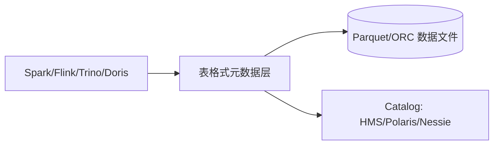
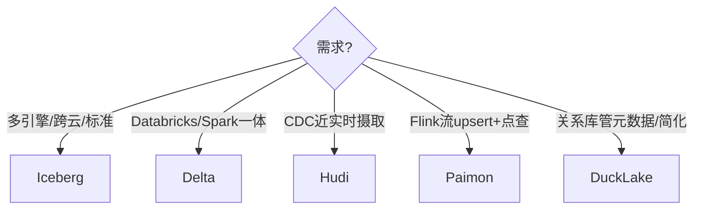

# 大数据 · 05 列式存储与数据湖格式

> 数据湖的"野文件"问题靠**开放表格式**解决：在 Parquet/ORC 之上叠加元数据与事务协议，让数据湖获得数据库的 ACID、时间旅行与多引擎互操作——这是湖仓一体的关键一层。

本篇先讲底层列式文件（Parquet/ORC），再深入四大开放表格式（Iceberg/Hudi/Delta/Paimon）及 DuckLake。

## 一、列式存储文件：Parquet / ORC

行存 vs 列存：

| 维度 | 行存（CSV/JSON/行式） | 列存（Parquet/ORC） |
|------|----------------------|---------------------|
| 读取 | 取整行快 | 只取需要的列，IO 少 |
| 压缩 | 一般 | 同列类型相似，压缩极高 |
| 场景 | 事务/点查 | OLAP 聚合分析 |

- **Parquet**：Google Dremel 衍生，Thrift 定义的列式格式，跨语言、跨引擎（Spark/Flink/Trino/Impala）首选。
- **ORC**：Hive 原生优化，Predicate Pushdown、布隆索引，Hive 生态常用。
- 二者都支持**谓词下推、列裁剪、统计信息（min/max）**做文件级/块级修剪（data skipping）。

## 二、开放表格式（Open Table Format）

传统数据湖用裸 Parquet，没有事务、schema 演进痛苦、无法行级更新。开放表格式在文件层上加**元数据层 + 事务协议**。



核心能力：**ACID 事务、Schema 演进、时间旅行、行级变更（upsert/delete）、多引擎互操作、数据跳过**。

## 三、四大格式对比（2025）

| 维度 | Iceberg | Delta Lake | Hudi | Paimon |
|------|---------|-----------|------|--------|
| 起源 | Netflix (2018) | Databricks (2017) | Uber (2016) | 阿里/Flink (2022) |
| 治理方 | Apache | Linux 基金会 | Apache | Apache（2024 毕业顶级项目） |
| 元数据 | JSON+Avro 快照/清单 | JSON 事务日志 `_delta_log` | Avro 时间线 `.hoodie` | LSM 树 |
| 设计目标 | 多引擎互操作 | Spark 上可靠湖 | 流式 upsert/增量 | **流式优先**湖仓 |
| 行级变更 | MoR 删除向量 | COW + 删除向量 | COW/MOR 双模 | LSM 原生 upsert |
| 多引擎 | **最广**（Spark/Flink/Trino/DuckDB/仓） | 最佳 Spark/Databricks | Spark+Flink 强 | Flink 原生，Spark 增长 |
| Catalog | REST Catalog 标准（Polaris/Nessie） | Unity（Databricks 专有） | HMS/REST | 多种 |
| 流式/CDC | 经 Flink 较好 | CDF 提供 CDC | **原生增量拉取** | **最强流式语义** |

### 3.1 Apache Iceberg（行业事实标准）
- **元数据层次**：表元数据文件 → 快照（snapshot）→ 清单列表/清单（manifest，Avro，含列统计）→ 数据文件。
- **杀手锏**：
  - **隐藏分区 + 分区演进**：改分区策略（日→小时）不重写历史。
  - **时间旅行**：`SELECT ... AS OF snapshot_id/timestamp`。
  - **Schema 演进**：内部列 ID，加/删/改名不坏下游。
  - **乐观并发**：原子提交新快照 + 冲突检测。
- 采用：Netflix、Apple、LinkedIn、Snowflake、BigQuery、AWS Athena；2024 起成默认开放表格式。

### 3.2 Delta Lake（Spark/Databricks 亲儿子）
- `_delta_log` 事务日志（JSON + Parquet 检查点），简单可重建。
- 强项：批流统一（Spark Structured Streaming 读写同一表）、Change Data Feed（CDF）、Z-order 聚类。
- 局限：多引擎能力弱于 Iceberg，Unity Catalog 偏 Databricks 绑定。

### 3.3 Apache Hudi（增量先驱）
- `.hoodie` 时间线 + **COW/MOR 双模**：
  - COW（写时复制）：更新即重写 Parquet，读快、写贵。
  - MOR（读时合并）：更新落 Avro 日志，读时合并，写快、读稍慢。
- **按主键 upsert + 增量拉取**（`incremental query`）是其立身之本，最适合 CDC 近实时摄取（AWS EMR/Glue 原生支持）。

### 3.4 Apache Paimon（流式优先新星）
- 源自阿里 Flink Table Store，LSM 树设计，**高吞吐 upsert + 近实时读**。
- 特性：主键合并引擎（last-write / 聚合）、**同时作为静态快照批读与变更流读**、Flink lookup join 高效。
- 适用于"既要亚秒写、又要点查"的流式湖仓，常与 Flink 组成实时入湖。

### 3.5 DuckLake（2025 新秀）
- 用**关系数据库存元数据**（而非 JSON/Avro 文件），以 catalog 为中心，简化一致性、支持多表事务、加速查询规划。代表"元数据简化"第三波创新。

## 四、COW vs MOR（行级变更两大策略）

| 策略 | 写法 | 读性能 | 写性能 | 适用 |
|------|------|--------|--------|------|
| Copy-On-Write | 重写整个文件 | 快（直接读） | 慢（重写） | 读多写少、分析 |
| Merge-On-Read | 追加增量日志 | 稍慢（合并） | 快（追加） | 写多/流式、CDC |

## 五、压缩（Compaction）

- 小文件/增量日志需后台合并为优化大文件（Iceberg rewrite、Hudi compact、Paimon compaction）。
- 不压缩会"小文件爆炸"，拖慢查询规划与元数据。

## 六、选型口诀

> **"通用互操作选 Iceberg，Spark 一体选 Delta，CDC 近实时选 Hudi，流式湖仓选 Paimon。"**

| 场景 | 首选 |
|------|------|
| 多引擎、跨云、标准优先 | Iceberg |
| Databricks/Spark 一体 | Delta Lake |
| 近实时 CDC、增量管道 | Hudi |
| Flink 实时 upsert + 点查 | Paimon |

## 七、设计 Checklist

- [ ] 表格式按"引擎组合 + 实时性"选，别盲目追新。
- [ ] 用 Catalog（Polaris/Nessie/HMS）统一管理，避免元数据散落。
- [ ] 配定时 compaction，防小文件。
- [ ] 写链路幂等（按主键 upsert），配合 CDC 至少一次。
- [ ] 开启 Schema 演进与分区演进，避免后期返工。
  - [ ] 时间旅行用于审计/回滚演练。

> 参考：Apache Iceberg/Delta/Hudi/Paimon 官方文档、Onehouse 三方对比（2025 更新）、Alex Merced 开放表格式指南、DuckLake 公告。

## 八、三强深度对比：ACID / 时间旅行 / Compaction

| 能力 | Iceberg | Hudi | Delta |
|------|---------|------|-------|
| ACID 提交 | 原子换快照 + 乐观锁 | 时间线提交 | `_delta_log` 事务日志 |
| 时间旅行 | snapshot id / 时间戳 | 时间点查询 | 版号 / 时间戳 |
| 行级更新 | 删除向量(MoR) | COW/MOR | 删除向量 |
| 小文件合并 | rewrite_manifests / rewrite_data | compact | optimize |
| 增量读 | 快照区间 | incremental query | CDF |
| 并发写 | 乐观并发重试 | 乐观+锁 | 乐观 |

### 8.1 Compaction / 小文件治理实战

```sql
-- Iceberg: 重写数据文件（合并小文件）
CALL catalog.system.rewrite_data_files('db.orders',
  options => map('target-file-size-bytes','134217728'));
-- Hudi: 触发 compaction（MOR 表）
CALL hudi_metadata('compact', 'db.orders', /* ... */);
-- Delta: OPTIMIZE + ZORDER
OPTIMIZE delta.orders ZORDER BY (user_id);
```

- 不压缩的后果：元数据膨胀、查询规划慢、对象存储 PUT 次数多（贵）。建议**按分区定时跑**。

### 8.2 时间旅行与回滚

```sql
-- Iceberg 读历史快照
SELECT * FROM orders FOR SYSTEM_TIME AS OF '2026-07-28 00:00:00';
-- 回滚到旧快照
CALL catalog.system.rollback_to_snapshot('db.orders', 87654321);
-- Delta 按版号
SELECT * FROM delta.orders VERSION AS OF 15;
```

## 九、表格式选型决策



- **决策要点**：① 引擎组合（Spark 重→Delta/Iceberg；Flink 重→Paimon/Iceberg）；② 实时性（CDC/MOR→Hudi/Paimon）；③ 多云/开放→Iceberg（REST Catalog）。

## 十、Spark 读写 Iceberg 实战

```sql
-- 建表（隐藏分区 + 演进友好）
CREATE TABLE iceberg_shop.orders (
  order_id BIGINT, user_id BIGINT, amount DECIMAL(18,2), ts TIMESTAMP)
USING iceberg
PARTITIONED BY (days(ts));

-- 批写
INSERT INTO iceberg_shop.orders
SELECT order_id, user_id, amount, ts FROM staging_orders;

-- 流写（Structured Streaming，按主键 upsert）
INSERT INTO iceberg_shop.orders
SELECT * FROM kafka_orders;
```

```scala
// Scala: 时间旅行读
spark.read
  .option("snapshot-id", 87654321L)
  .table("iceberg_shop.orders")
  .show()
```

## 十一、Flink 读写 Iceberg 实战

```sql
-- Flink SQL 流写 Iceberg（upsert by 主键）
CREATE TABLE flink_orders (
  order_id BIGINT, user_id BIGINT, amount DECIMAL(18,2), ts TIMESTAMP(3),
  PRIMARY KEY (order_id) NOT ENFORCED
) WITH ('connector'='iceberg','catalog-type'='hive',
  'warehouse'='s3://lake/warehouse','database'='shop','table'='orders');

INSERT INTO flink_orders
SELECT order_id, user_id, amount, ts FROM mysql_orders_cdc;
```

```java
// Java: 批读 Iceberg 做离线补齐
TableLoader loader = TableLoader.fromCatalog(/* catalog 配置 */);
IcebergSource.forRowData().tableLoader(loader).build();
// 流读（增量/CDC 模式）
IcebergSource.forRowData().tableLoader(loader)
  .streaming(true).startSnapshotId(sid).build();
```

- Flink + Iceberg 组合实现**流批同源**：同一张表既能被 Flink 流写，也能被 Spark 批读，天然流批一体。

## 十二、生产落地 Checklist

- [ ] 选表格式看引擎组合与实时性，别盲追新。
- [ ] 配定时 compaction（Iceberg rewrite / Hudi compact / Delta optimize）。
- [ ] 用 Catalog（Polaris/Nessie/HMS）统一，跨引擎可发现。
- [ ] 主键表开启 upsert，写链路幂等配合 CDC 至少一次。
- [ ] 时间旅行用于审计/回滚演练，定期清理过期快照（`expire_snapshots`）。
- [ ] 监控：小文件数、快照数、compaction 滞后、元数据大小。
