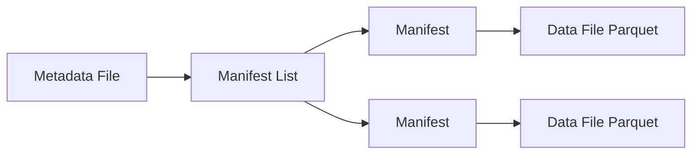
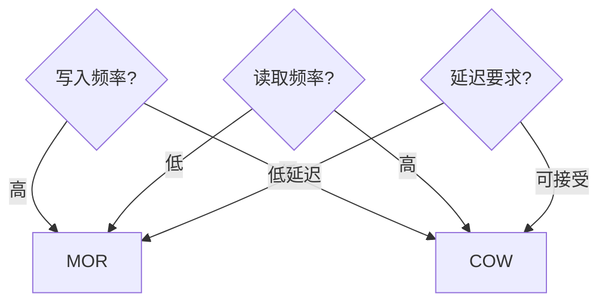

# 大数据 · 05 列式存储与数据湖格式（Parquet/ORC / Iceberg / Hudi / Delta / Paimon / 流式湖仓）

> 存储层是数据体系的底座：**列式存储（Parquet/ORC）**解决"压缩率高、分析 I/O 小"，**数据湖表格式（Iceberg/Hudi/Delta/Paimon）**解决"文件级 ACID、schema 演进、时间旅行、小文件治理"。本文深入拆解两者原理，并给出选型矩阵。

---

## 一、要解决的问题

| 痛点 | 说明 |
|------|------|
| 存储膨胀 | 行式存储压缩率低、占空间 |
| 分析缓慢 | 读全列、I/O 大 |
| 小文件爆炸 | 流式/高频写入产生海量小文件，拖垮查询 |
| 无 ACID | 并发读写会读到半成品数据 |
| Schema 僵化 | 加列/改类型困难，破坏下游 |
| 难以演进 | 无法做增量更新、无法时间旅行 |

> 核心认知：**列式存储 = 分析场景的"压缩+少读"**；**数据湖格式 = 把"廉价对象存储"变成"可用 ACID 的数仓"**——两者叠加是湖仓一体（Lakehouse）的地基。

---

## 二、列式存储原理（Parquet / ORC）

### 2.1 行存 vs 列存

```
行存（MySQL/CSV）：一条记录的所有字段存在一起
列存（Parquet/ORC）：同一列的所有值存在一起

分析查询（COUNT/SUM/GROUP BY）只关心少数列：
  行存：把每一行的所有字段都读出来 → 浪费 I/O
  列存：只读取查询涉及的列 → I/O 大幅下降
```

| 场景 | 行存 | 列存 |
|------|------|------|
| 点查（WHERE id=1 全字段） | 快 | 慢（需跨列重组） |
| 聚合分析（GROUP BY 少数列） | 慢 | 快 |
| 压缩率 | 低 | 高（同列类型一致） |
| 典型 | MySQL | Parquet/ORC |

### 2.2 列存为什么压缩率高

```
同一列数据类型相同、数值相似度高（如金额、日期、枚举值）
  字典编码：枚举值用短编码替代
  游程编码(RLE)：连续相同值压缩为(值,次数)
  位打包/增量编码：数值列存差值，减少位宽
  压缩算法：Snappy/ZSTD/LZ4/GZIP 进一步压缩
综合压缩率通常是行存的 5~10 倍
```

### 2.3 Parquet 与 ORC

| 维度 | Parquet | ORC |
|------|---------|-----|
| 起源 | Twitter+Cloudera | Hive（Hortonworks） |
| 生态 | Spark/Flink/Trino/Impala 通用 | Hive 原生，Spark/Trino 支持 |
| 索引 | Row Group 级统计（min/max） | 轻量索引 + Bloom Filter |
| 嵌套 | 原生支持（nested） | 支持 |
| 选型 | 通用首选（跨生态） | Hive 场景/ORC 特性需求 |

```
Parquet 文件结构：
  文件 → 多个 Row Group（行组）
  Row Group → 多个 Column Chunk（列块，每列一块）
  Column Chunk → 多个 Page（页，压缩单位）
  File Footer → 元数据（schema/统计/offset）
  谓词下推+列裁剪 → 只读需要的 Page
```

---

## 三、数据湖表格式：为什么需要

### 3.1 原始文件（Parquet 裸文件）的问题

```
① 无事务：并发写同一表会覆盖/读到半成品
② 无 schema 管理：改结构破坏下游
③ 小文件失控：写入频率高 → 几千个小文件 → 查询慢 + 元数据压力
④ 无快照：无法"回看某一时刻数据"
⑤ 无增量更新：只能全量重写
```

### 3.2 表格式 = 在文件之上加"元数据层"

```
表格式（Table Format）不是存储引擎，而是一套"元数据组织规范"：
  表级快照（Snapshot）+ 文件清单（Manifest）+ ACID 事务提交

写入流程：
  新文件写对象存储 → 提交新 snapshot（原子更新 manifest 指针）
  读：指定 snapshot → 读对应文件清单 → 并行读文件
  未提交前旧 snapshot 不受影响 → 并发安全、可时间旅行
```

---

## 四、主流表格式对比

| 维度 | Iceberg | Hudi | Delta Lake | Paimon |
|------|---------|------|-----------|--------|
| 出身 | Netflix→Apache | Uber→Apache | Databricks | Flink 社区 |
| 定位 | 通用湖格式 | 增量更新/近实时 | Spark 生态默认 | 流式湖仓 |
| 表结构 | Snapshot + Manifest | Timeline + FileGroup | Log + Checkpoint | 日志+LSM |
| 主键/更新 | Merge-on-read(演进) | Copy-on-write/MOR | Merge-on-read | LSM upsert 强 |
| 流批 | 批为主，Flink 写入好 | 支持 | 批为主 | ⭐ 流批一体最强 |
| Schema 演进 | 优秀（演进元数据） | 支持 | 支持 | 支持 |
| 时间旅行 | ⭐ 优秀 | 支持 | 支持 | 支持 |
| 引擎支持 | Spark/Flink/Trino 最全 | Spark/Flink | Spark 原生 | Flink/Spark/Trino |
| Catalog | ⭐ 开放标准 | 部分 | 绑定 | Flink/独立 |

```
选型要点：
  通用 + 生态最全 → Iceberg（默认首选）
  Spark 团队 → Delta（Databricks 生态）
  近实时增量 + 主键更新 → Hudi
  流式湖仓（Flink 强实时、upsert 强）→ Paimon
```

---

## 五、深入机制

### 5.1 Iceberg：Snapshot + Manifest 架构

```
Iceberg 表结构：
  0. Metadata File（元数据文件，记录当前/历史 snapshot 指针）
  1. Manifest List（清单列表：某 snapshot 的所有 manifest）
  2. Manifest（清单：一组数据文件 + 列统计）
  3. Data Files（数据文件：Parquet/ORC 实际数据）

时间旅行：metadata 里保留历史 snapshot → SELECT 指定 snapshot 即可回看
隐藏分区：按分区自动写对应目录，避免人为分区管理
```



### 5.2 Hudi：Timeline + FileGroup + 两种表类型

```
两种表类型：
  Copy-on-Write（COW）：写时复制，读时无 merge，更新重写整个 file group
  Merge-on-Read（MOR）：写 log 追加，读时合并 base+log，写快读慢

Timeline：按时间记录 commits（写入/合并/清理），支持增量查询
索引：布隆过滤器定位 record 所在 file group，加速 upsert
```

### 5.3 Delta Lake：Log + Checkpoint

```
事务日志（_delta_log）：每条 JSON 记录一次提交（原子操作）
Checkpoint：定期把日志压缩成快照（parquet），加快恢复
数据文件按版本（如 version-xxx.parquet）命名 → 时间旅行
```

### 5.4 Paimon：LSM 结构专为流式

```
Paimon 借鉴 LSM-Tree：
  写入先进内存 buffer → 落盘 sorted run → 后台 merge
  主键表 upsert 高效（Flink CDC 直写首选）
  流读：可读完整 changelog（新增/更新/删除），实现"实时数仓"可回放
```

```
Flink CDC → Paimon 典型链路：
  MySQL binlog → Flink CDC → Paimon 主键表
  → 下游：Paimon 流读 → StarRocks/Trino 查询
  = 流式湖仓（数据湖也能像数仓一样实时更新）
```

---

## 六、写入与读取链路

### 6.1 批式写入（Spark）

```scala
// Spark 写 Iceberg
df.writeTo("lake.db.orders")
  .partitionedBy(col("dt"))
  .append()
```

### 6.2 流式写入（Flink CDC → Paimon）

```sql
CREATE CATALOG paimon WITH ('type'='paimon','warehouse'='s3://warehouse');

CREATE TABLE paimon_orders (
  order_id BIGINT PRIMARY KEY NOT ENFORCED,
  user_id BIGINT, amount DECIMAL(18,2), dt STRING
) WITH ('bucket'='4','merge-engine'='deduplicate');

INSERT INTO paimon_orders SELECT * FROM mysql_orders_cdc;
```

### 6.3 流读（Paimon）

```sql
-- 读取 changelog（新增/更新/删除）
CREATE TEMPORARY VIEW v AS
  SELECT * FROM paimon_orders /*+ OPTIONS('scan.mode'='changelog') */;

INSERT INTO starrocks_orders SELECT * FROM v;
```

---

## 七、小文件治理与 Compaction

```
小文件问题：流式/频繁写入 → 海量小文件（几 KB~几 MB）
  危害：元数据膨胀、查询打开文件过多、NameNode/OFS 压力大

治理手段：
  ① 写入端攒批：Flink 设 checkpoint 间隔（如 5 分钟）落一批
  ② 表格式自动 compaction：Iceberg/Paimon 后台合并小文件
  ③ 定期 compaction 任务：调度窗口合并历史小文件
  ④ 分区/分桶设计：Paimon 按 bucket 控制文件数
  ⑤ 清理孤儿文件与过期快照
```

---

## 八、Schema 演进

| 操作 | Iceberg | 说明 |
|------|---------|------|
| 加列 | ✅ 原地 | 旧数据补默认值 |
| 改列名 | ✅ 原地 | 记录历史名兼容 |
| 改类型 | ⚠️ 兼容类型 | int→long 等 |
| 删列 | ✅ 原地 | 元数据剔除 |
| 分区演进 | ✅ | 更新分区变换 |

```
Schema 演进本质 = 更新表元数据，不重写数据文件
下游需用同一 catalog 读取新 schema（Spark/Flink/Trino 同步识别）
```

---

## 九、Catalog 与多引擎互操作

```
Catalog = 表元数据的集中管理（谁说了算）
  Hive Metastore：传统默认
  Apache Polaris（Snowflake 开源）：统一多引擎 catalog，支持管理功能
  Nessie：Git 式分支/合并的湖 catalog（实验/版本管理）
  JDBC/In-memory：轻量/测试

多引擎互操作 = 同一份数据被 Spark/Flink/Trino/StarRocks 无差别读
  → 避免"湖一套、仓一套、两张皮"
```

---

## 十、选型矩阵速查

| 需求 | 推荐 |
|------|------|
| 通用湖仓、生态最全 | Iceberg |
| Spark/Databricks 生态 | Delta Lake |
| 近实时增量更新 | Hudi |
| Flink 流式湖仓/强 upsert | Paimon |
| Hive 原生分析 | ORC |
| 跨引擎分析通用格式 | Parquet |
| 轻量湖/探索 | DuckLake（嵌入式） |

### 10.1 决策要点

```
文件格式：分析通用 → Parquet；Hive 生态 → ORC
表格式：默认 Iceberg；流式优先 Paimon；Spark 优先 Delta
Catalog：多引擎 → Polaris；Hive 存量 → HMS
更新需求：有主键更新 → Hudi/Paimon；仅追加 → Iceberg
```

---

## 十一、实施 Checklist

- [ ] 分析存储统一列式（Parquet/ORC）+ 合适压缩（ZSTD 推荐）。
- [ ] 选定表格式并统一 catalog，避免两套元数据。
- [ ] 主键/更新场景确定 COW/MOR 或 LSM 选型。
- [ ] 高频流式写入设置 checkpoint 间隔 + compaction 策略。
- [ ] 启用时间旅行与历史 snapshot 清理（避免无限增长）。
- [ ] Schema 变更走演进 API，禁止手工改文件。
- [ ] 配置孤儿文件清理 + 小文件合并定时任务。
- [ ] 多引擎接入同一 catalog 验证互操作。

---

## 十二、Apache Iceberg 深入

### 12.1 Snapshot 与 Manifest 架构

```
Iceberg 表结构层级：
  Metadata File（元数据文件）
    └── Manifest List（清单列表）
         └── Manifest（清单）
              └── Data File（数据文件 Parquet/ORC）

写入流程：
  1. 写数据文件到对象存储
  2. 创建 Manifest（记录文件+列统计）
  3. 更新 Manifest List
  4. 原子更新 Metadata File 指针（commit）
  5. 旧 Snapshot 保留 → 时间旅行
```

```sql
-- 查看表的历史 Snapshot
SELECT snapshot_id, committed_at, operation, summary
FROM lake.db.orders.metadata_log
ORDER BY committed_at DESC;

-- 时间旅行：查某个 Snapshot 的数据
SELECT * FROM lake.db.orders
WHERE snapshot_id = 1234567890;

-- 查看快照差异
SELECT * FROM lake.db.orders.snapshots
ORDER BY committed_at DESC LIMIT 5;
```

### 12.2 Partition Evolution（分区演化）

```
Iceberg 分区演化 = 不重写数据文件，只更新分区变换表达式

示例：
  初始：PARTITIONED BY (days(created_at))
  演化：PARTITIONED BY (days(created_at), region)

  旧分区文件仍可查询，新分区文件按新分区写入
  查询不受影响（隐藏分区，查询不需要知道分区字段）
```

### 12.3 Hidden Partitioning（隐藏分区）

```
隐藏分区 = 分区字段对查询透明

传统分区：
  PARTITIONED BY (dt STRING)
  查询必须 WHERE dt = '2026-08-24'

Iceberg 隐藏分区：
  PARTITIONED BY (days(created_at))
  查询 WHERE created_at > '2026-08-01'
  → 自动裁剪分区，不需要知道分区字段

优势：
  分区演化不影响查询
  避免用户写错分区键
  分区策略可独立演进
```

## 十三、Delta Lake ACID 机制

### 13.1 事务日志原理

```
Delta Lake 事务日志 = _delta_log/ 目录下的 JSON 文件

每次写入：
  1. 创建新的 JSON 日志文件（记录文件添加/删除）
  2. 原子更新 _delta_log/ 中的版本指针
  3. Checkpoint 定期压缩日志为 Parquet

读取：
  指定版本 → 读对应日志 → 确定可见文件列表 → 并行读取
```

```sql
-- Delta Lake 时间旅行
SELECT * FROM delta.`/data/orders` VERSION AS OF 12345;
SELECT * FROM delta.`/data/orders` TIMESTAMP AS OF '2026-08-24 10:00:00';

-- VACUUM（清理旧版本，默认保留 7 天）
VACUUM delta.`/data/orders` RETAIN 168 HOURS;

-- 查看表历史
DESCRIBE HISTORY delta.`/data/orders`;
```

## 十四、Apache Hudi Merge-on-Read vs Copy-on-Write

### 14.1 两种表类型对比

| 维度 | Copy-on-Write (COW) | Merge-on-Read (MOR) |
|------|---------------------|---------------------|
| 写入方式 | 写入时重写整个 File Group | 写入时追加 Log 文件 |
| 读取方式 | 直接读 Base 文件（无需 merge） | 读 Base + Log 合并 |
| 写入延迟 | 较高（重写数据） | 低（追加写入） |
| 读取延迟 | 低 | 中（需 merge） |
| 存储空间 | 较大（重写文件） | 较小（追加 log） |
| 适用 | 读多写少 | 写多读少（近实时） |

```
COW 写入流程：
  新数据 → 写临时文件 → 与原文件合并 → 生成新 File Group

MOR 写入流程：
  新数据 → 追加 Log 文件 → 读时合并 Base + Log

Compaction（后台合并）：
  Log 文件合并到 Base 文件 → 减少读放大
```

### 14.2 Hudi 增量查询

```sql
-- Hudi 增量查询（只读变更数据）
SELECT * FROM hudi_orders
WHERE _hoodie_commit_time > '20260824000000';

-- 增量查询指定时间段
SELECT * FROM hudi_orders
WHERE _hoodie_commit_time BETWEEN '20260823000000' AND '20260824000000';
```

## 十五、数据湖时间旅行

### 15.1 时间旅行价值

| 价值 | 说明 |
|------|------|
| 数据回溯 | 误操作后恢复到历史版本 |
| 审计合规 | 查看某时刻的数据状态 |
| 可重现分析 | 同一输入产生同一结果 |
| 调试排障 | 对比不同版本数据差异 |

### 15.2 各格式时间旅行对比

| 格式 | 时间旅行 | 语法 |
|------|----------|------|
| Iceberg | ✅ | `FOR SYSTEM_TIME AS OF timestamp` |
| Delta Lake | ✅ | `VERSION AS OF n` / `TIMESTAMP AS OF timestamp` |
| Hudi | ✅ | `WHERE _hoodie_commit_time > timestamp` |
| Paimon | ✅ | `changelog` 模式 |

## 十六、数据湖 Compaction

### 16.1 Compaction 类型

| 类型 | 说明 | 适用 |
|------|------|------|
| 小文件合并 | 合并多个小文件为大文件 | 所有表格式 |
| Log 合并 | Hudi MOR 表 Log → Base | Hudi MOR |
| 快照清理 | 清理过期 Snapshot + 孤儿文件 | 所有表格式 |
| 分区合并 | 合并空分区/小分区 | 所有表格式 |

### 16.2 Compaction 策略

```sql
-- Iceberg 手动 Compaction
CALL catalog.system.rewrite_data_files(
  table => 'db.orders',
  options => map('target-file-size-bytes', '536870912')
);

-- Paimon 自动 Compaction
-- Flink SQL 配置
SET 'compaction.min.file-num' = '3';
SET 'compaction.max.file-num' = '10';
```

> **口诀**：Compaction 是数据湖的"垃圾回收"——小文件不合并，查询永远慢。

## 十七、数据湖格式对比基准

| 维度 | Iceberg | Delta Lake | Hudi | Paimon |
|------|---------|------------|------|--------|
| 写入吞吐 | 高 | 高 | 高（MOR） | 极高 |
| 读取延迟 | 低 | 低 | 中（MOR需merge） | 中 |
| 时间旅行 | ⭐ 优秀 | 优秀 | 支持 | 支持 |
| Schema 演进 | ⭐ 列级 | 有限 | 支持 | 支持 |
| 分区演化 | ⭐ 隐藏分区 | ❌ | ✅ | ✅ |
| Flink 支持 | ⭐ 原生 | 有限 | ✅ | ⭐ 原生 |
| Spark 支持 | ✅ | ⭐ 原生 | ✅ | ✅ |
| 流式写入 | ✅ | ✅ | ✅ | ⭐ 最强 |
| 小文件治理 | Compaction | VACUUM | Compaction | Compaction |

## 十八、实施 Checklist

- [ ] 分析存储统一列式（Parquet/ORC）+ 合适压缩（ZSTD 推荐）。
- [ ] 选定表格式并统一 catalog，避免两套元数据。
- [ ] 主键/更新场景确定 COW/MOR 或 LSM 选型。
- [ ] 高频流式写入设置 checkpoint 间隔 + compaction 策略。
- [ ] 启用时间旅行与历史 snapshot 清理（避免无限增长）。
- [ ] Schema 变更走演进 API，禁止手工改文件。
- [ ] 配置孤儿文件清理 + 小文件合并定时任务。
- [ ] 多引擎接入同一 catalog 验证互操作。

## 十八、列式存储与数据湖格式深度补充

### 18.1 Parquet 深度优化

```
Parquet 文件结构：
  Row Group → Column Chunk → Page → values + statistics + encoding

编码方式：
  RLE（Run-Length Encoding）：连续重复值压缩
  Dictionary Encoding：字典编码（低基数列高效）
  Delta Encoding：差值编码（递增 ID/Timestamp）
  Plain Encoding：直接存储

压缩算法选择：
  Snappy：平衡（默认推荐，压缩比 ~2:1，速度快）
  GZIP：高压缩比（~3:1，CPU 开销大）
  ZSTD：可调压缩比（Facebook 新一代，推荐）
  LZ4：极快压缩/解压（适合实时场景）
```

| 配置项 | 建议 | 说明 |
|--------|------|------|
| row_group_size | 128MB~256MB | 单个 Row Group 大小 |
| page_size | 1MB | Page 大小 |
| compression | ZSTD/Snappy | 压缩算法 |
| dictionary_page_size | 1MB | 字典页大小 |
| bloom_filter_on | true | 布隆过滤器（等值查询加速） |

### 18.2 Iceberg 内部原理

```
Iceberg 表结构：
  metadata.json → 当前表状态
  manifest list → 清单列表（快照→清单文件映射）
  manifest file → 清单文件（数据文件列表 + partition 值 + 统计）
  data file → 实际数据文件（Parquet/ORC/Avro）

快照隔离：
  每次写入生成新快照（不可变）
  读取时看到一致的表快照（不受并发写影响）
  快照链：snapshot_1 → snapshot_2 → snapshot_3（当前）

增量读取：
  read Investments API：
    AppendFiles：新增文件列表
    DeleteFiles：删除文件列表
    ModifiedFiles：修改文件列表
  → 实现增量 ETL
```

```sql
-- Iceberg 表操作
-- 创建表
CREATE TABLE prod.db.events (
    event_id BIGINT,
    event_time TIMESTAMP,
    user_id BIGINT,
    event_type STRING
) USING iceberg
PARTITIONED BY (days(event_time), event_type);

-- 时间旅行查询
SELECT * FROM prod.db.events
  FOR SYSTEM_TIME AS OF '2025-01-01 00:00:00';

-- 快照历史
SELECT * FROM prod.db.events.snapshots;

-- 模式演进（不重写数据）
ALTER TABLE prod.db.events ADD COLUMN region STRING;
ALTER TABLE prod.db.events RENAME COLUMN user_id TO uid;
ALTER TABLE prod.db.events ALTER COLUMN event_type TYPE VARCHAR(100);

-- 增量读取
SELECT * FROM prod.db.events
  WHERE event_time > '2025-01-01'
  FOR SYSTEM_VERSION BETWEEN 100 AND 200;
```

### 18.3 Delta Lake 深度

```
Delta Lake = ACID 事务 + Schema Enforcement + Time Travel

事务日志（_delta_log）：
  00000000000000000000.json → 第一次提交
  00000000000000000001.json → 第二次提交
  每个 JSON = 一次原子操作（Add/Remove/Rewrite）

Time Travel 实现：
  1. 事务日志记录每次变更
  2. 查询时指定版本号或时间戳
  3. Delta 按日志回放还原表状态

VACUUM 命令：
  默认保留 7 天历史文件
  VACUUM prod.db.events RETAIN 168 HOURS;
  清理已删除的物理文件（不可逆）
```

```sql
-- Delta Lake 操作
-- 读取历史版本
SELECT * FROM events VERSION AS OF 10;
SELECT * * FROM events TIMESTAMP AS OF '2025-01-01';

-- Delta Live Tables（流式 ETL）
CREATE LIVE TABLE raw_events AS
  SELECT * FROM cloud_files."/events/raw";

CREATE LIVE TABLE cleaned_events AS
  SELECT event_id, user_id, event_time
  FROM raw_events WHERE event_type = 'click';

-- Schema Enforcement
-- Delta 会拒绝不兼容的 Schema 变更
-- 需要显式执行 ALTER TABLE 或使用 mergeSchema 选项
```

### 18.4 Hudi MoR vs CoW 对比

| 维度 | Copy on Write (CoW) | Merge on Read (MoR) |
|------|---------------------|---------------------|
| 写入 | 写入时重写文件 | 写入增量日志（log） |
| 读取 | 直接读数据文件 | 读数据文件 + 合并日志 |
| 写延迟 | 高（重写整个文件） | 低（只写日志） |
| 读延迟 | 低（直接读） | 中（需合并） |
| 存储 | 较高（冗余文件） | 较低（日志紧凑） |
| 适用 | 读多写少（OLAP） | 写多读少（CDC/实时） |

```
Compaction 策略：
  定时 Compaction：每 N 分钟将 log 文件合并到 base 文件
  增量 Compaction：只合并新增的 log 文件
  全量 Compaction：合并所有 log 文件（彻底清理）

配置：
  hoodie.compact.inline=false（关闭自动 compaction）
  hoodie.compact.inline.max.delta.commits=5
  hoodie.logfile.max.size=1GB
```

### 18.5 Schema 演进对比

| 特性 | Parquet | Iceberg | Delta Lake | Hudi |
|------|---------|---------|------------|------|
| 添加列 | 支持 | 支持（无需重写） | 支持 | 支持 |
| 删除列 | 不支持 | 支持 | 不支持 | 不支持 |
| 重命名列 | 不支持 | 支持 | 不支持 | 不支持 |
| 类型变更 | 不支持 | 支持（宽→窄） | 不支持 | 不支持 |
| Schema Enforcement | 无 | 强制 | 强制 | 强制 |

### 18.6 数据湖 Compaction 最佳实践

```
Compaction 触发条件：
  1. 小文件数量超过阈值（如 > 100 个文件/分区）
  2. 日志文件大小超过 base 文件的 50%
  3. 读取延迟上升（检查 Compaction 是否跟上）

Compaction 并行度：
  spark.sql.shuffle.partitions=200（写并行度）
  spark.sql.files.maxRecordsPerFile=1000000（文件大小控制）

监控指标：
  - 每分区文件数
  - 平均文件大小（目标 128MB~256MB）
  - Compaction 耗时
   - 读取延迟（P50/P99）
```

---

## 二十、Iceberg 快照机制与时间旅行

### 20.1 快照原理

| 概念 | 说明 |
|------|------|
| 快照 | 表在某个时间点的完整视图 |
| 快照ID | 单调递增的唯一标识 |
| 快照列表 | 所有快照的历史记录 |
| 快照过期 | 删除旧快照释放空间 |

```sql
-- 查看快照历史
SELECT * FROM table_history('my_table');

-- 时间旅行查询
SELECT * FROM my_table FOR SYSTEM_TIME AS OF '2024-01-01 00:00:00';
SELECT * FROM my_table FOR SYSTEM_VERSION AS OF 1234567890;

-- 比较两个快照
SELECT * FROM table_diff('my_table', 1234567890, 1234567891);
```

### 20.2 快照管理

```sql
-- 过期快照（保留最近100个）
CALL catalog.expire_snapshots('my_table', retain_max_snapshots => 100);

-- 过期快照（保留最近7天）
CALL catalog.expire_snapshots('my_table', retain_max_duration => INTERVAL '7' DAY);
```

## 二十一、OPTIMIZE 与 Z-ORDER 索引

### 21.1 OPTIMIZE 操作

| 操作 | 说明 | 效果 |
|------|------|------|
| COMPACT | 小文件合并为大文件 | 减少文件数 |
| Z-ORDER | 按多列排序 | 加速多列查询 |
| SORT | 按指定列排序 | 加速单列查询 |
| BIN PACK | 按大小打包 | 均衡文件大小 |

```sql
-- 自动压缩
CALL catalog.optimize('my_table', kind => 'compact');

-- Z-ORDER 索引
CALL catalog.optimize('my_table', z_order => ARRAY('col1', 'col2'));

-- 自动压缩调度（Iceberg表属性）
ALTER TABLE my_table SET TBLPROPERTIES (
  'write.target-file-size-bytes' = '134217728',
  'commit.manifest-merge.enabled' = 'true'
);
```

## 二十二、MOR vs COW 写入策略

### 22.1 写入策略对比

| 维度 | MOR（Merge On Read） | COW（Copy On Write） |
|------|----------------------|----------------------|
| 写入性能 | 高（只写delta） | 低（重写数据文件） |
| 读取性能 | 低（需merge） | 高（直接读） |
| 存储开销 | 中（delta文件） | 高（全量复制） |
| 适用场景 | 写多读少 | 读多写少 |
| 文件合并 | 异步compaction | 写入时合并 |

### 22.2 写入策略选择



## 二十三、Schema Evolution 演进策略

### 23.1 Schema 演进操作

| 操作 | 支持性 | 说明 |
|------|--------|------|
| 添加列 | 支持 | 向后兼容 |
| 删除列 | 支持 | 向前兼容 |
| 重命名列 | 支持 | 向后兼容 |
| 修改列类型 | 支持 | 需兼容 |
| 修改列顺序 | 支持 | 不影响查询 |

### 23.2 演进示例

```sql
-- 添加列
ALTER TABLE my_table ADD COLUMN new_col STRING;

-- 删除列
ALTER TABLE my_table DROP COLUMN old_col;

-- 重命名列
ALTER TABLE my_table RENAME COLUMN col1 TO new_name;

-- 修改列类型
ALTER TABLE my_table ALTER COLUMN col1 TYPE BIGINT;
```

## 二十四、Compaction 调度策略

### 24.1 调度方案

| 方案 | 工具 | 适用 |
|------|------|------|
| 定时调度 | Airflow/DolphinScheduler | 批处理 |
| 事件触发 | 写入后自动触发 | 流式 |
| 手动触发 | 命令行/API | 按需 |
| 自动调度 | 内置调度器 | 简单场景 |

### 24.2 Compaction 监控

```sql
-- 查看文件分布
SELECT
  content,
  count(*) as file_count,
  sum(file_size_in_bytes) / 1024 / 1024 as size_mb
FROM table_files('my_table')
GROUP BY content
ORDER BY file_count DESC;

-- 查找小文件
SELECT * FROM table_files('my_table')
WHERE file_size_in_bytes < 134217728  -- <128MB
ORDER BY file_size_in_bytes ASC;
```

## 二十五、数据湖格式集成矩阵

| 格式 | Spark | Flink | Trino | Hive | Presto |
|------|-------|-------|-------|------|--------|
| Iceberg | 原生 | 原生 | 原生 | 通过Catalog | 通过Catalog |
| Hudi | 原生 | 原生 | 有限 | 有限 | 有限 |
| Delta Lake | 原生 | 有限 | 通过Delta | 有限 | 有限 |
| Paimon | 原生 | 原生 | 有限 | 有限 | 有限 |

### 25.1 集成配置

```sql
-- Iceberg Spark 集成
spark.sql.catalog.iceberg = org.apache.iceberg.spark.SparkCatalog
spark.sql.catalog.iceberg.warehouse = s3://my-bucket/iceberg-warehouse

-- Iceberg Flink 集成
CREATE CATALOG iceberg_catalog WITH (
  'type' = 'iceberg',
  'catalog-type' = 'hadoop',
  'warehouse' = 's3://my-bucket/iceberg-warehouse'
);
```

---

## 十九、与其他板块的关系

- 文件系统见「[04-分布式存储与HDFS](04-分布式存储与HDFS.md)」；
- 湖仓一体见「[11-实时数仓与湖仓一体](11-实时数仓与湖仓一体.md)」；
- 实时写入链路见「[03-数据采集与同步](03-数据采集与同步.md)」「[08-流处理计算：Flink](08-流处理计算：Flink.md)」；
- OLAP 引擎见「[09-数据仓库与OLAP引擎](09-数据仓库与OLAP引擎.md)」；
- 存储成本见「[16-大数据成本优化](16-大数据成本优化.md)」。

> 一句话：**列式存储（Parquet/ORC）解决"压缩+少读"，表格式（Iceberg/Hudi/Delta/Paimon）在对象存储之上加 ACID/演进/时间旅行/compaction——选型先定「文件格式（Parquet 通用）」，再定「表格式（默认 Iceberg、流式 Paimon、Spark Delta）」，最后配「统一 catalog + compaction + 时间旅行保留策略」**。