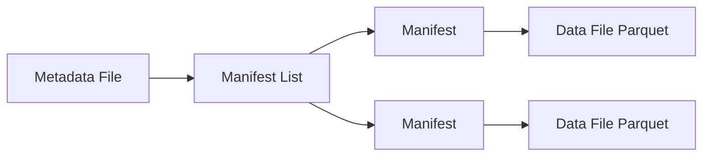

# 大数据 · 05 列式存储与数据湖格式（Parquet/ORC / Iceberg / Hudi / Delta / Paimon / 流式湖仓）

> 存储层是数据体系的底座：**列式存储（Parquet/ORC）**解决"压缩率高、分析 I/O 小"，**数据湖表格式（Iceberg/Hudi/Delta/Paimon）**解决"文件级 ACID、schema 演进、时间旅行、小文件治理"。本文深入拆解两者原理，并给出选型矩阵。

---

## 一、要解决的问题

| 痛点 | 说明 |
|------|------|
| 存储膨胀 | 行式存储压缩率低、占空间 |
| 分析缓慢 | 读全列、I/O 大 |
| 小文件爆炸 | 流式/高频写入产生海量小文件，拖垮查询 |
| 无 ACID | 并发读写会读到半成品数据 |
| Schema 僵化 | 加列/改类型困难，破坏下游 |
| 难以演进 | 无法做增量更新、无法时间旅行 |

> 核心认知：**列式存储 = 分析场景的"压缩+少读"**；**数据湖格式 = 把"廉价对象存储"变成"可用 ACID 的数仓"**——两者叠加是湖仓一体（Lakehouse）的地基。

---

## 二、列式存储原理（Parquet / ORC）

### 2.1 行存 vs 列存

```
行存（MySQL/CSV）：一条记录的所有字段存在一起
列存（Parquet/ORC）：同一列的所有值存在一起

分析查询（COUNT/SUM/GROUP BY）只关心少数列：
  行存：把每一行的所有字段都读出来 → 浪费 I/O
  列存：只读取查询涉及的列 → I/O 大幅下降
```

| 场景 | 行存 | 列存 |
|------|------|------|
| 点查（WHERE id=1 全字段） | 快 | 慢（需跨列重组） |
| 聚合分析（GROUP BY 少数列） | 慢 | 快 |
| 压缩率 | 低 | 高（同列类型一致） |
| 典型 | MySQL | Parquet/ORC |

### 2.2 列存为什么压缩率高

```
同一列数据类型相同、数值相似度高（如金额、日期、枚举值）
  字典编码：枚举值用短编码替代
  游程编码(RLE)：连续相同值压缩为(值,次数)
  位打包/增量编码：数值列存差值，减少位宽
  压缩算法：Snappy/ZSTD/LZ4/GZIP 进一步压缩
综合压缩率通常是行存的 5~10 倍
```

### 2.3 Parquet 与 ORC

| 维度 | Parquet | ORC |
|------|---------|-----|
| 起源 | Twitter+Cloudera | Hive（Hortonworks） |
| 生态 | Spark/Flink/Trino/Impala 通用 | Hive 原生，Spark/Trino 支持 |
| 索引 | Row Group 级统计（min/max） | 轻量索引 + Bloom Filter |
| 嵌套 | 原生支持（nested） | 支持 |
| 选型 | 通用首选（跨生态） | Hive 场景/ORC 特性需求 |

```
Parquet 文件结构：
  文件 → 多个 Row Group（行组）
  Row Group → 多个 Column Chunk（列块，每列一块）
  Column Chunk → 多个 Page（页，压缩单位）
  File Footer → 元数据（schema/统计/offset）
  谓词下推+列裁剪 → 只读需要的 Page
```

---

## 三、数据湖表格式：为什么需要

### 3.1 原始文件（Parquet 裸文件）的问题

```
① 无事务：并发写同一表会覆盖/读到半成品
② 无 schema 管理：改结构破坏下游
③ 小文件失控：写入频率高 → 几千个小文件 → 查询慢 + 元数据压力
④ 无快照：无法"回看某一时刻数据"
⑤ 无增量更新：只能全量重写
```

### 3.2 表格式 = 在文件之上加"元数据层"

```
表格式（Table Format）不是存储引擎，而是一套"元数据组织规范"：
  表级快照（Snapshot）+ 文件清单（Manifest）+ ACID 事务提交

写入流程：
  新文件写对象存储 → 提交新 snapshot（原子更新 manifest 指针）
  读：指定 snapshot → 读对应文件清单 → 并行读文件
  未提交前旧 snapshot 不受影响 → 并发安全、可时间旅行
```

---

## 四、主流表格式对比

| 维度 | Iceberg | Hudi | Delta Lake | Paimon |
|------|---------|------|-----------|--------|
| 出身 | Netflix→Apache | Uber→Apache | Databricks | Flink 社区 |
| 定位 | 通用湖格式 | 增量更新/近实时 | Spark 生态默认 | 流式湖仓 |
| 表结构 | Snapshot + Manifest | Timeline + FileGroup | Log + Checkpoint | 日志+LSM |
| 主键/更新 | Merge-on-read(演进) | Copy-on-write/MOR | Merge-on-read | LSM upsert 强 |
| 流批 | 批为主，Flink 写入好 | 支持 | 批为主 | ⭐ 流批一体最强 |
| Schema 演进 | 优秀（演进元数据） | 支持 | 支持 | 支持 |
| 时间旅行 | ⭐ 优秀 | 支持 | 支持 | 支持 |
| 引擎支持 | Spark/Flink/Trino 最全 | Spark/Flink | Spark 原生 | Flink/Spark/Trino |
| Catalog | ⭐ 开放标准 | 部分 | 绑定 | Flink/独立 |

```
选型要点：
  通用 + 生态最全 → Iceberg（默认首选）
  Spark 团队 → Delta（Databricks 生态）
  近实时增量 + 主键更新 → Hudi
  流式湖仓（Flink 强实时、upsert 强）→ Paimon
```

---

## 五、深入机制

### 5.1 Iceberg：Snapshot + Manifest 架构

```
Iceberg 表结构：
  0. Metadata File（元数据文件，记录当前/历史 snapshot 指针）
  1. Manifest List（清单列表：某 snapshot 的所有 manifest）
  2. Manifest（清单：一组数据文件 + 列统计）
  3. Data Files（数据文件：Parquet/ORC 实际数据）

时间旅行：metadata 里保留历史 snapshot → SELECT 指定 snapshot 即可回看
隐藏分区：按分区自动写对应目录，避免人为分区管理
```



### 5.2 Hudi：Timeline + FileGroup + 两种表类型

```
两种表类型：
  Copy-on-Write（COW）：写时复制，读时无 merge，更新重写整个 file group
  Merge-on-Read（MOR）：写 log 追加，读时合并 base+log，写快读慢

Timeline：按时间记录 commits（写入/合并/清理），支持增量查询
索引：布隆过滤器定位 record 所在 file group，加速 upsert
```

### 5.3 Delta Lake：Log + Checkpoint

```
事务日志（_delta_log）：每条 JSON 记录一次提交（原子操作）
Checkpoint：定期把日志压缩成快照（parquet），加快恢复
数据文件按版本（如 version-xxx.parquet）命名 → 时间旅行
```

### 5.4 Paimon：LSM 结构专为流式

```
Paimon 借鉴 LSM-Tree：
  写入先进内存 buffer → 落盘 sorted run → 后台 merge
  主键表 upsert 高效（Flink CDC 直写首选）
  流读：可读完整 changelog（新增/更新/删除），实现"实时数仓"可回放
```

```
Flink CDC → Paimon 典型链路：
  MySQL binlog → Flink CDC → Paimon 主键表
  → 下游：Paimon 流读 → StarRocks/Trino 查询
  = 流式湖仓（数据湖也能像数仓一样实时更新）
```

---

## 六、写入与读取链路

### 6.1 批式写入（Spark）

```scala
// Spark 写 Iceberg
df.writeTo("lake.db.orders")
  .partitionedBy(col("dt"))
  .append()
```

### 6.2 流式写入（Flink CDC → Paimon）

```sql
CREATE CATALOG paimon WITH ('type'='paimon','warehouse'='s3://warehouse');

CREATE TABLE paimon_orders (
  order_id BIGINT PRIMARY KEY NOT ENFORCED,
  user_id BIGINT, amount DECIMAL(18,2), dt STRING
) WITH ('bucket'='4','merge-engine'='deduplicate');

INSERT INTO paimon_orders SELECT * FROM mysql_orders_cdc;
```

### 6.3 流读（Paimon）

```sql
-- 读取 changelog（新增/更新/删除）
CREATE TEMPORARY VIEW v AS
  SELECT * FROM paimon_orders /*+ OPTIONS('scan.mode'='changelog') */;

INSERT INTO starrocks_orders SELECT * FROM v;
```

---

## 七、小文件治理与 Compaction

```
小文件问题：流式/频繁写入 → 海量小文件（几 KB~几 MB）
  危害：元数据膨胀、查询打开文件过多、NameNode/OFS 压力大

治理手段：
  ① 写入端攒批：Flink 设 checkpoint 间隔（如 5 分钟）落一批
  ② 表格式自动 compaction：Iceberg/Paimon 后台合并小文件
  ③ 定期 compaction 任务：调度窗口合并历史小文件
  ④ 分区/分桶设计：Paimon 按 bucket 控制文件数
  ⑤ 清理孤儿文件与过期快照
```

---

## 八、Schema 演进

| 操作 | Iceberg | 说明 |
|------|---------|------|
| 加列 | ✅ 原地 | 旧数据补默认值 |
| 改列名 | ✅ 原地 | 记录历史名兼容 |
| 改类型 | ⚠️ 兼容类型 | int→long 等 |
| 删列 | ✅ 原地 | 元数据剔除 |
| 分区演进 | ✅ | 更新分区变换 |

```
Schema 演进本质 = 更新表元数据，不重写数据文件
下游需用同一 catalog 读取新 schema（Spark/Flink/Trino 同步识别）
```

---

## 九、Catalog 与多引擎互操作

```
Catalog = 表元数据的集中管理（谁说了算）
  Hive Metastore：传统默认
  Apache Polaris（Snowflake 开源）：统一多引擎 catalog，支持管理功能
  Nessie：Git 式分支/合并的湖 catalog（实验/版本管理）
  JDBC/In-memory：轻量/测试

多引擎互操作 = 同一份数据被 Spark/Flink/Trino/StarRocks 无差别读
  → 避免"湖一套、仓一套、两张皮"
```

---

## 十、选型矩阵速查

| 需求 | 推荐 |
|------|------|
| 通用湖仓、生态最全 | Iceberg |
| Spark/Databricks 生态 | Delta Lake |
| 近实时增量更新 | Hudi |
| Flink 流式湖仓/强 upsert | Paimon |
| Hive 原生分析 | ORC |
| 跨引擎分析通用格式 | Parquet |
| 轻量湖/探索 | DuckLake（嵌入式） |

### 10.1 决策要点

```
文件格式：分析通用 → Parquet；Hive 生态 → ORC
表格式：默认 Iceberg；流式优先 Paimon；Spark 优先 Delta
Catalog：多引擎 → Polaris；Hive 存量 → HMS
更新需求：有主键更新 → Hudi/Paimon；仅追加 → Iceberg
```

---

## 十一、实施 Checklist

- [ ] 分析存储统一列式（Parquet/ORC）+ 合适压缩（ZSTD 推荐）。
- [ ] 选定表格式并统一 catalog，避免两套元数据。
- [ ] 主键/更新场景确定 COW/MOR 或 LSM 选型。
- [ ] 高频流式写入设置 checkpoint 间隔 + compaction 策略。
- [ ] 启用时间旅行与历史 snapshot 清理（避免无限增长）。
- [ ] Schema 变更走演进 API，禁止手工改文件。
- [ ] 配置孤儿文件清理 + 小文件合并定时任务。
- [ ] 多引擎接入同一 catalog 验证互操作。

---

## 十二、与其他板块的关系

- 文件系统见「[04-分布式存储与HDFS](04-分布式存储与HDFS.md)」；
- 湖仓一体见「[11-实时数仓与湖仓一体](11-实时数仓与湖仓一体.md)」；
- 实时写入链路见「[03-数据采集与同步](03-数据采集与同步.md)」「[08-流处理计算：Flink](08-流处理计算：Flink.md)」；
- OLAP 引擎见「[09-数据仓库与OLAP引擎](09-数据仓库与OLAP引擎.md)」；
- 存储成本见「[16-大数据成本优化](16-大数据成本优化.md)」。

> 一句话：**列式存储（Parquet/ORC）解决"压缩+少读"，表格式（Iceberg/Hudi/Delta/Paimon）在对象存储之上加 ACID/演进/时间旅行/compaction——选型先定「文件格式（Parquet 通用）」，再定「表格式（默认 Iceberg、流式 Paimon、Spark Delta）」，最后配「统一 catalog + compaction + 时间旅行保留策略」**。