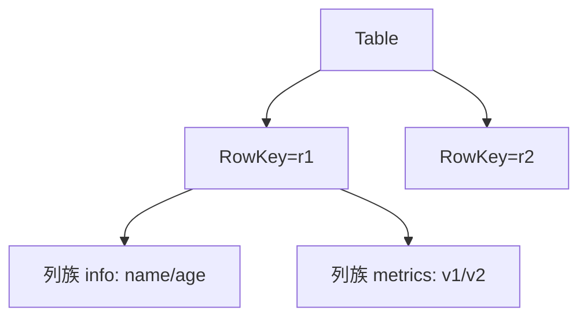
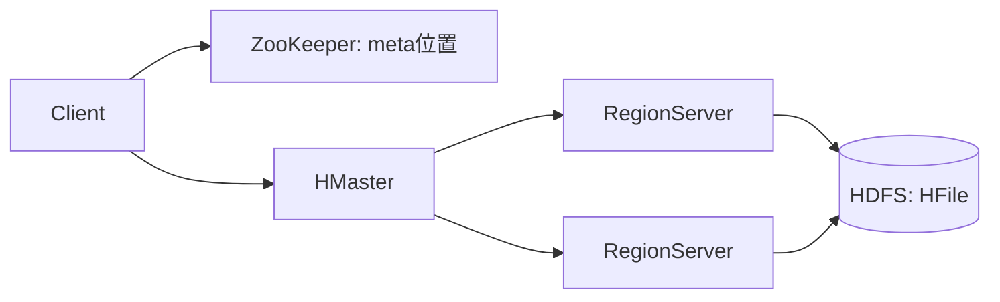
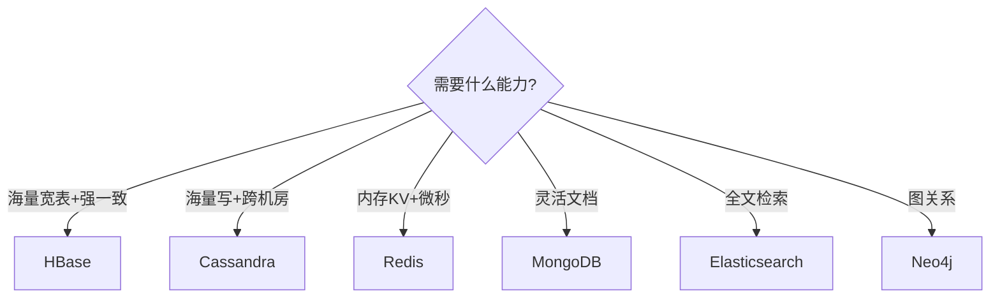
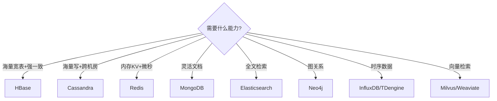

# 大数据 · 06 分布式 NoSQL 与 HBase（LSM 机制 / RowKey 设计 / Region 管理 / 二级索引 / 选型决策）

> 当数据量超出单机关系库、又需要**低延迟随机读写 + 水平扩展**时，列式 NoSQL（HBase/Cassandra）登场。HBase 用 LSM 树 + 有序列式存储，在 HDFS 之上提供百亿级宽表的毫秒读写。本篇深入拆解 HBase 架构原理、RowKey 设计、二级索引、读写优化与 NoSQL 选型。

---

## 一、要解决的问题

| 痛点 | 说明 |
|------|------|
| 单机数据库容量上限 | 百亿行宽表单机放不下 |
| 写放大 | 关系库随机写慢（B+Tree 索引） |
| 低延迟访问 | 海量数据按 key 毫秒读写 |
| 水平扩展 | 数据增长自动扩容 |
| 灵活 schema | 列可动态增减（稀疏） |

> 核心认知：**HBase = 「HDFS 之上的分布式宽表」**——用 LSM（Log-Structured Merge）把随机写转顺序写，用 RowKey 字典序组织数据实现高效点查/范围扫。

---

## 二、HBase 定位与数据模型

- **定位**：构建在 HDFS 之上的**分布式、列式、强一致** NoSQL，Google BigTable 开源实现。
- **适用**：写多读少、海量宽表、按 rowkey 点查/范围扫、近实时。不适合复杂 Join、事务跨行。
- **数据模型**：

```
表 → 行（RowKey，字典序） → 列族（CF） → 列（Qualifier） → 版本（Timestamp）

稀疏：空列不占空间
多版本：保留最近 N 版（TTL/最大版本数控制）
```



---

## 三、架构

### 3.1 角色

| 角色 | 职责 | 高可用 |
|------|------|--------|
| HMaster | 元数据、Region 分配、负载均衡 | 主备 |
| RegionServer（RS） | 服务若干 Region，处理读写 | 多节点，故障 Region 迁移 |
| Region | 表水平切分单元（按 RowKey 范围） | 自动分裂/合并 |
| ZooKeeper | 集群协调、RS 存活、meta 位置 | 本身高可用 |
| HDFS | 底层持久化（StoreFile=HFile） | 多副本 |

### 3.2 寻址流程



```
Client 寻址（三级缓存优化）：
  1. ZK 拿到 -ROOT-/hbase:meta 位置
  2. meta 表记录 表→Region 分配
  3. 直接连 RS（客户端缓存 region 位置，避免每次查 meta）
  → 首次寻址后走缓存，毫秒级
```

---

## 四、LSM 读写路径（核心机制）

### 4.1 写流程（快，顺序追加）

```
1. 写 WAL（HLog）预写日志（持久化，防 RS 宕机丢数据）
2. 写 MemStore（内存有序结构：跳表/SkipList）
3. MemStore 满（默认 128MB）→ Flush 成 HFile 落 HDFS
4. HFile 累积 → Compaction
   minor：合并小文件（合并 StoreFile）
   major：全量合并，清理过期版本/删除标记

LSM 核心思想：
  随机写 → 内存顺序写 + 后台批量落盘
  读时多版本合并（MemStore + HFile）
  写吞吐远超 B+Tree 随机写
```

### 4.2 读流程

```
1. 查 BlockCache（读缓存，LRU）
2. 查 MemStore（内存最新数据）
3. 查 HFile（按时间倒序，用 Bloom Filter 快速判断 key 是否在某文件）
4. 合并多版本返回最新

读优化：
  Bloom Filter（ROW/ROWCOL）跳过不含 key 的文件
  BlockCache 缓存热块（DataBlock/IndexBlock/BloomBlock）
  列族隔离（减少跨 CF 扫描）
```

### 4.3 Compaction 详解

| 类型 | 触发 | 作用 | 注意 |
|------|------|------|------|
| minor | 文件数超阈值 | 合并小文件减少读放大 | 不清理过期数据 |
| major | 定时/手动/阈值 | 全量合并，删过期/删除标记 | 磁盘 IO 高峰 |
| flush | MemStore 满 | 落盘成 HFile | 触发时写暂停 |

```
重大坑：
  major compaction 才删过期/被删数据
  → 必须定时触发（否则 HDFS 膨胀）
  但 major 全量合并 IO 大 → 低峰期调度
```

---

## 五、RowKey 设计（最关键的工程决策）

> RowKey 决定分布、热点与查询效率，是 HBase 设计的"命门"。

| 原则 | 做法 | 反例 |
|------|------|------|
| 避免热点 | 加**加盐/哈希前缀**（`hash(userId)%10 + userId`）打散 | 纯时间戳/自增 ID（全写末台 Region） |
| 查询友好 | 最常用查询维度放前缀，利用字典序范围扫 | 随机维度前置 |
| 长度适中 | 8~20 字节，过长占用内存 | 超长字符串 |
| 多维度 | 组合键 `userId + ts` 支持范围查询 | 单一随机键 |

### 5.1 加盐（Salting）深入

```
加盐 = 在 RowKey 前缀加随机/哈希字节，打散写入

示例：
  不加盐：001 → 002 → ...（顺序递增，热点末台）
  加盐：a-001, c-002, b-003（随机前缀，分散到多 Region）

做法：
  salting = hash(userId) % N（N=Region 数）
  RowKey = salt + userId + orderId

权衡：
  打散写入（优）→ 牺牲范围扫（前缀不再是纯业务维度）
  查询时需知道 salt（或扫 N 个前缀）
```

### 5.2 查询维度设计

```
常见模式：
  1. 单维度点查：RowKey = userId（直接 get）
  2. 单维度范围：RowKey = userId + ts（按时间范围扫）
  3. 多维度组合：dim1_dim2_id（支持多维过滤）
  4. 反转时间：ts 反转（近期数据前缀小，冷热分离）

示例：订单查询按 userId 聚合
  → saltt=salt(userId) + userId + orderId
  兼顾打散与点查
```

### 5.3 反模式

| 反模式 | 后果 | 正解 |
|--------|------|------|
| 纯时间戳前缀 | 单 Region 热点 | 加盐/反转时间 |
| 递增 ID 前缀 | 写集中末台 | hash 打散 |
| 超长 RowKey | 内存/IO 浪费 | 8~20 字节 |
| 随机无查询维度 | 无法范围扫 | 组合查询维度前缀 |
| 单一维度 | join 难 | 多维组合 `dim1_dim2_id` |

---

## 六、Region 分裂与预分区

### 6.1 分裂（Split）

```
触发：Region 达 hbase.hregion.max.filesize（默认 10GB）
过程：按 RowKey 中值一分为二，HMaster 调度分配到不同 RS
作用：水平扩展（数据增长自动拆分）

热点分裂陷阱：
  RowKey 含时间戳 → 所有写入落末台 Region
  → 分裂也救不了 → 必须加盐打散
```

### 6.2 预分区（Pre-split）

```
目的：上线前预先切分，避免"先写一台、再分裂"的热点
做法：按业务分桶建表

示例：
  create 'orders', 'info', {SPLITS => ['u10','u20','u30','u40']}
  # 按 u10/u20/u30/u40 边界预切 5 个 Region
```

### 6.3 合并（Merge）

```
触发：Region 过小（删除大量数据后）
做法：管理员 merge_region 手动合并
作用：减少管理开销、均衡负载
```

---

## 七、二级索引方案

| 方案 | 原理 | 适用 |
|------|------|------|
| Phoenix | HBase 上建 SQL 层 + 全局/本地二级索引 | SQL 查询需求 |
| 协处理器 | Observer（拦截写构建索引）/Endpoint（聚合下推） | 服务端定制 |
| 外部索引 | 双写 ES/Solr 做全文与多维检索 | 复杂检索 |

```
Phoenix 二级索引：
  全局索引：索引表独立（读写放大）
  本地索引：与数据同 Region（快但本地）
  写主表时异步维护索引表 → 支持非 RowKey 列查询

权衡：
  索引加速读但拖慢写、占空间
  高写场景慎用全局索引
```

---

## 八、读写优化实战

| 优化点 | 做法 |
|--------|------|
| 写 | WAL 可选 `SKIP_WAL`（可丢数据时）、增大 `hbase.hregion.memstore.flush.size` |
| 写 | 批量 `Put` + 异步 WAL（`ASYNC_WAL`） |
| 读 | BlockCache 调大（读多）、BloomFilter=`ROW`/`ROWCOL` |
| 读 | 列族隔离、Scan 加 `caching`/`batch` |
| 压缩 | HFile 用 Snappy/ZSTD 降 IO |
| 合并 | 定时 major compaction，清理过期版本 |

```
经验：读多写少 → BlockCache 给 40%+；写多 → MemStore 给大、WAL 异步。

内存分配（hbase-env.sh）：
  HBASE_HEAPSIZE 堆大小
  hfile.block.cache.size（默认 40%）
  hbase.regionserver.global.memstore.size（默认 40%）
```

---

## 九、典型用法与踩坑

### 9.1 与大数据链路结合

```
实时链路：MySQL → Canal → Kafka → Flink → HBase（实时画像宽表）
离线链路：Hive 外表映射 HBase 做离线分析
```

### 9.2 踩坑清单

| 坑 | 说明 | 对策 |
|----|------|------|
| 热点 Region | RowKey 设计不当，某台 RS 被打爆 | 加盐/预分区 |
| Minor 不清理 | major 才删过期数据，HDFS 膨胀 | 定时 major |
| 小 Cell 过多 | 列太多压垮 MemStore/BlockCache | 控制列数 |
| ZK 压力大 | Region 数过多（上万）拖垮 ZK/HMaster | 控制 Region 总数 |
| 全表 Scan | 无 RowKey 过滤 → 全表扫 | 二级索引/范围扫 |
| RegionServer GC | 大对象/缓存配置不当 | 调内存分配 |

---

## 十、HBase vs 其他 NoSQL（选型决策）

| 组件 | 数据模型 | 强项 | 弱项 | 场景 |
|------|---------|------|------|------|
| HBase | 列式宽表 | 海量、强一致、按 key 毫秒读写 | 无 Join、运维重 | 画像/历史明细/时序 |
| Cassandra | 宽表（最终一致） | 多数据中心、写极高、易扩展 | 一致性弱、读复杂 | 海量写、跨机房 |
| Redis | KV/内存 | 微秒级、丰富结构 | 内存贵、容量有限 | 缓存/计数器 |
| MongoDB | 文档 | 灵活 schema、聚合 | 海量分析弱 | 业务文档/CMS |
| Elasticsearch | 倒排索引 | 全文检索/聚合 | 写成本较高 | 搜索/日志 |

### 10.1 HBase vs Cassandra 深度对比

| 维度 | HBase | Cassandra |
|------|-------|-----------|
| 一致性 | 强一致（单 master 行锁） | 最终一致（可调） |
| 架构 | 依赖 HDFS + ZK | 纯 P2P，无单点 |
| 多数据中心 | 弱 | **强**（跨 DC 复制） |
| 运维 | 重 | 轻 |
| 写吞吐 | 高 | **极高** |
| 读 | 按 key 毫秒 | 需调一致性级别 |
| 适用 | 单集群海量宽表 | 跨机房海量写 |

**选型**：强一致+已有 Hadoop → HBase；多活跨机房+极简运维 → Cassandra。

---

## 十一、NoSQL 选型决策树



---

## 十二、设计 Checklist

- [ ] RowKey 必须防热点（加盐/哈希）+ 贴合查询（组合键）。
- [ ] 列族不宜多（1~3 个），避免跨 CF 读放大。
- [ ] 设合理 TTL 与最大版本数，防无限增长。
- [ ] 配置 BlockCache 与 MemStore 比例（读多/写多不同调优）。
- [ ] 规划预分区，避免上线后频繁分裂。
- [ ] 定时 major compaction，监控 Region 均衡与 RS GC。
- [ ] 大集群控制 Region 总数（避免 ZK 压力）。
- [ ] 二级索引按需（Phoenix/ES），权衡写放大。

---

## 十三、HBase Compaction 深入

### 13.1 Minor Compaction

```
触发条件：
  HFile 数量超过 hbase.hstore.compactionThreshold（默认 3）
  
过程：
  1. 选择要合并的 HFile（按大小排序）
  2. 读取多个 HFile → 合并写入新 HFile
  3. 删除旧 HFile

注意：
  不清理过期数据/删除标记
  只减少文件数量，不释放空间
  IO 相对较小
```

### 13.2 Major Compaction

```
触发条件：
  定时触发（hbase.hregion.majorcompaction，默认 7 天）
  手动触发（major_compact 命令）
  HFile 数量超过阈值

过程：
  全量合并所有 HFile → 一个 HFile
  清理过期版本（TTL/最大版本数）
  清理删除标记（Delete Marker）
  释放磁盘空间

注意：
  IO 非常大（全量读写）
  必须在低峰期调度
  生产环境每周/每月定时触发
```

### 13.3 Compaction 调优

| 参数 | 默认值 | 说明 |
|------|--------|------|
| `hbase.hstore.compactionThreshold` | 3 | Minor 触发阈值 |
| `hbase.hstore.compactionMax` | 10 | 单次 Minor 最大合并数 |
| `hbase.hregion.majorcompaction` | 604800000ms (7天) | Major 自动触发间隔 |
| `hbase.hstore.blockingStoreFiles` | 16 | 阻塞写入的文件数阈值 |

## 十四、HBase Region 热点深入

### 14.1 热点产生原因

```
热点 = 某个 RegionServer 承受远超其他节点的读写压力

常见原因：
  ① RowKey 纯时间戳/递增 ID → 所有写入落末台 Region
  ② 热点 Key（如明星用户、热门商品）
  ③ Region 分裂不均匀
  ④ 预分区不合理
```

### 14.2 热点检测与治理

```bash
# 检测热点 Region
# HBase Web UI → Region Server → Request Statistics
# 关注 StoreFile size / Request count 不均匀

# 检测 Region 分布
hbase shell
> status 'simple'
> balancer_switch true  # 开启自动均衡
```

| 治理手段 | 做法 |
|----------|------|
| 加盐 | RowKey 前缀加 hash 打散 |
| 预分区 | 建表时预切分 Region |
| 读写分离 | 热点数据走 Redis 缓存 |
| 限流 | 单 Region 限流保护 |

## 十五、HBase Bloom Filter 深入

### 15.1 Bloom Filter 类型

| 类型 | 说明 | 适用 |
|------|------|------|
| ROW | 按 RowKey 过滤 | 点查（get） |
| ROWCOL | 按 RowKey + Column 过滤 | 点查指定列 |
| ROWPREFIX | 按 RowKey 前缀过滤 | 前缀扫描 |

### 15.2 Bloom Filter 原理

```
Bloom Filter = 概率型数据结构，判断"元素可能存在或一定不存在"

写入时：
  对 RowKey 做 N 次哈希 → 在位数组中标记对应位置

读取时：
  对 RowKey 做 N 次哈希 → 检查位数组
  如果所有位都为 1 → 元素可能存在（假阳性）
  如果任一位为 0 → 元素一定不存在

配置：
  NONE：不使用（默认）
  ROW：RowKey 级别过滤
  ROWCOL：RowKey + Column 级别过滤
```

## 十六、HBase Bulk Loading（HFile）

### 16.1 原理

```
Bulk Loading = 绕过 RegionServer 直接生成 HFile 写入 HDFS

流程：
  1. MapReduce/Spark 生成 HFile（HFileOutputFormat2）
  2. 用 LoadIncrementalHFiles 工具加载到 HBase
  3. RegionServer 将 HFile 分配到对应 Region

优势：
  避免 RegionServer 写入压力
  大批量数据导入速度极快
  不触发 Compaction
```

### 16.2 使用场景

| 场景 | 说明 |
|------|------|
| 首次数据迁移 | 从关系库/Hive 大批量导入 |
| 离线批量更新 | Spark 生成 HFile 批量导入 |
| 数据恢复 | 从备份恢复数据 |

## 十七、HBase Coprocessor

### 17.1 类型

| 类型 | 说明 | 适用 |
|------|------|------|
| Observer | 拦截写操作（类似触发器） | 二级索引、审计 |
| Endpoint | 类似存储过程，服务端执行 | 聚合下推 |
| Access Controller | 权限控制 | 行级/列级权限 |

### 17.2 Observer 示例

```java
// Observer：写入时自动维护二级索引
public class IndexObserver extends BaseRegionObserver {
  @Override
  public void prePut(ObserverContext<RegionCoprocessorEnvironment> e,
                     Put put, WALEdit edit, Durability durability) {
    // 从原始 Put 中提取索引列
    byte[] name = put.getValue(Bytes.toBytes("info"), Bytes.toBytes("name"));
    if (name != null) {
      // 构造索引 Put
      Put indexPut = new Put(name);
      indexPut.addColumn(Bytes.toBytes("idx"), Bytes.toBytes("rowkey"),
                         put.getRow());
      // 写入索引表
      e.getEnvironment().getTable().put(indexPut);
    }
  }
}
```

## 十八、HBase 在 IoT 场景

### 18.1 IoT 数据特点

| 特点 | 影响 |
|------|------|
| 写多读少 | LSM 写优化适合 |
| 时序数据 | RowKey = deviceId + timestamp |
| 数据量大 | HBase 水平扩展 |
| 低延迟读取 | 按 RowKey 毫秒读写 |

### 18.2 IoT RowKey 设计

```
RowKey = reverse(deviceId) + timestamp

反转 deviceId：避免热点（设备 ID 可能有公共前缀）
时间戳倒序：近期数据在前，支持范围查询

示例：
  deviceId: sensor-001 → reversed: 100-rosesn
  timestamp: 20260824100000 → reversed: 0000001420260824
  
  RowKey: 100-rosesn0000001420260824
```

## 十九、HBase 监控与调优

### 19.1 关键监控指标

| 指标 | 告警阈值 | 说明 |
|------|----------|------|
| Region 数量 | > 10000/集群 | ZK 压力大 |
| Region 不均衡度 | > 20% | 需要手动均衡 |
| StoreFile 大小 | > 10GB | 需要 Major Compaction |
| GC 暂停时间 | > 1s | 调整内存配置 |
| BlockCache 命中率 | < 80% | 增大 BlockCache |
| MemStore 大小 | > 128MB | 调整 flush 阈值 |

### 19.2 内存分配建议

```
读多写少：
  BlockCache: 40%+（hfile.block.cache.size=0.45）
  MemStore: 30%（hbase.regionserver.global.memstore.size=0.3）

写多读少：
  BlockCache: 30%
  MemStore: 40%+（hbase.regionserver.global.memstore.size=0.45）
```

## 二十、HBase vs Cassandra 深度对比

| 维度 | HBase | Cassandra |
|------|-------|-----------|
| 架构 | HDFS + ZK + HMaster | 纯 P2P（无单点） |
| 一致性 | 强一致（单 master 行锁） | 最终一致（可调） |
| 多数据中心 | 弱 | **强**（跨 DC 复制） |
| 运维复杂度 | 重（组件多） | 轻（去中心化） |
| 写吞吐 | 高 | **极高** |
| 读性能 | 按 key 毫秒 | 需调一致性级别 |
| 数据模型 | 列式宽表 | 宽表 |
| 分区策略 | RowKey 范围分区 | Hash 分区 |
| Compaction | Minor/Major | STCS/LCS |
| 适用 | 单集群海量宽表 | 跨机房海量写 |

```
选型决策：
  强一致 + 已有 Hadoop 生态 → HBase
  多活跨机房 + 极简运维 → Cassandra
  时序数据 + IoT → HBase（时间倒序 RowKey）
  社交 Feed + 高写 → Cassandra
```

## 二十一、NoSQL 选型决策树



## 二十二、设计 Checklist

- [ ] RowKey 必须防热点（加盐/哈希）+ 贴合查询（组合键）。
- [ ] 列族不宜多（1~3 个），避免跨 CF 读放大。
- [ ] 设合理 TTL 与最大版本数，防无限增长。
- [ ] 配置 BlockCache 与 MemStore 比例（读多/写多不同调优）。
- [ ] 规划预分区，避免上线后频繁分裂。
- [ ] 定时 major compaction，监控 Region 均衡与 RS GC。
- [ ] 大集群控制 Region 总数（避免 ZK 压力）。
- [ ] 二级索引按需（Phoenix/ES），权衡写放大。

## 二十二、HBase 深度补充

### 22.1 Region 热点定位与治理

```
热点检测：
  HBase Web UI → Region Server → Request Latency
  检查各 Region 的 StoreFile 大小差异
  检查 Compaction 队列长度（积压 = 热点）

热点治理：
  1. 预分区（Pre-Splitting）：
     create 'table', {NAME => 'cf', SPLITS => ['1000','2000','3000']}
  
  2. RowKey 设计：
     加盐（Salt）：user_id 前加随机前缀 → hash(user_id) % N
     哈希：MD5(user_id) 前 8 位
     反转：手机号反转 → 13912345678 → 87654321931
  
  3. 负载均衡：
     hbase shell> balancer_switch true
     hbase shell> balancer

  4. Region 分裂：
     手动分裂：split 'table', 'split_key'
     自动分裂：hbase.regionserver.region.split.policy
```

### 22.2 Coprocessor 详解

```
Coprocessor = HBase 的服务端扩展机制

两种类型：
  Endpoint：RPC 调用（类似存储过程）
  Observer：拦截事件（类似触发器）

Observer 使用场景：
  RegionObserver：Get/Put/Delete/Scan 前后拦截
  MasterObserver：DDL 操作拦截
  WALObserver：WAL 写入拦截

Endpoint 使用场景：
  聚合查询（求和/计数/去重）
  自定义路由逻辑
  二级索引维护

配置方式：
  1. 表级：ALTER 'table', {NAME => 'cf', coprocessor => '...'}
  2. 系统级：hbase-coprocessor.xml
```

```java
// RegionObserver 示例：自动添加时间戳
public class TimestampObserver extends BaseRegionObserver {
    @Override
    public void prePut(ObserverContext<RegionCoprocessorEnvironment> e,
                       Put put, WALEdit edit, Durability durability) {
        // 所有 Put 操作自动添加当前时间戳
        for (Cell cell : put.getFamilyMap().get(Bytes.toBytes("cf"))) {
            put.addColumn(Bytes.toBytes("cf"), CellUtil.cloneQualifier(cell),
                EnvironmentEdgeManager.currentTime(), CellUtil.cloneValue(cell));
        }
    }
}
```

### 22.3 Phoenix 二级索引

```sql
-- Phoenix 二级索引类型
-- 1. 全局索引（Global Index）
CREATE INDEX idx_user ON t_user (user_id) INCLUDE (name, email);
-- 查询只走索引，不回表

-- 2. 本地索引（Local Index）
CREATE LOCAL INDEX idx_time ON t_event (event_time);
-- 索引数据存储在同一个 Region

-- 3. 覆盖索引（Covered Index）
CREATE INDEX idx_cover ON t_order (order_id) INCLUDE (amount, status);
-- SELECT amount, status FROM t_order WHERE order_id = ?  → 全索引扫描

-- 4. 函数索引（Function-Based Index）
CREATE INDEX idx_upper ON t_user (UPPER(name));
-- SELECT * FROM t_user WHERE UPPER(name) = 'ZHANGSAN';

-- 索引维护成本：
--   写入放大：每条写入同步更新索引表
--   存储开销：索引表 = 原表数据的 20%~50%
--   适用：读多写少场景
```

### 22.4 HBase 在特征存储（Feature Store）中的应用

```
特征存储架构：
  实时特征计算 → HBase（低延迟读写）
  离线特征计算 → HDFS/Hive → HBase（批量导入）
  在线推理服务 → HBase（毫秒级特征获取）

HBase 优势：
  - 列族灵活（不同特征不同列族）
  - 低延迟（1~10ms）
  - 高吞吐（百万级 QPS）
  - 适合稀疏特征矩阵

表设计：
  RowKey = user_id
  Column Family = features
  Column Qualifier = feature_name
  Value = feature_value
  Timestamp = feature_timestamp
```

### 22.5 HBase 监控指标

## HBase Compaction 调度器参数详解

| 参数 | 默认值 | 说明 |
|------|--------|------|
| `hbase.hstore.compactionThreshold` | 3 | Minor 触发阈值（HFile 数） |
| `hbase.hstore.compactionMax` | 10 | 单次 Minor 最大合并数 |
| `hbase.hregion.majorcompaction` | 604800000ms (7天) | Major 自动触发间隔 |
| `hbase.hstore.blockingStoreFiles` | 16 | 阻塞写入的文件数阈值 |
| `hbase.hstore.compaction.check.period` | 120000ms | Compaction 检查周期 |

```
调优建议：
  写多场景：调大 compactionThreshold（减少触发频率）
  读多场景：调小 compactionThreshold（减少文件数）
  Major Compaction：低峰期调度（凌晨2-6点）
  阻塞阈值：blockingStoreFiles 调大防写入阻塞
```

## HBase Coprocessor 观察者模式代码示例

```java
// RegionObserver：写入时自动维护二级索引
public class IndexObserver extends BaseRegionObserver {
  @Override
  public void prePut(ObserverContext<RegionCoprocessorEnvironment> e,
                     Put put, WALEdit edit, Durability durability) {
    // 从原始 Put 中提取索引列
    byte[] name = put.getValue(Bytes.toBytes("info"), Bytes.toBytes("name"));
    if (name != null) {
      Put indexPut = new Put(name);
      indexPut.addColumn(Bytes.toBytes("idx"), Bytes.toBytes("rowkey"),
                         put.getRow());
      e.getEnvironment().getTable().put(indexPut);
    }
  }
}

// 配置方式：
// 表级：ALTER 'table', {NAME => 'cf', coprocessor => '...'}
// 系统级：hbase-coprocessor.xml
```

## HBase 与 Phoenix SQL 访问层

```
Phoenix = HBase 上的 SQL 层

  支持标准 SQL 语法（SELECT/JOIN/聚合）
  底层转为 HBase Scan/Get
  二级索引：全局索引/本地索引/覆盖索引

  优势：
    用 SQL 操作 HBase（降低门槛）
    二级索引支持非 RowKey 查询
    事务支持（轻量级）
    
  劣势：
    写放大（索引维护）
    复杂查询性能不如原生 HBase
    
  适用：
    需要 SQL 查询 HBase 的场景
    需要二级索引的场景
```

## HBase Region Split 策略（KeyPrefixRegionSplit）

```
Region Split 策略：

  ConstantSizeRegionSplitPolicy（默认）：
    Region 达 hbase.hregion.max.filesize（10GB）时分裂
    简单但不考虑数据分布

  KeyPrefixRegionSplitPolicy：
    按 RowKey 前缀分裂
    同前缀数据在同一 Region
    适合前缀查询场景

  DelimitedKeyPrefixRegionSplitPolicy：
    按分隔符分割 RowKey 后取前缀
    适合组合键场景

配置：
  hbase.regionserver.region.split.policy = 
    org.apache.hadoop.hbase.regionserver.KeyPrefixRegionSplitPolicy
```

## HBase 监控指标（NumRegionServers/RequestCount）与告警

| 指标 | 告警阈值 | 说明 |
|------|----------|------|
| NumRegionServers | < 预期值 | 节点故障 |
| RequestCount 不均衡 | > 20% 差异 | 热点 Region |
| BlockCache 命中率 | < 80% | 缓存不足 |
| Compaction 队列长度 | > 10 | IO 瓶颈 |
| Region 数量 | > 300/Server | 需分裂/迁移 |
| GC 暂停时间 | > 1s | JVM 调优 |
| 写入延迟 P99 | > 50ms | WAL/磁盘问题 |

```yaml
# Prometheus 告警规则
groups:
- name: hbase_alerts
  rules:
  - alert: HBaseRegionServerDown
    expr: up{job="hbase"} == 0
    for: 1m
    labels: {severity: critical}
  - alert: HBaseCompactionBacklog
    expr: hbase_compaction_queue_length > 10
    for: 5m
    labels: {severity: warning}
```

| 指标 | 说明 | 告警阈值 |
|------|------|----------|
| RegionServer 请求延迟 | P99 > 100ms | 告警 |
| BlockCache 命中率 | < 90% | 调优 |
| MemStore 大小 | > 128MB | 触发 flush |
| Compaction 队列 | > 10 | 检查 IO |
| Region 数量 | > 300/Server | 分裂/迁移 |
| GC 暂停时间 | > 1s | 调优 JVM |
| 写入延迟 | P99 > 50ms | 检查 WAL/磁盘 |

### 22.6 HBase 容量规划

```
容量估算：
  存储量 = 行数 × 列数 × 平均列值大小 × 副本数（默认3）
  RegionServer 数量 = 总存储量 / 单节点容量（建议 ≤ 500GB/节点）

  Region 数量：
    每个 Region 建议 10GB~20GB
    每个 RegionServer 建议 100~200 个 Region
    总 Region 数 = 行数 × 列数 / (单 Region 行数)

  读写 QPS：
    单节点读 QPS：1000~5000
    单节点写 QPS：5000~20000
    需要 10000 读 QPS → 2~5 节点
    需要 50000 写 QPS → 3~10 节点
```

### 22.7 HBase vs Bigtable 对比

| 维度 | HBase | Bigtable |
|------|-------|----------|
| 部署 | 自建（HDFS） | GCP 托管 |
| 存储 | HDFS（3副本） | Colossus（自动扩缩） |
| 计算 | RegionServer（自运维） | 托管（自动扩缩） |
| 一致性 | 强一致 | 强一致 |
| 跨区域 | 需手动（Replication） | 原生多区域 |
| 价格 | 自运维成本 | 按使用量付费 |
| 适用 | 国内自建/混合云 | GCP 原生/全球部署 |

## 二十三、与其他板块的关系

- HDFS 基础见「[04-分布式存储与HDFS](04-分布式存储与HDFS.md)」；
- 宽列存储对比见「[中间件/Cassandra与宽列存储](../中间件/Cassandra与宽列存储.md)」；
- 列式存储格式见「[05-列式存储与数据湖格式](05-列式存储与数据湖格式.md)」；
- Redis 基础见「[redis知识](../redis知识.md)」、ES 见「[ES体系](../ES体系.md)」；
- 实时链路见「[11-实时数仓与湖仓一体](11-实时数仓与湖仓一体.md)」。

> 一句话：**HBase = HDFS 之上 LSM（WAL→MemStore→HFile→Compaction）+ RowKey 字典序 + Region 自动分裂——生产三守则：RowKey 防热点、列族精简、定时 major compaction；选型按能力分（强一致→HBase/跨机房→Cassandra/内存→Redis）**。