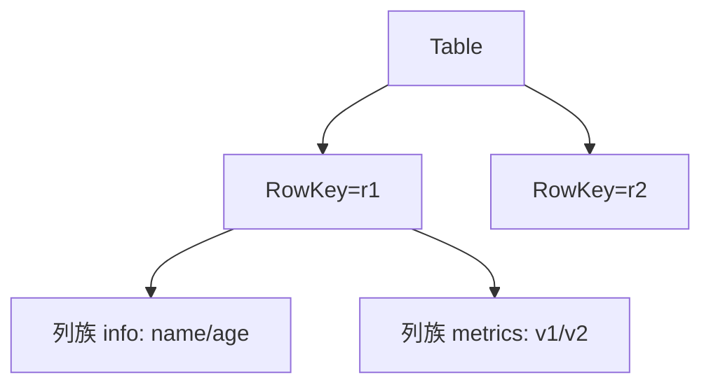
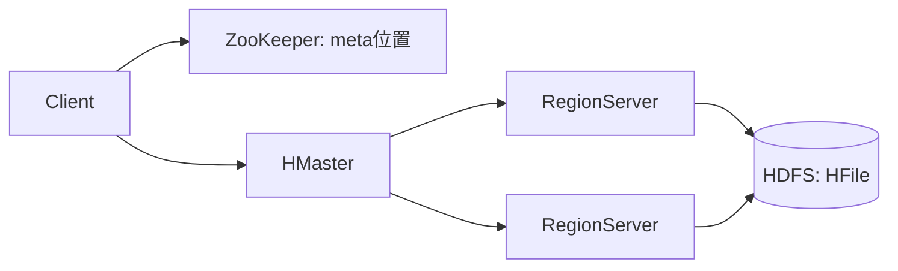

# 大数据 · 06 分布式 NoSQL 与 HBase

> 当数据量超出单机关系库、又需要**低延迟随机读写 + 水平扩展**时，列式 NoSQL（HBase/Cassandra）登场。HBase 用 LSM 树 + 有序列式存储，在 HDFS 之上提供百亿级宽表的毫秒读写。

本篇讲 HBase 架构原理，并对比其他 NoSQL（Cassandra/Redis/MongoDB）定位。HDFS 基础见 [04-分布式存储与HDFS](04-分布式存储与HDFS.md)，实时存储另见 Kudu（[04](04-分布式存储与HDFS.md)）。

## 一、HBase 定位与数据模型

- **定位**：构建在 HDFS 之上的**分布式、列式、强一致** NoSQL，Google BigTable 开源实现。
- **适用**：写多读少、海量宽表、按 rowkey 点查/范围扫、近实时。不适合复杂 Join、事务跨行。
- **数据模型**：
  - **表 → 行（RowKey，字典序） → 列族（Column Family） → 列（Qualifier） → 版本（Timestamp）**。
  - 稀疏：空列不占空间；多版本保留（TTL/最大版本数）。

## 二、架构

| 角色 | 职责 | 高可用 |
|------|------|--------|
| HMaster | 元数据、Region 分配、负载均衡 | 主备 |
| RegionServer（RS） | 服务若干 Region，处理读写 | 多节点，故障 Region 迁移 |
| Region | 表水平切分单元（按 RowKey 范围） | 自动分裂/合并 |
| ZooKeeper | 集群协调、RS 存活、meta 位置 | 本身高可用 |
| HDFS | 底层持久化（StoreFile=HFile） | 多副本 |

## 三、读写路径（LSM 核心）

### 3.1 写流程（快，顺序追加）
1. 写 **WAL（HLog）** 预写日志（持久化，防 RS 宕机丢数据）。
2. 写 **MemStore**（内存有序结构）。
3. MemStore 满 → **Flush** 成 HFile 落 HDFS。
4. HFile 累积 → **Compaction**（minor 合并小文件，major 合并清理过期版本）。

> LSM 思想：把随机写转成"内存顺序写 + 后台批量落盘"，极大提升写吞吐（同 [05](05-列式存储与数据湖格式.md) Paimon 的 LSM）。

### 3.2 读流程
- 先查 **BlockCache**（读缓存）→ MemStore → 再查 HFile（用 Bloom Filter 快速判断 key 是否在某文件）。
- 合并多版本返回最新。

### 3.3 Region 分裂
- Region 过大自动按 RowKey 中值分裂为二，实现**水平扩展**；热点 RowKey 会导致"单 Region 过热"（见行键设计）。

## 四、RowKey 设计（最关键的工程决策）

> RowKey 决定分布、热点与查询效率，是 HBase 设计的"命门"。

| 原则 | 做法 | 反例 |
|------|------|------|
| 避免热点 | 加 **加盐/哈希前缀**（如 `hash(userId)%10 + userId`）打散 | 纯时间戳/自增 ID（全写末台 Region） |
| 查询友好 | 把最常用查询维度放前缀，利用字典序范围扫 | 把随机维度前置 |
| 长度适中 | 8~20 字节，过长大占用内存 | 超长字符串 |
| 多维度 | 组合键 `userId + ts` 支持范围查询 | 单一随机键 |

示例：订单查询按 `userId` 聚合 → `saltt=salt(userId) + userId + orderId` 兼顾打散与点查。

## 五、HBase vs 其他 NoSQL

| 组件 | 数据模型 | 强项 | 弱项 | 场景 |
|------|---------|------|------|------|
| HBase | 列式宽表 | 海量、强一致、按 key 毫秒读写 | 无 Join、运维重 | 画像/历史明细/时序 |
| Cassandra | 宽表（最终一致） | 多数据中心、写极高、易扩展 | 一致性弱、读复杂 | 海量写、跨机房 |
| Redis | KV/内存 | 微秒级、丰富结构 | 内存贵、容量有限 | 缓存/计数器（见[redis知识](../redis知识.md)） |
| MongoDB | 文档 | 灵活 schema、聚合 | 海量分析弱 | 业务文档/CMS |
| Elasticsearch | 倒排索引 | 全文检索/聚合 | 写成本较高 | 搜索/日志（见[ES体系](../ES体系.md)） |

## 六、典型用法与踩坑

- **与大数据链路结合**：`MySQL → Canal → Kafka → Flink → HBase`（实时画像宽表）；Hive 外表映射 HBase 做离线分析。
- ⚠️ **踩坑**：
  1. **热点 Region**：RowKey 设计不当，某台 RS 被打爆 → 加盐/预分区。
  2. **Minor 不清理**：major compaction 才删过期/被删数据，需定时触发，否则 HDFS 膨胀。
  3. **小 Cell 过多**：列太多导致 MemStore/BlockCache 压力大。
  4. **ZK 压力大**：Region 数过多（上万）会拖垮 ZK 与 HMaster。

## 七、设计 Checklist

- [ ] RowKey 必须防热点（加盐/哈希）+ 贴合查询（组合键）。
- [ ] 列族不宜多（1~3 个），避免跨 CF 读放大。
- [ ] 设合理 TTL 与最大版本数，防无限增长。
- [ ] 配置 BlockCache 与 MemStore 比例（读多/写多不同调优）。
- [ ] 规划预分区，避免上线后频繁分裂。
- [ ] 监控：Region 均衡、Compaction 积压、RS GC、HDFS 副本。

> 参考：Apache HBase 官方文档（架构/数据模型/RowKey 设计）、Google BigTable 论文、各 NoSQL 对比实践。
