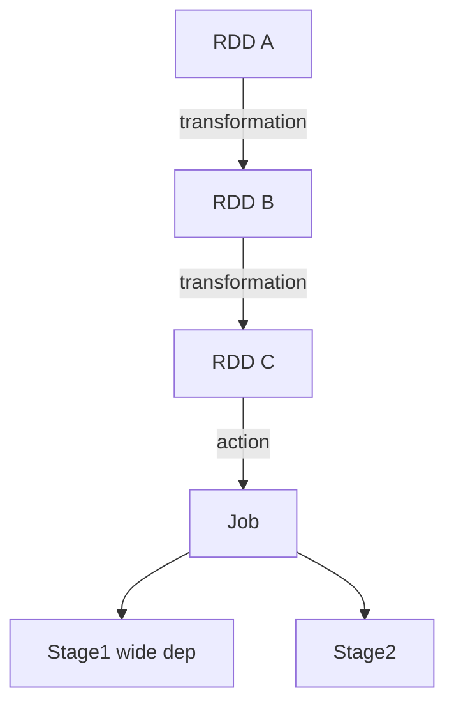
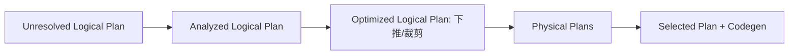

# 大数据 · 07 批处理计算：MapReduce 与 Spark（Shuffle 原理 / RDD-DAG / Catalyst / 内存模型 / 调优）

> 批处理是大数据"算"的起点。MapReduce 用"分而治之"开创了分布式计算范式；Spark 用内存 DAG 把它提速 10~100 倍，成为当今批处理事实标准；Hive 则让 SQL 跑在分布式集群上。本篇深入拆解 MapReduce 原理、Shuffle、Spark 核心、Catalyst 优化器、内存模型与调优。

---

## 一、要解决的问题

| 痛点 | 说明 |
|------|------|
| 单机算不动 | PB 级数据单机处理不了 |
| 分布式编程难 | 并行/容错/调度交给框架 |
| 迭代计算慢 | ML/图算法重复访问中间数据 |
| SQL 门槛 | 分析师用 SQL 分析海量数据 |
| 调优复杂 | Shuffle/OOM/倾斜难排查 |

> 核心认知：**Spark = 「内存 DAG 计算引擎」**——把计算拆成有向无环图（DAG），Stage 间结果缓存在内存，避免 MapReduce 每步落盘的磁盘 IO。

---

## 二、MapReduce：分而治之的鼻祖

### 2.1 计算模型

```mermaid
flowchart LR
    IN[(输入分片)] --> MAP[Map: 逐行 map(k,v)]
    MAP --> SH[Shuffle: 按 key 分区+排序+归并]
    SH --> RED[Reduce: 同 key 聚合]
    RED --> OUT[(输出)]
```

```
Input Split：按块切分，每 split 一个 Map 任务
Map：输入 (k,v) → 输出 (k',v') 列表
Shuffle：按 key 分区、排序、跨节点传输到 Reduce
Reduce：同 key 聚合（sum/count/join）
```

### 2.2 Shuffle（性能瓶颈，深入）

```
Map 端：
  map 输出 → 内存环形缓冲（100MB 默认）
  → 溢出写（spill）到本地磁盘（按分区+排序）
  → merge 合并排序

Reduce 端：
  从各 Map 拉取对应分区数据（fetch）
  归并排序 → 分组 → reduce 函数

Shuffle 代价：
  网络传输 + 磁盘 IO + 序列化
  是 MapReduce 最贵的阶段
  → Spark 用内存/合并优化
```

### 2.3 容错

```
任务失败：JobTracker/ApplicationMaster 重调度
中间结果落盘 → 可重算（不依赖上游）
局限：每步落 HDFS，磁盘 IO 重、迭代计算极慢
```

---

## 三、Spark 核心抽象：RDD（深入）

### 3.1 RDD 特性

```
RDD（弹性分布式数据集）：
  不可变（转换产生新 RDD）
  分区（Partition 并行单元）
  可并行计算

"弹性"三性：
  容错：血缘（Lineage）自动重建
  持久化：可存内存/磁盘
  惰性：转换延迟执行
```

### 3.2 血缘（Lineage）

```
每个 RDD 记录父 RDD + 转换操作
失败时：沿血缘重算（不用备份所有数据）

缓存 vs 血缘：
  缓存：占用存储，但恢复快
  血缘：无存储开销，但重算慢
  高频复用 → 缓存；低频 → 血缘
```

### 3.3 DAG 与执行模型



```
Transformation（懒执行）：map/filter/flatMap/groupByKey/join
  只记录血缘，不立即算
Action（触发）：count/collect/save → 提交 Job

Stage 划分：
  以 Shuffle（宽依赖）为界切分 Stage
  窄依赖（map）→ 管道化并行（无 shuffle）
  宽依赖（groupBy）→ 需要 shuffle

宽窄依赖：
  窄依赖：父 RDD 分区只被子 RDD 一个分区使用（map/filter）
  宽依赖：父 RDD 分区被多个子分区使用（groupBy/join）→ 必须 shuffle
```

---

## 四、Spark SQL 与 Catalyst 优化器

### 4.1 RDD / DataFrame / Dataset 区别

| 维度 | RDD | DataFrame | Dataset |
|------|-----|-----------|---------|
| 类型 | 非结构化 JVM 对象 | 命名列（Row） | 强类型 JVM 对象 |
| 优化 | 无（算子级） | **Catalyst 全优化** | Catalyst + 类型安全 |
| 语言 | Java/Scala/Py | 全语言 | Scala/Java |
| 序列化 | Java/Kryo | **Tungsten 二进制** | Tungsten 二进制 |
| 适用 | 底层控制/非结构化 | 大部分 SQL/ETL | 需类型安全的 Scala |

> 优先用 DataFrame/Dataset：Catalyst + Tungsten 让执行快且省内存；RDD 仅用于 Catalyst 不支持的场景。

### 4.2 Catalyst 流程

```
SQL/DF → 逻辑计划 → 分析（绑定 Catalog）
→ 逻辑优化（谓词下推/列裁剪/常量折叠）
→ 物理计划（CBO 选 Join 策略）
→ 代码生成（Whole-Stage Codegen）
```



```
常见优化：
  谓词下推到数据源（只读需要行）
  列裁剪（只读需要的列 → 少 IO）
  广播 Join（小表广播避免 shuffle）
  空值传播、子表达式消除
```

### 4.3 Tungsten（内存优化）

```
堆外内存 + 二进制执行 + 代码生成
  对象直接存二进制（避免 JVM 对象开销）
  Cache Line 友好、GC 压力小
  Whole-Stage Codegen：把算子合并为一段代码（避免虚函数调用）
```

---

## 五、内存模型与执行

### 5.1 内存划分（Spark 内存管理）

```
Executor 内存 = 堆内存（spark.executor.memory）+ 堆外（off-heap）

堆内划分：
  Storage（缓存 RDD）默认 50%
  Execution（shuffle 等）默认 50%（动态共享）
  User（用户对象）
  Reserved（保留）

动态调整：
  storage 与 execution 可互相借用（spark.memory.offHeap.enabled）
  任务结束归还

说明：
  Spark 3.x 用 Unified Memory（统一内存）
  Execution 优先级更高（防 shuffle OOM）
```

### 5.2 执行模式

```
调度：Job → Stage → Task（每个分区一个 Task）
Task 在 Executor 上执行（Executor 常驻，Driver 调度）

Executor：
  运行在 Worker 节点（YARN/K8s/Standalone）
  常驻 → 多 Job 复用（避免 MR 每次起进程）
  线程池并行执行 Task
```

---

## 六、Shuffle 深入与调优

### 6.1 Shuffle 机制（Spark）

```
Spark Shuffle 演进：
  Hash Shuffle（旧）：每 map 每 reduce 一个文件（文件数爆炸）
  Sort Shuffle（默认）：按分区排序合并成少量文件（高效）

过程：
  map 端：Shuffle Write（内存排序 → 溢出文件 → 合并）
  reduce 端：Shuffle Read（拉取 → 归并 → 聚合）

说明：
  聚合类算子（reduceByKey）在 map 端做 combine（预聚合）
  → 减少网络传输
```

### 6.2 关键参数

| 参数 | 说明 | 建议 |
|------|------|------|
| spark.sql.shuffle.partitions | shuffle 分区数 | 默认 200，按数据量调大到 2000+ |
| spark.shuffle.file.buffer | 写缓冲 | 默认 32KB |
| spark.reducer.maxSizeInFlight | 读并发 | 默认 48MB |
| spark.shuffle.compress | 压缩 | 默认 true |

### 6.3 数据倾斜治理

```
倾斜表现：某 Task 处理大量数据 → 拖慢整体（长尾）

治理：
  1. 热点 key 加盐打散再聚合（两阶段聚合）
  2. 小表广播（broadcast hint）避免 shuffle join
  3. skew hint（Spark 3 AQE 自动处理）
  4. 隔离热点 key（单独处理）
```

### 6.4 AQE 自适应查询（Spark 3+）

```
运行时根据 shuffle 统计量动态调整：
  ① 合并小分区（减少 Task 数）
  ② 倾斜 Join 自动加盐
  ③ 选更佳 Join 策略（sort-merge → broadcast）

开启：spark.sql.adaptive.enabled=true（默认开）
收益：大幅降低调参负担
```

---

## 七、Hive：SQL on Hadoop

### 7.1 原理

```
把 HiveQL（类 SQL）编译为 MapReduce/Tez/Spark 任务执行
Metastore（HMS）：存表结构、分区、列信息（大数据元数据枢纽）
执行引擎可换：hive.execution.engine = mr/tez/spark（生产用 Spark/Tez）

表与分区：
  CREATE TABLE ... PARTITIONED BY (dt STRING)
  分区 = 目录切分（dt=2026-07-28），查询下推只扫相关目录
  分桶 = 文件内哈希分（CLUSTERED BY），优化 join/采样

文件格式：
  行存 TextFile 慢 → 列存 Parquet/ORC + Snappy/ZSTD
  ACID 事务表（Hive 3+）基于 ORC + 事务管理器
```

### 7.2 Hive 3 ACID

```
功能：MERGE/UPDATE/DELETE（事务表）
实现：ORC + 事务管理器（delta + base 文件）
局限：弱于 Iceberg（无时间旅行/隐藏分区）
适用：低频更新场景
```

---

## 八、流批：Spark Streaming vs Structured Streaming

| 维度 | Spark Streaming（DStream） | Structured Streaming |
|------|---------------------------|---------------------|
| 模型 | 微批（离散化流） | 微批/连续（DataFrame 流） |
| API | RDD | DataFrame/SQL，批流统一 |
| 语义 | 至少一次/精确一次（WAL） | **端到端精确一次** |
| 水位/事件时间 | 弱 | **强（Event Time + Watermark）** |

> 新项目一律用 **Structured Streaming**：同一 DataFrame API 既跑批又跑流。

---

## 九、OOM 排查与调优

| 现象 | 原因 | 处理 |
|------|------|------|
| Executor OOM | 数据倾斜/分区过大 | 增分区数、加盐、调 `spark.executor.memory` |
| GC 长停顿 | 堆大/对象多 | 用 Kryo、堆外、降 `executor.memory` 增 `overhead` |
| 超限被 KILL | `memoryOverhead` 不足 | 调 `spark.kubernetes.memoryOverhead` |
| 驱动 OOM | `collect` 大结果 | 避免 collect，用 `write` 落盘 |

```
排查思路：
  1. 看 Web UI：Executor 内存/GC/Shuffle 读写
  2. 定位热点 Task（倾斜？）
  3. 检查分区数（太少 → 单个 Executor 处理太多）
  4. 检查序列化（Kryo vs Java）

口诀：分区数 ≥ 2×核数、避免 collect 大表、倾斜必治理、AQE 必开
```

---

## 十、MapReduce vs Spark 速查

| 维度 | MapReduce | Spark |
|------|-----------|-------|
| 速度 | 慢（每步落盘） | 快（内存 DAG，10~100×） |
| 迭代/ML | 极差 | 优 |
| API | 底层 Java | Scala/Java/Python + SQL |
| 容错 | 重算（落盘） | lineage + 缓存 |
| 现状 | legacy，仅兼容 | 批处理标准 |

---

## 十一、批处理设计 Checklist

- [ ] 新作业用 Spark（SQL/DataFrame），弃用裸 MR。
- [ ] 表用 Parquet/ORC 列式 + 合理压缩；按业务时间分区。
- [ ] 减少 shuffle：combine 前置、广播小表、控制倾斜。
- [ ] 复用 RDD/中间表（`persist` + 物化宽表），但防内存爆。
- [ ] Hive Metastore 统一元数据，表格式优先 Iceberg 以获得 ACID。
- [ ] 开 AQE，调 `shuffle.partitions`。
- [ ] OOM 看倾斜/分区/overhead；勿 collect 大结果。
- [ ] Structured Streaming 做流，配 Watermark + 精确一次 Sink。
- [ ] 监控：stage 耗时、shuffle 读写、数据倾斜、Executor GC。

---

## 十二、Spark Shuffle 深入原理

### 12.1 Sort Shuffle 写入流程

```
Spark Sort Shuffle（默认）：
  1. 每个 Task 写入内存缓冲（spark.shuffle.file.buffer，默认 32KB）
  2. 内存满 → 排序后溢出到磁盘文件（按分区排序）
  3. 合并（merge）多个溢出文件 → 一个分区一个文件
  4. 写索引文件（记录每个分区在数据文件中的 offset）

关键参数：
  spark.shuffle.spill.numElementsForceSpillThreshold
    → 内存中元素数超阈值强制溢出（防 OOM）
```

### 12.2 Tungsten Shuffle

```
Tungsten（钨丝）优化：
  堆外内存直接写入（避免 GC）
  二进制排序（Unsafe.sort）
  零拷贝序列化（ مباشرة写入磁盘）

配置：
  spark.shuffle.spill.compress=true（压缩溢出文件）
  spark.io.compression.codec=lz4/zstd
```

### 12.3 Shuffle 优化参数

| 参数 | 默认值 | 建议 | 说明 |
|------|--------|------|------|
| `spark.sql.shuffle.partitions` | 200 | 按数据量调（2000+） | Shuffle 分区数 |
| `spark.shuffle.file.buffer` | 32KB | 64KB~128KB | 写缓冲 |
| `spark.reducer.maxSizeInFlight` | 48MB | 96MB | 读并发 |
| `spark.shuffle.compress` | true | true | 压缩 |
| `spark.shuffle.sort.bypassMergeThreshold` | 400 | 按需调 | 短路排序阈值 |

## 十三、Spark 内存管理深入

### 13.1 统一内存管理（Unified Memory）

```
Spark 3.x Unified Memory：
  Storage（缓存 RDD/DataFrame）和 Execution（Shuffle/Join）动态共享
  
  Storage 优先级 < Execution（Execution 可以"借用" Storage）
  Storage 借用 Execution 时会触发 eviction（驱逐缓存数据）
  
  spark.memory.fraction = 0.6（可用内存占堆的 60%）
  spark.memory.storageFraction = 0.5（Storage 初始占比 50%）
```

### 13.2 堆外内存（Off-Heap）

```
堆外内存优势：
  不受 GC 管理，减少 GC 停顿
  内存直接由 OS 管理
  适合大状态/大 Shuffle

配置：
  spark.memory.offHeap.enabled=true
  spark.memory.offHeap.size=4g
  
注意：
  堆外内存不计入 -Xmx
  需额外预留内存给堆外
  spark.kubernetes.memoryOverhead 需包含堆外
```

## 十四、Spark Speculative Execution

### 14.1 原理

```
推测执行 = 对"慢节点"启动备份任务，先完成的结果生效

检测条件：
  Task 运行时间 > 1.5 × 中位数
  且失败次数 < spark.speculative.maxFailedTasks

配置：
  spark.speculation.enabled=true
  spark.speculation.multiplier=1.5
  spark.speculation.quantile=0.75
```

### 14.2 适用与限制

| 适用 | 不适用 |
|------|--------|
| 非确定性计算（网络抖动） | 有状态计算（幂等性不确定） |
| 外部服务调用慢 | 写操作（可能双写） |
| 纯 CPU 计算受节点性能影响 | 依赖外部锁的操作 |

## 十五、Spark 数据倾斜治理

### 15.1 倾斜检测

```scala
// 检测数据倾斜
df.groupBy("key").count().orderBy(desc("count")).show(20)
// 看是否有某些 key 数量远超其他
```

### 15.2 治理方案

| 方案 | 做法 | 适用 |
|------|------|------|
| 两阶段聚合 | 先加盐聚合，再去盐聚合 | Group By 倾斜 |
| 广播小表 | `broadcast(hint)` 避免 Shuffle | Join 倾斜 |
| AQE 自动处理 | Spark 3+ 自动加盐 | 通用 |
| 隔离热点 Key | 单独处理热点，再 Union | 热点 Key 有限 |
| 重分区 | 按倾斜 Key 手动分区 | 预知倾斜 Key |

```scala
// 两阶段聚合
val salted = df.withColumn("salt", (rand() * 10).cast("int"))
val partial = salted.groupBy("key", "salt").agg(sum("amount").as("partial_sum"))
val result = partial.groupBy("key").agg(sum("partial_sum").as("total"))

// 广播 Join
val result = df1.join(broadcast(df2), "key")
```

## 十六、Spark on YARN vs Kubernetes

| 维度 | Spark on YARN | Spark on K8s |
|------|---------------|--------------|
| 资源管理 | YARN ResourceManager | K8s Scheduler |
| 动态分配 | YARN Container 动态申请 | K8s Pod 动态扩缩 |
| 状态管理 | 依赖 YARN | 状态外置对象存储 |
| 弹性 | 弱（队列静态） | 强（HPA/KEDA） |
| 运维 | Hadoop 运维 | K8s 运维 |
| 存算分离 | 耦合 | 分离 |

```bash
# Spark on K8s 提交
spark-submit \
  --master k8s://https://k8s:6443 \
  --deploy-mode cluster \
  --conf spark.kubernetes.container.image=spark:3.5 \
  --conf spark.kubernetes.namespace=spark-jobs \
  --num-executors 10 \
  --executor-memory 4g \
  --executor-cores 2 \
  local:///opt/spark/examples/jars/spark-examples.jar
```

## 十七、Spark Dynamic Allocation

### 17.1 原理

```
动态分配 = 按需增减 Executor

触发扩容：
  待处理 Task 数 > 已有 Executor × spark.dynamicAllocation.executorIdleTimeout

触发缩容：
  Executor 空闲时间 > spark.dynamicAllocation.executorIdleTimeout

配置：
  spark.dynamicAllocation.enabled=true
  spark.dynamicAllocation.minExecutors=2
  spark.dynamicAllocation.maxExecutors=20
  spark.dynamicAllocation.executorIdleTimeout=60s
  spark.shuffle.service.enabled=true（外部 Shuffle 服务）
```

## 十八、Spark vs Presto/Trino 对比

| 维度 | Spark | Presto/Trino |
|------|-------|--------------|
| 定位 | 批处理（ETL） | 交互式查询（OLAP） |
| 延迟 | 分钟~小时 | 秒~分钟 |
| 状态 | 有状态（Shuffle） | 无状态 |
| 容错 | 血缘重算 | 无（查询失败重试） |
| 数据量 | PB 级 | TB~PB |
| SQL 完整性 | DataFrame/SQL | 纯 SQL |
| 适用 | ETL/数据清洗/ML | 即席查询/BI |

```
选型口诀：
  批处理 ETL → Spark
  即席查询 BI → Presto/Trino
  两者互补（ETL 用 Spark 产出宽表，查询用 Presto/Trino）
```

## 十八、Spark 性能调优深度补充

### 18.1 Catalyst 优化器原理

```
Catalyst 优化流程：
  SQL / DataFrame API → 逻辑计划 → 优化逻辑计划 → 物理计划 → 代码生成 → RDD

四个阶段：
  1. Analysis（分析）：
     解析 SQL，绑定元数据（表/列/类型）
     输出：未解析的逻辑计划 → 解析后的逻辑计划

  2. Optimization（优化）：
     谓词下推（Predicate Pushdown）
     列裁剪（Column Pruning）
     常量折叠（Constant Folding）
     等值传播（Equality Propagation）
     输出：优化后的逻辑计划

  3. Physical Planning（物理计划）：
     生成多个物理计划（Hash Join / Sort Merge Join / Broadcast Join）
     基于成本模型（CBO）选择最优
     输出：最优物理计划

  4. Code Generation（代码生成）：
     Tungsten 引擎：生成 JVM 字节码
     全stage代码生成：Whole-Stage Code Generation
     减少虚函数调用，提高 CPU 缓存命中率
```

### 18.2 Tungsten 内存管理

```
Tungsten = Spark 底层执行引擎优化

核心优化：
  1. 二进制行格式（Binary Row Format）：
     - 对象 → 二进制（off-heap）
     - 减少 GC 压力
     - 减少序列化开销

  2. 全 Stage 代码生成（Whole-Stage Code Generation）：
     - 多个操作合并为一个代码段
     - 消除虚函数调用
     - 利用 CPU SIMD 指令

  3. 向量化执行（Vectorized Execution）：
     - 批量处理（1024 行/批）
     - 列式存储访问
     - 利用 CPU 缓存行

内存结构：
  Task Memory = Execution Memory + Storage Memory
  Execution Memory：Shuffle/Join/Sort/Agg
  Storage Memory：缓存/Persist
  两者可互相借用（Execution 优先）
```

### 18.3 Shuffle Spill 调优

```
Shuffle Spill = 当内存不足时，将数据溢写到磁盘

触发条件：
  execution memory > 可用内存
  默认：spark.sql.shuffle.partitions=200

调优策略：
  1. 增加分区数：
     spark.sql.shuffle.partitions=1000（小文件增多，但减少 spill）

  2. 调整内存比例：
     spark.memory.fraction=0.8（执行+存储占堆内存 80%）
     spark.memory.storageFraction=0.5（存储占执行+存储的 50%）

  3. 压缩 Spill 文件：
     spark.shuffle.spill.compress=true
     spark.io.compression.codec=lz4

  4. 外部排序器：
     spark.shuffle.sort.bypassMergeThreshold=400
     小数据量不排序直接合并

监控指标：
  Shuffle Read/Write：spark.eventLog → Stage 详情
  Spill Size：看是否有大量 spill（越大性能越差）
  Sort Time：排序耗时
```

### 18.4 数据倾斜解决方案

```
数据倾斜 = 某个/些 Key 的数据量远超其他 Key

检测方法：
  1. Spark UI → Stage → Task Duration 分布（是否极不均匀）
  2. Spark UI → Stage → Shuffle Read/Write 分布
  3. explain(true) 查看执行计划

解决方案：
  1. 两阶段聚合（推荐）：
     先按 Key + 随机前缀分组聚合
     再去掉前缀，二次聚合

  2. Broadcast Join（小表广播）：
     spark.sql.autoBroadcastJoinThreshold=10MB
     小表广播避免 Shuffle

  3. 调整分区数：
     增加 shuffle.partitions → 更多分区 → 更均匀

  4. 自定义 Partitioner：
     对倾斜 Key 重新分区（加盐/拆分）

  5. AQE（Adaptive Query Execution，Spark 3.0+）：
     spark.sql.adaptive.enabled=true
     自动合并小分区
     自动调整 Shuffle 分区数
     自动切换 Join 策略
```

### 18.5 Spark on Kubernetes

```
部署模式：
  Client Mode：Driver 在客户端，Executor 在 K8s
  Cluster Mode：Driver 和 Executor 都在 K8s（推荐生产）

配置：
  spark.master=k8s://https://k8s-master:6443
  spark.kubernetes.container.image=spark:3.5
  spark.kubernetes.namespace=spark
  spark.dynamicAllocation.enabled=true
  spark.dynamicAllocation.shuffleTracking.enabled=true

优势：
  资源隔离（不同 Spark 应用不同 namespace）
  弹性扩缩（K8s HPA + Spark Dynamic Allocation）
  混合部署（Spark + Flink + 其他应用共享集群）
  云原生（与云服务集成）

注意事项：
  需要持久卷（PV/PVC）用于 Shuffle/Checkpoint
  镜像需要包含 Spark + 依赖
  K8s RBAC 权限配置
```

### 18.6 Spark Dynamic Allocation

```
动态资源分配 = 根据工作负载自动调整 Executor 数量

配置：
  spark.dynamicAllocation.enabled=true
  spark.dynamicAllocation.minExecutors=2
  spark.dynamicAllocation.maxExecutors=100
  spark.dynamicAllocation.initialExecutors=10
  spark.dynamicAllocation.executorIdleTimeout=60s
  spark.dynamicAllocation.schedulerBacklogTimeout=1s

触发扩缩条件：
  扩容：有 pending task（待执行任务）且空闲 Executor 不足
  缩容：Executor 空闲超过 60s

Shuffle Tracking（Spark 3.0+）：
  通过 Shuffle 数据跟踪 Executor 是否可回收
  避免回收后 Shuffle 数据丢失导致全量重算
  spark.dynamicAllocation.shuffleTracking.enabled=true
```

### 18.7 Spark vs Presto/Trino 对比

| 维度 | Spark SQL | Presto/Trino |
|------|-----------|--------------|
| 模型 | 批处理（写结果到存储） | MPP（内存计算返回结果） |
| 延迟 | 秒~分钟 | 毫秒~秒 |
| 数据量 | TB~PB 级 | GB~TB 级 |
| 容错 | 高（Stage 级重试） | 低（Task 失败重试） |
| 状态 | 有状态（Shuffle） | 无状态 |
| 连接器 | 丰富（JDBC/HDFS/Hive） | 丰富（JDBC/Hive/Kafka） |
| 适用 | ETL/复杂查询/ML | 即席查询/BI/交互分析 |
| 资源 | 重（需要 YARN/K8s） | 轻（独立部署） |

```
选型建议：
  ETL 批处理 → Spark
  即席查询 BI → Presto/Trino
  实时查询 → Presto/Trino
  ML Pipeline → Spark
  两者互补：Spark 产出宽表，Presto 查询
```

## Spark Shuffle 内存管理（ExternalSorter/ShuffleExternalSorter）

```
Shuffle 写入内存管理：

  ExternalSorter：
    接收 map 端输出的 (key, value) 对
    在内存中排序（可选 combine 预聚合）
    内存满 → 溢写到磁盘（spill）
    最终合并（merge）为排序后的分区文件

  ShuffleExternalSorter：
    Tungsten 优化版本
    堆外内存直接写入（避免 GC）
    二进制排序（Unsafe.sort）
    零拷贝序列化

  内存管理流程：
    1. 申请内存（execution memory pool）
    2. 写入内存缓冲（spark.shuffle.file.buffer）
    3. 内存满 → 排序 → 溢写到磁盘
    4. 溢写文件合并 → 一个分区一个文件
    5. 写索引文件（记录分区 offset）
```

## 数据倾斜解决方案大全（salting/broadcast/adaptive skew join）

```
方案一：两阶段聚合（推荐）
  先按 Key + 随机前缀分组聚合
  再去掉前缀，二次聚合

方案二：Broadcast Join（小表广播）
  spark.sql.autoBroadcastJoinThreshold=10MB
  小表广播避免 Shuffle

方案三：AQE 自适应（Spark 3.0+）
  spark.sql.adaptive.enabled=true
  自动合并小分区+倾斜自动处理

方案四：隔离热点 Key
  单独处理热点，再 Union

方案五：自定义 Partitioner
  对倾斜 Key 重新分区（加盐/拆分）

检测方法：
  Spark UI → Stage → Task Duration 分布（极不均匀 = 倾斜）
  df.groupBy("key").count().orderBy(desc("count")).show(20)
```

## Spark speculative execution 配置与调优

```
推测执行 = 对慢节点启动备份任务，先完成的结果生效

检测条件：
  Task 运行时间 > 1.5 × 中位数
  且失败次数 < spark.speculative.maxFailedTasks

配置：
  spark.speculation.enabled=true
  spark.speculation.multiplier=1.5      # 慢任务判定倍数
  spark.speculation.quantile=0.75       # 分位数
  spark.speculation.maxFailedTasks=3    # 最大失败次数

适用：非确定性计算（网络抖动/外部服务慢）
不适用：有状态计算/写操作（可能双写）
```

## Spark on K8s 资源分配最佳实践（executor-core/memory 计算公式）

```
资源分配公式：

  executor-cores：
    推荐 2~5 核/executor
    过多 → GC 压力大
    过少 → 线程切换开销

  executor-memory：
    = spark.executor.memory + spark.executor.memoryOverhead
    overhead = max(executor-memory × 0.1, 384MB)
    
  executor 数量：
    = min(集群总核数 / executor-cores, maxExecutors)
    
  分区数（shuffle.partitions）：
    = 输入数据量 / 128MB（推荐）
    ≥ 2 × executor 总核数

示例（100 核集群）：
  executor-cores=4, executor-memory=8g
  executor 数 = 100 / 4 = 25
  shuffle.partitions = 2000
```

## Spark 动态资源分配（shuffle tracking）

```
动态资源分配 = 根据工作负载自动调整 Executor 数量

配置：
  spark.dynamicAllocation.enabled=true
  spark.dynamicAllocation.minExecutors=2
  spark.dynamicAllocation.maxExecutors=100
  spark.dynamicAllocation.executorIdleTimeout=60s

Shuffle Tracking（Spark 3.0+）：
  通过 Shuffle 数据跟踪 Executor 是否可回收
  避免回收后 Shuffle 数据丢失导致全量重算
  spark.dynamicAllocation.shuffleTracking.enabled=true

触发条件：
  扩容：有 pending task 且空闲 Executor 不足
  缩容：Executor 空闲超过 60s
```

## 十九、Shuffle 内存管理（ExternalSorter Spill 策略 / UnifiedMemoryManager）

### 19.1 Shuffle 内存管理机制

| 组件 | 功能 | 内存管理策略 |
|------|------|-------------|
| ExternalSorter | Shuffle 写端排序 | 内存→磁盘 Spill |
| UnifiedMemoryManager | 统一内存管理 | Storage/Execution 动态共享 |
| UnsafeExternalSorter | 外部排序器 | 内存+磁盘混合排序 |
| SortBasedShuffleWriter | 排序写入 | 按分区排序写入 |

### 19.2 ExternalSorter Spill 策略

```text
Spill 策略：
  1. 内存缓冲区满（spark.shuffle.spill.batchSize）
  2. 排序后写入磁盘临时文件
  3. 最终合并多个临时文件（Merge）
  4. 压缩（spark.shuffle.compress=true）

配置参数：
  spark.shuffle.spill.batchSize=10000    # 每批写入条数
  spark.shuffle.spill.initialBuffer=32768 # 初始缓冲区大小
  spark.shuffle.sort.bypassMergeThreshold=400  # 直接排序阈值
```

### 19.3 UnifiedMemoryManager 内存分配

```text
UnifiedMemoryManager 内存分配：
  总可用内存 = JVM Heap - 300MB (Reserved)
  
  Storage 内存：缓存 RDD/DataFrame
  Execution 内存：Shuffle/Join/Sort/Aggregation
  
  动态共享：
    Storage 可借用 Execution 空闲内存
    Execution 可借用 Storage 空闲内存
    互相借用优先级由 spark.memory.storageFraction 控制

配置参数：
  spark.memory.fraction=0.6           # 总可用内存比例
  spark.memory.storageFraction=0.5    # Storage 默认占比
```

## 二十、数据倾斜解决方案大全（Salting / Broadcast Join / AFS / AQE Skew Join）

### 20.1 数据倾斜识别

```text
数据倾斜信号：
  1. Stage 中某 Task 执行时间远超其他 Task
  2. Shuffle Read/Write 数据量分布极不均匀
  3. 某个 Stage 长时间卡在 99% 进度

诊断方法：
  Spark UI → Stages → 查看各 Task 的 Shuffle Read/Write
  如果某 Task 的 Shuffle Read 是平均值的 10 倍以上 → 倾斜
```

### 20.2 解决方案对比

| 方案 | 原理 | 适用场景 | 优点 | 缺点 |
|------|------|---------|------|------|
| Salting | 给 Key 加随机后缀打散 | Shuffle Join | 简单有效 | 增加 Shuffle 量 |
| Broadcast Join | 小表广播避免 Shuffle | 大小表 Join | 无 Shuffle | 受内存限制 |
| AQE Skew Join | 自动检测倾斜并拆分 | 已知倾斜 | 自动化 | 需 Spark 3.0+ |
| 两阶段聚合 | 局部聚合 + 全局聚合 | GroupBy 聚合 | 效果好 | 需改代码 |
| 自定义 Partitioner | 自定义分区逻辑 | 已知倾斜 Key | 精确控制 | 需改代码 |

### 20.3 Salting 实现

```scala
// Salting 打散倾斜 Key
val saltedDf = df.withColumn("salt", (rand() * 10).cast("int"))
  .withColumn("salted_key", concat(col("key"), lit("_"), col("salt")))

// 两阶段聚合
val partialAgg = saltedDf.groupBy("salted_key").agg(sum("value").as("partial_sum"))
val finalAgg = partialAgg.withColumn("key", split(col("salted_key"), "_")(0))
  .groupBy("key").agg(sum("partial_sum").as("total_sum"))
```

### 20.4 AQE Skew Join 配置

```scala
// AQE 自动处理倾斜
spark.conf.set("spark.sql.adaptive.enabled", true)
spark.conf.set("spark.sql.adaptive.skewJoin.enabled", true)
spark.conf.set("spark.sql.adaptive.skewJoin.skewedPartitionFactor", 5)
spark.conf.set("spark.sql.adaptive.skewJoin.skewedPartitionThresholdInBytes", 256 * 1024 * 1024)
```

## 二十一、Spark Speculative Execution 配置与调优

### 21.1 推测执行原理

```text
推测执行（Speculative Execution）：
  当某个 Task 执行时间明显慢于其他 Task 时
  Spark 会在另一个节点上启动该 Task 的副本
  先完成的结果被采用，慢的被取消

适用场景：
  - 数据倾斜（部分分区数据量大）
  - 节点硬件差异（慢节点）
  - 网络抖动（偶发慢）
```

### 21.2 配置参数

| 参数 | 默认值 | 说明 |
|------|--------|------|
| `spark.speculation` | false | 是否开启推测执行 |
| `spark.speculation.multiplier` | 3 | 任务耗时倍数（超过中位数） |
| `spark.speculation.quantile` | 0.75 | 分位数（超过该分位数才推测） |
| `spark.speculation.interval` | 100ms | 检查间隔 |

```scala
// 推测执行配置
spark.conf.set("spark.speculation", true)
spark.conf.set("spark.speculation.multiplier", 3)
spark.conf.set("spark.speculation.quantile", 0.75)
```

## 二十二、Spark on K8s 资源分配公式

### 22.1 资源分配计算

```text
Executor 数量 = ceil(总核心数 / Executor 核心数)
  总核心数 = 集群总核心数 × spark.dynamicAllocation.maxExecutors

Executor 内存 = Driver 内存 × 2（经验值）
  Driver 内存 = 4GB（默认）/ 大作业 8~16GB

每个 Executor 核心数 = 4~5（推荐）
  过多 → GC 压力大
  过少 → 并行度不够

总内存 = Executor 数量 × Executor 内存
```

### 22.2 推荐配置

| 作业类型 | Executor 核心数 | Executor 内存 | Driver 内存 |
|----------|----------------|--------------|------------|
| 小作业 | 4 | 8GB | 4GB |
| 中等作业 | 4 | 16GB | 8GB |
| 大作业 | 5 | 32GB | 16GB |
| 流式作业 | 4 | 16GB | 8GB |

## 二十三、Spark 动态资源分配（Shuffle Tracking 模式）

### 23.1 Shuffle Tracking 原理

```text
Shuffle Tracking：
  基于 Shuffle 数据的存活状态决定 Executor 是否可回收
  如果 Executor 上有未完成的 Shuffle 数据 → 保留
  如果 Executor 上的 Shuffle 数据已被其他 Executor 读取 → 可回收

优势：
  - 比固定超时更精确
  - 避免频繁扩缩
  - 资源利用率更高
```

### 23.2 配置

```scala
spark.conf.set("spark.dynamicAllocation.enabled", true)
spark.conf.set("spark.dynamicAllocation.shuffleTracking.enabled", true)
spark.conf.set("spark.dynamicAllocation.minExecutors", 2)
spark.conf.set("spark.dynamicAllocation.maxExecutors", 20)
spark.conf.set("spark.dynamicAllocation.executorIdleTimeout", "60s")
```

## 二十四、Spark 历史服务器排查步骤

### 24.1 排查流程

```text
Spark 历史服务器排查步骤：
  1. 访问 History Server UI（默认 18080 端口）
  2. 找到目标作业 → 查看 Overview
  3. 检查 Stage 信息：
     - 哪个 Stage 耗时最长？
     - 各 Task 的 Shuffle Read/Write 是否均匀？
     - GC 时间占比是否过高？
  4. 检查 SQL 信息：
     - 是否有全表扫描？
     - Join 策略是否合理？
  5. 检查 Event Timeline：
     - 是否有长时间等待？
     - 是否有任务失败重试？
```

### 24.2 常见问题诊断

| 问题现象 | 可能原因 | 排查方向 |
|----------|---------|---------|
| Stage 耗时极长 | 数据倾斜 | 检查 Task 数据量分布 |
| GC 时间 > 50% | 内存不足 | 增大 Executor 内存 |
| Shuffle Read 异常大 | Shuffle 数据膨胀 | 检查 Shuffle 分区数 |
| Task 频繁失败 | 资源不足/网络问题 | 检查 Executor 日志 |
| 作业卡住不动 | 死锁/资源争抢 | 检查 Spark UI DAG |

## 二十五、Shuffle外部排序器深度解析

### 25.1 ExternalSorter工作原理

```text
ExternalSorter = Shuffle写端的核心排序组件

工作流程：
  1. 接收map端输出的(key, value)对
  2. 在内存中排序（可选combine预聚合）
  3. 内存满 → 溢写到磁盘（spill）
  4. 最终合并（merge）为排序后的分区文件

内存管理：
  申请内存：execution memory pool
  缓冲区：spark.shuffle.file.buffer（默认32KB）
  溢写阈值：内存占用超过execution memory pool可用空间

Spill触发条件：
  内存占用 > execution memory pool可用空间
  默认：spark.sql.shuffle.partitions=200
  每个Task独占一个内存分区
```

### 25.2 Spill阈值调优

```properties
# Spill阈值配置
spark.shuffle.spill.batchSize=10000           # 每批写入条数
spark.shuffle.spill.initialBuffer=32768       # 初始缓冲区大小
spark.shuffle.spill.numElementsForceSpillThreshold=1000000  # 强制溢出阈值

# Spill文件压缩
spark.shuffle.spill.compress=true             # 压缩spill文件
spark.io.compression.codec=lz4/zstd           # 压缩算法

# Spill合并策略
spark.shuffle.sort.bypassMergeThreshold=400   # 直接排序阈值
# 当分区数 < 阈值时，不排序直接合并（减少排序开销）

# 监控Spill
# Spark UI → Stage → Tasks → 查看Spill Size
# 如果Spill Size很大 → 增加内存或分区数
```

### 25.3 内存管理优化

```text
内存管理优化策略：

  增加分区数：
    spark.sql.shuffle.partitions=1000
    每个Task处理更少数据 → 减少spill

  调整内存比例：
    spark.memory.fraction=0.8（执行+存储占堆内存80%）
    spark.memory.storageFraction=0.5（存储占执行+存储的50%）

  使用堆外内存：
    spark.memory.offHeap.enabled=true
    spark.memory.offHeap.size=4g
    避免GC压力

  监控指标：
    Shuffle Read/Write：spark.eventLog → Stage详情
    Spill Size：看是否有大量spill（越大性能越差）
    Sort Time：排序耗时
```

## 二十六、广播Join（BroadcastHashJoin）深度解析

### 26.1 广播Join原理

```text
BroadcastHashJoin = 小表广播到所有Worker，避免Shuffle

工作流程：
  1. Driver收集小表数据
  2. 广播小表到所有Executor
  3. 大表每个分区与广播的小表进行Hash Join
  4. 无需Shuffle，性能优异

适用条件：
  小表大小 < spark.sql.autoBroadcastJoinThreshold（默认10MB）
  大表 JOIN 小表
  网络带宽充足（广播消耗网络）
```

### 26.2 内存限制与调优

```properties
# 广播Join配置
spark.sql.autoBroadcastJoinThreshold=10MB    # 自动广播阈值
spark.sql.broadcastTimeout=300               # 广播超时时间（秒）

# 手动广播
# DataFrame API：df.join(broadcast(df2), "key")
# SQL：/*+ BROADCAST(df2) */

# 内存限制：
# 广播数据占用Driver和Executor内存
# Driver：spark.driver.memory需足够存放小表
# Executor：spark.executor.memory需足够存放广播副本

# 调优建议：
# 1. 小表 < 10MB：自动广播（默认）
# 1. 小表 10MB~100MB：手动广播（需评估内存）
# 2. 小表 > 100MB：避免广播（改用Sort Merge Join）
# 3. 网络带宽：广播消耗带宽，确保网络充足
```

### 26.3 广播Join vs Sort Merge Join对比

| 维度 | BroadcastHashJoin | Sort Merge Join |
|------|-------------------|-----------------|
| 适用条件 | 小表 < 10MB | 任意大小 |
| Shuffle | 无 | 有 |
| 内存消耗 | 高（广播全表） | 中（分区处理） |
| 网络消耗 | 高（广播） | 中（Shuffle） |
| 性能 | 优秀（无Shuffle） | 良好（有Shuffle） |
| 限制 | 小表必须足够小 | 无限制 |

## 二十七、AQE（Adaptive Query Execution）动态优化

### 27.1 AQE三大优化

```text
AQE（自适应查询执行）= 运行时动态优化

优化一：动态合并小分区
  原理：根据Shuffle统计信息，合并过小的分区
  效果：减少Task数量，避免小文件问题
  配置：spark.sql.adaptive.coalescePartitions.enabled=true

优化二：动态Join策略选择
  原理：根据运行时统计信息，选择最优Join策略
  效果：自动切换Broadcast/Sort Merge Join
  配置：spark.sql.adaptive.enabled=true

优化三：Skew Join自动处理
  原理：自动检测数据倾斜并拆分倾斜分区
  效果：避免长尾Task
  配置：spark.sql.adaptive.skewJoin.enabled=true
```

### 27.2 AQE配置详解

```properties
# AQE核心配置
spark.sql.adaptive.enabled=true              # 开启AQE（默认开）
spark.sql.adaptive.coalescePartitions.enabled=true  # 合并小分区
spark.sql.adaptive.coalescePartitions.minPartitionSize=1MB  # 最小分区大小
spark.sql.adaptive.coalescePartitions.initialPartitionNum=200  # 初始分区数

# Skew Join配置
spark.sql.adaptive.skewJoin.enabled=true     # 开启倾斜Join
spark.sql.adaptive.skewJoin.skewedPartitionFactor=5  # 倾斜因子
spark.sql.adaptive.skewJoin.skewedPartitionThresholdInBytes=256MB  # 倾斜阈值

# Join策略选择
spark.sql.adaptive.localShuffleReader.enabled=true  # 本地Shuffle读取

# 监控AQE效果
# Spark UI → SQL → 查看AQE优化详情
# 检查是否合并了小分区
# 检查是否切换了Join策略
```

### 27.3 AQE性能收益

```text
AQE性能收益：

  合并小分区：
    减少Task数量：从2000减少到200
    减少调度开销：Task调度时间减少90%
    提升缓存命中率：更少的Task → 更好的缓存

  动态Join策略：
    自动选择Broadcast Join：避免Shuffle
    性能提升：10-100倍（取决于数据量）

  Skew Join处理：
    避免长尾Task：从小时级减少到分钟级
    提升整体性能：消除倾斜瓶颈

  总体收益：
    调参负担：大幅降低（AQE自动优化）
    查询性能：提升2-10倍
    资源利用率：提升30-50%
```

## 二十八、Spark推测执行深度配置

### 28.1 推测执行原理

```text
推测执行（Speculative Execution）= 对慢节点启动备份任务

工作流程：
  1. 监控Task执行时间
  2. 检测慢Task（运行时间 > 1.5 × 中位数）
  3. 在另一个节点启动备份任务
  4. 先完成的结果被采用，慢的被取消

检测条件：
  Task运行时间 > spark.speculation.multiplier × 中位数
  且失败次数 < spark.speculation.maxFailedTasks

适用场景：
  非确定性计算（网络抖动）
  外部服务调用慢
  纯CPU计算受节点性能影响
```

### 28.2 配置参数详解

```properties
# 推测执行配置
spark.speculation.enabled=true               # 开启推测执行
spark.speculation.multiplier=1.5             # 慢任务判定倍数
spark.speculation.quantile=0.75              # 分位数
spark.speculation.interval=100ms             # 检查间隔
spark.speculation.maxFailedTasks=3           # 最大失败次数

# 调优建议：
# 1. multiplier=1.5（默认）：适中灵敏度
# 2. quantile=0.75：超过75%分位数才推测
# 3. interval=100ms：频繁检查（开销小）
# 4. maxFailedTasks=3：避免无限重试

# 监控推测执行：
# Spark UI → Stages → 查看是否有Speculative任务
# 检查是否有任务被取消（先完成的生效）
```

### 28.3 适用与限制

```text
适用场景：
  非确定性计算（网络抖动/外部服务慢）
  纯CPU计算受节点性能影响
  数据倾斜（部分分区数据量大）

不适用场景：
  有状态计算（幂等性不确定）
  写操作（可能双写）
  依赖外部锁的操作
  确定性计算（结果必须一致）

最佳实践：
  1. 生产环境谨慎开启（可能双写）
  2. 监控推测执行任务数量
  3. 结合AQE使用（AQE处理倾斜更优雅）
  4. 外部写操作确保幂等性
```

## 二十九、Spark on K8s资源分配公式

### 29.1 资源分配计算公式

```text
Executor资源分配公式：

  Executor核心数（executor-cores）：
    推荐：2~5核/executor
    计算：min(可用核心数/预期executor数, 5)
    过多 → GC压力大
    过少 → 线程切换开销

  Executor内存（executor-memory）：
    = spark.executor.memory + spark.executor.memoryOverhead
    overhead = max(executor-memory × 0.1, 384MB)
    推荐：4GB~32GB

  Executor数量：
    = min(集群总核数 / executor-cores, maxExecutors)
    计算：集群总核数 × 动态分配比例

  Driver内存（driver-memory）：
    小作业：4GB
    中等作业：8GB
    大作业：16GB
    计算：取决于collect数据量和广播表大小

  分区数（shuffle.partitions）：
    = 输入数据量 / 128MB（推荐）
    ≥ 2 × executor总核数
    计算：max(输入数据量/128MB, 2 × executor总核数)
```

### 29.2 推荐配置表

| 作业类型 | executor-cores | executor-memory | driver-memory | shuffle.partitions |
|----------|----------------|-----------------|---------------|-------------------|
| 小作业 | 4 | 8GB | 4GB | 200 |
| 中等作业 | 4 | 16GB | 8GB | 500 |
| 大作业 | 5 | 32GB | 16GB | 2000 |
| 流式作业 | 4 | 16GB | 8GB | 200 |
| ML作业 | 4 | 16GB | 8GB | 200 |

### 29.3 资源分配最佳实践

```text
资源分配最佳实践：

  Executor核心数：
    推荐4核（平衡GC和并行度）
    避免超过6核（GC压力大）
    考虑HDFS客户端并发（每executor最多5个并发）

  Executor内存：
    Storage和Execution共享（spark.memory.fraction=0.6）
    预留30%给User Memory和Reserved
    堆外内存：spark.memory.offHeap.size=4g

  Driver内存：
    collect大结果：增加driver-memory
    广播大表：增加driver-memory
    避免：driver-oom导致作业失败

  动态分配：
    spark.dynamicAllocation.enabled=true
    spark.dynamicAllocation.minExecutors=2
    spark.dynamicAllocation.maxExecutors=20
    spark.dynamicAllocation.shuffleTracking.enabled=true

  监控指标：
    Executor CPU利用率：> 70%为佳
    Executor内存利用率：> 80%为佳
    GC时间占比：< 10%为佳
    Shuffle Read/Write：均匀分布为佳
```

- 流处理对比见「[08-流处理计算：Flink](08-流处理计算：Flink.md)」；
- 文件格式/表格式见「[05-列式存储与数据湖格式](05-列式存储与数据湖格式.md)」；
- 资源调度见「[10-资源调度：YARN与Kubernetes](10-资源调度：YARN与Kubernetes.md)」；
- 数据仓库见「[09-数据仓库与OLAP引擎](09-数据仓库与OLAP引擎.md)」；
- 离线任务编排见「[中间件/Airflow](../中间件/Airflow.md)」。

> 一句话：**Spark = RDD（血缘容错）+ DAG（窄宽依赖切 Stage）+ Catalyst（谓词下推/列裁剪/Codegen）+ Unified Memory（Storage/Execution 动态共享）——调优三件事：分区数≥2×核、倾斜必治理（加盐/广播）、AQE 必开；Shuffle 是性能天花板**。