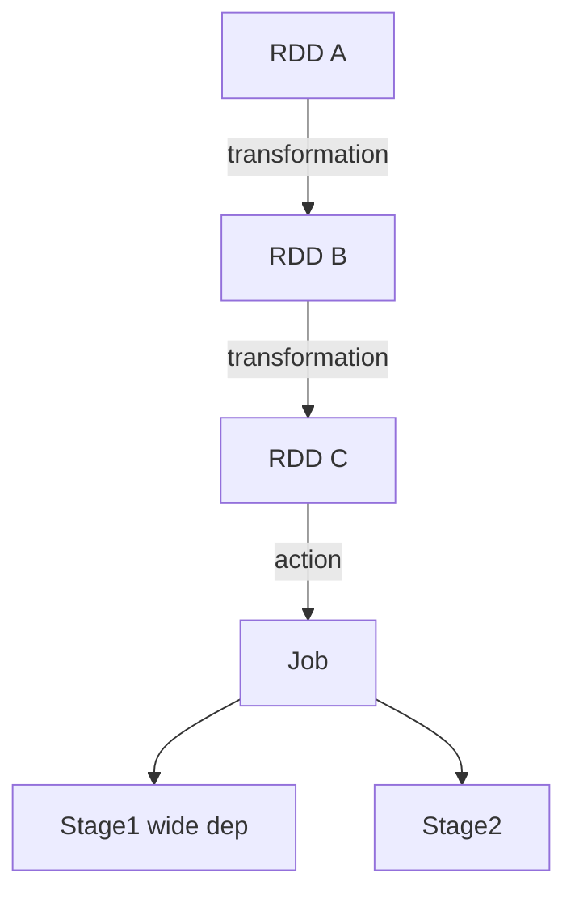
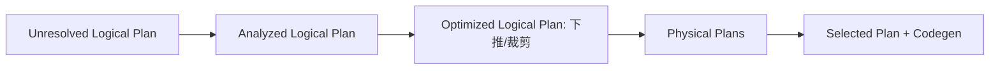

# 大数据 · 07 批处理计算：MapReduce 与 Spark（Shuffle 原理 / RDD-DAG / Catalyst / 内存模型 / 调优）

> 批处理是大数据"算"的起点。MapReduce 用"分而治之"开创了分布式计算范式；Spark 用内存 DAG 把它提速 10~100 倍，成为当今批处理事实标准；Hive 则让 SQL 跑在分布式集群上。本篇深入拆解 MapReduce 原理、Shuffle、Spark 核心、Catalyst 优化器、内存模型与调优。

---

## 一、要解决的问题

| 痛点 | 说明 |
|------|------|
| 单机算不动 | PB 级数据单机处理不了 |
| 分布式编程难 | 并行/容错/调度交给框架 |
| 迭代计算慢 | ML/图算法重复访问中间数据 |
| SQL 门槛 | 分析师用 SQL 分析海量数据 |
| 调优复杂 | Shuffle/OOM/倾斜难排查 |

> 核心认知：**Spark = 「内存 DAG 计算引擎」**——把计算拆成有向无环图（DAG），Stage 间结果缓存在内存，避免 MapReduce 每步落盘的磁盘 IO。

---

## 二、MapReduce：分而治之的鼻祖

### 2.1 计算模型

```mermaid
flowchart LR
    IN[(输入分片)] --> MAP[Map: 逐行 map(k,v)]
    MAP --> SH[Shuffle: 按 key 分区+排序+归并]
    SH --> RED[Reduce: 同 key 聚合]
    RED --> OUT[(输出)]
```

```
Input Split：按块切分，每 split 一个 Map 任务
Map：输入 (k,v) → 输出 (k',v') 列表
Shuffle：按 key 分区、排序、跨节点传输到 Reduce
Reduce：同 key 聚合（sum/count/join）
```

### 2.2 Shuffle（性能瓶颈，深入）

```
Map 端：
  map 输出 → 内存环形缓冲（100MB 默认）
  → 溢出写（spill）到本地磁盘（按分区+排序）
  → merge 合并排序

Reduce 端：
  从各 Map 拉取对应分区数据（fetch）
  归并排序 → 分组 → reduce 函数

Shuffle 代价：
  网络传输 + 磁盘 IO + 序列化
  是 MapReduce 最贵的阶段
  → Spark 用内存/合并优化
```

### 2.3 容错

```
任务失败：JobTracker/ApplicationMaster 重调度
中间结果落盘 → 可重算（不依赖上游）
局限：每步落 HDFS，磁盘 IO 重、迭代计算极慢
```

---

## 三、Spark 核心抽象：RDD（深入）

### 3.1 RDD 特性

```
RDD（弹性分布式数据集）：
  不可变（转换产生新 RDD）
  分区（Partition 并行单元）
  可并行计算

"弹性"三性：
  容错：血缘（Lineage）自动重建
  持久化：可存内存/磁盘
  惰性：转换延迟执行
```

### 3.2 血缘（Lineage）

```
每个 RDD 记录父 RDD + 转换操作
失败时：沿血缘重算（不用备份所有数据）

缓存 vs 血缘：
  缓存：占用存储，但恢复快
  血缘：无存储开销，但重算慢
  高频复用 → 缓存；低频 → 血缘
```

### 3.3 DAG 与执行模型



```
Transformation（懒执行）：map/filter/flatMap/groupByKey/join
  只记录血缘，不立即算
Action（触发）：count/collect/save → 提交 Job

Stage 划分：
  以 Shuffle（宽依赖）为界切分 Stage
  窄依赖（map）→ 管道化并行（无 shuffle）
  宽依赖（groupBy）→ 需要 shuffle

宽窄依赖：
  窄依赖：父 RDD 分区只被子 RDD 一个分区使用（map/filter）
  宽依赖：父 RDD 分区被多个子分区使用（groupBy/join）→ 必须 shuffle
```

---

## 四、Spark SQL 与 Catalyst 优化器

### 4.1 RDD / DataFrame / Dataset 区别

| 维度 | RDD | DataFrame | Dataset |
|------|-----|-----------|---------|
| 类型 | 非结构化 JVM 对象 | 命名列（Row） | 强类型 JVM 对象 |
| 优化 | 无（算子级） | **Catalyst 全优化** | Catalyst + 类型安全 |
| 语言 | Java/Scala/Py | 全语言 | Scala/Java |
| 序列化 | Java/Kryo | **Tungsten 二进制** | Tungsten 二进制 |
| 适用 | 底层控制/非结构化 | 大部分 SQL/ETL | 需类型安全的 Scala |

> 优先用 DataFrame/Dataset：Catalyst + Tungsten 让执行快且省内存；RDD 仅用于 Catalyst 不支持的场景。

### 4.2 Catalyst 流程

```
SQL/DF → 逻辑计划 → 分析（绑定 Catalog）
→ 逻辑优化（谓词下推/列裁剪/常量折叠）
→ 物理计划（CBO 选 Join 策略）
→ 代码生成（Whole-Stage Codegen）
```



```
常见优化：
  谓词下推到数据源（只读需要行）
  列裁剪（只读需要的列 → 少 IO）
  广播 Join（小表广播避免 shuffle）
  空值传播、子表达式消除
```

### 4.3 Tungsten（内存优化）

```
堆外内存 + 二进制执行 + 代码生成
  对象直接存二进制（避免 JVM 对象开销）
  Cache Line 友好、GC 压力小
  Whole-Stage Codegen：把算子合并为一段代码（避免虚函数调用）
```

---

## 五、内存模型与执行

### 5.1 内存划分（Spark 内存管理）

```
Executor 内存 = 堆内存（spark.executor.memory）+ 堆外（off-heap）

堆内划分：
  Storage（缓存 RDD）默认 50%
  Execution（shuffle 等）默认 50%（动态共享）
  User（用户对象）
  Reserved（保留）

动态调整：
  storage 与 execution 可互相借用（spark.memory.offHeap.enabled）
  任务结束归还

说明：
  Spark 3.x 用 Unified Memory（统一内存）
  Execution 优先级更高（防 shuffle OOM）
```

### 5.2 执行模式

```
调度：Job → Stage → Task（每个分区一个 Task）
Task 在 Executor 上执行（Executor 常驻，Driver 调度）

Executor：
  运行在 Worker 节点（YARN/K8s/Standalone）
  常驻 → 多 Job 复用（避免 MR 每次起进程）
  线程池并行执行 Task
```

---

## 六、Shuffle 深入与调优

### 6.1 Shuffle 机制（Spark）

```
Spark Shuffle 演进：
  Hash Shuffle（旧）：每 map 每 reduce 一个文件（文件数爆炸）
  Sort Shuffle（默认）：按分区排序合并成少量文件（高效）

过程：
  map 端：Shuffle Write（内存排序 → 溢出文件 → 合并）
  reduce 端：Shuffle Read（拉取 → 归并 → 聚合）

说明：
  聚合类算子（reduceByKey）在 map 端做 combine（预聚合）
  → 减少网络传输
```

### 6.2 关键参数

| 参数 | 说明 | 建议 |
|------|------|------|
| spark.sql.shuffle.partitions | shuffle 分区数 | 默认 200，按数据量调大到 2000+ |
| spark.shuffle.file.buffer | 写缓冲 | 默认 32KB |
| spark.reducer.maxSizeInFlight | 读并发 | 默认 48MB |
| spark.shuffle.compress | 压缩 | 默认 true |

### 6.3 数据倾斜治理

```
倾斜表现：某 Task 处理大量数据 → 拖慢整体（长尾）

治理：
  1. 热点 key 加盐打散再聚合（两阶段聚合）
  2. 小表广播（broadcast hint）避免 shuffle join
  3. skew hint（Spark 3 AQE 自动处理）
  4. 隔离热点 key（单独处理）
```

### 6.4 AQE 自适应查询（Spark 3+）

```
运行时根据 shuffle 统计量动态调整：
  ① 合并小分区（减少 Task 数）
  ② 倾斜 Join 自动加盐
  ③ 选更佳 Join 策略（sort-merge → broadcast）

开启：spark.sql.adaptive.enabled=true（默认开）
收益：大幅降低调参负担
```

---

## 七、Hive：SQL on Hadoop

### 7.1 原理

```
把 HiveQL（类 SQL）编译为 MapReduce/Tez/Spark 任务执行
Metastore（HMS）：存表结构、分区、列信息（大数据元数据枢纽）
执行引擎可换：hive.execution.engine = mr/tez/spark（生产用 Spark/Tez）

表与分区：
  CREATE TABLE ... PARTITIONED BY (dt STRING)
  分区 = 目录切分（dt=2026-07-28），查询下推只扫相关目录
  分桶 = 文件内哈希分（CLUSTERED BY），优化 join/采样

文件格式：
  行存 TextFile 慢 → 列存 Parquet/ORC + Snappy/ZSTD
  ACID 事务表（Hive 3+）基于 ORC + 事务管理器
```

### 7.2 Hive 3 ACID

```
功能：MERGE/UPDATE/DELETE（事务表）
实现：ORC + 事务管理器（delta + base 文件）
局限：弱于 Iceberg（无时间旅行/隐藏分区）
适用：低频更新场景
```

---

## 八、流批：Spark Streaming vs Structured Streaming

| 维度 | Spark Streaming（DStream） | Structured Streaming |
|------|---------------------------|---------------------|
| 模型 | 微批（离散化流） | 微批/连续（DataFrame 流） |
| API | RDD | DataFrame/SQL，批流统一 |
| 语义 | 至少一次/精确一次（WAL） | **端到端精确一次** |
| 水位/事件时间 | 弱 | **强（Event Time + Watermark）** |

> 新项目一律用 **Structured Streaming**：同一 DataFrame API 既跑批又跑流。

---

## 九、OOM 排查与调优

| 现象 | 原因 | 处理 |
|------|------|------|
| Executor OOM | 数据倾斜/分区过大 | 增分区数、加盐、调 `spark.executor.memory` |
| GC 长停顿 | 堆大/对象多 | 用 Kryo、堆外、降 `executor.memory` 增 `overhead` |
| 超限被 KILL | `memoryOverhead` 不足 | 调 `spark.kubernetes.memoryOverhead` |
| 驱动 OOM | `collect` 大结果 | 避免 collect，用 `write` 落盘 |

```
排查思路：
  1. 看 Web UI：Executor 内存/GC/Shuffle 读写
  2. 定位热点 Task（倾斜？）
  3. 检查分区数（太少 → 单个 Executor 处理太多）
  4. 检查序列化（Kryo vs Java）

口诀：分区数 ≥ 2×核数、避免 collect 大表、倾斜必治理、AQE 必开
```

---

## 十、MapReduce vs Spark 速查

| 维度 | MapReduce | Spark |
|------|-----------|-------|
| 速度 | 慢（每步落盘） | 快（内存 DAG，10~100×） |
| 迭代/ML | 极差 | 优 |
| API | 底层 Java | Scala/Java/Python + SQL |
| 容错 | 重算（落盘） | lineage + 缓存 |
| 现状 | legacy，仅兼容 | 批处理标准 |

---

## 十一、批处理设计 Checklist

- [ ] 新作业用 Spark（SQL/DataFrame），弃用裸 MR。
- [ ] 表用 Parquet/ORC 列式 + 合理压缩；按业务时间分区。
- [ ] 减少 shuffle：combine 前置、广播小表、控制倾斜。
- [ ] 复用 RDD/中间表（`persist` + 物化宽表），但防内存爆。
- [ ] Hive Metastore 统一元数据，表格式优先 Iceberg 以获得 ACID。
- [ ] 开 AQE，调 `shuffle.partitions`。
- [ ] OOM 看倾斜/分区/overhead；勿 collect 大结果。
- [ ] Structured Streaming 做流，配 Watermark + 精确一次 Sink。
- [ ] 监控：stage 耗时、shuffle 读写、数据倾斜、Executor GC。

---

## 十二、与其他板块的关系

- 流处理对比见「[08-流处理计算：Flink](08-流处理计算：Flink.md)」；
- 文件格式/表格式见「[05-列式存储与数据湖格式](05-列式存储与数据湖格式.md)」；
- 资源调度见「[10-资源调度：YARN与Kubernetes](10-资源调度：YARN与Kubernetes.md)」；
- 数据仓库见「[09-数据仓库与OLAP引擎](09-数据仓库与OLAP引擎.md)」；
- 离线任务编排见「[中间件/Airflow](../中间件/Airflow.md)」。

> 一句话：**Spark = RDD（血缘容错）+ DAG（窄宽依赖切 Stage）+ Catalyst（谓词下推/列裁剪/Codegen）+ Unified Memory（Storage/Execution 动态共享）——调优三件事：分区数≥2×核、倾斜必治理（加盐/广播）、AQE 必开；Shuffle 是性能天花板**。