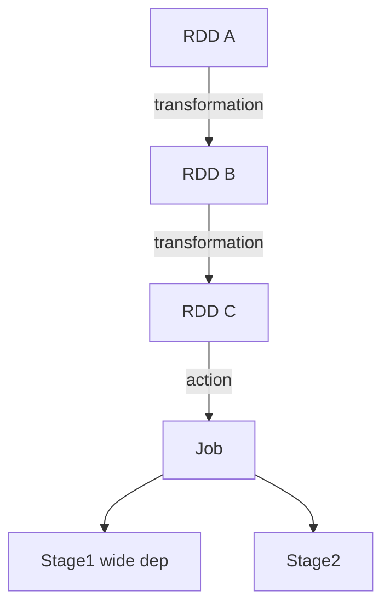
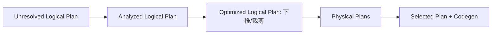

# 大数据 · 07 批处理计算：MapReduce 与 Spark

> 批处理是大数据"算"的起点。MapReduce 用"分而治之"开创了分布式计算范式；Spark 用内存 DAG 把它提速 10~100 倍，成为当今批处理事实标准；Hive 则让 SQL 跑在分布式集群上。

本篇讲 MapReduce 原理、Spark 核心（RDD/DAG/算子/内存）、Hive 与数仓分层。流处理见 [08-流处理计算：Flink](08-流处理计算：Flink.md)。

## 一、MapReduce：分而治之的鼻祖

源自 Google MapReduce 论文，把计算拆为 Map（映射）与 Reduce（归约）两阶段。

```mermaid
flowchart LR
    IN[(输入分片)] --> MAP[Map: 逐行 map(k,v)]
    MAP --> SH[Shuffle: 按 key 分区+排序+归并]
    SH --> RED[Reduce: 同 key 聚合]
    RED --> OUT[(输出)]
```

- **Input Split**：按块切分，每 split 一个 Map 任务。
- **Shuffle**（最贵）：Map 输出按 key 分区、排序、网络传输到 Reduce；是性能瓶颈。
- **容错**：任务失败由 JobTracker/ApplicationMaster 重调度；中间结果落盘，可重算。
- **局限**：每步落 HDFS，磁盘 IO 重、迭代计算（ML/图）极慢 → Spark 改进。

## 二、Spark：内存计算的革命

### 2.1 核心抽象：RDD
- **RDD（弹性分布式数据集）** = 不可变、分区、可并行计算的集合。
- "弹性"：自动重建（ lineage 血缘）、容错、可存内存/磁盘。

### 2.2 DAG 与执行模型

- **Transformation（转换，懒执行）**：`map/filter/flatMap/groupByKey/join`，只记 lineage，不立即算。
- **Action（动作，触发）**：`count/collect/save`，真正提交 Job。
- **Stage 划分**：以 **shuffle（宽依赖）** 为界切分 Stage；窄依赖（map）管道化并行。
- **优势**：Stage 间结果可**缓存在内存**，迭代/多查询复用，避免 MR 重复落盘。

### 2.3 内存计算与 Tungsten
- 优先内存，溢出才落盘；**Tungsten** 用堆外内存 + 二进制执行 + 代码生成，进一步提升。
- 比 MR 快 **10~100 倍**（尤其迭代/交互）。

### 2.4 生态组件
| 组件 | 用途 |
|------|------|
| Spark SQL | 结构化查询（ANSI SQL + DataFrame） |
| Spark Streaming | 微批流（DStream，已逐步被 Structured Streaming 取代） |
| Structured Streaming | 基于 DataFrame 的流，批流统一 API |
| MLlib | 分布式机器学习 |
| GraphX | 图计算 |

### 2.5 关键调优
- **分区数**：与核数匹配（默认 200，按数据量调）。
- **持久化**：`persist(MEMORY_AND_DISK)` 复用中间 RDD。
- **避免 shuffle 爆炸**：`groupByKey`→`reduceByKey`（combine 前置），控制倾斜 key。
- **数据倾斜**：加盐打散、隔离热点 key、广播小表（broadcast join）。

## 三、Hive：SQL on Hadoop

- 把 **HiveQL（类 SQL）** 编译为 **MapReduce/Tez/Spark** 任务执行，让用户用 SQL 分析 PB 数据。
- **Metastore（ HMS）**：存表结构、分区、列信息，是大数据元数据枢纽（见 [12-数据治理](12-数据治理与数据质量.md)）。
- **执行引擎可换**：`hive.execution.engine = mr/tez/spark`（生产用 Spark/Tez 提速）。

### 3.1 表与分区
```sql
-- 分区表（按天）：避免全表扫
CREATE TABLE dwd_order (
  order_id BIGINT, user_id BIGINT, amount DECIMAL(18,2)
) PARTITIONED BY (dt STRING)
STORED AS PARQUET;

-- 分桶：按 key 哈希分散，优化 join/采样
CLUSTERED BY (user_id) INTO 64 BUCKETS;
```
- **分区（Partition）**：按目录切（如 `dt=2026-07-28`），查询下推只扫相关目录。
- **分桶（Bucket）**：文件内按哈希分，优化 join 与采样。

### 3.2 文件格式与压缩
- 行存 TextFile 慢 → 列存 **Parquet/ORC**（见 [05](05-列式存储与数据湖格式.md)）+ Snappy/ZSTD 压缩。
- ACID 事务表（Hive 3+）基于 ORC + 事务管理器，支持 merge/update（弱于 Iceberg）。

## 四、MapReduce vs Spark 速查

| 维度 | MapReduce | Spark |
|------|-----------|-------|
| 速度 | 慢（每步落盘） | 快（内存 DAG，10~100×） |
| 迭代/ML | 极差 | 优 |
| API | 底层 Java | Scala/Java/Python + SQL |
| 容错 | 重算（落盘） | lineage + 缓存 |
| 现状 |  legacy，仅兼容 | 批处理标准 |

## 五、批处理设计 Checklist

- [ ] 新作业用 Spark（SQL/DataFrame），弃用裸 MR。
- [ ] 表用 Parquet/ORC 列式 + 合理压缩；按业务时间分区。
- [ ] 减少 shuffle：combine 前置、广播小表、控制倾斜。
- [ ] 复用 RDD/中间表（`persist` + 物化宽表）。
- [ ] Hive Metastore 统一元数据，表格式优先 Iceberg 以获得 ACID。
  - [ ] 监控：stage 耗时、shuffle 读写、数据倾斜、Executor GC。

> 参考：Google MapReduce 论文、Apache Spark 官方（RDD/ tuning）、Apache Hive 文档、Parquet/ORC 格式说明。

## 六、RDD / DataFrame / Dataset 区别

| 维度 | RDD | DataFrame | Dataset |
|------|-----|-----------|---------|
| 类型 | 非结构化 JVM 对象 | 命名列（Row） | 强类型 JVM 对象 |
| 优化 | 无（算子级） | **Catalyst 全优化** | Catalyst + 类型安全 |
| 语言 | Java/Scala/Py | 全语言 | Scala/Java |
| 序列化 | Java/ Kryo | **Tungsten 二进制** | Tungsten 二进制 |
| 适用 | 底层控制/非结构化 | 大部分 SQL/ETL | 需类型安全的 Scala |

- 优先用 DataFrame/Dataset：Catalyst + Tungsten 让执行快且省内存；RDD 仅用于 Catalyst 不支持的场景。

## 七、Spark SQL Catalyst 优化器

Catalyst 流程：`SQL/DF → 逻辑计划 → 分析（绑定 Catalog）→ 逻辑优化（谓词下推/列裁剪/常量折叠）→ 物理计划（CBO 选 Join 策略）→ 代码生成（Whole-Stage Codegen）`。



- 常见优化：谓词下推到数据源、列裁剪、广播 Join、空值传播、子表达式消除。

## 八、Shuffle 调优

- **Shuffle 是性能天花板**：数据按 key 重分区、跨网络，磁盘+网络 IO 密集。
- 关键参数：
  - `spark.sql.shuffle.partitions`（默认 200，按数据量调大到 2000+）
  - `spark.shuffle.file.buffer`、`spark.reducer.maxSizeInFlight`
  - 用 **Sort Shuffle**（默认）而非 Hash；开启 `spark.shuffle.io.preferDirectBufs`。
- 数据倾斜治理：
  - 热点 key 加盐打散再聚合；
  - 小表广播 `broadcast hint` 避免 shuffle join；
  - `skew hint`（Spark 3 `ADAPTIVE` 自动处理）。

## 九、Spark Streaming vs Structured Streaming

| 维度 | Spark Streaming（DStream） | Structured Streaming |
|------|---------------------------|---------------------|
| 模型 | 微批（离散化流） | 微批/连续（DataFrame 流） |
| API | RDD | DataFrame/SQL，批流统一 |
| 语义 | 至少一次/精确一次（WAL） | **端到端精确一次** |
| 水位/事件时间 | 弱 | **强（Event Time + Watermark）** |

- 新项目一律用 **Structured Streaming**：同一 DataFrame API 既跑批又跑流。

## 十、AQE 自适应查询（Spark 3+）

- 运行时根据 shuffle 统计量**动态调整**：① 合并小分区；② 倾斜 Join 自动加盐；③ 选更佳 Join 策略（sort-merge→broadcast）。
- 开启：`spark.sql.adaptive.enabled=true`（默认开），大幅降低调参负担。

## 十一、OOM 排查与调优

| 现象 | 原因 | 处理 |
|------|------|------|
| Executor OOM | 数据倾斜/分区过大 | 增分区数、加盐、调 `spark.executor.memory` |
| GC 长停顿 | 堆大/对象多 | 用 Kryo、堆外、降 `executor.memory` 增 `overhead` |
| 超限被 KILL | `memoryOverhead` 不足 | 调 `spark.kubernetes.memoryOverhead` |
| 驱动 OOM | `collect` 大结果 | 避免 collect，用 `write` 落盘 |

- 口诀：**分区数 ≥ 2×核数、避免 collect 大表、倾斜必治理、AQE 必开**。

## 十二、性能 Checklist

- [ ] 用 DataFrame/Dataset + Catalyst，避免裸 RDD。
- [ ] 开 AQE，调 `shuffle.partitions`。
- [ ] 广播小表、治理倾斜 key。
- [ ] 复用 `cache/persist`，但防内存爆。
- [ ] OOM 看倾斜/分区/overhead；勿 collect 大结果。
- [ ] Structured Streaming 做流，配 Watermark + 精确一次 Sink。
