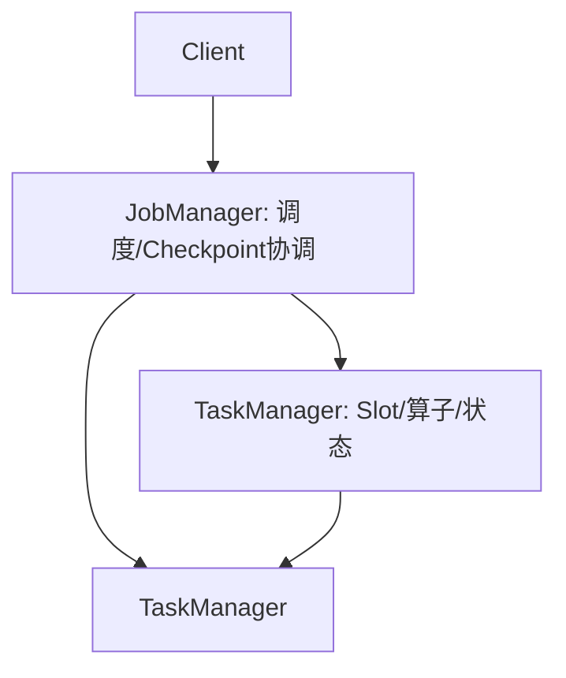
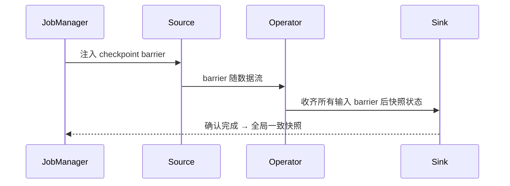
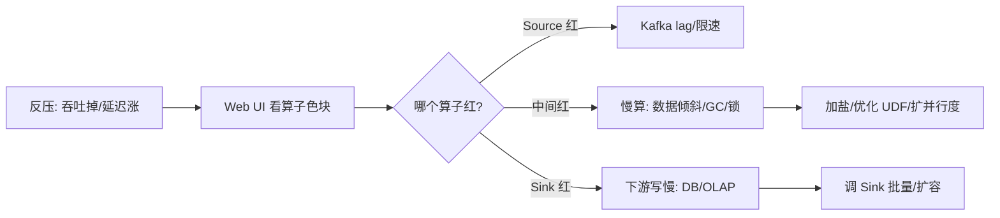

# 大数据 · 08 流处理计算：Flink（时间语义 / 窗口 / 水印 / 状态管理 / Checkpoint / 反压 / SQL 实战）

> 如果说 Spark 是批处理之王，Flink 就是流处理的事实标准。它把"有状态、精确一次、事件时间"做到极致，让实时计算从"近似"走向"准确"。本篇深入拆解 Flink 架构、时间/窗口/水印、精确一次容错（Checkpoint）、状态后端、反压排查与 Table SQL 实战。

---

## 一、要解决的问题

| 痛点 | 说明 |
|------|------|
| 实时计算延迟 | 批处理 T+1 不够快 |
| 有状态处理 | 累计/去重/窗口需要跨事件状态 |
| 乱序/迟到 | 网络/上游导致事件乱序 |
| 精确一次 | 重复处理导致重复计数/资损 |
| 高吞吐低延迟 | 百万事件/秒处理 |

> 核心认知：**Flink = 「有状态 + 事件时间 + 精确一次」的原生流处理框架**——既能处理无界流（实时）也能处理有界流（批），四大基石：流（Stream）、状态（State）、时间（Time）、容错（Checkpoint）。

---

## 二、架构与运行时

### 2.1 角色



| 角色 | 职责 |
|------|------|
| JobManager（JM） | 作业图调度、Checkpoint 触发与协调、故障恢复 |
| TaskManager（TM） | 执行算子，含 Slot（资源单元）、状态后端 |
| Slot | TM 内的资源槽，决定并行度 |

### 2.2 执行模型

```
并行度（parallelism）：每个算子并行实例数，决定吞吐
作业图 → 执行图：优化后分配到 Slot 并行执行

数据流：
  Source（Kafka/JDBC/文件）→ Transform（map/filter/window/join）→ Sink（OLAP/湖/消息）

KeyBy 分组：同 key 事件路由到同一算子实例（保证顺序）
```

---

## 三、时间语义（深入）

| 时间 | 含义 | 用途 |
|------|------|------|
| Event Time（事件时间） | 事件产生时的时间戳 | 准确聚合（按业务时间）⭐ |
| Processing Time（处理时间） | 到达算子的墙上时钟 | 极低延迟、可容忍近似 |
| Ingestion Time | 进入 Flink 的时间 | 折中 |

> 真实场景几乎都用 **Event Time**：用户 14:30:00 点击，即使 14:30:03 才到 Flink，也要计入 14:30 的窗口。

```
为什么不能只用 Processing Time：
  网络延迟/重放 → 到达顺序≠产生顺序
  按处理时间聚合 = 按"到达时间"而非"发生时间"
  跨时区/业务时间需求 → 必须用事件时间
```

---

## 四、窗口（Window）

### 4.1 窗口类型

| 窗口 | 说明 | 场景 |
|------|------|------|
| 滚动（Tumbling） | 固定大小、不重叠 | 每 5 分钟统计 |
| 滑动（Sliding） | 固定大小、可重叠 | 每 1 分钟看近 5 分钟 |
| 会话（Session） | 按活动间隔动态 | 用户单次访问会话 |
| 全局（Global） | 需自定义触发器 | 特殊聚合 |

### 4.2 代码示例

```java
stream.keyBy(Order::getUserId)
      .window(TumblingEventTimeWindows.of(Time.minutes(5)))
      .reduce((a, b) -> new Order(a.userId, a.amount + b.amount));

// 滑动（窗口=10min，步长=1min）
.window(SlidingEventTimeWindows.of(Time.minutes(10), Time.minutes(1)))
// 会话（间隔 30min 无活动则关）
.window(EventTimeSessionWindows.withGap(Time.minutes(30)))
// 全局（自定义 Trigger）
.window(GlobalWindows.create()).trigger(/* 自定义 */)
```

---

## 五、水印（Watermark）：处理乱序与迟到

### 5.1 概念

```
Watermark = "确信比 T 早的事件都到了" 的特殊记录，驱动窗口触发
  时间戳单调递增（只进不退）
  窗口在 watermark ≥ 窗口结束时间时触发

策略：
  BoundedOutOfOrderness(maxEventTime - 延迟)（允许乱序）
  MonotonousTimestamps（严格有序）
```

```java
// 允许 5 秒乱序
WatermarkStrategy<Order> wm = WatermarkStrategy
  .<Order>forBoundedOutOfOrderness(Duration.ofSeconds(5))
  .withTimestampAssigner((o, ts) -> o.getEventTime());

stream.assignTimestampsAndWatermarks(wm)
  .keyBy(Order::getUserId)
  .window(TumblingEventTimeWindows.of(Time.minutes(5)))
  .allowedLateness(Time.minutes(1))          // 迟到 1 分钟仍收
  .sideOutputLateData(lateTag)               // 超限旁路
  .aggregate(new GmvAgg());
```

### 5.2 迟到数据处理

```
window 触发后到的事件：
  allowedLateness（窗口持有期延长）→ 触发更新
  sideOutputLateData（旁路收集）→ 下游/兜底
  丢弃（默认行为）

权衡：
  延迟太小 → 丢数据（迟到未等够）
  延迟太大 → 内存爆（窗口持有过多）
  ⚠️ 要基于实测 P99 迟到调 watermark
```

---

## 六、状态（State）与状态后端

### 6.1 状态类型

```
Keyed State（按 key）：
  ValueState / ListState / MapState / ReducingState / AggregatingState
  每个 key 独立状态（如用户累计金额）

Operator State（算子级）：
  与 key 无关（如 kafka offset、source 位置）
  ListState / BroadcastState（广播态）
```

### 6.2 状态后端

| 后端 | 原理 | 适用 |
|------|------|------|
| HashMapStateBackend | 内存 HashMap | 小状态、超低延迟 |
| EmbeddedRocksDBStateBackend | 落盘 KV，增量 checkpoint | **大状态（TB 级）首选** |

```java
// RocksDB 状态后端（大状态首选）
env.setStateBackend(new EmbeddedRocksDBStateBackend(true)); // true=增量

// 状态 TTL：自动清理过期 key，防状态无限膨胀
StateTtlConfig ttl = StateTtlConfig.newBuilder(Time.days(7))
  .setUpdateType(StateTtlConfig.UpdateType.OnCreateAndWrite)
  .cleanupInRocksdbCompactFilter(10_000_000)
  .build();
```

### 6.3 状态是"精确一次"的基础

```
状态让处理"记忆"跨事件 → 支持累计/去重/窗口
大状态（TB 级）靠 RocksDB 落盘 + 增量 checkpoint
状态 TTL 自动清理 → 防无限膨胀
```

---

## 七、容错：Checkpoint 与精确一次

### 7.1 Chandy-Lamport 分布式快照



```
原理：
  JM 周期性向 Source 注入 barrier，随数据流向下
  算子收齐所有输入 barrier 才快照状态并下发
  恢复时从最近 checkpoint 重放，保证状态一致

说明：
  barrier 对齐（Aligned）：确保快照一致性
  Unaligned Checkpoint（1.14+）：高背压下把在途数据纳入快照，避免 barrier 被背压堵住
```

### 7.2 三种语义

| 语义 | 含义 | 实现 |
|------|------|------|
| At-Least-Once | 可能重复 | 不对齐，更快 |
| **Exactly-Once（处理）** | 每条事件处理一次 | barrier 对齐 + 状态回滚 |
| **端到端 Exactly-Once** | 输出也不重 | Sink 事务/幂等（Kafka 事务、TwoPhaseCommitSink） |

> 关键区分：**Flink 的 Exactly-Once 是"处理语义"**（状态一致）；**端到端**还需 Sink 支持事务或幂等（如 Kafka 事务写、Iceberg/Paimon 的幂等 upsert）。

### 7.3 Checkpoint 配置

```java
env.enableCheckpointing(5000);                 // 5s 一次
env.getCheckpointConfig().setCheckpointingMode(CheckpointingMode.EXACTLY_ONCE);
env.getCheckpointConfig().setMinPauseBetweenCheckpoints(3000);
env.getCheckpointConfig().setCheckpointTimeout(600000);
env.getCheckpointConfig().setMaxConcurrentCheckpoints(1);
env.getCheckpointConfig().enableExternalizedCheckpoints(
    CheckpointConfig.ExternalizedCheckpointCleanup.RETAIN_ON_CANCELLATION);
```

| 参数 | 建议 | 说明 |
|------|------|------|
| interval | 1~5 分钟 | 太频拖累吞吐，太疏恢复慢 |
| timeout | 10 分钟 | 超时不算成功 |
| minPauseBetween | =interval | 防重叠 |
| maxConcurrent | 1 | 串行更稳 |
| mode | EXACTLY_ONCE | 精确一次 |
| unaligned | 高背压开 | 防 barrier 堵 |

### 7.4 Savepoint

```
Savepoint = 手动触发的快照（与代码版本兼容）
用途：升级、扩缩容、迁移、补数据
区别于 Checkpoint（自动、非版本兼容）
流程：升级用 Savepoint → 先验证可恢复再切流量
```

---

## 八、与 Storm / Spark Streaming 对比

| 维度 | Storm | Spark Streaming | Flink |
|------|-------|-----------------|-------|
| 处理模型 | 逐条（原生流） | 微批（近似流） | **原生流** |
| 延迟 | 毫秒 | 秒级 | 毫秒 |
| 状态 | 弱 | 有 | **一等公民** |
| 精确一次 | At-Least | 勉强 | **原生 Exactly-Once** |
| 事件时间/水印 | 弱 | 一般 | **强** |
| 现状 | 淘汰 | 存量 | 主流 |

---

## 九、Flink 2.x 与 K8s（2025）

```
Flink 2.x：
  异步执行模型（容忍远程状态访问延迟）
  流批一体更彻底、存算分离友好

on Kubernetes：
  Native K8s 部署，TM 按需扩缩
  配合对象存储状态后端（状态外置）
  配合 HPA/KEDA 弹性（见 [10](10-资源调度：YARN与Kubernetes.md)）

实时入湖：Flink + Paimon/Iceberg 是实时数仓标配（见 [11](11-实时数仓与湖仓一体.md)）
```

---

## 十、反压（Backpressure）排查



```
定位：Flink Web UI Backpressure 标签看哪个算子 OK/HIGH
根因：数据倾斜、GC、外部 Sink 慢
治理：keyBy 加盐打散热点、优化热 UDF、扩并行度、调 Sink 批量与重试
```

---

## 十一、Table API / SQL 实战

```sql
-- 流表（Kafka）+ 维表（JDBC）join
CREATE TABLE orders (order_id BIGINT, user_id BIGINT, amount DECIMAL(18,2),
  ts TIMESTAMP(3), WATERMARK FOR ts AS ts - INTERVAL '5' SECOND)
  WITH ('connector'='kafka', 'topic'='orders',
        'properties.bootstrap.servers'='k:9092',
        'format'='json', 'scan.startup.mode'='latest-offset');

CREATE TABLE user_dim (user_id BIGINT, name STRING, city STRING)
  WITH ('connector'='jdbc', 'url'='jdbc:mysql://db/user', /* ... */);

-- 5 分钟滚动窗口 GMV（维表打宽）
INSERT INTO gmv_sink
SELECT u.city, TUMBLE_START(o.ts, INTERVAL '5' MINUTE) AS w,
       SUM(o.amount) AS gmv
FROM orders o LEFT JOIN user_dim FOR SYSTEM_TIME AS OF o.ts u
  ON o.user_id = u.user_id
GROUP BY u.city, TUMBLE(o.ts, INTERVAL '5' MINUTE);
```

```
Table API/SQL 让流与批同一套 SQL
FOR SYSTEM_TIME AS OF 做时态维表 join（实时打宽）
```

---

## 十二、设计 Checklist

- [ ] 用 Event Time + Watermark，延迟基于实测迟到设定。
- [ ] 开启 Exactly-Once Checkpoint + Sink 事务/幂等（端到端）。
- [ ] 大状态用 RocksDB 后端 + 增量 checkpoint + 状态 TTL。
- [ ] 窗口迟到策略：`allowedLateness` + sideOutput 兜底。
- [ ] 监控背压、checkpoint 时长/对齐、状态大小。
- [ ] 反压先看 UI 红算子，再治倾斜/GC/Sink。
- [ ] 流批用同一 SQL（Table API），维表 join 用时态表。
- [ ] 升级用 Savepoint，先验证可恢复。

---

## 十三、与其他板块的关系

- 消息队列见「[03-数据采集与同步](03-数据采集与同步.md)」；
- 批处理对比见「[07-批处理计算：MapReduce与Spark](07-批处理计算：MapReduce与Spark.md)」；
- 实时数仓见「[11-实时数仓与湖仓一体](11-实时数仓与湖仓一体.md)」；
- Flink 中间件深挖见「[中间件/ApacheFlink流处理](../中间件/ApacheFlink流处理.md)」；
- 调度部署见「[10-资源调度：YARN与Kubernetes](10-资源调度：YARN与Kubernetes.md)」。

> 一句话：**Flink = 事件时间（Event Time + Watermark）+ 窗口（滚动/滑动/会话）+ 状态（RocksDB + TTL）+ Checkpoint（Chandy-Lamport barrier → Exactly-Once）——生产四守则：Watermark 按 P99 迟到调、状态后端按规模选、端到端精确一次靠 Sink 事务/幂等、反压先看 UI 红算子**。