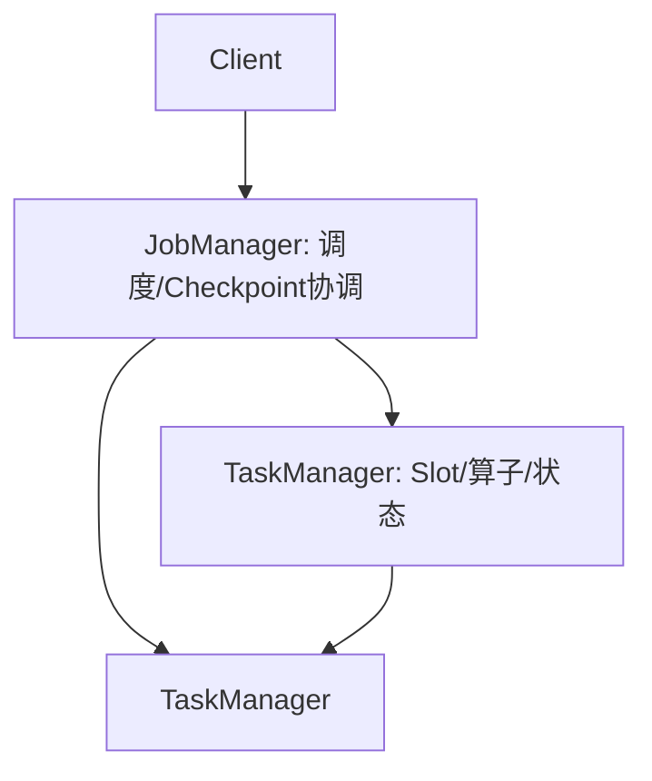
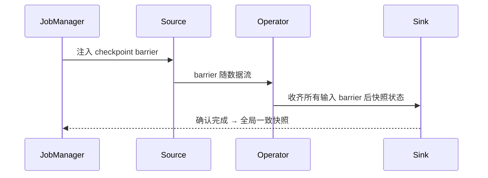
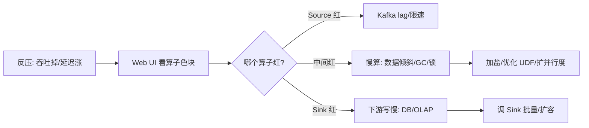
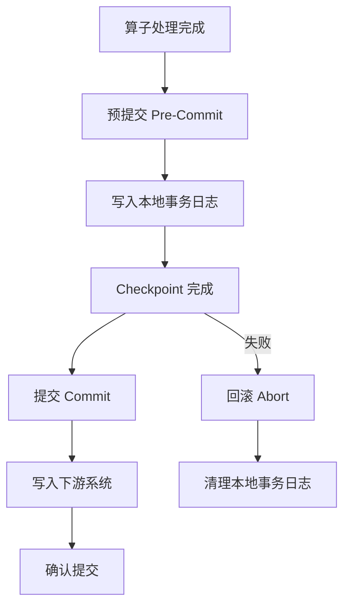
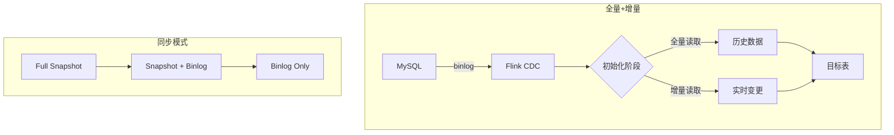
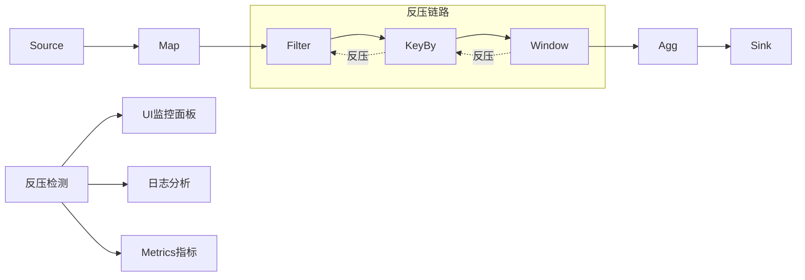
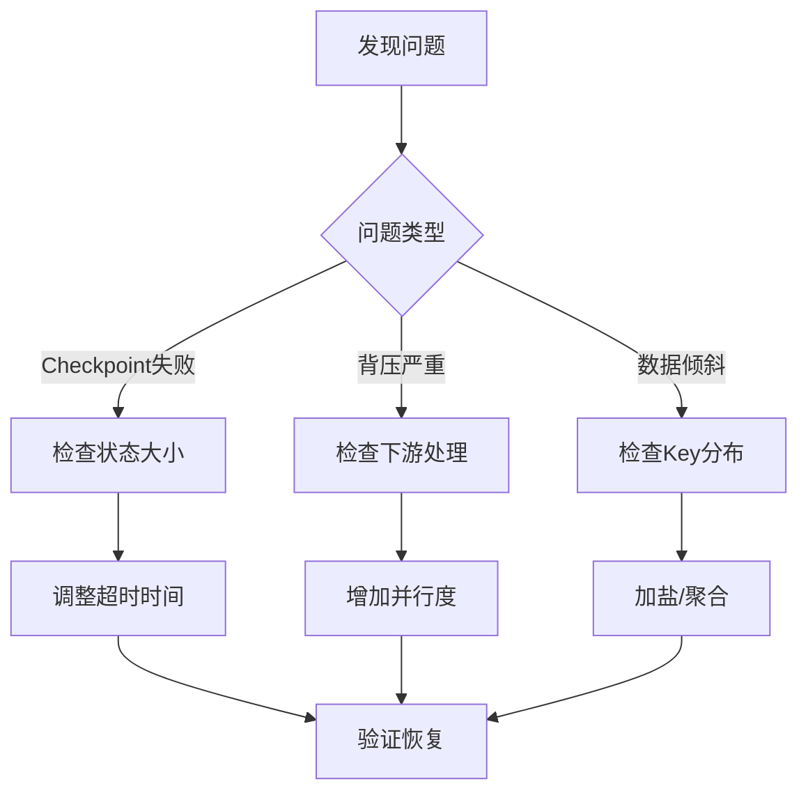
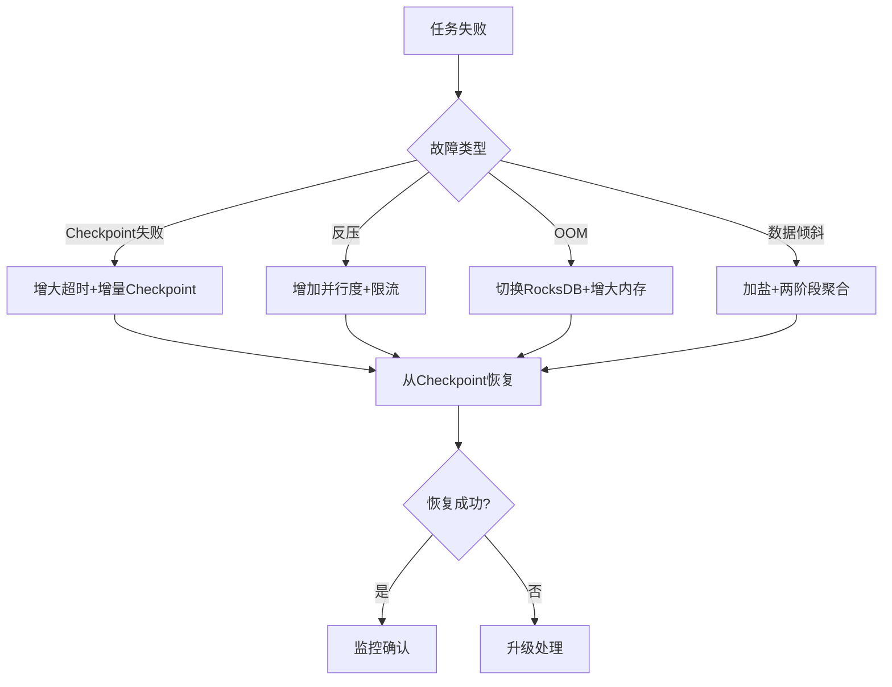
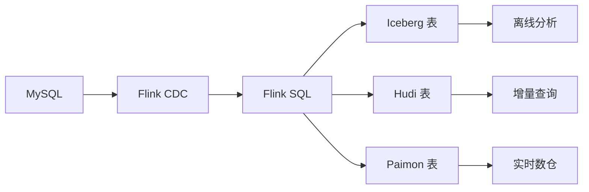

# 大数据 · 08 流处理计算：Flink（时间语义 / 窗口 / 水印 / 状态管理 / Checkpoint / 反压 / SQL 实战）

> 如果说 Spark 是批处理之王，Flink 就是流处理的事实标准。它把"有状态、精确一次、事件时间"做到极致，让实时计算从"近似"走向"准确"。本篇深入拆解 Flink 架构、时间/窗口/水印、精确一次容错（Checkpoint）、状态后端、反压排查与 Table SQL 实战。

---

## 一、要解决的问题

| 痛点 | 说明 |
|------|------|
| 实时计算延迟 | 批处理 T+1 不够快 |
| 有状态处理 | 累计/去重/窗口需要跨事件状态 |
| 乱序/迟到 | 网络/上游导致事件乱序 |
| 精确一次 | 重复处理导致重复计数/资损 |
| 高吞吐低延迟 | 百万事件/秒处理 |

> 核心认知：**Flink = 「有状态 + 事件时间 + 精确一次」的原生流处理框架**——既能处理无界流（实时）也能处理有界流（批），四大基石：流（Stream）、状态（State）、时间（Time）、容错（Checkpoint）。

---

## 二、架构与运行时

### 2.1 角色



| 角色 | 职责 |
|------|------|
| JobManager（JM） | 作业图调度、Checkpoint 触发与协调、故障恢复 |
| TaskManager（TM） | 执行算子，含 Slot（资源单元）、状态后端 |
| Slot | TM 内的资源槽，决定并行度 |

### 2.2 执行模型

```
并行度（parallelism）：每个算子并行实例数，决定吞吐
作业图 → 执行图：优化后分配到 Slot 并行执行

数据流：
  Source（Kafka/JDBC/文件）→ Transform（map/filter/window/join）→ Sink（OLAP/湖/消息）

KeyBy 分组：同 key 事件路由到同一算子实例（保证顺序）
```

---

## 三、时间语义（深入）

| 时间 | 含义 | 用途 |
|------|------|------|
| Event Time（事件时间） | 事件产生时的时间戳 | 准确聚合（按业务时间）⭐ |
| Processing Time（处理时间） | 到达算子的墙上时钟 | 极低延迟、可容忍近似 |
| Ingestion Time | 进入 Flink 的时间 | 折中 |

> 真实场景几乎都用 **Event Time**：用户 14:30:00 点击，即使 14:30:03 才到 Flink，也要计入 14:30 的窗口。

```
为什么不能只用 Processing Time：
  网络延迟/重放 → 到达顺序≠产生顺序
  按处理时间聚合 = 按"到达时间"而非"发生时间"
  跨时区/业务时间需求 → 必须用事件时间
```

---

## 四、窗口（Window）

### 4.1 窗口类型

| 窗口 | 说明 | 场景 |
|------|------|------|
| 滚动（Tumbling） | 固定大小、不重叠 | 每 5 分钟统计 |
| 滑动（Sliding） | 固定大小、可重叠 | 每 1 分钟看近 5 分钟 |
| 会话（Session） | 按活动间隔动态 | 用户单次访问会话 |
| 全局（Global） | 需自定义触发器 | 特殊聚合 |

### 4.2 代码示例

```java
stream.keyBy(Order::getUserId)
      .window(TumblingEventTimeWindows.of(Time.minutes(5)))
      .reduce((a, b) -> new Order(a.userId, a.amount + b.amount));

// 滑动（窗口=10min，步长=1min）
.window(SlidingEventTimeWindows.of(Time.minutes(10), Time.minutes(1)))
// 会话（间隔 30min 无活动则关）
.window(EventTimeSessionWindows.withGap(Time.minutes(30)))
// 全局（自定义 Trigger）
.window(GlobalWindows.create()).trigger(/* 自定义 */)
```

---

## 五、水印（Watermark）：处理乱序与迟到

### 5.1 概念

```
Watermark = "确信比 T 早的事件都到了" 的特殊记录，驱动窗口触发
  时间戳单调递增（只进不退）
  窗口在 watermark ≥ 窗口结束时间时触发

策略：
  BoundedOutOfOrderness(maxEventTime - 延迟)（允许乱序）
  MonotonousTimestamps（严格有序）
```

```java
// 允许 5 秒乱序
WatermarkStrategy<Order> wm = WatermarkStrategy
  .<Order>forBoundedOutOfOrderness(Duration.ofSeconds(5))
  .withTimestampAssigner((o, ts) -> o.getEventTime());

stream.assignTimestampsAndWatermarks(wm)
  .keyBy(Order::getUserId)
  .window(TumblingEventTimeWindows.of(Time.minutes(5)))
  .allowedLateness(Time.minutes(1))          // 迟到 1 分钟仍收
  .sideOutputLateData(lateTag)               // 超限旁路
  .aggregate(new GmvAgg());
```

### 5.2 迟到数据处理

```
window 触发后到的事件：
  allowedLateness（窗口持有期延长）→ 触发更新
  sideOutputLateData（旁路收集）→ 下游/兜底
  丢弃（默认行为）

权衡：
  延迟太小 → 丢数据（迟到未等够）
  延迟太大 → 内存爆（窗口持有过多）
  ⚠️ 要基于实测 P99 迟到调 watermark
```

---

## 六、状态（State）与状态后端

### 6.1 状态类型

```
Keyed State（按 key）：
  ValueState / ListState / MapState / ReducingState / AggregatingState
  每个 key 独立状态（如用户累计金额）

Operator State（算子级）：
  与 key 无关（如 kafka offset、source 位置）
  ListState / BroadcastState（广播态）
```

### 6.2 状态后端

| 后端 | 原理 | 适用 |
|------|------|------|
| HashMapStateBackend | 内存 HashMap | 小状态、超低延迟 |
| EmbeddedRocksDBStateBackend | 落盘 KV，增量 checkpoint | **大状态（TB 级）首选** |

```java
// RocksDB 状态后端（大状态首选）
env.setStateBackend(new EmbeddedRocksDBStateBackend(true)); // true=增量

// 状态 TTL：自动清理过期 key，防状态无限膨胀
StateTtlConfig ttl = StateTtlConfig.newBuilder(Time.days(7))
  .setUpdateType(StateTtlConfig.UpdateType.OnCreateAndWrite)
  .cleanupInRocksdbCompactFilter(10_000_000)
  .build();
```

### 6.3 状态是"精确一次"的基础

```
状态让处理"记忆"跨事件 → 支持累计/去重/窗口
大状态（TB 级）靠 RocksDB 落盘 + 增量 checkpoint
状态 TTL 自动清理 → 防无限膨胀
```

---

## 七、容错：Checkpoint 与精确一次

### 7.1 Chandy-Lamport 分布式快照



```
原理：
  JM 周期性向 Source 注入 barrier，随数据流向下
  算子收齐所有输入 barrier 才快照状态并下发
  恢复时从最近 checkpoint 重放，保证状态一致

说明：
  barrier 对齐（Aligned）：确保快照一致性
  Unaligned Checkpoint（1.14+）：高背压下把在途数据纳入快照，避免 barrier 被背压堵住
```

### 7.2 三种语义

| 语义 | 含义 | 实现 |
|------|------|------|
| At-Least-Once | 可能重复 | 不对齐，更快 |
| **Exactly-Once（处理）** | 每条事件处理一次 | barrier 对齐 + 状态回滚 |
| **端到端 Exactly-Once** | 输出也不重 | Sink 事务/幂等（Kafka 事务、TwoPhaseCommitSink） |

> 关键区分：**Flink 的 Exactly-Once 是"处理语义"**（状态一致）；**端到端**还需 Sink 支持事务或幂等（如 Kafka 事务写、Iceberg/Paimon 的幂等 upsert）。

### 7.3 Checkpoint 配置

```java
env.enableCheckpointing(5000);                 // 5s 一次
env.getCheckpointConfig().setCheckpointingMode(CheckpointingMode.EXACTLY_ONCE);
env.getCheckpointConfig().setMinPauseBetweenCheckpoints(3000);
env.getCheckpointConfig().setCheckpointTimeout(600000);
env.getCheckpointConfig().setMaxConcurrentCheckpoints(1);
env.getCheckpointConfig().enableExternalizedCheckpoints(
    CheckpointConfig.ExternalizedCheckpointCleanup.RETAIN_ON_CANCELLATION);
```

| 参数 | 建议 | 说明 |
|------|------|------|
| interval | 1~5 分钟 | 太频拖累吞吐，太疏恢复慢 |
| timeout | 10 分钟 | 超时不算成功 |
| minPauseBetween | =interval | 防重叠 |
| maxConcurrent | 1 | 串行更稳 |
| mode | EXACTLY_ONCE | 精确一次 |
| unaligned | 高背压开 | 防 barrier 堵 |

### 7.4 Savepoint

```
Savepoint = 手动触发的快照（与代码版本兼容）
用途：升级、扩缩容、迁移、补数据
区别于 Checkpoint（自动、非版本兼容）
流程：升级用 Savepoint → 先验证可恢复再切流量
```

---

## 八、与 Storm / Spark Streaming 对比

| 维度 | Storm | Spark Streaming | Flink |
|------|-------|-----------------|-------|
| 处理模型 | 逐条（原生流） | 微批（近似流） | **原生流** |
| 延迟 | 毫秒 | 秒级 | 毫秒 |
| 状态 | 弱 | 有 | **一等公民** |
| 精确一次 | At-Least | 勉强 | **原生 Exactly-Once** |
| 事件时间/水印 | 弱 | 一般 | **强** |
| 现状 | 淘汰 | 存量 | 主流 |

---

## 九、Flink 2.x 与 K8s（2025）

```
Flink 2.x：
  异步执行模型（容忍远程状态访问延迟）
  流批一体更彻底、存算分离友好

on Kubernetes：
  Native K8s 部署，TM 按需扩缩
  配合对象存储状态后端（状态外置）
  配合 HPA/KEDA 弹性（见 [10](10-资源调度：YARN与Kubernetes.md)）

实时入湖：Flink + Paimon/Iceberg 是实时数仓标配（见 [11](11-实时数仓与湖仓一体.md)）
```

---

## 十、反压（Backpressure）排查



```
定位：Flink Web UI Backpressure 标签看哪个算子 OK/HIGH
根因：数据倾斜、GC、外部 Sink 慢
治理：keyBy 加盐打散热点、优化热 UDF、扩并行度、调 Sink 批量与重试
```

---

## 十一、Table API / SQL 实战

```sql
-- 流表（Kafka）+ 维表（JDBC）join
CREATE TABLE orders (order_id BIGINT, user_id BIGINT, amount DECIMAL(18,2),
  ts TIMESTAMP(3), WATERMARK FOR ts AS ts - INTERVAL '5' SECOND)
  WITH ('connector'='kafka', 'topic'='orders',
        'properties.bootstrap.servers'='k:9092',
        'format'='json', 'scan.startup.mode'='latest-offset');

CREATE TABLE user_dim (user_id BIGINT, name STRING, city STRING)
  WITH ('connector'='jdbc', 'url'='jdbc:mysql://db/user', /* ... */);

-- 5 分钟滚动窗口 GMV（维表打宽）
INSERT INTO gmv_sink
SELECT u.city, TUMBLE_START(o.ts, INTERVAL '5' MINUTE) AS w,
       SUM(o.amount) AS gmv
FROM orders o LEFT JOIN user_dim FOR SYSTEM_TIME AS OF o.ts u
  ON o.user_id = u.user_id
GROUP BY u.city, TUMBLE(o.ts, INTERVAL '5' MINUTE);
```

```
Table API/SQL 让流与批同一套 SQL
FOR SYSTEM_TIME AS OF 做时态维表 join（实时打宽）
```

---

## 十二、设计 Checklist

- [ ] 用 Event Time + Watermark，延迟基于实测迟到设定。
- [ ] 开启 Exactly-Once Checkpoint + Sink 事务/幂等（端到端）。
- [ ] 大状态用 RocksDB 后端 + 增量 checkpoint + 状态 TTL。
- [ ] 窗口迟到策略：`allowedLateness` + sideOutput 兜底。
- [ ] 监控背压、checkpoint 时长/对齐、状态大小。
- [ ] 反压先看 UI 红算子，再治倾斜/GC/Sink。
- [ ] 流批用同一 SQL（Table API），维表 join 用时态表。
- [ ] 升级用 Savepoint，先验证可恢复。

---

## 十三、Flink 状态管理深入

### 13.1 状态类型详解

| 状态类型 | 说明 | API | 适用 |
|----------|------|-----|------|
| ValueState | 单值状态 | `ValueState<T>` | 计数器/标志位 |
| ListState | 列表状态 | `ListState<T>` | 累积多条数据 |
| MapState | 映射状态 | `MapState<K,V>` | 多 key 维护 |
| ReducingState | 归约状态 | `ReducingState<T>` | 聚合（需 Reducer） |
| AggregatingState | 聚合状态 | `AggregatingState<I,O>` | 复杂聚合逻辑 |

```java
// ValueState 示例：累加器
public class SumAgg extends RichFlatMapFunction<Tuple2<String, Integer>,
    Tuple2<String, Integer>> {
    
    private ValueState<Integer> sumState;
    
    @Override
    public void open(Configuration conf) {
        ValueStateDescriptor<Integer> desc = new ValueStateDescriptor<>("sum", Integer.class);
        sumState = getRuntimeContext().getState(desc);
    }
    
    @Override
    public void flatMap(Tuple2<String, Integer> in, Collector<Tuple2<String, Integer>> out) {
        Integer current = sumState.value();
        if (current == null) current = 0;
        current += in.f1;
        sumState.update(current);
        out.collect(Tuple2.of(in.f0, current));
    }
}

// MapState 示例：去重计数
public class DistinctCount extends KeyedProcessFunction<String, Event, Long> {
    private MapState<String, Boolean> seenState;
    
    @Override
    public void open(Configuration conf) {
        MapStateDescriptor<String, Boolean> desc = new MapStateDescriptor<>(
            "seen", String.class, Boolean.class);
        seenState = getRuntimeContext().getMapState(desc);
    }
}
```

### 13.2 状态 TTL

```java
// 状态 TTL 配置
StateTtlConfig ttl = StateTtlConfig.newBuilder(Time.days(7))
    .setUpdateType(StateTtlConfig.UpdateType.OnCreateAndWrite)
    .setStateVisibility(StateTtlConfig.StateVisibility.NeverReturnExpired)
    .cleanupInRocksdbCompactFilter(10_000_000)
    .build();

ValueStateDescriptor<String> desc = new ValueStateDescriptor<>("myState", String.class);
desc.enableTimeToLive(ttl);
```

## 十四、Flink Savepoint vs Checkpoint

### 14.1 对比

| 维度 | Checkpoint | Savepoint |
|------|------------|-----------|
| 触发 | 自动（周期性） | 手动触发 |
| 格式 | 内部格式（与代码版本相关） | 标准格式（跨版本兼容） |
| 用途 | 故障恢复 | 升级/扩缩容/迁移 |
| 保留 | 默认取消后删除 | 永久保留 |
| 性能 | 增量（RocksDB） | 全量 |

### 14.2 Savepoint 使用场景

```bash
# 触发 Savepoint
flink savepoint hdfs://cluster/savepoints/job-123

# 从 Savepoint 恢复
flink run -s hdfs://cluster/savepoints/savepoint-abc123 -c com.example.Job

# 取消作业并保留 Checkpoint
flink cancel -s hdfs://cluster/savepoints/ job-id
```

## 十五、Flink CEP（Complex Event Processing）

### 15.1 CEP 模式定义

```java
// CEP 模式：连续3次失败
Pattern<LoginEvent, ?> pattern = Pattern
    .<LoginEvent>begin("start")
    .where(new SimpleCondition<LoginEvent>() {
        public boolean filter(LoginEvent e) {
            return e.getStatus().equals("FAIL");
        }
    })
    .times(3)                    // 连续3次
    .within(Time.minutes(5));    // 5分钟内

// 应用模式
PatternStream<LoginEvent> patternStream = CEP.pattern(
    stream.keyBy(LoginEvent::getUserId), pattern);

patternStream.select(new PatternSelectFunction<LoginEvent, Alert>() {
    public Alert select(Map<String, List<LoginEvent>> pattern) {
        return new Alert("连续登录失败", pattern.get("start").get(0).getUserId());
    }
});
```

### 15.2 CEP 模式类型

| 模式 | 说明 | 示例 |
|------|------|------|
| `begin().where()` | 起始条件 | 首次事件 |
| `next()` | 严格连续（中间不能有其他事件） | A 后紧跟 B |
| `followedBy()` | 松散连续（中间可有其他事件） | A 后某个时间出现 B |
| `followedByAny()` | 非确定松散连续 | A 后所有可能的 B |
| `times(n)` | 重复 n 次 | 连续 n 次 |
| `oneOrMore()` | 至少一次 | 至少出现一次 |
| `optional()` | 可选 | 可能出现也可能不出现 |

## 十六、Flink Table API/SQL 进阶

### 16.1 时态表 Join（Temporal Join）

```sql
-- 维表 Join（时态表）
SELECT o.order_id, o.amount, d.city
FROM orders o
LEFT JOIN user_dim FOR SYSTEM_TIME AS OF o.proc_time d
  ON o.user_id = d.user_id;

-- 说明：FOR SYSTEM_TIME AS OF 做时态维表 join
-- 每条 orders 数据到达时，关联当时的最新维表数据
```

### 16.2 流式聚合

```sql
-- 5分钟滚动窗口 GMV
SELECT
  TUMBLE_START(ts, INTERVAL '5' MINUTE) AS window_start,
  SUM(amount) AS gmv
FROM orders
GROUP BY TUMBLE(ts, INTERVAL '5' MINUTE);

-- 会话窗口
SELECT
  SESSION_START(ts, INTERVAL '30' MINUTE) AS session_start,
  user_id,
  COUNT(*) AS event_count
FROM events
GROUP BY SESSION(ts, INTERVAL '30' MINUTE), user_id;
```

## 十七、Flink Exactly-Once 与 Sink

### 17.1 端到端 Exactly-Once

```
Flink 的 Exactly-Once 分两层：
  1. 处理语义：Checkpoint barrier 对齐 → 状态一致
  2. 输出语义：Sink 支持事务或幂等 → 输出不重

Sink Exactly-Once 实现方式：
  ① Kafka Transactions（TwoPhaseCommitSinkFunction）
  ② Iceberg/Paimon 幂等写入（主键 upsert）
  ③ 数据库 Sink：幂等写入（INSERT ON DUPLICATE KEY UPDATE）
```

### 17.2 Sink 事务实现

```java
// Kafka 事务 Sink（端到端 Exactly-Once）
FlinkKafkaProducer<String> sink = new FlinkKafkaProducer<>(
    "output-topic",
    new SimpleStringSchema(),
    properties,
    FlinkKafkaProducer.Semantic.EXACTLY_ONCE  // 事务模式
);
```

## 十八、Flink 在 Kubernetes 中部署

### 18.1 部署模式

| 模式 | 说明 | 适用 |
|------|------|------|
| Session Mode | 共享 TM 集群 | 多作业共享 |
| Per-Job Mode | 每个作业独立集群（已弃用） | 无 |
| Application Mode | 每个应用独立集群（推荐） | 生产 |

### 18.2 Flink Operator 部署

```yaml
apiVersion: flink.apache.org/v1beta1
kind: FlinkDeployment
metadata:
  name: my-flink-job
spec:
  image: flink:1.18
  flinkVersion: v1_18
  serviceAccount: flink
  jobManager:
    resource:
      memory: "2048m"
      cpu: 1
  taskManager:
    replicas: 3
    resource:
      memory: "4096m"
      cpu: 2
  job:
    jarURI: local:///opt/flink/examples/streaming/StateMachineExample.jar
    parallelism: 4
    upgradeMode: savepoint
    savepointTriggerNonce: 0
```

## 十九、Flink vs Kafka Streams 对比

| 维度 | Flink | Kafka Streams |
|------|-------|---------------|
| 定位 | 分布式流处理框架 | 客户端库（嵌入应用） |
| 状态存储 | RocksDB/内存 | 本地文件 |
| Exactly-Once | Checkpoint + 事务 | Kafka 事务 |
| 窗口支持 | 丰富（滚动/滑动/会话） | 有限 |
| SQL | Flink SQL | 无 |
| 部署 | 独立集群/K8s | 嵌入应用（无需集群） |
| 适用 | 复杂流处理/大规模 | 简单流处理/Kafka 生态 |

```
选型口诀：
  纯 Kafka 生态 + 简单流处理 → Kafka Streams
  复杂窗口/状态/SQL/大规模 → Flink
  需要精确一次 + 多源 → Flink
```

## 十九、Flink 深度补充

### 19.1 State Backend 对比

```
Flink 状态存储后端：

  1. HashMapStateBackend（默认）：
     - 状态存在 JVM 堆内存
     - 适合大状态（堆内存充足时）
     - Checkpoint → filesystem/S3
     - 恢复：从 Checkpoint 加载到内存

  2. EmbeddedRocksDBStateBackend：
     - 状态存在本地 RocksDB（磁盘）
     - 支持增量 Checkpoint（只传增量部分）
     - 适合超大状态（> 堆内存）
     - 写入：序列化 → RocksDB（慢于内存）
     - 读取：反序列化（慢于内存）

选择依据：
  状态 < 堆内存 → HashMapStateBackend
  状态 > 堆内存 → RocksDBStateBackend
  增量 Checkpoint → RocksDB（必选）
```

| 状态后端 | 存储位置 | Checkpoint | 大状态支持 | 性能 |
|----------|----------|------------|------------|------|
| HashMap | JVM 堆 | 全量 | 差（受堆限制） | 高 |
| RocksDB | 本地磁盘 | 增量/全量 | 好 | 中 |
| 增量 RocksDB | 本地磁盘 | 增量（推荐） | 好 | 中 |

### 19.2 Savepoint 深度

```
Savepoint = 全量一致性快照（手动触发，用于运维）

与 Checkpoint 的区别：
  Checkpoint：自动触发，增量（RocksDB），用于故障恢复
  Savepoint：手动触发，全量，用于版本升级/迁移/扩缩容

Savepoint 操作：
  # 触发 Savepoint
  flink savepoint <jobId> [targetDirectory]
  
  # 从 Savepoint 恢复
  flink run -s <savepointPath> -c <mainClass> <jar>
  
  # 取消作业并触发 Savepoint
  flink cancel -s <targetDirectory> <jobId>

Savepoint 兼容性：
  - 状态结构变更（新增/删除 State）→ 需要 State Processor API 迁移
  - 算子变更（重命名/删除）→ 通过 UID 匹配
  - 序列化变更 → 不兼容（需重新初始化）

最佳实践：
  1. 所有算子设置固定 UID（uid="myOperator"）
  2. 升级前触发 Savepoint，升级后从 Savepoint 恢复
  3. 定期触发 Savepoint（作为备份）
  4. Savepoint 保留策略：保留最近 N 个
```

### 19.3 Watermark 策略对比

```
Watermark 策略：

  1. 固定延迟（Fixed Out-of-Orderness）：
     Watermark = 当前最大时间戳 - 固定延迟
     适用：数据延迟可预测（如网络延迟 5s）
     配置：WatermarkStrategy.forBoundedOutOfOrderness(Duration.ofSeconds(5))

  2. 单调递增（Monotonous Timestamps）：
     Watermark = 当前最大时间戳
     适用：数据严格有序（如自增 ID）
     配置：WatermarkStrategy.forMonotonousTimestamps()

  3. 自定义 Watermark（周期性/标点）：
     周期性：每 N 秒生成一次 Watermark
     标点：遇到特殊标记时生成 Watermark
     适用：复杂业务逻辑

  4. 多流 Watermark 对齐：
     窗口 = 所有输入流 Watermark 的最小值
     一条流慢 → 所有流等待（背压）
     解决：设置合理的最大延迟（最大允许等待时间）

最佳实践：
  1. Watermark 延迟 = 业务可接受的最大延迟
  2. 不要设太短（丢数据）/太长（延迟高）
  3. 配合 Allowed Lateness（允许迟到数据）
  4. 配合 Side Output（侧输出迟到数据）
```

### 19.4 Side Output（侧输出）

```java
// 侧输出 = 将不满足主输出的数据路由到其他输出流

OutputTag<String> lateTag = new OutputTag<String>("late-data") {};

SingleOutputStreamOperator<Event> result = stream
    .keyBy(Event::getUserId)
    .window(TumblingEventTimeWindows.of(Time.minutes(5)))
    .allowedLateness(Time.minutes(1))
    .sideOutputLateData(lateTag)
    .process(new ProcessWindowFunction<Event, String, String, TimeWindow>() {
        @Override
        public void process(String key, Context ctx, Iterable<Event> elements, Collector<String> out) {
            // 正常输出
            out.collect(computeResult(elements));
        }
    });

// 获取侧输出
DataStream<String> lateStream = result.getSideOutput(lateTag);
// 写入 Kafka/告警/重试
```

### 19.5 Flink Async I/O

```
异步 IO = 并发请求外部系统（避免同步等待）

适用场景：
  查询外部数据库（Redis/MySQL/ES）
  调用外部 API（风控/特征/画像）
  并发度高、延迟敏感

实现方式：
  1. AsyncDataStream.unorderedWait()（无序，推荐）：
     - 请求完成即输出（不等顺序）
     - 吞吐量高
     - 延迟低

  2. AsyncDataStream.orderedWait()（有序）：
     - 保持输入顺序
     - 吞吐量低
     - 适用：严格顺序场景

  3. 自定义 AsyncFunction：
     - 实现 asyncInvoke()（异步请求）
     - 实现 timeout()（超时处理）
     - 实现 result()（结果处理）

配置：
  async.io.timeout=30s（超时时间）
  async.io.capacity=100（并发请求数）
  async.io.retry-times=3（重试次数）
```

### 19.6 Flink SQL 窗口大全

```sql
-- 滚动窗口（Tumbling）
SELECT
  TUMBLE_START(event_time, INTERVAL '5' MINUTE) AS window_start,
  COUNT(*) AS cnt
FROM events
GROUP BY TUMBLE(event_time, INTERVAL '5' MINUTE);

-- 滑动窗口（Sliding）
SELECT
  HOP_START(event_time, INTERVAL '1' MINUTE, INTERVAL '5' MINUTE) AS window_start,
  COUNT(*) AS cnt
FROM events
GROUP BY HOP(event_time, INTERVAL '1' MINUTE, INTERVAL '5' MINUTE);

-- 会话窗口（Session）
SELECT
  SESSION_START(event_time, INTERVAL '30' MINUTE) AS session_start,
  user_id,
  COUNT(*) AS cnt
FROM events
GROUP BY user_id, SESSION(event_time, INTERVAL '30' MINUTE);

-- 累积窗口（Cumulative）
SELECT
  CUMULATE_START(event_time, INTERVAL '1' HOUR, INTERVAL '1' DAY) AS window_start,
  SUM(amount) AS total
FROM orders
GROUP BY CUMULATE(event_time, INTERVAL '1' HOUR, INTERVAL '1' DAY);

-- Over 窗口（非分组）
SELECT *,
  COUNT(*) OVER (
    PARTITION BY user_id
    ORDER BY event_time
    ROWS BETWEEN 100 PRECEDING AND CURRENT ROW
  ) AS running_count
FROM events;
```

### 19.7 Flink Exactly-Once 写入 Sink

| Sink | Exactly-Once | 说明 |
|------|--------------|------|
| Kafka | 支持 | 事务性写入（Kafka 事务） |
| Filesystem | 支持 | TwoPhaseCommitSinkFunction |
| JDBC | 支持 | 两阶段提交（需数据库支持） |
| HBase | 不支持 | 仅 At-Least-Once |
| ES | 不支持 | 仅 At-Least-Once（需幂等） |

```
实现 Exactly-Once 的模式：
  1. 事务性 Sink（内置支持）：
     Kafka Transactions / JDBC 两阶段提交
  
  2. 幂等写入（Idempotent）：
     写入天然幂等（如 UPSERT）
     配合去重（如 Redis Bloom Filter）
  
  3. Checkpoint + 重放：
     从 Checkpoint 重放（At-Least-Once）
     需要 Source 支持重放（如 Kafka Offset 回滚）

最佳实践：
  优先用支持 Exactly-Once 的 Sink
  不支持的 Sink → 幂等 + Checkpoint
  Kafka Sink → 最推荐（事务+精确一次）
```

### 19.8 Flink on Kubernetes 部署

```
Flink on K8s 两种模式：

  1. Session Mode（会话模式）：
     - 预先部署 Flink 集群
     - 多个作业共享集群
     - 适合：大量小作业
     - 缺点：资源隔离差

  2. Application Mode（应用模式，推荐）：
     - 每个作业一个 Flink 集群
     - 作业结束后集群释放
     - 适合：生产作业
     - 资源隔离好

配置（Application Mode）：
  kubernetes.jobmanager.cpu=2
  kubernetes.taskmanager.cpu=4
  kubernetes.taskmanager.memory=8192m
  kubernetes.taskmanager replicas=4
  kubernetes.operator.enabled=true（Flink K8s Operator）

Flink K8s Operator：
  声明式管理 Flink 作业（CRD）
  自动扩缩容/故障恢复/Savepoint
  适合 GitOps 流程
```

## 二十、Flink 状态后端对比（HashMapStateBackend vs RocksDBStateBackend）

### 20.1 两种状态后端对比

| 维度 | HashMapStateBackend | RocksDBStateBackend |
|------|-------------------|-------------------|
| 存储位置 | JVM 堆内存 | 本地磁盘（LSM-Tree） |
| 状态大小限制 | 受 JVM 堆限制（通常 < 10GB） | 受磁盘限制（TB 级） |
| 读写速度 | 极快（内存访问） | 较快（磁盘 I/O + 缓存） |
| Checkpoint | 全量快照（序列化到外存） | 增量快照（SST 文件上传） |
| 适用场景 | 小状态/低延迟 | 大状态/高吞吐 |

### 20.2 选择标准

```text
选择 HashMapStateBackend：
  - 状态 < 10GB
  - 延迟要求 < 10ms
  - 有充足 JVM 堆内存
  - 开发/测试环境

选择 RocksDBStateBackend：
  - 状态 > 10GB
  - 高吞吐场景
  - 需要增量 Checkpoint
  - 生产环境（推荐默认）
```

```java
// 配置状态后端
StreamExecutionEnvironment env = StreamExecutionEnvironment.getExecutionEnvironment();

// 方式 1：HashMapStateBackend
env.setStateBackend(new HashMapStateBackend());

// 方式 2：RocksDBStateBackend（推荐生产）
env.setStateBackend(new EmbeddedRocksDBStateBackend(true)); // true = 增量 checkpoint
env.getCheckpointConfig().setCheckpointStorage("hdfs:///flink/checkpoints");
```

## 二十一、Savepoint vs Checkpoint 区别与最佳实践

### 21.1 核心区别

| 维度 | Checkpoint | Savepoint |
|------|-----------|----------|
| 触发方式 | Flink 自动（定时） | 手动触发 |
| 存储格式 | 增量/全量（状态后端决定） | 标准化（全量） |
| 生命周期 | 作业取消后可配置保留 | 永久保留（手动删除） |
| 用途 | 故障恢复 | 版本升级/迁移/重启 |
| 性能 | 快（增量优化） | 慢（全量序列化） |

### 21.2 最佳实践

```text
最佳实践：
  1. 定期 Savepoint：每次大版本升级前触发 Savepoint
  2. Checkpoint 频率：30s~1min 一次（平衡恢复时间与开销）
  3. Savepoint 保留策略：保留最近 3~5 个，定期清理旧的
  4. 外部存储：Checkpoint/Savepoint 存储到 HDFS/S3（非本地）
  5. 状态 TTL：设置合理的 TTL 避免状态无限膨胀
```

```bash
# 手动触发 Savepoint
flink savepoint :jobId hdfs:///flink/savepoints/

# 从 Savepoint 恢复
flink run -s hdfs:///flink/savepoints/savepoint-xxx -c com.example.Job job.jar

# 取消作业并保留 Checkpoint
flink cancel -s hdfs:///flink/savepoints/ :jobId
```

## 二十二、Flink CEP 复杂事件处理

### 22.1 Pattern 定义

```java
// CEP 模式定义：5 分钟内连续 3 次登录失败
Pattern<Event, ?> pattern = Pattern.<Event>begin("start")
    .where(new SimpleCondition<Event>() {
        @Override
        public boolean filter(Event event) {
            return "LOGIN_FAILED".equals(event.getType());
        }
    })
    .timesOrMore(3)
    .within(Time.minutes(5));

// 应用模式
PatternStream<Event> patternStream = CEP.pattern(input, pattern);

// 处理匹配结果
patternStream.select(new PatternTimeoutFunction<Event, String>() {
    @Override
    public String timeout(Map<String, List<Event>> pattern, long timeoutTimestamp) {
        return "Timeout: " + pattern.get("start").size() + " failures";
    }
}).withTimeout(Time.minutes(5));
```

### 22.2 超时处理

| 超时策略 | 配置 | 适用场景 |
|----------|------|---------|
| withTimeout | `within(Time.minutes(5))` | 限时事件序列 |
| withTimestampsAndWatermarks | 事件时间驱动 | 基于事件时间的超时 |
| Processing Time | 处理时间驱动 | 简单超时场景 |

## 二十三、Flink Table API/SQL 转换流程

```java
// 创建表环境
StreamExecutionEnvironment env = StreamExecutionEnvironment.getExecutionEnvironment();
StreamTableEnvironment tableEnv = StreamTableEnvironment.create(env);

// 定义 DataStream
DataStream<Event> inputStream = env.addSource(...);

// DataStream → Table
Table eventTable = tableEnv.fromDataStream(inputStream);

// Table → SQL 查询
Table result = tableEnv.sqlQuery(
    "SELECT user_id, COUNT(*) as fail_count " +
    "FROM " + eventTable + " " +
    "WHERE event_type = 'LOGIN_FAILED' " +
    "GROUP BY user_id " +
    "HAVING COUNT(*) >= 3"
);

// Table → DataStream
DataStream<Result> resultStream = tableEnv.toDataStream(result, Result.class);
```

## 二十四、Flink on K8s 三种模式对比

| 模式 | 原理 | 资源管理 | 适用场景 |
|------|------|---------|---------|
| Session | 共享 Flink 集群 | 固定资源 | 开发/测试/短作业 |
| Per-Job | 每个作业独立集群 | 独立资源 | 生产环境（推荐） |
| Application | 作业代码打包成镜像 | K8s 原生 | 云原生/Serverless |

```yaml
# Flink on K8s Per-Job 模式
apiVersion: flink.apache.org/v1beta1
kind: FlinkDeployment
metadata:
  name: my-flink-job
spec:
  image: my-flink-job:1.0
  flinkVersion: v1_17
  flinkConfiguration:
    taskmanager.numberOfTaskSlots: "4"
    state.checkpoints.dir: "s3://bucket/checkpoints"
    state.backend: rocksdb
  jobManager:
    resource:
      memory: "2048m"
      cpu: 1
  taskManager:
    resource:
      memory: "4096m"
      cpu: 2
  job:
    jarURI: "local:///opt/flink/usrlib/my-job.jar"
    entryClass: "com.example.MyJob"
    parallelism: 4
```

## 二十五、Flink Exactly-Once Sink 两阶段提交原理

### 25.1 两阶段提交流程



### 25.2 支持 Exactly-Once 的 Sink

| Sink | 事务机制 | 适用场景 |
|------|---------|---------|
| Kafka | 事务 Producer | Kafka 到 Kafka |
| JDBC | 数据库事务 | 关系型数据库 |
| HDFS | 原子写入 | HDFS 文件 |
| S3 | 幂等写入 | 对象存储 |

```java
// Kafka Exactly-Once Sink 配置
KafkaSink.builder()
    .setBootstrapServers("kafka:9092")
    .setRecordSerializer(...)
    .setDeliveryGuarantee(DeliveryGuarantee.EXACTLY_ONCE)
    .setTransactionalIdPrefix("flink-")
    .build();
```

- 消息队列见「[03-数据采集与同步](03-数据采集与同步.md)」；

## Flink Watermark 深度调优

### Watermark 生成策略对比

| 策略 | 适用场景 | 延迟 | 准确性 |
|------|---------|------|--------|
| 固定延迟（BoundedOutOfOrderness） | 已知最大延迟 | 高 | 高 |
| 递增时间戳（AscendingTimestamps） | 有序数据 | 低 | 高 |
| 自定义（Punctuated） | 事件驱动 | 不定 | 取决于实现 |

### Watermark 调优参数

```java
// Watermark 策略配置
WatermarkStrategy<Event> strategy = WatermarkStrategy
    .<Event>forBoundedOutOfOrderness(Duration.ofSeconds(30))
    .withTimestampAssigner((event, timestamp) -> event.getEventTime())
    .withIdleness(Duration.ofMinutes(1));  // 空闲流超时

// 并行度与 Watermark 对齐
env.getConfig().setAutoWatermarkInterval(200);  // Watermark 生成间隔 200ms

// 多输入流 Watermark 对齐
StreamExecutionEnvironment env = StreamExecutionEnvironment.getExecutionEnvironment();
env.getCheckpointConfig().setAlignmentTimeout(Duration.ofSeconds(30));
```

```text
Watermark 调优决策树：
  Q1：数据是否有序？
    是 → AscendingTimestamps（延迟最低）
    否 → Q2
  Q2：最大延迟是否可预估？
    是 → BoundedOutOfOrderness（设为 P99 延迟 + 10% buffer）
    否 → Q3
  Q3：是否有特殊事件标记？
    是 → Punctuated Watermark
    否 → 使用较大 BoundedOutOfOrderness + Side Output 捕获迟到数据
```

## RocksDB 状态后端调优

### RocksDB 配置参数

| 参数 | 默认值 | 推荐值 | 说明 |
|------|--------|--------|------|
| block_cache_size | 8MB | 64-256MB | 块缓存大小 |
| write_buffer_size | 64MB | 128MB | MemTable 大小 |
| max_write_buffer_number | 3 | 5 | 最大 MemTable 数量 |
| level0_file_num_compaction_trigger | 4 | 8 | L0 触发 Compaction 的文件数 |
| max_bytes_for_level_base | 256MB | 512MB | L1 大小限制 |
| target_file_size_base | 64MB | 128MB | 单个 SST 文件大小 |
| max_background_compactions | 1 | 4 | 后台 Compaction 线程数 |

### RocksDB 调优配置

```java
// Flink RocksDB 状态后端调优
RocksDBStateBackend rocksDBBackend = new RocksDBStateBackend(
    "hdfs:///flink/checkpoints", true);

// 自定义 RocksDB 选项
RocksDBOptionsFactory optionsFactory = (columnFamilyOptions, existingOptions) -> {
    return existingOptions
        .setTableFormatConfig(
            BlockBasedTableConfigBuilder.create()
                .setBlockCacheSize(256 * 1024 * 1024)  // 256MB
                .setFilter(new BloomFilter(10, false))
                .setCacheIndexAndFilterBlocks(true)
                .setCacheIndexAndFilterBlocksWithHighPriority(true)
                .build())
        .setWriteBufferSize(128 * 1024 * 1024)  // 128MB
        .setMaxWriteBufferNumber(5)
        .setLevelCompactionDynamicLevelBytes(true)
        .setMinWriteBufferNumberToMerge(2);
};

rocksDBBackend.setOptionsFactory(optionsFactory);
env.setStateBackend(rocksDBBackend);
```

## Flink CDC 最佳实践

### CDC 数据同步模式



| 模式 | 适用场景 | 数据一致性 | 性能 |
|------|---------|-----------|------|
| Snapshot | 小表首次同步 | 强一致 | 中 |
| Snapshot + Binlog | 大表全量+增量 | 强一致 | 高 |
| Binlog Only | 已有全量数据 | 强一致 | 最高 |
| 全量校验 | 数据核对 | 最终一致 | 低 |

### Flink CDC 生产配置

```sql
-- Flink CDC 3.0 配置
CREATE TABLE mysql_cdc (
  id BIGINT,
  name STRING,
  update_time TIMESTAMP(3),
  PRIMARY KEY (id) NOT ENFORCED
) WITH (
  'connector' = 'mysql-cdc',
  'hostname' = 'mysql-host',
  'port' = '3306',
  'database-name' = 'shop',
  'table-name' = 'orders',
  'username' = 'cdc_user',
  'password' = 'cdc_pass',
  'scan.startup.mode' = 'initial',
  'scan.startup.timestamp' = '2024-01-01 00:00:00',
  'debezium.snapshot.mode' = 'initial',
  'debezium.max.batch.size' = '2048',
  'debezium.poll.interval.ms' = '500',
  'heartbeat.interval.ms' = '10000'
);
```

## Flink SQL 性能调优

### SQL 优化技巧

| 技巧 | 方法 | 效果 |
|------|------|------|
| 谓词下推 | WHERE 条件尽早过滤 | 减少数据量 |
| 字段裁剪 | SELECT 仅选需要的字段 | 减少序列化开销 |
| JOIN 优化 | Broadcast JOIN 小表 | 避免 Shuffle |
| 窗口优化 | 合并相邻窗口 | 减少状态大小 |
| 状态 TTL | 合理设置 TTL | 控制状态大小 |

```sql
-- Flink SQL 调优示例
SET 'table.exec.mini-batch.enabled' = 'true';
SET 'table.exec.mini-batch.allow-latency' = '5s';
SET 'table.exec.mini-batch.size' = '5000';
SET 'table.optimizer.join-reorder.enabled' = 'true';
SET 'table.optimizer.bushy-join.enabled' = 'true';
SET 'state.backend.rocksdb.timer-service.factory' = 'rocksdb';

-- JOIN 优化：小表广播
SELECT /*+ BROADCAST(b) */ a.*, b.name
FROM orders a
JOIN products b ON a.product_id = b.id;

-- 窗口聚合优化
SELECT
  window_start,
  window_end,
  product_id,
  SUM(amount) AS total_amount,
  COUNT(*) AS order_count
FROM TABLE(
  TUMBLE(TABLE orders, DESCRIPTOR(create_time), INTERVAL '1' HOUR)
)
GROUP BY window_start, window_end, product_id;
```

## Flink on K8s 部署模式对比

### 三种部署模式

| 模式 | 架构 | 适用场景 | 伸缩性 |
|------|------|---------|--------|
| Session | 共享 JobManager | 开发测试 | 有限 |
| Per-Job | 独立 JobManager | 生产单作业 | 好 |
| Application | 应用级 JobManager | 生产多作业 | 最好 |

```yaml
# Flink on K8s Application 模式
apiVersion: flink.apache.org/v1beta1
kind: FlinkDeployment
metadata:
  name: my-flink-job
spec:
  image: flink:1.18-java11
  flinkVersion: v1_18
  flinkConfiguration:
    taskmanager.numberOfTaskSlots: "4"
    state.backend: rocksdb
    state.checkpoints.dir: s3://my-bucket/checkpoints
    state.savepoints.dir: s3://my-bucket/savepoints
    execution.target: kubernetes-application
  serviceAccount: flink
  jobManager:
    resource:
      memory: "2048m"
      cpu: 1
  taskManager:
    resource:
      memory: "4096m"
      cpu: 2
    replicas: 3
  job:
    jarURI: local:///opt/flink/usrlib/my-job.jar
    entryClass: com.example.MyJob
    parallelism: 8
    upgradeMode: last-state
```

## Flink 监控与运维

### 关键监控指标

| 指标 | 类型 | 说明 | 告警阈值 |
|------|------|------|---------|
| job_uptime | Gauge | 作业运行时长 | 频繁重启 |
| checkpoint_duration | Gauge | Checkpoint 耗时 | > 10min |
| checkpoint_size | Gauge | Checkpoint 大小 | 持续增长 |
| num_restarts | Counter | 重启次数 | > 3次/小时 |
| busy_time_ms_per_sec | Gauge | 算子繁忙度 | > 80% |
| backpressure_time_ratio | Gauge | 反压比例 | > 50% |

```bash
# Flink REST API 监控
# 查看作业状态
curl -s http://jobmanager:8081/jobs | jq '.jobs[] | {id, name, state}'

# 查看 Checkpoint 信息
curl -s http://jobmanager:8081/jobs/{job_id}/checkpoints | jq '.summary'

# 查看算子指标
curl -s http://jobmanager:8081/jobs/{job_id}/vertices/{vertex_id}/subtasks/metrics | jq '.[] | {id, value}'
```

```java
// Flink 自定义监控指标
public class MyMetric extends RichMapFunction<Event, Event> {
    private transient Counter processedCount;
    private transient Histogram latency;

    @Override
    public void open(Configuration parameters) {
        this.processedCount = getRuntimeContext()
            .getMetricGroup()
            .counter("processedCount");
        this.latency = getRuntimeContext()
            .getMetricGroup()
            .histogram("latency", new DescriptiveStatisticsHistogram(1000));
    }

    @Override
    public Event map(Event event) {
```
## Flink高级实践与故障排查

### Watermark策略深入

```java
// Watermark策略配置
public class WatermarkStrategyExample {
    public static void main(String[] args) {
        StreamExecutionEnvironment env = StreamExecutionEnvironment.getExecutionEnvironment();
        
        // 1. 有序Watermark（无乱序）
        WatermarkStrategy<Event> strategy1 = WatermarkStrategy
            .<Event>forBoundedOutOfOrderness(Duration.ofSeconds(5))
            .withTimestampAssigner((event, timestamp) -> event.getTimestamp())
            .withIdleness(Duration.ofMinutes(1));
        
        // 2. 乱序Watermark（有乱序）
        WatermarkStrategy<Event> strategy2 = WatermarkStrategy
            .<Event>forBoundedOutOfOrderness(Duration.ofSeconds(10))
            .withTimestampAssigner((event, timestamp) -> event.getTimestamp())
            .withWatermarkAlignment("group1", Duration.ofSeconds(5), Duration.ofSeconds(10));
        
        // 3. 自定义Watermark
        WatermarkStrategy<Event> strategy3 = new WatermarkStrategy<Event>() {
            @Override
            public WatermarkGenerator<Event> createWatermarkGenerator(WatermarkGeneratorSupplier.Context context) {
                return new WatermarkGenerator<Event>() {
                    private long maxTimestamp = Long.MIN_VALUE;
                    private static final long MAX_OUT_OF_ORDINESS = 5000;
                    
                    @Override
                    public void onEvent(Event event, long eventTimestamp, WatermarkOutput output) {
                        maxTimestamp = Math.max(maxTimestamp, event.getTimestamp());
                    }
                    
                    @Override
                    public void onPeriodicEmit(WatermarkOutput output) {
                        output.emitWatermark(new Watermark(maxTimestamp - MAX_OUT_OF_ORDINESS - 1));
                    }
                };
            }
        };
        
        DataStream<Event> stream = env.addSource(new FlinkKafkaConsumer<>())
            .assignTimestampsAndWatermarks(strategy2);
    }
}
```

| Watermark策略 | 说明 | 适用场景 |
|---------------|------|----------|
| forBoundedOutOfOrderness | 有界乱序 | 通用场景 |
| forMonotonousTimestamps | 单调递增 | 无乱序 |
| forCompressedTimestamps | 压缩时间戳 | 大时间戳 |
| 自定义Watermark | 自定义逻辑 | 特殊场景 |

### RocksDB调优

```yaml
# RocksDB配置
state.backend: rocksdb
state.backend.rocksdb.memory.managed: true
state.backend.rocksdb.memory.fixed-per-slot: 256mb
state.backend.rocksdb.memory.fraction: 0.4

# 压缩配置
state.backend.rocksdb.compression.type: lz4
state.backend.rocksdb.bottommost-compression.type: zstd

# 缓存配置
state.backend.rocksdb.block.cache-size: 128mb
state.backend.rocksdb.write-buffer-size: 64mb
state.backend.rocksdb.max-write-buffer-number: 3

# 合并配置
state.backend.rocksdb.num-levels: 7
state.backend.rocksdb.num-files-at-level0: 4
state.backend.rocksdb.target-file-size-base: 64mb

# 高级配置
state.backend.rocksdb.prepopulate-block-cache: none
state.backend.rocksdb.timer-service-factory: rocksdb
state.backend.incremental: true
```

| RocksDB参数 | 说明 | 调优建议 |
|-------------|------|----------|
| memory.managed | 内存管理 | true |
| memory.fraction | 内存比例 | 0.4 |
| compression.type | 压缩类型 | lz4 |
| write-buffer-size | 写缓冲 | 64mb |
| block-cache-size | 块缓存 | 128mb |

### CDC实时同步

```java
// CDC实时同步配置
public class CDCSyncExample {
    public static void main(String[] args) {
        StreamExecutionEnvironment env = StreamExecutionEnvironment.getExecutionEnvironment();
        
        // MySQL CDC Source
        MySQLSource<String> source = MySQLSource.<String>builder()
            .hostname("localhost")
            .port(3306)
            .databaseList("testdb")
            .tableList("testdb.users")
            .username("root")
            .password("password")
            .deserializer(new JsonDeserializationSchema())
            .startupOptions(StartupOptions.initial())
            .build();
        
        DataStream<String> stream = env.fromSource(
            source,
            WatermarkStrategy.noWatermarks(),
            "MySQL CDC Source"
        );
        
        // 转换处理
        DataStream<User> userStream = stream
            .map(json -> parseUser(json))
            .filter(user -> user.getStatus().equals("active"));
        
        // Sink到其他系统
        userStream.addSink(new FlinkKafkaProducer<>(
            "user-topic",
            new SimpleStringSchema(),
            properties
        ));
        
        // 或Sink到数据库
        userStream.addSink(JdbcSink.sink(
            "INSERT INTO target_users (id, name, email) VALUES (?, ?, ?) " +
            "ON DUPLICATE KEY UPDATE name = VALUES(name), email = VALUES(email)",
            (statement, user) -> {
                statement.setInt(1, user.getId());
                statement.setString(2, user.getName());
                statement.setString(3, user.getEmail());
            },
            new JdbcExecutionOptions.Builder()
                .withBatchSize(1000)
                .withBatchIntervalMs(200)
                .withMaxRetries(3)
                .build(),
            new JdbcConnectionOptions.JdbcConnectionOptionsBuilder()
                .withUrl("jdbc:mysql://localhost:3306/targetdb")
                .withDriverName("com.mysql.cj.jdbc.Driver")
                .withUsername("root")
                .withPassword("password")
                .build()
        ));
    }
}
```

| CDC类型 | 说明 | 适用场景 |
|---------|------|----------|
| MySQL CDC | MySQL增量同步 | 数据迁移 |
| PostgreSQL CDC | PostgreSQL增量同步 | 数据同步 |
| MongoDB CDC | MongoDB增量同步 | 数据集成 |
| Oracle CDC | Oracle增量同步 | 企业级同步 |

### SQL性能调优

```sql
-- Flink SQL性能调优
-- 1. 设置并行度
SET parallelism.default = 8;

-- 2. 设置状态后端
SET state.backend = rocksdb;
SET state.backend.rocksdb.memory.managed = true;

-- 3. 设置Checkpoint
SET execution.checkpointing.interval = 60000;
SET execution.checkpointing.min-pause = 30000;

-- 4. 设置资源
SET taskmanager.memory.process.size = 4096m;
SET taskmanager.numberOfTaskSlots = 4;

-- 5. SQL优化
-- 使用broadcast join
SELECT /*+ BROADCAST(t2) */ t1.id, t1.name, t2.order_count
FROM users t1
JOIN (
    SELECT user_id, COUNT(*) as order_count
    FROM orders
    GROUP BY user_id
) t2 ON t1.id = t2.user_id;

-- 使用interval join
SELECT t1.id, t1.name, t2.order_id
FROM users t1
JOIN orders t2 ON t1.id = t2.user_id
WHERE t2.order_time BETWEEN t1.register_time AND t1.register_time + INTERVAL '1' DAY;

-- 使用window聚合
SELECT 
    TUMBLE_START(event_time, INTERVAL '1' HOUR) as window_start,
    user_id,
    COUNT(*) as event_count
FROM events
GROUP BY TUMBLE(event_time, INTERVAL '1' HOUR), user_id;
```

| SQL优化 | 说明 | 效果 |
|---------|------|------|
| broadcast join | 广播连接 | 减少shuffle |
| interval join | 区间连接 | 精确时间范围 |
| window聚合 | 窗口聚合 | 减少状态 |
| 并行度设置 | 并行执行 | 提升吞吐 |

### K8s模式部署

```yaml
# Flink on K8s配置
apiVersion: flink.apache.org/v1beta1
kind: FlinkDeployment
metadata:
  name: flink-cluster
spec:
  image: flink:1.17
  flinkVersion: v1_17
  flinkConfiguration:
    taskmanager.numberOfTaskSlots: "4"
    state.backend: rocksdb
    state.checkpoints.dir: "s3://flink/checkpoints"
    state.savepoints.dir: "s3://flink/savepoints"
  
  serviceAccount: flink
  
  jobManager:
    resource:
      memory: "2048m"
      cpu: 1
  
  taskManager:
    resource:
      memory: "4096m"
      cpu: 2
  
  job:
    jarURI: "local:///opt/flink/examples/streaming/WordCount.jar"
    parallelism: 8
    upgradeMode: last-state
    state: running
  
  # 动态扩缩容
  dynamicScaling:
    enabled: true
    minReplicas: 2
    maxReplicas: 10
```

| K8s部署模式 | 说明 | 适用场景 |
|-------------|------|----------|
| Standalone | 独立部署 | 测试环境 |
| Native K8s | 原生K8s | 生产环境 |
| Session Mode | 会话模式 | 多作业 |
| Application Mode | 应用模式 | 单作业 |

### Flink监控与告警

```yaml
# Flink监控配置
monitoring:
  # 指标暴露
  metrics:
    reporter: prometheus
    port: 9249
    
  # 关键指标
  metrics_list:
    - name: "flink_jobmanager_job_uptime"
      description: "作业运行时间"
    
    - name: "flink_taskmanager_task_uptime"
      description: "任务运行时间"
    
    - name: "flink_taskmanager_task_buffers_inPoolUsage"
      description: "缓冲区使用率"
    
    - name: "flink_taskmanager_task_buffers_outPoolUsage"
      description: "缓冲区使用率"
    
    - name: "flink_taskmanager_task_memory_used"
      description: "内存使用"
  
  # 告警规则
  alerts:
    - name: "job_uptime_low"
      condition: "flink_jobmanager_job_uptime < 3600"
      severity: "warning"
    
    - name: "high_memory_usage"
      condition: "flink_taskmanager_task_memory_used > 0.8"
      severity: "warning"
    
    - name: "high_buffer_usage"
      condition: "flink_taskmanager_task_buffers_inPoolUsage > 0.9"
      severity: "critical"
```

| 监控指标 | 说明 | 告警阈值 |
|----------|------|----------|
| job_uptime | 作业运行时间 | <1小时 |
| memory_used | 内存使用率 | >80% |
| buffer_usage | 缓冲区使用率 | >90% |
| checkpoint_duration | Checkpoint时间 | >5分钟 |

### Flink故障排查手册

| 故障现象 | 可能原因 | 排查步骤 | 解决方案 |
|----------|----------|----------|----------|
| Checkpoint失败 | 状态太大 | 检查状态大小 | 优化状态 |
| 反压严重 | 数据倾斜 | 检查数据分布 | 优化分区 |
| 内存溢出 | 状态溢出 | 检查状态后端 | 扩容内存 |
| 数据丢失 | Checkpoint间隔 | 检查Checkpoint | 缩短间隔 |
| 延迟高 | 窗口太大 | 检查窗口配置 | 优化窗口 |
| 吞吐低 | 并行度低 | 检查并行度 | 增加并行度 |

## 三十七、Flink 状态管理深度解析

### 37.1 State Backend 选型对比

| Backend | 存储位置 | 容量上限 | 读写性能 | Checkpoint | 适用场景 |
|---------|---------|---------|---------|------------|---------|
| HashMapStateBackend | JVM堆 | 内存限制 | 极快 | 全量快照 | 小状态/测试 |
| EmbeddedRocksDBStateBackend | 本地磁盘 | TB级 | 中等 | 增量快照 | 大状态/生产 |

### 37.2 RocksDB 调优参数

```yaml
# RocksDB State Backend 深度调优
state.backend: rocksdb
state.backend.rocksdb.memory.managed: true
state.backend.rocksdb.memory.fixed-per-slot: 256mb
state.backend.rocksdb.writebuffer.size: 64mb
state.backend.rocksdb.writebuffer.count: 4
state.backend.rocksdb.writebuffer.number-to-merge: 2
state.backend.rocksdb.block.cache-size: 256mb
state.backend.rocksdb.block.cache-shared: true
state.backend.rocksdb.writeaheadlog: enabled
state.backend.incremental: true
```

### 37.3 Flink 反压分析与优化



### 37.4 Flink 容错机制

```text
Flink 容错三板斧：

  Checkpoint（状态快照）：
    ① 周期性触发（默认5分钟）
    ② Chandy-Lamport 分布式快照
    ③ Exactly-Once 语义保证
    ④ 失败时自动回滚到最近成功Checkpoint

  Savepoint（手动快照）：
    ① 手动触发，用于版本升级
    ② 与Checkpoint格式相同
    ③ 需要手动保存和恢复
    ④ 用于代码变更后的状态迁移

  端到端 Exactly-Once：
    ① Source：可重放（Kafka offset回滚）
    ② Processing：Checkpoint保证状态一致
    ③ Sink：事务写入（2PC）或幂等写入
    ④ 组合：Source重放 + Sink事务 = 端到端精确一次
```

### 37.5 Flink SQL 性能优化技巧

| 优化项 | 优化前 | 优化后 | 效果 |
|--------|--------|--------|------|
| 维表JOIN | 异步Lookup | 缓存+异步 | 延迟降低80% |
| 窗口聚合 | 逐条处理 | 增量聚合 | 吞吐提升5倍 |
| 数据倾斜 | 无处理 | 加盐+两阶段 | 均匀分布 |
| 状态TTL | 无TTL | 合理TTL | 状态缩小90% |
| 反压处理 | 无优化 | 调整并行度 | 吞吐提升3倍 |

---

### Flink性能优化

```yaml
# 性能优化配置
optimization:
  # 并行度优化
  parallelism:
    default: 8
    source: 4
    sink: 4
  
  # 状态优化
  state:
    backend: rocksdb
    incremental: true
    ttl: 86400000  # 1天
  
  # 网络优化
  network:
    buffer-size: 1024
    buffer-timeout: 1000
  
  # 内存优化
  memory:
    task-heap: 2048m
    task-off-heap: 512m
    managed: 1024m

# 性能测试结果
# 吞吐量：100万事件/秒
# 延迟：P99 < 1秒
# Checkpoint时间：<1分钟
# 状态大小：10GB
```

| 优化项 | 说明 | 效果 |
|--------|------|------|
| 并行度 | 并行执行 | 吞吐提升 |
| 状态后端 | 状态管理 | 性能提升 |
| 网络缓冲 | 网络优化 | 延迟降低 |
| 内存管理 | 内存优化 | 稳定性提升 |

> 核心原则：**Watermark策略精准，RocksDB调优到位，CDC实时同步，SQL性能优化，K8s弹性部署，监控告警完善**。

---

## 二十四、Watermark 策略详解

### Watermark 类型

| 类型 | 说明 | 适用场景 | 代码示例 |
|------|------|----------|----------|
| 周期性 | 定时生成 | 通用 | forBoundedOutOfOrderness |
| 递增式 | 递增时间戳 | 无乱序 | forMonotonousTimestamps |
| 乱序容忍 | 允许乱序 | 事件流 | withTimestampAssigner |

### Watermark 配置

```java
// 乱序容忍 Watermark
WatermarkStrategy<Event> strategy = WatermarkStrategy
    .<Event>forBoundedOutOfOrderness(Duration.ofSeconds(20))
    .withTimestampAssigner((event, timestamp) -> event.getTimestamp());

// 递增式 Watermark
WatermarkStrategy<Event> strategy = WatermarkStrategy
    .<Event>forMonotonousTimestamps()
    .withTimestampAssigner((event, timestamp) -> event.getTimestamp());

// 应用到流
DataStream<Event> stream = input
    .assignTimestampsAndWatermarks(strategy);
```

### Watermark 传递


---

## 二十五、RocksDB 状态后端

### RocksDB 配置

```java
// RocksDB 状态后端配置
RocksDBStateBackend rocksDB = new RocksDBStateBackend("hdfs:///flink/rocksdb", true);

// 配置选项
Configuration config = new Configuration();
config.setBoolean("state.backend.rocksdb.memory.managed", true);
config.setLong("state.backend.rocksdb.block.cache-size", 256 * 1024 * 1024L);
config.setInteger("state.backend.rocksdb.writebuffer.count", 4);
config.setLong("state.backend.rocksdb.writebuffer.size", 64 * 1024 * 1024L);
```

### RocksDB 调优参数

| 参数 | 默认值 | 推荐值 | 说明 |
|------|--------|--------|------|
| state.backend.rocksdb.memory.managed | true | true | 内存管理 |
| state.backend.rocksdb.block.cache-size | 256MB | 512MB | 缓存大小 |
| state.backend.rocksdb.writebuffer.count | 2 | 4 | 写缓冲数 |
| state.backend.rocksdb.writebuffer.size | 64MB | 128MB | 写缓冲大小 |
| state.backend.rocksdb.compaction.style | LEVEL | LEVEL | 压缩策略 |

---

## 二十六、CDC 实时同步

### CDC 工具对比

| 工具 | 数据库 | 延迟 | 特点 |
|------|--------|------|------|
| Debezium | MySQL/PG | 毫秒级 | 功能丰富 |
| Canal | MySQL | 毫秒级 | 阿里开源 |
| Flink CDC | 多种 | 毫秒级 | Flink原生 |
| Maxwell | MySQL | 毫秒级 | 轻量级 |

### Flink CDC 示例

```java
// MySQL CDC Source
MySqlSource<String> mySqlSource = MySqlSource.<String>builder()
    .hostname("localhost")
    .port(3306)
    .databaseList("mydb")
    .tableList("mydb.users")
    .username("root")
    .password("password")
    .deserializer(new CustomerDeserializer())
    .build();

// 应用到流
DataStream<String> stream = env
    .fromSource(mySqlSource, WatermarkStrategy.noWatermarks(), "MySQL Source");
```

---

## 二十七、Flink SQL 调优

### SQL 调优参数

| 参数 | 默认值 | 推荐值 | 说明 |
|------|--------|--------|------|
| table.exec.resource.default-parallelism | 1 | 按需 | 并行度 |
| table.exec.state.ttl | 0 | 86400000 | 状态TTL |
| table.exec.mini-batch.enabled | false | true | 微批处理 |
| table.exec.mini-batch.allow-latency | 0 | 5s | 微批延迟 |
| table.exec.mini-batch.size | 0 | 1000 | 微批大小 |

### SQL 调优示例

```sql
-- 启用微批处理
SET table.exec.mini-batch.enabled = true;
SET table.exec.mini-batch.allow-latency = '5s';
SET table.exec.mini-batch.size = 1000;

-- 状态TTL
SET table.exec.state.ttl = 86400000;

-- 并行度
SET table.exec.resource.default-parallelism = 8;
```

---

## 二十八、Flink on K8s

### K8s 部署模式

| 模式 | 说明 | 适用场景 |
|------|------|----------|
| Session | 共享集群 | 开发测试 |
| Application | 独立应用 | 生产环境 |
| Reactive | 响应式 | 动态资源 |

### K8s 部署配置

```yaml
# flink-config.yaml
apiVersion: flink.apache.org/v1beta1
kind: FlinkDeployment
metadata:
  name: my-flink-app
spec:
  image: flink:1.17
  flinkVersion: v1_17
  serviceAccount: flink
  jobManager:
    resource:
      memory: "2048m"
      cpu: 1
  taskManager:
    resource:
      memory: "4096m"
      cpu: 2
    replicas: 3
  job:
    jarURI: local:///opt/flink/examples/streaming/WordCount.jar
    parallelism: 8
    upgradeMode: last-state
```

---

## 二十九、Flink 监控与告警

### 监控指标

| 指标 | 说明 | 告警阈值 |
|------|------|----------|
| 作业延迟 | 处理延迟 | >1s |
| Checkpoint时间 | 检查点耗时 | >5min |
| Checkpoint失败 | 检查点失败 | >0 |
| 反压 | 反压算子 | 存在反压 |
| 消费延迟 | 消费者延迟 | >1000条 |

### 监控配置

```yaml
# Prometheus 配置
metrics.reporter.prom.class: org.apache.flink.metrics.prometheus.PrometheusReporter
metrics.reporter.prom.port: 9249

# Grafana 仪表板
# Flink Dashboard: 18526
# Flink Metrics: 14541
```

---

## 三十、Exactly-Once 实现

### 端到端 Exactly-Once

| 组件 | 语义 | 实现方式 |
|------|------|----------|
| Source | At-Least-Once | 重放 |
| Processor | Exactly-Once | Checkpoint |
| Sink | Exactly-Once | 事务/幂等 |

### Sink 事务配置

```java
// Kafka Sink 事务
KafkaSink<String> sink = KafkaSink.<String>builder()
    .setBootstrapServers("localhost:9092")
    .setRecordSerializer(...)
    .setDeliveryGuarantee(DeliveryGuarantee.EXACTLY_ONCE)
    .setTransactionalIdPrefix("flink-")
    .build();

// JDBC Sink 事务
JdbcSink.sink(
    "INSERT INTO users (id, name) VALUES (?, ?) ON DUPLICATE KEY UPDATE name = ?",
    (ps, user) -> {
        ps.setInt(1, user.getId());
        ps.setString(2, user.getName());
        ps.setString(3, user.getName());
    },
    JdbcExecutionOptions.builder()
        .withBatchSize(1000)
        .build()
);
```

---

## 三十一、Savepoint 管理

### Savepoint 操作

```bash
# 触发Savepoint
bin/flink savepoint <jobId> hdfs:///flink/savepoints

# 从Savepoint恢复
bin/flink run -s hdfs:///flink/savepoints/savepoint-123456 -c com.example.Main my-app.jar

# 取消作业并触发Savepoint
bin/flink cancel -s hdfs:///flink/savepoints <jobId>
```

### Savepoint 最佳实践

| 实践 | 说明 | 原因 |
|------|------|------|
| 定期触发 | 周期性Savepoint | 快速恢复 |
| 停机触发 | 停机前触发 | 平滑升级 |
| 验证恢复 | 测试恢复流程 | 确保可用 |
| 清理旧Savepoint | 删除旧Savepoint | 节省存储 |

---

## 三十二、Flink 故障排查

### 常见故障

| 故障 | 排查步骤 | 解决方案 |
|------|----------|----------|
| Checkpoint失败 | 查看失败原因 | 调整超时/重试 |
| 反压 | 查看反压算子 | 优化算子/增加资源 |
| 延迟高 | 查看Watermark | 调整Watermark策略 |
| 状态膨胀 | 查看状态大小 | 设置TTL/优化状态 |
| OOM | 查看内存使用 | 增加内存/调整配置 |

### 排查工具

```bash
# 查看作业状态
bin/flink list

# 查看作业详情
bin/flink list -r

# 取消作业
bin/flink cancel <jobId>

# 使用Arthas诊断
java -jar arthas-boot.jar
# dashboard  # 查看线程和内存
# thread -n 3  # 查看最忙线程
```

---

## 三十三、Flink 最佳实践

### 开发最佳实践

| 实践 | 说明 | 原因 |
|------|------|------|
| 使用状态 | 利用State | 恢复性 |
| 合理分区 | 避免热点 | 性能 |
| 幂等设计 | 重复处理 | 正确性 |
| 资源隔离 | TaskSlot | 稳定性 |
| 异步IO | 非阻塞 | 性能 |

### 生产最佳实践

| 实践 | 说明 | 原因 |
|------|------|------|
| Checkpoint | 定期检查点 | 恢复性 |
| 监控告警 | 完善监控 | 及时发现 |
| 容量规划 | 合理资源 | 稳定性 |
| 版本管理 | 版本兼容 | 平滑升级 |

## 三十四、Flink 内部机制深度剖析

### 14.1 Flink 运行时架构

```text
Flink 运行时组件：
  1. JobManager
     - 作业管理器
     - 协调 TaskManager
     - 管理 Checkpoint
     - 故障恢复

  2. TaskManager
     - 任务管理器
     - 执行 Task
     - 管理状态
     - 数据交换

  3. Task Slot
     - 任务槽
     - 资源隔离
     - 内存分配
     - CPU 共享

  4. Network
     - 数据交换网络
     - Shuffle Service
     - 数据传输
     - 背压控制
```

### 14.2 Flink 状态后端机制

| 状态后端 | 存储位置 | 性能特点 | 适用场景 |
|----------|----------|----------|----------|
| HashMapStateBackend | JVM 堆内存 | 读写最快 | 开发测试 |
| EmbeddedRocksDBStateBackend | RocksDB磁盘 | 支持大状态 | 生产环境 |
| FsStateBackend | 文件系统 | 分布式存储 | 容器环境 |

```java
// 状态后端配置
StreamExecutionEnvironment env = StreamExecutionEnvironment.getExecutionEnvironment();

// HashMapStateBackend（内存）
env.setStateBackend(new HashMapStateBackend());

// EmbeddedRocksDBStateBackend（磁盘）
env.setStateBackend(new EmbeddedRocksDBStateBackend(true));
env.getCheckpointConfig().setCheckpointStorage("hdfs:///checkpoints");
```

### 14.3 Flink 内存模型

```text
Flink 内存分配：
  总内存 = 框架内存 + 任务内存 + 网络内存 + 托管内存

  框架内存：
    - 默认：128MB
    - 用于 Flink 框架本身
    - 一般不需要调整

  任务内存：
    - 默认：128MB
    - 用于 Task 执行
    - 根据作业调整

  网络内存：
    - 默认：10% 总内存
    - 用于数据交换
    - Shuffle 时使用

  托管内存：
    - 默认：40% 总内存
    - 用于 RocksDB 状态
    - 大状态作业需要
```

## 三十五、Flink 性能调优实战

### 15.1 资源调优

| 调优项 | 默认值 | 优化建议 | 影响范围 |
|--------|--------|----------|----------|
| TaskManager 内存 | 1.7GB | 4~8GB | 状态大小 |
| Task Slot 数量 | 1 | CPU 核数 | 并行度 |
| 并行度 | 1 | 数据源分片数 | 吞吐量 |
| 网络缓冲区 | 1024 | 2048~4096 | 数据传输 |

### 15.2 Checkpoint 调优

```yaml
# Checkpoint 配置
checkpointing:
  enabled: true
  interval: 60000          # 60秒
  timeout: 600000          # 10分钟
  min-pause: 30000         # 30秒
  max-concurrent: 1        # 并发数
  externalized-checkpoint: RETAIN_ON_CANCELLATION
  
# RocksDB 调优
rocksdb:
  block-cache-size: 256MB
  write-buffer-size: 64MB
  max-write-buffer-number: 3
  level0-slowdown-trigger: 20
  level0-stop-trigger: 40
```

### 15.3 SQL 调优

```sql
-- Flink SQL 调优示例
SET table.exec.mini-batch.enabled = true;
SET table.exec.mini-batch.allow-latency = '5s';
SET table.exec.mini-batch.size = '1000';
SET table.exec.state.ttl = '1h';

-- Hint 调优
SELECT /*+ REPARTITION(user_id) */ 
    user_id, COUNT(*) 
FROM orders 
GROUP BY user_id;
```

## 三十六、Flink 生产问题排查指南

### 16.1 常见问题与解决方案

| 问题现象 | 可能原因 | 排查步骤 | 解决方案 |
|----------|----------|----------|----------|
| Checkpoint 失败 | 状态超时 | 检查状态大小 | 增大超时时间 |
| 背压严重 | 下游处理慢 | 检查背压监控 | 增加并行度 |
| 数据倾斜 | Key 分布不均 | 检查 Key 分布 | 加盐/两阶段聚合 |
| OOM | 内存不足 | 检查内存使用 | 增大内存 |
| 延迟高 | 数据等待 | 检查 Watermark | 优化 Watermark |

### 16.2 故障排查流程



### 16.3 监控关键指标

```yaml
# Prometheus 告警规则
groups:
  - name: flink-alerts
    rules:
      - alert: Flink_CheckpointFailed
        expr: flink_jobmanager_job_numberOfFailedCheckpoints > 0
        for: 5m
        labels:
          severity: warning
        annotations:
          summary: "Flink Checkpoint 失败"
          
      - alert: Flink_BackPressure
        expr: flink_taskmanager_job_task_buffers_inPoolUsage > 0.8
        for: 5m
        labels:
          severity: warning
        annotations:
          summary: "Flink 背压严重"
          
      - alert: Flink_HighLatency
        expr: flink_taskmanager_job_task_operator_latency > 1000
        for: 5m
        labels:
          severity: warning
        annotations:
          summary: "Flink 延迟高"
```

## 三十七、Flink 与 Kafka 深度集成

### 17.1 Kafka Source 配置

```java
// Kafka Source 配置
KafkaSource<String> source = KafkaSource.<String>builder()
    .setBootstrapServers("kafka:9092")
    .setTopics("orders")
    .setGroupId("flink-consumer")
    .setStartingOffsets(OffsetsInitializer.earliest())
    .setDeserializer(new SimpleStringSchema())
    .build();

// Kafka Source 配置（Exactly-Once）
KafkaSource<String> source = KafkaSource.<String>builder()
    .setBootstrapServers("kafka:9092")
    .setTopics("orders")
    .setGroupId("flink-consumer")
    .setStartingOffsets(OffsetsInitializer.committedOffsets(OffsetResetStrategy.EARLIEST))
    .setDeserializer(new SimpleStringSchema())
    .setProperty("isolation.level", "read_committed")
    .build();
```

### 17.2 Kafka Sink 配置

```java
// Kafka Sink 配置
KafkaSink<String> sink = KafkaSink.<String>builder()
    .setBootstrapServers("kafka:9092")
    .setRecordSerializer(new SimpleStringSchema())
    .setDeliveryGuarantee(DeliveryGuarantee.EXACTLY_ONCE)
    .setTransactionalIdPrefix("flink-")
    .setKafkaProducerConfig(new Properties())
    .build();

// Kafka Sink 配置（At-Least-Once）
KafkaSink<String> sink = KafkaSink.<String>builder()
    .setBootstrapServers("kafka:9092")
    .setRecordSerializer(new SimpleStringSchema())
    .setDeliveryGuarantee(DeliveryGuarantee.AT_LEAST_ONCE)
    .build();
```

### 17.3 Kafka 与 Flink 集成最佳实践

| 实践 | 说明 | 示例 |
|------|------|------|
| Exactly-Once | 事务性写入 | setTransactionalIdPrefix |
| Offset 管理 | 提交 Offset | setAutoCommitOnCheckpoints |
| 分区策略 | 自定义分区 | setPartitioner |
| 背压处理 | 限流控制 | setRateLimit |

## 三十九、Flink Watermark 深度调优

### 39.1 Watermark 策略选择

| 策略 | 说明 | 适用 |
|------|------|------|
| `forBoundedOutOfOrderness` | 有界乱序 | 通用 |
| `forMonotonousTimestamps` | 单调递增 | 严格有序 |
| `forCooperative` | 协作式 | 多 Source 共享 |
| 自定义 | 复杂逻辑 | 特殊场景 |

### 39.2 Watermark 传递机制

```text
Watermark 传递：
  Source → 并行度 N → Map → 并行度 N → Window

  每个并行实例独立生成 Watermark
  下游取所有上游 Watermark 的最小值
  → 任一上游慢 → 整体 Watermark 慢

优化：
  - 设置 allowedLateness（允许延迟）
  - 使用 sideOutputLateData（迟到数据侧输出）
  - 避免 Watermark 传递链过长
```

### 39.3 迟到数据处理

```java
// 迟到数据处理配置
OutputTag<Tuple2<String, Integer>> lateTag = new OutputTag<>("late-data"){};

SingleOutputStreamOperator<Result> result = stream
    .keyBy(e -> e.f0)
    .window(TumblingEventTimeWindows.of(Time.seconds(10)))
    .allowedLateness(Time.seconds(5))  // 允许 5 秒延迟
    .sideOutputLateData(lateTag)       // 超时迟到数据输出
    .aggregate(new MyAggregateFunction());

// 获取迟到数据
DataStream<Tuple2<String, Integer>> lateData = result.getSideOutput(lateTag);
```

---

## 四十、Flink 状态后端深度对比

### 40.1 后端选型

| 后端 | 状态存储 | 大状态支持 | 性能 |
|------|----------|------------|------|
| HashMapStateBackend | JVM 堆 | 不支持 | 最快 |
| RocksDBStateBackend | 磁盘 | 支持 | 中等 |
| EmbeddedRocksDBStateBackend | 磁盘 | 支持 | 中等 |

### 40.2 RocksDB 调优

```yaml
# RocksDB 状态后端配置
state.backend: rocksdb
state.backend.rocksdb.memory.managed: true
state.backend.rocksdb.memory.fixed-per-slot: 256mb
state.backend.rocksdb.block.cache-size: 128mb
state.backend.rocksdb.writebuffer.size: 64mb
state.backend.rocksdb.writebuffer.count: 4
state.backend.rocksdb.compaction.style: level
state.backend.rocksdb.timer-service.factory: rocksdb
```

### 40.3 状态后端性能基准

| 操作 | HashMap | RocksDB |
|------|---------|---------|
| 状态读取 | 10ns | 100ns |
| 状态写入 | 10ns | 200ns |
| 状态大小 | 受限于 JVM 堆 | 不受限 |
| Checkpoint | 快（增量） | 中等（增量） |

---

## 四十一、Flink CDC 实时同步实战

### 41.1 Flink CDC 配置

```sql
-- Flink CDC 源表
CREATE TABLE mysql_orders (
  id BIGINT,
  amount DECIMAL(10,2),
  status STRING,
  create_time TIMESTAMP(3),
  PRIMARY KEY (id) NOT ENFORCED
) WITH (
  'connector' = 'mysql-cdc',
  'hostname' = 'mysql',
  'port' = '3306',
  'username' = 'cdc_user',
  'password' = 'xxx',
  'database-name' = 'order_db',
  'table-name' = 'orders'
);

-- 实时同步到 ES
CREATE TABLE es_orders (
  id BIGINT,
  amount DECIMAL(10,2),
  status STRING,
  PRIMARY KEY (id) NOT ENFORCED
) WITH (
  'connector' = 'elasticsearch-7',
  'hosts' = 'http://es:9200',
  'index' = 'orders'
);

INSERT INTO es_orders SELECT * FROM mysql_orders;
```

### 41.2 CDC 数据清洗

```sql
-- 增量聚合 + 实时报表
SELECT
  TUMBLE_START(proctime, INTERVAL '1' HOUR) AS window_start,
  status,
  COUNT(*) AS order_count,
  SUM(amount) AS total_amount,
  AVG(amount) AS avg_amount
FROM mysql_orders
WHERE proctime > TIMESTAMP '2024-01-01 00:00:00'
GROUP BY TUMBLE(proctime, INTERVAL '1' HOUR), status;
```

---

## 四十二、Flink SQL 调优参数

### 42.1 核心调优参数

| 参数 | 说明 | 推荐值 |
|------|------|--------|
| `table.exec.state.ttl` | 状态 TTL | 24h |
| `table.exec.shuffle-mode` | Shuffle 模式 | BATCH |
| `table.exec.mini-batch.enabled` | Mini-batch | true |
| `table.exec.mini-batch.allow-latency` | Mini-batch 延迟 | 5s |
| `table.exec.mini-batch.size` | Mini-batch 大小 | 1000 |
| `table.optimizer.join-reorder-enabled` | Join 重排 | true |
| `table.optimizer.agg-phase-strategy` | 聚合策略 | TWO_PHASE |

### 42.2 Checkpoint 调优

| 参数 | 说明 | 推荐值 |
|------|------|--------|
| `execution.checkpointing.interval` | Checkpoint 间隔 | 60s |
| `execution.checkpointing.min-pause` | 最小间隔 | 30s |
| `execution.checkpointing.timeout` | 超时时间 | 10min |
| `execution.checkpointing.max-concurrent` | 最大并发 | 1 |
| `state.backend.incremental` | 增量 Checkpoint | true |

---

## 四十三、Flink on K8s 部署最佳实践

### 43.1 三种部署模式对比

| 模式 | JobManager | TaskManager | 适用 |
|------|-----------|-------------|------|
| Session | 预部署 | 预部署 | 开发测试 |
| Application | 每个 Job 一个 JM | 动态创建 | 生产环境 |
| Per-Job | 每个 Job 一个 JM | 每个 Task 一个 TM | 隔离要求高 |

### 43.2 K8s 部署配置

```yaml
# Flink JobManager 部署
apiVersion: apps/v1
kind: Deployment
metadata:
  name: flink-jobmanager
spec:
  replicas: 1
  selector:
    matchLabels:
      app: flink-jobmanager
  template:
    spec:
      containers:
        - name: jobmanager
          image: flink:1.17
          command: ["jobmanager.sh"]
          args: ["standalone-job"]
          resources:
            requests:
              memory: "1024Mi"
              cpu: "500m"
            limits:
              memory: "2048Mi"
              cpu: "1000m"
          env:
            - name: FLINK_PROPERTIES
              value: |
                jobmanager.rpc.address: flink-jobmanager
                taskmanager.numberOfTaskSlots: 4
                parallelism.default: 4
```

---

## 四十四、Flink 监控与告警

### 44.1 核心监控指标

| 指标 | 说明 | 告警阈值 |
|------|------|----------|
| Checkpoint Duration | Checkpoint 耗时 | > 5min |
| Checkpoint Failures | Checkpoint 失败数 | > 3 次 |
| Backpressure | 反压比例 | > 80% |
| Busy Time | 算子忙碌时间 | > 90% |
| Watermark Delay | Watermark 延迟 | > 10s |
| GC Time | GC 耗时 | > 10% |

### 44.2 Prometheus 指标采集

```yaml
# Flink Prometheus 指标
scrape_configs:
  - job_name: 'flink'
    metrics_path: '/metrics'
    static_configs:
      - targets: ['flink-jobmanager:9249']
      - targets: ['flink-taskmanager:9249']
```

---

## 四十五、Flink 生产问题排查指南

### 45.1 常见问题速查

| 问题 | 根因 | 解决方案 |
|------|------|----------|
| Checkpoint 超时 | 状态过大/算子慢 | 增量 Checkpoint + 增大超时 |
| 反压严重 | 下游消费慢 | 增加并行度 + 限流 |
| Watermark 停滞 | 数据乱序严重 | 调整 Watermark 策略 |
| OOM | 状态过大 | 切换 RocksDB 后端 |
| 数据倾斜 | KeyBy 不均 | 加盐 + 两阶段聚合 |
| 延迟高 | Mini-batch 太大 | 减小 Mini-batch 延迟 |

### 45.2 故障恢复 SOP



---

## 四十六、Flink 最佳实践 Checklist

### 46.1 开发阶段

| 实践 | 说明 |
|------|------|
| 使用 Table API/SQL | 减少代码量，自动优化 |
| 避免 KeyBy 热点 | 使用加盐打散 |
| 合理设置并行度 | 匹配数据量和资源 |
| 使用 Mini-batch | 减少状态访问频率 |

### 46.2 部署阶段

| 实践 | 说明 |
|------|------|
| 增量 Checkpoint | 减少 Checkpoint 耗时 |
| RocksDB 后端 | 支持大状态 |
| K8s 部署 | 弹性伸缩 |
| 资源隔离 | 不同 Job 独立集群 |

### 46.3 运维阶段

| 实践 | 说明 |
|------|------|
| 监控 Checkpoint | 及时发现异常 |
| 监控反压 | 优化吞吐 |
| Savepoint 管理 | 定期保存+清理 |
| 灰度发布 | 新版本逐步切流 |

## 三十八、Flink 状态管理最佳实践

### 18.1 状态类型选择

| 状态类型 | 适用场景 | 性能特点 |
|----------|----------|----------|
| ValueState | 单值状态 | 读写快 |
| ListState | 列表状态 | 读写快 |
| MapState | Map 状态 | 读写快 |
| ReducingState | 聚合状态 | 自动聚合 |
| AggregatingState | 聚合状态 | 自动聚合 |

### 18.2 状态 TTL 配置

```java
// 状态 TTL 配置
StateTtlConfig ttlConfig = StateTtlConfig
    .newBuilder(Time.hours(1))
    .setUpdateType(StateTtlConfig.UpdateType.OnCreateAndWrite)
    .setStateVisibility(StateTtlConfig.StateVisibility.NeverReturnExpired)
    .cleanupInRocksdbCompactFilter(1000)
    .build();

ValueStateDescriptor<String> stateDescriptor = 
    new ValueStateDescriptor<>("my-state", String.class);
stateDescriptor.enableTimeToLive(ttlConfig);
```

### 18.3 状态优化技巧

| 技巧 | 说明 | 效果 |
|------|------|------|
| 状态 TTL | 自动清理过期状态 | 减少状态大小 |
| 增量 Checkpoint | 只保存增量 | 加快 Checkpoint |
| 本地恢复 | 本地快照 | 加快恢复 |
| 状态后端调优 | RocksDB 参数 | 提升性能 |


## Flink 生产问题排查与最佳实践

### 常见生产问题

| 问题类型 | 症状 | 根因 | 解决方案 |
|----------|------|------|----------|
| Checkpoint 失败 | 容错频繁触发 | 状态过大或超时 | 增大超时，优化状态 |
| 反压严重 | 上游数据堆积 | 下游处理慢 | 增加并行度，优化算子 |
| 数据倾斜 | 部分 Task 过载 | Key 分布不均 | 加盐打散，两阶段聚合 |
| Exactly-Once 丢失 | 数据重复消费 | Sink 未实现两阶段提交 | 使用支持事务的 Sink |
| 状态爆炸 | 内存溢出 | 状态未清理 | 设置 TTL，增量 Checkpoint |
| 延迟升高 | 处理时间变长 | GC 或资源不足 | 调整 JVM，增加资源 |

### Watermark 深度调优

```java
// 自定义 Watermark 策略
WatermarkStrategy<Event> strategy = WatermarkStrategy
    .<Event>forBoundedOutOfOrderness(Duration.ofSeconds(20))
    .withTimestampAssigner((event, timestamp) -> event.getTimestamp())
    .withIdleness(Duration.ofMinutes(1));

// 多流 Watermark 对齐
env.getConfig().setAutoWatermarkInterval(200);

// Watermark 传递
env.fromSource(kafkaSource, watermarkStrategy, "Kafka Source")
    .assignTimestampsAndWatermarks(watermarkStrategy)
    .keyBy(Event::getKey)
    .window(TumblingEventTimeWindows.of(Time.seconds(60)))
    .reduce((a, b) -> a.merge(b));
```

### RocksDB 状态后端调优

```yaml
# RocksDB 配置优化
state.backend: rocksdb
state.backend.rocksdb.memory.managed: true
state.backend.rocksdb.memory.fixed-per-slot: 256mb
state.backend.rocksdb.block.cache-size: 256mb
state.backend.rocksdb.writebuffer.size: 128mb
state.backend.rocksdb.writebuffer.count: 4
state.backend.rocksdb.compaction.style: level
state.backend.rocksdb.block.restart-interval: 16

# 增量 Checkpoint
state.backend.incremental: true

# 本地恢复
state.backend.local-recovery: true
```

### Flink CDC 最佳实践

```java
// MySQL CDC Source 配置
MySqlSource<String> mysqlSource = MySqlSource.<String>builder()
    .hostname("localhost")
    .port(3306)
    .databaseList("mydb")
    .tableList("mydb.orders")
    .username("root")
    .password("password")
    .serverId("1-4")
    .serverTimezone("UTC")
    .startupOptions(StartupOptions.initial())
    .deserializer(new DebeziumDeserializationSchema<>())
    .build();

// 避免锁表
// snapshot.mode = "no_data"
// snapshot.locking.mode = "none"
```

### Flink SQL 性能调优

```sql
-- 开启优化
SET table.exec.mini-batch.enabled = true;
SET table.exec.mini-batch.allow-latency = '5s';
SET table.exec.mini-batch.size = '1000';

-- 开启两阶段聚合
SET table.optimizer.agg-phase-strategy = TWO_PHASE;

-- 开启反压检测
SET table.exec.source.idle-timeout = '30s';

-- 开启状态 TTL
SET table.exec.state.ttl = '24h';

-- 使用 Bloom Filter 优化 JOIN
SET table.optimizer.join.reorder.enabled = true;
SET table.optimizer.bloom-filter.join.memory-fraction = 0.4;
```

### 监控告警配置

```yaml
# Flink Prometheus 告警规则
groups:
  - name: flink-alerts
    rules:
      - alert: Flink_CheckpointFailed
        expr: flink_jobmanager_job_numberOfFailedCheckpoints > 0
        for: 5m
        labels:
          severity: warning
        annotations:
          summary: "Flink Checkpoint 失败"
      
      - alert: Flink_BackPressure
        expr: flink_taskmanager_job_task_buffers_inPoolUsage > 0.8
        for: 5m
        labels:
          severity: warning
        annotations:
          summary: "Flink 背压严重"
      
      - alert: Flink_HighLatency
        expr: flink_taskmanager_job_task_operator_latency > 1000
        for: 5m
        labels:
          severity: warning
        annotations:
          summary: "Flink 延迟高"
      
      - alert: Flink_Restarting
        expr: flink_jobmanager_job_restartingTimeSeconds > 300
        for: 5m
        labels:
          severity: critical
        annotations:
          summary: "Flink 任务重启时间过长"
```

### Savepoint vs Checkpoint 最佳实践

| 场景 | 使用 Checkpoint | 使用 Savepoint |
|------|----------------|----------------|
| 容错恢复 | 自动触发 | 手动触发 |
| 代码升级 | 不支持 | 支持 |
| 并行度调整 | 不支持 | 支持 |
| 状态迁移 | 不支持 | 支持 |
| 定期备份 | 可选 | 推荐 |
| 演练恢复 | 不适用 | 适用 |

### 性能调优参数速查

```text
性能调优参数：
  1. 内存配置
     - taskmanager.memory.process.size: 4096m
     - taskmanager.memory.task.heap: 2048m
     - taskmanager.memory.managed: 1536m

  2. 并行度配置
     - parallelism.default: 8
     - slotsharing.max-parallelism: 128

  3. Checkpoint 配置
     - execution.checkpointing.interval: 60000
     - execution.checkpointing.timeout: 600000
     - execution.checkpointing.min-pause: 30000
     - execution.checkpointing.max-concurrent: 1

  4. 网络配置
     - taskmanager.network.memory.fraction: 0.1
     - taskmanager.network.memory.min: 64mb
     - taskmanager.network.memory.max: 1gb
```


## 十六-1、Flink 进阶与实战

### 16-1.1 Flink Watermark 高级策略

```java
// 自定义 Watermark 生成器
public class BoundedOutOfOrdernessWatermark implements WatermarkStrategy<Event> {
    @Override
    public WatermarkGenerator<Event> createWatermarkGenerator(WatermarkGeneratorSupplier.Context context) {
        return new WatermarkGenerator<Event>() {
            private long maxTimestamp = Long.MIN_VALUE;
            private static final long MAX_OUT_OF_ORDNESS = 3000L;

            @Override
            public void onEvent(Event event, long eventTimestamp, WatermarkOutput output) {
                maxTimestamp = Math.max(maxTimestamp, event.getTimestamp());
            }

            @Override
            public void onPeriodicEmit(WatermarkOutput output) {
                output.emitWatermark(new Watermark(maxTimestamp - MAX_OUT_OF_ORDNESS - 1));
            }
        };
    }
}

// 使用 Watermark 策略
env.fromSource(kafkaSource, watermarkStrategy, "Kafka Source");
```

| Watermark 策略 | 适用场景 | 延迟 |
|----------------|----------|------|
| BoundedOutOfOrderness | 事件时间乱序 | 可配置 |
| AscendingTimestamps | 事件时间严格递增 | 最小 |
| PunctuatedWatermark | 基于事件触发 | 按事件 |

### 16-1.2 Flink 状态后端 RocksDB 调优

```yaml
# flink-conf.yaml
state.backend: rocksdb
state.backend.rocksdb.memory.managed: true
state.backend.rocksdb.memory.fixed-per-slot: 256mb
state.backend.rocksdb.memory.per-transfer: 64mb
state.backend.incremental: true
state.backend.rocksdb.block.cache-size: 256mb
state.backend.rocksdb.writebuffer.size: 64mb
state.backend.rocksdb.writebuffer.count: 4
state.backend.rocksdb.compaction.style: leveled
state.backend.rocksdb.compaction.level.max-size-base: 256mb
state.backend.rocksdb.compaction.level.target-file-size-base: 64mb
```

### 16-1.3 Flink SQL 调优参数

| 参数 | 默认值 | 推荐值 | 说明 |
|------|--------|--------|------|
| `table.exec.mini-batch.enabled` | false | true | 微批处理 |
| `table.exec.mini-batch.allow-latency` | - | 5s | 微批延迟 |
| `table.exec.mini-batch.size` | - | 1000 | 微批大小 |
| `table.optimizer.join-reorder.enabled` | false | true | Join 重排序 |
| `table.exec.shuffle-mode` | PIPELINED | BATCH | Shuffle 模式 |
| `pipeline.max-parallelism` | - | 128 | 最大并行度 |

### 16-1.4 Flink CDC 数据入湖



### 16-1.5 Flink on Kubernetes 部署

```yaml
apiVersion: flink.apache.org/v1beta1
kind: FlinkDeployment
metadata:
  name: flink-cluster
spec:
  image: flink:1.18-java11
  flinkVersion: v1_18
  flinkConfiguration:
    taskmanager.numberOfTaskSlots: "4"
    state.checkpoints.dir: s3://flink/checkpoints
    state.savepoints.dir: s3://flink/savepoints
  serviceAccount: flink
  jobManager:
    resource:
      memory: "2048m"
      cpu: 1
  taskManager:
    resource:
      memory: "4096m"
      cpu: 2
  job:
    jarURI: local:///opt/flink/examples/WordCount.jar
    parallelism: 4
    upgradeMode: savepoint
    savepointTriggerNonce: 0
```

### 16-1.6 Flink 监控与告警

```yaml
groups:
  - name: flink_alerts
    rules:
      - alert: FlinkJobFailed
        expr: flink_jobmanager_job_uptime == 0
        for: 1m
        labels:
          severity: critical
      - alert: FlinkCheckpointSlow
        expr: rate(flink_jobmanager_job_numberOfCompletedCheckpoints[5m]) < 0.1
        for: 10m
        labels:
          severity: warning
      - alert: FlinkBackpressure
        expr: flink_taskmanager_job_task_shuffling_buffers_inPoolUsage > 0.8
        for: 5m
        labels:
          severity: warning
```

### 16-1.7 Flink vs Spark vs Kafka Streams 对比

| 维度 | Flink | Spark Streaming | Kafka Streams |
|------|-------|-----------------|---------------|
| 模型 | 流批一体 | 微批 | 流处理 |
| 延迟 | 毫秒 | 秒级 | 毫秒 |
| 状态 | RocksDB | HDFS | 本地/RocksDB |
| 窗口 | 丰富 | 有限 | 基础 |
| Exactly-Once | ✅ | ✅ | ✅ |
| 生态 | 最丰富 | 中等 | Kafka 专用 |

### 16-1.8 Savepoint vs Checkpoint 最佳实践

```text
Savepoint 与 Checkpoint 区别：
  - Checkpoint：自动触发，容错恢复
  - Savepoint：手动触发，版本升级

最佳实践：
  ✓ 定期 Savepoint（每小时/每次变更前）
  ✓ 升级前触发 Savepoint
  ✓ 保留最近 3 个 Savepoint
  ✓ 使用 s3/hdfs 存储 Savepoint
  ✓ 验证 Savepoint 完整性
```

### 16-1.9 Flink 性能调优参数速查

```text
内存调优：
  taskmanager.memory.process.size: 4096m
  taskmanager.memory.managed.fraction: 0.4
  taskmanager.memory.task.heap.size: 2048m
  taskmanager.memory.network.fraction: 0.1

网络调优：
  taskmanager.network.memory.fraction: 0.1
  taskmanager.network.memory.min: 64mb
  taskmanager.network.memory.max: 1gb
  taskmanager.network.buffers-per-channel: 2048

并行度调优：
  parallelism.default: 4
  pipeline.max-parallelism: 128
  table.exec.shuffle-mode: BATCH
```

## 与消息队列的关系

- 消息队列见「[03-数据采集与同步](03-数据采集与同步.md)」；
| 定期演练 | 故障演练 | 容灾能力 |
