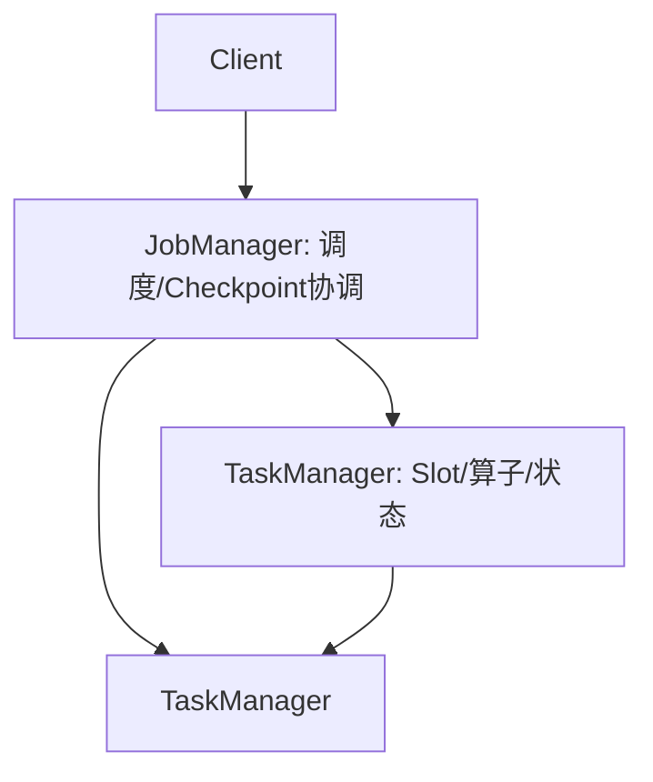
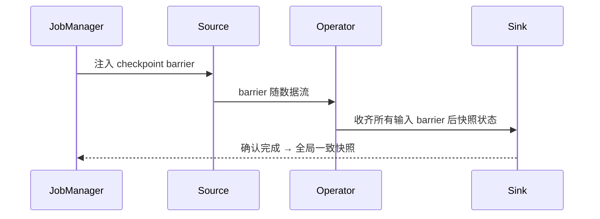

# 大数据 · 08 流处理计算：Flink

> 如果说 Spark 是批处理之王，Flink 就是流处理的事实标准。它把"有状态、精确一次、事件时间"做到极致，让实时计算从"近似"走向"准确"。

本篇讲 Flink 架构、时间/窗口/水印、精确一次容错（Checkpoint）、状态后端，并与 Storm/Spark Streaming 对比。消息队列见 [03-数据采集与同步](03-数据采集与同步.md)。

## 一、Flink 定位

- **有状态的流计算框架**，既能处理无界流（实时）也能处理有界流（批，视作特例）。
- 四大基石：**流（Stream）、状态（State）、时间（Time）、容错（Checkpoint）**。
- 与其他：Storm（低延迟无状态，已淘汰）、Spark Streaming（微批近似）、Kafka Streams（轻量库，绑定 Kafka）。

## 二、架构与运行时



| 角色 | 职责 |
|------|------|
| JobManager（JM） | 作业图调度、Checkpoint 触发与协调、故障恢复 |
| TaskManager（TM） | 执行算子，含 Slot（资源单元）、状态后端 |
| Slot | TM 内的资源槽，决定并行度 |

- **并行度（parallelism）**：每个算子并行实例数，决定吞吐。
- **作业图 → 执行图**：优化后分配到 Slot 并行执行。

## 三、时间语义

| 时间 | 含义 | 用途 |
|------|------|------|
| Event Time（事件时间） | 事件产生时的时间戳 | 准确聚合（按业务时间）⭐ |
| Processing Time（处理时间） | 到达算子的墙上时钟 | 极低延迟、可容忍近似 |
| Ingestion Time | 进入 Flink 的时间 | 折中 |

> 真实场景几乎都用 **Event Time**：用户 14:30:00 点击，即使 14:30:03 才到 Flink，也要计入 14:30 的窗口。

## 四、窗口（Window）

| 窗口 | 说明 | 场景 |
|------|------|------|
| 滚动（Tumbling） | 固定大小、不重叠 | 每 5 分钟统计 |
| 滑动（Sliding） | 固定大小、可重叠 | 每 1 分钟看近 5 分钟 |
| 会话（Session） | 按活动间隔动态 | 用户单次访问会话 |
| 全局（Global） | 需自定义触发器 | 特殊聚合 |

```java
stream.keyBy(Order::getUserId)
      .window(TumblingEventTimeWindows.of(Time.minutes(5)))
      .reduce((a, b) -> new Order(a.userId, a.amount + b.amount));
```

## 五、水印（Watermark）：处理乱序与迟到

- **Watermark = "确信比 T 早的事件都到了"** 的特殊记录，驱动窗口触发。
- 策略：`BoundedOutOfOrderness(maxEventTime - 延迟)`（允许乱序）、`MonotonousTimestamps`（严格有序）。
- **迟到数据**：窗口已触发后到的事件 → 用 `allowedLateness` 延长窗口持有期，或 `sideOutput` 旁路收集。
- ⚠️ 调 watermark 延迟要基于**实测 P99 迟到**：太小丢数据，太大内存爆（窗口持有过多）。

## 六、状态（State）与状态后端

- **Keyed State**（按 key：ValueState/ListState/MapState）、**Operator State**（算子级）。
- **状态后端**：
  - `HashMapStateBackend`：内存 HashMap，小状态、超低延迟。
  - `EmbeddedRocksDBStateBackend`：**大状态首选**，落盘 KV，支持**增量 checkpoint**。
- 状态是"精确一次"的基础，也是大状态（TB 级）的支撑。

## 七、容错：Checkpoint 与精确一次

### 7.1 Chandy-Lamport 分布式快照

- JM 周期性向 Source 注入 **barrier**，随数据流向下；算子收齐所有输入 barrier 才快照状态并下发。
- 恢复时从最近 checkpoint 重放，保证状态一致。

### 7.2 三种语义
| 语义 | 含义 | 实现 |
|------|------|------|
| At-Least-Once | 可能重复 | 不对齐，更快 |
| **Exactly-Once（处理）** | 每条事件处理一次 | barrier 对齐 + 状态回滚 |
| **端到端 Exactly-Once** | 输出也不重 | Sink 事务/幂等（Kafka 事务、TwoPhaseCommitSink） |

> 关键区分：**Flink 的 Exactly-Once 是"处理语义"**（状态一致）；**端到端**还需 Sink 支持事务或幂等（如 Kafka 事务写、Iceberg/Paimon 的幂等 upsert）。

### 7.3 Checkpoint 配置
```java
env.enableCheckpointing(5000);                 // 5s 一次
env.getCheckpointConfig().setCheckpointingMode(CheckpointingMode.EXACTLY_ONCE);
// 最小间隔、超时、最大并发、外部化（保留用于 savepoint）
```
- **Savepoint**：手动触发的快照，用于升级/扩缩容/迁移（与代码版本兼容）。
- **Unaligned Checkpoint**（1.14+）：高背压下把在途数据纳入快照，避免 barrier 被背压堵住。

## 八、与 Storm / Spark Streaming 对比

| 维度 | Storm | Spark Streaming | Flink |
|------|-------|-----------------|-------|
| 处理模型 | 逐条（原生流） | 微批（近似流） | **原生流** |
| 延迟 | 毫秒 | 秒级 | 毫秒 |
| 状态 | 弱 | 有 | **一等公民** |
| 精确一次 | At-Least | 勉强 | **原生 Exactly-Once** |
| 事件时间/水印 | 弱 | 一般 | **强** |
| 现状 | 淘汰 | 存量 | 主流 |

## 九、Flink 2.x 与 K8s（2025）

- **Flink 2.x**：异步执行模型（容忍远程状态访问延迟）、流批一体更彻底、存算分离友好。
- **on Kubernetes**：Native K8s 部署，TM 按需扩缩，配合对象存储状态后端（状态外置）。
- 实时入湖：Flink + Paimon/Iceberg 是实时数仓标配（见 [11-实时数仓与湖仓一体](11-实时数仓与湖仓一体.md)）。

## 十、设计 Checklist

- [ ] 用 Event Time + Watermark，延迟基于实测迟到设定。
- [ ] 开启 Exactly-Once Checkpoint + Sink 事务/幂等（端到端）。
- [ ] 大状态用 RocksDB 后端 + 增量 checkpoint。
- [ ] 窗口迟到策略：`allowedLateness` + sideOutput 兜底。
- [ ] 监控背压（`backpressure`）、checkpoint 时长/对齐、状态大小。
- [ ] 升级用 Savepoint，先验证可恢复再切流量。

> 参考：Apache Flink 官方（What is Flink / Stateful Stream Processing）、Chandy-Lamport 快照算法、Flink 2.x on K8s 实践、Kafka 事务/TwoPhaseCommit 文档。
