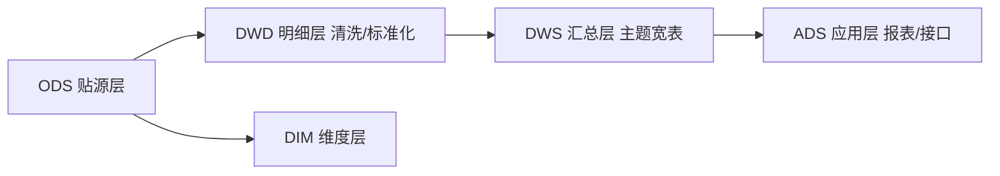
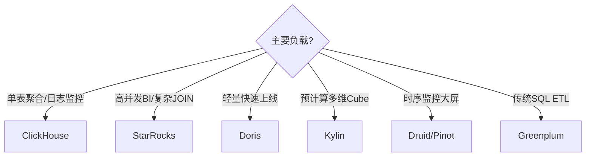
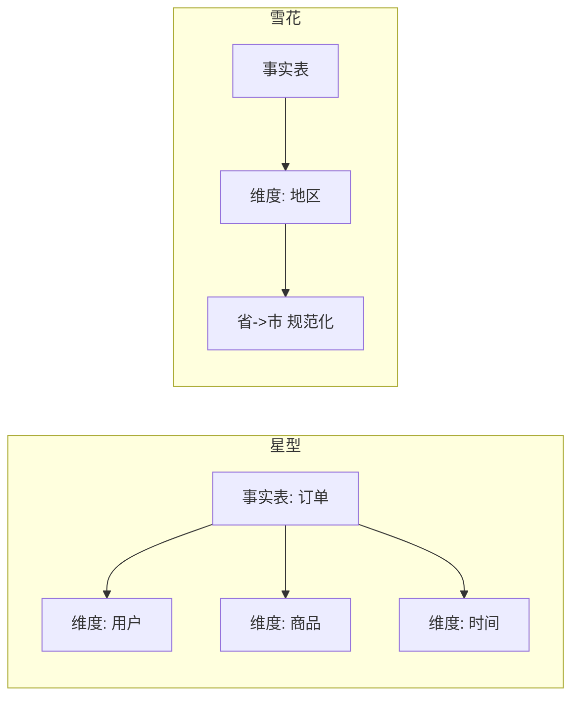

# 大数据 · 09 数据仓库与 OLAP 引擎

> 数据"存好"之后还要"算得出来、查得快"。数据仓库负责把原始数据治理成面向分析的模型；OLAP 引擎则提供亚秒级的多维查询——这是 BI 与决策的地基。

本篇讲维度建模、数仓分层（ODS/DWD/DWS/ADS），并横向对比 ClickHouse/Doris/StarRocks/Kylin/Druid/Greenplum。

## 一、数据仓库是什么

- **定义**：面向主题的、集成的、稳定的、随时间演变的数据集合，用于支持管理决策（Inmon 定义）。
- 与数据湖区别：数仓**结构化、schema-on-write、为分析优化**；湖**多源原始、schema-on-read**。湖仓一体见 [11](11-实时数仓与湖仓一体.md)。

## 二、维度建模（Kimball）

| 模型 | 说明 | 适用 |
|------|------|------|
| 星型模型 | 事实表 + 直接维度表（放射状） | 最常用，查询简单 |
| 雪花模型 | 维度再规范化（维度套维度） | 节省空间，join 多 |
| 星座模型 | 多事实表共享维度 | 复杂业务域 |

- **事实表（Fact）**：业务流程的度量（订单金额、点击数），含外键 + 度量。
- **维度表（Dim）**：描述"谁/什么/何时/何地"（用户、商品、时间）。
- **缓慢变化维（SCD）**：维度随时间变 → Type1 覆盖 / Type2 加历史版本 / Type3 留前值。

## 三、数仓分层（核心规范）



| 层 | 全称 | 职责 | 数据 |
|----|------|------|------|
| ODS | 操作数据层 | 贴源、原样保留 | 原始 |
| DWD | 明细数据层 | 清洗、脱敏、标准化、拉宽 | 明细事实 |
| DWS | 汇总数据层 | 按主题预聚合（用户/商品/交易宽表） | 轻度汇总 |
| ADS | 应用数据层 | 直接服务报表/API/标签 | 高度聚合 |
| DIM | 维度层 | 维度字典（缓慢变化维） | 维度 |

> 分层价值：**解耦、复用、可追溯、口径统一**。OneData 方法（阿里）强调"一个指标一个口径"。

## 四、OLAP 引擎全景对比（2025）

OLAP 引擎多为 **MPP（大规模并行） + 列式 + 向量化**，差别在架构、更新能力、join 与生态。

### 4.1 三强：ClickHouse / Doris / StarRocks

| 维度 | ClickHouse | Apache Doris | StarRocks |
|------|-----------|--------------|-----------|
| 起源 | Yandex (2016) | 百度 Palo (2018 进 ASF) | 鼎石（DorisDB，2021） |
| 架构 | Shared-Nothing，无中心元数据 | FE（元数据/计划）+ BE | FE + BE，重写向量化引擎 |
| 写入模型 | MergeTree 家族（Replacing 异步合并） | 聚合/唯一/更新/明细 | 主键表 Primary Key（实时 upsert） |
| 单表聚合 | **极快**（压缩+扫描最优） | 快 | 快 |
| 多表 JOIN | 弱（需手动优化） | 中（追赶中） | **极强（CBO+向量化）** |
| 高并发 | 一般（资源竞争） | 中 | **优秀（万级 QPS）** |
| 实时更新 | 弱（FINAL 去重） | 支持 | **强（即时一致）** |
| 存算分离 | S3 表引擎 | 实验 | **支持（S3/HDFS）** |
| 生态/湖仓 | S3/Delta 周边 | HDFS/S3 | **Iceberg/Hudi 外表直查** |
| 运维 | 难（配置多） | 简单（MySQL 协议） | 中 |

- **ClickHouse**：超大规模日志/监控/行为分析，单表无敌，写入吞吐极高。
- **Doris**：中小团队轻量实时数仓，MySQL 协议全兼容，低成本上线。
- **StarRocks**：企业级核心分析、复杂 join、实时 upsert、湖仓一体（外表直查 Iceberg/Hudi）。

### 4.2 其他重要引擎
| 引擎 | 定位 | 亮点 |
|------|------|------|
| Apache Kylin | 预计算立方体 | 亚秒多维分析，空间换时间（Cube） |
| Apache Druid | 时序+维度 | 亚秒、流式摄入，监控/广告 |
| Apache Pinot | 毫秒级 | 高可用、用户分析，LinkedIn/Uber |
| Greenplum | MPP 关系型 | PostgreSQL 系，SQL 完整，ETL |
| DuckDB | 嵌入式 OLAP | 单机进程内分析，轻量（DuckLake 基础） |

### 4.3 选型决策


> 口诀：**"单表极致选 ClickHouse，复杂高并发选 StarRocks，轻量省心选 Doris。"**

## 五、物化视图与预聚合

- **物化视图（MV）**：预先算好聚合结果，查询自动路由（Doris/StarRocks/Iceberg 都支持），提速明显。
- **Rollup / 聚合表**：按维度组合预聚合，换空间换时间。
- 权衡：写入成本 ↑、存储 ↑，但查询 ↓↓。

## 六、数仓与 OLAP 设计 Checklist

- [ ] 按 ODS/DWD/DWS/ADS 分层，禁止跨层乱飞。
- [ ] 维度建模用星型，统一缓慢变化维策略。
- [ ] 指标口径用 OneData 统一，建指标字典。
- [ ] 引擎按负载选：日志 ClickHouse、BI StarRocks、轻量 Doris。
- [ ] 建物化视图/聚合表加速热点查询，监控命中率。
  - [ ] 高并发场景控制大查询资源（队列/配额），防单查询拖垮集群。

> 参考：Kimball《数据仓库工具箱》、Apache Doris/StarRocks/ClickHouse 官方文档、TPC-H/SSB 基准、各厂实时数仓技术栈评测（2025）。

## 七、维度建模实战：星型 / 雪花 / 星座



- **星型（最常用）**：事实表放射状连维度，查询简单、join 少。

```sql
-- 星型建模示例
CREATE TABLE dwd_order_fact (
  order_id BIGINT, user_id BIGINT, sku_id BIGINT,
  pay_amount DECIMAL(18,2), order_time TIMESTAMP)
PARTITIONED BY (dt STRING);

CREATE TABLE dim_user (
  user_id BIGINT, user_name STRING, city STRING, reg_date DATE);

-- 查询
SELECT u.city, SUM(f.pay_amount)
FROM dwd_order_fact f JOIN dim_user u ON f.user_id=u.user_id
WHERE f.dt='2026-07-29' GROUP BY u.city;
```

- **雪花**：维度再规范化（省→市→区），省空间但 join 多，性能换存储，谨慎用。
- **星座**：多事实表共享维度（如订单事实+退款事实共享用户/商品维度），适合复杂业务域。

## 八、缓慢变化维（SCD）实战

| 类型 | 做法 | 适用 |
|------|------|------|
| Type1 覆盖 | 直接更新 | 不关心历史 |
| Type2 加版本 | 加 `start/end/is_current` | **需历史追踪** |
| Type3 留前值 | 加 `prev_value` 列 | 仅看上一版 |

```sql
-- Type2 拉链表示例（关旧开新）
INSERT INTO dim_user_zipper
SELECT user_id, user_name, city, '2026-07-29' start_date, '9999-12-31' end_date, 1 is_current
FROM src_user;
-- 实际用 MERGE / 关旧记录保证同一 user_id 仅一条 is_current=1
```

## 九、ClickHouse 物化视图与索引

- **物化视图（MV）**：预计算聚合，查询自动路由，提速显著。

```sql
CREATE MATERIALIZED VIEW mv_city_gmv
ENGINE = AggregatingMergeTree()
PARTITION BY toYYYYMM(day)
AS SELECT city, day, sumState(pay_amount) AS gmv
FROM orders_local GROUP BY city, day;

-- 查询命中 MV（自动）
SELECT city, sumMerge(gmv) FROM mv_city_gmv WHERE day='2026-07-29' GROUP BY city;
```

- **索引**：主键（order by）稀疏索引 + **跳数索引（skip index）** `minmax`/`set`/`bloom_filter` 加速过滤；`PARTITION BY` 做分区裁剪。
- 注意：ClickHouse MV **不自动随基表 DELETE 更新**，需手动维护或 FINAL 去重。

## 十、Doris / StarRocks 关键能力

| 能力 | Doris | StarRocks |
|------|-------|-----------|
| 主键模型 | Unique Key（upsert） | Primary Key（实时 upsert，即时一致） |
| 物化视图 | 同步 MV + 自动路由 | 同步 MV + 自动路由 + 多表 |
| 外表皮 | HDFS/S3 | **Iceberg/Hudi/Delta 直查** |
| 向量化 | 是 | **自研极速向量化** |
| 高并发 | 中 | **万级 QPS** |
| 部署 | FE+BE，MySQL 协议 | FE+BE，MySQL 协议 |

- **Routine Load 实时摄入**（Doris/StarRocks 通用）：

```sql
CREATE ROUTINE LOAD db.kafka_orders ON orders
PROPERTIES ("desired_concurrent_number"="3")
FROM KAFKA ("kafka_broker_list"="k:9092","kafka_topic"="orders");
```

## 十一、OLAP 选型对比表（扩展）

| 需求 | 首选 | 理由 |
|------|------|------|
| 单表聚合/日志监控 | ClickHouse | 压缩+扫描最优 |
| 高并发 BI/复杂 JOIN | StarRocks | CBO+向量化+高并发 |
| 轻量快速上线 | Doris | MySQL 协议、易运维 |
| 预计算多维 Cube | Kylin | 亚秒、空间换时间 |
| 时序监控大屏 | Druid/Pinot | 流式摄入、亚秒 |
| 传统 SQL ETL | Greenplum | PG 系完整 SQL |

## 十二、建模与 OLAP Checklist

- [ ] 维度建模用星型，SCD 统一策略（推荐 Type2）。
- [ ] 严格 ODS/DWD/DWS/ADS 分层，指标口径 OneData 化。
- [ ] ClickHouse 建 MV + 跳数索引；Doris/StarRocks 用 Routine Load 实时入。
- [ ] 引擎按负载选（日志 CK / BI SR / 轻量 Doris）。
- [ ] 大查询限资源（队列/配额），防单查询拖垮。
- [ ] 物化视图监控命中率，过期重算。
