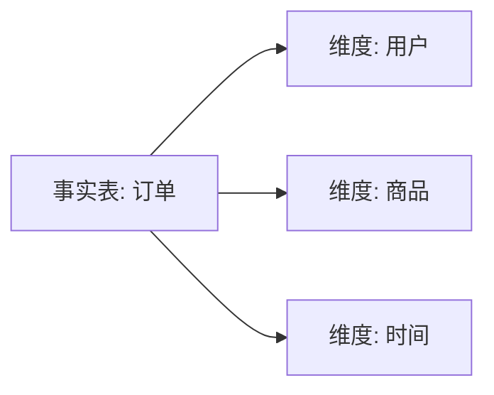
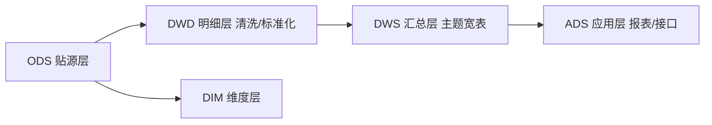
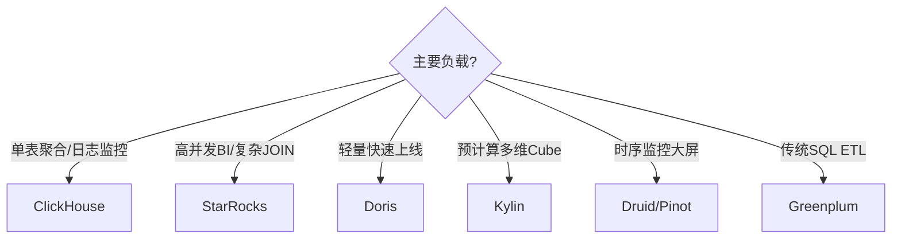
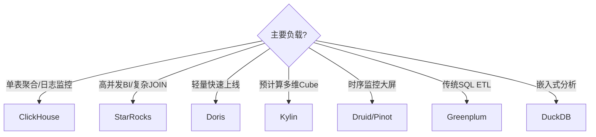

# 大数据 · 09 数据仓库与 OLAP 引擎（维度建模 / 数仓分层 / 引擎原理 / 物化视图 / 选型决策）

> 数据"存好"之后还要"算得出来、查得快"。数据仓库负责把原始数据治理成面向分析的模型；OLAP 引擎则提供亚秒级的多维查询——这是 BI 与决策的地基。本篇深入拆解维度建模、数仓分层、OLAP 引擎原理、物化视图与选型决策。

---

## 一、要解决的问题

| 痛点 | 说明 |
|------|------|
| 数据混乱 | 原始数据无结构、无口径 |
| 查询慢 | 海量明细聚合慢 |
| 口径不一致 | 各部门指标对不上 |
| 复用难 | 相同计算重复开发 |
| 高并发 BI | 报表/接口需要亚秒响应 |

> 核心认知：**数仓 = 面向分析的数据组织（分层 + 建模 + 口径统一）**；**OLAP = 让多维查询亚秒级**（列式 + 向量化 + MPP）。

---

## 二、数据仓库是什么

- **定义**：面向主题的、集成的、稳定的、随时间演变的数据集合，用于支持管理决策（Inmon 定义）。
- **与数据湖区别**：
  - 数仓：结构化、schema-on-write、为分析优化
  - 湖：多源原始、schema-on-read
  - 湖仓一体见「[11-实时数仓与湖仓一体](11-实时数仓与湖仓一体.md)」

```
三大特性（Inmon）：
  面向主题（Subject-Oriented）：按业务主题组织（订单/用户/商品）
  集成（Integrated）：统一命名/编码/单位
  稳定（Non-Volatile）：只读，历史保留
  时间演变（Time-Variant）：随时间变化（快照/拉链）
```

---

## 三、维度建模（Kimball）

### 3.1 模型对比

| 模型 | 说明 | 适用 |
|------|------|------|
| 星型模型 | 事实表 + 直接维度表（放射状） | 最常用，查询简单 |
| 雪花模型 | 维度再规范化（维度套维度） | 节省空间，join 多 |
| 星座模型 | 多事实表共享维度 | 复杂业务域 |

### 3.2 星型建模示例



```sql
CREATE TABLE dwd_order_fact (
  order_id BIGINT, user_id BIGINT, sku_id BIGINT,
  pay_amount DECIMAL(18,2), order_time TIMESTAMP)
PARTITIONED BY (dt STRING);

CREATE TABLE dim_user (
  user_id BIGINT, user_name STRING, city STRING, reg_date DATE);

SELECT u.city, SUM(f.pay_amount)
FROM dwd_order_fact f JOIN dim_user u ON f.user_id=u.user_id
WHERE f.dt='2026-07-29' GROUP BY u.city;
```

```
事实表（Fact）：业务流程的度量（订单金额、点击数），含外键 + 度量
维度表（Dim）：描述"谁/什么/何时/何地"（用户、商品、时间）
雪花：维度再规范化（省→市→区），省空间但 join 多 → 谨慎用
星座：多事实表共享维度（订单+退款共享用户/商品）→ 复杂业务域
```

### 3.3 缓慢变化维（SCD）

| 类型 | 做法 | 适用 |
|------|------|------|
| Type1 覆盖 | 直接更新 | 不关心历史 |
| Type2 加版本 | 加 `start/end/is_current` | **需历史追踪** |
| Type3 留前值 | 加 `prev_value` 列 | 仅看上一版 |

```sql
-- Type2 拉链表示例（关旧开新）
INSERT INTO dim_user_zipper
SELECT user_id, user_name, city, '2026-07-29' start_date,
       '9999-12-31' end_date, 1 is_current
FROM src_user;
-- 实际用 MERGE / 关旧记录保证同一 user_id 仅一条 is_current=1
```

```
拉链表优缺点：
  优点：完整历史、可回溯
  缺点：存储增长（每变更一条新记录）
  清理：定期归档过期版本（end_date 很久的压缩）
```

---

## 四、数仓分层（核心规范）

### 4.1 分层结构



| 层 | 全称 | 职责 | 数据 |
|----|------|------|------|
| ODS | 操作数据层 | 贴源、原样保留 | 原始 |
| DWD | 明细数据层 | 清洗、脱敏、标准化、拉宽 | 明细事实 |
| DWS | 汇总数据层 | 按主题预聚合（用户/商品/交易宽表） | 轻度汇总 |
| ADS | 应用数据层 | 直接服务报表/API/标签 | 高度聚合 |
| DIM | 维度层 | 维度字典（缓慢变化维） | 维度 |

### 4.2 分层价值

```
解耦：层间独立，变更不影响上层
复用：底层资产被上层共享
可追溯：每层血缘清晰（见 [12](12-数据治理与数据质量.md)）
口径统一：OneData 方法（阿里）"一个指标一个口径"

规范：
  禁止跨层乱飞（DWD 不直接查 ODS）
  命名前缀：ods_/dwd_/dws_/ads_/dim_
  指标定义沉淀为字典
```

---

## 五、OLAP 引擎原理（深入）

### 5.1 为什么快（三大支柱）

```
1. 列式存储：只读需要的列（少 IO）+ 高压缩（字典/RLE/Delta）
2. 向量化执行：按列批量 + SIMD 指令（一次处理多行）
3. MPP 并行：多节点/多核并行 + 数据分片

配套优化：
  分区裁剪（只扫相关分区）
  物化视图（预聚合）
  Bloom Filter / min-max 运行时过滤
  稀疏索引/跳数索引
```

### 5.2 架构模式

| 架构 | 代表 | 特点 |
|------|------|------|
| Shared-Nothing | ClickHouse | 无中心，数据按分片分布，节点独立 |
| 中心元数据 + 数据分片 | Doris/StarRocks（FE+BE） | FE 管元数据/计划，BE 存算 |
| 预计算 Cube | Kylin | 提前算好所有维度组合 |
| 时序+流式摄入 | Druid/Pinot | 亚秒、流式 |
| MPP 关系型 | Greenplum | PostgreSQL 系，SQL 完整 |
| 嵌入式 | DuckDB | 单机进程内分析，轻量 |

### 5.3 ClickHouse 存储引擎

```
MergeTree 家族：
  MergeTree：基础（分区 + 稀疏索引 + 列式）
  ReplacingMergeTree：按 key 去重（异步合并）
  SummingMergeTree：预聚合
  AggregatingMergeTree：聚合状态
  CollapsingMergeTree：折叠删除

稀疏索引：按插入顺序每隔 N 行建索引（跳过块）
跳数索引：minmax/set/bloom_filter 加速过滤
```

---

## 六、三强引擎对比（2025）

### 6.1 ClickHouse / Doris / StarRocks

| 维度 | ClickHouse | Apache Doris | StarRocks |
|------|-----------|--------------|-----------|
| 起源 | Yandex (2016) | 百度 Palo (2018 进 ASF) | 鼎石（DorisDB，2021） |
| 架构 | Shared-Nothing，无中心元数据 | FE（元数据/计划）+ BE | FE + BE，重写向量化引擎 |
| 写入模型 | MergeTree 家族（Replacing 异步合并） | 聚合/唯一/更新/明细 | 主键表 Primary Key（实时 upsert） |
| 单表聚合 | **极快**（压缩+扫描最优） | 快 | 快 |
| 多表 JOIN | 弱（需手动优化） | 中（追赶中） | **极强（CBO+向量化）** |
| 高并发 | 一般（资源竞争） | 中 | **优秀（万级 QPS）** |
| 实时更新 | 弱（FINAL 去重） | 支持 | **强（即时一致）** |
| 存算分离 | S3 表引擎 | 实验 | **支持（S3/HDFS）** |
| 生态/湖仓 | S3/Delta 周边 | HDFS/S3 | **Iceberg/Hudi 外表直查** |
| 运维 | 难（配置多） | 简单（MySQL 协议） | 中 |

### 6.2 定位速记

```
ClickHouse：超大规模日志/监控/行为分析，单表无敌，写入吞吐极高
Doris：中小团队轻量实时数仓，MySQL 协议全兼容，低成本上线
StarRocks：企业级核心分析、复杂 join、实时 upsert、湖仓一体
```

### 6.3 其他引擎

| 引擎 | 定位 | 亮点 |
|------|------|------|
| Apache Kylin | 预计算立方体 | 亚秒多维分析，空间换时间（Cube） |
| Apache Druid | 时序+维度 | 亚秒、流式摄入，监控/广告 |
| Apache Pinot | 毫秒级 | 高可用、用户分析，LinkedIn/Uber |
| Greenplum | MPP 关系型 | PostgreSQL 系，SQL 完整，ETL |
| DuckDB | 嵌入式 OLAP | 单机进程内分析，轻量（DuckLake 基础） |

---

## 七、选型决策树



| 需求 | 首选 | 理由 |
|------|------|------|
| 单表聚合/日志监控 | ClickHouse | 压缩+扫描最优 |
| 高并发 BI/复杂 JOIN | StarRocks | CBO+向量化+高并发 |
| 轻量快速上线 | Doris | MySQL 协议、易运维 |
| 预计算多维 Cube | Kylin | 亚秒、空间换时间 |
| 时序监控大屏 | Druid/Pinot | 流式摄入、亚秒 |
| 传统 SQL ETL | Greenplum | PG 系完整 SQL |

> 口诀：**"单表极致选 ClickHouse，复杂高并发选 StarRocks，轻量省心选 Doris。"**

---

## 八、物化视图与预聚合

### 8.1 物化视图（MV）

```
概念：预先算好聚合结果，查询自动路由（Doris/StarRocks/Iceberg 支持）
作用：热点聚合查询提速显著（预聚合）

ClickHouse MV 示例：
  CREATE MATERIALIZED VIEW mv_city_gmv
  ENGINE = AggregatingMergeTree()
  PARTITION BY toYYYYMM(day)
  AS SELECT city, day, sumState(pay_amount) AS gmv
  FROM orders_local GROUP BY city, day;

  SELECT city, sumMerge(gmv) FROM mv_city_gmv
  WHERE day='2026-07-29' GROUP BY city;

⚠️ ClickHouse MV 不自动随基表 DELETE 更新 → 需手动维护或 FINAL 去重
```

### 8.2 预聚合方式对比

| 方式 | 原理 | 查询提速 | 维护成本 |
|------|------|----------|----------|
| 物化视图 | 自动路由预聚合 | 高 | 中 |
| 聚合表（Rollup） | 按维度组合预聚合 | 高 | 高 |
| 明细+索引 | 依赖列式扫描 | 中 | 低 |

```
权衡：写入成本 ↑、存储 ↑，但查询 ↓↓
监控命中率：物化视图被查询使用率
```

---

## 九、Doris / StarRocks 关键能力

| 能力 | Doris | StarRocks |
|------|-------|-----------|
| 主键模型 | Unique Key（upsert） | Primary Key（实时 upsert，即时一致） |
| 物化视图 | 同步 MV + 自动路由 | 同步 MV + 自动路由 + 多表 |
| 外表皮 | HDFS/S3 | **Iceberg/Hudi/Delta 直查** |
| 向量化 | 是 | **自研极速向量化** |
| 高并发 | 中 | **万级 QPS** |
| 部署 | FE+BE，MySQL 协议 | FE+BE，MySQL 协议 |

```
Routine Load 实时摄入（Doris/StarRocks 通用）：
  CREATE ROUTINE LOAD db.kafka_orders ON orders
  PROPERTIES ("desired_concurrent_number"="3")
  FROM KAFKA ("kafka_broker_list"="k:9092","kafka_topic"="orders");
```

---

## 十、ClickHouse 索引深入

```
主键（ORDER BY）：稀疏索引（每隔 N 行记一行索引）
  作用：跳过不相关数据块
  设计：高频过滤字段放前面

跳数索引（Skip Index）：
  minmax / set / bloom_filter
  示例：INDEX idx_status status TYPE minmax GRANULARITY 4
  → 过滤 status 时跳过不相关 granule

PARTITION BY：分区裁剪（按时间分区，查询只扫相关分区）
压缩：LZ4/ZSTD（列级）

注意：
  稀疏索引读多块再过滤 → 查询性能依赖索引设计
  不适合随机点查（高并发）→ 那是 StarRocks/Doris 主键优势
```

---

## 十一、数仓与 OLAP 设计 Checklist

- [ ] 按 ODS/DWD/DWS/ADS 分层，禁止跨层乱飞。
- [ ] 维度建模用星型，统一缓慢变化维策略。
- [ ] 指标口径用 OneData 统一，建指标字典。
- [ ] 引擎按负载选：日志 ClickHouse、BI StarRocks、轻量 Doris。
- [ ] 建物化视图/聚合表加速热点查询，监控命中率。
- [ ] ClickHouse 建 MV + 跳数索引；Doris/StarRocks 用 Routine Load 实时入。
- [ ] 高并发场景控制大查询资源（队列/配额），防单查询拖垮集群。
- [ ] 物化视图监控命中率，过期重算。

---

## 十二、OLAP 引擎对比深入

### 12.1 ClickHouse 深入

```
MergeTree 家族：
  MergeTree：基础（分区 + 稀疏索引 + 列式）
  ReplacingMergeTree：按 ORDER BY 去重（异步合并）
  SummingMergeTree：自动预聚合（求和）
  AggregatingMergeTree：聚合状态（复杂聚合）
  CollapsingMergeTree：折叠删除（sign 字段）

写入：
  INSERT INTO t VALUES (...) → 追加写入
  ReplacingMergeTree：相同 ORDER BY 的行异步合并为最新版
  
查询：
  SELECT ... FINAL → 合并后查询（性能差，慎用）
  SELECT ... WHERE ... → 稀疏索引过滤
```

### 12.2 Doris/StarRocks 架构对比

| 组件 | Doris | StarRocks |
|------|-------|-----------|
| FE（Frontend） | 元数据 + 查询计划 | 元数据 + 查询计划 |
| BE（Backend） | 存储 + 计算 | 存储 + 计算 |
| 协议 | MySQL 协议 | MySQL 协议 |
| 向量化 | 是 | **自研极速向量化** |
| 存算分离 | 实验 | **支持（S3/HDFS）** |

### 12.3 引擎选型决策



## 十三、数仓 Schema 设计

### 13.1 星型模型 vs 雪花模型

| 维度 | 星型模型 | 雪花模型 |
|------|----------|----------|
| 维度表 | 扁平化（反规范化） | 规范化（维度套维度） |
| JOIN 数 | 少（事实表 JOIN 维度表） | 多（维度表之间也 JOIN） |
| 查询性能 | 快 | 慢（多 JOIN） |
| 存储空间 | 大（冗余） | 小（规范化） |
| 维护 | 简单 | 复杂 |
| 推荐 | ✅ 生产首选 | 特殊场景 |

### 13.2 星座模型（Fact Constellation）

```
星座模型 = 多个事实表共享维度表

示例：
  事实表：订单事实表、退款事实表、浏览事实表
  维度表：用户维度、商品维度、时间维度
  
  订单事实表 → 用户维度
  退款事实表 → 用户维度
  浏览事实表 → 用户维度
  
  三个事实表共享用户维度 → 星座模型
```

## 十四、缓慢变化维（SCD）深入

### 14.1 SCD Type 2 实战

```sql
-- SCD Type 2 拉链表
CREATE TABLE dim_user_scd (
  user_id BIGINT,
  user_name STRING,
  city STRING,
  start_date DATE,
  end_date DATE,
  is_current BOOLEAN
);

-- 插入新版本（关旧开新）
MERGE INTO dim_user_scd t
USING (
  SELECT user_id, user_name, city,
         CURRENT_DATE AS start_date,
         '9999-12-31'::DATE AS end_date,
         TRUE AS is_current
  FROM new_users
) s ON t.user_id = s.user_id AND t.is_current = TRUE
WHEN MATCHED THEN UPDATE SET
  end_date = CURRENT_DATE - INTERVAL '1 day',
  is_current = FALSE
WHEN NOT MATCHED THEN INSERT VALUES (
  s.user_id, s.user_name, s.city, s.start_date, s.end_date, s.is_current
);
```

### 14.2 SCD 选型

| 类型 | 做法 | 适用 | 缺点 |
|------|------|------|------|
| Type 1 | 直接覆盖 | 不关心历史 | 丢失历史 |
| Type 2 | 加 start/end/is_current | **需历史追踪** | 存储增长 |
| Type 3 | 加 prev_value 列 | 仅看上一版 | 只保留一版历史 |
| Type 4 | 历史表 + 当前表 | 大量历史 | 查询复杂 |

## 十五、数据仓库测试

### 15.1 测试类型

| 测试类型 | 说明 | 工具 |
|----------|------|------|
| Schema 测试 | 表结构/字段类型正确 | 自定义 SQL |
| 数据质量测试 | 非空/唯一/值域 | Great Expectations |
| ETL 测试 | 转换逻辑正确 | dbt tests |
| 性能测试 | 查询延迟/吞吐 | 自定义 Benchmark |
| 对账测试 | 新旧系统数据一致 | 自定义对账脚本 |

### 15.2 数据质量规则

```sql
-- 数据质量校验 SQL
-- 非空率
SELECT COUNT(*) FILTER (WHERE user_id IS NULL) * 100.0 / COUNT(*) AS null_rate
FROM dwd_orders;

-- 唯一率
SELECT (COUNT(*) - COUNT(DISTINCT order_id)) * 100.0 / COUNT(*) AS dup_rate
FROM dwd_orders;

-- 跨表一致性
SELECT a.order_id FROM dwd_orders a
LEFT JOIN dim_users b ON a.user_id = b.user_id
WHERE b.user_id IS NULL;  -- 孤儿记录
```

## 十六、数据集市 vs 数据仓库

| 维度 | 数据仓库（DW） | 数据集市（DM） |
|------|----------------|----------------|
| 范围 | 全企业 | 特定部门/业务 |
| 数据 | 全量（ODS→DWD→DWS→ADS） | 子集（面向主题） |
| 用户 | 数据团队 | 业务分析师 |
| 建模 | 企业级维度模型 | 部门级特定模型 |
| 治理 | 严格（OneData） | 相对宽松 |

> **口诀**：数据仓库是"全企业数据资产"，数据集市是"部门级数据消费"——集市的数据来自仓库。

## 十七、数据仓库在云上

| 能力 | 云上优势 |
|------|----------|
| 弹性扩缩 | 按需扩缩容，无需预采购 |
| 存算分离 | 独立扩展计算和存储 |
| Serverless | 按查询付费，无需运维 |
| 物化视图 | 自动刷新预计算 |
| 跨域分析 | 多区域数据统一查询 |

## 十八、与其他板块的关系

- 列式存储/表格式见「[05-列式存储与数据湖格式](05-列式存储与数据湖格式.md)」；
- 实时数仓见「[11-实时数仓与湖仓一体](11-实时数仓与湖仓一体.md)」；
- OLAP 引擎深挖见「[中间件/ClickHouse](../中间件/ClickHouse.md)」「[中间件/Doris与StarRocks](../中间件/Doris与StarRocks.md)」；
- 联邦查询见「[中间件/Trino联邦查询引擎](../中间件/Trino联邦查询引擎.md)」；
- 数据治理与口径见「[12-数据治理与数据质量](12-数据治理与数据质量.md)」。

> 一句话：**数仓 = 分层（ODS/DWD/DWS/ADS）+ 建模（星型 + SCD）+ 口径统一（OneData）；OLAP = 列式 + 向量化 + MPP 三支柱——选型："单表极致 ClickHouse、复杂高并发 StarRocks、轻量省心 Doris"；建物化视图加速热点查询**。