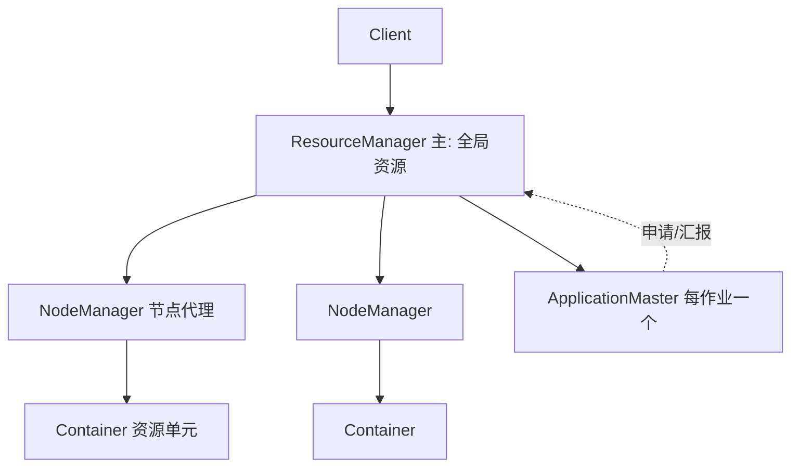
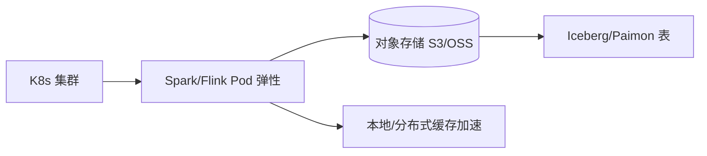

# 大数据 · 10 资源调度：YARN 与 Kubernetes（调度器原理 / 容器模型 / 云原生演进 / 作业编排 / 弹性伸缩）

> 大数据集群有上百节点、上千作业，谁先用资源、用多少、挂了怎么重跑——这由资源调度层决定。YARN 是 Hadoop 时代的调度标准，Kubernetes 正成为云原生新范式。本篇深入拆解 YARN 架构与调度器、容器化调度原理、Spark/Flink on K8s、作业编排与弹性伸缩。

---

## 一、要解决的问题

| 痛点 | 说明 |
|------|------|
| 资源分配 | 多作业公平/按需分配 CPU/内存 |
| 任务隔离 | 作业互不干扰 |
| 弹性伸缩 | 高峰扩、低谷缩 |
| 作业编排 | 依赖/触发/失败重跑 |
| 运维统一 | 计算/监控/网络统一管理 |

> 核心认知：**资源调度 = 「资源管理与作业调度的分离」**——YARN 把资源管理从计算框架解耦；Kubernetes 进一步把调度、编排、弹性、运维一体化。

---

## 二、YARN：Hadoop 资源大脑

### 2.1 架构



| 角色 | 职责 |
|------|------|
| ResourceManager（RM） | 全局资源调度、接收作业、分配 Container |
| NodeManager（NM） | 单节点上的资源与容器生命周期管理 |
| ApplicationMaster（AM） | 每作业一个，向 RM 申请资源、指挥任务执行 |
| Container | 资源封装（CPU/内存），任务运行其中 |

### 2.2 作业提交流程

```
1. Client 提交作业到 RM
2. RM 启动 AM（在某个 NM 的 Container 中）
3. AM 向 RM 申请资源（按需动态）
4. RM 分配 Container → NM 启动任务
5. AM 监控任务、汇报进度
6. 完成 → AM 注销
```

```
说明：
  AM 每作业一个 → 框架差异（MR/Spark/Flink 各实现自己的 AM）
  AM 可申请/释放资源 → 动态伸缩
  Container 抽象 → 计算框架与资源管理解耦
```

---

## 三、三大调度器

| 调度器 | 策略 | 特点 | 适用 |
|--------|------|------|------|
| FIFO | 单队列先进先出 | 简单，小集群 | 仅测试 |
| Capacity | 多队列容量保证 | 按队列划分资源下限，弹性借用 | 多团队共享（企业常用） |
| Fair | 公平共享 | 动态均分资源，小作业快返回 | 交互/混合 |

### 3.1 Capacity Scheduler 配置实战

```xml
<!-- 多队列 + 资源保底 -->
<property>
  <name>yarn.scheduler.capacity.root.queues</name>
  <value>realtime,batch</value>
</property>
<property>
  <name>yarn.scheduler.capacity.root.realtime.capacity</name>
  <value>40</value>            <!-- 实时队列保底 40% -->
</property>
<property>
  <name>yarn.scheduler.capacity.root.realtime.maximum-capacity</name>
  <value>80</value>            <!-- 最多借到 80% -->
</property>
```

```
Capacity 原理：
  每个队列配置最小容量（保底）+ 最大容量（上限）
  队列空闲资源可借给其他队列（弹性）
  队列内可继续分层（子队列）

生产实践：
  实时/核心业务队列保底（防被离线大作业挤占）
  队列间权限隔离（ACL）
  配额监控（容量使用/等待任务）
```

---

## 四、容器模型与调度（深入）

### 4.1 资源抽象

```
Container = CPU + 内存（逻辑资源单元）
  CPU：虚拟核（vcore）数
  内存：堆 + 额外（overhead）

调度决策（RM）：
  节点可用资源 > 申请 → 分配
  资源不足 → 等待队列（Pending）

调度器分层：
  队列间调度（Capacity/Fair）
  队列内调度（FIFO/Fair/DRF）
  DRF：主导资源公平（多资源维度公平）
```

### 4.2 作业生命周期

```
提交 → ACCEPTED → RUNNING → FINISHED/FAILED
状态由 RM 维护（作业状态机）

失败处理：
  AM 失败 → RM 重试（默认 2 次）
  任务失败 → AM 重调度（本地性优先，避免全局重算）
  MR 与 Spark 失败恢复策略不同
```

---

## 五、Kubernetes 调度（云原生）

### 5.1 K8s 调度核心

```
调度器（kube-scheduler）：Pod → Node 的匹配
  过滤（Filter）：资源满足（CPU/内存/GPU）
  打分（Score）：资源均衡、亲和性、反亲和

资源模型：
  requests（请求，调度依据）
  limits（上限，运行时限制）
  QoS：Guaranteed/Burstable/BestEffort

调度器可扩展：
  自定义调度器（multi-scheduler）
  Scheduler Framework 插件
```

### 5.2 大数据 on K8s

| 方式 | 说明 |
|------|------|
| Spark on K8s | 原生 K8s 后端，Driver/Executor 为 Pod |
| Flink Native K8s | JobManager/TaskManager 为 Pod，TM 动态扩缩 |
| K8s Operator | 如 Flink Kubernetes Operator，声明式管理作业生命周期 |

```
关键：状态外置（对象存储 + 远程状态后端），Pod 无状态可随时重建
配合 HPA（水平 Pod 自动扩缩）+ KEDA（按 Kafka lag 扩缩 Flink）
```

```yaml
# Flink Native K8s JobManager Deployment（节选）
apiVersion: apps/v1
kind: Deployment
metadata: { name: flink-jobmanager }
spec:
  replicas: 1
  template:
    spec:
      containers:
      - name: jobmanager
        image: flink:1.18
        args: ["jobmanager"]
        resources:
          requests: { cpu: "1", memory: "2Gi" }
          limits:   { cpu: "2", memory: "4Gi" }
# TaskManager 由 Flink Operator 按并行度拉起，状态外置对象存储
```

### 5.3 存算分离 + K8s 形态



---

## 六、YARN vs K8s 对比

| 维度 | YARN | Kubernetes |
|------|------|------------|
| 定位 | 大数据资源调度 | 通用容器编排 |
| 调度模型 | 队列 + AM + Container | Pod + 亲和性 + QoS |
| 弹性 | 弱（队列静态） | 强（HPA/KEDA） |
| 云原生 | 无 | 原生（CI/CD/网络/监控） |
| 运维 | 重（组件多） | 统一 |
| 生态 | Hadoop 系 | 全栈 |
| 存算 | 耦合 | 分离 |
| 现状 | 存量 Hadoop | 新范式 |

> 趋势：新集群 K8s 化；YARN 保留跑存量 MR/Hive。

---

## 七、作业编排（Airflow / DolphinScheduler）

### 7.1 资源调度 vs 作业编排

```
资源调度：管"节点资源"（谁用多少 CPU/内存）
作业编排：管"作业间的依赖与时间触发"（先跑谁、失败了怎么办）

典型 DAG：采集 → ODS → DWD → DWS → ADS
每层依赖前层成功且到达调度时间
```

### 7.2 工具对比

| 工具 | 定位 | 特点 |
|------|------|------|
| Apache Airflow | 通用工作流编排 | Python DAG、丰富算子、生态广 |
| DolphinScheduler | 大数据专属可视化编排 | 拖拽 DAG、国产主流、易用 |
| Oozie | Hadoop 原生 | 老牌、XML 配置重 |
| Azkaban | 轻量 | 简单，适合小团队 |

### 7.3 Airflow vs DolphinScheduler 选型

| 维度 | Airflow | DolphinScheduler |
|------|---------|------------------|
| 编排方式 | Python DAG 代码 | 可视化拖拽 DAG |
| 定位 | 通用工作流 | **大数据专属** |
| 调度 | 强（cron/数据集触发） | 强（依赖/定时/补数） |
| 运维 | 较重（worker/调度器） | 中（去中心化） |
| 国产生态 | 一般 | 强（中文、易用） |

```
选型：云原生/工程团队 → Airflow；大数据团队/可视化 → DolphinScheduler
```

---

## 八、弹性伸缩：HPA / KEDA

### 8.1 HPA（水平 Pod 自动扩缩）

```
按 CPU/内存扩缩 Flink TM / Spark Executor Pod
指标：CPU 使用率 / 自定义指标

注意：快速扩缩可能抖动 → 设稳定窗口
```

### 8.2 KEDA（按业务指标扩缩）

```yaml
apiVersion: keda.sh/v1alpha1
kind: ScaledObject
metadata: { name: flink-consumer }
spec:
  scaleTargetRef: { name: flink-taskmanager }
  triggers:
  - type: kafka
    metadata:
      topic: orders
      bootstrapServers: kafka:9092
      consumerGroup: flink-cg
      lagThreshold: "50"     # lag>50 扩容
```

```
原理：
  KEDA 监听业务指标（Kafka lag/队列深度/自定义）
  → 触发 HPA 扩缩 → 实时消费能力匹配生产速率

价值：存算分离 + KEDA → "峰时扩容、谷时缩容"，成本最优
```

---

## 九、生产实践

### 9.1 最佳实践

| 实践 | 说明 |
|------|------|
| 队列隔离 | 多团队 Capacity 队列，实时保底 |
| K8s 化 | Spark/Flink Native on K8s，状态外置 |
| 状态外置 | 对象存储 + 远程状态后端，Pod 无状态 |
| 弹性 | HPA 按资源、KEDA 按 Kafka lag |
| 编排 | DAG 依赖 + SLA + 告警，质量不过关阻断下游 |
| 资源配额 | 队列配额/命名空间限额防滥用 |

### 9.2 常见坑

| 坑 | 说明 | 对策 |
|----|------|------|
| 队列饿死 | 大作业占满队列 | 队列配额 + 保底 |
| 弹性抖动 | 频繁扩缩 | 稳定窗口 + 冷却时间 |
| 状态丢失 | Pod 重启丢状态 | 状态外置对象存储 |
| 资源浪费 | 常驻 Executor 空闲 | 按需/弹性 |
| 调度延迟 | 大集群调度慢 | 调度器调优 + 分区 |
| 重试风暴 | 失败作业无限重试 | 重试上限 + 退避 |

---

## 十、调度与编排 Checklist

- [ ] 多团队用 Capacity 队列隔离，实时保底。
- [ ] Spark/Flink Native on K8s，状态外置、Pod 无状态。
- [ ] 作业编排用 Airflow/DS，DAG 依赖 + SLA + 告警。
- [ ] 弹性：HPA 按资源、KEDA 按 Kafka lag 扩缩。
- [ ] 质量不过关阻断下游（与治理联动）。
- [ ] 监控队列资源、Pending、作业失败率、调度延迟。

---

## 十一、与其他板块的关系

- 数据采集见「[03-数据采集与同步](03-数据采集与同步.md)」；
- 离线/实时计算见「[07-批处理计算：MapReduce与Spark](07-批处理计算：MapReduce与Spark.md)」「[08-流处理计算：Flink](08-流处理计算：Flink.md)」；
- 数据质量联动见「[12-数据治理与数据质量](12-数据治理与数据质量.md)」；
- 云原生调度见「[云原生/Kubernetes核心](../../云原生/Kubernetes核心.md)」；
- 编排工具深挖见「[中间件/Airflow](../中间件/Airflow.md)」「[中间件/DolphinScheduler](../中间件/DolphinScheduler.md)」。

> 一句话：**资源调度 = YARN（RM/AM/NM/Container + Capacity 队列）→ K8s（Pod + 亲和性 + HPA/KEDA 弹性）——作业编排负责"依赖与触发"（Airflow/DS），资源调度负责"资源分配"；新架构 K8s 化 + 存算分离 + 状态外置，峰时扩谷时缩成本最优**。