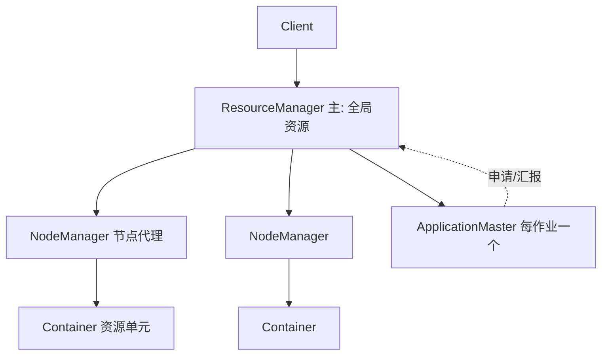
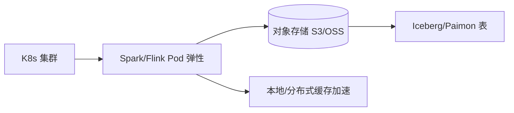

# 大数据 · 10 资源调度：YARN 与 Kubernetes

> 大数据集群有上百节点、上千作业，谁先用资源、用多少、挂了怎么重跑——这由资源调度层决定。YARN 是 Hadoop 时代的调度标准，Kubernetes 正成为云原生新范式。

本篇讲 YARN 架构与调度器、Spark/Flink on K8s 趋势、以及调度/编排工具（Airflow/DolphinScheduler）。

## 一、YARN：Hadoop 资源大脑

YARN（Yet Another Resource Negotiator）把**资源管理与作业调度**从 MapReduce 中解耦，统一调度集群 CPU/内存给各类计算框架。

| 角色 | 职责 |
|------|------|
| ResourceManager（RM） | 全局资源调度、接收作业、分配 Container |
| NodeManager（NM） | 单节点上的资源与容器生命周期管理 |
| ApplicationMaster（AM） | 每作业一个，向 RM 申请资源、指挥任务执行 |
| Container | 资源封装（CPU/内存），任务运行其中 |

- **流程**：Client 提交 → RM 起 AM → AM 向 RM 申请 Container → NM 启动任务。

## 二、三大调度器

| 调度器 | 策略 | 特点 | 适用 |
|--------|------|------|------|
| FIFO | 单队列先进先出 | 简单，小集群 | 仅测试 |
| Capacity | 多队列容量保证 | 按队列划分资源下限，弹性借用 | 多团队共享（企业常用） |
| Fair | 公平共享 | 动态均分资源，小作业快返回 | 交互/混合 |

> 生产多用 **Capacity Scheduler**：给"实时队列"保底资源，避免被离线大作业挤占。

## 三、YARN 的局限与 K8s 崛起

- YARN 局限：调度粒度粗、弹性差、与云原生（CI/CD、监控、网络）割裂、存算耦合。
- **Kubernetes 成为云原生调度标准**：按需弹性、统一运维、存算分离、多云。

### 3.1 Spark / Flink on K8s
| 方式 | 说明 |
|------|------|
| Spark on K8s | 原生 K8s 后端，Driver/Executor 为 Pod |
| Flink Native K8s | JobManager/TaskManager 为 Pod，TM 动态扩缩 |
| K8s Operator | 如 Flink Kubernetes Operator，声明式管理作业生命周期 |

- 状态外置（对象存储 + 远程状态后端），Pod 无状态可随时重建。
- 配合 **HPA（水平 Pod 自动扩缩）** + KEDA（按 Kafka lag 扩缩 Flink）。

### 3.2 存算分离 + K8s 形态

## 四、作业编排：不只是资源调度

资源调度管"节点资源"，**作业编排**管"作业间的依赖与时间触发"。

| 工具 | 定位 | 特点 |
|------|------|------|
| Apache Airflow | 通用工作流编排 | Python DAG、丰富算子、生态广 |
| DolphinScheduler | 大数据专属可视化编排 | 拖拽 DAG、国产主流、易用 |
| Oozie | Hadoop 原生 | 老牌、XML 配置重 |
| Azkaban | 轻量 | 简单，适合小团队 |

- 典型 DAG：采集 → ODS → DWD → DWS → ADS，每层依赖前层成功且到达调度时间。
- 与数据质量（[12](12-数据治理与数据质量.md)）联动：质量不过关则阻断下游。

## 五、调度与编排 Checklist

- [ ] 多团队用 Capacity 队列隔离，给实时/核心业务保底资源。
- [ ] 新集群优先 K8s 化（Spark/Flink Native on K8s），保留 YARN 兼容旧作业。
- [ ] 状态外置 + 存算分离，让计算 Pod 可弹性重建。
- [ ] 用 HPA/KEDA 按负载弹性（如按 Kafka lag 扩 Flink）。
- [ ] 作业依赖用 Airflow/DolphinScheduler 编排，加 SLA 与告警。
- [ ] 监控：队列资源使用、Pending 容器、作业失败率、调度延迟。

> 参考：Apache YARN 架构与调度器文档、Spark/Kubernetes 集成指南、Flink Native Kubernetes 与 Operator 文档、Airflow/DolphinScheduler 文档。
