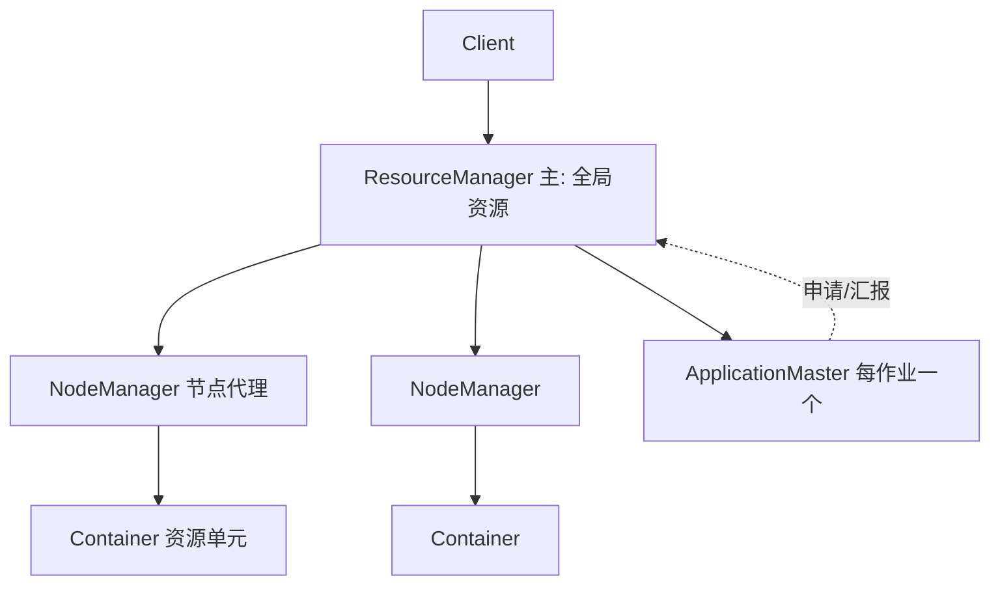
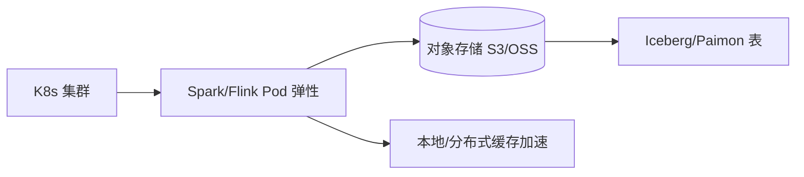
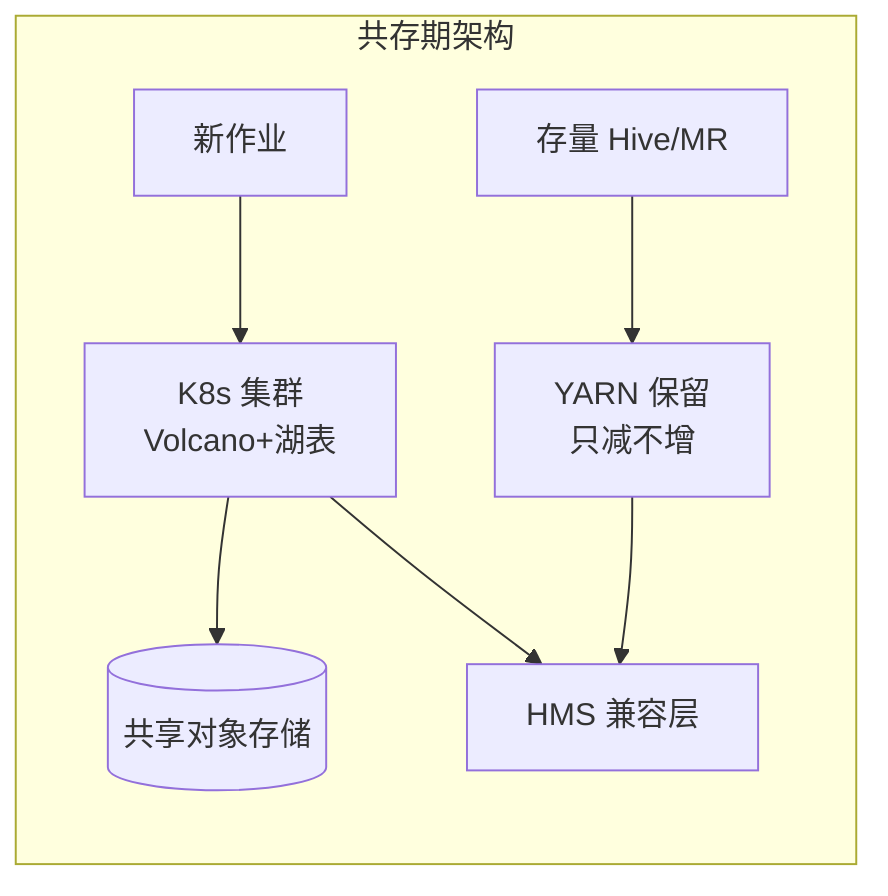
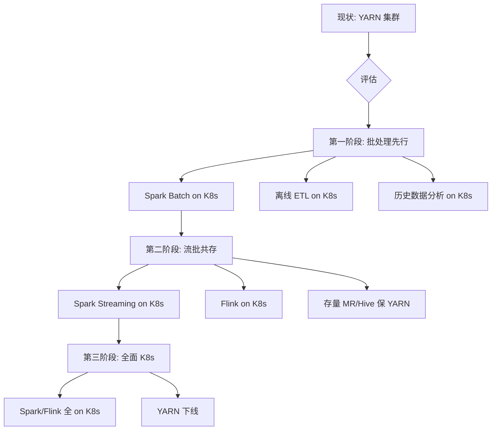
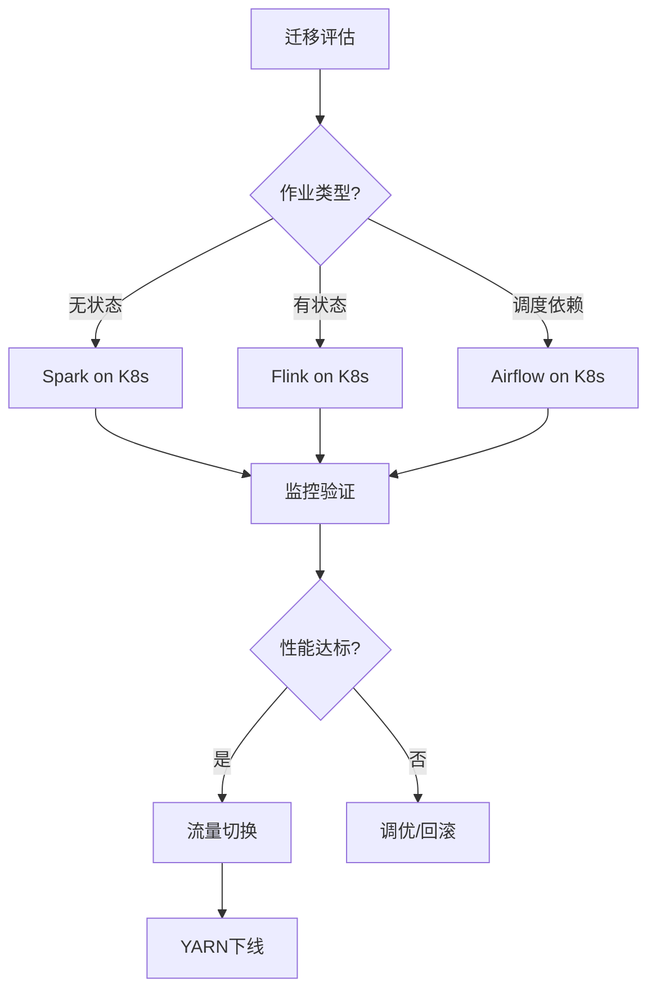

# 大数据 · 10 资源调度：YARN 与 Kubernetes（调度器原理 / 容器模型 / 云原生演进 / 作业编排 / 弹性伸缩）

> 大数据集群有上百节点、上千作业，谁先用资源、用多少、挂了怎么重跑——这由资源调度层决定。YARN 是 Hadoop 时代的调度标准，Kubernetes 正成为云原生新范式。本篇深入拆解 YARN 架构与调度器、容器化调度原理、Spark/Flink on K8s、作业编排与弹性伸缩。

---

## 一、要解决的问题

| 痛点 | 说明 |
|------|------|
| 资源分配 | 多作业公平/按需分配 CPU/内存 |
| 任务隔离 | 作业互不干扰 |
| 弹性伸缩 | 高峰扩、低谷缩 |
| 作业编排 | 依赖/触发/失败重跑 |
| 运维统一 | 计算/监控/网络统一管理 |

> 核心认知：**资源调度 = 「资源管理与作业调度的分离」**——YARN 把资源管理从计算框架解耦；Kubernetes 进一步把调度、编排、弹性、运维一体化。

---

## 二、YARN：Hadoop 资源大脑

### 2.1 架构



| 角色 | 职责 |
|------|------|
| ResourceManager（RM） | 全局资源调度、接收作业、分配 Container |
| NodeManager（NM） | 单节点上的资源与容器生命周期管理 |
| ApplicationMaster（AM） | 每作业一个，向 RM 申请资源、指挥任务执行 |
| Container | 资源封装（CPU/内存），任务运行其中 |

### 2.2 作业提交流程

```
1. Client 提交作业到 RM
2. RM 启动 AM（在某个 NM 的 Container 中）
3. AM 向 RM 申请资源（按需动态）
4. RM 分配 Container → NM 启动任务
5. AM 监控任务、汇报进度
6. 完成 → AM 注销
```

```
说明：
  AM 每作业一个 → 框架差异（MR/Spark/Flink 各实现自己的 AM）
  AM 可申请/释放资源 → 动态伸缩
  Container 抽象 → 计算框架与资源管理解耦
```

---

## 三、三大调度器

| 调度器 | 策略 | 特点 | 适用 |
|--------|------|------|------|
| FIFO | 单队列先进先出 | 简单，小集群 | 仅测试 |
| Capacity | 多队列容量保证 | 按队列划分资源下限，弹性借用 | 多团队共享（企业常用） |
| Fair | 公平共享 | 动态均分资源，小作业快返回 | 交互/混合 |

### 3.1 Capacity Scheduler 配置实战

```xml
<!-- 多队列 + 资源保底 -->
<property>
  <name>yarn.scheduler.capacity.root.queues</name>
  <value>realtime,batch</value>
</property>
<property>
  <name>yarn.scheduler.capacity.root.realtime.capacity</name>
  <value>40</value>            <!-- 实时队列保底 40% -->
</property>
<property>
  <name>yarn.scheduler.capacity.root.realtime.maximum-capacity</name>
  <value>80</value>            <!-- 最多借到 80% -->
</property>
```

```
Capacity 原理：
  每个队列配置最小容量（保底）+ 最大容量（上限）
  队列空闲资源可借给其他队列（弹性）
  队列内可继续分层（子队列）

生产实践：
  实时/核心业务队列保底（防被离线大作业挤占）
  队列间权限隔离（ACL）
  配额监控（容量使用/等待任务）
```

---

## 四、容器模型与调度（深入）

### 4.1 资源抽象

```
Container = CPU + 内存（逻辑资源单元）
  CPU：虚拟核（vcore）数
  内存：堆 + 额外（overhead）

调度决策（RM）：
  节点可用资源 > 申请 → 分配
  资源不足 → 等待队列（Pending）

调度器分层：
  队列间调度（Capacity/Fair）
  队列内调度（FIFO/Fair/DRF）
  DRF：主导资源公平（多资源维度公平）
```

### 4.2 作业生命周期

```
提交 → ACCEPTED → RUNNING → FINISHED/FAILED
状态由 RM 维护（作业状态机）

失败处理：
  AM 失败 → RM 重试（默认 2 次）
  任务失败 → AM 重调度（本地性优先，避免全局重算）
  MR 与 Spark 失败恢复策略不同
```

---

## 五、Kubernetes 调度（云原生）

### 5.1 K8s 调度核心

```
调度器（kube-scheduler）：Pod → Node 的匹配
  过滤（Filter）：资源满足（CPU/内存/GPU）
  打分（Score）：资源均衡、亲和性、反亲和

资源模型：
  requests（请求，调度依据）
  limits（上限，运行时限制）
  QoS：Guaranteed/Burstable/BestEffort

调度器可扩展：
  自定义调度器（multi-scheduler）
  Scheduler Framework 插件
```

### 5.2 大数据 on K8s

| 方式 | 说明 |
|------|------|
| Spark on K8s | 原生 K8s 后端，Driver/Executor 为 Pod |
| Flink Native K8s | JobManager/TaskManager 为 Pod，TM 动态扩缩 |
| K8s Operator | 如 Flink Kubernetes Operator，声明式管理作业生命周期 |

```
关键：状态外置（对象存储 + 远程状态后端），Pod 无状态可随时重建
配合 HPA（水平 Pod 自动扩缩）+ KEDA（按 Kafka lag 扩缩 Flink）
```

```yaml
# Flink Native K8s JobManager Deployment（节选）
apiVersion: apps/v1
kind: Deployment
metadata: { name: flink-jobmanager }
spec:
  replicas: 1
  template:
    spec:
      containers:
      - name: jobmanager
        image: flink:1.18
        args: ["jobmanager"]
        resources:
          requests: { cpu: "1", memory: "2Gi" }
          limits:   { cpu: "2", memory: "4Gi" }
# TaskManager 由 Flink Operator 按并行度拉起，状态外置对象存储
```

### 5.3 存算分离 + K8s 形态



---

## 六、YARN vs K8s 对比

| 维度 | YARN | Kubernetes |
|------|------|------------|
| 定位 | 大数据资源调度 | 通用容器编排 |
| 调度模型 | 队列 + AM + Container | Pod + 亲和性 + QoS |
| 弹性 | 弱（队列静态） | 强（HPA/KEDA） |
| 云原生 | 无 | 原生（CI/CD/网络/监控） |
| 运维 | 重（组件多） | 统一 |
| 生态 | Hadoop 系 | 全栈 |
| 存算 | 耦合 | 分离 |
| 现状 | 存量 Hadoop | 新范式 |

> 趋势：新集群 K8s 化；YARN 保留跑存量 MR/Hive。

---

## 七、作业编排（Airflow / DolphinScheduler）

### 7.1 资源调度 vs 作业编排

```
资源调度：管"节点资源"（谁用多少 CPU/内存）
作业编排：管"作业间的依赖与时间触发"（先跑谁、失败了怎么办）

典型 DAG：采集 → ODS → DWD → DWS → ADS
每层依赖前层成功且到达调度时间
```

### 7.2 工具对比

| 工具 | 定位 | 特点 |
|------|------|------|
| Apache Airflow | 通用工作流编排 | Python DAG、丰富算子、生态广 |
| DolphinScheduler | 大数据专属可视化编排 | 拖拽 DAG、国产主流、易用 |
| Oozie | Hadoop 原生 | 老牌、XML 配置重 |
| Azkaban | 轻量 | 简单，适合小团队 |

### 7.3 Airflow vs DolphinScheduler 选型

| 维度 | Airflow | DolphinScheduler |
|------|---------|------------------|
| 编排方式 | Python DAG 代码 | 可视化拖拽 DAG |
| 定位 | 通用工作流 | **大数据专属** |
| 调度 | 强（cron/数据集触发） | 强（依赖/定时/补数） |
| 运维 | 较重（worker/调度器） | 中（去中心化） |
| 国产生态 | 一般 | 强（中文、易用） |

```
选型：云原生/工程团队 → Airflow；大数据团队/可视化 → DolphinScheduler
```

---

## 八、弹性伸缩：HPA / KEDA

### 8.1 HPA（水平 Pod 自动扩缩）

```
按 CPU/内存扩缩 Flink TM / Spark Executor Pod
指标：CPU 使用率 / 自定义指标

注意：快速扩缩可能抖动 → 设稳定窗口
```

### 8.2 KEDA（按业务指标扩缩）

```yaml
apiVersion: keda.sh/v1alpha1
kind: ScaledObject
metadata: { name: flink-consumer }
spec:
  scaleTargetRef: { name: flink-taskmanager }
  triggers:
  - type: kafka
    metadata:
      topic: orders
      bootstrapServers: kafka:9092
      consumerGroup: flink-cg
      lagThreshold: "50"     # lag>50 扩容
```

```
原理：
  KEDA 监听业务指标（Kafka lag/队列深度/自定义）
  → 触发 HPA 扩缩 → 实时消费能力匹配生产速率

价值：存算分离 + KEDA → "峰时扩容、谷时缩容"，成本最优
```

---

## 九、生产实践

### 9.1 最佳实践

| 实践 | 说明 |
|------|------|
| 队列隔离 | 多团队 Capacity 队列，实时保底 |
| K8s 化 | Spark/Flink Native on K8s，状态外置 |
| 状态外置 | 对象存储 + 远程状态后端，Pod 无状态 |
| 弹性 | HPA 按资源、KEDA 按 Kafka lag |
| 编排 | DAG 依赖 + SLA + 告警，质量不过关阻断下游 |
| 资源配额 | 队列配额/命名空间限额防滥用 |

### 9.2 常见坑

| 坑 | 说明 | 对策 |
|----|------|------|
| 队列饿死 | 大作业占满队列 | 队列配额 + 保底 |
| 弹性抖动 | 频繁扩缩 | 稳定窗口 + 冷却时间 |
| 状态丢失 | Pod 重启丢状态 | 状态外置对象存储 |
| 资源浪费 | 常驻 Executor 空闲 | 按需/弹性 |
| 调度延迟 | 大集群调度慢 | 调度器调优 + 分区 |
| 重试风暴 | 失败作业无限重试 | 重试上限 + 退避 |

---

## 十、调度与编排 Checklist

- [ ] 多团队用 Capacity 队列隔离，实时保底。
- [ ] Spark/Flink Native on K8s，状态外置、Pod 无状态。
- [ ] 作业编排用 Airflow/DS，DAG 依赖 + SLA + 告警。
- [ ] 弹性：HPA 按资源、KEDA 按 Kafka lag 扩缩。
- [ ] 质量不过关阻断下游（与治理联动）。
- [ ] 监控队列资源、Pending、作业失败率、调度延迟。

---

## 十一、YARN 资源模型深入

### 11.1 Container 资源抽象

```
YARN Container = CPU（vcore）+ 内存（MB）

调度决策：
  节点可用资源 ≥ 申请资源 → 分配
  资源不足 → 等待队列（Pending）

内存分类：
  container-mb：容器总内存（含堆+堆外+overhead）
  virtual-memory：物理内存 × virtual-memory-multiplier（默认 2.1）
  物理内存超限 → YARN Kill 容器
```

### 11.2 Queue 资源配置

```xml
<!-- Capacity Scheduler 多级队列 -->
<property>
  <name>yarn.scheduler.capacity.root.queues</name>
  <value>realtime,batch</value>
</property>
<property>
  <name>yarn.scheduler.capacity.root.realtime.capacity</name>
  <value>40</value>
</property>
<property>
  <name>yarn.scheduler.capacity.root.realtime.maximum-capacity</name>
  <value>80</value>
</property>
<property>
  <name>yarn.scheduler.capacity.root.batch.capacity</name>
  <value>60</value>
</property>
<property>
  <name>yarn.scheduler.capacity.root.batch.maximum-capacity</name>
  <value>90</value>
</property>
```

## 十二、YARN Timeline Service

### 12.1 Timeline Service v2

```
Timeline Service v2 = YARN 作业历史服务

架构：
  TimelineReader：读取作业历史
  TimelineWriter：写入作业事件（HDFS/Leveldb）

功能：
  查询已完成作业的历史信息
  应用指标聚合（AM 汇报）
  支持 Spark/Flink 作业历史查询

配置：
  yarn.timeline-service.enabled=true
  yarn.timeline-service.versions=v2
```

## 十三、Kubernetes 资源模型深入

### 13.1 Pod 资源模型

```yaml
apiVersion: v1
kind: Pod
spec:
  containers:
  - name: spark-executor
    resources:
      requests:           # 调度依据（保证分配）
        cpu: "2"
        memory: "4Gi"
        ephemeral-storage: "10Gi"
      limits:             # 运行时上限（超限 OOM/Kill）
        cpu: "4"
        memory: "8Gi"
        ephemeral-storage: "20Gi"
```

### 13.2 QoS 等级

| QoS 等级 | 条件 | OOM Kill 优先级 |
|----------|------|-----------------|
| Guaranteed | requests = limits | 最后被 Kill |
| Burstable | requests < limits | 中间 |
| BestEffort | 无 requests/limits | 最先被 Kill |

## 十四、YARN vs K8s 深度对比

| 维度 | YARN | Kubernetes |
|------|------|------------|
| 调度模型 | 队列 + AM + Container | Pod + 亲和性 + QoS |
| 弹性 | 弱（队列静态） | 强（HPA/KEDA） |
| 存算分离 | 耦合 | 分离（原生支持） |
| 网络 | 无原生 | Service + Ingress |
| 运维 | 重（组件多） | 统一（K8s 生态） |
| 生态 | Hadoop 系 | 全栈（CI/CD/监控/日志） |
| 状态管理 | AM 内存 | 状态外置对象存储 |
| 多租户 | Queue ACL | Namespace + RBAC |

```
趋势：
  新项目 → K8s 原生
  存量 Hadoop → YARN 保留跑 MR/Hive
  混合架构 → YARN on K8s（Spark/Flink on YARN 跑在 K8s Pod 里）
```

## 十五、Spark/Flink on YARN vs K8s 选型

| 维度 | on YARN | on K8s |
|------|---------|--------|
| 部署 | Hadoop 集群 | K8s 集群 |
| 弹性 | YARN 动态分配 | K8s HPA/KEDA |
| 状态 | YARN 管理 | 状态外置对象存储 |
| 运维 | Hadoop 运维 | K8s 运维 |
| 成本 | Hadoop 集群常驻 | 弹性按需 |
| 推荐 | 存量 Hadoop | 新架构 |

## 十六、K8s Operator for 大数据

### 16.1 常用 Operator

| Operator | 组件 | 说明 |
|----------|------|------|
| Flink Kubernetes Operator | Flink | 声明式管理 Flink 作业 |
| Spark Operator | Spark | 声明式管理 Spark 应用 |
| Strimzi | Kafka | Kafka 集群管理 |
| YARN Operator | YARN | YARN on K8s（实验） |

### 16.2 Flink Operator 配置

```yaml
apiVersion: flink.apache.org/v1beta1
kind: FlinkDeployment
metadata:
  name: my-flink-job
spec:
  image: flink:1.18
  flinkVersion: v1_18
  jobManager:
    resource:
      memory: "2048m"
      cpu: 1
  taskManager:
    replicas: 3
    resource:
      memory: "4096m"
      cpu: 2
  job:
    jarURI: local:///opt/flink/job.jar
    parallelism: 4
    upgradeMode: savepoint
  flinkConfiguration:
    state.checkpoints.dir: s3://checkpoints/flink
    state.backend: rocksdb
```

## 十七、资源配额管理

### 17.1 K8s 资源配额

```yaml
apiVersion: v1
kind: ResourceQuota
metadata:
  name: spark-quota
  namespace: spark-jobs
spec:
  hard:
    requests.cpu: "100"
    requests.memory: "200Gi"
    limits.cpu: "200"
    limits.memory: "400Gi"
    pods: "100"
    persistentvolumeclaims: "20"
```

### 17.2 YARN 队列配额

```
YARN 队列配额管理：
  容量（capacity）：队列最小保证资源
  最大容量（maximum-capacity）：队列上限
  弹性借用（user-limit-factor）：允许借用其他队列空闲资源

最佳实践：
  实时队列保底 40%，最大 80%
  批处理队列保底 60%，最大 90%
  队列间 ACL 隔离
```

## 十八、调度与编排 Checklist

- [ ] 多团队用 Capacity 队列隔离，实时保底。
- [ ] Spark/Flink Native on K8s，状态外置、Pod 无状态。
- [ ] 作业编排用 Airflow/DS，DAG 依赖 + SLA + 告警。
- [ ] 弹性：HPA 按资源、KEDA 按 Kafka lag 扩缩。
- [ ] 质量不过关阻断下游（与治理联动）。
- [ ] 监控队列资源、Pending、作业失败率、调度延迟。

---

## YARN Capacity Scheduler 生产级队列配置实例

```xml
<configuration>
  <!-- 三级队列：root 下按业务域，核心域再分实时/批 -->
  <property><name>yarn.scheduler.capacity.root.queues</name>
    <value>core,bigdata,sandbox</value></property>

  <property><name>yarn.scheduler.capacity.root.core.capacity</name>
    <value>60</value></property>                       <!-- 核心保底 60% -->
  <property><name>yarn.scheduler.capacity.root.core.maximum-capacity</name>
    <value>100</value></property>                      <!-- 可借满整个集群 -->
  <property><name>yarn.scheduler.capacity.root.core.queues</name>
    <value>realtime,batch</value></property>
  <property><name>yarn.scheduler.capacity.root.core.realtime.capacity</name>
    <value>40</value></property>
  <property><name>yarn.scheduler.capacity.root.core.realtime.maximum-capacity</name>
    <value>80</value></property>
  <property><name>yarn.scheduler.capacity.root.core.batch.capacity</name>
    <value>60</value></property>

  <!-- 沙箱队列：限制单用户防误提交打爆集群 -->
  <property><name>yarn.scheduler.capacity.root.sandbox.capacity</name>
    <value>5</value></property>
  <property><name>yarn.scheduler.capacity.root.sandbox.maximum-applications</name>
    <value>200</value></property>
  <property><name>yarn.scheduler.capacity.root.sandbox.acl_submit_applications</name>
    <value>user1,user2 group_dev</value></property>

  <!-- 全局：AM 资源占比上限，防 AM 风暴 -->
  <property><name>yarn.scheduler.capacity.maximum-am-resource-percent</name>
    <value>0.2</value></property>
  <!-- 用户级资源上限因子 -->
  <property><name>yarn.scheduler.capacity.root.bigdata.user-limit-factor</name>
    <value>2</value></property>
</configuration>
```

配置要点：`capacity` 是保底（空闲可被借走），`maximum-capacity` 是弹性上限；`maximum-am-resource-percent` 默认 0.1，Spark Streaming 多作业场景建议调到 0.2~0.3；改完 `yarn rmadmin -refreshQueues` 热生效。

## YARN Node Label 分区隔离

```text
场景：把部分节点划为「内存密集型专用区」或「异构 GPU 区」，
     普通作业进不来，专属作业独享。

步骤：
① RM 开启标签并给节点打标
   yarn.node-labels.enabled=true
   yarn rmadmin -addToClusterNodeLabels "mem_high,exclusive=false"
   yarn rmadmin -replaceLabelsOnNode "node5.mem_high,node6.mem_high"

② 队列绑定标签 + 配额（按分区独立计算容量）
   root.core.realtime.accessible-node-labels=mem_high
   root.core.realtime.accessible-node-labels.mem_high.capacity=50

③ 提交时指定
   spark-submit --conf yarn.nodeLabelExpression=mem_high ...
```

| 模式 | 行为 | 适用 |
|------|------|------|
| exclusive=true | 打标的节点只跑该标签作业 | 硬隔离（SLA 核心链路） |
| exclusive=false | 无标签作业空闲时可借用 | 软隔离（提利用率） |

注意：标签分区会降低全局打包率（碎片化），一般划分不超过 2~3 个分区；K8s 的 taint/toleration + nodeSelector 是同构能力的云原生表达。

## K8s 上跑 Spark 的资源模型（Executor Pod Request）

```bash
spark-submit \
  --master k8s://https://apiserver:6443 \
  --deploy-mode cluster \
  --num-executors 10 \
  --executor-cores 2 \
  --executor-memory 8g \
  --conf spark.kubernetes.executor.request.cores=2 \
  --conf spark.kubernetes.executor.limit.cores=3 \
  --conf spark.executor.memoryOverhead=2g \
  --conf spark.kubernetes.driver.podTemplateFile=/path/driver.yaml \
  --conf spark.kubernetes.executor.podTemplateFile=/path/exec.yaml
```

| 参数 | 对应 K8s 概念 | 建议 |
|------|--------------|------|
| executor-cores / request.cores | requests.cpu | 调度依据，按真实均值设 |
| limit.cores | limits.cpu | 可放宽 1.5 倍吃突发配额 |
| executor-memory + memoryOverhead | requests.memory = 两者之和 | overhead 缺省 0.1×，JVM/堆外多的任务调大 |
| dynamicAllocation.shuffleTracking | HPA 式动态扩缩 Executor | 替代 external shuffle service |

Pod 模板可注入 nodeSelector/亲和性（如调度到本地盘节点）、priorityClassName（高优作业抢占低优）、taints 容忍等——这是 YARN 时代做不到的细粒度控制。QoS 选择：SLA 敏感作业 Guaranteed（request=limit），普通批 Burstable。

## Volcano 批调度器与 Gang Scheduling

```yaml
apiVersion: scheduling.volcano.sh/v1beta1
kind: Job
metadata:
  name: spark-pi-gang
spec:
  schedulerName: volcano
  minAvailable: 4            # 4 个 Pod 都到位才统一放行
  queue: batch-queue
  tasks:
    - replicas: 4
      name: executor
      template:
        spec:
          containers:
          - image: spark:3.5
            resources:
              requests: { cpu: "2", memory: "8Gi" }
```

```text
为什么大数据作业需要 Gang Scheduling：
  kube-scheduler 逐 Pod 调度 → 分布式作业「部分启动」：
  一半 Executor 起来了等另一半 → 已占资源空转 → 死锁式饿死

Volcano 解法：
  minAvailable 原子性放行（要么全起要么全等）；
  Queue 层支持 quota/proportion/priority；
  配合 elastic 语义允许降级运行（minAvailable < replicas）
```

| 方案 | 定位 | 备注 |
|------|------|------|
| Volcano | CNCF 批调度器，生态最广 | Spark/Flink/Ray/Kubeflow 主流选择 |
| Yunikorn | Apache 项目，多租户队列强 | 类 YARN Capacity 的 K8s 表达 |
| Kueue | K8s 官方孵化，轻量 | 只管排队与配额，不管 gang 细节 |

## YARN → K8s 迁移评估与共存策略

| 评估维度 | 判断问题 | 迁移信号 |
|----------|---------|---------|
| 作业形态 | 存量 MR/Hive 占比？ | >50% 且无改造计划 → 暂缓 |
| 弹性需求 | 日内负载波动大？ | 波动 >3 倍 → 收益明显 |
| 团队技能 | 有无 K8s SRE？ | 无则先建平台组 |
| 状态依赖 | 作业是否重度依赖本地盘？ | 是则先改对象存储 |



共存策略三原则：**存储先统一**（两边读同一份湖/HDFS 数据）；**增量全走 K8s**（YARN 只减不增自然萎缩）；**按 SLA 反向迁移**（SLA 松的老作业最后迁，出问题影响最小）。典型周期 12~18 个月，硬性下线日期提前公示。

## GPU 资源调度差异

| 维度 | CPU 作业 | GPU 作业 |
|------|---------|---------|
| 资源单位 | vcore/MB 连续可分 | 以整卡为粒度（MIG 可切分） |
| 调度器 | YARN/K8s 默认即可 | 需 device plugin + 批调度器 |
| 抢占代价 | 低（进程可挂起重调） | 高（显存迁移困难） |
| 共享策略 | 天然时分复用 | MPS/MIG/时间片，需显式配置 |

```yaml
# K8s GPU 请求示例（nvidia device plugin）
resources:
  limits:
    nvidia.com/gpu: 1        # 整卡分配
# Volcano 场景：训练作业配 minAvailable 实现 N 卡齐活
```

实践要点：GPU 队列必须开 gang scheduling（分布式训练缺一卡即浪费）；推理服务可用 MIG 把 A100 切成 7 份提升利用率；训练任务记录 GPU 利用率指标（DCGM），长期 <30% 的任务回收整卡改共享模式；YARN 侧的 GPU 支持相对薄弱（resource-types 配置 + isolation 复杂），是迁 K8s 的最强驱动力之一。

---

## YARN Timeline Service v2 架构

### 架构组件

```
Timeline Service v2 架构：
  TimelineReader（读服务）：查询作业历史、应用指标
  TimelineWriter（写服务）：接收 AM 汇报的事件和指标
  存储后端：HDFS（事件存储）+ LevelDB（状态缓存）
  
工作流程：
  ① AM 启动 → 注册到 TimelineWriter
  ② AM 运行期间 → 定期汇报进度/指标/事件
  ③ 完成后 → 写入完成事件 + 聚合指标
  ④ 查询时 → TimelineReader 从 HDFS 读取并聚合
  
与 v1 对比：
  v1：单进程（Timeline Server），性能瓶颈
  v2：读写分离（Reader/Writer 独立），水平扩展
  v2 存储：HDFS（可扩展）替代 LevelDB（单机瓶颈）
```

### Timeline Service v2 配置

| 参数 | 默认值 | 说明 |
|------|--------|------|
| yarn.timeline-service.enabled | true | 启用 Timeline Service |
| yarn.timeline-service.versions | v2 | 使用 v2 协议 |
| yarn.timeline-service.writer.merge.class | 写入合并类 | 批量写入优化 |
| yarn.timeline-service.reader.class | 读取类 | 支持自定义读取逻辑 |
| yarn.timeline-service.leveldb-timeline-store.path | LevelDB 路径 | 状态缓存存储 |
| yarn.timeline-service.hdfs-timeline-store.ttl | 180 天 | 事件保留期 |

## YARN 公平调度器 vs 容量调度器选型

| 维度 | Fair Scheduler | Capacity Scheduler |
|------|----------------|-------------------|
| 资源分配 | 动态均分（按权重） | 队列保底 + 弹性借用 |
| 延迟调度 | 放置限制（避免数据本地性损失） | 无（按队列配额） |
| 调度粒度 | 用户级 + 队列级 | 队列级（可嵌套） |
| 预占用 | 支持（抢占低优先级） | 不支持（需配 AM 资源上限） |
| 队列管理 | XML 配置，运行时动态调整 | XML 配置，支持热更新 |
| 适用场景 | 交互式/多租户（公平性优先） | 多团队/SLA 保底（稳定性优先） |

```
选型建议：
  公平调度器：学术/交互式集群（多用户共享，小作业快返回）
  容量调度器：企业生产集群（多团队 SLA 保底，实时/批隔离）
  
混合方案（推荐）：
  Capacity Scheduler + Fair Share 策略
  → 队列保底（Capacity）+ 队列内公平（Fair）
  → 实时队列保底 40% + 队列内按用户公平
```

## K8s 调度器扩展（Scheduler Extender / Webhook）

### 扩展方式

| 方式 | 说明 | 适用 |
|------|------|------|
| Scheduler Extender | HTTP 回调，在过滤/打分阶段扩展 | 自定义资源过滤 |
| Scheduler Framework | 插件化扩展（gRPC） | 深度定制调度逻辑 |
| Webhook（External） | Webhook 回调，独立服务 | 外部系统集成 |
| 自定义调度器 | 独立调度器 + Pod annotation 选择 | 特殊调度需求 |

### Scheduler Extender 配置

```yaml
# scheduler-extender 配置示例
apiVersion: kubescheduler.config.k8s.io/v1
kind: KubeSchedulerConfiguration
extenders:
- urlPrefix: "http://my-extender:8080"
  filterVerb: "filter"
  prioritizeVerb: "prioritize"
  weight: 1
  enableHttps: false
  nodeCacheCapable: true
```

### Framework 插件扩展点

```
调度周期扩展点：
  PreFilter → Filter → PostFilter → Score → NormalizeScore → Reserve → Permit
  → PreBind → Bind → PostBind
  
自定义插件示例：
  Filter：GPU 资源检查（NVIDIA device plugin）
  Score：拓扑感知打分（跨 AZ 分布）
  Permit：Gang Scheduling（批量作业原子性调度）
  Bind：自定义绑定逻辑（优先级队列）
```

## K8s 资源模型（requests/limits 与 QoS 等级）

### 资源请求与限制

```yaml
apiVersion: v1
kind: Pod
spec:
  containers:
  - name: app
    resources:
      requests:           # 调度依据（保证分配）
        cpu: "500m"       # 0.5 核
        memory: "512Mi"
      limits:             # 运行时上限（超限 OOM/Kill）
        cpu: "1000m"      # 1 核
        memory: "1Gi"
```

### QoS 等级详解

| QoS 等级 | 条件 | OOM Kill 优先级 | CPU 保障 | 适用 |
|----------|------|-----------------|----------|------|
| Guaranteed | requests = limits | 最后被 Kill | 100% 保障 | 数据库、核心服务 |
| Burstable | requests < limits | 中间 | 保障 requests | Web 服务、API |
| BestEffort | 无 requests/limits | 最先被 Kill | 无保障 | 离线批处理 |

### 资源配额最佳实践

```
资源配置原则：
  ① requests 设真实均值（保证调度，避免过度预留）
  ② limits 设合理上限（防止单 Pod 拖垮节点）
  ③ Guaranteed 给核心服务（数据库/MQ）
  ④ Burstable 给 Web 服务（有突发流量）
  ⑤ BestEffort 给离线作业（可被抢占）

常见配置：
  Web 服务：requests=500m/512Mi limits=1000m/1Gi（Burstable）
  数据库：requests=2000m/4Gi limits=2000m/4Gi（Guaranteed）
  离线作业：requests=0 limits=0（BestEffort）
```

## K8s Pod 优先级与抢占（PriorityClass）

### PriorityClass 配置

```yaml
apiVersion: scheduling.k8s.io/v1
kind: PriorityClass
metadata:
  name: high-priority
value: 1000000
globalDefault: false
description: "高优先级：数据库/MQ 等核心服务"
---
apiVersion: scheduling.k8s.io/v1
kind: PriorityClass
metadata:
  name: medium-priority
value: 500000
globalDefault: true
description: "中优先级：Web 服务/API"
---
apiVersion: scheduling.k8s.io/v1
kind: PriorityClass
metadata:
  name: low-priority
value: 100000
globalDefault: false
description: "低优先级：离线批处理"
```

### 抢占机制

```
抢占流程：
  ① 高优 Pod 调度失败（资源不足）
  ② 调度器寻找可抢占的低优 Pod
  ③ 驱逐低优 Pod（grace period 秒后删除）
  ④ 高优 Pod 获得资源并调度
  
抢占规则：
  只能抢占相同或更低 PriorityClass 的 Pod
  优先抢占「违约金最低」的 Pod（PodDisruptionBudget）
  抢占后不会自动回退（低优 Pod 不会自动恢复）
  
最佳实践：
  核心服务：高优先级 + Guaranteed QoS
  Web 服务：中优先级 + Burstable
  离线作业：低优先级 + BestEffort
  配置 PDB（PodDisruptionBudget）防止核心服务被抢占
```

## YARN→K8s 迁移路线图（先批后流策略）

### 迁移三阶段

| 阶段 | 策略 | 目标 |
|------|------|------|
| 第一阶段 | 先批后流（批处理先行） | 验证 K8s 批调度能力 |
| 第二阶段 | 流批共存（混合架构） | 存量 YARN + 增量 K8s |
| 第三阶段 | 全面 K8s 化（统一调度） | YARN 下线 |

### 迁移路线图



### 迁移评估清单

| 评估维度 | 判断标准 | 迁移信号 |
|----------|---------|---------|
| 作业形态 | 存量 MR/Hive 占比 | >50% 且无改造计划 → 暂缓 |
| 弹性需求 | 日内负载波动 | 波动 >3 倍 → 收益明显 |
| 团队技能 | 有无 K8s SRE | 无则先建平台组 |
| 状态依赖 | 是否重度依赖本地盘 | 是则先改对象存储 |
| 成本压力 | 集群利用率 | <40% → 弹性收益大 |
| SLA 要求 | 作业完成时间 | 宽松 → 先迁非关键 |

```
迁移核心原则：
  ① 存储先统一（两边读同一份湖/HDFS 数据）
  ② 增量全走 K8s（YARN 只减不增）
  ③ 按 SLA 反向迁移（SLA 松的先迁，出问题影响最小）
  ④ 典型周期 12~18 个月，提前公示下线日期
```

---

## YARN vs K8s 调度器对比

| 维度 | YARN Scheduler | K8s Scheduler |
|------|----------------|---------------|
| 资源模型 | vcore + memory | CPU/Memory/GPU/自定义 |
| 队列 | Capacity/Fair | ResourceQuota + LimitRange |
| 调度策略 | FIFO/Fair/Capacity | Priority + Preemption |
| 弹性 | 无原生支持 | HPA/KEDA/VPA |
| 优先级 | Priority Queue | PriorityClass |
| 抢占 | 有（Queue 内） | 有（跨 Namespace） |
| GPU | 支持 | 支持（更成熟） |
| 状态 | RM 内存 | etcd（声明式） |

## K8s Scheduler Extender 扩展

### Filter / Prioritize / Bind

```
Scheduler Extender 机制：
  Filter：排除不满足条件的节点
  Prioritize：给节点打分（自定义权重）
  Bind：绑定 Pod 到节点（可覆盖默认）

扩展点示例：
  1. 资源预留：Filter 排除资源不足节点
  2. 数据本地化：Prioritize 优先调度到数据所在节点
  3. 硬件亲和：Prioritize 优先调度到 GPU/SSD 节点
  4. 自定义调度：Bind 完全接管调度决策

对比 Scheduling Framework（原生扩展）：
  Extender：HTTP 调用（延迟高）
  Framework：插件式（延迟低）
  推荐：新项目用 Framework，旧项目用 Extender
```

## 资源模型深入对比

### vcore vs CPU / memory vs memory

```
YARN 资源模型：
  vcore：虚拟 CPU 核（可超售）
  memory：MB 单位
  特点：可超售（10 vcore 实际 8 核）
  适用：批处理（MapReduce/Spark）

K8s 资源模型：
  CPU：毫核（1000m = 1 核，不可超售）
  memory：字节单位
  特点：不可超售（request ≤ limit）
  适用：在线服务（微服务）

混合调度（K8s 上跑批处理）：
  方案 1：Volcano（批处理调度器）
    支持 Gang Scheduling（全部就绪才启动）
    支持 Queue（类 YARN 队列）
  方案 2：Spark on K8s
    Spark Driver/Executor 作为 Pod
    动态分配资源
```

## 十九、与其他板块的关系

- 数据采集见「[03-数据采集与同步](03-数据采集与同步.md)」；
- 离线/实时计算见「[07-批处理计算：MapReduce与Spark](07-批处理计算：MapReduce与Spark.md)」「[08-流处理计算：Flink](08-流处理计算：Flink.md)」；
- 数据质量联动见「[12-数据治理与数据质量](12-数据治理与数据质量.md)」；
- 云原生调度见「[云原生/Kubernetes核心](../../云原生/Kubernetes核心.md)」；
- 编排工具深挖见「[中间件/Airflow](../中间件/Airflow.md)」「[中间件/DolphinScheduler](../中间件/DolphinScheduler.md)」。

> 一句话：**资源调度 = YARN（RM/AM/NM/Container + Capacity 队列）→ K8s（Pod + 亲和性 + HPA/KEDA 弹性）——作业编排负责"依赖与触发"（Airflow/DS），资源调度负责"资源分配"；新架构 K8s 化 + 存算分离 + 状态外置，峰时扩谷时缩成本最优**。

---

## 二十、YARN Timeline Service v2 架构（ATS-hub / ats-store）

### 20.1 ATS v2 架构组件

```text
YARN Timeline Service v2 架构：
  ATS Hub（Timeline Reader）：
    - 无状态读取服务
    - 支持多实例负载均衡
    - 提供 REST API 查询
  
  ATS Store（Timeline Writer）：
    - 有状态写入服务
    - 存储 Application/Container 历史信息
    - 支持 HBase/LevelDB 后端

数据流：
  AppMaster → ATS Hub → ATS Store → HBase
  客户端 → ATS Hub → 查询历史数据
```

### 20.2 配置参数

| 参数 | 说明 | 推荐值 |
|------|------|--------|
| `yarn.timeline-service.enabled` | 启用 ATS | true |
| `yarn.timeline-service.ats-timeline-service.enabled` | 启用 v2 | true |
| `yarn.timeline-service.store.class` | 存储后端 | HBase |
| `yarn.timeline-service.ttl-ms` | 数据保留时间 | 7 天 |

## 二十一、YARN 公平调度器 vs 容量调度器选型对比

### 21.1 两种调度器对比

| 维度 | 公平调度器 Fair Scheduler | 容量调度器 Capacity Scheduler |
|------|--------------------------|------------------------------|
| 资源分配 | 公平共享（FIFO/DRF） | 预留容量（队列） |
| 弹性共享 | 支持（borrow/lend） | 支持（弹性队列） |
| 优先级 | 支持（权重） | 支持（队列权重） |
| 用户限制 | 每用户最小/最大资源 | 每队列容量限制 |
| 适用场景 | 多租户共享集群 | 企业级生产环境 |
| 默认调度 | Hadoop 默认 | CDH 默认 |

### 21.2 选型建议

| 场景 | 推荐 | 理由 |
|------|------|------|
| 多租户共享 | 公平调度器 | 资源公平共享 |
| 企业生产 | 容量调度器 | 资源隔离性强 |
| 混合负载 | 容量调度器 + 弹性 | 稳定+灵活 |
| 开发测试 | 公平调度器 | 简单易用 |

## 二十二、K8s 调度器扩展（Scheduler Extender / Webhook）

### 22.1 调度器扩展方式

| 方式 | 原理 | 适用场景 |
|------|------|---------|
| Scheduler Extender | HTTP 调用外部服务 | 简单扩展 |
| Scheduler Framework | 内置插件接口 | 深度定制 |
| Webhook | 准入控制 | 策略执行 |

### 22.2 Scheduler Extender 配置

```yaml
# scheduler extender 配置
apiVersion: kubescheduler.config.k8s.io/v1
kind: KubeSchedulerConfiguration
extenders:
  - urlPrefix: "http://my-extender:8080"
    filterVerb: "filter"
    prioritizeVerb: "prioritize"
    bindVerb: "bind"
    nodeCacheCapable: true
```

## 二十三、K8s 资源模型（requests / limits 与 QoS 等级对照）

### 23.1 资源请求与限制

| 资源类型 | requests | limits | 说明 |
|----------|----------|--------|------|
| CPU | 保证分配 | 硬限制 | 超过 limits 被限流 |
| 内存 | 保证分配 | 硬限制 | 超过 limits 被 OOMKill |
| 临时存储 | 保证分配 | 硬限制 | 超过 limits 被驱逐 |

### 23.2 QoS 等级

| QoS 等级 | requests/limits 设置 | 驱逐优先级 | 适用场景 |
|----------|---------------------|-----------|---------|
| Guaranteed | requests = limits | 最低（最后驱逐） | 关键服务 |
| Burstable | requests < limits | 中 | 一般服务 |
| BestEffort | 未设置 requests/limits | 最高（最先驱逐） | 批处理 |

## 二十四、K8s Pod 优先级与抢占（PriorityClass 配置）

### 24.1 PriorityClass 定义

```yaml
apiVersion: scheduling.k8s.io/v1
kind: PriorityClass
metadata:
  name: high-priority
value: 1000000
globalDefault: false
description: "高优先级关键服务"
preemptionPolicy: PreemptLowerPriority
---
apiVersion: scheduling.k8s.io/v1
kind: PriorityClass
metadata:
  name: low-priority
value: 100
globalDefault: true
description: "低优先级批处理"
preemptionPolicy: Never
```

### 24.2 抢占策略

| preemptionPolicy | 行为 | 适用场景 |
|-----------------|------|---------|
| PreemptLowerPriority | 抢占低优先级 Pod | 关键服务 |
| Never | 不抢占 | 批处理/非关键 |

## 二十五、YARN → K8s 迁移路线图（先批后流 / 共存策略）

### 25.1 迁移路线

```text
YARN → K8s 迁移路线：
  阶段 1：评估与规划
    - 盘点现有 YARN 作业
    - 评估 K8s 集群能力
    - 制定迁移优先级

  阶段 2：共存期
    - YARN 运行存量作业
    - K8s 运行新作业
    - 统一监控和告警

  阶段 3：渐进迁移
    - 无状态作业先迁移
    - 批处理作业迁移（Spark on K8s）
    - 流处理作业迁移（Flink on K8s）

  阶段 4：全面 K8s
    - YARN 集群下线
    - 所有作业运行在 K8s
    - 统一调度平台
```

## 公平 vs 容量调度器对比

### YARN 调度器对比

| 维度 | FIFO | 容量调度器 | 公平调度器 |
|------|------|-----------|-----------|
| 多队列 | ❌ | ✅ | ✅ |
| 资源隔离 | 无 | 队列隔离 | 队列隔离 |
| 弹性共享 | 无 | 有限 | 完全 |
| 公平性 | 无 | 有限 | 完全 |
| 适用场景 | 简单 | 生产环境 | 多租户 |

### 公平调度器配置

```xml
<!-- capacity-scheduler.xml -->
<property>
  <name>yarn.scheduler.capacity.root.queues</name>
  <value>default,production</value>
</property>
<property>
  <name>yarn.scheduler.capacity.root.default.capacity</name>
  <value>30</value>
</property>
<property>
  <name>yarn.scheduler.capacity.root.production.capacity</name>
  <value>70</value>
</property>
<property>
  <name>yarn.scheduler.capacity.root.default.maximum-capacity</name>
  <value>50</value>
</property>
```

---

## K8s 调度扩展

### K8s 调度器扩展机制

```text
K8s 调度器扩展：
  1. SchedulingPolicy：预选+优选
  2. Scheduler Framework：调度框架扩展
  3. 自定义调度器：独立调度器
  4. 调度器配置：SchedulerProfile

调度流程：
  1. PreFilter：预处理
  2. Filter：过滤不满足条件的节点
  3. PostFilter：过滤后处理
  4. Score：打分
  5. Reserve：预留资源
  6. Permit：准入控制
  7. PreBind：绑定前处理
  8. Bind：绑定 Pod
  9. PostBind：绑定后处理
```

### K8s 调度策略配置

```yaml
# Pod 调度策略
apiVersion: v1
kind: Pod
metadata:
  name: my-pod
spec:
  schedulerName: my-scheduler
  affinity:
    nodeAffinity:
      requiredDuringSchedulingIgnoredDuringExecution:
        nodeSelectorTerms:
        - matchExpressions:
          - key: disktype
            operator: In
            values:
            - ssd
    podAffinity:
      preferredDuringSchedulingIgnoredDuringExecution:
      - weight: 100
        podAffinityTerm:
          labelSelector:
            matchExpressions:
            - key: security
              operator: In
              values:
              - S1
          topologyKey: kubernetes.io/hostname
  tolerations:
  - key: "key1"
    operator: "Equal"
    value: "value1"
    effect: "NoSchedule"
```

---

## 资源模型对比

### YARN vs K8s 资源模型

| 维度 | YARN | K8s |
|------|------|-----|
| 资源单位 | vcore + MB | CPU + Memory |
| 资源隔离 | Container | Pod |
| 弹性伸缩 | 有限 | HPA/VPA |
| 资源配额 | Queue | Namespace/ResourceQuota |
| 优先级 | Priority | PriorityClass |

### K8s 资源配置

```yaml
# Pod 资源配置
apiVersion: v1
kind: Pod
metadata:
  name: my-pod
spec:
  containers:
  - name: my-container
    image: my-image
    resources:
      requests:
        cpu: "500m"
        memory: "512Mi"
      limits:
        cpu: "1000m"
        memory: "1Gi"

# Namespace 资源配额
apiVersion: v1
kind: ResourceQuota
metadata:
  name: my-quota
  namespace: my-namespace
spec:
  hard:
    requests.cpu: "10"
    requests.memory: "20Gi"
    limits.cpu: "20"
    limits.memory: "40Gi"
    pods: "100"
```

---

## Pod 优先级与抢占

### PriorityClass 配置

```yaml
apiVersion: scheduling.k8s.io/v1
kind: PriorityClass
metadata:
  name: high-priority
value: 1000000
globalDefault: false
description: "高优先级关键服务"
preemptionPolicy: PreemptLowerPriority
---
apiVersion: scheduling.k8s.io/v1
kind: PriorityClass
metadata:
  name: low-priority
value: 100
globalDefault: true
description: "低优先级批处理"
preemptionPolicy: Never
```

### 抢占策略

| preemptionPolicy | 行为 | 适用场景 |
|-----------------|------|---------|
| PreemptLowerPriority | 抢占低优先级 Pod | 关键服务 |
| Never | 不抢占 | 批处理/非关键 |

---

## YARN → K8s 迁移路线

### 迁移路线图

```text
YARN → K8s 迁移路线：
  阶段 1：评估与规划
    - 盘点现有 YARN 作业
    - 评估 K8s 集群能力
    - 制定迁移优先级

  阶段 2：共存期
    - YARN 运行存量作业
    - K8s 运行新作业
    - 统一监控和告警

  阶段 3：渐进迁移
    - 无状态作业先迁移
    - 批处理作业迁移（Spark on K8s）
    - 流处理作业迁移（Flink on K8s）

  阶段 4：全面 K8s
    - YARN 集群下线
    - 所有作业运行在 K8s
    - 统一调度平台
```

### 共存策略

| 策略 | 做法 | 适用 |
|------|------|------|
| 网络互通 | YARN/K8s 共享网络 | 数据共享 |
| 存储共享 | 共享 HDFS/S3 | 统一存储 |
| 监控统一 | Prometheus 统一采集 | 统一运维 |
| 调度独立 | 各自管理资源 | 避免干扰 |

## YARN → K8s 迁移详细方案

### 迁移优先级评估

| 作业类型 | 迁移难度 | 优先级 | 推荐方式 |
|----------|---------|--------|---------|
| 无状态批处理 | 低 | 高 | Spark on K8s |
| 有状态流处理 | 高 | 中 | Flink on K8s |
| 调度依赖作业 | 中 | 低 | Airflow on K8s |
| 资源密集型 | 中 | 中 | 按资源迁移 |

### 迁移风险与缓解

| 风险 | 影响 | 缓解措施 |
|------|------|---------|
| 数据倾斜 | 性能下降 | 重分区+采样 |
| 网络延迟 | 作业变慢 | 本地存储+缓存 |
| 资源争抢 | 作业失败 | QoS+优先级 |
| 监控断层 | 问题发现延迟 | 统一监控 |



### K8s 资源管理最佳实践

| 策略 | 配置 | 适用场景 |
|------|------|---------|
| ResourceQuota | Namespace配额 | 多租户隔离 |
| LimitRange | Pod/Container限制 | 默认资源 |
| PriorityClass | 优先级+抢占 | 关键作业 |
| PodDisruptionBudget | 最小可用 | 高可用 |
| TopologySpreadConstraints | 拓扑分布 | 跨AZ部署 |

```yaml
# 资源配额配置
apiVersion: v1
kind: ResourceQuota
metadata:
  name: spark-quota
  namespace: data-processing
spec:
  hard:
    requests.cpu: "50"
    requests.memory: "200Gi"
    limits.cpu: "100"
    limits.memory: "400Gi"
    pods: "50"
    persistentvolumeclaims: "20"
---
# PodDisruptionBudget
apiVersion: policy/v1
kind: PodDisruptionBudget
metadata:
  name: spark-pdb
spec:
  minAvailable: 2
  selector:
    matchLabels:
      app: spark-driver
```