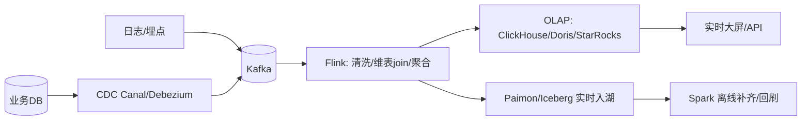
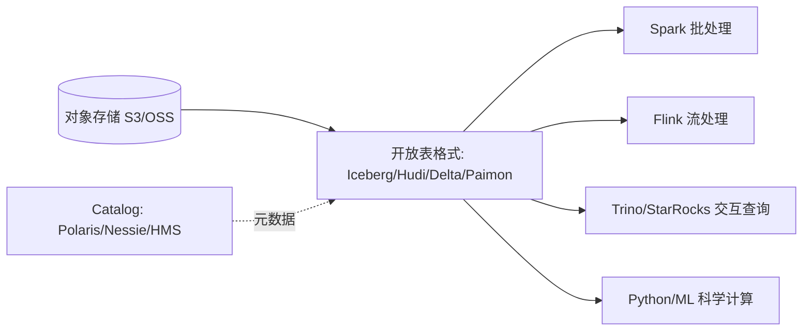

# 大数据 · 11 实时数仓与湖仓一体

> 业务要的不是"昨天的数据"，而是"现在的数据"。实时数仓让指标秒级更新；湖仓一体则把"湖的廉价灵活"与"仓的可靠分析"合二为一，是 2025 大数据架构的终点形态。

本篇串起前几篇：实时链路（CDC+Flink）、湖仓一体（Iceberg/Paimon+对象存储）、流批一体落地。

## 一、离线 vs 实时数仓

| 维度 | 离线数仓 | 实时数仓 |
|------|---------|---------|
| 时效 | T+1（小时/天） | 秒/分钟 |
| 链路 | Sqoop/DataX → Hive Spark → OLAP | CDC → Kafka → Flink → OLAP/湖 |
| 引擎 | Spark/Hive | Flink + ClickHouse/Doris/StarRocks/Paimon |
| 场景 | 经营报表、宽表建模 | 实时大屏、风控、监控、推荐 |
| 一致性 | 强（批全量） | 需处理乱序/重复（见[08](08-流处理计算：Flink.md)） |

## 二、实时数仓架构

- **维表 join**：流式事实 join 维度（如用户维度）→ 用**广播态**或查询 HBase/Redis 维表。
- **精确一次**：Flink Checkpoint + Sink 幂等/事务（见 [08](08-流处理计算：Flink.md)）。
- **大状态**：明细聚合用 RocksDB 状态后端。

## 三、湖仓一体（Lakehouse）：终点形态

### 3.1 为什么需要
- 旧模式："数据湖（原始）" + "数据仓库（分析）"两套，数据拷贝、口径不一致、成本高。
- 湖仓一体：**在廉价对象存储上用开放表格式获得仓的能力**，一份存储服务湖与仓。

### 3.2 核心组成

- **开放表格式**提供 ACID/时间旅行/schema 演进（见 [05](05-列式存储与数据湖格式.md)）。
- **Catalog** 统一管理表元数据（开源 Polaris、Nessie；云 S3 Tables、Glue）。
- 多引擎共用一份数据，消除"湖仓双写"。

### 3.3 Paimon + Flink：流式湖仓标杆
- Flink CDC → Paimon 表（LSM upsert）→ 同时支持**流读（changelog）**与**批读（快照）**。
- 一条链路同时服务实时大屏（流）与离线分析（批），天然流批一体。

## 四、流批一体（Unified）

- **目标**：同一份逻辑/代码处理有界（批）与无界（流），消除 Lambda 双链路（见 [02](02-技术体系与架构演进.md)）。
- **实现**：Flink 统一 API（批=有界流）；Spark Structured Streaming 同 API；存储用 Paimon/Iceberg 同时承接。
- **收益**：开发效率 ↑、口径一致 ↑、运维成本 ↓。

## 五、实时数仓分层（与离线对齐）

| 层 | 实时实现 |
|----|---------|
| ODS | Kafka 原始变更流 |
| DWD | Flink 清洗/标准化/维表 join |
| DWS | Flink 窗口聚合（宽表/主题指标） |
| ADS | 写 OLAP（ClickHouse/Doris/StarRocks）或 Paimon 供查询 |
| DIM | 维度放 HBase/Redis，Flink 实时 lookup |

## 六、典型实时场景链路

1. **实时大屏/GMV**：MySQL binlog → Canal → Kafka → Flink 聚合 → StarRocks/Doris → 大屏。
2. **实时风控**：日志/交易 → Kafka → Flink CEP/规则 → 命中即拦截 + 告警。
3. **用户实时画像**：CDC → Flink → HBase（宽表更新）+ 标签计算 → 推荐系统查询。
4. **日志监控**：Filebeat → Kafka → Flink → ClickHouse/Druid → Grafana。

## 七、设计 Checklist

- [ ] 实时与离线用同一套分层与口径（OneData），避免"两数"。
- [ ] 实时链路进 Kafka 削峰，Flink 保证 Exactly-Once。
- [ ] 新架构优先湖仓一体（对象存储 + Iceberg/Paimon）+ 流批一体。
- [ ] Catalog 统一管理，多引擎共用一份数据。
- [ ] 维表用 HBase/Redis 提速，大维表广播。
- [ ] 监控：端到端延迟、CDC lag、checkpoint、OLAP 写入 QPS。

> 参考：Databricks Lakehouse 论文、Apache Iceberg/Paimon 官方、Flink CDC 文档、各厂实时数仓架构复盘（2025）。
