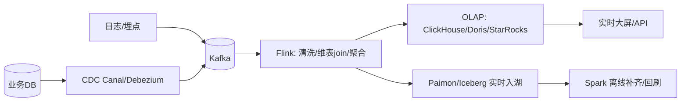
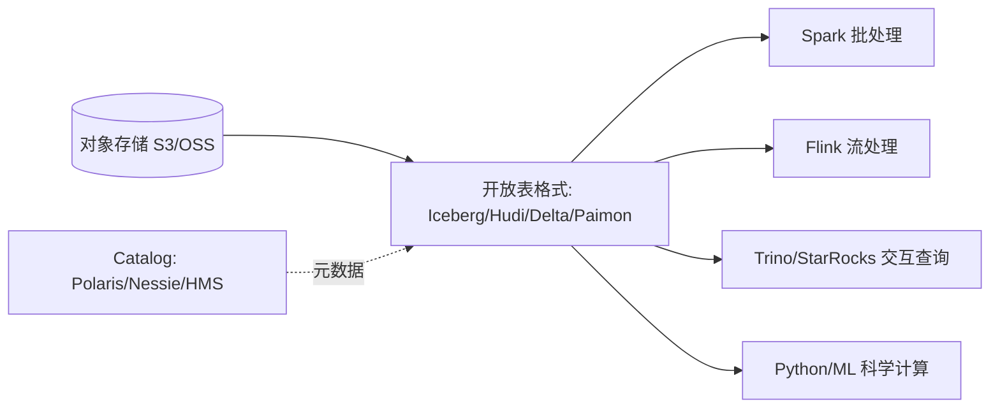
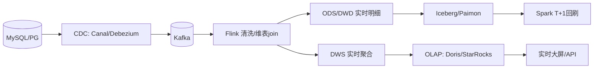
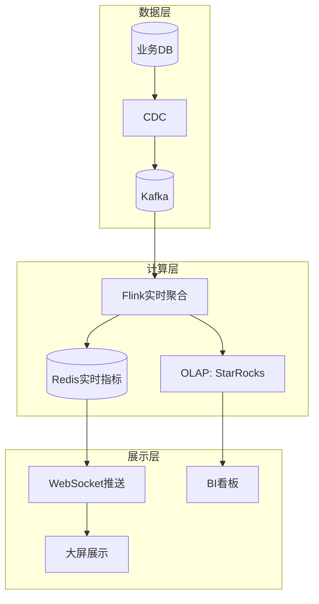
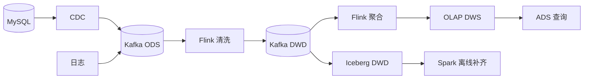

# 大数据 · 11 实时数仓与湖仓一体（实时链路 / Lakehouse 架构 / Iceberg-Paimon / 流批一体 / 落地决策）

> 业务要的不是"昨天的数据"，而是"现在的数据"。实时数仓让指标秒级更新；湖仓一体则把"湖的廉价灵活"与"仓的可靠分析"合二为一，是 2025 大数据架构的终点形态。本篇深入拆解实时链路（CDC+Flink）、湖仓一体（Iceberg/Paimon+对象存储）、流批一体落地与架构决策。

---

## 一、要解决的问题

| 痛点 | 说明 |
|------|------|
| 时效滞后 | 离线 T+1 跟不上业务 |
| 数据割裂 | 湖/仓两套存储，口径不一致 |
| 链路重复 | Lambda 双链路开发/运维成本高 |
| 实时与离线不一致 | 同指标实时/离线两套数 |
| 成本高 | 数据拷贝多份、计算重复 |

> 核心认知：**实时数仓 = 秒级指标（CDC→Kafka→Flink→OLAP/湖）**；**湖仓一体 = 对象存储 + 开放表格式获得仓能力，一份数据服务湖与仓**；**流批一体 = 同一 API/存储同时承流承批**。

---

## 二、离线 vs 实时数仓

| 维度 | 离线数仓 | 实时数仓 |
|------|---------|---------|
| 时效 | T+1（小时/天） | 秒/分钟 |
| 链路 | Sqoop/DataX → Hive Spark → OLAP | CDC → Kafka → Flink → OLAP/湖 |
| 引擎 | Spark/Hive | Flink + ClickHouse/Doris/StarRocks/Paimon |
| 场景 | 经营报表、宽表建模 | 实时大屏、风控、监控、推荐 |
| 一致性 | 强（批全量） | 需处理乱序/重复（见 [08](08-流处理计算：Flink.md)） |

---

## 三、实时数仓架构

### 3.1 链路全景



### 3.2 关键机制

```
Kafka 削峰：生产突发 → 消息缓冲 → 消费平滑
维表 join：流式事实 join 维度（用户维度）→ 广播态/查询 HBase/Redis
精确一次：Flink Checkpoint + Sink 幂等/事务
大状态：明细聚合用 RocksDB 状态后端

实时分层（与离线对齐）：
  ODS：Kafka 原始变更流
  DWD：Flink 清洗/标准化/维表 join
  DWS：Flink 窗口聚合（宽表/主题指标）
  ADS：写 OLAP 或 Paimon 供查询
  DIM：维度放 HBase/Redis，Flink 实时 lookup
```

---

## 四、湖仓一体（Lakehouse）：终点形态

### 4.1 为什么需要

```
旧模式："数据湖（原始）" + "数据仓库（分析）"两套
  数据拷贝、口径不一致、成本高、管理难

湖仓一体：
  在廉价对象存储上用开放表格式获得仓的能力
  一份存储服务湖与仓 → 消除"湖仓双写"
```

### 4.2 核心组成



```
开放表格式提供：ACID/时间旅行/schema 演进（见 [05](05-列式存储与数据湖格式.md)）
Catalog 统一管理表元数据（开源 Polaris、Nessie；云 S3 Tables、Glue）
多引擎共用一份数据
```

### 4.3 关键能力

```
ACID 提交：并发写安全（快照隔离）
时间旅行：任意历史快照查询（回滚/审计）
schema 演进：加列/删列不重写数据
隐藏分区：按分区值自动管理（无需手动分区字段）

一份数据被批（Spark）、流（Flink）、交互（Trino）、ML（Python）共读
```

---

## 五、Paimon vs Iceberg（流式 vs 通用）

| 维度 | Iceberg | Apache Paimon |
|------|---------|---------------|
| 定位 | 通用开放表格式 | 流式湖仓（流写优先） |
| 写入 | 批写为主，CDC 流写增强中 | **Flink 流写原生**（LSM upsert） |
| 读取 | 快照读（批）+ 增量读 | **流读（changelog）+ 批读（快照）** |
| 更新 | upsert 需优化（delete files） | **原生主键 upsert** |
| 存储 | 对象存储 + manifest | 对象存储 + LSM（同表承流承批） |
| 生态 | 最广（Spark/Flink/Trino 全支持） | Flink 最强，Spark 支持增强 |
| 适用 | 通用湖仓、多引擎 | Flink 实时链路 + 湖仓 |

```
选型：
  通用互操作 + 多云 → Iceberg
  Flink 实时 upsert + 流读 → Paimon
  常见组合：Iceberg 底座 + Paimon 实时明细
```

### 5.1 Paimon 存储原理

```
LSM 架构（类似 HBase/RocksDB）：
  内存 buffer → 有序文件（sstable）→ 合并 compaction
  主键表：按主键 upsert（新旧合并）

流读：changelog 文件记录变更 → Flink 流式消费
批读：快照文件 → Spark/Trino 全量查询
同一张表：流读实时、批读离线，口径天然一致
```

---

## 六、流批一体（Unified）

### 6.1 为什么需要

```
Lambda 架构问题：
  批链路 + 流链路双开发
  两套代码两套口径 → 对不上

流批一体目标：
  同一份逻辑/代码处理有界（批）与无界（流）
  存储同时承接（Paimon/Iceberg）
```

### 6.2 实现方式

```
Flink：统一 API（批=有界流，同算子/SQL）
Spark Structured Streaming：同 DataFrame API
存储：Paimon/Iceberg 同时承流承批

收益：开发效率 ↑、口径一致 ↑、运维成本 ↓
```

### 6.3 Flink + Iceberg 实战

```sql
-- Flink 流写 Iceberg（upsert by 主键）
INSERT INTO iceberg.shop.orders
SELECT order_id, user_id, amount, ts FROM mysql_orders_cdc;

-- 同一张表 Spark 批读做 T+1 回刷/补齐
INSERT OVERWRITE iceberg.shop.orders
SELECT /* 全量校准 */ ... FROM staging;
```

```
同一张 Iceberg 表：Flink 流写保证实时性，Spark 批读保证全量校准
```

---

## 七、维度表实时更新（CDC + 湖表）

```
痛点：维度（用户/商品）变化需实时反映到事实查询
方案：
  MySQL 维度表 → Flink CDC → Iceberg/Paimon 维表
  事实流用 FOR SYSTEM_TIME AS OF 时态 join 实时打宽
  维度表作为 Iceberg 快照被 Spark 批读 → 离线口径一致
```

---

## 八、典型实时场景链路

| 场景 | 链路 |
|------|------|
| 实时大屏/GMV | MySQL binlog → Canal → Kafka → Flink 聚合 → StarRocks/Doris → 大屏 |
| 实时风控 | 日志/交易 → Kafka → Flink CEP/规则 → 命中即拦截 + 告警 |
| 用户实时画像 | CDC → Flink → HBase（宽表更新）+ 标签计算 → 推荐系统查询 |
| 日志监控 | Filebeat → Kafka → Flink → ClickHouse/Druid → Grafana |

---

## 九、湖仓一体查询实战（Trino/Iceberg）

```sql
-- Trino 直接查 Iceberg 表（无需导入）
SELECT city, SUM(pay_amount) AS gmv
FROM iceberg.shop.orders
WHERE ts >= TIMESTAMP '2026-07-29 00:00:00'
  AND ts <  TIMESTAMP '2026-07-30 00:00:00'
GROUP BY city;

-- 隐藏分区 + 时间旅行
SELECT * FROM iceberg.shop.orders
FOR TIMESTAMP AS OF TIMESTAMP '2026-07-28 12:00:00';
```

```
Trino 通过 Iceberg 连接器读 manifest 做文件级裁剪（min/max）
只对相关 Parquet 下推谓词 → 扫描极少文件
```

---

## 十、落地架构决策

### 10.1 分阶段演进

```
阶段 1（起步）：离线数仓（Spark + Hive + OLAP）
阶段 2（实时化）：实时数仓（Kafka + Flink + OLAP）补充关键指标
阶段 3（湖仓一体）：对象存储 + Iceberg/Paimon + Catalog 统一
阶段 4（流批一体）：Flink/Paimon 同表承流承批，消 Lambda
```

### 10.2 选型要点

| 决策点 | 选择 |
|--------|------|
| 存储 | 对象存储（S3/OSS）+ 表格式 |
| 表格式 | Iceberg（通用）/ Paimon（流式） |
| 流引擎 | Flink（实时标准） |
| 批引擎 | Spark（批标准） |
| 交互查询 | Trino / StarRocks 外表直查 |
| Catalog | Polaris/Nessie（开源）/ 云 Glue/S3 Tables |
| OLAP 明细 | ClickHouse（日志）/ StarRocks（BI） |

---

## 十一、生产 Checklist

- [ ] 实时与离线用同一套分层与口径（OneData），避免"两数"。
- [ ] 实时链路进 Kafka 削峰，Flink 保证 Exactly-Once。
- [ ] 新架构优先湖仓一体（对象存储 + Iceberg/Paimon）+ 流批一体。
- [ ] Catalog 统一管理，多引擎共用一份数据。
- [ ] 维表用 HBase/Redis 提速，大维表广播。
- [ ] 存储用对象存储 + Iceberg/Paimon，统一 Catalog。
- [ ] 定时 compaction + 过期快照清理，防小文件。
- [ ] 时间旅行用于回滚/审计，权限经 Ranger/Polaris。
- [ ] 监控：端到端延迟、CDC lag、checkpoint、compaction 滞后、OLAP 写入 QPS。

---

## 实时OLAP引擎深度对比

### 主流引擎特性

| 维度 | ClickHouse | Apache Doris | StarRocks | Apache Druid |
|------|-----------|-------------|-----------|-------------|
| 架构 | MPP列式 | MPP列式 | MPP列式 | Segment+索引 |
| 写入 | 批写/批量导入 | Stream Load/CDC | Stream Load/CDC | 实时摄入 |
| 查询延迟 | 亚秒 | 亚秒 | 亚秒 | 亚秒 |
| 并发 | 中(100~500) | 高(1000+) | 高(1000+) | 高(1000+) |
| 标准SQL | 部分 | MySQL兼容 | MySQL兼容 | Druid SQL |
| 物化视图 | ✅ | ✅ | ✅ | ✅ |
| 存算分离 | 有限 | ✅ | ✅ | ✅ |
| 生态 | ClickHouse原生 | MySQL生态 | MySQL生态 | 自有生态 |

```
选型建议：
  日志分析/时序 → ClickHouse（列压缩极优）
  高并发BI → StarRocks/Doris（MPP+物化视图）
  实时大屏 → Druid（预聚合+倒排索引）
  湖仓一体 → StarRocks/Doris（外表直查Iceberg）
```

### 流批统一模式

```
统一模式实现：
  Flink批=有界流（同一API/SQL）
  Spark Structured Streaming（同DataFrame API）
  存储：Paimon/Iceberg同时承流承批

口径一致保障：
  同一SQL逻辑 → 引擎自动适配批/流
  存储层：同一张Iceberg表，Flink流写+Spark批读
  消除Lambda双链路：一套代码两种模式
```

### CDC实时数仓架构



```
CDC关键点：
  Canal：MySQL binlog解析，JSON格式输出
  Debezium：多源CDC（MySQL/PG/MongoDB）
  Flink CDC：直接消费binlog，Exactly-Once
  数据格式：debezium-json / canal-json

维表join策略：
  广播维表（小维表）：全量加载到TaskManager内存
  查询维表（大维表）：lookup HBase/Redis
  时态表join：FOR SYSTEM_TIME AS OF（Iceberg）
```

### 物化视图刷新策略

| 策略 | 说明 | 适用 | 延迟 |
|------|------|------|------|
| 全量刷新 | 每次全量重算 | 小数据量 | 高 |
| 增量刷新 | 只计算变化部分 | CDC场景 | 低 |
| 实时刷新 | 流式聚合写入 | 实时数仓 | 秒级 |
| 手动刷新 | 按需触发 | 报表场景 | 按需 |

```
实现方式：
  Doris/StarRocks：物化视图自动刷新（Sync/Async）
  ClickHouse：物化视图（触发器式写入）
  Iceberg：增量读+Spark写物化视图
  Paimon：流式聚合表（天然实时物化视图）
```

### 实时大屏架构



```
关键指标：
  端到端延迟：<5秒（CDC→大屏展示）
  查询QPS：大屏需支持100+并发
  数据一致性：实时/离线指标一致

技术选型：
  实时计算：Flink窗口聚合
  实时存储：Redis（热指标）+ StarRocks（明细查询）
  展示：WebSocket推送 + ECharts/Grafana
  刷新：实时推送 + 定时轮询混合
```

### 数据湖治理

```
湖仓治理核心：
  表格式治理：Iceberg快照管理、compaction、过期清理
  元数据治理：Catalog统一、Schema版本管理
  数据质量：湖表质量规则（非空、范围、一致性）
  安全治理：Ranger/Polaris权限、列级脱敏
  成本治理：生命周期管理、冷热分层

关键操作：
  Compaction：合并小文件（Iceberg rewrite manifests）
  快照清理：删除过期快照释放空间
  分区整理：删除过期分区
  统计信息更新：ANALYZE TABLE更新统计信息
```

### Schema-on-Read vs Schema-on-Write

| 模式 | 写入时 | 读取时 | 适用 |
|------|--------|--------|------|
| Schema-on-Write | 定义Schema，写入校验 | 直接读 | 数据仓库、强一致性 |
| Schema-on-Read | 原始写入，不校验 | 读时解析Schema | 数据湖、原始数据 |

```
湖仓融合：
  写入Schema-on-Write（Iceberg Schema校验）
  读取Schema-on-Read（灵活Schema演进）
  兼顾两者优势：写时质量+读时灵活

Iceberg实践：
  写入时绑定Schema ID
  读时可指定目标Schema（自动兼容）
  Schema Evolution：加列/改名不重写数据
```

### Lakehouse事务协议

```
ACID on Data Lake实现：
  快照隔离（Snapshot Isolation）：写不阻塞读
  原子提交（Atomic Commit）：多文件写入原子生效
  一致性读：读快照，不读部分写入

Iceberg事务机制：
  每次写入生成新快照（manifest文件）
  快照链：当前快照 → 父快照
  并发写：乐观锁+写入冲突检测
  读写分离：读旧快照，写新快照

Hudi事务机制：
  Timeline：所有操作按时间线记录
  Atomic Write：写入新文件+原子切换元数据
  读已提交（Read Committed）：只读已提交数据

Delta Lake事务：
  基于日志的MVCC（多版本并发控制）
  写入日志 → 提交 → 新版本
  读取时检查point-in-time快照
```

---

## 十二、实时 OLAP 引擎深度对比

### ClickHouse vs Doris vs StarRocks vs Druid vs Pinot

| 维度 | ClickHouse | Apache Doris | StarRocks | Apache Druid | LinkedIn Pinot |
|------|-----------|-------------|-----------|-------------|----------------|
| 架构 | MPP列式 | MPP列式 | MPP列式 | Segment+索引 | Segment+索引 |
| 写入 | 批写/批量导入 | Stream Load/CDC | Stream Load/CDC | 实时摄入 | 实时摄入 |
| 查询延迟 | 亚秒 | 亚秒 | 亚秒 | 亚秒 | 亚秒 |
| 并发 | 中(100~500) | 高(1000+) | 高(1000+) | 高(1000+) | 高(1000+) |
| SQL标准 | 部分 | MySQL兼容 | MySQL兼容 | Druid SQL | Pinot SQL |
| 物化视图 | ✅ | ✅ | ✅ | ✅ | ✅ |
| 存算分离 | 有限 | ✅ | ✅ | ✅ | ✅ |
| 生态 | ClickHouse原生 | MySQL生态 | MySQL生态 | 自有生态 | 自有生态 |

### 选型决策树

```
选择OLAP引擎：
  日志分析/时序 → ClickHouse（列压缩极优）
  高并发BI → StarRocks/Doris（MPP+物化视图）
  实时大屏 → Druid（预聚合+倒排索引）
  湖仓一体 → StarRocks/Doris（外表直查Iceberg）
  事件分析 → Pinot（实时摄入+低延迟）
```

### 各引擎特点

```
ClickHouse优势：
  列压缩率极高（10:1+）
  向量化执行（SIMD）
  本地表+分布式表
  物化视图（触发器式）

Doris/StarRocks优势：
  MySQL协议兼容
  CBO优化器成熟
  存算分离（弹性）
  物化视图（自动刷新）

Druid优势：
  预聚合（倒排索引）
  实时摄入+查询
  高并发（1000+ QPS）
  时间序列优化

Pinot优势：
  实时摄入（秒级可查）
  低延迟（<100ms）
  高吞吐（100K+ QPS）
  与Kafka深度集成
```

## 流批统一模式详解

### 实现方式

| 方式 | 说明 | 引擎 |
|------|------|------|
| 批=有界流 | 同一API处理有界/无界数据 | Flink |
| 微批处理 | 流处理模拟批处理 | Spark Structured Streaming |
| 统一存储 | 同一存储承流承批 | Iceberg/Paimon |
| 统一SQL | 同一SQL处理批/流 | Flink SQL |

### 口径一致保障

```
口径一致方案：
  1. 同一SQL逻辑 → 引擎自动适配批/流
  2. 存储层：同一张Iceberg表，Flink流写+Spark批读
  3. 消除Lambda双链路：一套代码两种模式
  4. 元数据统一：Catalog管理表元数据
  5. 质量统一：同一套质量规则

验证方法：
  批处理结果 vs 流处理结果 → 对比验证
  离线指标 vs 实时指标 → 一致性检查
  跨系统对账 → 数据校验
```

## CDC 实时数仓架构

### 架构模式


### CDC 关键点

| 要点 | 说明 | 最佳实践 |
|------|------|----------|
| 数据格式 | debezium-json / canal-json | 统一格式 |
| 维表join | 广播/lookup/时态表 | 小维表广播，大维表lookup |
| Exactly-Once | Flink Checkpoint + Sink幂等 | 开启Checkpoint |
| 数据质量 | 实时质量规则 | 非空、范围、一致性检查 |
| Schema管理 | Schema Registry | 版本管理+兼容性检查 |

## 物化视图刷新策略

### 策略对比

| 策略 | 说明 | 适用 | 延迟 | 资源消耗 |
|------|------|------|------|----------|
| 全量刷新 | 每次全量重算 | 小数据量 | 高 | 高 |
| 增量刷新 | 只计算变化部分 | CDC场景 | 低 | 中 |
| 实时刷新 | 流式聚合写入 | 实时数仓 | 秒级 | 中 |
| 手动刷新 | 按需触发 | 报表场景 | 按需 | 低 |

### 实现方式

```sql
-- Doris/StarRocks 物化视图
CREATE MATERIALIZED VIEW mv_orders
AS
SELECT city, SUM(amount) as total_amount, COUNT(*) as order_count
FROM orders
GROUP BY city;

-- 刷新策略
REFRESH MATERIALIZED VIEW mv_orders;  -- 手动刷新
ALTER MATERIALIZED VIEW mv_orders SET ("refresh_times" = "ON_COMMIT");  -- 自动刷新

-- ClickHouse 物化视图（触发器式）
CREATE MATERIALIZED VIEW mv_orders
ENGINE = SummingMergeTree()
ORDER BY city
AS SELECT city, SUM(amount) as total_amount, COUNT(*) as order_count
FROM orders
GROUP BY city;
```

## 实时大屏架构

### 架构设计


### 关键指标

| 指标 | 目标值 | 说明 |
|------|--------|------|
| 端到端延迟 | <5秒 | CDC→大屏展示 |
| 查询QPS | 100+ | 大屏并发 |
| 数据一致性 | 100% | 实时/离线一致 |
| 可用性 | 99.9% | 高可用 |

### 技术选型

```
实时计算：Flink窗口聚合
实时存储：Redis（热指标）+ StarRocks（明细查询）
展示：WebSocket推送 + ECharts/Grafana
刷新：实时推送 + 定时轮询混合
监控：延迟、QPS、错误率
```

## Lakehouse 事务协议

### ACID 实现

```
ACID on Data Lake实现：
  快照隔离（Snapshot Isolation）：写不阻塞读
  原子提交（Atomic Commit）：多文件写入原子生效
  一致性读：读快照，不读部分写入
```

### 各格式事务机制

| 格式 | 事务机制 | 并发控制 | 读写分离 |
|------|----------|----------|----------|
| Iceberg | 快照链 | 乐观锁+冲突检测 | 读旧快照，写新快照 |
| Hudi | Timeline | 原子写入+元数据切换 | Read Committed |
| Delta | MVCC日志 | 多版本并发控制 | Point-in-time |
| Paimon | LSM | 快照隔离 | 读写分离 |

### 事务性能对比

```
事务性能指标：
  写入吞吐：Iceberg > Paimon > Delta > Hudi
  读取延迟：Paimon < Iceberg < Delta < Hudi
  并发能力：Iceberg > Delta > Hudi > Paimon
  存储开销：Paimon > Iceberg > Delta > Hudi

选型建议：
  通用湖仓 → Iceberg（平衡性能和功能）
  流式写入 → Paimon（Flink原生）
  Spark生态 → Delta（Databricks优化）
  传统Hive → Hudi（Uber发起）
```

## 实时数仓分层架构（ODS→DWD→DWS→ADS 实时层）

```
实时数仓分层（与离线对齐）：

  ODS（实时贴源层）：
    数据源：MySQL binlog（CDC）+ 埋点日志
    存储：Kafka Topic（原始事件流）
    特点：原样保留，不做转换

  DWD（实时明细层）：
    处理：Flink 清洗/标准化/维表 JOIN
    存储：Kafka Topic 或 Iceberg/Paimon 明细表
    特点：口径统一、维度打宽

  DWS（实时汇总层）：
    处理：Flink 窗口聚合（1min/5min/1h）
    存储：Doris/StarRocks 或 Paimon 聚合表
    特点：主题宽表、预聚合

  ADS（实时应用层）：
    处理：DWS 直接查询或简单二次计算
    存储：Redis（热指标）+ OLAP（明细查询）
    特点：面向应用、低延迟

分层价值：
  解耦：层间独立，变更不影响上层
  复用：DWD/DWS 被多个 ADS 共享
  口径一致：与离线分层对齐
```



## 流批一体在 Flink 中的实现模式

```
Flink 流批一体实现：

  核心思想：批 = 有界流（同一 API/SQL）
  
  有界流（批模式）：
    Source: 读取文件/表（有界）
    Processing: 与流处理相同算子
    Sink: 写入文件/表
  
  无界流（流模式）：
    Source: Kafka/Socket（无界）
    Processing: 窗口/水印/状态
    Sink: 写入 OLAP/Kafka/文件

  同一 SQL 两种模式：
    SELECT city, SUM(amount) FROM orders
    WHERE ts >= '2026-01-01' AND ts < '2026-02-01'
    GROUP BY city;
    
    流模式：实时增量聚合（窗口）
    批模式：全量聚合（一次计算）
```

## 实时指标计算 vs 离线校准的一致性保障

```
一致性挑战：
  实时：秒级近似（可能丢事件/乱序）
  离线：T+1 准确（全量对账）

保障方案：
  1. 同一口径定义
     实时/离线用同一指标定义（OneData）
     DWS 层只算一次，ADS 只读不重算

  2. 最终一致
     实时结果 + 离线校准 = 最终准确
     实时允许近似（<0.1% 误差）
     离线全量对账后修正

  3. 对账机制
     实时指标 vs 离线指标 diff 检测
     差异超阈值 → 告警 + 人工修复

  4. 存储层保障
     Iceberg/Paimon 同一张表
     Flink 流写 + Spark 批读
     数据源唯一 → 口径天然一致
```

## 数据湖对 OLAP 引擎的透明化访问（Trino on Iceberg）

```
Trino 直接查 Iceberg 表（无需导入）：

  架构：
    Iceberg 表（S3/OSS）→ Trino 连接器 → SQL 查询
    无需数据拷贝，直接读 manifest 文件

  性能优化：
    文件级裁剪：manifest 中 min/max 索引
    谓词下推：WHERE 条件下推到 Parquet 层
    列裁剪：只读所需列
    分区裁剪：按分区值过滤

  配置：
    CREATE CATALOG iceberg_catalog
    USING iceberg
    WITH (s3.endpoint='http://minio:9000',
          s3.access_key='xxx',
          iceberg.file-format='PARQUET')

  查询：
    SELECT * FROM iceberg_catalog.db.orders
    WHERE ts >= TIMESTAMP '2026-07-01'
    AND city = '北京';
```

## 实时数仓成本优化（计算/存储/运维）

```
成本优化三维度：

  计算成本：
    Flink 按并行度计费 → 按实际吞吐动态扩缩
    避免全量重算 → 增量处理
    状态后端优化 → RocksDB 替代内存（减少 JVM 堆）

  存储成本：
    热数据：Doris/StarRocks（高性能 SSD）
    温数据：Iceberg/Paimon（对象存储）
    冷数据：Iceberg 低频存储 + TTL 清理

  运维成本：
    流批一体 → 一套代码两种模式
    存算分离 → 弹性扩缩
    监控自动化 → Prometheus + Grafana

量化示例：
  纯实时：Flink 集群常驻 + Doris 热存储 = 高成本
  实时+离线：Flink 增量 + Iceberg 冷存 = 成本降 50%+
```

> 一句话：**实时数仓 = CDC→Kafka→Flink→OLAP/湖 秒级链路；湖仓一体 = 对象存储 + Iceberg/Paimon（ACID/时间旅行）一份数据多引擎共用；流批一体 = Flink/Paimon 同表承流承批——落地四步：离线→实时化→湖仓一体→流批一体，核心守则：口径一致 + Catalog 统一 + compaction/快照清理**。