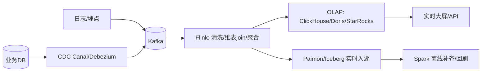
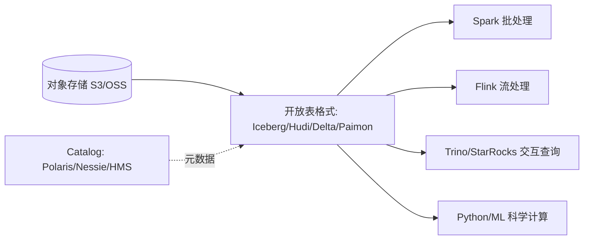

# 大数据 · 11 实时数仓与湖仓一体（实时链路 / Lakehouse 架构 / Iceberg-Paimon / 流批一体 / 落地决策）

> 业务要的不是"昨天的数据"，而是"现在的数据"。实时数仓让指标秒级更新；湖仓一体则把"湖的廉价灵活"与"仓的可靠分析"合二为一，是 2025 大数据架构的终点形态。本篇深入拆解实时链路（CDC+Flink）、湖仓一体（Iceberg/Paimon+对象存储）、流批一体落地与架构决策。

---

## 一、要解决的问题

| 痛点 | 说明 |
|------|------|
| 时效滞后 | 离线 T+1 跟不上业务 |
| 数据割裂 | 湖/仓两套存储，口径不一致 |
| 链路重复 | Lambda 双链路开发/运维成本高 |
| 实时与离线不一致 | 同指标实时/离线两套数 |
| 成本高 | 数据拷贝多份、计算重复 |

> 核心认知：**实时数仓 = 秒级指标（CDC→Kafka→Flink→OLAP/湖）**；**湖仓一体 = 对象存储 + 开放表格式获得仓能力，一份数据服务湖与仓**；**流批一体 = 同一 API/存储同时承流承批**。

---

## 二、离线 vs 实时数仓

| 维度 | 离线数仓 | 实时数仓 |
|------|---------|---------|
| 时效 | T+1（小时/天） | 秒/分钟 |
| 链路 | Sqoop/DataX → Hive Spark → OLAP | CDC → Kafka → Flink → OLAP/湖 |
| 引擎 | Spark/Hive | Flink + ClickHouse/Doris/StarRocks/Paimon |
| 场景 | 经营报表、宽表建模 | 实时大屏、风控、监控、推荐 |
| 一致性 | 强（批全量） | 需处理乱序/重复（见 [08](08-流处理计算：Flink.md)） |

---

## 三、实时数仓架构

### 3.1 链路全景



### 3.2 关键机制

```
Kafka 削峰：生产突发 → 消息缓冲 → 消费平滑
维表 join：流式事实 join 维度（用户维度）→ 广播态/查询 HBase/Redis
精确一次：Flink Checkpoint + Sink 幂等/事务
大状态：明细聚合用 RocksDB 状态后端

实时分层（与离线对齐）：
  ODS：Kafka 原始变更流
  DWD：Flink 清洗/标准化/维表 join
  DWS：Flink 窗口聚合（宽表/主题指标）
  ADS：写 OLAP 或 Paimon 供查询
  DIM：维度放 HBase/Redis，Flink 实时 lookup
```

---

## 四、湖仓一体（Lakehouse）：终点形态

### 4.1 为什么需要

```
旧模式："数据湖（原始）" + "数据仓库（分析）"两套
  数据拷贝、口径不一致、成本高、管理难

湖仓一体：
  在廉价对象存储上用开放表格式获得仓的能力
  一份存储服务湖与仓 → 消除"湖仓双写"
```

### 4.2 核心组成



```
开放表格式提供：ACID/时间旅行/schema 演进（见 [05](05-列式存储与数据湖格式.md)）
Catalog 统一管理表元数据（开源 Polaris、Nessie；云 S3 Tables、Glue）
多引擎共用一份数据
```

### 4.3 关键能力

```
ACID 提交：并发写安全（快照隔离）
时间旅行：任意历史快照查询（回滚/审计）
schema 演进：加列/删列不重写数据
隐藏分区：按分区值自动管理（无需手动分区字段）

一份数据被批（Spark）、流（Flink）、交互（Trino）、ML（Python）共读
```

---

## 五、Paimon vs Iceberg（流式 vs 通用）

| 维度 | Iceberg | Apache Paimon |
|------|---------|---------------|
| 定位 | 通用开放表格式 | 流式湖仓（流写优先） |
| 写入 | 批写为主，CDC 流写增强中 | **Flink 流写原生**（LSM upsert） |
| 读取 | 快照读（批）+ 增量读 | **流读（changelog）+ 批读（快照）** |
| 更新 | upsert 需优化（delete files） | **原生主键 upsert** |
| 存储 | 对象存储 + manifest | 对象存储 + LSM（同表承流承批） |
| 生态 | 最广（Spark/Flink/Trino 全支持） | Flink 最强，Spark 支持增强 |
| 适用 | 通用湖仓、多引擎 | Flink 实时链路 + 湖仓 |

```
选型：
  通用互操作 + 多云 → Iceberg
  Flink 实时 upsert + 流读 → Paimon
  常见组合：Iceberg 底座 + Paimon 实时明细
```

### 5.1 Paimon 存储原理

```
LSM 架构（类似 HBase/RocksDB）：
  内存 buffer → 有序文件（sstable）→ 合并 compaction
  主键表：按主键 upsert（新旧合并）

流读：changelog 文件记录变更 → Flink 流式消费
批读：快照文件 → Spark/Trino 全量查询
同一张表：流读实时、批读离线，口径天然一致
```

---

## 六、流批一体（Unified）

### 6.1 为什么需要

```
Lambda 架构问题：
  批链路 + 流链路双开发
  两套代码两套口径 → 对不上

流批一体目标：
  同一份逻辑/代码处理有界（批）与无界（流）
  存储同时承接（Paimon/Iceberg）
```

### 6.2 实现方式

```
Flink：统一 API（批=有界流，同算子/SQL）
Spark Structured Streaming：同 DataFrame API
存储：Paimon/Iceberg 同时承流承批

收益：开发效率 ↑、口径一致 ↑、运维成本 ↓
```

### 6.3 Flink + Iceberg 实战

```sql
-- Flink 流写 Iceberg（upsert by 主键）
INSERT INTO iceberg.shop.orders
SELECT order_id, user_id, amount, ts FROM mysql_orders_cdc;

-- 同一张表 Spark 批读做 T+1 回刷/补齐
INSERT OVERWRITE iceberg.shop.orders
SELECT /* 全量校准 */ ... FROM staging;
```

```
同一张 Iceberg 表：Flink 流写保证实时性，Spark 批读保证全量校准
```

---

## 七、维度表实时更新（CDC + 湖表）

```
痛点：维度（用户/商品）变化需实时反映到事实查询
方案：
  MySQL 维度表 → Flink CDC → Iceberg/Paimon 维表
  事实流用 FOR SYSTEM_TIME AS OF 时态 join 实时打宽
  维度表作为 Iceberg 快照被 Spark 批读 → 离线口径一致
```

---

## 八、典型实时场景链路

| 场景 | 链路 |
|------|------|
| 实时大屏/GMV | MySQL binlog → Canal → Kafka → Flink 聚合 → StarRocks/Doris → 大屏 |
| 实时风控 | 日志/交易 → Kafka → Flink CEP/规则 → 命中即拦截 + 告警 |
| 用户实时画像 | CDC → Flink → HBase（宽表更新）+ 标签计算 → 推荐系统查询 |
| 日志监控 | Filebeat → Kafka → Flink → ClickHouse/Druid → Grafana |

---

## 九、湖仓一体查询实战（Trino/Iceberg）

```sql
-- Trino 直接查 Iceberg 表（无需导入）
SELECT city, SUM(pay_amount) AS gmv
FROM iceberg.shop.orders
WHERE ts >= TIMESTAMP '2026-07-29 00:00:00'
  AND ts <  TIMESTAMP '2026-07-30 00:00:00'
GROUP BY city;

-- 隐藏分区 + 时间旅行
SELECT * FROM iceberg.shop.orders
FOR TIMESTAMP AS OF TIMESTAMP '2026-07-28 12:00:00';
```

```
Trino 通过 Iceberg 连接器读 manifest 做文件级裁剪（min/max）
只对相关 Parquet 下推谓词 → 扫描极少文件
```

---

## 十、落地架构决策

### 10.1 分阶段演进

```
阶段 1（起步）：离线数仓（Spark + Hive + OLAP）
阶段 2（实时化）：实时数仓（Kafka + Flink + OLAP）补充关键指标
阶段 3（湖仓一体）：对象存储 + Iceberg/Paimon + Catalog 统一
阶段 4（流批一体）：Flink/Paimon 同表承流承批，消 Lambda
```

### 10.2 选型要点

| 决策点 | 选择 |
|--------|------|
| 存储 | 对象存储（S3/OSS）+ 表格式 |
| 表格式 | Iceberg（通用）/ Paimon（流式） |
| 流引擎 | Flink（实时标准） |
| 批引擎 | Spark（批标准） |
| 交互查询 | Trino / StarRocks 外表直查 |
| Catalog | Polaris/Nessie（开源）/ 云 Glue/S3 Tables |
| OLAP 明细 | ClickHouse（日志）/ StarRocks（BI） |

---

## 十一、生产 Checklist

- [ ] 实时与离线用同一套分层与口径（OneData），避免"两数"。
- [ ] 实时链路进 Kafka 削峰，Flink 保证 Exactly-Once。
- [ ] 新架构优先湖仓一体（对象存储 + Iceberg/Paimon）+ 流批一体。
- [ ] Catalog 统一管理，多引擎共用一份数据。
- [ ] 维表用 HBase/Redis 提速，大维表广播。
- [ ] 存储用对象存储 + Iceberg/Paimon，统一 Catalog。
- [ ] 定时 compaction + 过期快照清理，防小文件。
- [ ] 时间旅行用于回滚/审计，权限经 Ranger/Polaris。
- [ ] 监控：端到端延迟、CDC lag、checkpoint、compaction 滞后、OLAP 写入 QPS。

---

## 十二、与其他板块的关系

- 实时计算基础见「[08-流处理计算：Flink](08-流处理计算：Flink.md)」；
- 表格式见「[05-列式存储与数据湖格式](05-列式存储与数据湖格式.md)」；
- CDC 采集见「[03-数据采集与同步](03-数据采集与同步.md)」；
- OLAP 引擎见「[09-数据仓库与OLAP引擎](09-数据仓库与OLAP引擎.md)」；
- 数据治理见「[12-数据治理与数据质量](12-数据治理与数据质量.md)」。

> 一句话：**实时数仓 = CDC→Kafka→Flink→OLAP/湖 秒级链路；湖仓一体 = 对象存储 + Iceberg/Paimon（ACID/时间旅行）一份数据多引擎共用；流批一体 = Flink/Paimon 同表承流承批——落地四步：离线→实时化→湖仓一体→流批一体，核心守则：口径一致 + Catalog 统一 + compaction/快照清理**。