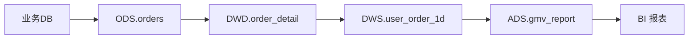
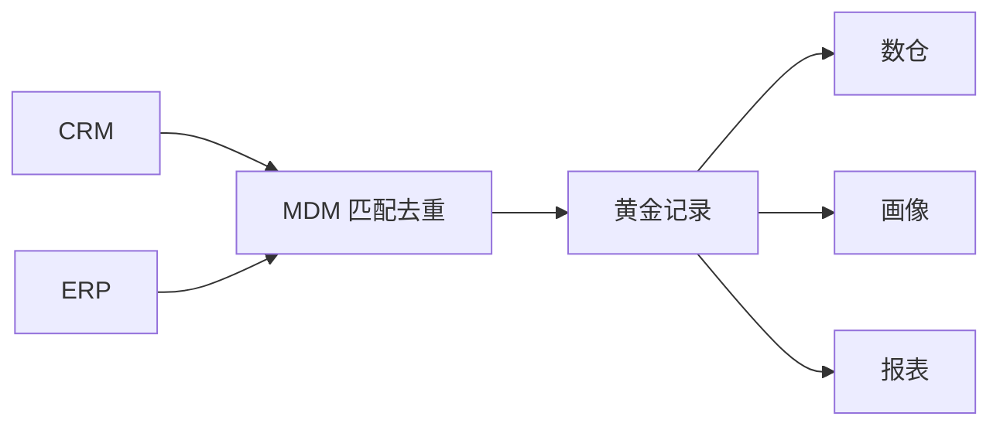

# 大数据 · 12 数据治理与数据质量（治理框架 / 元数据血缘 / 质量六维 / 主数据 / 安全合规 / 落地路径）

> "低质量的数据比没有数据更危险。" 治理是把数据从"一堆文件"变成"可信资产"的工程：元数据让你找得到，质量让你信得过，安全让你用得放心，标准让口径统一。本篇深入拆解治理框架（DAMA/OneData）、元数据与血缘、质量六维校验、主数据、安全与指标体系的落地路径。

---

## 一、要解决的问题

| 痛点 | 说明 |
|------|------|
| 找不到数据 | 数据资产多，不知道有什么/在哪 |
| 数据不可信 | 质量差，没人敢用 |
| 口径不一致 | 同指标各部门算法不同 |
| 数据不安全 | 权限/脱敏/审计缺失 |
| 无主可循 | 数据没人负责，坏了没人管 |

> 核心认知：**治理不是"建平台"而是"建机制"**——标准、owner、流程、考核闭环；从"人工规则"走向"AI × Metadata 自治"。

---

## 二、治理框架

| 框架 | 要点 | 适用 |
|------|------|------|
| DAMA-DMBOK | 11 个知识领域（元数据、质量、安全、主数据…） | 通用理论体系 |
| OneData（阿里） | 统一建模 + 指标字典 + 数据域划分 | 企业落地方法论 |
| DCMM | 国标数据管理能力成熟度模型 | 国内合规评估 |

```
治理闭环：
  盘点（有什么）→ 标准（怎么定义）→ 质量（可信吗）
  → 安全（能用吗）→ 考核（KPI）→ 优化（持续改进）
```

---

## 三、元数据管理（Metadata）

### 3.1 三类元数据

| 类型 | 内容 | 存放 |
|------|------|------|
| 技术元数据 | 表结构、字段、分区、血缘 | HMS |
| 业务元数据 | 业务含义、归属、口径 | 数据目录 |
| 管理元数据 | owner、敏感级、SLA | 治理平台 |

### 3.2 数据血缘（Lineage）



```
价值：
  影响分析（改字段影响谁）
  问题溯源（数据错了追到源）
  合规审计（数据来源可查）

实现：
  SQL 解析（自动） / 手动标注
  工具：Atlas、DataHub、OpenMetadata
  采集：Hive/Spark/Kafka 作业经 Hook 自动上报
```

### 3.3 数据资产目录

```
可检索的资产地图，含技术/业务/管理元数据
支持：标签、评分、订阅、申请权限
形成"找数→认数→用数"闭环

工具对比：
  Apache Atlas：Hadoop 生态元数据 + 自动血缘，分类标签与权限继承
  DataHub：现代元数据平台，推送/拉取式采集，UI 强
  OpenMetadata：开源、协作式，含血缘/质量/术语表
```

---

## 四、数据质量（六维校验）

### 4.1 六维质量

| 维度 | 含义 | 校验示例 |
|------|------|---------|
| 完整性 | 无缺失 | 必填字段非空率 |
| 准确性 | 值正确 | 与源端对账 |
| 一致性 | 跨表一致 | 总分=明细求和 |
| 及时性 | 按时到达 | 数据延迟 < SLA |
| 唯一性 | 无重复 | 主键唯一 |
| 有效性 | 符合格式 | 枚举/正则 |

### 4.2 规则与监控实战

```sql
-- Griffin 度量（示例：订单金额非空 + 主键唯一）
SELECT
  COUNT(*) FILTER (WHERE amount IS NULL) AS null_amt,
  COUNT(*) - COUNT(DISTINCT order_id)     AS dup_id
FROM dwd_order_fact WHERE dt='${bizdate}';
-- 阈值：null_amt=0, dup_id=0，否则告警/阻断下游
```

| 质量规则类型 | 实现 |
|------------|------|
| 完整性 | 非空率、必填校验 |
| 准确性 | 与源端对账、范围检查 |
| 一致性 | 总分=明细求和、跨表核对 |
| 及时性 | 数据到达时间 < SLA |
| 唯一性 | 主键唯一约束 |
| 有效性 | 枚举/正则/格式 |

### 4.3 落地策略

```
规则部署位置：
  贴源层（ODS）：源头质量（源数据坏不进）
  共享层（DWS）：共享数据质量（下流依赖）

阻断策略：质量不过关可阻断下游作业（与 [10](10-资源调度：YARN与Kubernetes.md) 编排联动）
监控：质量看板（合格率趋势）+ 异常告警 + 阻断记录

案例：某电网 3800+ 规则，合格率 90% 纳入考核
```

### 4.4 质量工具

| 工具 | 定位 |
|------|------|
| Apache Griffin | 开源质量度量平台（eBay，LF 项目） |
| DataHub/OpenMetadata | 内嵌质量校验（规则+监控） |
| 商业平台 | Dataphin/WeData/DataArts 质量模块 |

---

## 五、主数据管理（MDM）

### 5.1 概念

```
主数据：企业核心业务实体（客户、产品、组织）的"唯一正确版本"
作用：避免"同一客户多套 ID"，统一跨系统口径
```

### 5.2 流程



```
流程：
  ① 识别主数据（客户/产品/组织）
  ② 抽取 + 匹配去重（规则/相似度算法）
  ③ 生成黄金记录（Golden Record）
  ④ 分发订阅给下游

价值：统一"一个客户一个 ID"，避免跨系统口径冲突
```

---

## 六、数据安全与合规

### 6.1 安全能力矩阵

| 能力 | 说明 | 工具 |
|------|------|------|
| 认证/授权 | 谁可以访问 | Kerberos、LDAP |
| 细粒度权限 | 库/表/列/行级 | Apache Ranger、Sentry |
| 数据脱敏 | 手机号/身份证掩码 | 动态脱敏策略 |
| 分级分类 | 公开/内部/机密 | 标签 + 自动识别 |
| 审计 | 谁何时查了什么 | 访问日志 |
| 合规 | 等保2.0、个人信息保护 | 加密 + 最小授权 |

### 6.2 贯穿全程的安全

```
采集脱敏（源头）→ 传输加密（TLS）→ 存储加密（KMS）
→ 访问最小授权（Ranger）→ 操作可审计（日志）

数据分级：
  L1 公开 / L2 内部 / L3 敏感 / L4 机密
  按级别定：是否脱敏、授权范围、留存周期
```

---

## 七、指标体系（OneData 核心）

```
一个指标一个口径：同名指标全局唯一定义，避免"各部门 GMV 不一样"

指标字典：
  原子指标（支付金额）
  派生指标（支付金额 + 时间维度 = 日 GMV）
  修饰词（渠道=APP）

维度标准化：时间/地域/渠道统一编码

落地：
  指标字典沉淀为可复用资产
  命名规范：指标_维度（如 gmv_daily）
  变更走评审
```

---

## 八、Data Agent（2025 治理新趋势）

```
Data Agent：自主感知/推理/执行的数据智能体
  自动盘点资产、匹配权限与脱敏、生成优化建议

"AI × Metadata"：
  资产热度、血缘深度、质量波动实时评估
  形成"治理—使用—反馈—优化"正循环

AI 应用场景：
  资产盘点：LLM 自动识别表/字段业务含义、打标签
  质量：异常检测模型预测数据漂移、自动建规则
  血缘：大模型解析 SQL/代码补全隐性血缘
  NL2SQL：自然语言转查询，降低用数门槛
  Data Agent：自主巡检、给优化建议、自动派单

趋势：治理从"人工规则"走向"智能自治"，降低治理人力
```

---

## 九、治理落地路径

### 9.1 分阶段实施

```
阶段 1（找数）：元数据采集 + 资产目录（Atlas/DataHub）
阶段 2（信任）：质量规则前置（贴源+共享层），六维校验
阶段 3（规范）：指标字典 + 命名标准 + 主数据
阶段 4（安全）：分级分类 + Ranger 权限 + 脱敏 + 审计
阶段 5（优化）：考核 + 血缘影响分析 + Data Agent 自治
```

### 9.2 组织保障

```
数据主人制：源头责任人认领，问题派单闭环
考核指标：合格率、资产覆盖率、血缘覆盖率、复用率
流程：发现问题 → 派单 → 修复 → 复盘 → 沉淀规则
```

---

## 十、治理度量指标

| 治理域 | 度量指标 |
|--------|---------|
| 元数据 | 资产覆盖率、血缘覆盖率 |
| 质量 | 规则数、合格率、阻断次数 |
| 安全 | 脱敏覆盖率、越权访问数 |
| 标准 | 命名合规率、口径一致率 |
| 价值 | 资产复用率、调用量 |

---

## 十一、治理落地 Checklist

- [ ] 先立标准（命名/口径/主数据），再谈分析。
- [ ] 元数据 + 血缘自动采集（Atlas/DataHub），建资产目录。
- [ ] 质量规则前置（贴源+共享层），不合格阻断下游。
- [ ] 安全分级 + 脱敏 + 细粒度权限 + 审计，合规内建。
- [ ] 指标体系 OneData 化，统一口径字典。
- [ ] 数据主人制：源头责任人认领，问题派单闭环。
- [ ] 引入 Data Agent 提效（资产盘点/优化建议）。

---

## 十二、与其他板块的关系

- 元数据支撑建模见「[09-数据仓库与OLAP引擎](09-数据仓库与OLAP引擎.md)」；
- 质量阻断联动调度见「[10-资源调度：YARN与Kubernetes](10-资源调度：YARN与Kubernetes.md)」；
- 数据安全见「[15-数据安全与隐私合规](15-数据安全与隐私合规.md)」；
- AI 治理趋势见「[13-新技术趋势与生态全景](13-新技术趋势与生态全景.md)」；
- 数据服务化见「[17-数据服务化与指标管理](17-数据服务化与指标管理.md)」。

> 一句话：**治理 = 元数据（找得到）+ 质量六维（信得过）+ 安全（用得放心）+ 指标（口径统一）+ 主数据（一个实体一个 ID）——落地五步：找数→质量→规范→安全→优化，机制核心：标准/owner/流程/考核闭环，趋势：AI × Metadata 自治**。