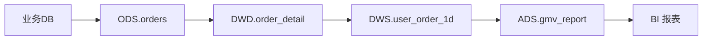
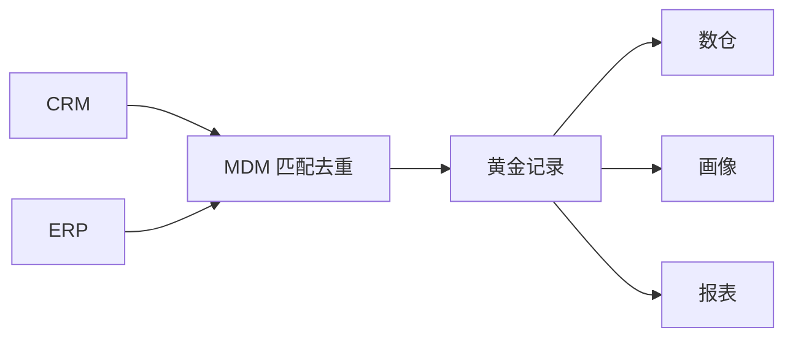

# 大数据 · 12 数据治理与数据质量

> "低质量的数据比没有数据更危险。" 治理是把数据从"一堆文件"变成"可信资产"的工程：元数据让你找得到，质量让你信得过，安全让你用得放心，标准让口径统一。

本篇讲治理框架（DAMA/OneData）、元数据与血缘（Atlas）、质量（Griffin）、主数据、安全与指标体系。

## 一、治理框架

| 框架 | 要点 | 适用 |
|------|------|------|
| DAMA-DMBOK | 11 个知识领域（元数据、质量、安全、主数据…） | 通用理论体系 |
| OneData（阿里） | 统一建模 + 指标字典 + 数据域划分 | 企业落地方法论 |
| DCMM | 国标数据管理能力成熟度模型 | 国内合规评估 |

> 治理不是"建平台"而是"建机制"：标准、owner、流程、考核闭环。

## 二、元数据管理（Metadata）

- **三类元数据**：
  - 技术元数据：表结构、字段、分区、血缘（HMS 存）。
  - 业务元数据：业务含义、归属、口径。
  - 管理元数据：owner、敏感级、SLA。
- **Apache Atlas**：Hadoop 生态元数据与**血缘**中枢，自动采集 Hive/Spark/Kafka 血缘，支持分类标签与权限继承。
- **数据目录（Data Catalog）**：可检索的资产地图（如 Dataphin 资产目录、Polaris/Nessie 湖仓 catalog）。

### 2.1 数据血缘（Lineage）

- 价值：影响分析（改字段影响谁）、问题溯源（数据错了追到源）、合规审计。
- 实现：SQL 解析（自动）/ 手动标注；Atlas、开源 DataHub、开源 OpenMetadata 均支持。

## 三、数据质量（Data Quality）

- **Apache Griffin**（eBay 开源，LF 项目）：定义质量度量（完整性/准确性/一致性/及时性/唯一性），定时校验并告警。
- **六维质量**：
  | 维度 | 含义 | 校验示例 |
  |------|------|---------|
  | 完整性 | 无缺失 | 必填字段非空率 |
  | 准确性 | 值正确 | 与源端对账 |
  | 一致性 | 跨表一致 | 总分=明细求和 |
  | 及时性 | 按时到达 | 数据延迟 < SLA |
  | 唯一性 | 无重复 | 主键唯一 |
  | 有效性 | 符合格式 | 枚举/正则 |

- 落地：贴源层 + 共享层部署数千条校验规则，合格率纳入考核（某电网 3800+ 规则，合格率 90%）。
- **阻断策略**：质量不过关可阻断下游作业（与 [10](10-资源调度：YARN与Kubernetes.md) 编排联动）。

## 四、主数据管理（MDM）

- **主数据**：企业核心业务实体（客户、产品、组织）的"唯一正确版本"。
- 作用：避免"同一客户多套 ID"。用主数据服务统一分发，下游引用。
- 实现：主数据平台 + 匹配去重（规则/算法）+ 分发订阅。

## 五、数据安全与合规

| 能力 | 说明 | 工具 |
|------|------|------|
| 认证/授权 | 谁可以访问 | Kerberos、LDAP |
| 细粒度权限 | 库/表/列/行级 | Apache Ranger、Sentry |
| 数据脱敏 | 手机号/身份证掩码 | 动态脱敏策略 |
| 分级分类 | 公开/内部/机密 | 标签 + 自动识别 |
| 审计 | 谁何时查了什么 | 访问日志 |
| 合规 | 等保2.0、个人信息保护 | 加密 + 最小授权 |

> ⚠️ 安全是"贯穿全程"的：采集脱敏、传输加密、存储加密、访问最小授权、操作可审计。

## 六、指标体系（OneData 核心）

- **一个指标一个口径**：同名指标全局唯一定义，避免"各部门 GMV 不一样"。
- **指标字典**：原子指标 + 派生指标 + 修饰词，沉淀为可复用资产。
- **维度标准化**：时间/地域/渠道等维度统一编码。

## 七、Data Agent（2025 治理新趋势）

- **Data Agent**：自主感知/推理/执行的数据智能体，自动盘点资产、匹配权限与脱敏、生成优化建议（如 Dataphin DataAgent）。
- "AI × Metadata"：资产热度、血缘深度、质量波动实时评估，形成"治理—使用—反馈—优化"正循环。
- 治理从"人工规则"走向"智能自治"，降低治理人力。

## 八、治理落地 Checklist

- [ ] 先立标准（命名/口径/主数据），再谈分析。
- [ ] 元数据 + 血缘自动采集（Atlas/DataHub），建资产目录。
- [ ] 质量规则前置（贴源+共享层），不合格阻断下游。
- [ ] 安全分级 + 脱敏 + 细粒度权限 + 审计，合规内建。
- [ ] 指标体系 OneData 化，统一口径字典。
- [ ] 数据主人制：源头责任人认领，问题派单闭环。
  - [ ] 引入 Data Agent 提效（资产盘点/优化建议）。

> 参考：DAMA-DMBOK、阿里 OneData、Apache Atlas/Griffin/Ranger 文档、Dataphin/WeData/DataArts 治理实践（2025）。

## 九、数据标准与数据资产目录

- **数据标准**：命名规范（分层前缀 `ods/dwd/dws/ads`）、字段类型/单位统一、枚举字典、编码标准（如地区码）。
- **数据资产目录**：可检索的资产地图，含技术/业务/管理元数据；支持**标签、评分、订阅、申请权限**。
- 代表：开源 DataHub / OpenMetadata；商业 Dataphin 资产目录、Polaris/Nessie 湖仓 catalog。

## 十、元数据采集中枢（Atlas / DataHub / Amis）

| 工具 | 定位 |
|------|------|
| Apache Atlas | Hadoop 生态元数据 + 自动血缘，分类标签与权限继承 |
| DataHub | 现代元数据平台，推送/拉取式采集，UI 强 |
| OpenMetadata | 开源、协作式，含血缘/质量/术语表 |
| Amis（百度） | 低代码搭建治理/资产门户 UI |

- 落地：Hive/Spark/Kafka 作业经 Hook 自动上报血缘到 Atlas；业务元数据手动补录；形成"找数→认数→用数"闭环。

## 十一、数据质量：规则与监控实战

```sql
-- Griffin 度量（示例：订单金额非空 + 主键唯一）
SELECT
  COUNT(*) FILTER (WHERE amount IS NULL) AS null_amt,
  COUNT(*) - COUNT(DISTINCT order_id)     AS dup_id
FROM dwd_order_fact WHERE dt='${bizdate}';
-- 阈值：null_amt=0, dup_id=0，否则告警/阻断下游
```

| 质量规则类型 | 实现 |
|------------|------|
| 完整性 | 非空率、必填校验 |
| 准确性 | 与源端对账、范围检查 |
| 一致性 | 总分=明细求和、跨表核对 |
| 及时性 | 数据到达时间 < SLA |
| 唯一性 | 主键唯一约束 |
| 有效性 | 枚举/正则/格式 |

- **监控**：质量看板（合格率趋势）+ 异常告警 + 阻断策略（不过关停下游 DAG）。

## 十二、主数据管理（MDM）实战

- 流程：① 识别主数据（客户/产品/组织）→ ② 抽取+匹配去重（规则/相似度）→ ③ 生成**黄金记录（Golden Record）** → ④ 分发订阅给下游。



- 价值：统一"一个客户一个 ID"，避免跨系统口径冲突。

## 十三、治理落地与度量

| 治理域 | 度量指标 |
|--------|---------|
| 元数据 | 资产覆盖率、血缘覆盖率 |
| 质量 | 规则数、合格率、阻断次数 |
| 安全 | 脱敏覆盖率、越权访问数 |
| 标准 | 命名合规率、口径一致率 |
| 价值 | 资产复用率、调用量 |

- 闭环：**盘点→标准→质量→安全→考核→优化**，用 Data Agent 提效（见 [13](13-新技术趋势与生态全景.md)）。
