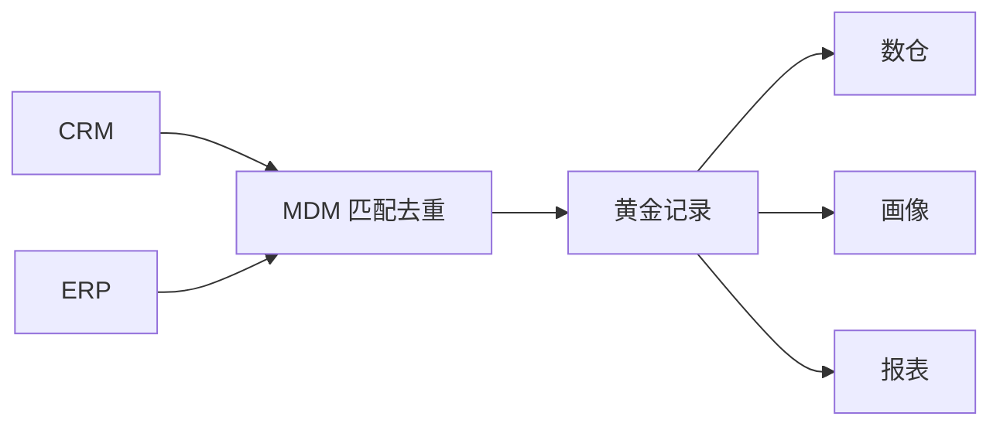
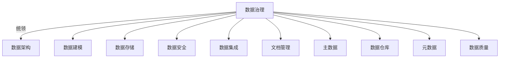
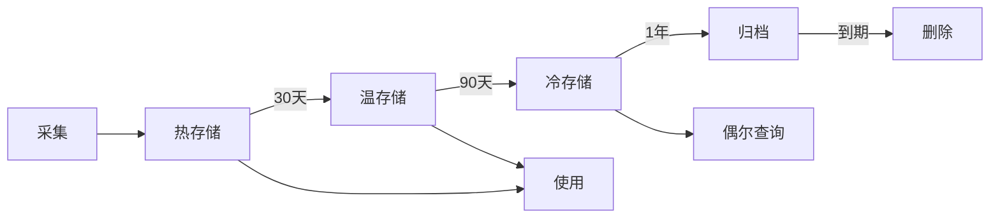
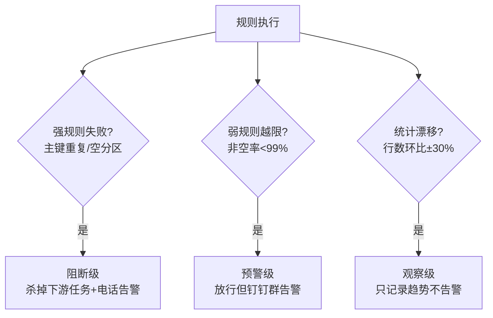

# 大数据 · 12 数据治理与数据质量（治理框架 / 元数据血缘 / 质量六维 / 主数据 / 安全合规 / 落地路径）

> "低质量的数据比没有数据更危险。" 治理是把数据从"一堆文件"变成"可信资产"的工程：元数据让你找得到，质量让你信得过，安全让你用得放心，标准让口径统一。本篇深入拆解治理框架（DAMA/OneData）、元数据与血缘、质量六维校验、主数据、安全与指标体系的落地路径。

---

## 一、要解决的问题

| 痛点 | 说明 |
|------|------|
| 找不到数据 | 数据资产多，不知道有什么/在哪 |
| 数据不可信 | 质量差，没人敢用 |
| 口径不一致 | 同指标各部门算法不同 |
| 数据不安全 | 权限/脱敏/审计缺失 |
| 无主可循 | 数据没人负责，坏了没人管 |

> 核心认知：**治理不是"建平台"而是"建机制"**——标准、owner、流程、考核闭环；从"人工规则"走向"AI × Metadata 自治"。

---

## 二、治理框架

| 框架 | 要点 | 适用 |
|------|------|------|
| DAMA-DMBOK | 11 个知识领域（元数据、质量、安全、主数据…） | 通用理论体系 |
| OneData（阿里） | 统一建模 + 指标字典 + 数据域划分 | 企业落地方法论 |
| DCMM | 国标数据管理能力成熟度模型 | 国内合规评估 |

```
治理闭环：
  盘点（有什么）→ 标准（怎么定义）→ 质量（可信吗）
  → 安全（能用吗）→ 考核（KPI）→ 优化（持续改进）
```

---

## 三、元数据管理（Metadata）

### 3.1 三类元数据

| 类型 | 内容 | 存放 |
|------|------|------|
| 技术元数据 | 表结构、字段、分区、血缘 | HMS |
| 业务元数据 | 业务含义、归属、口径 | 数据目录 |
| 管理元数据 | owner、敏感级、SLA | 治理平台 |

### 3.2 数据血缘（Lineage）


```
价值：
  影响分析（改字段影响谁）
  问题溯源（数据错了追到源）
  合规审计（数据来源可查）

实现：
  SQL 解析（自动） / 手动标注
  工具：Atlas、DataHub、OpenMetadata
  采集：Hive/Spark/Kafka 作业经 Hook 自动上报
```

### 3.3 数据资产目录

```
可检索的资产地图，含技术/业务/管理元数据
支持：标签、评分、订阅、申请权限
形成"找数→认数→用数"闭环

工具对比：
  Apache Atlas：Hadoop 生态元数据 + 自动血缘，分类标签与权限继承
  DataHub：现代元数据平台，推送/拉取式采集，UI 强
  OpenMetadata：开源、协作式，含血缘/质量/术语表
```

---

## 四、数据质量（六维校验）

### 4.1 六维质量

| 维度 | 含义 | 校验示例 |
|------|------|---------|
| 完整性 | 无缺失 | 必填字段非空率 |
| 准确性 | 值正确 | 与源端对账 |
| 一致性 | 跨表一致 | 总分=明细求和 |
| 及时性 | 按时到达 | 数据延迟 < SLA |
| 唯一性 | 无重复 | 主键唯一 |
| 有效性 | 符合格式 | 枚举/正则 |

### 4.2 规则与监控实战

```sql
-- Griffin 度量（示例：订单金额非空 + 主键唯一）
SELECT
  COUNT(*) FILTER (WHERE amount IS NULL) AS null_amt,
  COUNT(*) - COUNT(DISTINCT order_id)     AS dup_id
FROM dwd_order_fact WHERE dt='${bizdate}';
-- 阈值：null_amt=0, dup_id=0，否则告警/阻断下游
```

| 质量规则类型 | 实现 |
|------------|------|
| 完整性 | 非空率、必填校验 |
| 准确性 | 与源端对账、范围检查 |
| 一致性 | 总分=明细求和、跨表核对 |
| 及时性 | 数据到达时间 < SLA |
| 唯一性 | 主键唯一约束 |
| 有效性 | 枚举/正则/格式 |

### 4.3 落地策略

```
规则部署位置：
  贴源层（ODS）：源头质量（源数据坏不进）
  共享层（DWS）：共享数据质量（下流依赖）

阻断策略：质量不过关可阻断下游作业（与 [10](10-资源调度：YARN与Kubernetes.md) 编排联动）
监控：质量看板（合格率趋势）+ 异常告警 + 阻断记录

案例：某电网 3800+ 规则，合格率 90% 纳入考核
```

### 4.4 质量工具

| 工具 | 定位 |
|------|------|
| Apache Griffin | 开源质量度量平台（eBay，LF 项目） |
| DataHub/OpenMetadata | 内嵌质量校验（规则+监控） |
| 商业平台 | Dataphin/WeData/DataArts 质量模块 |

---

## 五、主数据管理（MDM）

### 5.1 概念

```
主数据：企业核心业务实体（客户、产品、组织）的"唯一正确版本"
作用：避免"同一客户多套 ID"，统一跨系统口径
```

### 5.2 流程



```
流程：
  ① 识别主数据（客户/产品/组织）
  ② 抽取 + 匹配去重（规则/相似度算法）
  ③ 生成黄金记录（Golden Record）
  ④ 分发订阅给下游

价值：统一"一个客户一个 ID"，避免跨系统口径冲突
```

---

## 六、数据安全与合规

### 6.1 安全能力矩阵

| 能力 | 说明 | 工具 |
|------|------|------|
| 认证/授权 | 谁可以访问 | Kerberos、LDAP |
| 细粒度权限 | 库/表/列/行级 | Apache Ranger、Sentry |
| 数据脱敏 | 手机号/身份证掩码 | 动态脱敏策略 |
| 分级分类 | 公开/内部/机密 | 标签 + 自动识别 |
| 审计 | 谁何时查了什么 | 访问日志 |
| 合规 | 等保2.0、个人信息保护 | 加密 + 最小授权 |

### 6.2 贯穿全程的安全

```
采集脱敏（源头）→ 传输加密（TLS）→ 存储加密（KMS）
→ 访问最小授权（Ranger）→ 操作可审计（日志）

数据分级：
  L1 公开 / L2 内部 / L3 敏感 / L4 机密
  按级别定：是否脱敏、授权范围、留存周期
```

---

## 七、指标体系（OneData 核心）

```
一个指标一个口径：同名指标全局唯一定义，避免"各部门 GMV 不一样"

指标字典：
  原子指标（支付金额）
  派生指标（支付金额 + 时间维度 = 日 GMV）
  修饰词（渠道=APP）

维度标准化：时间/地域/渠道统一编码

落地：
  指标字典沉淀为可复用资产
  命名规范：指标_维度（如 gmv_daily）
  变更走评审
```

---

## 八、Data Agent（2025 治理新趋势）

```
Data Agent：自主感知/推理/执行的数据智能体
  自动盘点资产、匹配权限与脱敏、生成优化建议

"AI × Metadata"：
  资产热度、血缘深度、质量波动实时评估
  形成"治理—使用—反馈—优化"正循环

AI 应用场景：
  资产盘点：LLM 自动识别表/字段业务含义、打标签
  质量：异常检测模型预测数据漂移、自动建规则
  血缘：大模型解析 SQL/代码补全隐性血缘
  NL2SQL：自然语言转查询，降低用数门槛
  Data Agent：自主巡检、给优化建议、自动派单

趋势：治理从"人工规则"走向"智能自治"，降低治理人力
```

---

## 九、治理落地路径

### 9.1 分阶段实施

```
阶段 1（找数）：元数据采集 + 资产目录（Atlas/DataHub）
阶段 2（信任）：质量规则前置（贴源+共享层），六维校验
阶段 3（规范）：指标字典 + 命名标准 + 主数据
阶段 4（安全）：分级分类 + Ranger 权限 + 脱敏 + 审计
阶段 5（优化）：考核 + 血缘影响分析 + Data Agent 自治
```

### 9.2 组织保障

```
数据主人制：源头责任人认领，问题派单闭环
考核指标：合格率、资产覆盖率、血缘覆盖率、复用率
流程：发现问题 → 派单 → 修复 → 复盘 → 沉淀规则
```

---

## 十、治理度量指标

| 治理域 | 度量指标 |
|--------|---------|
| 元数据 | 资产覆盖率、血缘覆盖率 |
| 质量 | 规则数、合格率、阻断次数 |
| 安全 | 脱敏覆盖率、越权访问数 |
| 标准 | 命名合规率、口径一致率 |
| 价值 | 资产复用率、调用量 |

---

## 十一、治理落地 Checklist

- [ ] 先立标准（命名/口径/主数据），再谈分析。
- [ ] 元数据 + 血缘自动采集（Atlas/DataHub），建资产目录。
- [ ] 质量规则前置（贴源+共享层），不合格阻断下游。
- [ ] 安全分级 + 脱敏 + 细粒度权限 + 审计，合规内建。
- [ ] 指标体系 OneData 化，统一口径字典。
- [ ] 数据主人制：源头责任人认领，问题派单闭环。
- [ ] 引入 Data Agent 提效（资产盘点/优化建议）。

---

## DAMA-DMBOK 治理框架

### 十一个知识领域

| 领域 | 核心内容 | 工具/实践 |
|------|---------|----------|
| 数据治理 | 战略、组织、政策 | CDO办公室、治理委员会 |
| 数据架构 | 数据模型、标准、框架 | ERD、数据建模工具 |
| 数据建模 | 概念/逻辑/物理模型 | PowerDesigner、ERwin |
| 数据存储 | 数据库、文件系统管理 | HDFS、对象存储 |
| 数据安全 | 分级分类、访问控制 | Ranger、Kerberos |
| 数据集成 | ETL、CDC、数据同步 | DataX、Flink CDC |
| 文档与内容 | 非结构化数据管理 | ECM、文档库 |
| 参考与主数据 | 黄金记录、编码标准 | MDM平台 |
| 数据仓库 | OLAP、维度建模 | Hive、StarRocks |
| 元数据 | 技术/业务/操作元数据 | Atlas、DataHub |
| 数据质量 | 校验、监控、改进 | Griffin、Great Expectations |

### DAMA 车轮模型



## 数据质量六维详解

### 六维度量化指标

| 维度 | 量化公式 | 校验方法 | 告警阈值 |
|------|---------|---------|---------|
| 准确性 | 符合规则行数/总行数 | 源端对账、范围检查 | <99.9% |
| 完整性 | 非空行数/总行数 | 必填字段检查 | <99% |
| 一致性 | 跨表一致行数/总行数 | 总分=明细求和 | <100% |
| 及时性 | 数据到达时间-事件时间 | SLA监控 | >SLA |
| 唯一性 | 去重后行数/总行数 | 主键唯一约束 | <100% |
| 有效性 | 符合格式行数/总行数 | 枚举/正则/范围 | <99.9% |

```
质量评分模型：
  每维度100分，加权平均
  权重：准确性30% + 完整性25% + 一致性20% + 及时性15% + 唯一性5% + 有效性5%
  总分 = Σ(维度得分 × 权重)
  门槛：≥90分合格，<80分告警，<70分阻断下游
```

### 数据剖析技术（Data Profiling）

| 技术 | 说明 | 输出 |
|------|------|------|
| 类型检测 | 字段值类型推断 | 字段类型、长度分布 |
| 空值分析 | 空/NULL比例统计 | 空值率、缺失模式 |
| 唯一性分析 | 基数/Cardinality | 不重复值数量、分布 |
| 格式验证 | 正则/枚举匹配 | 不合规比例 |
| 分布分析 | 数值/时间分布 | 最小值、最大值、均值 |
| 关联分析 | 跨字段依赖 | 函数依赖、外键关系 |

```
工具：
  Apache Griffin：Hadoop生态质量度量
  Great Expectations：Python数据质量框架
  Soda Core：轻量级数据质量检查
  dbt Tests：内建质量测试
  商业：Monte Carlo、Soda Cloud
```

## 数据血缘工具对比

| 工具 | 采集方式 | 支持引擎 | 粒度 | 特点 |
|------|---------|---------|------|------|
| Apache Atlas | Hook自动 | Hive/Spark | 表+字段 | Hadoop生态首选 |
| DataHub | Push/Pull | 多引擎 | 表+字段 | 轻量易扩展 |
| OpenMetadata | API采集 | 多引擎 | 表+字段 | 标准化、协作 |
| Marquez | API上报 | Spark/Flink | 任务级 | Airflow集成 |
| 数据有幸 | SQL解析 | 多引擎 | 字段级 | 阿里云原生 |

```
血缘价值：
  影响分析：字段变更→影响哪些报表/任务
  问题溯源：数据错误→追到源头ETL
  合规审计：数据来源可查
  优化分析：热点表/高频依赖→优化优先级

实现方式：
  SQL解析：自动解析INSERT/CREATE语句
  运行时Hook：Spark/Hive作业执行时上报
  日志采集：解析ETL任务日志
```

## 数据目录实现

```
架构分层：
  元数据采集层：Hook/API/Pull多模式采集
  元数据存储层：MySQL+ES+图数据库
  元数据服务层：REST API + 搜索引擎
  应用层：数据门户 + 搜索 + 血缘 + 质量

关键能力：
  搜索：全文检索+标签筛选+Owner过滤
  浏览：按业务域/数据域层级浏览
  血缘：可视化上下游依赖链路
  质量：嵌入质量评分和规则
  申请：在线申请权限+审批流
  评论：数据使用反馈和讨论

与数据湖关系：
  数据湖 = 存储原始数据
  数据目录 = 治理层，让湖中数据可管理
  互补：湖仓提供存储+计算，目录提供治理+发现
```

## 主数据管理（MDM）

```
主数据 vs 交易数据：
  主数据：核心业务实体的"唯一正确版本"
    客户、产品、组织、供应商
    变化慢、跨系统共享
  交易数据：业务过程记录
    订单、支付、日志
    变化快、单系统产生

MDM流程：
  ① 识别主数据域（客户/产品/组织）
  ② 抽取多源数据（CRM/ERP/WMS）
  ③ 匹配去重（规则+相似度算法）
  ④ 生成黄金记录（Golden Record）
  ⑤ 分发订阅给下游系统

黄金记录规则：
  优先级：高优先级系统数据优先
  时效：最新更新时间优先
  完整：字段级合并（取最完整值）
  一致性：全局唯一ID映射
```

## 数据生命周期管理



| 阶段 | 动作 | 存储介质 | 成本 |
|------|------|---------|------|
| 采集 | ETL/CDC写入 | SSD | 高 |
| 热 | 高频查询 | SSD/高性能 | 10× |
| 温 | 日常查询 | 标准存储 | 3× |
| 冷 | 偶尔查询 | 低频存储 | 1× |
| 归档 | 合规保留 | 归档存储 | 0.3× |
| 删除 | 过期清理 | — | 0 |

```
策略配置：
  按时间：订单表180天后转冷，3年归档
  按访问：90天无查询→自动转冷
  合规：个人数据保留期限（PIPL要求最小必要）
  僵尸表：6个月无查询+无下游引用→标记清理
```

## 数据质量规则引擎

```
规则类型：
  阻断型：不合格阻断下游（如主键重复）
  告警型：不合格发告警（如空值率超阈值）
  监控型：记录但不阻断（如数据漂移检测）

规则配置：
  维度：表/字段级
  条件：非空、范围、枚举、正则、自定义SQL
  阈值：百分比/绝对值
  动作：阻断/告警/邮件/钉钉

规则引擎架构：
  规则定义（YAML/JSON）→ 规则解析 → 校验执行 → 结果输出
  集成调度：与Airflow/DolphinScheduler联动
  质量看板：合格率趋势、异常统计
```

## GDPR/CCPA 合规要求

| 法规 | 核心要求 | 数据治理动作 |
|------|---------|-------------|
| GDPR | 合法性、数据最小化、被遗忘权 | 数据分类、同意管理、删除能力 |
| CCPA | 知情权、删除权、拒绝出售 | 数据目录、删除API、 opt-out |
| PIPL | 合法基础、单独同意、跨境评估 | 分级分类、脱敏、安全评估 |
| HIPAA | 健康数据保护 | 加密、审计、最小授权 |

```
合规落地步骤：
  1. 数据资产盘点（知道有哪些个人数据）
  2. 分级分类（标记敏感等级）
  3. 合法性基础确认（同意/合同/法定义务）
  4. 脱敏/加密落地
  5. 跨境传输评估（如有）
  6. 数据主体权利响应（访问/删除/更正）
  7. 泄露响应预案（72h通知）
  8. 定期合规审计
```

---

## 数据质量规则分类与 SQL 实现样例

| 类别 | 规则模板 | SQL 样例（Hive 方言） |
|------|---------|----------------------|
| 完整性 | 必填字段非空率 | `SELECT SUM(CASE WHEN user_id IS NULL THEN 1 ELSE 0 END) FROM t WHERE dt='${bizdate}'` |
| 唯一性 | 主键无重复 | `SELECT order_id FROM t GROUP BY order_id HAVING COUNT(*)>1` |
| 一致性 | 总分 = 明细求和 | `SELECT a.total_amt - b.sum_amt FROM agg_t a JOIN (SELECT order_id,SUM(pay_amt) sum_amt FROM dwd_t GROUP BY order_id) b ON a.order_id=b.order_id WHERE a.total_amt<>b.sum_amt` |
| 及时性 | 分区按时产出 | `SELECT COUNT(*) FROM ods.orders WHERE dt='${bizdate}'` 结果为 0 即延迟 |
| 有效性 | 枚举/正则/值域 | `SELECT COUNT(*) FROM t WHERE status NOT IN ('PAID','REFUND','CLOSED')` |
| 准确性 | 与源端对账波动 | 源表与 ODS 行数/聚合值 diff 率 <0.1% |

```sql
-- 综合质量检查作业模板：一次扫描输出多规则结果
SELECT
  'orders' AS tbl, '${bizdate}' AS dt,
  COUNT(*) AS total_rows,
  SUM(CASE WHEN user_id IS NULL THEN 1 ELSE 0 END) AS null_user,
  COUNT(DISTINCT order_id) AS distinct_id,
  SUM(CASE WHEN pay_amount < 0 THEN 1 ELSE 0 END) AS invalid_amount,
  MAX(modified_time) AS latest_ts          -- 用于及时性比对
FROM dwd_order_fact WHERE dt = '${bizdate}';
```

落地建议：每张 DWD/DWS 核心表绑定 3~8 条规则（宁缺毋滥，规则太多告警疲劳）；结果统一写入 `dq_result` 明细表，供看板与阻断判断共用。

## 质量监控告警分级（阻断 / 预警 / 观察）



| 级别 | 判定条件 | 处置动作 | 告警渠道 |
|------|---------|---------|---------|
| 阻断 Block | 主键重复、分区缺失、总分不平 | 下游任务终止，问题修复后手动放行 | 电话 + 值班群 |
| 预警 Warn | 非空率/准确率低于阈值但可用 | 放行 + 当日修复工单 | 钉钉群 + 邮件 |
| 观察 Watch | 波动在容忍带内（如 ±30%） | 只记录，周报汇总趋势 | 看板 |

分级纪律：**新规则一律先进「观察」跑两周**，确认误报率后再升级到预警/阻断；直接上阻断是告警疲劳的头号来源。

## 血缘采集方式对比（解析 SQL vs 运行时埋点）

| 维度 | 静态 SQL 解析 | 运行时埋点（Hook/Listener） |
|------|--------------|---------------------------|
| 原理 | 解析 SQL AST 提取输入输出表 | 引擎执行时回调上报真实读写的表/字段 |
| 覆盖率 | 取决于能否拿到全部脚本 | 高（覆盖实际执行的作业） |
| 字段级能力 | 强（可推导列级转换逻辑） | 一般（常只有表级） |
| 误报风险 | 死代码/动态 SQL 解析不出或解析错 | 低（所见即所跑） |
| 接入成本 | 对接 Git/调度元数据库即可 | 每个引擎装 Hook（Hive/Spark/Flink 各一套） |

```text
生产组合拳：
① 表级血缘：运行时 Hook 兜底（保证覆盖率）
② 字段级血缘：SQL 解析为主（保证粒度），解析失败的作业回退表级
③ BI 血缘：BI 工具 API 导出看板→数据集→字段映射
④ 补漏：LLM 辅助解析历史脚本与 Notebook（治理冷启动提效）
```

血缘验收指标：核心表血缘覆盖率 >95%、自动采集占比 >90%；血缘断链的表要在资产目录标红并派单 Owner。

## 数据资产盘点方法论

```text
五步盘点法：
Step1 定范围：按业务域圈定库表清单（先交易/用户等核心域）
Step2 自动摸底：爬取技术元数据（大小/更新时间/QPS/下游引用数）
Step3 认领确权：系统推荐 Owner → 业务确认，两周内认领率考核
Step4 打标分级：业务含义/敏感等级/保留期限三标签必填
Step5 分类处置：
     高频高价值 → 进共享层重点保障
     低频有价值 → 归档降成本
     零引用零查询 → 下线评审清单
```

| 盘点产出物 | 内容 | 用途 |
|-----------|------|------|
| 资产地图 | 域→主题→表的树形目录 | 找数入口 |
| 僵尸表清单 | 90 天零访问零引用 | 存储成本回收 |
| 权责矩阵 | 表 × Owner × 敏感级 | 安全合规基线 |
| 缺口清单 | 业务要但平台没有的数据 | 反向指导建设优先级 |

经验值：首轮盘点通常发现 **20~40% 的表属于僵尸**，清理后存储立省两成以上；盘点不是一次运动，季度滚动增量盘点才能维持资产目录可信。

## 治理组织角色职责矩阵（Owner / Steward / Consumer）

| 职责事项 | 数据 Owner（业务方） | Data Steward（数据团队） | Consumer（使用方） |
|----------|:---:|:---:|:---:|
| 定义指标口径 | ✅ 决策 | ⭕ 协助标准化 | ❌ |
| 口径文档维护 | ⭕ 审核 | ✅ 执行 | ❌ |
| 数据质量规则制定 | ⭕ 确认业务阈值 | ✅ 技术实现 | ❌ |
| 质量问题修复 | ✅ 源头整改 | ⭕ 平台排查 | ❌ |
| 权限申请审批 | ✅ 审批 | ⭕ 流程仲裁 | 提交申请 |
| 合规脱敏策略 | ✅ 确认场景 | ✅ 落地配置 | 遵守 |
| 元数据打标 | ⭕ 确认含义 | ✅ 采集维护 | ⭕ 反馈纠错 |
| 使用反馈 | ❌ | ⭕ 收敛需求 | ✅ 评价/评论 |

✅ 主责　⭕ 协同　❌ 不参与


配比参考：每 5~8 个业务域设 1 名专职 Steward；Owner 必须是有决策权的业务负责人而非虚挂名——**Owner 不真负责，整个职责矩阵就塌了**，这是治理组织设计的第一原则。

## 质量平台与调度联动实现

```yaml
# DolphinScheduler / Airflow 中插入质量检查节点（示意）
tasks:
  - task_id: build_dwd_order
    type: spark_sql
    sql: "INSERT OVERWRITE dwd_order_fact ... "

  - task_id: dq_gate_order            # 质量门禁
    type: dq_check
    rules:
      - rule: primary_key_unique
        column: order_id
        level: block                   # 失败即阻断下游
      - rule: not_null_rate
        column: user_id
        threshold: 0.99
        level: warn
    downstream_block: true

  - task_id: build_dws_order_1d       # 只有门禁通过才执行
    dependsOn: [dq_gate_order]
```

```text
联动闭环：
  规则执行 → 结果写 dq_result → 判级（block/warn/watch）
  → block：调度 API 杀掉/跳过下游 + 电话告警 + 生成修复工单
  → warn：放行 + 群告警 + 计入 Owner 月度质量分
  周期复盘：误报规则降级、漏报规则补位，阈值随数据量漂移校准
```

| 度量指标 | 定义 | 目标值 |
|----------|------|--------|
| 规则覆盖率 | 有规则的表数 / 核心表总数 | >90% |
| 阻断准确率 | 有效阻断 / 总阻断次数 | >70% |
| 问题平均修复时长 | 从派单到关闭 | <24h |
| 质量分 | 加权合格率进团队 OKR | ≥95 分 |

---

## 数据质量评分卡（完整性/准确性/一致性/及时性/唯一性 评分规则）

```
质量评分模型：

  每维度 100 分，加权平均：
    准确性 30%：符合规则行数/总行数 × 100
    完整性 25%：非空行数/总行数 × 100
    一致性 20%：跨表一致行数/总行数 × 100
    及时性 15%：按时到达率 × 100
    唯一性 5%：去重后行数/总行数 × 100
    有效性 5%：符合格式行数/总行数 × 100

  总分 = Σ(维度得分 × 权重)
  门槛：
    ≥90 分：合格（进入下一环节）
    80~89 分：预警（限期整改）
    <80 分：阻断（下游任务暂停）
```

| 维度 | 评分公式 | 告警阈值 | 扣分规则 |
|------|---------|---------|---------|
| 完整性 | 非空行数/总行数 | <99% | 每降1%扣10分 |
| 准确性 | 符合规则行数/总行数 | <99.9% | 每降0.1%扣5分 |
| 一致性 | 跨表一致行数/总行数 | <100% | 不一致即扣分 |
| 及时性 | 按时到达率 | >SLA | 超SLA每小时扣5分 |
| 唯一性 | 去重后行数/总行数 | <100% | 重复即扣分 |

## 数据血缘自动采集技术（解析 SQL / 运行时 Hook）

```
血缘自动采集两种方式：

  方式一：静态 SQL 解析
    解析 INSERT/CREATE 语句 AST
    提取输入表/输出表/字段映射
    覆盖率取决于能否拿到全部脚本
    优点：字段级粒度
    缺点：动态 SQL 解析不出

  方式二：运行时 Hook（Listener）
    引擎执行时回调上报真实读写的表/字段
    覆盖率高（覆盖实际执行的作业）
    优点：所见即所跑
    缺点：常只有表级

  生产组合拳：
    表级血缘：运行时 Hook 兜底
    字段级血缘：SQL 解析为主
    BI 血缘：BI 工具 API 导出
    补漏：LLM 辅助解析历史脚本
```

| 维度 | 静态 SQL 解析 | 运行时 Hook |
|------|--------------|-------------|
| 原理 | 解析 SQL AST | 引擎回调上报 |
| 覆盖率 | 取决于脚本可获取性 | 高 |
| 粒度 | 强（字段级） | 一般（表级） |
| 误报风险 | 死代码/动态 SQL | 低 |
| 接入成本 | 对接 Git/调度 | 每个引擎装 Hook |

## 数据目录与元数据管理工具对比（Apache Atlas vs DataHub vs OpenMetadata）

| 维度 | Apache Atlas | DataHub | OpenMetadata |
|------|-------------|---------|--------------|
| 开源方 | Hadoop 生态 | LinkedIn | 开源协作 |
| 架构 | JanusGraph 图存储 | MySQL+Kafka+ES | API-first |
| 血缘 | Hive/Spark Hook 自动 | Push/Pull 多源 | API 采集 |
| 搜索 | 基础 | ES 全文检索 | REST+GraphQL |
| 质量 | 无（需集成 Griffin） | 内嵌 | 内嵌 |
| 扩展性 | 中（Hadoop 耦合） | 高（插件式） | 高（标准 API） |
| 适用 | Hadoop 集群 | 现代数据栈 | 多云/标准化 |

## 数据分类分级国标对照表

| 等级 | 定义 | 例子 | 国标依据 |
|------|------|------|---------|
| L1 公开 | 可公开信息 | 官网数据、公开报表 | GB/T 35273 |
| L2 内部 | 内部使用 | 部门业绩、报表 | GB/T 35273 |
| L3 敏感 | 个人信息 | 手机号、地址、交易明细 | GB/T 35273 + PIPL |
| L4 机密 | 核心机密 | 用户全量身份证、健康档案 | 等保 2.0 |
| L5 绝密 | 国家机密 | 关系国家安全领域数据 | 保密法 |

## 数据治理组织架构（数据 Owner / Steward / Consumer 职责）

```
三方职责矩阵：

  数据 Owner（业务方）：
    定义指标口径
    数据质量问题源头整改
    权限审批
    确认业务阈值

  Data Steward（数据团队）：
    口径文档维护
    质量规则技术实现
    元数据采集维护
    合规脱敏落地

  Consumer（使用方）：
    提交数据需求
    使用反馈评价
    遵守数据安全规范
```

| 职责事项 | Owner | Steward | Consumer |
|----------|:-----:|:-------:|:--------:|
| 定义指标口径 | 决策 | 协助 | — |
| 口径文档维护 | 审核 | 执行 | — |
| 质量规则制定 | 确认阈值 | 技术实现 | — |
| 质量问题修复 | 源头整改 | 平台排查 | — |
| 权限申请审批 | 审批 | 流程仲裁 | 提交申请 |
| 合规脱敏策略 | 确认场景 | 落地配置 | 遵守 |

## 十二、质量监控规则 SQL 示例

```sql
-- 1. 数据完整性检查（空值率）
SELECT
  table_name,
  column_name,
  COUNT(*) AS total_rows,
  SUM(CASE WHEN value IS NULL THEN 1 ELSE 0 END) AS null_count,
  ROUND(SUM(CASE WHEN value IS NULL THEN 1 ELSE 0 END) * 100.0 / COUNT(*), 2) AS null_rate
FROM information_schema.columns
WHERE table_schema = 'production'
GROUP BY table_name, column_name
HAVING SUM(CASE WHEN value IS NULL THEN 1 ELSE 0 END) * 100.0 / COUNT(*) > 5;

-- 2. 数据一致性检查（跨表校验）
SELECT
  'orders' AS source_table,
  COUNT(DISTINCT o.user_id) AS order_users,
  'users' AS target_table,
  COUNT(DISTINCT u.id) AS user_users,
  COUNT(DISTINCT o.user_id) - COUNT(DISTINCT u.id) AS diff
FROM orders o
LEFT JOIN users u ON o.user_id = u.id;

-- 3. 数据时效性检查（SLA 监控）
SELECT
  table_name,
  MAX(update_time) AS last_update,
  TIMESTAMPDIFF(HOUR, MAX(update_time), NOW()) AS hours_since_update,
  CASE
    WHEN TIMESTAMPDIFF(HOUR, MAX(update_time), NOW()) > 24 THEN 'SLA 违规'
    ELSE '正常'
  END AS sla_status
FROM information_schema.tables
WHERE table_schema = 'production'
GROUP BY table_name;

-- 4. 数据准确性检查（业务规则）
SELECT
  'negative_amount' AS rule_name,
  COUNT(*) AS violation_count
FROM orders
WHERE amount < 0
UNION ALL
SELECT
  'future_date' AS rule_name,
  COUNT(*) AS violation_count
FROM orders
WHERE order_date > NOW();
```

## 十三、自动化质量框架（Great Expectations / Deequ）

### 13.1 Great Expectations 配置

```python
# Great Expectations 数据质量检查
import great_expectations as gx

context = gx.get_context()

# 定义数据源
datasource = context.sources.add_pandas("my_datasource")
data_asset = datasource.add_dataframe_asset(name="orders")
batch_request = data_asset.build_batch_request()

# 定义期望
expectation_suite = context.add_expectation_suite("orders_quality")
expectation_suite.add_expectation(
    gx.expectations.ExpectColumnValuesToNotBeNull(column="order_id")
)
expectation_suite.add_expectation(
    gx.expectations.ExpectColumnValuesToBeBetween(
        column="amount", min_value=0, max_value=1000000
    )
)
expectation_suite.add_expectation(
    gx.expectations.ExpectColumnValuesToBeInSet(
        column="status", value_set=["pending", "paid", "shipped", "completed"]
    )
)

# 运行检查
result = context.run_checkpoint("my_checkpoint")
print(result)
```

### 13.2 Amazon Deequ 配置

```scala
// Deequ 数据质量检查
import com.amazon.deequ.checks.Check
import com.amazon.deequ.constraints.ConstrainableDataTypes
import com.amazon.deequ.Verification

val verificationResult = Verification()
  .onData(spark.read.table("orders"))
  .check(Check(spark, Check.Level.Error)
    .hasSize(_ >= 1000000)  // 数据量检查
    .isComplete("order_id")  // 完整性检查
    .isNonNegative("amount")  // 非负检查
    .isContainedIn("status", Array("pending", "paid", "shipped"))  // 枚举检查
    .containsURL("website")  // URL 格式检查
    .mutualInformation("user_id", "product_id")  // 互信息检查
  )
  .run()

// 输出结果
println(verificationResult.checkResults)
```

## 十四、数据血缘可视化（Atlas/DataHub）

```text
数据血缘可视化架构：

  数据源（MySQL/Hive/ES）
    → ETL 任务（Airflow/DolphinScheduler）
      → 数据仓库（ODS → DWD → DWS → ADS）
        → 数据服务（API/BI 看板）

  血缘采集：
    1. SQL 解析（Atlas/DataHub 自动解析）
    2. API 采集（ETL 工具上报血缘）
    3. 日志分析（查询日志提取血缘）

  血缘应用：
    1. 影响分析：字段变更影响哪些下游
    2. 根因分析：数据问题溯源
    3. 数据字典：字段说明+业务含义
    4. 合规审计：数据流转路径追踪
```

```text
Atlas vs DataHub 对比：

| 维度 | Atlas | DataHub |
|------|-------|---------|
| 开源方 | Apache | LinkedIn |
| 技术栈 | Java | Python |
| 元数据模型 | 丰富（Hadoop 生态） | 灵活（自定义） |
| 血缘采集 | Hook（Hive/Spark） | Connector（多源） |
| 搜索 | Solr | Elasticsearch |
| UI | Web Console | React UI |
| 适用 | Hadoop 生态 | 多源异构环境 |
```

## 十五、数据目录方法论

```text
数据目录核心功能：
  1. 数据发现：搜索+浏览+推荐
  2. 数据理解：字段说明+业务含义+示例数据
  3. 数据信任：质量评分+血缘+使用统计
  4. 数据治理：Owner+权限+合规标签

数据目录建设步骤：
  Step 1：元数据采集（自动化 + 人工补充）
  Step 2：数据分类（按业务域/数据类型/敏感度）
  Step 3：数据标注（Owner/业务含义/质量规则）
  Step 4：数据发现（搜索/浏览/推荐）
  Step 5：数据治理（权限/审计/合规）
```

## 十六、与其他板块的关系

- 元数据支撑建模见「[09-数据仓库与OLAP引擎](09-数据仓库与OLAP引擎.md)」；
- 质量阻断联动调度见「[10-资源调度：YARN与Kubernetes](10-资源调度：YARN与Kubernetes.md)」；
- 数据安全见「[15-数据安全与隐私合规](15-数据安全与隐私合规.md)」；
- AI 治理趋势见「[13-新技术趋势与生态全景](13-新技术趋势与生态全景.md)」；
- 数据服务化见「[17-数据服务化与指标管理](17-数据服务化与指标管理.md)」。

> 一句话：**治理 = 元数据（找得到）+ 质量六维（信得过）+ 安全（用得放心）+ 指标（口径统一）+ 主数据（一个实体一个 ID）——落地五步：找数→质量→规范→安全→优化，机制核心：标准/owner/流程/考核闭环，趋势：AI × Metadata 自治**。