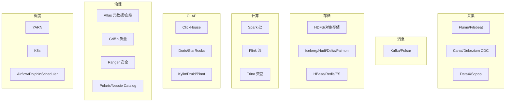
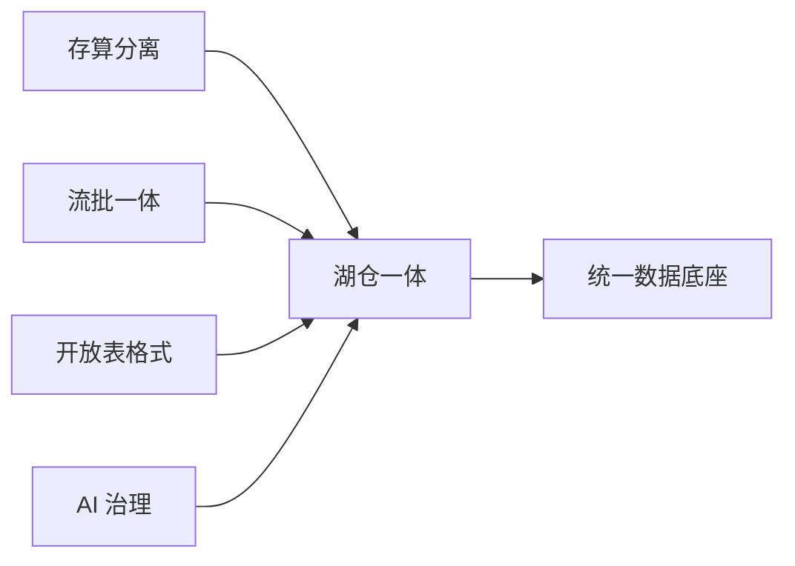

# 大数据 · 13 新技术趋势与生态全景

> 大数据技术正在经历"云原生化、湖仓一体、流批一体、AI 化"的四重收敛。看懂趋势，才不至于在选型时被旧范式拖累。

本篇梳理 2025–2026 的关键趋势与完整生态地图，并给出学习路径。前 12 篇是"现在怎么用"，本篇是"未来往哪走"。

## 一、六大技术趋势

### 1.1 存算分离 + 云原生（已成基线）
- 存储用对象存储（S3/OSS），计算弹性（Spark/Flink on K8s），靠缓存补网络 IO。
- 价值：成本 ↓（按量付费）、弹性 ↑（秒级扩缩）、运维 ↓。
- 代表：Snowflake、Databricks、StarRocks 存算分离、Iceberg on S3。

### 1.2 湖仓一体（Lakehouse）成主流
- 开放表格式（Iceberg 为主，Paimon 流式崛起）+ Catalog（Polaris/Nessie）统一元数据。
- 消除"湖仓双写"，一份数据服务 BI + ML + 科学计算。
- DuckLake（2025）用关系库存元数据，简化一致性，代表"元数据简化"第三波。

### 1.3 流批一体（Unified）
- 同一 API/引擎处理有界与无界；Flink、Spark Structured Streaming、Paimon 表同时承流承批。
- 替代 Lambda 双链路，口径一致、运维减半。

### 1.4 向量化执行 + 查询加速
- 所有现代 OLAP（ClickHouse/Doris/StarRocks）标配向量化（SIMD）+ CBO 优化器。
- 性能从"秒"到"亚秒/毫秒"，TPC-DS/SSB 持续刷新。

### 1.5 AI 深度融合
- **Data Agent**（2025）：智能治理、自动盘点、优化建议。
- **LLM + 数据**：自然语言转 SQL、数据问答、向量检索（RAG 知识库）。
- **ML 内建**：特征存储、训练样本、在线推理与数仓融合。

### 1.6 Serverless 与 DataOps
- Serverless 数仓（BigQuery/Redshift/Snowflake）：按需付费、免运维。
- DataOps：开发治理一体化、CI/CD for 数据、可观测性（如网易 EasyData）。

## 二、开源生态全景地图



## 三、主流商业/云产品速览

| 类别 | 代表 |
|------|------|
| 云数仓 | Snowflake、BigQuery、Redshift、Databricks |
| 湖仓/治理平台（国产） | 阿里 Dataphin、腾讯 WeData、华为 DataArts、字节 Dataleap、网易 EasyData、SelectDB(Doris)、StarRocks |
| 开源 OLAP | ClickHouse、Doris、StarRocks、DuckDB |
| 流式 | Flink、Kafka、Pulsar |
| 数据集成 | DataX、Flink CDC、Airbyte、SeaTunnel |

## 四、常见误区与选型原则

> ⚠️ **五大坑**：
> 1. **为建平台而建平台**：先有业务目标（增长/风控/效率），再选技术。
> 2. **盲目追新**：Paimon/Iceberg 虽好，但要看团队引擎组合与实时性需求。
> 3. **Lambda 负债**：新项目别上双链路，直接用流批一体/湖仓一体。
> 4. **治理后置**：安全/质量/口径从第一天就内建，事后补课成本 10×。
> 5. **忽视成本**：存算分离 + 生命周期（冷热分层）+ 小文件治理，避免对象存储账单爆炸。

**选型原则**：
- 通用互操作 + 多云 → Iceberg；Flink 实时 upsert → Paimon。
- 单表极致分析 → ClickHouse；复杂高并发 BI → StarRocks；轻量 → Doris。
- 新集群 → K8s 化 + 存算分离 + 统一 Catalog。

## 五、学习路径（从入门到体系）

```mermaid
flowchart TD
    L0[基础: Linux/SQL/Java/Scala/Python] --> L1[存储: HDFS/对象存储 + Parquet/Iceberg]
    L1 --> L2[计算: Spark(批) + Flink(流)]
    L2 --> L3[管道: Kafka + CDC + DataX]
    L3 --> L4[数仓: 分层建模 + OLAP(Doris/StarRocks)]
    L4 --> L5[湖仓: 实时数仓 + 流批一体]
    L5 --> L6[治理: 元数据/质量/安全/指标]
    L6 --> L7[趋势: 云原生/Serverless/Data Agent]
```

## 六、本板块内容地图

| 篇 | 主题 |
|----|------|
| [01](01-概述与业务体系.md) | 概念4V、业务价值、数据中台 |
| [02](02-技术体系与架构演进.md) | 技术栈地图、Lambda/Kappa、湖仓一体 |
| [03](03-数据采集与同步.md) | Flume/Sqoop/DataX/Canal/Debezium/Kafka |
| [04](04-分布式存储与HDFS.md) | HDFS、对象存储、Kudu |
| [05](05-列式存储与数据湖格式.md) | Parquet/ORC、Iceberg/Hudi/Delta/Paimon/DuckLake |
| [06](06-分布式NoSQL与HBase.md) | HBase/LSM/RowKey、NoSQL 对比 |
| [07](07-批处理计算：MapReduce与Spark.md) | MapReduce/Spark RDD/DAG/Hive |
| [08](08-流处理计算：Flink.md) | Flink 架构/窗口/水印/Checkpoint |
| [09](09-数据仓库与OLAP引擎.md) | 维度建模、分层、ClickHouse/Doris/StarRocks |
| [10](10-资源调度：YARN与Kubernetes.md) | YARN/K8s/调度器/编排 |
| [11](11-实时数仓与湖仓一体.md) | 实时数仓、湖仓一体、流批一体 |
| [12](12-数据治理与数据质量.md) | 元数据/血缘、质量、主数据、安全、指标 |
| [13](13-新技术趋势与生态全景.md) | 云原生/湖仓/AI/Serverless 趋势与生态 |

## 七、趋势观察 Checklist

- [ ] 新平台默认存算分离 + 湖仓一体，别回到 HDFS 耦合。
- [ ] 表格式按引擎组合选（Iceberg 通用 / Paimon 流式）。
- [ ] 用 Catalog 统一元数据，打通多引擎。
- [ ] 治理与 Data Agent 内建，降低长期人力。
- [ ] 关注成本（生命周期、冷热、小文件）。
  - [ ] 跟踪 Flink 2.x、Iceberg REST Catalog、DuckLake 等演进。

> 参考：Databricks Lakehouse、各开源项目 2025 路线、云厂商数仓白皮书、Data Agent 实践（Dataphin 2025）、DuckLake 公告。

## 八、Data Mesh（数据网格）

- 思想：把"单体数据平台"拆为**领域自治的数据产品**，按**产品思维 + 联邦治理**组织。
- 四大原则：① 领域所有权（Domain Ownership）；② 数据即产品（Data as a Product）；③ 自助平台（Platform Self-Serve）；④ 联邦计算治理（Federated Governance）。
- 与湖仓关系：湖仓一体提供**共享存储底座**，Data Mesh 解决**组织/ownership** 问题，二者互补不冲突。

## 九、向量化执行深挖

- 原理：**按列批量（batch）处理 + SIMD 指令**，一次 CPU 指令处理多行，减少虚函数/分支，大幅提速。
- 代表：ClickHouse（原生向量化）、StarRocks（自研极速向量化 CBO）、DuckDB（进程内向量化）。
- 配套：列式存储 + 编码（字典/RLE）+ 运行时过滤（min/max、bloom）让"扫描即计算"。

## 十、AI 赋能数据治理

| 场景 | AI 做法 |
|------|---------|
| 资产盘点 | LLM 自动识别表/字段业务含义、打标签 |
| 质量 | 异常检测模型预测数据漂移、自动建规则 |
| 血缘 | 大模型解析 SQL/代码补全隐性血缘 |
| NL2SQL | 自然语言转查询，降低用数门槛 |
| Data Agent | 自主巡检、给优化建议、自动派单 |

- 趋势：治理从"人工规则"走向"**AI × Metadata 自治**"，人力下降、覆盖上升。

## 十一、实时数仓新势力

- **Paimon + Flink**：流式湖仓标杆，同表承流承批，亚秒写+点查。
- **StarRocks / Doris 存算分离**：外表直查 Iceberg/Hudi，实时+高并发一站。
- **实时 OLAP 新秀**：ClickHouse 物化视图链、Doris 倒排索引、StarRocks 主键模型。
- **Lakehouse 实时化**：Iceberg 增量化（CDC 流读）、Delta 2.0 改进流式。

## 十二、技术收敛与选型再思考



- 收敛方向：**开放表格式（Iceberg/Paimon）+ 对象存储 + 流批引擎 + 统一 Catalog + AI 治理** = 现代数据底座。
- 自托管 vs 云：中小团队优先云数仓（Snowflake/BigQuery/Databricks）省运维；大体量/合规选自建湖仓。

## 十三、趋势 Checklist

- [ ] 架构默认湖仓一体 + 流批一体 + 存算分离。
- [ ] 关注 Data Mesh 的组织落地（领域 ownership）。
- [ ] OLAP 选向量化引擎（StarRocks/ClickHouse/DuckDB）。
- [ ] 引入 AI 治理（NL2SQL、Data Agent、智能质量）。
- [ ] 实时用 Paimon/Flink、外表直查湖表。
- [ ] 跟踪 Iceberg REST Catalog、Flink 2.x、DuckLake 演进。
