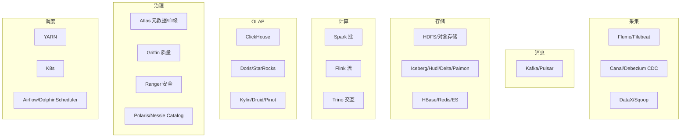
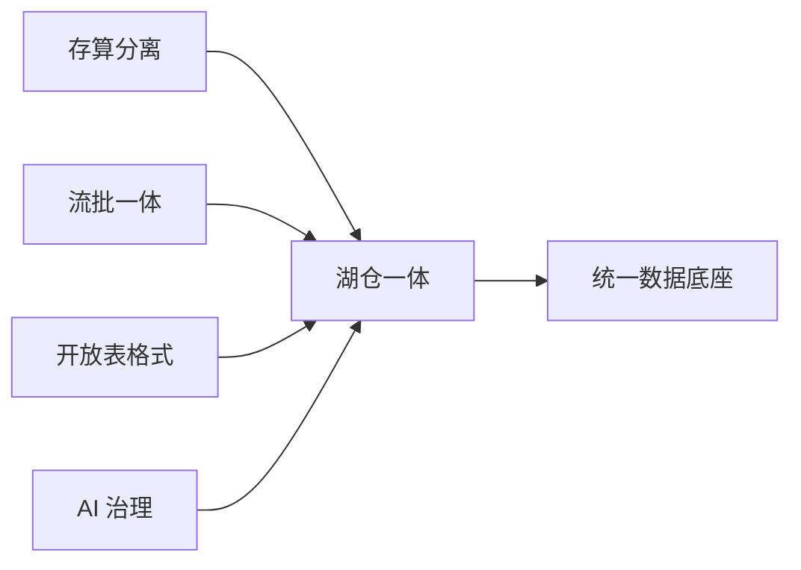
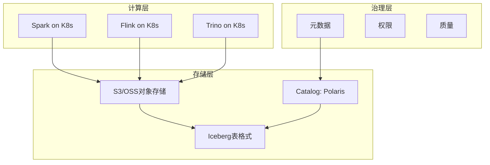
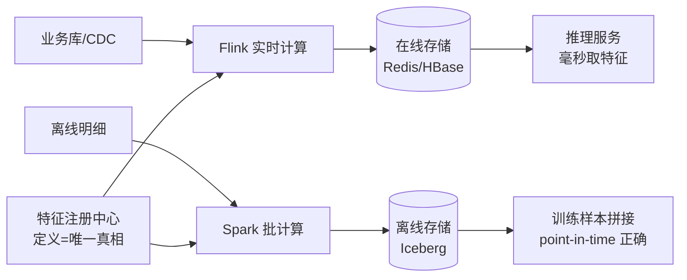
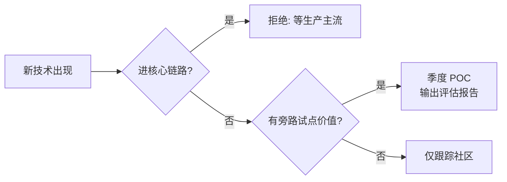

# 大数据 · 13 新技术趋势与生态全景（六大趋势 / 生态地图 / 选型原则 / 学习路径 / AI 融合）

> 大数据技术正在经历"云原生化、湖仓一体、流批一体、AI 化"的四重收敛。看懂趋势，才不至于在选型时被旧范式拖累。本篇梳理 2025–2026 的关键趋势与完整生态地图，并给出学习路径。前 12 篇是"现在怎么用"，本篇是"未来往哪走"。

---

## 一、六大技术趋势

### 1.1 存算分离 + 云原生（已成基线）

```
存储用对象存储（S3/OSS），计算弹性（Spark/Flink on K8s），靠缓存补网络 IO
价值：成本 ↓（按量付费）、弹性 ↑（秒级扩缩）、运维 ↓
代表：Snowflake、Databricks、StarRocks 存算分离、Iceberg on S3
```

### 1.2 湖仓一体（Lakehouse）成主流

```
开放表格式（Iceberg 为主，Paimon 流式崛起）+ Catalog（Polaris/Nessie）统一元数据
消除"湖仓双写"，一份数据服务 BI + ML + 科学计算
DuckLake（2025）用关系库存元数据，简化一致性，代表"元数据简化"第三波
```

### 1.3 流批一体（Unified）

```
同一 API/引擎处理有界与无界；Flink、Spark Structured Streaming、Paimon 表同时承流承批
替代 Lambda 双链路，口径一致、运维减半
```

### 1.4 向量化执行 + 查询加速

```
所有现代 OLAP（ClickHouse/Doris/StarRocks）标配向量化（SIMD）+ CBO 优化器
性能从"秒"到"亚秒/毫秒"，TPC-DS/SSB 持续刷新
```

### 1.5 AI 深度融合

```
Data Agent（2025）：智能治理、自动盘点、优化建议
LLM + 数据：自然语言转 SQL、数据问答、向量检索（RAG 知识库）
ML 内建：特征存储、训练样本、在线推理与数仓融合
```

### 1.6 Serverless 与 DataOps

```
Serverless 数仓（BigQuery/Redshift/Snowflake）：按需付费、免运维
DataOps：开发治理一体化、CI/CD for 数据、可观测性（如网易 EasyData）
```

---

## 二、技术演进逻辑（为什么收敛）

```
大数据演进三波（架构观）：
  第一波：Hadoop 全家桶（HDFS+MR+Hive）——存算耦合
  第二波：Spark + 实时化（Lambda/Kappa）——内存/流式
  第三波：湖仓一体 + 流批一体 + 云原生——开放/解耦

收敛方向：
  存储：对象存储 + 开放表格式（Iceberg/Paimon）
  计算：Flink（流）+ Spark（批）同一逻辑
  元数据：Catalog 统一（Polaris/Nessie）
  治理：AI × Metadata 自治
  部署：K8s + 存算分离 + Serverless
```

---

## 三、开源生态全景地图



---

## 四、主流商业/云产品速览

| 类别 | 代表 |
|------|------|
| 云数仓 | Snowflake、BigQuery、Redshift、Databricks |
| 湖仓/治理平台（国产） | 阿里 Dataphin、腾讯 WeData、华为 DataArts、字节 Dataleap、网易 EasyData、SelectDB(Doris)、StarRocks |
| 开源 OLAP | ClickHouse、Doris、StarRocks、DuckDB |
| 流式 | Flink、Kafka、Pulsar |
| 数据集成 | DataX、Flink CDC、Airbyte、SeaTunnel |

---

## 五、常见误区与选型原则

### 5.1 五大坑

```
⚠️ 1. 为建平台而建平台：先有业务目标（增长/风控/效率），再选技术。
⚠️ 2. 盲目追新：Paimon/Iceberg 虽好，但要看团队引擎组合与实时性需求。
⚠️ 3. Lambda 负债：新项目别上双链路，直接用流批一体/湖仓一体。
⚠️ 4. 治理后置：安全/质量/口径从第一天就内建，事后补课成本 10×。
⚠️ 5. 忽视成本：存算分离 + 生命周期（冷热分层）+ 小文件治理，避免对象存储账单爆炸。
```

### 5.2 选型原则

```
通用互操作 + 多云 → Iceberg；Flink 实时 upsert → Paimon
单表极致分析 → ClickHouse；复杂高并发 BI → StarRocks；轻量 → Doris
新集群 → K8s 化 + 存算分离 + 统一 Catalog
中小团队 → 云数仓（Snowflake/BigQuery/Databricks）省运维
大体量/合规 → 自建湖仓
```

---

## 六、Data Mesh（数据网格）

```
思想：把"单体数据平台"拆为领域自治的数据产品，按产品思维 + 联邦治理组织
四大原则：
  ① 领域所有权（Domain Ownership）
  ② 数据即产品（Data as a Product）
  ③ 自助平台（Platform Self-Serve）
  ④ 联邦计算治理（Federated Governance）

与湖仓关系：
  湖仓一体提供共享存储底座
  Data Mesh 解决组织/ownership 问题
  二者互补不冲突
```

---

## 七、AI 赋能数据治理（深入）

| 场景 | AI 做法 |
|------|---------|
| 资产盘点 | LLM 自动识别表/字段业务含义、打标签 |
| 质量 | 异常检测模型预测数据漂移、自动建规则 |
| 血缘 | 大模型解析 SQL/代码补全隐性血缘 |
| NL2SQL | 自然语言转查询，降低用数门槛 |
| Data Agent | 自主巡检、给优化建议、自动派单 |

```
趋势：治理从"人工规则"走向"AI × Metadata 自治"
  人力下降、覆盖上升
  治理—使用—反馈—优化正循环
```

---

## 八、实时数仓新势力

```
Paimon + Flink：流式湖仓标杆，同表承流承批，亚秒写+点查
StarRocks / Doris 存算分离：外表直查 Iceberg/Hudi，实时+高并发一站
实时 OLAP 新秀：ClickHouse 物化视图链、Doris 倒排索引、StarRocks 主键模型
Lakehouse 实时化：Iceberg 增量化（CDC 流读）、Delta 2.0 改进流式
```

---

## 九、技术收敛与选型再思考



```
收敛方向：
  开放表格式（Iceberg/Paimon）+ 对象存储 + 流批引擎 + 统一 Catalog + AI 治理
  = 现代数据底座

自托管 vs 云：
  中小团队优先云数仓省运维
  大体量/合规选自建湖仓
```

---

## 十、学习路径（从入门到体系）

```mermaid
flowchart TD
    L0[基础: Linux/SQL/Java/Scala/Python] --> L1[存储: HDFS/对象存储 + Parquet/Iceberg]
    L1 --> L2[计算: Spark(批) + Flink(流)]
    L2 --> L3[管道: Kafka + CDC + DataX]
    L3 --> L4[数仓: 分层建模 + OLAP(Doris/StarRocks)]
    L4 --> L5[湖仓: 实时数仓 + 流批一体]
    L5 --> L6[治理: 元数据/质量/安全/指标]
    L6 --> L7[趋势: 云原生/Serverless/Data Agent]
```

---

## 十一、本板块内容地图

| 篇 | 主题 |
|----|------|
| [01](01-概述与业务体系.md) | 概念4V、业务价值、数据中台 |
| [02](02-技术体系与架构演进.md) | 技术栈地图、Lambda/Kappa、湖仓一体 |
| [03](03-数据采集与同步.md) | Flume/Sqoop/DataX/Canal/Debezium/Kafka |
| [04](04-分布式存储与HDFS.md) | HDFS、对象存储、Kudu |
| [05](05-列式存储与数据湖格式.md) | Parquet/ORC、Iceberg/Hudi/Delta/Paimon/DuckLake |
| [06](06-分布式NoSQL与HBase.md) | HBase/LSM/RowKey、NoSQL 对比 |
| [07](07-批处理计算：MapReduce与Spark.md) | MapReduce/Spark RDD/DAG/Hive |
| [08](08-流处理计算：Flink.md) | Flink 架构/窗口/水印/Checkpoint |
| [09](09-数据仓库与OLAP引擎.md) | 维度建模、分层、ClickHouse/Doris/StarRocks |
| [10](10-资源调度：YARN与Kubernetes.md) | YARN/K8s/调度器/编排 |
| [11](11-实时数仓与湖仓一体.md) | 实时数仓、湖仓一体、流批一体 |
| [12](12-数据治理与数据质量.md) | 元数据/血缘、质量、主数据、安全、指标 |
| [13](13-新技术趋势与生态全景.md) | 云原生/湖仓/AI/Serverless 趋势与生态 |

---

## 十二、趋势观察 Checklist

- [ ] 新平台默认存算分离 + 湖仓一体，别回到 HDFS 耦合。
- [ ] 表格式按引擎组合选（Iceberg 通用 / Paimon 流式）。
- [ ] 用 Catalog 统一元数据，打通多引擎。
- [ ] 治理与 Data Agent 内建，降低长期人力。
- [ ] 关注成本（生命周期、冷热、小文件）。
- [ ] 架构默认湖仓一体 + 流批一体 + 存算分离。
- [ ] 关注 Data Mesh 的组织落地（领域 ownership）。
- [ ] OLAP 选向量化引擎（StarRocks/ClickHouse/DuckDB）。
- [ ] 引入 AI 治理（NL2SQL、Data Agent、智能质量）。
- [ ] 实时用 Paimon/Flink、外表直查湖表。
- [ ] 跟踪 Iceberg REST Catalog、Flink 2.x、DuckLake 演进。

---

## AI/ML 基础设施

### MLflow

```
定位：开源ML生命周期管理平台

核心组件：
  MLflow Tracking：实验记录（参数/指标/模型）
  MLflow Projects：可复现的ML项目打包
  MLflow Models：模型部署（多种推理格式）
  Model Registry：模型版本管理

与大数据集成：
  Spark MLlib训练 → MLflow记录
  模型部署到K8s/云函数
  批量推理写入数据湖
```

### Kubeflow

```
定位：K8s原生ML平台

核心组件：
  Pipelines：ML工作流编排（DAG）
  Training：分布式训练（TF/PyTorch）
  Serving：模型在线服务（TF Serving/Triton）
  Notebooks：JupyterLab环境

适用：大规模分布式训练、多团队协作
```

### Ray

```
定位：分布式计算框架（AI专用）

核心能力：
  Ray Core：Python分布式原语
  Ray Train：分布式训练
  Ray Serve：模型在线服务
  Ray Data：分布式数据处理

与Spark对比：
  Spark：大数据ETL/批处理
  Ray：ML训练/推理/强化学习
  趋势：Ray + Spark融合（RayDP）
```

### 实时特征存储

```
特征存储（Feature Store）：
  离线特征：批量计算（Spark）→ 存储（Hive/Iceberg）
  在线特征：实时计算（Flink）→ 存储（Redis/DynamoDB）
  统一：离线+在线特征一致（避免训练/推理偏差）

工具：
  Feast：开源特征存储
  Tecton：商业特征平台
  Hopsworks：开源ML平台

架构：
  特征注册 → 特征计算（批/流）→ 特征存储（离线+在线）
  训练时：离线特征存储 → 训练数据集
  推理时：在线特征存储 → 实时特征 → 模型推理
```

### 向量数据库在生产中

| 数据库 | 特点 | 适用 |
|--------|------|------|
| Milvus | 开源、高性能、分布式 | 大规模向量检索 |
| Pinecone | 全托管、易用 | 快速上线 |
| Weaviate | 开源、多模态 | 多模态检索 |
| Qdrant | 开源、Rust实现 | 高性能 |
| Pgvector | PostgreSQL扩展 | 轻量级 |

```
生产场景：
  RAG知识库：文档向量化 → 检索增强生成
  推荐系统：用户/物品向量 → 相似度匹配
  图像检索：图像特征 → 以图搜图
  语义搜索：文本向量 → 语义相似度

架构考虑：
  写入：批量向量化（Embedding模型）→ 写入向量库
  查询：实时向量 → TopK相似度 → 业务系统
  索引：HNSW/IVF/Flat（精度vs速度权衡）
  混合检索：向量+关键词+过滤条件
```

## Data Mesh 数据网格

```
四大原则详解：
  ① 领域所有权（Domain Ownership）
    业务域团队负责自己的数据产品
    数据所有权归业务，而非数据团队

  ② 数据即产品（Data as a Product）
    数据必须可发现、可理解、可信赖
    有SLA、有文档、有质量保证

  ③ 自助平台（Platform Self-Serve）
    数据平台提供自助工具
    领域团队无需依赖平台团队

  ④ 联邦计算治理（Federated Governance）
    全局标准由联邦治理委员会制定
    领域团队在标准内自治

实施挑战：
  文化转型：从"集中数据团队"到"领域自治"
  平台能力：需要强大的自助平台支撑
  标准一致性：联邦治理如何保证全局一致
```

## 数据产品（Data Products）

```
数据产品 = 面向特定场景的数据能力封装

产品设计：
  输入：原始数据/特征/指标
  输出：API/报表/模型/标签
  SLA：可用性、延迟、质量
  Owner：业务+数据双负责人

产品化层次：
  L1：原始数据表（ODS/DWD）
  L2：主题宽表/指标（DWS/ADS）
  L3：数据服务（API/推送）
  L4：数据应用（推荐/风控/看板）

产品度量：
  使用量：调用次数、使用人数
  质量：合格率、SLA达标率
  价值：业务收益、ROI
  反馈：用户评分、需求频率
```

## 数据可观测性（Data Observability）

| 维度 | 监控内容 | 工具 |
|------|---------|------|
| 数据新鲜度 | 数据是否按时到达 | Monte Carlo |
| 数据质量 | 质量规则检查 | Elementary |
| 数据血缘 | 依赖链路变更 | DataHub |
| 数据异常 | 统计分布异常 | Monte Carlo |
| 资源使用 | 存储/计算成本 | 云监控 |

```
Monte Carlo：
  自动异常检测（统计分布+ML）
  数据质量监控（规则+智能检测）
  血缘可视化+影响分析
  端到端数据管道监控

Elementary：
  dbt原生数据可观测性
  基于dbt日志和模型
  轻量级、与dbt生态集成
```

## 现代数据栈（Modern Data Stack）

```
核心组件：
  数据集成：Fivetran / Airbyte / Stitch
  转换：dbt（Data Build Tool）
  存储：Snowflake / BigQuery / Redshift
  BI：Looker / Tableau / Metabase
  调度：Airflow / Dagster / Prefect

dbt详解：
  定义：SQL-based数据转换工具
  核心：SQL模型 + Jinja模板 + 文档生成
  测试：内建数据测试（唯一性/非空/引用）
  文档：自动生成数据字典
  版本：Git版本管理

Airbyte：
  定位：开源数据集成（ELT）
  特点：300+连接器、增量同步
  与Fivetran对比：开源vs全托管

选型建议：
  中小团队：Fivetran + dbt + Snowflake
  大团队：Airbyte + dbt + 自建湖仓
  国内：DataX/SeaTunnel + 自建
```

## 数据平台成本优化

```
成本构成：
  存储：30%~50%（对象存储/HDFS）
  计算：30%~40%（Spark/Flink/OLAP）
  网络：10%~15%（跨AZ传输）
  人力：10%~20%（开发运维）

优化策略：
  存储：冷热分层（Hot/Warm/Cold/Archive）
  计算：弹性伸缩 + Spot实例 + 错峰调度
  架构：湖仓一体（一份数据多引擎）
  治理：僵尸表清理 + 低效任务治理

量化方法：
  每TB存储成本
  每TB计算成本
  单查询成本
  空闲资源率
```

## 云原生数据架构



```
云原生特征：
  存算分离：对象存储+弹性计算
  容器化：K8s调度所有计算引擎
  Serverless：按查询/秒计费
  托管服务：云厂商运维基础设施

优势：
  弹性：秒级扩缩，按需付费
  免运维：托管服务降低运维成本
  多云：避免厂商锁定（开放格式）

挑战：
  网络延迟：存算分离引入网络IO
  成本监控：按量付费需精细监控
  技术栈：新范式需团队技能升级
```

---

## AI4Data 与 Data4AI 双向赋能

| 方向 | 含义 | 典型场景 |
|------|------|---------|
| AI4Data（AI 赋能数据平台） | 用 AI 降低数据工程/治理人力 | NL2SQL、自动打标签、智能质量检测、Data Agent 巡检 |
| Data4AI（数据支撑 AI） | 数据平台成为 AI 训练/推理的供给方 | 特征管道、训练样本管理、RAG 知识库、向量检索 |

```text
双向飞轮：
  Data4AI：湖仓 → 特征/样本 → 模型训练 → 推理服务
  AI4Data：模型反哺平台 → 自动分类分级 / 血缘补全 / SQL 优化建议
  → 平台越智能，数据供给越快；数据越规整，AI 能力越强
```

落地优先级建议：
- [ ] 先做 Data4AI 的「样本管道」（价值最直接，业务感知强）
- [ ] 再做 AI4Data 的「NL2SQL + 语义层约束」（防幻觉是成败关键）
- [ ] 最后引入 Data Agent 自治巡检（需要前两者积累元数据底座）

## Paimon / Hudi / Iceberg 流式湖格式对比

| 维度 | Apache Paimon | Apache Hudi (0.14+) | Apache Iceberg |
|------|---------------|---------------------|----------------|
| 设计初心 | 流式湖仓（Flink 原生） | 增量 upsert（CDC 场景起家） | 通用开放表格式 |
| 主键表更新 | LSM 结构，亚秒~秒级可见 | MOR 合并，分钟级 | v2 merge-on-read，秒级（弱） |
| Flink 集成 | **最深**（官方一等公民） | 好 | 好 |
| Spark/Trino 支持 | 好（读强写次之） | 强（Spark 原生） | **最强（全引擎事实标准）** |
| 流读能力 | 原生 changelog 流 | incremental query | 有限 |
| 小文件治理 | 自动 compaction | clustering/cleaner | rewrite data/manifest |
| 典型组合 | Flink+Paimon+StarRocks | Spark CDC 归档 | 多引擎混合分析 |

选型口诀：**Flink 实时链路选 Paimon，多引擎中立选 Iceberg，Spark 系 CDC 重更新看 Hudi**；三者可共存于同一 Catalog，按负载分表选用而非全站二选一。

```sql
-- Paimon 主键表：流式写入 + 批式查询同表完成
CREATE TABLE dwd_order_rt (
    order_id BIGINT,
    user_id BIGINT,
    pay_amount DECIMAL(18,2),
    PRIMARY KEY (order_id) NOT ENFORCED
) PARTITIONED BY (dt) WITH (
    'changelog-producer' = 'input',       -- 下游可流读变更
    'compaction.min.file-num' = '5'
);
```

## 实时特征平台架构（Feast / 自研）



| 能力 | Feast 开源 | 自研要点 |
|------|-----------|---------|
| 特征定义 | YAML/Python 声明 Entity/FeatureView | 注册中心必须唯一，禁止双份定义 |
| 在线取数 | Redis/DynamoDB provider | P99 <10ms；本地缓存二级加速 |
| 离线拼接 | get_historical_features | **point-in-time join 防 label 泄漏** |
| 一致性 | 同一定义双端物化 | 离线在线口径 diff 监控（漂移告警） |

自研 vs 开源判断：特征数 <200 且团队 <5 人直接用 Feast；超过后通常因「在线性能定制 + 样本回填」需求走向自研内核 + 兼容 Feast API。

## Open Table Format 生态工具链（引擎兼容矩阵）

| 能力 \ 格式 | Iceberg | Hudi | Delta Lake | Paimon |
|------------|:---:|:---:|:---:|:---:|
| Spark 读写 | ✅ 官方 | ✅ 最强 | ✅ 原生 | ✅ |
| Flink 读写 | ✅ 官方 | ✅ | ⭕ 社区 | ✅ 最强 |
| Trino/Presto 读 | ✅ 成熟 | ✅ | ✅（需 Delta Kernel） | ✅ |
| Doris/StarRocks 外表 | ✅ | ✅ | ✅ | ✅ |
| Hive 读写 | ✅ | ✅ | ⭕ 弱 | ⭕ |
| REST Catalog | ✅ Polaris/Nessie/Gravitino | ⭕ | ✅ Unity | ⭕ 发展中 |
| 时间旅行/快照回滚 | ✅ | ✅ | ✅ | ✅ |

```text
兼容矩阵使用姿势：
① 新平台默认 Iceberg（REST Catalog + 全引擎读）打底
② 实时主键链路叠加 Paimon 表，通过 Catalog 统一纳管
③ 引擎升级前先查目标版本的 format-version 支持下限
   （如 Iceberg v2 行级删除要求较新引擎版本）
④ 多格式并存时用统一查询层（Trino/StarRocks）屏蔽差异，
   避免 BI 直连某种格式造成锁定
```

趋势观察：REST Catalog（Polaris/Nessie/Gravitino）正在成为跨引擎元数据的「USB-C 接口」，谁绑定它谁的迁移成本最低；format-version 演进速度 > 引擎跟进速度，升级窗口要预留一个季度验证期。

## 数据平台向 AI 平台演进的架构图

```mermaid
flowchart TB
    subgraph 数据底座
    OBJ[(对象存储)] --> OF[开放表格式\nIceberg/Paimon]
    CAT[统一Catalog] --> OF
    end
    subgraph 数据平面
    ETL[批流计算\nSpark/Flink] --> GOV[治理平面\n质量/血缘/安全]
    GOV --> SEM[语义层/指标服务]
    end
    subgraph AI 平面
    FE[特征平台\n在线+离线一致] --> TR[训练平台\nRay/Kubeflow]
    SEM --> RAG[RAG 知识库\n向量库+权限过滤]
    OF --> VEC[Embedding 管道\n批量向量化]
    TR --> SVD[模型服务\n在线推理]
    AGENT[Data Agent\n自治治理] -.读取.-> GOV
    AGENT -.执行.-> ETL
    end
    数据底座 --> 数据平面 --> AI 平面
```

演进要点：
- **底座复用**：AI 平台不需要新存储——湖仓就是训练样本源与 Embedding 落地；
- **治理前置到 AI**：RAG 权限过滤、训练数据脱敏必须继承数据平面的分级体系；
- **闭环**：Data Agent 是两平面交汇点——读治理元数据做决策，回写优化动作进管道；
- 度量从「报表时效」扩展为「样本时效」「特征一致性」「模型迭代周期」三指标。

## 趋势成熟度雷达（2026 视角）

| 技术 | 成熟度 | 建议动作 |
|------|--------|---------|
| Iceberg + REST Catalog | 生产主流 | 默认采用 |
| Paimon 流式湖仓 | 快速成熟 | 实时链路采用 |
| 存算分离 OLAP（StarRocks/Doris） | 生产主流 | 默认采用 |
| DuckDB/DuckLake | 单机成熟 | 分析师本地/嵌入式场景采用 |
| Feast 类特征平台 | 中 | 按需，重自研 |
| Fluss 日志湖一体 | 早期 | 技术跟踪，非核心链路试点 |
| Data Agent 自治治理 | 早期 | 辅助场景试点（盘点/巡检） |
| 向量化执行新引擎迭代 | 持续演进 | 跟随版本升级即可 |

```text
追新纪律：
① 核心链路只用「生产主流」档技术
② 「快速成熟」档允许在旁路业务试点一个季度
③ 「早期」档只做 POC 与社区跟踪，不进 SLA 承诺
④ 每半年重评一次雷达位置，防止标签过期
```



---

## 十三、与其他板块的关系

- 存储见「[04-分布式存储与HDFS](04-分布式存储与HDFS.md)」；
- 计算见「[07-批处理计算：MapReduce与Spark](07-批处理计算：MapReduce与Spark.md)」「[08-流处理计算：Flink](08-流处理计算：Flink.md)」；
- 湖仓见「[11-实时数仓与湖仓一体](11-实时数仓与湖仓一体.md)」；
- 治理见「[12-数据治理与数据质量](12-数据治理与数据质量.md)」；
- 架构演进见「[02-技术体系与架构演进](02-技术体系与架构演进.md)」。

> 一句话：**2025-2026 大数据 = 存算分离（对象存储）+ 湖仓一体（Iceberg/Paimon + Catalog）+ 流批一体（Flink/Spark 同 API）+ AI 治理（Data Agent）四大收敛——选型原则：先业务目标、后技术；通用选 Iceberg、流式选 Paimon；新集群 K8s 化，治理/安全第一天内建**。