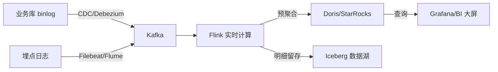
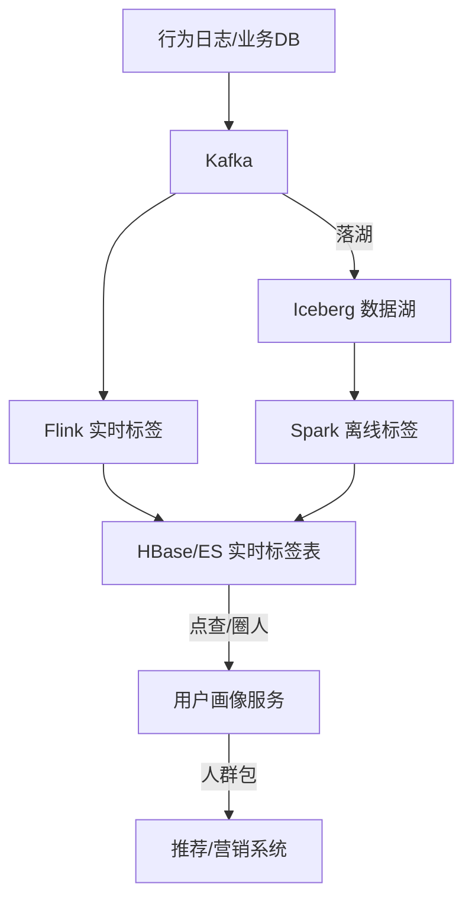
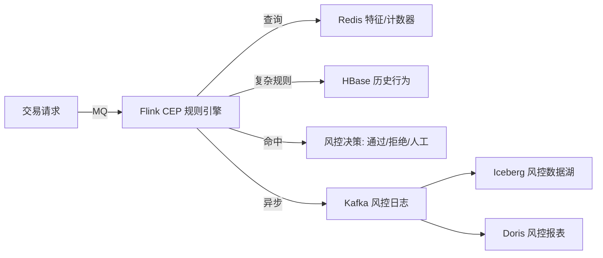
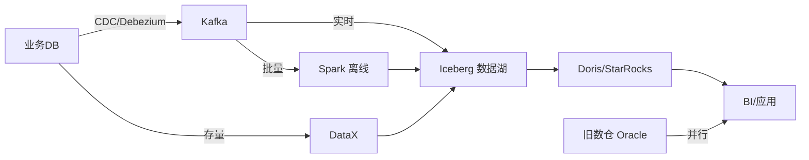
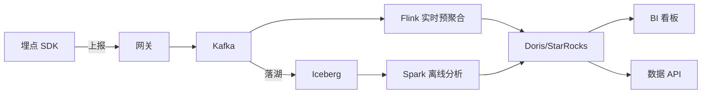
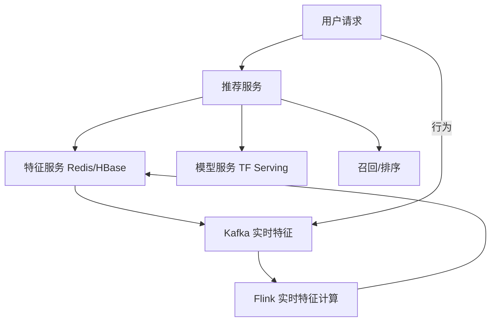
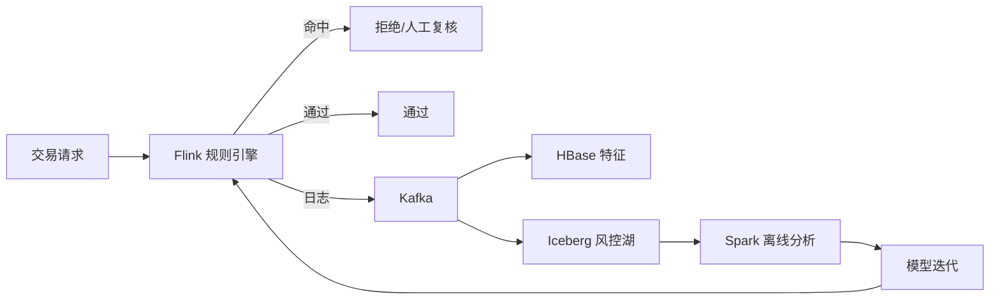
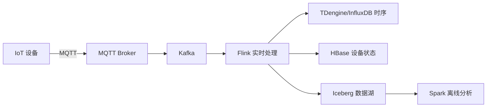
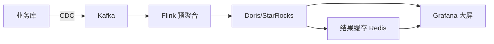

# 大数据场景设计实战

## 〇、本体介绍

**大数据场景设计**：把大数据技术栈落到**真实业务场景**——实时大屏、用户画像、实时风控、数据中台、数仓迁移。每个场景都是**技术选型 + 架构设计 + 权衡取舍**的综合体。

**核心矛盾**：
1. 场景差异大：离线报表要准确、实时风控要快、用户画像要全；
2. 同一技术栈（Flink/Iceberg/Doris）在不同场景的**架构组合与调优策略**完全不同；
3. 从 0 到 1 搭建一条生产级数据链路，要同时打通采集、存储、计算、服务四层；
4. 面试高频：大数据场景题是后端/数据工程师的必考点。

**核心主线**：实时大屏 → 用户画像 → 实时风控 → 数据中台建设 → 数仓迁移与架构演进。

---

## 一、场景一：实时大屏 / 实时报表

### 1.1 需求与约束

| 维度 | 典型值 | 设计影响 |
|------|--------|----------|
| 数据源 | 业务库 binlog + 埋点日志 + 消息 | CDC + Kafka 统一入湖 |
| 延迟要求 | 秒级（大屏刷新 1~5s） | 必须流计算，禁 T+1 |
| 查询 QPS | 高（万人同时看大屏） | 结果预计算，禁原始明细查询 |
| 数据准确性 | 允许秒级近似，禁超发 | 最终一致 + 对账 |

### 1.2 架构设计



1. **采集**：binlog → Debezium → Kafka；埋点 → Filebeat → Kafka；统一 Kafka 中枢。
2. **计算**：Flink 消费 Kafka，按**窗口预聚合**（1min/5min/1h），结果写入 OLAP。
3. **存储**：明细落 Iceberg（数据湖，供回溯/对账）；聚合结果写 Doris/StarRocks（OLAP，供查询）。
4. **服务**：BI 工具（Grafana/Superset）直连 OLAP，禁查原始明细。

> 口诀：**"明细入湖做预聚合，结果落 OLAP 供查询；大屏看聚合不对账，对账走湖做回溯。"**

### 1.3 关键技术点

| 技术点 | 做法 |
|--------|------|
| 窗口聚合 | Flink TUMBLE/HOP 窗口，按 event time + watermark |
| 维表打宽 | Flink 时态 join（`FOR SYSTEM_TIME AS OF`）关联 MySQL 维表 |
| 结果更新 | Doris 用 Unique Key 模型（upsert），同 key 覆盖 |
| 对账 | 实时结果 vs 离线 T+1 全量结果，差异告警 |

### 1.4 与「Flink」「OLAP」「实时数仓」的关系

- Flink 是流计算引擎（见「[08](08-流处理计算：Flink.md)」）；
- Doris/StarRocks 是 OLAP 引擎（见「[09](09-数据仓库与OLAP引擎.md)」）；
- 实时数仓是更完整的链路（见「[11](11-实时数仓与湖仓一体.md)」）。

---

## 二、场景二：用户画像 / 标签体系

### 2.1 需求与约束

| 维度 | 典型值 | 设计影响 |
|------|--------|----------|
| 标签类型 | 事实标签（年龄/城市）、统计标签（近30天GMV）、规则标签（是否高价值） | 离线批 + 实时流双写 |
| 更新频率 | 事实标签 T+1、行为标签分钟级 | Lambda 架构（批+流） |
| 存储规模 | 亿级用户 × 千级标签 = 万亿级 KV | 宽表 NoSQL（HBase/ES） |
| 查询模式 | 点查（单用户标签）、圈人（条件组合） | HBase RowKey + ES 倒排 |

### 2.2 架构设计



1. **实时标签**：Flink 消费 Kafka，计算近 N 分钟行为（如"最近1小时浏览商品数"），写入 HBase/ES。
2. **离线标签**：Spark 每日跑 T+1 全量（如"近30天GMV"、"生命周期阶段"），覆盖写入 HBase/ES。
3. **存储**：HBase RowKey = `userId`（点查），ES 倒排 = 标签组合（圈人）。
4. **服务**：用户画像 API（查单用户标签）、圈人引擎（按标签组合导出人群包）。

> 口诀：**"实时算近因，离线算长期；HBase 做点查，ES 做圈人；批流双写同一张表，口径靠离线校准。"**

### 2.3 Lambda 架构在画像中的落地

| 层 | 引擎 | 职责 |
|----|------|------|
| **速度层** | Flink | 近实时标签（分钟级），写入 HBase/ES |
| **批层** | Spark/Hive | T+1 全量标签，覆盖写入 HBase/ES |
| **服务层** | HBase + ES | 查询时合并（速度层增量 + 批层全量） |

- **关键设计**：速度层和批层写**同一张表**，查询时自然合并；批层全量定期校准速度层增量。
- **RowKey 设计**：HBase 用 `userId`（前缀散列防热点），ES 用 `userId` + 标签字段倒排。

### 2.4 标签类型与计算方式

| 标签类型 | 计算方式 | 更新频率 | 存储 |
|----------|----------|----------|------|
| 事实标签 | 直接读取用户属性 | T+1 | MySQL 维表 |
| 统计标签 | Flink/Spark 聚合 | 实时/T+1 | HBase |
| 规则标签 | 规则引擎判断 | T+1 | HBase/ES |
| 预测标签 | 模型推理（ML） | 离线批量 | HBase |

---

## 三、场景三：实时风控

### 3.1 需求与约束

| 维度 | 典型值 | 设计影响 |
|------|--------|----------|
| 延迟要求 | 毫秒~秒级（交易风控 <100ms） | 流计算 + 内存规则引擎 |
| 数据源 | 交易流 + 设备指纹 + 历史行为 | 多流 join + 维表关联 |
| 规则复杂度 | 简单阈值 → 复杂 CEP（如"1h内3地登录"） | Flink CEP / 规则引擎 |
| 准确性 | 误杀率低（宁可漏过不可误杀） | 规则分层 + 人工复核 |

### 3.2 架构设计



1. **规则引擎**：Flink CEP（Complex Event Processing）匹配复杂模式——如"同一用户 1 小时内 3 个不同城市下单"。
2. **特征存储**：Redis 存滑动窗口计数器（如"近1小时订单数"），Flink 状态后端（RocksDB）存长窗口特征。
3. **决策分层**：

| 层级 | 延迟 | 规则类型 | 处置 |
|------|------|----------|------|
| L1 实时 | <100ms | 简单阈值、黑白名单 | 直接通过/拒绝 |
| L2 近实时 | 秒级 | CEP 复杂模式 | 拒绝或人工复核 |
| L3 离线 | T+1 | 模型评分、关联分析 | 事后处置、规则迭代 |

4. **事后分析**：风控日志落 Iceberg（数据湖），Spark 离线分析误杀率、迭代规则。

> 口诀：**"CEP 配复杂模式，Redis 滑窗记特征；实时近实时离线三层，误杀漏杀平衡靠迭代。"**

### 3.3 Flink CEP 示例

```java
// 模式：同一用户 1 小时内 3 个不同城市下单
Pattern<OrderEvent, ?> pattern = Pattern
    .<OrderEvent>begin("first")
        .where(new SimpleCondition<OrderEvent>() {
            public boolean filter(OrderEvent e) { return e.amount > 0; }
        })
    .next("second")
        .where(new IterativeCondition<OrderEvent>() {
            public boolean filter(OrderEvent e, Context<OrderEvent> ctx) {
                for (OrderEvent first : ctx.getEventsForPattern("first")) {
                    if (!e.city.equals(first.city)) return true;
                }
                return false;
            }
        })
    .next("third")
        .where(new IterativeCondition<OrderEvent>() {
            public boolean filter(OrderEvent e, Context<OrderEvent> ctx) {
                // 与 first、second 城市都不同
                return /* ... */;
            }
        })
    .within(Time.hours(1));

// 匹配到 → 触发风控告警
patternStream.select(new PatternSelectFunction<OrderEvent, Alert>() {
    public Alert select(Map<String, List<OrderEvent>> pattern) {
        return new Alert("3-city-1h", pattern.get("first").get(0).userId);
    }
});
```

---

## 四、场景四：数据中台建设

### 4.1 需求与约束

| 维度 | 典型值 | 设计影响 |
|------|--------|----------|
| 数据源 | 多业务系统（订单/商品/用户/物流） | 统一采集 + 数据湖入仓 |
| 服务对象 | 多个业务线（BI/推荐/营销/风控） | 统一指标口径 + 数据服务层 |
| 数据质量 | 跨系统口径不一致 | 指标标准化 + 数据治理 |
| 组织协同 | 数据团队 vs 业务团队 | 数据资产目录 + 数据产品经理 |

### 4.2 分层架构

```mermaid
graph TB
    subgraph 数据源层
        S1[业务DB] S2[日志] S3[第三方API]
    end
    subgraph 采集层
        CDC[CDC/DataX] K[Kafka]
    end
    subgraph 存储计算层
        I[Iceberg 数据湖] DWD[DWD 明细层] DWS[DWS 汇总层] ADS[ADS 应用层]
    end
    subgraph 服务层
        API[数据API] META[元数据/数据地图] MON[数据质量监控]
    end
    subgraph 消费层
        BI[BI报表] REC[推荐] MKT[营销] RISK[风控]
    end

    S1 --> CDC --> K --> I
    S2 --> K
    S3 --> K
    I --> DWD --> DWS --> ADS
    DWS --> API
    DWD --> META
    DWD --> MON
    API --> BI
    API --> REC
    API --> MKT
    RISK --> DWD
```

### 4.3 数仓分层（ODS → DWD → DWS → ADS）

| 层 | 全称 | 内容 | 引擎 |
|----|------|------|------|
| **ODS** | Operational Data Store | 原始数据，贴源 | 数据湖（Iceberg） |
| **DWD** | Data Warehouse Detail | 清洗、标准化、维度关联 | Spark/Flink |
| **DWS** | Data Warehouse Summary | 按主题汇总（用户/商品/订单日聚合） | Spark |
| **ADS** | Application Data Service | 面向应用的宽表/指标 | Doris/StarRocks |

> 口诀：**"ODS 贴源不动，DWD 清洗明细；DWS 汇总主题，ADS 面向应用；指标口径统一管，数据资产目录清。"**

### 4.4 指标体系设计

| 指标类型 | 定义 | 例子 |
|----------|------|------|
| **原子指标** | 不可再分的最小度量 | 订单金额、支付笔数 |
| **派生指标** | 原子指标 + 修饰词 + 时间周期 | 近7天新用户GMV |
| **复合指标** | 多个指标计算 | 客单价 = GMV / 订单数 |

- **指标管理**：统一指标命名规范 + 指标口径文档 + 指标血缘（从 ADS 回溯到 ODS）。
- **口径一致性**：同一指标只在一个 DWS 层计算，ADS 层只读不重算。

---

## 五、场景五：数仓迁移与架构演进

### 5.1 典型演进路径

```mermaid
graph LR
    P1["阶段1: 传统数仓<br/>Oracle/Teradata<br/>单体 T+1"] -->|"数据量暴涨"| P2["阶段2: Hadoop 数仓<br/>Hive on HDFS<br/>T+1 批处理"]
    P2 -->|"实时需求"| P3["阶段3: Lambda 架构<br/>Hive 批 + Flink 流<br/>双链路"]
    P3 --> "|维护成本高"| P4["阶段4: 湖仓一体<br/>Iceberg/Paimon + Flink/Spark<br/>流批一体"]
    P4 --> "|云原生"| P5["阶段5: Serverless 湖仓<br/>存算分离 + 弹性计算<br/>按需付费"]
```

### 5.2 迁移场景：传统数仓 → 湖仓一体

| 阶段 | 现状 | 目标 | 迁移策略 |
|------|------|------|----------|
| **评估** | Oracle/Teradata，T+1 报表 | 实时+离线统一 | 盘点表/任务/依赖 |
| **双写** | 旧库继续服务 | 湖表并行写入 | CDC 同步 + DataX 补历史 |
| **校验** | 新旧结果对比 | 口径一致 | 对账脚本，差异<0.01% |
| **切流** | 旧库只读 | 新库承接全部查询 | 灰度切流，先报表后核心 |
| **下线** | 旧库停写 | 完全迁移 | 观察期后下线 |

### 5.3 双写迁移架构



> 口诀：**"先双写后切流，先对账后下线；CDC 同步增量，DataX 补存量；口径一致是底线，灰度切流保安全。"**

### 5.4 迁移 CheckList

- [ ] 盘点：源表清单、任务依赖、下游消费方
- [ ] 双写：CDC 实时 + DataX 存量补录
- [ ] 对账：新旧库逐笔核对，差异阈值 <0.01%
- [ ] 灰度：先切非核心报表，再切核心链路
- [ ] 回滚：旧库保留只读，新库异常可秒切回
- [ ] 下线：观察期（通常 1~3 个月）后下线旧库

---

## 六、场景六：用户行为分析架构

### 6.1 需求与约束

| 维度 | 典型值 | 设计影响 |
|------|--------|----------|
| 数据源 | 埋点日志 + 业务事件 | 统一 Kafka 中枢 |
| 分析维度 | 用户/设备/地域/行为/时间 | 多维分析，OLAP 必须 |
| 延迟要求 | 分钟级（运营看板） | 流计算预聚合 |
| 数据规模 | 日增 10 亿事件 | 分布式存储+计算 |

### 6.2 架构设计



## 七、场景七：实时推荐系统

### 7.1 架构设计



### 7.2 关键技术点

| 技术点 | 做法 |
|--------|------|
| 特征计算 | Flink 实时计算用户特征（近 N 分钟行为） |
| 特征存储 | Redis 热特征 + HBase 历史特征 |
| 模型服务 | TF Serving/Triton 模型推理 |
| 实时更新 | 用户行为 → Kafka → Flink → 特征更新 → Redis |

## 八、场景八：欺诈检测流水线

### 8.1 三层检测架构

| 层级 | 延迟 | 技术 | 说明 |
|------|------|------|------|
| L1 实时 | <100ms | 规则引擎 | 简单阈值/黑白名单 |
| L2 近实时 | 秒级 | Flink CEP | 复杂模式匹配 |
| L3 离线 | T+1 | Spark ML | 模型评分/关联分析 |

### 8.2 流水线设计



## 九、场景九：IoT 数据平台

### 9.1 IoT 数据特点

| 特点 | 影响 |
|------|------|
| 海量设备 | 每秒百万事件 |
| 时序数据 | 按时间分区 |
| 低延迟 | 设备状态秒级更新 |
| 重写轻读 | 写多读少 |

### 9.2 架构设计



## 十、场景十：实时大屏架构

### 10.1 大屏架构要点

| 要点 | 说明 |
|------|------|
| 数据延迟 | 1~5 秒刷新 |
| 查询 QPS | 万人同时看 |
| 数据准确性 | 允许秒级近似 |
| 故障降级 | OLAP 故障降级到缓存 |

### 10.2 大屏架构



## 十一、数据湖架构模式

### 11.1 典型数据湖架构

```mermaid
graph TB
    subgraph 数据源
        S1[业务 DB] S2[日志] S3[第三方]
    end
    subgraph 采集层
        CDC[CDC] K[Kafka] FB[Filebeat]
    end
    subgraph 存储层
        I[Iceberg 数据湖]
    end
    subgraph 计算层
        F[Flink 流] S[Spark 批]
    end
    subgraph 服务层
        OLAP[Doris/StarRocks] API[数据 API]
    end
    S1 --> CDC --> K
    S2 --> FB --> K
    K --> F --> I
    K --> S --> I
    I --> OLAP --> API
```

## 十二、数据平台容量规划

### 12.1 容量评估方法

| 评估维度 | 计算方式 |
|----------|----------|
| 存储量 | 日增数据量 × 保留天数 × 副本 × 压缩比 |
| 计算量 | 峰值 QPS × 单查询扫描量 |
| 网络带宽 | 峰值流量 × 消息大小 |
| Kafka 容量 | 日增消息量 × 保留天数 × 副本 |

### 12.2 容量规划示例

```
场景：日增 10 亿事件，每事件 1KB

Kafka 容量：
  10 亿 × 1KB = 1TB/天
  保留 3 天 × 3 副本 = 9TB
  压缩（5:1）= 1.8TB 实际存储

Iceberg 容量：
  1TB/天 × 30 天保留 = 30TB
  压缩（3:1）= 10TB 实际存储
  副本 2 = 20TB

Doris 容量：
  聚合后数据量 ≈ 原始数据量 × 0.1（聚合比）
  100GB/天 × 7 天 = 700GB
  副本 3 = 2.1TB
```

## 十二、多活数据中心架构

### 12.1 多活架构模式

```
多活架构演进：

  1. 单活 + 异地灾备：
     1 个主中心 + 1 个灾备中心
     灾备中心只读/不服务
     RTO：分钟级，RPO：秒~分钟级

  2. 双活：
     2 个中心都提供服务
     数据双向同步（最终一致）
     RTO：秒级，RPO：零~秒级

  3. 多活（同城双活 + 异地灾备）：
     同城 2 个机房（低延迟，强一致）
     异地 1 个灾备（高可用）
     推荐方案（如支付宝/微信）

  4. 单元化（单元多活）：
     按用户 ID 分单元（如 0-9 共 10 个单元）
     每个单元独立服务+数据
     单元内强一致，跨单元最终一致
```

### 12.2 多活数据同步方案

| 方案 | 延迟 | 一致性 | 复杂度 | 适用 |
|------|------|--------|--------|------|
| 数据库同步（DTS） | 秒级 | 最终一致 | 低 | 传统架构 |
| 消息队列同步 | 毫秒级 | 最终一致 | 中 | 事件驱动 |
| 分布式事务（2PC） | 毫秒级 | 强一致 | 高 | 金融级 |
| CRDT（无冲突复制） | 毫秒级 | 最终一致 | 高 | 高并发写 |

```
核心挑战：
  1. 数据冲突：同一记录在两个中心同时修改
     解决：CRDT / 版本向量 / 业务去重

  2. 数据路由：请求路由到正确中心
     解决：用户 ID 分片 / 就近接入

  3. 数据一致性：跨中心数据同步延迟
     解决：异步同步 + 对账 + 补偿

  4. 故障切换：中心故障时快速切换
     解决：DNS 切换 / 负载均衡 / 客户端路由
```

### 12.3 单元化架构设计

```
单元化设计要点：

  单元划分：
    按用户 ID 哈希：user_id % N → 单元 N
    按地域划分：北京用户 → 北京单元
    按业务划分：订单单元 / 用户单元

  单元内自治：
    每个单元包含完整的服务栈
    数据库 / 缓存 / 消息队列 / 搜索引擎
    单元内强一致，跨单元最终一致

  跨单元交互：
    读：走本单元（本地数据）
    写：走本单元 + 跨单元同步（异步）
    查询：走搜索引擎（跨单元聚合）

  故障处理：
    单单元故障 → 流量切换到其他单元
    数据不一致 → 对账 + 补偿
    部分失败 → 降级 + 重试
```

## 十三、IoT 大数据平台架构

### 13.1 IoT 数据链路

```
IoT 数据链路架构：

  设备层：
    传感器 → 网关 → MQTT/CoAP
    协议：MQTT（轻量）/ CoAP（受限设备）/ HTTP（简单）

  接入层：
    MQTT Broker（EMQX / Mosquitto）→ Kafka
    设备认证（TLS/Token）
    协议解析（Protobuf/JSON）

  计算层：
    实时：Flink（异常检测/实时聚合）
    批处理：Spark（历史分析/模型训练）
    边缘计算：网关预处理（过滤/聚合）

  存储层：
    时序数据：TimescaleDB / InfluxDB / IoTDB
    实时数据：Kafka / Redis
    历史数据：HDFS / 数据湖

  应用层：
    实时监控（Grafana / 自研大屏）
    异常告警（规则引擎 / ML）
    数据分析（OLAP / 报表）
    预测性维护（ML 模型）
```

### 13.2 IoT 数据存储选型

| 数据类型 | 存储方案 | 特点 |
|----------|----------|------|
| 实时指标 | Redis / InfluxDB | 毫秒级读写 |
| 时序历史 | TimescaleDB / IoTDB | 自动分区/压缩 |
| 原始日志 | Kafka → HDFS | 追加写入/批量分析 |
| 设备元数据 | MySQL / PostgreSQL | 关系型/事务 |
| 告警规则 | Redis / ES | 快速匹配 |
| 模型特征 | HBase / Redis | 低延迟读取 |

### 13.3 IoT 大数据挑战

```
核心挑战：
  1. 海量写入：百万设备 × 每秒上报 = 百万 QPS
     解决：Kafka 缓冲 + Flink 聚合 + 时序库写入

  2. 时间乱序：设备时钟不同步
     解决：服务端时间戳 + Watermark + 允许迟到

  3. 数据质量：设备故障/网络抖动导致数据异常
     解决：Flink 实时清洗 + 异常检测 + 数据修复

  4. 存储成本：原始数据量大，长期存储成本高
     解决：降采样（1s → 1min）+ 压缩 + 冷热分层

  5. 实时分析：设备维度/时间维度灵活查询
     解决：预聚合 + OLAP 引擎 + 物化视图
```

## 十四、推荐系统大数据架构

### 14.1 推荐系统数据流

```
推荐系统架构：

  数据采集：
    用户行为（点击/浏览/购买） → Kafka
    商品特征（属性/价格/库存） → Kafka/DB
    上下文（时间/地点/设备） → Kafka

  特征工程：
    实时特征：Flink → Redis（用户实时兴趣）
    离线特征：Spark → Hive/Hudi（用户画像）
    物品特征：Spark → 向量数据库（物品嵌入）

  召回层：
    向量召回：向量数据库（语义匹配）
    协同召回：Spark ALS（相似用户）
    热门召回：实时统计（全局/分群热门）
    规则召回：业务规则（新品/限时/地域）

  排序层：
    精排：Cross-Encoder / LightGBM
    重排：多样性打散 + 业务规则

  服务层：
    推荐 API（毫秒级响应）
    A/B 实验平台
    实时反馈回路（用户反馈 → 特征更新）
```

### 14.2 推荐系统存储选型

| 存储 | 用途 | 特点 |
|------|------|------|
| Redis | 实时特征/在线缓存 | 毫秒级读写 |
| 向量数据库 | 向量召回 | 近似最近邻 |
| Hive/Hudi | 离线特征/历史数据 | 批量计算 |
| MySQL | 配置/规则/AB 实验 | 事务保证 |
| ES | 全文搜索/类目筛选 | 倒排索引 |
| ClickHouse | 实时分析/指标 | 列式 OLAP |

## 十五、与其他板块的关系

- **08 流处理计算：Flink** — 实时大屏、风控的计算引擎；
- **09 数据仓库与 OLAP 引擎** — 数仓建模、OLAP 查询引擎；
- **11 实时数仓与湖仓一体** — 实时数仓完整架构；
- **12 数据治理与数据质量** — 指标体系、数据质量保障；
- **场景设计/推荐系统设计**（如果存在）— 用户画像的消费方；
- **场景设计/实时风控系统设计**（如果存在）— 风控场景的完整版；
- **SRE与稳定性工程** — 数据链路的稳定性保障；
- **分库分表与数据迁移** — 数据库层面的迁移策略。

---

## 十四、速查表

| 场景 | 核心链路 | 关键技术 |
|------|----------|----------|
| 实时大屏 | Kafka → Flink 预聚合 → Doris → BI | 窗口聚合、维表打宽、Upsert |
| 用户画像 | Kafka → Flink 实时 + Spark 离线 → HBase/ES | Lambda、RowKey、倒排索引 |
| 实时风控 | 交易流 → Flink CEP → Redis/HBase → 决策 | CEP 模式匹配、三层决策 |
| 数据中台 | 多源 → ODS → DWD → DWS → ADS → API | 数仓分层、指标体系、数据治理 |
| 数仓迁移 | CDC + DataX → 双写 → 对账 → 切流 | 双写一致性、灰度切流、回滚 |
| 用户行为 | 埋点 → Kafka → Flink → Doris → BI | 多维分析、实时预聚合 |
| 实时推荐 | 用户行为 → Kafka → Flink 特征 → 模型推理 | 特征计算、模型服务 |
| IoT 数据 | 设备 → MQTT → Kafka → Flink → 时序 DB | 海量写入、时序存储 |

---

## 面试高频问题（15+ 条）

1. **实时大屏怎么做？** Kafka 采集 → Flink 窗口预聚合 → Doris/StarRocks 存储 → BI 查询；明细落湖供对账。
2. **用户画像用什么架构？** Lambda：Flink 实时标签 + Spark 离线标签，写同一张 HBase/ES 表。
3. **HBase RowKey 怎么设计？** 前缀散列（防热点）+ 用户 ID；查询模式决定 RowKey 顺序。
4. **实时风控用什么技术？** Flink CEP 做复杂模式匹配，Redis 存滑动窗口计数器，三层决策（实时/近实时/离线）。
5. **什么是 Lambda 架构？** 批层（全量准确）+ 速度层（实时增量），查询时合并。
6. **数仓分层 ODS/DWD/DWS/ADS 各做什么？** ODS 贴源、DWD 清洗明细、DWS 汇总主题、ADS 面向应用。
7. **指标口径怎么统一？** 统一原子指标 + 命名规范 + 指标血缘，同指标只在一处计算。
8. **传统数仓怎么迁到湖仓？** CDC 双写 + DataX 存量 → 对账 → 灰度切流 → 观察期下线旧库。
9. **数据湖和数据仓库的区别？** 湖存原始多格式、灵活但治理弱；仓存结构化、治理强但灵活性差；湖仓一体兼得。
10. **Flink 和 Spark 怎么选型？** 实时用 Flink，离线批用 Spark；流批一体场景两者皆可。
11. **实时数仓和离线数仓怎么打通？** 同一份 Iceberg 数据，Flink 流写、Spark 批读，口径天然一致。
12. **数据质量怎么保障？** 元数据（Atlas 血缘）+ 质量规则（Griffin 校验）+ 监控告警 + 数据 Owner。
13. **Kafka 在大数据链路里的角色？** 统一消息中枢：承接采集、缓冲削峰、解耦上下游。
14. **湖仓一体的核心是什么？** 开放表格式（Iceberg/Paimon）+ 统一 Catalog + 多引擎共读一份数据。
15. **数据中台的核心能力？** 数据汇聚 → 数据治理 → 数据服务 → 数据应用；指标体系是中枢。
16. **数仓迁移怎么保证口径一致？** 新旧库逐笔对账 + 差异阈值控制 + 灰度切流 + 快速回滚。
