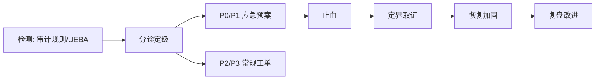
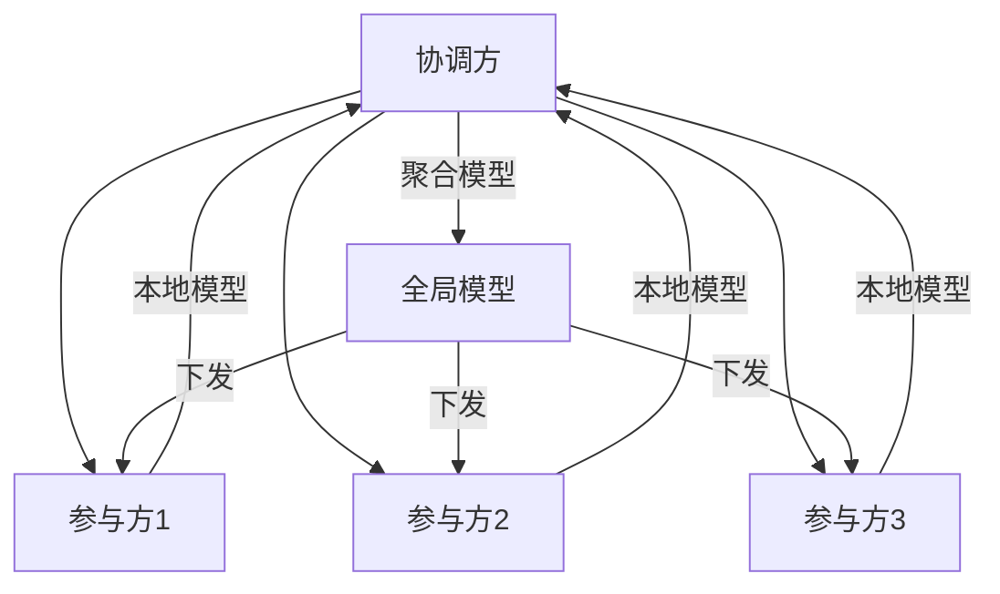
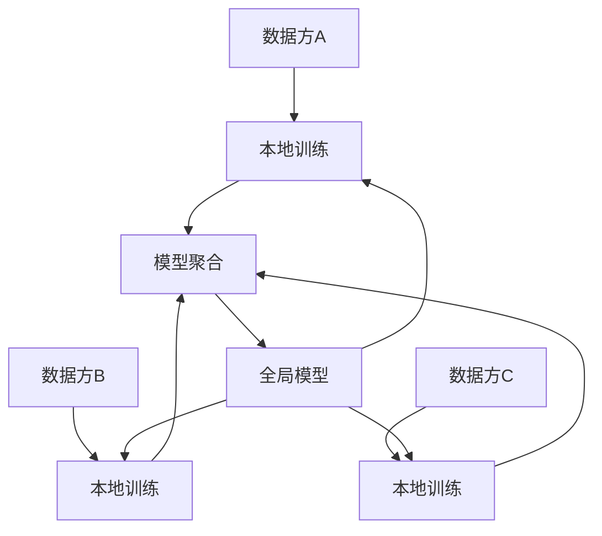
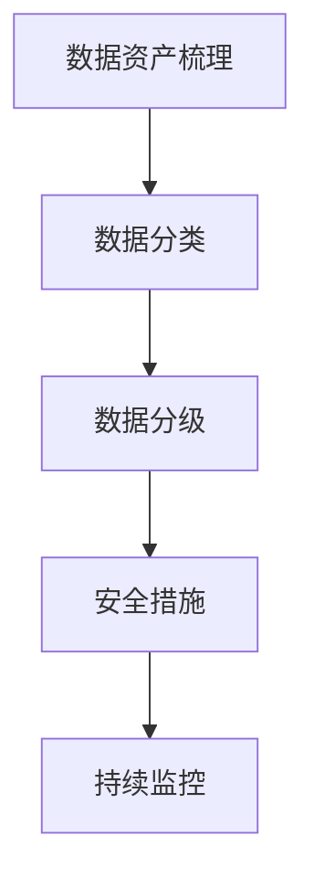
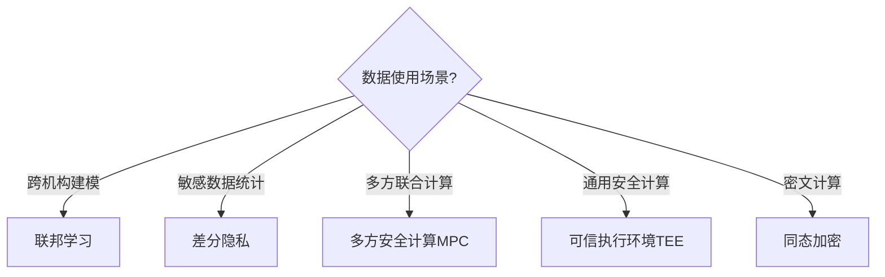

# 大数据 · 15 数据安全与隐私合规（分级分类 / 脱敏 / 加密 / 访问控制 / 合规框架 / 审计 / 大模型安全）

> 数据安全不是"加一层防火墙"，而是贯穿采集、存储、计算、服务全链路的治理能力。本文深入拆解**数据分级分类、脱敏与加密、访问控制（RBAC/ABAC/RLS）、GDPR/个保法合规、审计与水印、大模型数据安全**，并给出落地框架。

---

## 一、要解决的问题

| 痛点 | 说明 |
|------|------|
| 数据泄露 | 内部泄露是最大风险源（占 60%+） |
| 权限失控 | 越权访问、离职账号未清理 |
| 合规要求 | GDPR/个保法/行业监管强制要求 |
| 大模型风险 | Prompt 注入、训练数据泄露 |
| 责任不清 | 数据泄露无法追责到人 |

> 核心认知：**数据安全 = 分级分类（知道有什么）→ 访问控制（谁能看）→ 加密脱敏（泄露了也读不懂）→ 审计追溯（出事找得到人）**——四层防御形成闭环。

---

## 二、数据分级分类

### 2.1 分级标准

| 等级 | 定义 | 例子 | 管控 |
|------|------|------|------|
| L4 绝密 | 核心机密 | 用户全量身份证/健康档案 | 最强（加密+严格审批） |
| L3 机密 | 敏感数据 | 手机号、地址、交易明细 | 强（脱敏+权限） |
| L2 内部 | 内部使用 | 部门业绩、报表 | 中（登录即可） |
| L1 公开 | 公开信息 | 官网数据 | 低 |

### 2.2 分类方法

```
分类维度：
  数据主体（个人/企业/设备）
  敏感程度（直接标识符/准标识符/非敏感）
  业务价值（核心/一般/低价值）
  合规等级（监管强制/自主）

落地：
  自动扫描：识别库表字段敏感度（手机号/身份证/银行卡正则）
  人工确认：业务 owner 确认分类
  标签管理：元数据上打安全标签（Atlas/Ranger/DataHub）
```

### 2.3 分级联动

```
分级 → 安全策略自动匹配：
  L4 → 加密存储 + 字段级脱敏 + 严格审批 + 审计
  L3 → 加密/脱敏 + 权限控制 + 审计
  L2 → 权限控制
  L1 → 无限制
```

---

## 三、数据脱敏

### 3.1 动态脱敏 vs 静态脱敏

| 类型 | 时机 | 用途 | 例子 |
|------|------|------|------|
| 动态脱敏 | 查询时实时替换 | 生产环境按用户权限 | 普通员工查手机号→138****1234 |
| 静态脱敏 | 抽取时脱敏后落库 | 测试/开发环境 | 生产数据→脱敏库 |

### 3.2 脱敏算法

| 算法 | 说明 | 例子 |
|------|------|------|
| 掩码 | 保留部分，其余替换 | 138****1234 |
| 哈希 | 不可逆（可做关联） | SHA256(手机号) |
| 加密（可逆） | 授权可还原 | AES(手机号) |
| 替换 | 假名替代（保持格式） | 张三→李四 |
| 泛化 | 模糊化（年龄→年龄段） | 35→30-40 |

### 3.3 脱敏规则引擎

```
脱敏规则 = 字段 × 敏感级别 × 用户角色 × 场景
  如：手机号字段
    运维 → 明文（可运维）
    分析师 → 掩码（138****1234）
    测试 → 静态脱敏（随机假号）
  优先级：敏感级最高者优先，脱敏只进不出
```

---

## 四、数据加密

### 4.1 加密分层

| 层 | 说明 | 适用 |
|----|------|------|
| 传输加密 | TLS/mTLS 保护链路 | 全链路 |
| 存储加密 | 磁盘级（透明加密） | 全量兜底 |
| 库表加密 | 表/字段级 | 高敏字段 |
| 应用加密 | 业务层加密 | 超敏感 |

### 4.2 字段级加密实践

```
用 AES-256 加密高敏字段：
  DB 存储密文，应用解密后使用
  密钥放 KMS（AWS KMS/阿里云 KMS/自建 Vault）
  加密后的字段：无法直接 LIKE/聚合 → 用盲索引/哈希索引兜底

KMS 密钥轮换：定期轮换，密文重新加密
硬件：HSM 保护根密钥
```

---

## 五、访问控制

### 5.1 访问控制模型

| 模型 | 说明 | 适用 |
|------|------|------|
| RBAC（角色） | 角色绑定权限，用户绑定角色 | 通用（Apache Ranger） |
| ABAC（属性） | 按用户/资源/环境属性动态授权 | 细粒度、跨域 |
| RLS（行级安全） | 行级过滤（行级权限） | 多租户、数据隔离 |

```
Ranger 实践：
  HDFS/Hive/HBase 集中授权
  策略：user/group × resource × action（select/insert/update）
  审计：记录访问日志
```

### 5.2 最小权限原则

```
最小权限：只给完成任务所需的最小权限
  生产库只读账号 vs 写账号分离
  数据权限与业务权限分离（DBA 与业务分开）
  权限定期审计（季度复核）
  离职/调岗账号立即回收
```

### 5.3 数据共享审批

```
数据共享走审批流：
  申请（用途/期限/范围）→ 审批（数据 owner + 安全）→ 授权（自动配权限）→ 到期自动回收
  原则：审批留痕、最小范围、限时有效
```

---

## 六、合规框架

### 6.1 GDPR（欧盟）

```
要点：
  合法性：处理个人数据需合法依据（同意/合同/法律义务）
  数据主体权利：访问/更正/删除（被遗忘权）/可携权
  数据最小化：只收集必要数据
  数据泄露通知：72 小时内报告监管机构
  罚则：最高 4% 全球营收或 2000 万欧
```

### 6.2 中国《个人信息保护法》（PIPL）

```
要点：
  合法性基础：同意/合同/履行法定义务
  敏感个人信息：单独同意 + 影响评估
  跨境传输：安全评估/认证/标准合同
  数据主体权利：查阅/复制/更正/删除/撤回同意
  罚则：最高 5000 万元或上年度 5% 营业额
```

### 6.3 落地清单

```
合规落地：
  ① 数据资产地图（知道有哪些个人数据、在哪）
  ② 分类分级 + 安全策略
  ③ 隐私政策与同意管理
  ④ 脱敏/加密落地
  ⑤ 跨境传输评估（如有）
  ⑥ 数据泄露响应预案（72h 通知）
  ⑦ 定期合规审计
```

---

## 七、审计与水印

### 7.1 审计日志

```
审计 = 记录"谁在何时访问/修改了什么数据"

关键审计点：
  数据访问（查询/导出）
  权限变更（授权/回收）
  数据导出/下载
  脱敏操作（绕过脱敏审批）
  管理操作（删表/清库）

审计日志落 Kafka → 冷存储长期保留（合规要求 1 年以上）
```

### 7.2 数据水印

```
水印 = 数据泄露溯源
  导出数据嵌入不可见水印（用户 ID/批次号）
  泄露时提取水印定位泄密者
  应用：报表导出、数据文件、API 返回
```

---

## 八、大模型数据安全（2025 重点）

### 8.1 风险类型

| 风险 | 说明 | 防护 |
|------|------|------|
| Prompt 注入 | 诱导模型越权/泄露 | 输入过滤 + 输出审查 |
| 训练数据泄露 | 敏感数据进训练集 | 数据过滤 + 脱敏 |
| 越狱攻击 | 绕过对齐 | 权限隔离 + 监控 |
| RAG 数据泄露 | 向量库敏感文档被检索 | 向量库访问控制 |
| 幻觉 | 生成错误但看似可信内容 | 引用校验 + 人工审核 |

### 8.2 落地实践

```
RAG 数据安全：
  向量库按权限隔离（不同用户不同文档集）
  文档入库前脱敏 + 分级
  检索结果按用户权限过滤
  回答加引用来源，可溯源

大模型访问控制：
  大模型 API 走网关（鉴权/限流/审计）
  敏感任务用私有化模型
  输出审查（PII 检测、违规检测）
```

---

## 九、数据安全成熟度模型

| 阶段 | 特征 |
|------|------|
| L1 无 | 无统一安全，靠个人自觉 |
| L2 基础 | 有分级分类 + 简单权限 |
| L3 完善 | 全链路加密脱敏 + 审计 + 水印 |
| L4 领先 | 智能检测（UEBA/异常行为）+ 自动响应 + 合规自动化 |

```
评估维度：组织（制度/责任人）、流程（审批/应急）、技术（工具覆盖）、数据（分类质量）
```

---

## 十、Checklist

- [ ] 数据资产地图（敏感数据清单 + 分布）。
- [ ] 分级分类落地（L1-L4 + 安全标签）。
- [ ] 动态脱敏 + 静态脱敏配置。
- [ ] 传输加密（TLS）+ 存储加密（磁盘/字段级）。
- [ ] 访问控制（RBAC + 最小权限 + 定期复核）。
- [ ] 审批流（数据共享/导出/绕过脱敏）。
- [ ] 审计日志全量采集 + 长期保留。
- [ ] 数据水印部署。
- [ ] 大模型/RAG 访问控制与脱敏。
- [ ] 合规清单（PIPL/GDPR/行业监管）自查。

---

## 数据分类与标记

### 分类维度

| 维度 | 分类 | 示例 | 安全要求 |
|------|------|------|---------|
| 数据主体 | 个人/企业/设备 | 用户ID/公司名/设备序列号 | 个人数据需合规 |
| 敏感程度 | 直接标识/准标识/非敏感 | 身份证/邮编/姓名 | 分级管控 |
| 业务价值 | 核心/一般/低价值 | 交易数据/日志/配置 | 按价值定安全等级 |
| 合规等级 | 监管强制/自主 | PII/财务数据/一般数据 | 按法规要求 |

### 自动分类技术

```
自动扫描识别：
  正则匹配：手机号(1[3-9]\d{9})、身份证(\d{17}[\dXx])
  NLP识别：地址、姓名、邮箱
  机器学习：分类模型自动标注
  模式匹配：银行卡号、社保号

分类流程：
  ① 全量扫描库表字段
  ② 规则+ML自动分类
  ③ 业务Owner确认
  ④ 打安全标签（Atlas/Ranger）
  ⑤ 策略自动匹配（分级→脱敏/权限）
```

## 数据脱敏技术详解

### 静态脱敏

```
适用：测试/开发/数据分析环境
方法：
  掩码：138****1234
  哈希：SHA256(手机号) → 可关联但不可逆
  加密：AES(手机号) → 授权可还原
  替换：张三→李四（假名替代）
  泛化：35岁→30-40岁

流程：
  生产数据 → 脱敏引擎 → 脱敏数据
  脱敏规则 = 字段类型 × 敏感级别 × 目标环境
```

### 动态脱敏

```
适用：生产环境实时查询
方法：
  查询时实时替换（不改变原始存储）
  按用户角色返回不同脱敏级别

示例：
  手机号字段：
    管理员 → 明文 13812341234
    分析师 → 掩码 138****1234
    运维 → 掩码 138****1234
    外部 → 全掩码 ***********

实现：
  Ranger策略：按用户/角色定义脱敏规则
  触发器：查询时自动触发脱敏函数
```

### 令牌化（Tokenization）

```
原理：敏感数据→随机令牌，可逆但需密钥

流程：
  原始数据(13812341234) → 令牌化引擎 → 令牌(TKN-8a3f...)
  令牌可关联（同一原始数据→同一令牌）
  还原需密钥授权

适用：
  支付卡号（PCI DSS要求）
  跨系统数据关联（保留关联性）
  合规存储（令牌化后不算敏感数据）
```

## 差分隐私（Differential Privacy）

```
原理：在查询结果中添加精心计算的噪声
  保证：单个记录的加入/删除不影响结果分布
  数学定义：Pr[M(D)∈S] ≤ e^ε × Pr[M(D')∈S]

参数：
  ε（隐私预算）：越小越隐私，但噪声越大
  一般ε=0.1~1.0（强隐私）
  ε=1.0~10.0（弱隐私）

应用：
  Apple：收集用户行为统计
  Google：Chrome使用统计
  US Census：人口普查数据发布

与大数据集成：
  Hive/Spark查询添加差分隐私噪声
  聚合查询（COUNT/SUM）适合加噪
  明细查询不适合（隐私泄露风险）
```

## 同态加密（Homomorphic Encryption）

```
原理：对密文直接计算，解密后等于对明文计算的结果

类型：
  部分同态（PHE）：支持加法或乘法之一
  有限同态（SHE）：支持有限次加法和乘法
  全同态（FHE）：支持任意计算

性能：
  计算开销：1000倍~10000倍
  密文膨胀：10倍~100倍
  实际应用：受限于性能

适用场景：
  隐私保护机器学习（训练/推理）
  安全数据分析（多方协作）
  云上数据处理（数据不出域）
```

## 安全多方计算（MPC）

```
原理：多方共同计算函数结果，互不知晓对方输入

协议：
  秘密共享（Secret Sharing）：数据分片给多方
  混淆电路（Garbled Circuit）：加密计算
  同态加密（HE）：密文计算

应用场景：
  联合风控：银行+电商联合建模，数据不出域
  联合征信：多机构数据协作
  隐私保护推荐：用户行为协作分析

与大数据集成：
  Flink/Spark集成MPC协议
  多方数据协作分析
  合规要求下的数据共享
```

## 数据访问控制详解

### RBAC（基于角色的访问控制）

```
模型：用户 → 角色 → 权限

示例：
  数据分析师角色 → 只读DWS/ADS表
  数据开发角色 → 读写DWD/DWS表
  DBA角色 → 全库权限
  安全审计角色 → 只读审计日志

实现：
  Ranger策略：user/group × resource × action
  表级：SELECT/INSERT/UPDATE/DELETE
  列级：脱敏/隐藏
  行级：按条件过滤
```

### ABAC（基于属性的访问控制）

```
模型：基于用户/资源/环境属性动态决策

属性示例：
  用户属性：部门、职级、安全等级
  资源属性：表分类、敏感等级、Owner
  环境属性：时间、IP地址、设备

策略示例：
  IF 用户部门=财务 AND 资源分类=财务数据 THEN 允许
  IF 用户职级<总监 AND 资源敏感等级=L4 THEN 拒绝
  IF 环境时间=工作日 AND 环境IP=公司网段 THEN 允许

优势：细粒度、灵活、动态
```

### 列级安全

```
实现方式：
  Ranger策略：定义列级脱敏/隐藏规则
  视图：按列创建视图，权限控制在视图上
  动态脱敏：查询时按列脱敏

示例：
  薪资表：
    HR查看 → 全部列明文
    部门经理 → 薪资列脱敏（****）
    普通员工 → 薪资列隐藏
```

## 审计日志合规

```
审计要点：
  谁（Who）：用户ID/角色
  何时（When）：时间戳
  什么（What）：操作类型（查询/导出/修改）
  哪里（Where）：资源（表/字段/记录）
  结果（Result）：成功/失败

审计日志存储：
  实时：Kafka → ES（可搜索）
  冷存储：HDFS/S3（合规保留1年+）
  加密：审计日志本身加密保护

合规要求：
  GDPR：数据访问日志保留6个月+
  PIPL：个人信息处理日志
  SOX：财务数据访问审计
  HIPAA：健康数据访问日志
```

## 数据保留策略

| 数据类型 | 保留期限 | 法规依据 | 到期动作 |
|---------|---------|---------|---------|
| 个人数据 | 最小必要原则 | PIPL/GDPR | 删除 |
| 财务数据 | 10年 | 税法/审计 | 归档 |
| 健康数据 | 30年 | 医疗法 | 归档/脱敏 |
| 日志数据 | 1年 | 安全审计 | 删除 |
| 交易数据 | 5年 | 电商法 | 归档 |

```
保留策略实施：
  分类标记：数据表打标签（保留期限）
  自动过期：Lifecycle Policy自动归档/删除
  合规例外：法律要求的保留期优先
  删除能力：支持数据主体删除请求（被遗忘权）
```

## 跨境数据传输

| 法规 | 要求 | 合规方式 |
|------|------|---------|
| GDPR | 充分性认定/标准合同 | SCC/BCR/充分性认定 |
| PIPL | 安全评估/认证/标准合同 | 网信办安全评估 |
| CCPA | 无特殊要求 | 一般合规 |

```
跨境传输评估：
  ① 数据分类（是否含个人数据/敏感数据）
  ② 目标国法律评估（是否有同等保护）
  ③ 传输方式选择（SCC/BCR/认证）
  ④ 技术措施（加密/脱敏/匿名化）
  ⑤ 合同约束（数据处理协议DPA）
  ⑥ 定期审计（合规持续性）
```

---

## 数据分类分级国标（GB/T 43698）落地方法

```text
GB/T 43698-2024《网络安全技术 软件供应链安全要求》体系下的
数据分类分级方法论要点：
① 分类维度：先「业务条线」后「数据主题」
   （用户数据/业务数据/经营管理数据/系统运行数据…）
② 分级要素：影响对象（个人/组织/国家安全）× 影响程度（轻微→特别严重）
③ 核心数据识别：关系国家安全的领域数据从严认定
④ 动态管理：分级随场景变化（聚合后升级、匿名化后降级）
```

| 步骤 | 动作 | 输出物 |
|------|------|--------|
| 1 建库 | 梳理法规清单与行业标准（金融 JR/T 0197、工业等叠加国标） | 合规映射表 |
| 2 打标 | 自动扫描 + 业务确认，字段挂「类别 × 级别」双标签 | 分级台账 |
| 3 映射策略 | 级别 → 脱敏/加密/审批/留存策略自动绑定 | 策略矩阵 |
| 4 复核 | 季度抽查 + 变更触发重评 | 审计报告 |

落地要点：分级不是越细越好——**4~5 级是工程可维护的上限**；「聚合升级」最易被忽略（单条脱敏后的行为数据聚合成用户画像即构成个人信息，需按 L3 管控）。

## 动态脱敏 vs 静态脱敏实施对比

| 维度 | 动态脱敏 | 静态脱敏 |
|------|---------|---------|
| 触发时机 | 查询时按身份实时替换 | 抽取时一次性改写落库 |
| 数据一致性 | 永远最新 | 快照，会过期 |
| 性能开销 | 每次查询付出解析/替换成本 | 一次付出，查询零成本 |
| 一致性风险 | 同一值多次导出结果不同（掩码稳定需哈希锚定） | 保持关联性靠确定性算法 |
| 典型部署 | Ranger 列掩码 / 代理网关 / 视图层 | 数仓出数管道 / 测试环境供数 |

```sql
-- 动态：Ranger masking policy（手机号对非白名单角色显示掩码）
-- 效果：SELECT phone FROM users; → 138****1234

-- 静态：出数管道确定性假名化（保持 JOIN 关联能力）
SELECT md5(concat(phone, 'salt_2026')) AS phone_pseudo,
       concat('138', lpad((abs(hash(phone)) % 100000000)::text, 8, 'x')) AS phone_masked
FROM src_users;
```

选型经验：生产在线链路一律动态；测试/分析环境一律静态；**跨环境对账用确定性哈希锚定**（同输入恒同输出），否则脱敏数据无法回溯关联。

## 隐私计算三大路线对比矩阵

| 维度 | 多方安全计算 MPC | 联邦学习 FL | 可信执行环境 TEE |
|------|-----------------|-------------|------------------|
| 核心思想 | 密码学分片协同计算 | 数据不动模型动 | 硬件隔离飞地 |
| 安全假设 | 密码学强度（半诚实/恶意模型） | 梯度可能被逆向（需加噪加固） | 信任硬件厂商+侧信道防护 |
| 性能损耗 | 高（10~100×） | 中（通信轮次多） | 低（5~20%） |
| 适用任务 | 统计/查询/隐匿求交 PSI | 联合建模/联合预测 | 通用计算/评分卡/联合风控 |
| 典型框架 | SecretFlow/FATE-PSI | FATE/Framework | SGX/SEV/海光 CSV |

```text
组合使用是常态：
  营销场景：PSI(MPC) 求交集 → FL 联合建模 → TEE 部署推理
选型判断：
  任务简单（求交/统计）→ MPC 协议族够用且最安全
  任务是机器学习建模 → FL（配差分隐私防梯度泄漏）
  追求性能且有硬件条件 → TEE 优先，密码学兜底
```

合规提示：《个人信息保护法》下隐私计算不自动豁免——参与方仍需各自合法基础，输出结果若可识别个人仍属个人信息处理。

## 数据出境合规要点（《个保法》第 38 条）

```mermaid
flowchart TD
    A[拟出境个人信息] --> B{数量/敏感度评估}
    B -->|"关键信息基础设施运营者\n或达申报量级"| C[网信办安全评估]
    B -->|未达量级| D{有认证机构?}
    D -->|是| E[个人信息保护认证]
    D -->|否| F[标准合同备案\n(SCC 3.0)]
    C --> G[出境后持续监督:\n年度报告+PICA检查]
    E --> G
    F --> G
```

| 要点 | 说明 |
|------|------|
| 三条合法路径 | 安全评估 / 保护认证 / 标准合同（三选一前置条件见上） |
| 前置义务 | 单独同意 + 个人信息保护影响评估（PIA）留存三年 |
| 2024 放宽 | 自由贸易试验区负面清单外可豁免；合同履行必需等情形豁免 SCC |
| 持续义务 | 接收方变更用途须重新评估；向第三方转提供需再授权 |

落地 checklist：
- [ ] 出境数据资产清单（字段级，含间接标识符）
- [ ] PIA 报告归档 + 法务签字
- [ ] 与境外接收方签数据处理协议（DPA），约定再转移限制
- [ ] 技术措施留痕：传输加密、最小化字段、日志留存

## 权限审计报表自动化

```text
自动化审计流水线：
  采集层：Ranger/Hive/DB 审计日志 → Kafka
  加工层：Flink 实时打标（异常访问规则命中）
  存储层：ES（近线检索）+ 对象存储（长期归档 ≥1 年）
  报表层：定时任务生成四类报表 → 邮件/OA 推送 Owner
```

| 报表 | 频率 | 内容 | 异常动作 |
|------|------|------|---------|
| 权限快照表 | 周 | 谁×表×权限级别×授予时间 | 新增高危权限当日通报 |
| 访问热力表 | 月 | 表级访问量 TopN + 用户分布 | 冷门高敏表访问重点核查 |
| 离职残留表 | 周 | 已离职账号仍持有的权限 | 自动生成回收工单 |
| 越权尝试表 | 日 | 被拒绝的访问请求聚类 | 连续尝试触发安全工单 |

```sql
-- 越权尝试聚类示例：同一用户 24h 内被拒 ≥10 次
SELECT user_id, COUNT(*) AS denied_cnt,
       COLLECT_SET(resource) AS tried_resources
FROM audit_log
WHERE result = 'DENY' AND ts >= NOW() - INTERVAL '24' HOUR
GROUP BY user_id HAVING COUNT(*) >= 10;
```

治理闭环关键：审计发现的问题必须回流到「权限回收工单 + 策略修正」，只有报表没有处置的审计等于零；建议把「离职账号残留数」「高危权限新增数」设为安全团队月度 KPI。

## 数据安全事件分级与响应 SLA

| 级别 | 判定标准 | 响应 SLA | 上报 |
|------|---------|---------|------|
| P0 重大 | 大规模个人信息泄露/核心库被拖 | 15 分钟响应，1 小时内启动预案 | CISO + 监管报送评估（72h 义务） |
| P1 严重 | 单点越权批量导出、密钥泄漏 | 30 分钟响应，当日完成吊销轮转 | 安全部负责人 |
| P2 一般 | 个别账号异常访问、策略误配置 | 4 小时处置 | 安全值班群 |
| P3 轻微 | 扫描器告警、无实害尝试 | 每周批量复盘 | 月报 |

```text
响应四步法（与应急演练绑定）：
① 止血：吊销凭证/封禁账号/断开通道（先止损后查因）
② 定界：审计日志还原影响面（谁、何时、拉走什么）
③ 恢复：轮换密钥、修复策略、灰度恢复服务
④ 复盘：根因到体制层，输出策略/流程改进项并跟踪
```



演练要求：
- 每半年至少一次 P0/P1 级桌面推演 + 每年一次实战演练（含密钥吊销全链路）；
- 监管报送模板预置：泄露范围、涉及人数、原因、处置措施四要素可 2 小时内成稿。
- 复盘输出项全部带 Owner 与期限，进入下季度安全例会跟踪清单。

---

## 数据脱敏算法选择指南（静态/动态/差分隐私适用场景）

| 算法 | 类型 | 适用场景 | 特点 |
|------|------|---------|------|
| 掩码 | 静态/动态 | 手机号/身份证显示 | 保留格式，不可逆 |
| 哈希 | 静态 | 数据关联/去重 | 可关联，不可逆 |
| 加密 | 静态/动态 | 授权可还原场景 | 可逆，需密钥管理 |
| 替换（假名化） | 静态 | 测试/开发环境 | 保持格式，可关联 |
| 泛化 | 静态 | 统计发布 | 模糊化，降低精度 |
| 差分隐私 | 静态 | 统计查询发布 | 添加噪声，数学保证 |
| k-匿名 | 静态 | 数据发布 | 每组≥k条记录 |

```
选型决策：
  生产在线链路 → 动态脱敏（查询时实时替换）
  测试/分析环境 → 静态脱敏（抽取时一次性改写）
  跨环境对账 → 确定性哈希锚定（同输入恒同输出）
  统计发布 → 差分隐私（数学隐私保证）
  合规存储 → 令牌化（可逆但需密钥）
```

## 隐私计算技术选型（联邦学习/多方安全计算/可信执行环境对比矩阵）

| 维度 | 联邦学习 FL | 多方安全计算 MPC | 可信执行环境 TEE |
|------|-----------|-----------------|----------------|
| 核心思想 | 数据不动模型动 | 密码学分片协同计算 | 硬件隔离飞地 |
| 安全假设 | 梯度可能被逆向 | 密码学强度 | 信任硬件厂商 |
| 性能损耗 | 中（通信轮次多） | 高（10~100×） | 低（5~20%） |
| 适用任务 | 联合建模/预测 | 统计/查询/PSI | 通用计算/评分卡 |
| 典型框架 | FATE | SecretFlow | SGX/SEV |

```
组合使用是常态：
  营销场景：PSI(MPC) 求交集 → FL 联合建模 → TEE 部署推理
  
选型判断：
  任务简单（求交/统计）→ MPC
  任务是机器学习建模 → FL（配差分隐私）
  追求性能且有硬件条件 → TEE 优先
```

## 数据分类分级实施流程（自动识别+人工审核）

```
实施流程：

  Step 1 自动扫描
    正则匹配：手机号/身份证/银行卡号
    NLP 识别：地址/姓名/邮箱
    ML 分类：敏感度自动标注
    
  Step 2 业务确认
    系统推荐 Owner → 业务确认
    两周内认领率考核
    
  Step 3 打标分级
    类别标签（个人/企业/设备）
    级别标签（L1~L4）
    三标签必填：业务含义/敏感等级/保留期限
    
  Step 4 策略绑定
    级别 → 脱敏/加密/审批/留存策略自动匹配
    
  Step 5 持续运营
    季度抽查 + 变更触发重评
    僵尸表定期清理
```

## GDPR/CCPA/个保法合规检查清单

| 法规 | 核心要求 | 检查项 |
|------|---------|--------|
| GDPR | 合法性/最小化/被遗忘权 | 数据资产盘点、同意管理、删除能力 |
| CCPA | 知情权/删除权/拒绝出售 | 数据目录、删除 API、opt-out |
| 个保法 | 合法基础/单独同意/跨境评估 | 分级分类、脱敏、安全评估 |

```
合规检查清单：
  ☐ 数据资产盘点（知道有哪些个人数据）
  ☐ 分级分类落地（L1-L4 + 安全标签）
  ☐ 合法性基础确认（同意/合同/法定义务）
  ☐ 脱敏/加密落地
  ☐ 跨境传输评估（如有）
  ☐ 数据主体权利响应（访问/删除/更正）
  ☐ 泄露响应预案（72h 通知）
  ☐ 定期合规审计
```

## 数据安全审计日志设计

```
审计日志五要素：
  Who：用户 ID/角色
  When：时间戳
  What：操作类型（查询/导出/修改）
  Where：资源（表/字段/记录）
  Result：成功/失败

存储架构：
  实时：Kafka → ES（可搜索）
  冷存储：HDFS/S3（合规保留 ≥1 年）
  加密：审计日志本身加密保护

自动化审计流水线：
  采集层：Ranger/Hive/DB 审计日志 → Kafka
  加工层：Flink 实时打标（异常访问规则命中）
  存储层：ES（近线检索）+ 对象存储（长期归档）
  报表层：权限快照表/访问热力表/离职残留表/越权尝试表
```

## 十一、数据脱敏算法选择指南

| 算法 | 类型 | 适用场景 | 特点 |
|------|------|---------|------|
| 掩码 | 静态/动态 | 手机号/身份证显示 | 保留格式，不可逆 |
| 哈希 | 静态 | 数据关联/去重 | 可关联，不可逆 |
| 加密 | 静态/动态 | 授权可还原场景 | 可逆，需密钥管理 |
| 替换（假名化） | 静态 | 测试/开发环境 | 保持格式，可关联 |
| 泛化 | 静态 | 统计发布 | 模糊化，降低精度 |
| 差分隐私 | 静态 | 统计查询发布 | 添加噪声，数学保证 |
| k-匿名 | 静态 | 数据发布 | 每组≥k条记录 |
| 令牌化 | 静态 | 合规存储 | 可逆但需密钥 |

```
选型决策：
  生产在线链路 → 动态脱敏（查询时实时替换）
  测试/分析环境 → 静态脱敏（抽取时一次性改写）
  跨环境对账 → 确定性哈希锚定（同输入恒同输出）
  统计发布 → 差分隐私（数学隐私保证）
  合规存储 → 令牌化（可逆但需密钥）
```

## 十二、隐私计算三路线对比

| 维度 | 联邦学习 FL | 多方安全计算 MPC | 可信执行环境 TEE |
|------|-----------|-----------------|----------------|
| 核心思想 | 数据不动模型动 | 密码学分片协同计算 | 硬件隔离飞地 |
| 安全假设 | 梯度可能被逆向 | 密码学强度 | 信任硬件厂商 |
| 性能损耗 | 中（通信轮次多） | 高（10~100×） | 低（5~20%） |
| 适用任务 | 联合建模/预测 | 统计/查询/PSI | 通用计算/评分卡 |
| 典型框架 | FATE | SecretFlow | SGX/SEV |

```
组合使用是常态：
  营销场景：PSI(MPC) 求交集 → FL 联合建模 → TEE 部署推理

选型判断：
  任务简单（求交/统计）→ MPC
  任务是机器学习建模 → FL（配差分隐私）
  追求性能且有硬件条件 → TEE 优先
```

## 十三、数据分类分级国标对照表

```text
GB/T 43698-2024 体系下的数据分类分级方法论：

分类维度：
  ① 先「业务条线」后「数据主题」
     （用户数据/业务数据/经营管理数据/系统运行数据…）
  ② 分级要素：影响对象 × 影响程度
     影响对象：个人/组织/国家安全
     影响程度：轻微 → 特别严重

级别划分：
  L1 公开：无限制
  L2 内部：登录即可
  L3 机密：脱敏+权限+审计
  L4 绝密：加密+严格审批+审计
```

| 步骤 | 动作 | 输出物 |
|------|------|--------|
| 1 建库 | 梳理法规清单与行业标准 | 合规映射表 |
| 2 打标 | 自动扫描+业务确认 | 分级台账 |
| 3 映射策略 | 级别→安全策略自动绑定 | 策略矩阵 |
| 4 复核 | 季度抽查+变更触发重评 | 审计报告 |

## 十四、GDPR/CCPA/个保法合规要点对比

| 法规 | 核心要求 | 数据主体权利 | 处罚力度 |
|------|---------|-------------|---------|
| GDPR | 合法性/最小化/被遗忘权 | 访问/更正/删除/可携 | 4% 全球营收或 2000 万欧 |
| CCPA | 知情权/删除权/拒绝出售 | 知情/删除/拒绝出售 | $7500/次/人 |
| 个保法 | 合法基础/单独同意/跨境评估 | 查阅/复制/更正/删除/撤回同意 | 5000 万或 5% 营业额 |

```
合规检查清单：
  ☐ 数据资产盘点（知道有哪些个人数据）
  ☐ 分级分类落地（L1-L4 + 安全标签）
  ☐ 合法性基础确认（同意/合同/法定义务）
  ☐ 脱敏/加密落地
  ☐ 跨境传输评估（如有）
  ☐ 数据主体权利响应（访问/删除/更正）
  ☐ 泄露响应预案（72h 通知）
  ☐ 定期合规审计
```

## 十五、数据安全审计日志设计

### 15.1 审计日志五要素

| 要素 | 说明 | 示例 |
|------|------|------|
| Who | 用户 ID/角色 | `user_id=12345, role=analyst` |
| When | 时间戳 | `2026-08-25T10:30:00Z` |
| What | 操作类型 | `SELECT/EXPORT/MODIFY` |
| Where | 资源 | `table=orders, column=phone` |
| Result | 成功/失败 | `SUCCESS/DENIED` |

### 15.2 存储架构

```
审计日志存储：
  实时：Kafka → ES（可搜索，近线检索）
  冷存储：HDFS/S3（合规保留 ≥1 年）
  加密：审计日志本身加密保护

自动化审计流水线：
  采集层：Ranger/Hive/DB 审计日志 → Kafka
  加工层：Flink 实时打标（异常访问规则命中）
  存储层：ES + 对象存储
  报表层：权限快照表/访问热力表/离职残留表/越权尝试表
```

## 十六、数据跨境传输合规方案

| 法规 | 要求 | 合规方式 |
|------|------|---------|
| GDPR | 充分性认定/标准合同 | SCC/BCR/充分性认定 |
| PIPL | 安全评估/认证/标准合同 | 网信办安全评估 |
| CCPA | 无特殊要求 | 一般合规 |

```
跨境传输评估六步法：
  ① 数据分类（是否含个人数据/敏感数据）
  ② 目标国法律评估（是否有同等保护）
  ③ 传输方式选择（SCC/BCR/认证）
  ④ 技术措施（加密/脱敏/匿名化）
  ⑤ 合同约束（数据处理协议 DPA）
  ⑥ 定期审计（合规持续性）

落地 checklist：
  ☐ 出境数据资产清单（字段级）
  ☐ PIA 报告归档 + 法务签字
  ☐ 与境外接收方签 DPA，约定再转移限制
  ☐ 技术措施留痕：传输加密、最小化字段、日志留存
```

## 数据脱敏算法详解

### 常用脱敏算法

| 算法 | 说明 | 适用场景 | 安全性 |
|------|------|----------|--------|
| 哈希脱敏 | SHA-256/MD5 | 用户ID | 中 |
| 遮罩脱敏 | 部分隐藏 | 手机号/身份证 | 低 |
| 替换脱敏 | 字典替换 | 姓名/地址 | 中 |
| 差分隐私 | 添加噪声 | 统计分析 | 高 |
| K-匿名 | 等价类合并 | 发布数据 | 中 |

### 脱敏算法实现

```java
// 哈希脱敏
public String hashMask(String data) {
    return DigestUtils.sha256Hex(data);
}

// 遮罩脱敏
public String maskPhone(String phone) {
    return phone.replaceAll("(\\d{3})\\d{4}(\\d{4})", "$1****$2");
}

// 差分隐私
public double laplaceMechanism(double value, double epsilon) {
    double sensitivity = 1.0;
    double scale = sensitivity / epsilon;
    return value + laplaceRandom(scale);
}
```

## 隐私计算技术对比

| 技术 | 原理 | 适用场景 | 性能 |
|------|------|----------|------|
| 联邦学习 | 数据不出域，模型聚合 | 多方建模 | 中 |
| 多方安全计算(MPC) | 密码学协议 | 数据联合查询 | 低 |
| 可信执行环境(TEE) | 硬件隔离 | 敏感计算 | 高 |
| 差分隐私 | 添加噪声 | 统计发布 | 高 |

### 联邦学习架构



## 数据分级分类标准

### 四级分类

| 级别 | 说明 | 示例 | 保护措施 |
|------|------|------|----------|
| L1-公开 | 可公开信息 | 公司介绍 | 基本保护 |
| L2-内部 | 内部使用 | 员工信息 | 访问控制 |
| L3-敏感 | 敏感信息 | 客户数据 | 加密脱敏 |
| L4-绝密 | 核心机密 | 商业秘密 | 最高保护 |

### 分类流程


## 国标与 GDPR 对比

| 维度 | 国标(GB/T 35273) | GDPR |
|------|------------------|------|
| 适用范围 | 中国境内 | 欧盟公民 |
| 同意方式 | 明示同意 | 明示同意 |
| 数据主体 | 个人用户 | 数据主体 |
| 处罚力度 | 最高5000万或5%营收 | 最高2000万欧元或4%营收 |
| 跨境传输 | 安全评估 | 充分性认定 |

## 审计日志设计

### 审计日志结构

```json
{
  "timestamp": "2025-01-01T00:00:00Z",
  "userId": "user123",
  "action": "READ",
  "resource": "customer_data",
  "resourceId": "456",
  "ip": "192.168.1.1",
  "userAgent": "Mozilla/5.0",
  "result": "SUCCESS",
  "detail": "查询客户信息"
}
```

### 审计日志保留策略

| 日志类型 | 保留时间 | 说明 |
|----------|----------|------|
| 访问日志 | 1年 | 用户操作记录 |
| 安全日志 | 3年 | 安全事件 |
| 合规日志 | 5年 | 法规要求 |
| 操作日志 | 6个月 | 系统操作 |

---

## 数据脱敏算法

### 脱敏算法分类

| 算法 | 说明 | 适用场景 | 可逆性 |
|------|------|----------|--------|
| 哈希脱敏 | SHA256/MD5 | 用户ID、手机号 | 不可逆 |
| 掩码脱敏 | 部分隐藏 | 手机号、身份证 | 不可逆 |
| 替换脱敏 | 随机替换 | 姓名、地址 | 可逆 |
| 截断脱敏 | 截取部分 | 卡号、账号 | 不可逆 |
| 偏移脱敏 | 数值偏移 | 金额、年龄 | 可逆 |
| 加密脱敏 | AES/RSA | 敏感字段 | 可逆 |
| 泛化脱敏 | 精度降低 | 地址、时间 | 不可逆 |

### 常用脱敏规则

```python
import hashlib
import re
from datetime import datetime, timedelta

# 手机号脱敏
def mask_phone(phone):
    """138****8888"""
    return phone[:3] + "****" + phone[-4:]

# 身份证脱敏
def mask_id_card(id_card):
    """110***********1234"""
    return id_card[:3] + "*" * (len(id_card) - 7) + id_card[-4:]

# 姓名脱敏
def mask_name(name):
    """*三"""
    return "*" * (len(name) - 1) + name[-1:]

# 邮箱脱敏
def mask_email(email):
    """t***@example.com"""
    local, domain = email.split("@")
    return local[0] + "***@" + domain

# 地址脱敏
def mask_address(address):
    """北京市朝阳区******"""
    return address[:6] + "******"

# 金额偏移脱敏
def offset_amount(amount, offset=0.01):
    """金额加随机偏移"""
    import random
    return round(amount + random.uniform(-offset, offset), 2)

# 哈希脱敏
def hash_mask(value):
    """不可逆哈希"""
    return hashlib.sha256(value.encode()).hexdigest()[:16]
```

### 脱敏规则配置

```yaml
# 脱敏规则配置
masking_rules:
  - name: phone
    pattern: "^1[3-9]\\d{9}$"
    algorithm: mask
    params:
      prefix: 3
      suffix: 4
      mask_char: "*"

  - name: id_card
    pattern: "^\\d{17}[\\dX]$"
    algorithm: mask
    params:
      prefix: 3
      suffix: 4
      mask_char: "*"

  - name: email
    pattern: "^[\\w.-]+@[\\w.-]+\\.\\w+$"
    algorithm: mask
    params:
      prefix: 1
      suffix: 0
      mask_local: true

  - name: amount
    pattern: "^\\d+\\.\\d{2}$"
    algorithm: offset
    params:
      max_offset: 0.01

  - name: user_id
    algorithm: hash
    params:
      algorithm: sha256
      output_length: 16
```

### 脱敏实现架构

```text
脱敏架构：
  数据源（原始数据）
    ↓
  脱敏引擎
    ├── 规则匹配（正则/字典）
    ├── 算法选择（掩码/哈希/替换）
    ├── 脱敏执行（应用规则）
    └── 审计日志（记录操作）
    ↓
  脱敏后数据（安全数据）

架构模式：
  1. 侵入式脱敏：在业务代码中实现
  2. 代理式脱敏：在数据库代理层实现
  3. 非侵入式脱敏：在数据层实现
```

---

## 隐私计算技术

### 技术分类

| 技术 | 说明 | 适用场景 | 性能 |
|------|------|----------|------|
| 联邦学习 | 多方联合建模 | 联合风控 | 中 |
| 安全多方计算 | 多方安全计算 | 隐私查询 | 低 |
| 差分隐私 | 添加噪声 | 统计分析 | 高 |
| 同态加密 | 加密计算 | 加密查询 | 低 |
| 可信执行环境 | 硬件隔离 | 安全计算 | 高 |

### 联邦学习架构

```text
联邦学习流程：
  中心服务器
    ├── 发送全局模型
    ├── 接收本地更新
    └── 聚合更新

  参与方1                    参与方2
    ├── 接收全局模型          ├── 接收全局模型
    ├── 本地训练              ├── 本地训练
    ├── 生成本地更新          ├── 生成本地更新
    └── 发送更新              └── 发送更新

  聚合方式：
    1. FedAvg：加权平均
    2. FedProx：近端优化
    3. FedMA：匹配平均
```

### 差分隐私

```python
import numpy as np

def laplace_mechanism(value, epsilon, sensitivity=1.0):
    """拉普拉斯机制"""
    noise = np.random.laplace(0, sensitivity / epsilon)
    return value + noise

def gaussian_mechanism(value, epsilon, delta, sensitivity=1.0):
    """高斯机制"""
    sigma = sensitivity * np.sqrt(2 * np.log(1.25 / delta)) / epsilon
    noise = np.random.normal(0, sigma)
    return value + noise

def exponential_mechanism(scores, epsilon, sensitivity=1.0):
    """指数机制"""
    probabilities = np.exp(epsilon * scores / (2 * sensitivity))
    probabilities = probabilities / probabilities.sum()
    return np.random.choice(len(scores), p=probabilities)
```

### 安全多方计算

```text
MPC 协议：
  1. 秘密共享（Secret Sharing）
     - 将数据分割为多个份额
     - 分发给不同参与方
     - 需要多方合作才能恢复

  2. 混淆电路（Garbled Circuit）
     - 将计算电路混淆
     - 参与方输入秘密值
     - 通过OT协议计算结果

  3. 同态加密（Homomorphic Encryption）
     - 在密文上直接计算
     - 计算结果解密后等于明文计算
     - 支持加法/乘法运算
```

---

## 数据分类分级标准（GB/T 43698）

### 分类分级框架

```text
数据分类：
  1. 按数据来源
     - 用户数据（用户提供的数据）
     - 业务数据（业务产生的数据）
     - 系统数据（系统运行数据）
     - 衍生数据（分析产生的数据）

  2. 按数据内容
     - 个人信息
     - 敏感个人信息
     - 业务数据
     - 公开数据

  3. 按数据敏感度
     - 公开数据（L1）
     - 内部数据（L2）
     - 敏感数据（L3）
     - 高敏感数据（L4）
```

### 数据分级标准

| 级别 | 名称 | 说明 | 安全要求 |
|------|------|------|----------|
| L1 | 公开数据 | 可对外公开 | 基本安全 |
| L2 | 内部数据 | 企业内部使用 | 访问控制 |
| L3 | 敏感数据 | 泄露造成损害 | 加密存储 |
| L4 | 高敏感数据 | 泄露造成严重损害 | 强加密+审计 |

### 分类分级实施

```yaml
# 数据分类分级配置
data_classification:
  categories:
    - name: 个人信息
      subcategories:
        - name: 基本信息
          level: L2
          examples: [姓名, 性别, 出生日期]
          retention: 3年

        - name: 敏感信息
          level: L3
          examples: [身份证号, 银行卡号, 人脸信息]
          retention: 1年

    - name: 业务数据
      subcategories:
        - name: 交易数据
          level: L2
          examples: [订单号, 金额, 时间]
          retention: 5年

        - name: 统计数据
          level: L1
          examples: [汇总统计, 趋势分析]
          retention: 永久

  policies:
    - level: L1
      storage: 普通存储
      transmission: 普通传输
      access: 基本认证
      audit: 无

    - level: L2
      storage: 加密存储
      transmission: 加密传输
      access: 身份认证
      audit: 访问日志

    - level: L3
      storage: 强加密存储
      transmission: 强加密传输
      access: 多因素认证
      audit: 完整审计

    - level: L4
      storage: 硬件安全模块
      transmission: 专线传输
      access: 多因素认证+审批
      audit: 实时监控
```

---

## GDPR/CCPA/个保法对比

| 维度 | GDPR | CCPA | 个保法 |
|------|------|------|--------|
| 地域 | 欧盟 | 加州 | 中国 |
| 生效时间 | 2018年 | 2020年 | 2021年 |
| 适用范围 | 处理欧盟居民数据 | 加州居民数据 | 中国境内数据处理 |
| 同意要求 | 明确同意 | 选择退出 | 明确同意 |
| 数据权利 | 访问/更正/删除/可携带 | 知情/访问/删除/退出出售 | 知情/决定/查阅/复制/删除 |
| 处罚力度 | 2000万欧元或4%收入 | 7500美元/次 | 5000万元或5%收入 |
| DPO要求 | 特定情况必须 | 无强制 | 特定情况必须 |
| 数据跨境 | 充分性认定 | 无限制 | 安全评估/标准合同 |

### 合规要求对比

```text
GDPR 合规要求：
  1. 数据处理的合法性基础
     - 合同履行
     - 法律义务
     - 合法利益
     - 明确同意

  2. 数据主体权利
     - 访问权
     - 更正权
     - 删除权（被遗忘权）
     - 限制处理权
     - 数据可携带权
     - 反对权

  3. 数据保护影响评估（DPIA）
     - 高风险处理活动
     - 系统性大规模处理
     - 新技术应用

CCPA 合规要求：
  1. 消费者权利
     - 知情权
     - 访问权
     - 删除权
     - 退出出售权
     - 非歧视权

  2. 企业义务
     - 隐私政策
     - 消费者请求响应
     - 不出售个人信息

个保法 合规要求：
  1. 个人信息处理
     - 告知同意
     - 最小必要
     - 目的限制
     - 准确性

  2. 敏感个人信息
     - 单独同意
     - 影响评估
     - 告知必要性

  3. 跨境提供
     - 安全评估
     - 标准合同
     - 认证
```

### 合规实施框架

```text
合规实施步骤：
  1. 数据映射
     - 识别数据类型
     - 梳理数据流向
     - 标注数据敏感度

  2. 风险评估
     - 识别合规风险
     - 评估风险等级
     - 制定缓解措施

  3. 技术实施
     - 数据加密
     - 访问控制
     - 脱敏处理
     - 审计日志

  4. 管理实施
     - 制度建设
     - 培训教育
     - 应急响应
     - 持续改进

  5. 审计验证
     - 内部审计
     - 外部审计
     - 合规认证
```

---

## 审计日志设计

### 审计日志架构

```text
审计日志架构：
  数据源
    ├── 应用日志
    ├── 数据库审计日志
    ├── 访问日志
    └── 操作日志

  日志采集
    ├── Filebeat（文件采集）
    ├── Fluentd（日志聚合）
    ├── Vector（日志处理）
    └── 自定义Agent

  日志存储
    ├── Elasticsearch（全文索引）
    ├── ClickHouse（分析查询）
    ├── S3（归档存储）
    └── 区块链（防篡改）

  日志分析
    ├── 实时分析（流处理）
    ├── 离线分析（批处理）
    ├── 异常检测（机器学习）
    └── 合规报告（定期生成）
```

### 审计日志格式

```json
{
  "timestamp": "2024-01-15T10:30:00Z",
  "event_id": "evt-1234567890",
  "event_type": "data_access",
  "user_id": "user-001",
  "user_name": "张三",
  "user_ip": "192.168.1.100",
  "user_agent": "Mozilla/5.0",
  "resource_type": "database",
  "resource_id": "db-order-001",
  "resource_name": "order_table",
  "action": "query",
  "result": "success",
  "details": {
    "sql": "SELECT * FROM orders WHERE user_id = ?",
    "rows_affected": 10,
    "execution_time": 150
  },
  "risk_level": "low",
  "compliance_tags": ["PII", "GDPR"]
}
```

### 审计日志策略

```yaml
# 审计日志策略配置
audit_policy:
  retention:
    hot: 30天        # 热数据（可搜索）
    warm: 90天       # 温数据（可查询）
    cold: 1年        # 冷数据（可恢复）
    archive: 7年     # 归档（合规保留）

  sampling:
    low_risk: 10%    # 低风险事件采样
    medium_risk: 50% # 中风险事件采样
    high_risk: 100%  # 高风险事件全量

  alerting:
    - pattern: "多次登录失败"
      threshold: 5
      window: 5分钟
      action: 告警+锁定

    - pattern: "敏感数据访问"
      threshold: 1
      window: 1分钟
      action: 告警+记录

    - pattern: "异常时间访问"
      time_range: "22:00-06:00"
      action: 告警+二次认证
```

---

## 跨境数据合规

### 跨境传输方式

| 方式 | 说明 | 适用场景 | 审批要求 |
|------|------|----------|----------|
| 安全评估 | 网信办评估 | 大规模数据 | 必须 |
| 标准合同 | 标准合同备案 | 中小规模 | 备案 |
| 认证 | 专业机构认证 | 特定行业 | 认证 |
| 豁免 | 特定场景豁免 | 紧急情况 | 无需 |

### 安全评估要求

```text
安全评估要求：
  1. 数据出境目的
     - 业务必要性
     - 最小化原则
     - 目的限制

  2. 数据规模
     - 个人信息数量
     - 敏感个人信息数量
     - 重要数据数量

  3. 接收方安全能力
     - 法律环境
     - 安全措施
     - 保护水平

  4. 风险评估
     - 数据泄露风险
     - 滥用风险
     - 侵权风险

  5. 保护措施
     - 加密传输
     - 访问控制
     - 审计日志
     - 应急响应
```

### 跨境合规实施

```yaml
# 跨境数据管理配置
cross_border:
  assessment:
    frequency: 年度
    scope: 全量数据
    method: 自评估+第三方评估

  transfer:
    method: 标准合同
    encryption: AES-256
    transmission: VPN/专线
    monitoring: 实时监控

  audit:
    frequency: 季度
    scope: 跨境传输
    report: 合规报告
    retention: 3年

  incident:
    response_time: 72小时
    notification: 网信办+用户
    investigation: 内部+外部
    remediation: 立即执行
```

---

## 数据分类工具

### 工具分类

| 类型 | 工具 | 说明 |
|------|------|------|
| 商业工具 | Collibra | 数据治理平台 |
| 商业工具 | Alation | 数据目录平台 |
| 商业工具 | Informatica | 数据质量管理 |
| 开源工具 | Apache Atlas | 数据治理框架 |
| 开源工具 | Amundsen | 数据发现平台 |
| 开源工具 | DataHub | 元数据平台 |
| 云原生工具 | AWS Glue | 数据目录服务 |
| 云原生工具 | Azure Purview | 数据治理服务 |

### 自动化分类实现

```python
import re
from typing import Dict, List

class DataClassifier:
    def __init__(self):
        self.patterns = {
            "phone": r"^1[3-9]\d{9}$",
            "id_card": r"^\d{17}[\dX]$",
            "email": r"^[\w.-]+@[\w.-]+\.\w+$",
            "bank_card": r"^\d{16,19}$",
        }

    def classify(self, field_name: str, value: str) -> Dict:
        """数据分类"""
        # 基于字段名分类
        if any(keyword in field_name for keyword in ["name", "姓名"]):
            return {"category": "个人信息", "level": "L2", "type": "姓名"}

        if any(keyword in field_name for keyword in ["phone", "手机"]):
            if re.match(self.patterns["phone"], value):
                return {"category": "个人信息", "level": "L3", "type": "手机号"}

        if any(keyword in field_name for keyword in ["email", "邮箱"]):
            if re.match(self.patterns["email"], value):
                return {"category": "个人信息", "level": "L2", "type": "邮箱"}

        if any(keyword in field_name for keyword in ["id_card", "身份证"]):
            if re.match(self.patterns["id_card"], value):
                return {"category": "敏感个人信息", "level": "L4", "type": "身份证"}

        if any(keyword in field_name for keyword in ["bank", "银行卡"]):
            if re.match(self.patterns["bank_card"], value):
                return {"category": "敏感个人信息", "level": "L4", "type": "银行卡"}

        return {"category": "其他", "level": "L1", "type": "未知"}

    def scan_table(self, table_name: str, columns: List[Dict]) -> List[Dict]:
        """扫描表结构"""
        results = []
        for column in columns:
            classification = self.classify(column["name"], column.get("sample", ""))
            results.append({
                "table": table_name,
                "column": column["name"],
                **classification
            })
        return results
```

---

## 安全治理框架

### 治理组织架构

```text
安全治理组织：
  数据安全委员会
    ├── 制定安全策略
    ├── 审批安全方案
    └── 监督安全执行

  数据安全办公室
    ├── 日常安全管理
    ├── 安全事件响应
    └── 合规审计

  数据安全专员
    ├── 业务安全对接
    ├── 安全培训教育
    └── 安全意识提升

  数据安全工程师
    ├── 安全技术实施
    ├── 安全工具开发
    └── 安全漏洞修复
```

### 安全管理制度

```yaml
# 数据安全管理制度
security_policies:
  - name: 数据分类分级制度
    scope: 全公司
    frequency: 年度评审
    responsible: 数据安全办公室

  - name: 数据访问控制制度
    scope: 全公司
    frequency: 季度评审
    responsible: 数据安全办公室

  - name: 数据加密管理制度
    scope: 技术部门
    frequency: 半年评审
    responsible: 数据安全工程师

  - name: 数据脱敏管理制度
    scope: 全公司
    frequency: 年度评审
    responsible: 数据安全办公室

  - name: 审计日志管理制度
    scope: 全公司
    frequency: 季度评审
    responsible: 数据安全办公室

  - name: 数据安全事件响应制度
    scope: 全公司
    frequency: 年度评审
    responsible: 数据安全委员会
```

### 安全度量指标

| 指标 | 说明 | 目标值 |
|------|------|--------|
| 数据分类覆盖率 | 已分类数据占比 | >95% |
| 敏感数据加密率 | 敏感数据加密存储占比 | 100% |
| 访问控制合规率 | 访问控制策略合规占比 | >99% |
| 安全事件响应时间 | 平均响应时间 | <4小时 |
| 安全培训覆盖率 | 员工安全培训占比 | >90% |
| 漏洞修复及时率 | 漏洞按时修复占比 | >95% |

---

## 十七、与其他板块的关系

- 元数据见「[01-概述与业务体系](01-概述与业务体系.md)」；
- 治理体系见「[12-数据治理与数据质量](12-数据治理与数据质量.md)」；
- 数据服务权限见「[17-数据服务化与指标管理](17-数据服务化与指标管理.md)」；
- 存储加密见「[04-分布式存储与HDFS](04-分布式存储与HDFS.md)」；
- 新技术趋势见「[13-新技术趋势与生态全景](13-新技术趋势与生态全景.md)」。

## 数据脱敏算法选择指南

### 静态/动态/差分隐私适用场景对比

| 算法类型 | 适用场景 | 一致性 | 性能 | 安全性 |
|----------|----------|--------|------|--------|
| 静态脱敏 | 测试/开发环境 | 高（固定结果） | 高 | 中 |
| 动态脱敏 | 生产环境查询 | 中（实时计算） | 中 | 高 |
| 差分隐私 | 数据分析/发布 | 低（加噪声） | 低 | 最高 |

```sql
-- 静态脱敏
SELECT
    MASK(user_name) as user_name,  -- 遮罩：张*三
    MASK(phone) as phone,          -- 遮罩：138****1234
    MASK(email) as email,          -- 遮罩：z***@example.com
    REPLACE(id_card, SUBSTR(id_card, 7, 8), '********') as id_card  -- 身份证脱敏
FROM users;

-- 动态脱敏（基于角色）
CREATE VIEW user_view AS
SELECT
    CASE
        WHEN CURRENT_ROLE() = 'admin' THEN user_name
        ELSE MASK(user_name)
    END as user_name,
    CASE
        WHEN CURRENT_ROLE() = 'admin' THEN phone
        ELSE MASK(phone)
    END as phone
FROM users;

-- 差分隐私（PostgreSQL 扩展）
CREATE EXTENSION IF NOT EXISTS differential_privacy;
SELECT dp_count(*), dp_avg(age)
FROM users
WHERE eps = 1.0;  -- 隐私预算
```

## 隐私计算三路线对比

### FL/MPC/TEE 功耗/延迟/安全

| 技术路线 | 功耗 | 延迟 | 安全性 | 适用场景 |
|----------|------|------|--------|----------|
| 联邦学习（FL） | 中 | 高 | 中 | 模型训练 |
| 多方计算（MPC） | 高 | 中 | 高 | 数据查询 |
| 可信执行环境（TEE） | 低 | 低 | 最高 | 敏感计算 |

```text
联邦学习（FL）：
  原理：数据不动，模型动
  优势：数据不出域
  劣势：通信开销大，效率低
  适用：联合建模（如医疗/金融）

多方计算（MPC）：
  原理：数据加密，密文计算
  优势：安全性高
  劣势：计算开销大
  适用：隐私查询（如联合风控）

可信执行环境（TEE）：
  原理：硬件隔离，安全计算
  优势：性能好，安全性高
  劣势：依赖硬件
  适用：敏感计算（如基因数据）
```

## 数据分类分级国标对照表

### GB/T 43698

| 级别 | 说明 | 示例 | 保护措施 |
|------|------|------|----------|
| L1 | 公开数据 | 公司介绍 | 无特殊要求 |
| L2 | 内部数据 | 内部通讯录 | 访问控制 |
| L3 | 敏感数据 | 用户手机号 | 加密存储 |
| L4 | 高敏感数据 | 身份证号 | 强加密+审计 |

```sql
-- 数据分类分级查询
SELECT
    table_name,
    column_name,
    CASE
        WHEN column_name LIKE '%phone%' THEN 'L3'
        WHEN column_name LIKE '%id_card%' THEN 'L4'
        WHEN column_name LIKE '%email%' THEN 'L3'
        WHEN column_name LIKE '%address%' THEN 'L2'
        ELSE 'L1'
    END as sensitivity_level
FROM information_schema.columns
WHERE table_schema = 'production';

-- 分级统计
SELECT
    sensitivity_level,
    COUNT(*) as column_count
FROM (
    SELECT
        column_name,
        CASE
            WHEN column_name LIKE '%phone%' THEN 'L3'
            WHEN column_name LIKE '%id_card%' THEN 'L4'
            ELSE 'L1'
        END as sensitivity_level
    FROM information_schema.columns
) t
GROUP BY sensitivity_level;
```

## GDPR/CCPA/个保法合规要点对比

| 维度 | GDPR | CCPA | 个保法 |
|------|------|------|--------|
| 生效时间 | 2018 | 2020 | 2021 |
| 适用范围 | 欧盟公民 | 加州居民 | 中国公民 |
| 同意要求 | 明确同意 | 选择退出 | 明确同意 |
| 数据删除 | 被遗忘权 | 删除权 | 删除权 |
| 数据可携 | 支持 | 不支持 | 支持 |
| 罚款上限 | 2000万欧/4%营收 | $7500/次 | 5000万/5%营收 |

```text
合规要点：
  1. 同意管理
     - GDPR：明确同意（Opt-in）
     - CCPA：选择退出（Opt-out）
     - 个保法：明确同意（Opt-in）
  
  2. 数据最小化
     - 只收集必要数据
     - 限制使用范围
     - 定期清理
  
  3. 用户权利
     - 访问权：用户可查看数据
     - 删除权：用户可删除数据
     - 可携权：用户可导出数据
  
  4. 跨境传输
     - GDPR：SCC/BCR
     - CCPA：无限制
     - 个保法：安全评估
```

## 数据安全审计日志设计

### who/what/when/where/how

```sql
-- 审计日志表设计
CREATE TABLE audit_logs (
    id BIGINT PRIMARY KEY AUTO_INCREMENT,
    who VARCHAR(64) NOT NULL,        -- 操作人
    what VARCHAR(256) NOT NULL,      -- 操作内容
    when_time TIMESTAMP NOT NULL,    -- 操作时间
    where_db VARCHAR(64),            -- 操作数据库
    where_table VARCHAR(64),         -- 操作表
    how VARCHAR(256),                -- 操作方式
    result VARCHAR(8),               -- 操作结果
    ip_address VARCHAR(45),          -- 操作IP
    user_agent VARCHAR(256),         -- 客户端信息
    INDEX idx_who (who),
    INDEX idx_when (when_time),
    INDEX idx_what (what)
);

-- 审计日志查询
SELECT
    who,
    what,
    when_time,
    where_db,
    where_table,
    how,
    result
FROM audit_logs
WHERE when_time >= '2024-01-01'
  AND what IN ('SELECT', 'INSERT', 'UPDATE', 'DELETE')
ORDER BY when_time DESC
LIMIT 100;

-- 异常行为检测
SELECT
    who,
    COUNT(*) as operation_count,
    COUNT(DISTINCT where_table) as table_count,
    SUM(CASE WHEN result = 'FAIL' THEN 1 ELSE 0 END) as fail_count
FROM audit_logs
WHERE when_time >= DATE_SUB(NOW(), INTERVAL 1 HOUR)
GROUP BY who
HAVING operation_count > 1000 OR fail_count > 10;
```

## 数据跨境传输合规方案对比

### 方案对比

| 方案 | 适用场景 | 成本 | 审批周期 |
|------|----------|------|----------|
| 安全评估 | 重要数据/大量数据 | 高 | 长（3-6月） |
| 标准合同 | 一般数据 | 中 | 短（1-2月） |
| 认证 | 特定行业 | 低 | 中（2-3月） |

```text
跨境传输流程：
  1. 数据分类分级
     - 识别跨境数据
     - 评估敏感度
  
  2. 合规评估
     - 目标国法律评估
     - 数据保护能力评估
  
  3. 选择方案
     - 重要数据 → 安全评估
     - 一般数据 → 标准合同
     - 特定行业 → 认证
  
  4. 技术措施
     - 传输加密（TLS 1.3）
     - 数据脱敏
     - 访问控制
  
  5. 持续监控
     - 定期审计
     - 异常检测
     - 合规报告
```

## 数据脱敏算法详解

### 常用脱敏算法

| 算法 | 说明 | 适用场景 | 安全性 |
|------|------|----------|--------|
| 字符替换 | 用固定字符替换 | 身份证/手机号 | 中 |
| 截断 | 保留部分数据 | 地址/邮箱 | 中 |
| 哈希 | 不可逆哈希 | 用户ID | 高 |
| 加密 | 可逆加密 | 敏感数据 | 高 |
| 泛化 | 数据泛化 | 年龄/收入 | 中 |
| 随机化 | 随机替换 | 测试数据 | 中 |

### 脱敏实现示例

```sql
-- 身份证脱敏：保留前3后4
SELECT 
  CONCAT(LEFT(id_card, 3), '***********', RIGHT(id_card, 4)) as masked_id
FROM users;

-- 手机号脱敏：保留前3后4
SELECT 
  CONCAT(LEFT(phone, 3), '****', RIGHT(phone, 4)) as masked_phone
FROM users;

-- 邮箱脱敏：保留首字母和域名
SELECT 
  CONCAT(LEFT(email, 1), '***@', SUBSTRING_INDEX(email, '@', -1)) as masked_email
FROM users;

-- 哈希脱敏：SHA256 不可逆
SELECT SHA256(user_id) as hashed_id FROM users;

-- 随机脱敏：保留格式
SELECT 
  CONCAT(
    LEFT(phone, 3), 
    LPAD(FLOOR(RAND() * 10000), 4, '0'), 
    RIGHT(phone, 4)
  ) as random_masked_phone
FROM users;
```

---

## 隐私计算技术

### 隐私计算技术对比

| 技术 | 原理 | 优势 | 劣势 |
|------|------|------|------|
| 联邦学习 | 数据不动模型动 | 数据不出域 | 通信开销 |
| 多方安全计算 | 加密计算 | 强安全 | 计算开销 |
| 差分隐私 | 添加噪声 | 隐私保证 | 精度损失 |
| 同态加密 | 加密计算 | 数据安全 | 性能差 |
| 可信执行环境 | 硬件隔离 | 高性能 | 硬件依赖 |

### 联邦学习架构



---

## 数据分级国标

### 数据分级标准

| 级别 | 说明 | 典型数据 | 安全要求 |
|------|------|----------|----------|
| 1级 | 公开数据 | 公司介绍 | 基本安全 |
| 2级 | 内部数据 | 内部通讯 | 访问控制 |
| 3级 | 敏感数据 | 财务报表 | 加密+审计 |
| 4级 | 高度敏感 | 身份证号 | 强加密+严格审计 |
| 5级 | 核心数据 | 商业机密 | 最高级保护 |

### 数据分级流程



---

## 合规框架对比

### PIPL/GDPR/CCPA 对比

| 维度 | PIPL | GDPR | CCPA |
|------|------|------|------|
| 适用范围 | 中国境内 | 欧盟 | 加州 |
| 同意要求 | 明示同意 | 明示同意 | 选择退出 |
| 数据出境 | 安全评估 | 充分性认定 | 无限制 |
| 处罚力度 | 最高5000万/营收5% | 最高2000万/营收4% | 最高7500美元 |
| DPO要求 | 特定场景必须 | 特定场景必须 | 不强制 |

---

## 审计日志最佳实践

### 审计日志设计

```sql
-- 审计日志表设计
CREATE TABLE audit_logs (
    id BIGINT PRIMARY KEY AUTO_INCREMENT,
    who VARCHAR(64) NOT NULL,
    what VARCHAR(256) NOT NULL,
    when_time TIMESTAMP NOT NULL,
    where_db VARCHAR(64),
    where_table VARCHAR(64),
    how VARCHAR(256),
    result VARCHAR(8),
    ip_address VARCHAR(45),
    user_agent VARCHAR(256),
    INDEX idx_who (who),
    INDEX idx_when (when_time),
    INDEX idx_what (what)
);

-- 异常行为检测
SELECT who, COUNT(*) as cnt
FROM audit_logs
WHERE when_time >= DATE_SUB(NOW(), INTERVAL 1 HOUR)
GROUP BY who
HAVING cnt > 1000;
```

---

## 跨境传输合规方案

### 跨境传输方案对比

| 方案 | 适用场景 | 成本 | 审批周期 |
|------|----------|------|----------|
| 安全评估 | 重要数据/大量数据 | 高 | 长（3-6月） |
| 标准合同 | 一般数据 | 中 | 短（1-2月） |
| 认证 | 特定行业 | 低 | 中（2-3月） |

### 跨境传输技术措施

| 措施 | 说明 | 实现方式 |
|------|------|----------|
| 传输加密 | 数据传输加密 | TLS 1.3 |
| 数据脱敏 | 敏感数据脱敏 | 脱敏算法 |
| 访问控制 | 最小权限 | RBAC |
| 审计监控 | 操作审计 | 日志记录 |

---

## 脱敏算法详解与选型

### 脱敏算法对比

| 算法 | 原理 | 可逆性 | 适用场景 | 示例 |
|------|------|--------|---------|------|
| MD5 | 哈希 | 不可逆 | 用户ID脱敏 | 138****1234 |
| SHA-256 | 哈希 | 不可逆 | 手机号脱敏 | a3f2...b8c1 |
| AES加密 | 对称加密 | 可逆 | 需还原场景 | U2FsdGVk... |
| 部分遮蔽 | 替换 | 不可逆 | 展示场景 | 138****5678 |
| 泛化 | 概括化 | 不可逆 | 统计场景 | 年龄→年龄段 |
| 置换 | 随机替换 | 不可逆 | 测试数据 | 张三→李四 |

```python
# 常用脱敏算法实现
import hashlib
from cryptography.fernet import Fernet

class DataMasking:
    @staticmethod
    def md5_mask(value):
        """MD5脱敏：不可逆，适合ID"""
        return hashlib.md5(str(value).encode()).hexdigest()[:8]
    
    @staticmethod
    def partial_mask(phone):
        """部分遮蔽：手机号"""
        return phone[:3] + "****" + phone[-4:]
    
    @staticmethod
    def aes_encrypt(value, key):
        """AES加密：可逆，需还原"""
        f = Fernet(key)
        return f.encrypt(str(value).encode()).decode()
```

### 隐私计算技术对比

| 技术 | 原理 | 安全性 | 性能 | 适用场景 |
|------|------|--------|------|---------|
| 联邦学习 | 数据不出域，模型聚合 | 高 | 中 | 跨机构建模 |
| 多方安全计算(MPC) | 密码学协议 | 极高 | 低 | 敏感数据计算 |
| 差分隐私 | 添加噪声 | 高 | 高 | 统计查询 |
| 可信执行环境(TEE) | 硬件隔离 | 高 | 高 | 通用计算 |
| 同态加密 | 密文计算 | 极高 | 极低 | 简单计算 |



## 数据分级国标与 GDPR 对比

| 维度 | GB/T 35273-2020(国标) | GDPR(欧盟) | PIPL(中国) |
|------|----------------------|-------------|------------|
| 适用范围 | 中国境内 | 欧盟公民 | 中国境内 |
| 同意要求 | 明示同意 | 明示同意 | 明示同意 |
| 数据出境 | 安全评估 | 充分性认定 | 安全评估 |
| 处罚力度 | 最高5000万或5%营收 | 最高2000万欧元或4%营收 | 最高5000万或5%营收 |
| DPO要求 | 不强制 | 特定场景强制 | 不强制 |
| 数据主体权利 | 查询/更正/删除 | 访问/更正/删除/可携带 | 查询/更正/删除 |

```python
# GDPR 合规检查清单
gdpr_checklist = {
    "data_inventory": "数据资产清单",
    "lawful_basis": "处理法律依据",
    "consent_management": "同意管理",
    "data_minimization": "数据最小化",
    "purpose_limitation": "目的限制",
    "storage_limitation": "存储限制",
    "data_protection_impact_assessment": "DPIA评估",
    "data_breach_notification": "泄露通知(72小时)",
    "data_subject_rights": "数据主体权利",
    "international_transfer": "跨境传输机制"
}
```

## 审计日志与水印溯源

### 审计日志设计模式

| 日志类型 | 记录内容 | 保留期限 | 合规要求 |
|----------|---------|---------|---------|
| 访问日志 | 谁/何时/查什么 | 180天 | PIPL/GDPR |
| 变更日志 | 谁/何时/改什么 | 3年 | 等保2.0 |
| 导出日志 | 谁/何时/导出什么 | 3年 | 行业监管 |
| 异常日志 | 异常行为/处置 | 1年 | 安全审计 |

```sql
-- 数字水印溯源表
CREATE TABLE watermark_logs (
    id BIGINT PRIMARY KEY AUTO_INCREMENT,
    data_id VARCHAR(64) NOT NULL,
    watermark_type VARCHAR(32),  -- LSB/频域/空域
    user_id VARCHAR(64),
    embed_time TIMESTAMP,
    purpose VARCHAR(256),
    INDEX idx_data_id (data_id),
    INDEX idx_user_id (user_id)
);
```

> 一句话：**数据安全 = 分级分类（知道有什么）→ 访问控制（谁能看，RBAC+最小权限）→ 加密脱敏（泄露也读不懂）→ 审计水印（出事找得到人）——合规对齐 PIPL/GDPR，大模型/RAG 单独管控，从"事后补救"走向"智能自治"**。