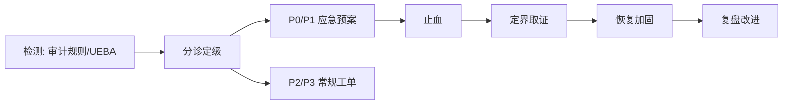

# 大数据 · 15 数据安全与隐私合规（分级分类 / 脱敏 / 加密 / 访问控制 / 合规框架 / 审计 / 大模型安全）

> 数据安全不是"加一层防火墙"，而是贯穿采集、存储、计算、服务全链路的治理能力。本文深入拆解**数据分级分类、脱敏与加密、访问控制（RBAC/ABAC/RLS）、GDPR/个保法合规、审计与水印、大模型数据安全**，并给出落地框架。

---

## 一、要解决的问题

| 痛点 | 说明 |
|------|------|
| 数据泄露 | 内部泄露是最大风险源（占 60%+） |
| 权限失控 | 越权访问、离职账号未清理 |
| 合规要求 | GDPR/个保法/行业监管强制要求 |
| 大模型风险 | Prompt 注入、训练数据泄露 |
| 责任不清 | 数据泄露无法追责到人 |

> 核心认知：**数据安全 = 分级分类（知道有什么）→ 访问控制（谁能看）→ 加密脱敏（泄露了也读不懂）→ 审计追溯（出事找得到人）**——四层防御形成闭环。

---

## 二、数据分级分类

### 2.1 分级标准

| 等级 | 定义 | 例子 | 管控 |
|------|------|------|------|
| L4 绝密 | 核心机密 | 用户全量身份证/健康档案 | 最强（加密+严格审批） |
| L3 机密 | 敏感数据 | 手机号、地址、交易明细 | 强（脱敏+权限） |
| L2 内部 | 内部使用 | 部门业绩、报表 | 中（登录即可） |
| L1 公开 | 公开信息 | 官网数据 | 低 |

### 2.2 分类方法

```
分类维度：
  数据主体（个人/企业/设备）
  敏感程度（直接标识符/准标识符/非敏感）
  业务价值（核心/一般/低价值）
  合规等级（监管强制/自主）

落地：
  自动扫描：识别库表字段敏感度（手机号/身份证/银行卡正则）
  人工确认：业务 owner 确认分类
  标签管理：元数据上打安全标签（Atlas/Ranger/DataHub）
```

### 2.3 分级联动

```
分级 → 安全策略自动匹配：
  L4 → 加密存储 + 字段级脱敏 + 严格审批 + 审计
  L3 → 加密/脱敏 + 权限控制 + 审计
  L2 → 权限控制
  L1 → 无限制
```

---

## 三、数据脱敏

### 3.1 动态脱敏 vs 静态脱敏

| 类型 | 时机 | 用途 | 例子 |
|------|------|------|------|
| 动态脱敏 | 查询时实时替换 | 生产环境按用户权限 | 普通员工查手机号→138****1234 |
| 静态脱敏 | 抽取时脱敏后落库 | 测试/开发环境 | 生产数据→脱敏库 |

### 3.2 脱敏算法

| 算法 | 说明 | 例子 |
|------|------|------|
| 掩码 | 保留部分，其余替换 | 138****1234 |
| 哈希 | 不可逆（可做关联） | SHA256(手机号) |
| 加密（可逆） | 授权可还原 | AES(手机号) |
| 替换 | 假名替代（保持格式） | 张三→李四 |
| 泛化 | 模糊化（年龄→年龄段） | 35→30-40 |

### 3.3 脱敏规则引擎

```
脱敏规则 = 字段 × 敏感级别 × 用户角色 × 场景
  如：手机号字段
    运维 → 明文（可运维）
    分析师 → 掩码（138****1234）
    测试 → 静态脱敏（随机假号）
  优先级：敏感级最高者优先，脱敏只进不出
```

---

## 四、数据加密

### 4.1 加密分层

| 层 | 说明 | 适用 |
|----|------|------|
| 传输加密 | TLS/mTLS 保护链路 | 全链路 |
| 存储加密 | 磁盘级（透明加密） | 全量兜底 |
| 库表加密 | 表/字段级 | 高敏字段 |
| 应用加密 | 业务层加密 | 超敏感 |

### 4.2 字段级加密实践

```
用 AES-256 加密高敏字段：
  DB 存储密文，应用解密后使用
  密钥放 KMS（AWS KMS/阿里云 KMS/自建 Vault）
  加密后的字段：无法直接 LIKE/聚合 → 用盲索引/哈希索引兜底

KMS 密钥轮换：定期轮换，密文重新加密
硬件：HSM 保护根密钥
```

---

## 五、访问控制

### 5.1 访问控制模型

| 模型 | 说明 | 适用 |
|------|------|------|
| RBAC（角色） | 角色绑定权限，用户绑定角色 | 通用（Apache Ranger） |
| ABAC（属性） | 按用户/资源/环境属性动态授权 | 细粒度、跨域 |
| RLS（行级安全） | 行级过滤（行级权限） | 多租户、数据隔离 |

```
Ranger 实践：
  HDFS/Hive/HBase 集中授权
  策略：user/group × resource × action（select/insert/update）
  审计：记录访问日志
```

### 5.2 最小权限原则

```
最小权限：只给完成任务所需的最小权限
  生产库只读账号 vs 写账号分离
  数据权限与业务权限分离（DBA 与业务分开）
  权限定期审计（季度复核）
  离职/调岗账号立即回收
```

### 5.3 数据共享审批

```
数据共享走审批流：
  申请（用途/期限/范围）→ 审批（数据 owner + 安全）→ 授权（自动配权限）→ 到期自动回收
  原则：审批留痕、最小范围、限时有效
```

---

## 六、合规框架

### 6.1 GDPR（欧盟）

```
要点：
  合法性：处理个人数据需合法依据（同意/合同/法律义务）
  数据主体权利：访问/更正/删除（被遗忘权）/可携权
  数据最小化：只收集必要数据
  数据泄露通知：72 小时内报告监管机构
  罚则：最高 4% 全球营收或 2000 万欧
```

### 6.2 中国《个人信息保护法》（PIPL）

```
要点：
  合法性基础：同意/合同/履行法定义务
  敏感个人信息：单独同意 + 影响评估
  跨境传输：安全评估/认证/标准合同
  数据主体权利：查阅/复制/更正/删除/撤回同意
  罚则：最高 5000 万元或上年度 5% 营业额
```

### 6.3 落地清单

```
合规落地：
  ① 数据资产地图（知道有哪些个人数据、在哪）
  ② 分类分级 + 安全策略
  ③ 隐私政策与同意管理
  ④ 脱敏/加密落地
  ⑤ 跨境传输评估（如有）
  ⑥ 数据泄露响应预案（72h 通知）
  ⑦ 定期合规审计
```

---

## 七、审计与水印

### 7.1 审计日志

```
审计 = 记录"谁在何时访问/修改了什么数据"

关键审计点：
  数据访问（查询/导出）
  权限变更（授权/回收）
  数据导出/下载
  脱敏操作（绕过脱敏审批）
  管理操作（删表/清库）

审计日志落 Kafka → 冷存储长期保留（合规要求 1 年以上）
```

### 7.2 数据水印

```
水印 = 数据泄露溯源
  导出数据嵌入不可见水印（用户 ID/批次号）
  泄露时提取水印定位泄密者
  应用：报表导出、数据文件、API 返回
```

---

## 八、大模型数据安全（2025 重点）

### 8.1 风险类型

| 风险 | 说明 | 防护 |
|------|------|------|
| Prompt 注入 | 诱导模型越权/泄露 | 输入过滤 + 输出审查 |
| 训练数据泄露 | 敏感数据进训练集 | 数据过滤 + 脱敏 |
| 越狱攻击 | 绕过对齐 | 权限隔离 + 监控 |
| RAG 数据泄露 | 向量库敏感文档被检索 | 向量库访问控制 |
| 幻觉 | 生成错误但看似可信内容 | 引用校验 + 人工审核 |

### 8.2 落地实践

```
RAG 数据安全：
  向量库按权限隔离（不同用户不同文档集）
  文档入库前脱敏 + 分级
  检索结果按用户权限过滤
  回答加引用来源，可溯源

大模型访问控制：
  大模型 API 走网关（鉴权/限流/审计）
  敏感任务用私有化模型
  输出审查（PII 检测、违规检测）
```

---

## 九、数据安全成熟度模型

| 阶段 | 特征 |
|------|------|
| L1 无 | 无统一安全，靠个人自觉 |
| L2 基础 | 有分级分类 + 简单权限 |
| L3 完善 | 全链路加密脱敏 + 审计 + 水印 |
| L4 领先 | 智能检测（UEBA/异常行为）+ 自动响应 + 合规自动化 |

```
评估维度：组织（制度/责任人）、流程（审批/应急）、技术（工具覆盖）、数据（分类质量）
```

---

## 十、Checklist

- [ ] 数据资产地图（敏感数据清单 + 分布）。
- [ ] 分级分类落地（L1-L4 + 安全标签）。
- [ ] 动态脱敏 + 静态脱敏配置。
- [ ] 传输加密（TLS）+ 存储加密（磁盘/字段级）。
- [ ] 访问控制（RBAC + 最小权限 + 定期复核）。
- [ ] 审批流（数据共享/导出/绕过脱敏）。
- [ ] 审计日志全量采集 + 长期保留。
- [ ] 数据水印部署。
- [ ] 大模型/RAG 访问控制与脱敏。
- [ ] 合规清单（PIPL/GDPR/行业监管）自查。

---

## 数据分类与标记

### 分类维度

| 维度 | 分类 | 示例 | 安全要求 |
|------|------|------|---------|
| 数据主体 | 个人/企业/设备 | 用户ID/公司名/设备序列号 | 个人数据需合规 |
| 敏感程度 | 直接标识/准标识/非敏感 | 身份证/邮编/姓名 | 分级管控 |
| 业务价值 | 核心/一般/低价值 | 交易数据/日志/配置 | 按价值定安全等级 |
| 合规等级 | 监管强制/自主 | PII/财务数据/一般数据 | 按法规要求 |

### 自动分类技术

```
自动扫描识别：
  正则匹配：手机号(1[3-9]\d{9})、身份证(\d{17}[\dXx])
  NLP识别：地址、姓名、邮箱
  机器学习：分类模型自动标注
  模式匹配：银行卡号、社保号

分类流程：
  ① 全量扫描库表字段
  ② 规则+ML自动分类
  ③ 业务Owner确认
  ④ 打安全标签（Atlas/Ranger）
  ⑤ 策略自动匹配（分级→脱敏/权限）
```

## 数据脱敏技术详解

### 静态脱敏

```
适用：测试/开发/数据分析环境
方法：
  掩码：138****1234
  哈希：SHA256(手机号) → 可关联但不可逆
  加密：AES(手机号) → 授权可还原
  替换：张三→李四（假名替代）
  泛化：35岁→30-40岁

流程：
  生产数据 → 脱敏引擎 → 脱敏数据
  脱敏规则 = 字段类型 × 敏感级别 × 目标环境
```

### 动态脱敏

```
适用：生产环境实时查询
方法：
  查询时实时替换（不改变原始存储）
  按用户角色返回不同脱敏级别

示例：
  手机号字段：
    管理员 → 明文 13812341234
    分析师 → 掩码 138****1234
    运维 → 掩码 138****1234
    外部 → 全掩码 ***********

实现：
  Ranger策略：按用户/角色定义脱敏规则
  触发器：查询时自动触发脱敏函数
```

### 令牌化（Tokenization）

```
原理：敏感数据→随机令牌，可逆但需密钥

流程：
  原始数据(13812341234) → 令牌化引擎 → 令牌(TKN-8a3f...)
  令牌可关联（同一原始数据→同一令牌）
  还原需密钥授权

适用：
  支付卡号（PCI DSS要求）
  跨系统数据关联（保留关联性）
  合规存储（令牌化后不算敏感数据）
```

## 差分隐私（Differential Privacy）

```
原理：在查询结果中添加精心计算的噪声
  保证：单个记录的加入/删除不影响结果分布
  数学定义：Pr[M(D)∈S] ≤ e^ε × Pr[M(D')∈S]

参数：
  ε（隐私预算）：越小越隐私，但噪声越大
  一般ε=0.1~1.0（强隐私）
  ε=1.0~10.0（弱隐私）

应用：
  Apple：收集用户行为统计
  Google：Chrome使用统计
  US Census：人口普查数据发布

与大数据集成：
  Hive/Spark查询添加差分隐私噪声
  聚合查询（COUNT/SUM）适合加噪
  明细查询不适合（隐私泄露风险）
```

## 同态加密（Homomorphic Encryption）

```
原理：对密文直接计算，解密后等于对明文计算的结果

类型：
  部分同态（PHE）：支持加法或乘法之一
  有限同态（SHE）：支持有限次加法和乘法
  全同态（FHE）：支持任意计算

性能：
  计算开销：1000倍~10000倍
  密文膨胀：10倍~100倍
  实际应用：受限于性能

适用场景：
  隐私保护机器学习（训练/推理）
  安全数据分析（多方协作）
  云上数据处理（数据不出域）
```

## 安全多方计算（MPC）

```
原理：多方共同计算函数结果，互不知晓对方输入

协议：
  秘密共享（Secret Sharing）：数据分片给多方
  混淆电路（Garbled Circuit）：加密计算
  同态加密（HE）：密文计算

应用场景：
  联合风控：银行+电商联合建模，数据不出域
  联合征信：多机构数据协作
  隐私保护推荐：用户行为协作分析

与大数据集成：
  Flink/Spark集成MPC协议
  多方数据协作分析
  合规要求下的数据共享
```

## 数据访问控制详解

### RBAC（基于角色的访问控制）

```
模型：用户 → 角色 → 权限

示例：
  数据分析师角色 → 只读DWS/ADS表
  数据开发角色 → 读写DWD/DWS表
  DBA角色 → 全库权限
  安全审计角色 → 只读审计日志

实现：
  Ranger策略：user/group × resource × action
  表级：SELECT/INSERT/UPDATE/DELETE
  列级：脱敏/隐藏
  行级：按条件过滤
```

### ABAC（基于属性的访问控制）

```
模型：基于用户/资源/环境属性动态决策

属性示例：
  用户属性：部门、职级、安全等级
  资源属性：表分类、敏感等级、Owner
  环境属性：时间、IP地址、设备

策略示例：
  IF 用户部门=财务 AND 资源分类=财务数据 THEN 允许
  IF 用户职级<总监 AND 资源敏感等级=L4 THEN 拒绝
  IF 环境时间=工作日 AND 环境IP=公司网段 THEN 允许

优势：细粒度、灵活、动态
```

### 列级安全

```
实现方式：
  Ranger策略：定义列级脱敏/隐藏规则
  视图：按列创建视图，权限控制在视图上
  动态脱敏：查询时按列脱敏

示例：
  薪资表：
    HR查看 → 全部列明文
    部门经理 → 薪资列脱敏（****）
    普通员工 → 薪资列隐藏
```

## 审计日志合规

```
审计要点：
  谁（Who）：用户ID/角色
  何时（When）：时间戳
  什么（What）：操作类型（查询/导出/修改）
  哪里（Where）：资源（表/字段/记录）
  结果（Result）：成功/失败

审计日志存储：
  实时：Kafka → ES（可搜索）
  冷存储：HDFS/S3（合规保留1年+）
  加密：审计日志本身加密保护

合规要求：
  GDPR：数据访问日志保留6个月+
  PIPL：个人信息处理日志
  SOX：财务数据访问审计
  HIPAA：健康数据访问日志
```

## 数据保留策略

| 数据类型 | 保留期限 | 法规依据 | 到期动作 |
|---------|---------|---------|---------|
| 个人数据 | 最小必要原则 | PIPL/GDPR | 删除 |
| 财务数据 | 10年 | 税法/审计 | 归档 |
| 健康数据 | 30年 | 医疗法 | 归档/脱敏 |
| 日志数据 | 1年 | 安全审计 | 删除 |
| 交易数据 | 5年 | 电商法 | 归档 |

```
保留策略实施：
  分类标记：数据表打标签（保留期限）
  自动过期：Lifecycle Policy自动归档/删除
  合规例外：法律要求的保留期优先
  删除能力：支持数据主体删除请求（被遗忘权）
```

## 跨境数据传输

| 法规 | 要求 | 合规方式 |
|------|------|---------|
| GDPR | 充分性认定/标准合同 | SCC/BCR/充分性认定 |
| PIPL | 安全评估/认证/标准合同 | 网信办安全评估 |
| CCPA | 无特殊要求 | 一般合规 |

```
跨境传输评估：
  ① 数据分类（是否含个人数据/敏感数据）
  ② 目标国法律评估（是否有同等保护）
  ③ 传输方式选择（SCC/BCR/认证）
  ④ 技术措施（加密/脱敏/匿名化）
  ⑤ 合同约束（数据处理协议DPA）
  ⑥ 定期审计（合规持续性）
```

---

## 数据分类分级国标（GB/T 43698）落地方法

```text
GB/T 43698-2024《网络安全技术 软件供应链安全要求》体系下的
数据分类分级方法论要点：
① 分类维度：先「业务条线」后「数据主题」
   （用户数据/业务数据/经营管理数据/系统运行数据…）
② 分级要素：影响对象（个人/组织/国家安全）× 影响程度（轻微→特别严重）
③ 核心数据识别：关系国家安全的领域数据从严认定
④ 动态管理：分级随场景变化（聚合后升级、匿名化后降级）
```

| 步骤 | 动作 | 输出物 |
|------|------|--------|
| 1 建库 | 梳理法规清单与行业标准（金融 JR/T 0197、工业等叠加国标） | 合规映射表 |
| 2 打标 | 自动扫描 + 业务确认，字段挂「类别 × 级别」双标签 | 分级台账 |
| 3 映射策略 | 级别 → 脱敏/加密/审批/留存策略自动绑定 | 策略矩阵 |
| 4 复核 | 季度抽查 + 变更触发重评 | 审计报告 |

落地要点：分级不是越细越好——**4~5 级是工程可维护的上限**；「聚合升级」最易被忽略（单条脱敏后的行为数据聚合成用户画像即构成个人信息，需按 L3 管控）。

## 动态脱敏 vs 静态脱敏实施对比

| 维度 | 动态脱敏 | 静态脱敏 |
|------|---------|---------|
| 触发时机 | 查询时按身份实时替换 | 抽取时一次性改写落库 |
| 数据一致性 | 永远最新 | 快照，会过期 |
| 性能开销 | 每次查询付出解析/替换成本 | 一次付出，查询零成本 |
| 一致性风险 | 同一值多次导出结果不同（掩码稳定需哈希锚定） | 保持关联性靠确定性算法 |
| 典型部署 | Ranger 列掩码 / 代理网关 / 视图层 | 数仓出数管道 / 测试环境供数 |

```sql
-- 动态：Ranger masking policy（手机号对非白名单角色显示掩码）
-- 效果：SELECT phone FROM users; → 138****1234

-- 静态：出数管道确定性假名化（保持 JOIN 关联能力）
SELECT md5(concat(phone, 'salt_2026')) AS phone_pseudo,
       concat('138', lpad((abs(hash(phone)) % 100000000)::text, 8, 'x')) AS phone_masked
FROM src_users;
```

选型经验：生产在线链路一律动态；测试/分析环境一律静态；**跨环境对账用确定性哈希锚定**（同输入恒同输出），否则脱敏数据无法回溯关联。

## 隐私计算三大路线对比矩阵

| 维度 | 多方安全计算 MPC | 联邦学习 FL | 可信执行环境 TEE |
|------|-----------------|-------------|------------------|
| 核心思想 | 密码学分片协同计算 | 数据不动模型动 | 硬件隔离飞地 |
| 安全假设 | 密码学强度（半诚实/恶意模型） | 梯度可能被逆向（需加噪加固） | 信任硬件厂商+侧信道防护 |
| 性能损耗 | 高（10~100×） | 中（通信轮次多） | 低（5~20%） |
| 适用任务 | 统计/查询/隐匿求交 PSI | 联合建模/联合预测 | 通用计算/评分卡/联合风控 |
| 典型框架 | SecretFlow/FATE-PSI | FATE/Framework | SGX/SEV/海光 CSV |

```text
组合使用是常态：
  营销场景：PSI(MPC) 求交集 → FL 联合建模 → TEE 部署推理
选型判断：
  任务简单（求交/统计）→ MPC 协议族够用且最安全
  任务是机器学习建模 → FL（配差分隐私防梯度泄漏）
  追求性能且有硬件条件 → TEE 优先，密码学兜底
```

合规提示：《个人信息保护法》下隐私计算不自动豁免——参与方仍需各自合法基础，输出结果若可识别个人仍属个人信息处理。

## 数据出境合规要点（《个保法》第 38 条）

```mermaid
flowchart TD
    A[拟出境个人信息] --> B{数量/敏感度评估}
    B -->|"关键信息基础设施运营者\n或达申报量级"| C[网信办安全评估]
    B -->|未达量级| D{有认证机构?}
    D -->|是| E[个人信息保护认证]
    D -->|否| F[标准合同备案\n(SCC 3.0)]
    C --> G[出境后持续监督:\n年度报告+PICA检查]
    E --> G
    F --> G
```

| 要点 | 说明 |
|------|------|
| 三条合法路径 | 安全评估 / 保护认证 / 标准合同（三选一前置条件见上） |
| 前置义务 | 单独同意 + 个人信息保护影响评估（PIA）留存三年 |
| 2024 放宽 | 自由贸易试验区负面清单外可豁免；合同履行必需等情形豁免 SCC |
| 持续义务 | 接收方变更用途须重新评估；向第三方转提供需再授权 |

落地 checklist：
- [ ] 出境数据资产清单（字段级，含间接标识符）
- [ ] PIA 报告归档 + 法务签字
- [ ] 与境外接收方签数据处理协议（DPA），约定再转移限制
- [ ] 技术措施留痕：传输加密、最小化字段、日志留存

## 权限审计报表自动化

```text
自动化审计流水线：
  采集层：Ranger/Hive/DB 审计日志 → Kafka
  加工层：Flink 实时打标（异常访问规则命中）
  存储层：ES（近线检索）+ 对象存储（长期归档 ≥1 年）
  报表层：定时任务生成四类报表 → 邮件/OA 推送 Owner
```

| 报表 | 频率 | 内容 | 异常动作 |
|------|------|------|---------|
| 权限快照表 | 周 | 谁×表×权限级别×授予时间 | 新增高危权限当日通报 |
| 访问热力表 | 月 | 表级访问量 TopN + 用户分布 | 冷门高敏表访问重点核查 |
| 离职残留表 | 周 | 已离职账号仍持有的权限 | 自动生成回收工单 |
| 越权尝试表 | 日 | 被拒绝的访问请求聚类 | 连续尝试触发安全工单 |

```sql
-- 越权尝试聚类示例：同一用户 24h 内被拒 ≥10 次
SELECT user_id, COUNT(*) AS denied_cnt,
       COLLECT_SET(resource) AS tried_resources
FROM audit_log
WHERE result = 'DENY' AND ts >= NOW() - INTERVAL '24' HOUR
GROUP BY user_id HAVING COUNT(*) >= 10;
```

治理闭环关键：审计发现的问题必须回流到「权限回收工单 + 策略修正」，只有报表没有处置的审计等于零；建议把「离职账号残留数」「高危权限新增数」设为安全团队月度 KPI。

## 数据安全事件分级与响应 SLA

| 级别 | 判定标准 | 响应 SLA | 上报 |
|------|---------|---------|------|
| P0 重大 | 大规模个人信息泄露/核心库被拖 | 15 分钟响应，1 小时内启动预案 | CISO + 监管报送评估（72h 义务） |
| P1 严重 | 单点越权批量导出、密钥泄漏 | 30 分钟响应，当日完成吊销轮转 | 安全部负责人 |
| P2 一般 | 个别账号异常访问、策略误配置 | 4 小时处置 | 安全值班群 |
| P3 轻微 | 扫描器告警、无实害尝试 | 每周批量复盘 | 月报 |

```text
响应四步法（与应急演练绑定）：
① 止血：吊销凭证/封禁账号/断开通道（先止损后查因）
② 定界：审计日志还原影响面（谁、何时、拉走什么）
③ 恢复：轮换密钥、修复策略、灰度恢复服务
④ 复盘：根因到体制层，输出策略/流程改进项并跟踪
```



演练要求：
- 每半年至少一次 P0/P1 级桌面推演 + 每年一次实战演练（含密钥吊销全链路）；
- 监管报送模板预置：泄露范围、涉及人数、原因、处置措施四要素可 2 小时内成稿。
- 复盘输出项全部带 Owner 与期限，进入下季度安全例会跟踪清单。

---

## 十一、与其他板块的关系

- 元数据见「[01-概述与业务体系](01-概述与业务体系.md)」；
- 治理体系见「[12-数据治理与数据质量](12-数据治理与数据质量.md)」；
- 数据服务权限见「[17-数据服务化与指标管理](17-数据服务化与指标管理.md)」；
- 存储加密见「[04-分布式存储与HDFS](04-分布式存储与HDFS.md)」；
- 新技术趋势见「[13-新技术趋势与生态全景](13-新技术趋势与生态全景.md)」。

> 一句话：**数据安全 = 分级分类（知道有什么）→ 访问控制（谁能看，RBAC+最小权限）→ 加密脱敏（泄露也读不懂）→ 审计水印（出事找得到人）——合规对齐 PIPL/GDPR，大模型/RAG 单独管控，从"事后补救"走向"智能自治"**。