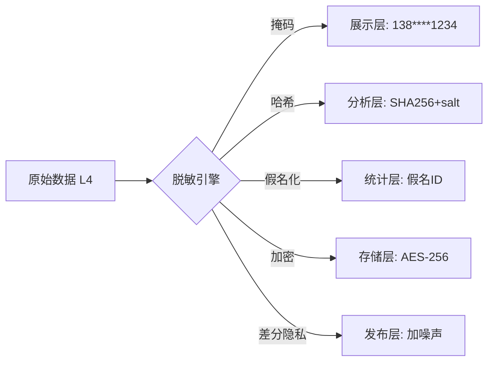
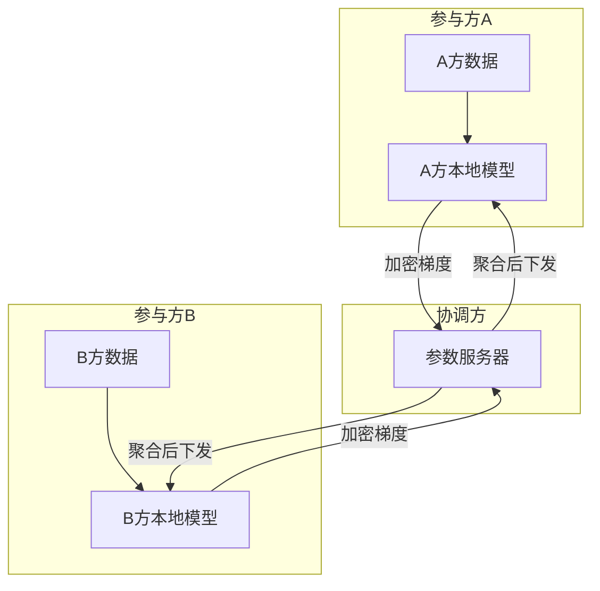

# 数据安全与隐私合规

## 〇、本体介绍

**大数据安全**：在数据的采集、存储、计算、服务全生命周期中，保障数据**不泄露、不被篡改、可追溯、合规使用**。随着《个人信息保护法》《数据安全法》落地，数据安全从"加分项"变成"必选项"。

**核心矛盾**：
1. 数据要**流通共享**（中台/BI/AI）又要**隔离保护**（隐私/合规），天然对立；
2. 安全技术（脱敏/加密/审计）会**增加计算开销**，与大数据追求的高性能冲突；
3. 合规要求（最小必要/知情同意/删除权）需要**技术+流程+组织**三方协同。

**核心主线**：安全威胁面 → 数据分级分类 → 脱敏与加密 → 权限与审计 → 隐私计算 → 合规框架。

---

## 一、数据安全威胁面

| 阶段 | 威胁 | 案例 |
|------|------|------|
| **采集** | 超范围收集、未告知收集 | App 过度申请权限 |
| **传输** | 中间人窃听、明文传输 | 内网明文传输用户数据 |
| **存储** | 未加密存储、密钥泄露 | S3 Bucket 配置错误暴露数据 |
| **计算** | 越权访问、SQL 注入 | 分析师查全量明文手机号 |
| **服务** | 接口未鉴权、数据爬取 | API 返回全量用户明细 |
| **销毁** | 删除不彻底、备份残留 | 用户注销后备份数据未清理 |

---

## 二、数据分级分类（安全的基础）

| 级别 | 定义 | 例子 | 保护要求 |
|------|------|------|----------|
| **L1 公开** | 可对外公开 | 产品目录、公开报表 | 无特殊要求 |
| **L2 内部** | 公司内部使用 | 内部报表、运营数据 | 身份认证 + 审计 |
| **L3 敏感** | 泄露致业务损失 | 用户行为日志、交易数据 | 脱敏 + 权限控制 + 审计 |
| **L4 高敏** | 泄露致法律风险 | 手机号、身份证、银行卡 | 加密 + 最小权限 + 审计 + 合规审查 |
| **L5 极敏** | 国家/商业秘密 | 核心算法、未公开财报 | 最高权限 + 物理隔离 |

> 口诀：**"先分级再保护，L1 公开 L5 极敏；L3 以上必脱敏，L4 以上必加密。"**

---

## 三、脱敏技术

### 3.1 脱敏方式对比

| 方式 | 做法 | 适用 | 缺点 |
|------|------|------|------|
| **掩码** | 手机号 138****1234 | 展示 | 不可逆，无法还原 |
| **哈希** | SHA256(手机号) | 关联分析 | 彩虹表可逆（需加盐） |
| **加密** | AES 加密存储 | 需还原场景 | 密钥管理复杂 |
| **假名化** | 随机 ID 替代姓名 | 统计分析 | 需映射表还原 |
| **泛化** | 年龄 25 → 20-30 岁 | 聚合分析 | 精度下降 |
| **差分隐私** | 加噪声 | 统计发布 | 噪声影响准确性 |

### 3.2 脱敏架构

- **关键设计**：脱敏规则按数据分级自动匹配（L4 自动触发掩码/加密）；脱敏后数据降级（脱敏后 L4 → L3）。
- **映射表隔离**：假名化映射表单独加密存储，与业务数据物理隔离。

> 口诀：**"掩码展示用，哈希关联用；假名化统计，加密要还原；差分隐私防推断，映射表隔离存。"**

---

## 四、权限与审计

### 4.1 权限模型

| 模型 | 做法 | 适用 |
|------|------|------|
| **RBAC** | 角色绑定权限（分析师/管理员/审计员） | 大多数场景 |
| **ABAC** | 属性动态判断（数据分级+用户部门+时间） | 细粒度控制 |
| **行级权限** | 同一表不同用户看不同行 | 多租户数据隔离 |
| **列级权限** | 同一表不同用户看不同列 | 敏感字段保护 |

### 4.2 审计日志

| 审计项 | 内容 | 作用 |
|--------|------|------|
| **访问日志** | 谁、何时、查了什么数据 | 事后追溯 |
| **操作日志** | 谁、何时、改了什么数据 | 变更审计 |
| **导出日志** | 谁、何时、导出了什么数据 | 数据外发监控 |
| **异常告警** | 高频查询/大量导出/越权尝试 | 实时发现 |

- **审计架构**：所有数据访问 → 审计日志 → Kafka → Flink 实时分析 → 异常告警；审计日志落 Iceberg 长期留存。
- **审计日志格式**：`{userId, action, resource, dataLevel, timestamp, result}`。

> 口诀：**"RBAC 定角色，ABAC 细粒度；行级隔离租户，列级护字段；全链路审计留痕，异常实时告警。"**

---

## 五、隐私计算

### 5.1 技术对比

| 技术 | 原理 | 适用 | 性能 |
|------|------|------|------|
| **联邦学习** | 数据不动模型动，各方本地训练 | 跨机构联合建模 | 通信开销大 |
| **安全多方计算** | 多方共同计算，各方不知他方输入 | 跨机构联合统计 | 计算开销极大 |
| **可信执行环境** | 硬件级隔离（Intel SGX/ARM TrustZone） | 高敏数据计算 | 较好，需硬件 |
| **差分隐私** | 加噪声保护个体隐私 | 统计发布 | 噪声影响精度 |

### 5.2 联邦学习架构

- **核心原则**：原始数据不出域，只传加密梯度/参数；满足"数据可用不可见"。
- **挑战**：通信开销大、梯度泄露风险（需差分隐私增强）、参与方贡献度量。

---

## 六、合规框架

### 6.1 国内法规

| 法规 | 核心要求 | 技术落地 |
|------|----------|----------|
| **《个人信息保护法》** | 知情同意、最小必要、删除权 | 同意管理、数据最小化采集、删除接口 |
| **《数据安全法》** | 数据分级、安全评估、出境审查 | 分级分类、安全审计、跨境数据管控 |
| **《网络安全法》** | 等级保护、日志留存 | 等保 2.0 合规、日志留存 6 个月 |

### 6.2 合规 CheckList

- [ ] 数据采集：明确告知 + 用户同意 + 最小必要
- [ ] 数据存储：分级分类 + L4 加密 + 密钥轮换
- [ ] 数据使用：权限控制 + 脱敏展示 + 审计留痕
- [ ] 数据传输：加密传输（TLS）+ 跨境管控
- [ ] 数据删除：用户注销后彻底删除 + 备份清理
- [ ] 数据泄露：应急预案 + 72 小时内上报

> 口诀：**"采集要同意，存储要加密；使用要脱敏，传输要 TLS；删除要彻底，泄露要上报。"**

---

## 七、与其他板块的关系

- **12 数据治理与数据质量** — 数据安全是数据治理的核心维度之一；
- **SRE与稳定性工程/06-日志与告警规则库** — 安全审计日志的告警规则；
- **安全工程/02-认证与授权体系** — 权限模型（RBAC/ABAC）的技术实现；
- **安全工程/05-数据安全与密码学基础** — 加密算法、密码学原理；
- **分库分表与数据迁移** — 数据迁移中的安全管控；
- **大数据场景设计实战/数据中台建设** — 数据中台的安全层设计。

---

## 八、速查表

| 主题 | 一句话 |
|------|--------|
| 分级 | L1-L5，先分级再保护 |
| 脱敏 | 掩码展示、哈希关联、假名统计、加密还原 |
| 权限 | RBAC 定角色，ABAC 细粒度，行列级隔离 |
| 审计 | 全链路留痕，异常实时告警 |
| 隐私计算 | 联邦学习（数据不动模型动）、安全多方计算、差分隐私 |
| 合规 | 知情同意、最小必要、删除权、出境审查 |

---

## 面试高频问题（10+ 条）

1. **数据脱敏有哪些方式？** 掩码（展示）、哈希（关联）、假名化（统计）、加密（还原）、差分隐私（防推断）。
2. **什么是数据分级？** 按敏感程度分 L1-L5，不同级别不同保护策略。
3. **RBAC 和 ABAC 区别？** RBAC 按角色授权，ABAC 按属性动态判断（更细粒度）。
4. **什么是联邦学习？** 数据不出域，各方本地训练模型，只传加密梯度到协调方聚合。
5. **差分隐私原理？** 在查询结果中加入 calibrated noise，使个体数据不可推断。
6. **审计日志记什么？** 谁、何时、做了什么操作、结果如何；事后追溯 + 实时异常告警。
7. **《个人信息保护法》核心要求？** 知情同意、最小必要、删除权、数据可携带。
8. **假名化和加密区别？** 假名化用随机 ID 替代，需映射表还原；加密用算法，需密钥还原。
9. **数据跨境怎么管控？** 安全评估 + 标准合同 + 出境审批；敏感数据原则上不出境。
10. **用户注销后数据怎么处理？** 主数据删除 + 关联数据清理 + 备份过期清除 + 审计记录。
11. **脱敏后数据还能关联分析吗？** 可以，用加盐哈希（同一值哈希结果一致）做关联，但不可逆推原文。
