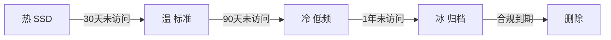

# 大数据 · 16 成本优化（成本全景 / 存储分层 / 计算弹性 / 湖仓降本 / 治理与分摊 / FinOps）

> 大数据成本通常占 IT 预算的 20%~40%，且随数据量指数增长，"成本失控"是数据团队最常被 CEO 追问的问题。本文深入拆解**成本构成、存储冷热分层、计算弹性与资源优化、湖仓一体降本、FinOps 治理分摊**，并给出可落地的量化方法与工具。

---

## 一、要解决的问题

| 痛点 | 说明 |
|------|------|
| 存储爆炸 | 数据只增不减，存储成本指数增长 |
| 计算浪费 | 常驻集群闲置（峰值预留 vs 日常低负载） |
| 双链路负担 | 批+流两套存储/两套计算（Lambda） |
| 责任不清 | 成本不透明，无人对浪费负责 |
| 优化盲目 | 不知道省在哪、怎么量化收益 |

> 核心认知：**成本优化 = 度量（成本全景）→ 分层（存储冷热）→ 弹性（计算按需）→ 架构（湖仓一体/存算分离）→ 治理（分摊/预算）**——不是压预算，而是"每一分钱花在有价值的数据/计算上"。

---

## 二、成本全景与度量

### 2.1 成本构成

| 维度 | 占比 | 说明 |
|------|------|------|
| 存储 | 30%~50% | HDFS/对象存储，PB 级月费数万~数十万 |
| 计算 | 30%~40% | Spark/Flink 集群（常驻+弹性） |
| 网络 | 10%~15% | 跨 AZ/跨 Region 传输、公网出口 |
| 人力 | 10%~20% | 数据开发、运维、治理 |

### 2.2 成本度量指标

| 指标 | 公式 | 意义 |
|------|------|------|
| 每 TB 存储成本 | 存储费用 / 总数据量 | 存储效率 |
| 每 TB 计算成本 | 计算费用 / 处理数据量 | 计算效率 |
| 单查询成本 | 计算费用 / 查询次数 | 查询效率 |
| 数据价值密度 | 活跃数据 / 总数据 | 分层依据 |
| 任务成本率 | 任务成本 / 业务价值 | 评估任务价值 |
| 空闲资源率 | 空闲核时 / 总核时 | 弹性效果 |

```
度量工具：云账单 + 标签（tag/label）分摊到团队/任务
  AWS：Cost Explorer + 资源标签
  阿里云：分账账单 + 标签
  自建：Kafka 消费账单 → 按 tag 聚合看板
```

> 口诀：**"存储计算网络人，五维度看成本；TB 成本是基线，价值密度定分层。"**

---

## 三、存储优化：冷热温冰分层

### 3.1 分层策略

| 层级 | 访问频率 | 存储介质 | 相对成本 |
|------|----------|----------|---------|
| 热 | 日/小时 | SSD/高性能 | 10 |
| 温 | 周/月 | 标准对象存储 | 3 |
| 冷 | 季度/年 | 低频存储（IA） | 1 |
| 冰 | 极少 | 归档/深度归档 | 0.3 |

```
自动分层：
  对象存储 Lifecycle Policy 按访问时间自动迁移
  数据湖表格式：Iceberg 支持按分区/时间归档到低频
  人工规则：订单表 30 天后转冷、1 年后归档
  收益：合理分层可降存储成本 40%~60%
```



### 3.2 存储格式与压缩

| 手段 | 收益 |
|------|------|
| 列式存储（Parquet/ORC） | 压缩率 5~10x |
| ZSTD/Snappy | 比 GZIP 提升 20%~30% 且解压快 |
| 小文件 compaction | 减少元数据/文件开销 |
| 数据去重 | 消除重复采集/冗余副本 |
| 冗余副本降级 | 3 副本→2 副本+纠删码（HDFS EC） |

---

## 四、计算优化：弹性与资源利用

### 4.1 计算资源模型

| 模型 | 做法 | 适用 | 成本 |
|------|------|------|------|
| 常驻集群 | 7×24 固定 | 实时/核心链路 | 高（闲置浪费） |
| 弹性集群 | 按负载扩缩 | 离线批处理 | 中（按需付费） |
| Serverless | 按查询计费 | 临时查询 | 低（单价高） |
| Spot/抢占式 | 低价抢占 | 容错批处理 | 极低（可被回收） |

### 4.2 弹性实践

```
弹性扩缩：K8s Cluster Autoscaler / HPA 按负载扩缩
  Flink：按并行度/吞吐动态扩缩 TaskManager
  错峰调度：非紧急任务跑夜间低价时段（云厂商闲时折扣）
  Spot 实例：容错任务（重试即可）用 Spot，成本降 60%~70%
```

### 4.3 任务/SQL 优化（不花一分钱降计算）

```
SQL 优化减少扫描量：
  分区裁剪（只扫命中分区）
  列裁剪（只读所需列）
  谓词下推（先过滤再 join）
  数据倾斜治理（热点 key 加盐、两阶段聚合）→ 消灭长尾任务
  缓存中间结果（重复查询/中间表物化）
  大表 join 小表：小表 broadcast
```

### 4.4 低效任务治理

```
定期审计：
  全表扫描任务（无分区过滤）
  重复计算（同一结果多次计算 → 物化/缓存）
  空跑任务（无下游引用）
  高成本低价值任务（关停或降频）
  → 自动化：扫描任务运行日志/成本，标记 TOP 浪费
```

---

## 五、架构级降本：存算分离 + 湖仓一体

### 5.1 存算分离

| 模式 | 说明 | 成本影响 |
|------|------|----------|
| 存算耦合（Hadoop） | 存储计算同节点 | 扩容必须同时扩存储+计算，浪费 |
| 存算分离 | 对象存储 + 独立弹性计算 | 存储按量付费、计算按需扩缩 |

```
优势：存储（对象存储）按量付费，计算（K8s 弹性）用完即释放
注意：网络 IO 成本增加 → 用本地缓存/列裁剪抵消
```

### 5.2 湖仓一体降本

| 维度 | 传统数仓 | 湖仓一体 |
|------|----------|----------|
| 存储 | 专有存储（贵） | 对象存储（便宜）→ 降 50%+ |
| 计算 | 耦合扩容贵 | 独立弹性 → 降 30%+ |
| 双链路 | Lambda 两份代码 | 流批一份 → 开发+计算降 50% |
| 数据冗余 | 湖仓多份拷贝 | 一份数据多引擎读 → 冗余降 60% |

```
本质：一份 Iceberg/Paimon 数据同时服务 BI（数仓式）+ ML（湖式）
消除"湖一套、仓一套"的存储与计算双份开销
```

### 5.3 数据生命周期

```
采集 → 热 → 温 → 冷 → 归档 → 删除
  自动过期（转冷/归档/删除）
  合规保留（法律要求单独标记）
  价值评估（低价值数据优先归档）
  僵尸表清理（无查询+无引用 → 删除）
```

---

## 六、FinOps 治理与成本分摊

### 6.1 成本分摊

```
按标签（tag/label）分摊到团队/项目/任务：
  存储：按数据归属表/路径 tag
  计算：按任务 owner tag
  账单打标签 → 各团队自助查看成本
  → 明确成本 Owner，让"谁用数据谁担成本"
```

### 6.2 预算与配额

| 机制 | 做法 |
|------|------|
| 预算管控 | 团队设置预算上限，超预算告警/限流 |
| 资源配额 | 计算/存储配额分配，防止抢占 |
| 审批 | 大额资源申请走审批（集群扩容/存储扩容） |
| 成本看板 | 实时展示各团队/任务成本（租户视图） |

### 6.3 成本看板指标

```
各团队存储/计算成本（TOP 成本大户）
各任务计算成本（低效任务 TOP）
冷热数据占比（分层效果）
存储增长率（预测未来成本）
查询成本（高频/高成本查询）
空闲资源率（弹性效果）
```

---

## 七、成本优化量化方法

```
ROI 计算：优化前成本 − 优化后成本 − 优化投入
优先级（成本×可落地性）：
  ① 冷数据分层（改动小、收益大、立竿见影）
  ② 闲置集群释放/缩容（常驻→弹性）
  ③ 僵尸表清理（一次清干净）
  ④ 低效任务治理（持续收益）
  ⑤ 湖仓/存算分离改造（大工程、长期收益）
```

```
落地节奏建议：
  第 1 周：成本全景 + 看板
  第 1 月：存储分层 + 僵尸表清理 + 闲置集群
  第 2-3 月：任务治理 + SQL 优化 + Spot/错峰
  第 3-6 月：湖仓/存算分离架构改造
```

---

## 八、成本优化 Checklist

- [ ] 成本全景（五维度）+ 标签分摊 + 看板已上线。
- [ ] 存储冷热温冰分层 + Lifecycle 自动迁移。
- [ ] 列式存储 + ZSTD + compaction + 去重。
- [ ] 常驻集群评估缩容；批处理切弹性/Spot/错峰。
- [ ] SQL 优化（分区/列裁剪/谓词下推/倾斜治理）落地。
- [ ] 僵尸表 + 低效任务定期清理。
- [ ] 预算/配额/审批机制启用。
- [ ] 湖仓一体/存算分离架构演进规划（如适用）。

---

## 九、与其他板块的关系

- 存储见「[04-分布式存储与HDFS](04-分布式存储与HDFS.md)」「[05-列式存储与数据湖格式](05-列式存储与数据湖格式.md)」；
- 资源调度见「[10-资源调度：YARN与Kubernetes](10-资源调度：YARN与Kubernetes.md)」；
- 湖仓一体见「[11-实时数仓与湖仓一体](11-实时数仓与湖仓一体.md)」；
- 治理见「[12-数据治理与数据质量](12-数据治理与数据质量.md)」；
- 趋势见「[13-新技术趋势与生态全景](13-新技术趋势与生态全景.md)」；
- 稳定性见「SRE与稳定性工程」（成本优化不能牺牲 SLA）。

> 一句话：**成本优化 = 度量（全景/分摊）→ 存储分层（冷热温冰 10:3:1:0.3）→ 计算弹性（Spot/错峰/Serverless）→ 架构降本（湖仓一体/存算分离）→ FinOps 治理（预算/配额/看板）——优先做"冷数据分层 + 闲置释放 + 低效任务治理"三个立竿见影的动作，一切优化以不牺牲 SLA 为前提**。