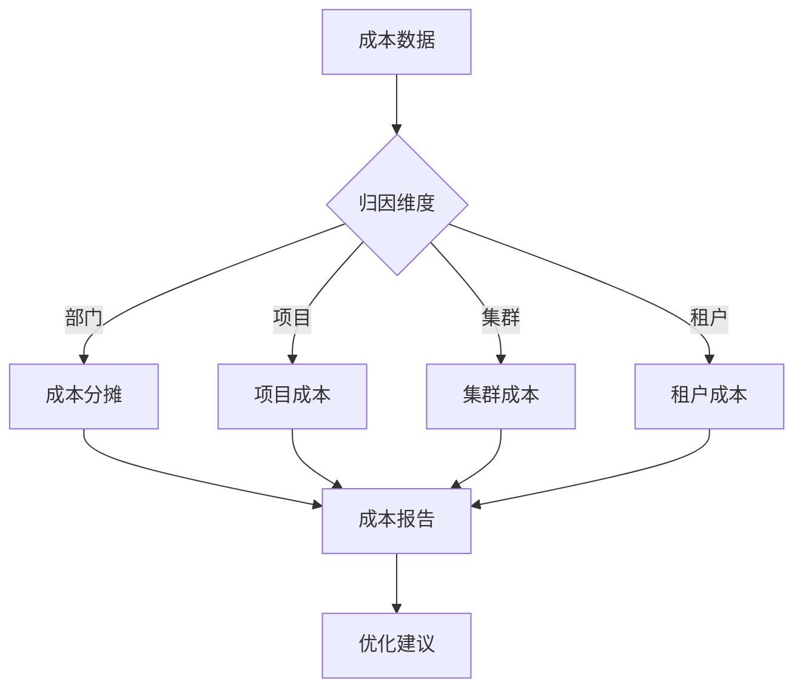
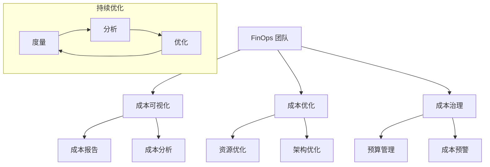
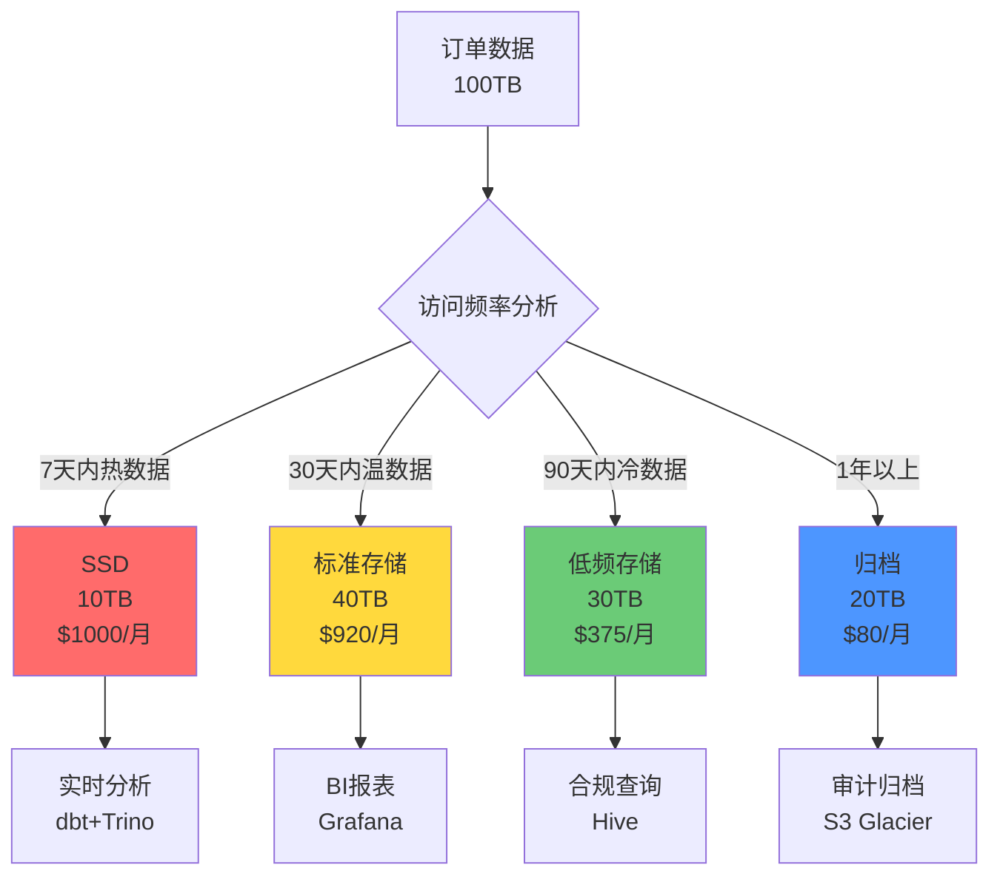
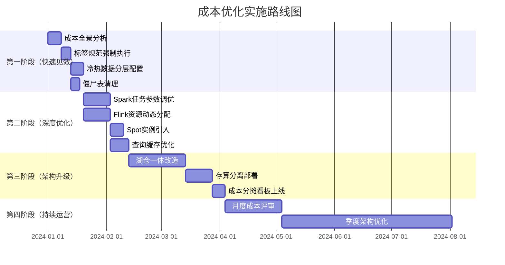
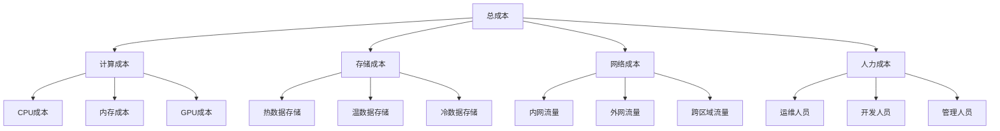

# 大数据 · 16 成本优化（成本全景 / 存储分层 / 计算弹性 / 湖仓降本 / 治理与分摊 / FinOps）

> 大数据成本通常占 IT 预算的 20%~40%，且随数据量指数增长，"成本失控"是数据团队最常被 CEO 追问的问题。本文深入拆解**成本构成、存储冷热分层、计算弹性与资源优化、湖仓一体降本、FinOps 治理分摊**，并给出可落地的量化方法与工具。

---

## 一、要解决的问题

| 痛点 | 说明 |
|------|------|
| 存储爆炸 | 数据只增不减，存储成本指数增长 |
| 计算浪费 | 常驻集群闲置（峰值预留 vs 日常低负载） |
| 双链路负担 | 批+流两套存储/两套计算（Lambda） |
| 责任不清 | 成本不透明，无人对浪费负责 |
| 优化盲目 | 不知道省在哪、怎么量化收益 |

> 核心认知：**成本优化 = 度量（成本全景）→ 分层（存储冷热）→ 弹性（计算按需）→ 架构（湖仓一体/存算分离）→ 治理（分摊/预算）**——不是压预算，而是"每一分钱花在有价值的数据/计算上"。

---

## 二、成本全景与度量

### 2.1 成本构成

| 维度 | 占比 | 说明 |
|------|------|------|
| 存储 | 30%~50% | HDFS/对象存储，PB 级月费数万~数十万 |
| 计算 | 30%~40% | Spark/Flink 集群（常驻+弹性） |
| 网络 | 10%~15% | 跨 AZ/跨 Region 传输、公网出口 |
| 人力 | 10%~20% | 数据开发、运维、治理 |

### 2.2 成本度量指标

| 指标 | 公式 | 意义 |
|------|------|------|
| 每 TB 存储成本 | 存储费用 / 总数据量 | 存储效率 |
| 每 TB 计算成本 | 计算费用 / 处理数据量 | 计算效率 |
| 单查询成本 | 计算费用 / 查询次数 | 查询效率 |
| 数据价值密度 | 活跃数据 / 总数据 | 分层依据 |
| 任务成本率 | 任务成本 / 业务价值 | 评估任务价值 |
| 空闲资源率 | 空闲核时 / 总核时 | 弹性效果 |

```
度量工具：云账单 + 标签（tag/label）分摊到团队/任务
  AWS：Cost Explorer + 资源标签
  阿里云：分账账单 + 标签
  自建：Kafka 消费账单 → 按 tag 聚合看板
```

> 口诀：**"存储计算网络人，五维度看成本；TB 成本是基线，价值密度定分层。"**

---

## 三、存储优化：冷热温冰分层

### 3.1 分层策略

| 层级 | 访问频率 | 存储介质 | 相对成本 |
|------|----------|----------|---------|
| 热 | 日/小时 | SSD/高性能 | 10 |
| 温 | 周/月 | 标准对象存储 | 3 |
| 冷 | 季度/年 | 低频存储（IA） | 1 |
| 冰 | 极少 | 归档/深度归档 | 0.3 |

```
自动分层：
  对象存储 Lifecycle Policy 按访问时间自动迁移
  数据湖表格式：Iceberg 支持按分区/时间归档到低频
  人工规则：订单表 30 天后转冷、1 年后归档
  收益：合理分层可降存储成本 40%~60%
```


### 3.2 存储格式与压缩

| 手段 | 收益 |
|------|------|
| 列式存储（Parquet/ORC） | 压缩率 5~10x |
| ZSTD/Snappy | 比 GZIP 提升 20%~30% 且解压快 |
| 小文件 compaction | 减少元数据/文件开销 |
| 数据去重 | 消除重复采集/冗余副本 |
| 冗余副本降级 | 3 副本→2 副本+纠删码（HDFS EC） |

---

## 四、计算优化：弹性与资源利用

### 4.1 计算资源模型

| 模型 | 做法 | 适用 | 成本 |
|------|------|------|------|
| 常驻集群 | 7×24 固定 | 实时/核心链路 | 高（闲置浪费） |
| 弹性集群 | 按负载扩缩 | 离线批处理 | 中（按需付费） |
| Serverless | 按查询计费 | 临时查询 | 低（单价高） |
| Spot/抢占式 | 低价抢占 | 容错批处理 | 极低（可被回收） |

### 4.2 弹性实践

```
弹性扩缩：K8s Cluster Autoscaler / HPA 按负载扩缩
  Flink：按并行度/吞吐动态扩缩 TaskManager
  错峰调度：非紧急任务跑夜间低价时段（云厂商闲时折扣）
  Spot 实例：容错任务（重试即可）用 Spot，成本降 60%~70%
```

### 4.3 任务/SQL 优化（不花一分钱降计算）

```
SQL 优化减少扫描量：
  分区裁剪（只扫命中分区）
  列裁剪（只读所需列）
  谓词下推（先过滤再 join）
  数据倾斜治理（热点 key 加盐、两阶段聚合）→ 消灭长尾任务
  缓存中间结果（重复查询/中间表物化）
  大表 join 小表：小表 broadcast
```

### 4.4 低效任务治理

```
定期审计：
  全表扫描任务（无分区过滤）
  重复计算（同一结果多次计算 → 物化/缓存）
  空跑任务（无下游引用）
  高成本低价值任务（关停或降频）
  → 自动化：扫描任务运行日志/成本，标记 TOP 浪费
```

---

## 五、架构级降本：存算分离 + 湖仓一体

### 5.1 存算分离

| 模式 | 说明 | 成本影响 |
|------|------|----------|
| 存算耦合（Hadoop） | 存储计算同节点 | 扩容必须同时扩存储+计算，浪费 |
| 存算分离 | 对象存储 + 独立弹性计算 | 存储按量付费、计算按需扩缩 |

```
优势：存储（对象存储）按量付费，计算（K8s 弹性）用完即释放
注意：网络 IO 成本增加 → 用本地缓存/列裁剪抵消
```

### 5.2 湖仓一体降本

| 维度 | 传统数仓 | 湖仓一体 |
|------|----------|----------|
| 存储 | 专有存储（贵） | 对象存储（便宜）→ 降 50%+ |
| 计算 | 耦合扩容贵 | 独立弹性 → 降 30%+ |
| 双链路 | Lambda 两份代码 | 流批一份 → 开发+计算降 50% |
| 数据冗余 | 湖仓多份拷贝 | 一份数据多引擎读 → 冗余降 60% |

```
本质：一份 Iceberg/Paimon 数据同时服务 BI（数仓式）+ ML（湖式）
消除"湖一套、仓一套"的存储与计算双份开销
```

### 5.3 数据生命周期

```
采集 → 热 → 温 → 冷 → 归档 → 删除
  自动过期（转冷/归档/删除）
  合规保留（法律要求单独标记）
  价值评估（低价值数据优先归档）
  僵尸表清理（无查询+无引用 → 删除）
```

---

## 六、FinOps 治理与成本分摊

### 6.1 成本分摊

```
按标签（tag/label）分摊到团队/项目/任务：
  存储：按数据归属表/路径 tag
  计算：按任务 owner tag
  账单打标签 → 各团队自助查看成本
  → 明确成本 Owner，让"谁用数据谁担成本"
```

### 6.2 预算与配额

| 机制 | 做法 |
|------|------|
| 预算管控 | 团队设置预算上限，超预算告警/限流 |
| 资源配额 | 计算/存储配额分配，防止抢占 |
| 审批 | 大额资源申请走审批（集群扩容/存储扩容） |
| 成本看板 | 实时展示各团队/任务成本（租户视图） |

### 6.3 成本看板指标

```
各团队存储/计算成本（TOP 成本大户）
各任务计算成本（低效任务 TOP）
冷热数据占比（分层效果）
存储增长率（预测未来成本）
查询成本（高频/高成本查询）
空闲资源率（弹性效果）
```

---

## 七、成本优化量化方法

```
ROI 计算：优化前成本 − 优化后成本 − 优化投入
优先级（成本×可落地性）：
  ① 冷数据分层（改动小、收益大、立竿见影）
  ② 闲置集群释放/缩容（常驻→弹性）
  ③ 僵尸表清理（一次清干净）
  ④ 低效任务治理（持续收益）
  ⑤ 湖仓/存算分离改造（大工程、长期收益）
```

```
落地节奏建议：
  第 1 周：成本全景 + 看板
  第 1 月：存储分层 + 僵尸表清理 + 闲置集群
  第 2-3 月：任务治理 + SQL 优化 + Spot/错峰
  第 3-6 月：湖仓/存算分离架构改造
```

---

## 八、成本优化 Checklist

- [ ] 成本全景（五维度）+ 标签分摊 + 看板已上线。
- [ ] 存储冷热温冰分层 + Lifecycle 自动迁移。
- [ ] 列式存储 + ZSTD + compaction + 去重。
- [ ] 常驻集群评估缩容；批处理切弹性/Spot/错峰。
- [ ] SQL 优化（分区/列裁剪/谓词下推/倾斜治理）落地。
- [ ] 僵尸表 + 低效任务定期清理。
- [ ] 预算/配额/审批机制启用。
- [ ] 湖仓一体/存算分离架构演进规划（如适用）。

---

## 集群 Right-Sizing 方法论

### 评估维度

| 维度 | 指标 | 优化方向 |
|------|------|---------|
| CPU | 利用率<30%为浪费 | 缩减核数或切Spot |
| 内存 | 使用率<50%为浪费 | 减少内存或混部 |
| 磁盘 | IOPS/吞吐使用率 | 升级SSD或减少盘数 |
| 网络 | 带宽利用率 | 优化数据本地性 |

### Right-Sizing 流程

```
步骤：
  ① 采集资源使用监控数据（7天+）
  ② 分析P50/P90/P99使用率
  ③ 识别空闲/低效资源
  ④ 制定缩容方案
  ⑤ 灰度验证（先缩10%）
  ⑥ 全量执行

工具：
  云监控：AWS CloudWatch / 阿里云监控
  Kubernetes：Metrics Server + HPA
  自建：Prometheus + Grafana
```

## Spot/抢占式实例策略

```
Spot实例原理：
  云厂商闲置资源以折扣价出售
  价格波动（供需决定）
  可被回收（提前2分钟通知）

适用场景：
  容错批处理（Spark/Hive作业）
  CI/CD流水线
  大规模训练（可中断重试）
  数据处理（可重算）

不适用场景：
  实时服务（不可中断）
  有状态服务（状态丢失风险）
  关键业务链路（SLA要求）

策略：
  混合使用：On-Demand + Spot（70%+30%）
  多实例类型：避免单一类型被回收
  检查点：Flink/Spark检查点保障容错
  价格监控：低于阈值时自动切换
```

## 存储分层成本模型

| 层级 | $/GB/月 | 相对成本 | 适用数据 |
|------|---------|---------|---------|
| Hot（SSD） | $0.10 | 10× | 实时分析 |
| Warm（标准） | $0.023 | 3× | 日常查询 |
| Cold（IA） | $0.0125 | 1× | 季度报表 |
| Archive | $0.004 | 0.3× | 合规归档 |

```
成本计算示例：
  100TB数据，合理分层后：
  Hot(10%): 10TB × $0.10 = $1000/月
  Warm(40%): 40TB × $0.023 = $920/月
  Cold(30%): 30TB × $0.0125 = $375/月
  Archive(20%): 20TB × $0.004 = $80/月
  总计: $2375/月

  不分层（全部Warm）: 100TB × $0.023 = $2300/月
  但Hot数据查询性能差 → 影响业务效率

  最优策略：按访问模式分层，Hot数据保证性能
```

## 计算资源优化

### CPU/内存/磁盘优化

| 资源 | 优化方法 | 收益 |
|------|---------|------|
| CPU | 向量化执行（SIMD） | 3~10×性能提升 |
| CPU | 并行度调优 | 避免资源闲置 |
| 内存 | 广播小表 | 减少Shuffle |
| 内存 | 状态后端优化 | RocksDB替代内存 |
| 磁盘 | 列式存储 | 减少IO量 |
| 磁盘 | 数据本地性 | 减少网络传输 |

```
Spark资源优化：
  spark.executor.instances： executor数量
  spark.executor.cores：每executor核数
  spark.executor.memory：每executor内存
  spark.sql.shuffle.partitions：Shuffle分区数

经验公式：
  executor核数 = 数据节点核数 × 0.75（留25%给系统）
  executor内存 = 数据节点内存 × 0.75
  shuffle分区数 = 输入数据量 / 128MB
```

## 数据生命周期成本分析

```
成本曲线：
  采集阶段：高成本（实时采集/CDC）
  热存储：高成本（高性能SSD）
  温存储：中成本（标准存储）
  冷存储：低成本（低频存储）
  归档：极低成本（归档存储）
  删除：零成本

优化策略：
  热→温：30天后自动迁移
  温→冷：90天后自动迁移
  冷→归档：1年后自动迁移
  归档→删除：合规到期删除

收益：合理分层可降存储总成本40%~60%
```

## 云 vs 本地 TCO 对比

| 维度 | 本地部署 | 云部署 |
|------|---------|--------|
| 初始投资 | 高（硬件采购） | 低（按需付费） |
| 运维成本 | 高（人力运维） | 低（托管服务） |
| 扩展性 | 低（采购周期长） | 高（秒级扩缩） |
| 弹性 | 低（固定资源） | 高（按需扩缩） |
| 合规 | 自主可控 | 需评估云厂商合规 |
| 3年TCO | 可能更低（稳定负载） | 可能更低（弹性需求） |

```
决策因素：
  稳定负载（>70%利用率）→ 本地更划算
  弹性需求（波动大）→ 云更划算
  合规要求（数据不出域）→ 本地
  快速上线 → 云（免采购周期）
  技术团队 → 本地需运维团队，云可省
```

## 数据压缩成本收益

| 压缩算法 | 压缩率 | CPU开销 | 适用场景 |
|---------|--------|---------|---------|
| GZIP | 6:1 | 高 | 冷数据归档 |
| Snappy | 4:1 | 低 | 流式/中间数据 |
| LZ4 | 4:1 | 极低 | 实时场景 |
| ZSTD | 5:1 | 中 | 列式存储 |
| BZIP2 | 7:1 | 很高 | 归档 |

```
成本收益计算：
  原始数据：100TB，存储成本$0.023/GB/月
  ZSTD压缩后：20TB（5:1）
  月节省：(100-20)TB × $23/TB = $1840/月
  年节省：$22,080

  压缩CPU开销：
    写入时压缩：增加20%~30% CPU时间
    读取时解压：增加10%~20% CPU时间
    净收益：存储节省 >> CPU开销
```

## 查询优化降成本

```
查询成本构成：
  扫描数据量 × 计算单价 = 查询成本

优化方法：
  1. 分区裁剪：只扫命中分区（减90%扫描量）
  2. 列裁剪：只读所需列（减50%~80%）
  3. 谓词下推：先过滤再join（减90%+）
  4. 物化视图：预计算避免重复扫描
  5. 缓存：热点查询Redis缓存

案例：
  全表扫描：100TB × $0.023 = $2.3/查询
  分区裁剪：1TB × $0.023 = $0.023/查询
  收益：成本降低99%
```

## 预留容量规划

```
预留策略：
  On-Demand：按需付费（弹性）
  Reserved：预留1~3年（折扣30%~60%）
  Spot：抢占式（折扣60%~90%）

规划方法：
  基线负载 → Reserved（保证最低成本）
  弹性负载 → On-Demand + Spot
  容错负载 → Spot为主

成本模型：
  基线(70%)：Reserved，折扣40%
  弹性(20%)：On-Demand，全价
  容错(10%)：Spot，折扣70%
  综合折扣：70%×40% + 20%×100% + 10%×30% = 55%
```

---

## 九、集群 Right-Sizing 方法论

### CPU/内存利用率分析

| 资源 | 指标 | 优化方向 | 工具 |
|------|------|----------|------|
| CPU | 利用率<30% | 缩减核数或切Spot | CloudWatch/Prometheus |
| 内存 | 使用率<50% | 减少内存或混部 | 内存监控 |
| 磁盘 | IOPS/吞吐使用率 | 升级SSD或减少盘数 | 磁盘监控 |
| 网络 | 带宽利用率 | 优化数据本地性 | 网络监控 |

### Right-Sizing 流程

```
步骤：
  ① 采集资源使用监控数据（7天+）
  ② 分析P50/P90/P99使用率
  ③ 识别空闲/低效资源
  ④ 制定缩容方案
  ⑤ 灰度验证（先缩10%）
  ⑥ 全量执行

工具：
  云监控：AWS CloudWatch / 阿里云监控
  Kubernetes：Metrics Server + HPA
  自建：Prometheus + Grafana

成本节约：
  缩减20%空闲资源 → 节省20%计算成本
  Spot替代30%非关键负载 → 节省21%计算成本
  综合节省：41%计算成本
```

### 实例规格推荐

| 工作负载 | 推荐规格 | 理由 |
|----------|----------|------|
| Spark批处理 | 8vCPU/32GB | 计算密集 |
| Flink流处理 | 4vCPU/16GB | 有状态计算 |
| Presto/Trino | 16vCPU/64GB | 内存密集 |
| Kafka Broker | 4vCPU/16GB | IO密集 |
| HDFS DataNode | 4vCPU/16GB | 存储密集 |

## Spot/抢占式实例策略

### 中断处理

```
Spot中断处理流程：
  1. 接收中断通知（提前2分钟）
  2. 保存检查点/状态
  3. 完成当前处理
  4. 释放资源
  5. 重新调度到新实例

Flink Spot处理：
  启用检查点：checkpoint间隔5分钟
  状态后端：RocksDB（持久化）
  故障恢复：从检查点恢复

Spark Spot处理：
  启用RDD checkpoint
  动态资源分配：自动扩缩
  失败重试：spark.task.maxFailures=4
```

### Spot 使用策略

| 策略 | 说明 | 适用场景 |
|------|------|----------|
| 混合使用 | On-Demand + Spot(70%+30%) | 通用 |
| 多实例类型 | 避免单一类型被回收 | 关键任务 |
| 价格监控 | 低于阈值时自动切换 | 成本敏感 |
| 检查点 | Flink/Spark检查点保障容错 | 有状态计算 |

### Spot 成本计算

```
示例：100核集群，运行8小时/天

On-Demand成本：
  100核 × $0.04/核/hr × 8hr × 30天 = $960/月

Spot成本（70% Spot）：
  70核 × $0.012/核/hr × 8hr × 30天 = $201.6/月
  30核 × $0.04/核/hr × 8hr × 30天 = $288/月
  总计：$489.6/月

节省：($960 - $489.6) / $960 = 49%
```

## 存储分层成本模型

### 详细成本对比

| 层级 | $/GB/月 | 相对成本 | 适用数据 | 访问延迟 |
|------|---------|---------|----------|----------|
| Hot（SSD） | $0.10 | 10× | 实时分析 | ms级 |
| Warm（标准） | $0.023 | 3× | 日常查询 | 100ms |
| Cold（IA） | $0.0125 | 1× | 季度报表 | 分钟级 |
| Archive | $0.004 | 0.3× | 合规归档 | 小时级 |

### 成本计算示例

```
100TB数据，合理分层后：
  Hot(10%): 10TB × $0.10 = $1,000/月
  Warm(40%): 40TB × $0.023 = $920/月
  Cold(30%): 30TB × $0.0125 = $375/月
  Archive(20%): 20TB × $0.004 = $80/月
  总计: $2,375/月

不分层（全部Warm）: 100TB × $0.023 = $2,300/月
但Hot数据查询性能差 → 影响业务效率

最优策略：按访问模式分层，Hot数据保证性能
```

## 数据生命周期成本分析

### 成本曲线

```
成本阶段：
  采集阶段：高成本（实时采集/CDC）
  热存储：高成本（高性能SSD）
  温存储：中成本（标准存储）
  冷存储：低成本（低频存储）
  归档：极低成本（归档存储）
  删除：零成本

优化策略：
  热→温：30天后自动迁移
  温→冷：90天后自动迁移
  冷→归档：1年后自动迁移
  归档→删除：合规到期删除

收益：合理分层可降存储总成本40%~60%
```

### 数据生命周期管理

```python
# 数据生命周期管理示例
def manage_data_lifecycle():
    # 热数据（0-30天）：SSD
    hot_data = query_data(days=30)
    store_in_ssd(hot_data)
    
    # 温数据（30-90天）：标准存储
    warm_data = query_data(days=30, age=90)
    migrate_to_standard(warm_data)
    
    # 冷数据（90-365天）：低频存储
    cold_data = query_data(days=365, age=90)
    migrate_to_ia(cold_data)
    
    # 归档数据（>365天）：归档存储
    archive_data = query_data(age=365)
    migrate_to_glacier(archive_data)
    
    # 删除过期数据
    delete_expired_data(age=365*7)  # 7年保留
```

## 查询成本归因

### 成本归因方法

```
查询成本归因：
  1. 按用户/团队归因：标签标记查询来源
  2. 按业务线归因：业务标签关联
  3. 按时间归因：按时段统计
  4. 按资源归因：按集群/节点统计

成本归因公式：
  查询成本 = 扫描数据量 × 计算单价
  团队成本 = Σ(查询成本 × 归因权重)
  业务成本 = Σ(团队成本 × 业务权重)

工具：
  AWS：Cost Explorer + 资源标签
  阿里云：分账账单 + 标签
  自建：查询日志 → 成本分析
```

### 高成本查询治理

| 查询类型 | 成本 | 优化方法 |
|----------|------|----------|
| 全表扫描 | 高 | 分区裁剪 |
| 多表JOIN | 高 | 物化视图 |
| 复杂聚合 | 中 | 预计算 |
| 实时查询 | 低 | 缓存 |

## FinOps for 数据平台

### FinOps 实践

```
FinOps核心：度量→优化→运营

度量：
  成本全景：存储+计算+网络+人力
  成本分摊：标签分摊到团队/项目
  成本看板：实时成本可视化

优化：
  存储分层：冷热温冰
  计算弹性：Spot/Serverless
  架构优化：湖仓一体/存算分离

运营：
  预算管控：预算上限+告警
  资源配额：计算/存储配额
  审批流程：大额资源申请审批
  成本文化：全员成本意识
```

### 成本看板指标

| 指标 | 说明 | 目标 |
|------|------|------|
| 总成本趋势 | 月度成本变化 | 月度增长<10% |
| 团队成本分布 | 各团队成本占比 | 按业务价值分配 |
| 低效任务TOP | 成本最高但价值低的任务 | 定期清理 |
| 冷热数据占比 | 分层效果 | Hot<20% |
| 空闲资源率 | 弹性效果 | <20% |
| 查询成本 | 高频高成本查询 | 优化或缓存 |

## 数据压缩 ROI

### 压缩收益计算

```
成本收益计算：
  原始数据：100TB，存储成本$0.023/GB/月
  ZSTD压缩后：20TB（5:1）
  月节省：(100-20)TB × $23/TB = $1,840/月
  年节省：$22,080

  压缩CPU开销：
    写入时压缩：增加20%~30% CPU时间
    读取时解压：增加10%~20% CPU时间
    净收益：存储节省 >> CPU开销

压缩算法选择：
  冷数据：GZIP（高压缩率）
  温数据：ZSTD（平衡）
  热数据：Snappy/LZ4（低延迟）
```

### 压缩策略

| 数据类型 | 推荐算法 | 压缩率 | CPU开销 |
|----------|----------|--------|---------|
| 日志 | GZIP | 6:1 | 高 |
| 时序数据 | ZSTD | 5:1 | 中 |
| 消息 | Snappy | 4:1 | 低 |
| 归档 | BZIP2 | 7:1 | 很高 |
| 实时 | LZ4 | 4:1 | 极低 |

## 数据去重节省

### 去重场景

| 场景 | 重复率 | 节省 |
|------|--------|------|
| 多源采集 | 10-30% | 10-30%存储 |
| 冗余副本 | 3倍 | 66%存储 |
| 历史数据 | 20-50% | 20-50%存储 |
| 测试数据 | 50-80% | 50-80%存储 |

### 去重方法

```
去重方法：
  1. 主键去重：按主键保留最新
  2. 内容去重：哈希比对
  3. 语义去重：字段组合比对
  4. 时间去重：按时间窗口去重

工具：
  Flink：DISTINCT/去重算子
  Spark：dropDuplicates/dropDuplicatesOn
  数据湖：Iceberg/Hudi upsert

收益：去重可节省20-50%存储成本
```

## 成本异常检测

### 异常检测方法

| 方法 | 说明 | 适用 |
|------|------|------|
| 阈值告警 | 超过固定阈值 | 简单场景 |
| 趋势分析 | 基于历史趋势 | 周期性负载 |
| 异常检测 | ML算法检测 | 复杂场景 |
| 同比环比 | 与历史同期对比 | 业务波动 |

### 检测规则

```yaml
# 成本异常检测规则
rules:
  - name: 存储成本异常
    condition: storage_cost > avg_7d * 1.3
    severity: warning
    action: 通知+排查
    
  - name: 计算成本异常
    condition: compute_cost > avg_7d * 2
    severity: critical
    action: 立即排查+限流
    
  - name: 查询成本异常
    condition: query_cost > threshold * 1.5
    severity: warning
    action: 优化查询+缓存

检测频率：
  实时：关键指标每分钟检测
  小时：一般指标每小时检测
  每日：成本汇总每日检测
```

## 存储成本优化三层次（压缩/分区/冷热分层）

```
第一层次：压缩
  列式存储（Parquet/ORC）：压缩率 5~10×
  ZSTD 压缩：比 GZIP 提升 20%~30% 且解压快
  小文件 compaction：减少元数据/文件开销

第二层次：分区
  按时间分区：只读相关分区（减 90% 扫描量）
  按业务维度分区：支持分区裁剪
  动态分区：自动管理分区生命周期

第三层次：冷热分层
  热（0-30天）：SSD 高性能存储
  温（30-90天）：标准对象存储
  冷（90天-1年）：低频存储
  冰（>1年）：归档/深度归档

收益：合理分层可降存储成本 40%~60%
```

## 计算成本优化（Spark/Flink 资源调优）

```
Spark 资源优化：
  executor 核数 = 数据节点核数 × 0.75
  executor 内存 = 数据节点内存 × 0.75
  shuffle 分区数 = 输入数据量 / 128MB
  AQE 自动优化：合并小分区+倾斜自动处理

Flink 资源优化：
  parallelism = 源 Topic 分区数（匹配）
  状态后端：RocksDB（大状态）/ HashMap（小状态）
  checkpoint 间隔：5~10 分钟（平衡恢复时间与开销）

SQL 优化（不花一分钱）：
  分区裁剪（只扫命中分区）
  列裁剪（只读所需列）
  谓词下推（先过滤再 JOIN）
  broadcast 小表（避免 shuffle）
```

## 数据生命周期管理（热温冷策略）

```
生命周期策略：

  热数据（0-30天）：
    存储：SSD/高性能
    访问：高频
    成本：10×

  温数据（30-90天）：
    存储：标准对象存储
    访问：中频
    成本：3×

  冷数据（90天-1年）：
    存储：低频存储（IA）
    访问：低频
    成本：1×

  归档数据（>1年）：
    存储：归档存储
    访问：极少
    成本：0.3×

自动化：
  对象存储 Lifecycle Policy 按时间自动迁移
  Iceberg 支持按分区归档到低频
  人工规则：订单表 30 天后转冷、1 年后归档
```

## 成本归因模型（按团队/项目/业务线）

```
成本归因三步法：

  Step 1 打标签
    存储：按数据归属表/路径 tag
    计算：按任务 owner tag
    网络：按跨 AZ 传输 tag

  Step 2 账单分摊
    云账单 → 按标签聚合
    各团队/项目/业务线自助查看成本
    → 谁用数据谁担成本

  Step 3 优化闭环
    TOP 成本大户 → 重点优化
    低效任务 → 治理/下线
    冷数据占比 → 分层效果评估
```

## 成本异常检测（基线+告警）

```
异常检测方法：

  阈值告警：
    存储成本 > 基线 × 1.3 → 告警
    计算成本 > 基线 × 2.0 → 严重告警

  趋势分析：
    与 7 天均值对比
    环比增长 > 20% → 告警

  同比对比：
    与去年同期对比
    增长 > 50% → 人工排查

告警规则示例：
  - name: storage_cost_anomaly
    condition: storage_cost > avg_7d * 1.3
    action: 通知+排查
    
  - name: compute_cost_spike
    condition: compute_cost > avg_7d * 2
    action: 立即排查+限流
```

## FinOps 组织与实践

```
FinOps 三阶段：

  Inform（度量）：
    成本全景：存储+计算+网络+人力
    成本分摊：标签分摊到团队/项目
    成本看板：实时成本可视化

  Optimize（优化）：
    存储分层：冷热温冰
    计算弹性：Spot/Serverless
    架构优化：湖仓一体/存算分离

  Operate（运营）：
    预算管控：预算上限+告警
    资源配额：计算/存储配额
    审批流程：大额资源申请审批
    成本文化：全员成本意识

FinOps 团队构成：
  数据架构师（技术选型）
  FinOps 分析师（成本分析）
  业务线 Owner（成本决策）
```


## 大数据成本优化生产问题排查与最佳实践

### 常见生产问题

| 问题类型 | 症状 | 根因 | 解决方案 |
|----------|------|------|----------|
| 存储爆炸 | 成本指数增长 | 数据只增不减 | 生命周期管理 |
| 计算浪费 | 资源闲置 | 集群常驻 | 弹性伸缩 |
| 查询低效 | 扫描量大 | SQL 未优化 | 查询调优 |
| 成本不透明 | 无法归因 | 缺少分摊模型 | 建立分摊机制 |
| 优化无从下手 | 不知道省在哪 | 缺少度量 | 建立成本基线 |
| 双链路负担 | 成本翻倍 | Lambda 架构 | 向 Kappa 演进 |

### 成本归因与分析



### 存储冷热分层

| 存储层 | 数据特征 | 存储类型 | 成本 |
|--------|----------|----------|------|
| 热数据 | 最近 7 天 | SSD/NVMe | 高 |
| 温数据 | 7-30 天 | HDD | 中 |
| 冷数据 | 30-90 天 | 对象存储 | 低 |
| 归档数据 | 90 天以上 | 归档存储 | 最低 |

### 计算弹性策略

```text
计算弹性策略：
  1. 自动扩缩容
     - 基于负载
     - 基于时间
     - 基于队列

  2. 竞价实例
     - 成本降低 60-90%
     - 可中断
     - 适合批处理

  3. 预留实例
     - 成本降低 30-50%
     - 长期承诺
     - 适合稳定负载

  4. 混合策略
     - 基础负载用预留
     - 弹性负载用竞价
     - 突发负载用按量
```

### 监控与成本可视化

| 监控指标 | 采集方式 | 告警阈值 | 说明 |
|----------|----------|----------|------|
| 存储增长率 | 云监控 | > 10%/月 | 存储爆炸 |
| 计算利用率 | Prometheus | < 30% | 资源浪费 |
| 查询扫描量 | 数据库监控 | > 1TB/次 | 查询低效 |
| 成本偏差 | FinOps 工具 | > 20% | 预算超支 |
| 闲置资源 | 资源监控 | > 24h | 资源闲置 |

### ROI 计算与成本模型

```text
ROI 计算公式：
  ROI = (收益 - 成本) / 成本 × 100%

  收益 = 节省的成本 + 增加的收入
  成本 = 直接成本 + 间接成本 + 机会成本

  示例：
    优化前：$100,000/月
    优化后：$60,000/月
    节省：$40,000/月
    年节省：$480,000
    投入：$100,000（一次性）
    ROI = ($480,000 - $100,000) / $100,000 × 100% = 380%
```

### FinOps 组织与实践



### 成本预测与预算管理

| 预测方法 | 适用场景 | 准确度 | 复杂度 |
|----------|----------|--------|--------|
| 线性回归 | 稳定增长 | 中 | 低 |
| 时间序列 | 周期性波动 | 高 | 中 |
| 机器学习 | 复杂模式 | 最高 | 高 |
| 专家判断 | 新业务 | 低 | 低 |

### 自动化优化策略

```yaml
# 自动化成本优化规则
optimization_rules:
  - name: 清理闲置资源
    condition: resource.utilization < 0.1 for 7d
    action: terminate
    notification: cost-ops@company.com
  
  - name: 降级存储类型
    condition: data.age > 30d and access.frequency < 1/d
    action: move_to_cold_storage
    notification: cost-ops@company.com
  
  - name: 释放未使用磁盘
    condition: disk.utilization < 0.05 for 30d
    action: delete
    notification: cost-ops@company.com
  
  - name: 调整实例规格
    condition: cpu.utilization > 0.8 for 7d
    action: upgrade_instance
    notification: cost-ops@company.com
```

### 架构优化

```text
架构优化策略：
  1. 存算分离
     - 计算和存储独立扩展
     - 按需使用存储
     - 降低闲置成本

  2. 湖仓一体
     - 统一存储格式
     - 减少数据冗余
     - 降低运维成本

  3. 实时化
     - 减少批处理
     - 降低资源占用
     - 提高时效性

  4. 容器化
     - 资源共享
     - 弹性伸缩
     - 降低运维成本
```

### 运维最佳实践

```text
运维检查清单：
  1. 日常巡检
     - 成本仪表板
     - 异常告警
     - 资源使用
     - 预算执行

  2. 定期优化
     - 闲置资源清理
     - 存储分层调整
     - 实例规格优化
     - 查询优化

  3. 容量规划
     - 成本预测
     - 预算分配
     - 资源规划
     - 架构演进

  4. 应急预案
     - 成本超支处理
     - 资源紧急扩容
     - 回滚方案
     - 通知机制
```


> 一句话：**成本优化 = 度量（全景/分摊）→ 存储分层（冷热温冰 10:3:1:0.3）→ 计算弹性（Spot/错峰/Serverless）→ 架构降本（湖仓一体/存算分离）→ FinOps 治理（预算/配额/看板）——优先做"冷数据分层 + 闲置释放 + 低效任务治理"三个立竿见影的动作，一切优化以不牺牲 SLA 为前提**。

---

## 二十一、存储成本优化三层次（压缩 / 分区 / 冷热分层实操）

### 21.1 压缩优化

| 压缩算法 | 压缩比 | 速度 | 适用场景 |
|----------|--------|------|---------|
| GZIP | 高（10:1） | 慢 | 冷数据归档 |
| Snappy | 中（4:1） | 快 | 热数据读写 |
| ZSTD | 高（8:1） | 中 | 通用（推荐） |
| LZ4 | 低（3:1） | 极快 | 实时计算 |

### 21.2 分区优化

```sql
-- 按日期分区（减少扫描数据量）
CREATE TABLE orders PARTITIONED BY (dt STRING) STORED AS PARQUET;

-- 查询仅扫描指定分区
SELECT * FROM orders WHERE dt = '2024-01-01';

-- 分区效果：1TB 表，按天分区，查询 1 天数据 → 扫描 3GB
```

### 21.3 冷热分层实操

| 数据温度 | 保留策略 | 存储介质 | 成本 |
|----------|---------|---------|------|
| 热数据（7天内） | 3 副本 | SSD/高速磁盘 | 高 |
| 温数据（7~30天） | 2 副本 | 普通磁盘 | 中 |
| 冷数据（30~90天） | 1 副本+EC | 归档存储 | 低 |
| 冰数据（90天+） | EC 冷存储 | 冷归档 | 极低 |

## 二十二、计算成本优化（Spark / Flink 资源调优参数）

### 22.1 Spark 计算成本优化

| 优化策略 | 配置参数 | 预期效果 |
|----------|---------|---------|
| 动态资源分配 | `spark.dynamicAllocation.enabled=true` | -30% |
| Executor 内存调优 | `spark.executor.memory=8g` | -20% |
| Shuffle 分区数 | `spark.sql.shuffle.partitions=200` | -25% |
| AQE 自适应 | `spark.sql.adaptive.enabled=true` | -15% |
| 压缩 | `spark.sql.shuffle.compress=true` | -40% |

### 22.2 Flink 计算成本优化

| 优化策略 | 配置参数 | 预期效果 |
|----------|---------|---------|
| Checkpoint 优化 | `state.backend=rocksdb` | -30% |
| 反压处理 | 调整并行度 | -20% |
| 状态 TTL | `state.ttl=1h` | -40% |
| 资源弹性 | K8s HPA | -35% |

## 二十三、数据生命周期管理（热温冷策略配置）

### 23.1 生命周期策略

```text
数据生命周期管理：
  热数据（0~7天）：
    存储：SSD/高速磁盘
    副本：3
    访问：频繁
    成本：高
  
  温数据（7~30天）：
    存储：普通磁盘
    副本：2
    访问：偶尔
    成本：中
  
  冷数据（30~90天）：
    存储：归档存储
    副本：1+EC
    访问：极少
    成本：低
  
  冰数据（90天+）：
    存储：冷归档
    副本：EC
    几乎不访问
    成本：极低
```

### 23.2 自动化生命周期管理

```bash
# HDFS 存储策略自动迁移
hdfs mover -p /data/hot -policy WARM

# S3 生命周期策略
aws s3api put-bucket-lifecycle-configuration \
  --bucket my-bucket \
  --lifecycle-configuration '{
    "Rules": [{
      "ID": "move-to-ia",
      "Status": "Enabled",
      "Transitions": [{
        "Days": 30,
        "StorageClass": "STANDARD_IA"
      }, {
        "Days": 90,
        "StorageClass": "GLACIER"
      }]
    }]
  }'
```

## 二十四、成本归因模型（按团队/项目/业务线分摊）

### 24.1 归因维度

| 归因维度 | 分摊方式 | 适用场景 |
|----------|---------|---------|
| 按团队 | 标签标记 owner | 团队成本核算 |
| 按项目 | 标签标记 project | 项目成本核算 |
| 按业务线 | 标签标记 business_unit | 业务线成本核算 |
| 按环境 | 标签标记 env | dev/staging/prod 分摊 |

### 24.2 标签规范

```yaml
# 资源标签规范
labels:
  owner: "data-platform-team"      # 负责团队
  project: "real-time-analytics"   # 所属项目
  business_unit: "trading"         # 业务线
  env: "production"                # 环境
  cost-center: "CC-12345"          # 成本中心
  ttl: "30d"                       # 生存时间
```

## 二十五、成本异常检测（基线 + 标准差告警）

### 25.1 异常检测方法

```text
成本异常检测：
  1. 基线法：历史同期成本 ± 标准差
  2. 趋势法：成本增长率异常
  3. 对比法：同类资源成本差异
  
告警规则：
  当日成本 > 基线 + 2σ → 警告
  当日成本 > 基线 + 3σ → 严重
  连续 3 天成本上升 > 20% → 趋势异常
```

### 25.2 监控配置

```yaml
# Prometheus 告警规则
groups:
  - name: cost-anomaly
    rules:
      - alert: DailyCostHigh
        expr: daily_cost_total > daily_cost_baseline + 2 * daily_cost_stddev
        for: 1d
        labels:
          severity: warning
        annotations:
          summary: "日成本异常：超过基线 2 倍标准差"
      
      - alert: CostTrendRising
        expr: rate(daily_cost_total[7d]) > 0.2
        for: 3d
        labels:
          severity: warning
        annotations:
          summary: "成本趋势异常：连续 3 天上升超过 20%"
```

## 二十七、Spark/Flink 资源调优参数

### 27.1 Spark Executor 资源配置

| 参数 | 说明 | 推荐值 |
|------|------|--------|
| spark.executor.instances | Executor 数量 | 数据节点核数 × 0.75 / executor-core |
| spark.executor.cores | 每 Executor 核数 | 2~5 核 |
| spark.executor.memory | 每 Executor 堆内存 | 8~16GB |
| spark.executor.memoryOverhead | 堆外内存 | memory × 0.1~0.2 |
| spark.sql.shuffle.partitions | Shuffle 分区数 | 输入数据量 / 128MB |
| spark.dynamicAllocation.enabled | 动态资源分配 | true（推荐） |
| spark.sql.adaptive.enabled | AQE 自适应查询 | true（推荐） |

### 27.2 Flink 资源配置

| 参数 | 说明 | 推荐值 |
|------|------|--------|
| taskmanager.numberOfTaskSlots | TaskManager 槽数 | 与并行度对齐 |
| state.backend | 状态后端 | rocksdb（大状态场景） |
| state.checkpoints.dir | Checkpoint 路径 | S3/HDFS |
| execution.checkpointing.interval | Checkpoint 间隔 | 3~10min |
| restart-strategy | 重启策略 | fixed-delay |
| memory.managed.fraction | 托管内存占比 | 0.4（RocksDB 场景） |

```
Spark 调优公式：
  executor-memory = 节点内存 × 0.75（留 25% 给系统/OS）
  executor-cores = 节点核数 × 0.75
  total-executors = 总数据量 / executor-memory / 每核处理量
  shuffle-partitions = 输入行数 × 平均行长 / 128MB

Flink 调优公式：
  parallelism = 源 Topic 分区数
  state.backend = 大状态用 RocksDB，小状态用 HashMap
  checkpoint interval = 吞吐 × 容忍延迟（平衡）
```

## 二十八、数据生命周期管理（热温冷策略配置）

### 28.1 生命周期策略矩阵

| 阶段 | 时间窗口 | 存储介质 | 副本/EC | 成本 |
|------|----------|----------|---------|------|
| 热（Hot） | 0~7 天 | SSD | 3 副本 | 高 |
| 温（Warm） | 7~30 天 | 标准磁盘 | 2 副本 | 中 |
| 冷（Cold） | 30~90 天 | 低频存储 | 1 副本 + EC | 低 |
| 冰（Archive） | 90 天~1 年 | 归档存储 | EC | 极低 |
| 删除 | >1 年（合规到期） | — | — | 零 |

### 28.2 自动化配置

```bash
# S3 Lifecycle Policy
aws s3api put-bucket-lifecycle-configuration --bucket my-bucket --lifecycle-configuration '{
  "Rules": [{
    "ID": "hot-to-warm",
    "Status": "Enabled",
    "Transitions": [
      {"Days": 7, "StorageClass": "STANDARD_IA"},
      {"Days": 30, "StorageClass": "GLACIER"},
      {"Days": 90, "StorageClass": "DEEP_ARCHIVE"}
    ],
    "Expiration": {"Days": 365}
  }]
}'

# HDFS Storage Policy
hdfs storagepolicies -setStoragePolicy -path /data/hot -policy HOT
hdfs mover -p /data
```

## 二十九、成本归因模型（按团队/项目/业务线分摊）

### 29.1 三级归因架构

```
归因维度：
  Level 1（业务线）：按 department/business_unit 标签
  Level 2（项目）：按 project/app 标签
  Level 3（团队）：按 owner/team 标签

分摊公式：
  团队成本 = Σ(任务成本 × 标签匹配)
  项目成本 = Σ(团队成本 × 项目权重)
  业务线成本 = Σ(项目成本)
```

### 29.2 标签规范

| 标签 Key | 必填 | 示例 |
|----------|------|------|
| owner | ✅ | data-platform-team |
| project | ✅ | real-time-analytics |
| business_unit | ✅ | trading |
| env | ✅ | production |
| cost-center | ⭕ | CC-12345 |
| ttl | ⭕ | 30d |

### 29.3 成本看板维度

| 看板 | 维度 | 指标 |
|------|------|------|
| 总览 | 业务线 | 总成本、环比增长 |
| 团队 | team | 存储/计算/网络占比 |
| 项目 | project | 任务成本 TOP |
| 资源 | instance_type | 空闲率、利用率 |
| 趋势 | 时间 | 月度成本走势 |

## 三十、成本异常检测（基线+标准差告警）

### 30.1 异常检测模型

```
基线法：
  基线 = 7 天滑动平均
  阈值 = 基线 ± 2σ（警告）
  阈值 = 基线 ± 3σ（严重）

告警规则：
  当日成本 > 基线 + 2σ → 警告（人工排查）
  当日成本 > 基线 + 3σ → 严重（立即处理）
  连续 3 天成本上升 > 20% → 趋势异常
  单任务成本突增 > 5x → 任务异常
```

### 30.2 监控配置

```yaml
# Prometheus + Alertmanager
groups:
  - name: cost-anomaly
    rules:
      - alert: DailyCostHigh
        expr: daily_cost_total > daily_cost_baseline + 2 * daily_cost_stddev
        for: 1d
        labels:
          severity: warning
      - alert: TaskCostSpike
        expr: task_cost > task_cost_avg_7d * 5
        for: 30m
        labels:
          severity: critical
```

## 三十一、FinOps 组织与实践（FinOps Foundation 框架）

### 31.1 FinOps 三阶段

| 阶段 | 目标 | 核心活动 |
|------|------|---------|
| Inform | 可见性 | 成本度量、分摊、报告 |
| Optimize | 优化 | 资源 Rightsizing、Reserved、Spot |
| Operate | 治理 | 预算、策略、自动化 |

### 26.2 FinOps 角色与职责

| 角色 | 职责 | 产出 |
|------|------|------|
| FinOps Lead | 治理策略、跨团队协调 | 成本报告、优化建议 |
| Data Architect | 技术选型、架构优化 | 架构方案、成本评估 |
| FinOps Analyst | 成本分析、异常检测 | 分析报告、告警 |
| Business Owner | 成本决策、预算审批 | 预算计划、ROI 评估 |

### 26.3 FinOps 实践清单

| 实践 | 做法 | 预期效果 |
|------|------|---------|
| 成本看板 | Grafana/专用 FinOps 平台 | 可见性提升 |
| 资源标签 | 强制标签、自动校验 | 归因准确 |
| 预算告警 | 按团队/项目设预算 | 成本可控 |
| Rightsizing | 定期评估资源使用率 | -20~30% |
| Reserved 实例 | 预留实例折扣 | -30~50% |
| Spot 实例 | 批处理用抢占式 | -60~80% |

## 三十二、成本归因模型（按业务线/项目/任务）

### 成本归因维度

```
成本归因维度：
  业务线：按业务线分摊成本
  项目：按项目分摊成本
  任务：按任务分摊成本
  资源：按资源类型分摊成本

  归因方法：
    直接归因：可直接归属的成本
    间接归因：按比例分摊的成本
    共享成本：按使用量分摊的成本
```

### 成本归因表

| 归因维度 | 归因方法 | 数据来源 | 应用场景 |
|----------|----------|----------|----------|
| 业务线 | 直接归因 | 标签 | 成本分摊 |
| 项目 | 直接归因 | 标签 | 项目成本 |
| 任务 | 直接归因 | 任务ID | 任务成本 |
| 资源 | 间接归因 | 资源规格 | 资源优化 |

## 三十三、成本预测与预算管理

### 成本预测模型

```
成本预测方法：
  1. 线性回归
     基于历史数据趋势
     适合稳定增长场景

  2. 季节性分解
     识别周期性波动
     适合有明显周期的场景

  3. 机器学习
     多因素预测
     适合复杂场景

  预测公式：
    预测成本 = 历史成本 × 增长系数 × 季节因子
```

### 预算管理策略

| 策略 | 说明 | 实现方式 |
|------|------|----------|
| 固定预算 | 月度/年度固定 | 预算阈值告警 |
| 弹性预算 | 按业务增长调整 | 动态预算 |
| 差异分析 | 实际 vs 预算 | 告警通知 |
| 成本分摊 | 按使用量分摊 | 标签归因 |

## 三十四、云上大数据成本优化清单

### 优化清单

| 优化项 | 优化方法 | 预期效果 |
|--------|----------|----------|
| 计算资源 | Spot 实例 + 自动伸缩 | -60~80% |
| 存储资源 | 冷热分离 + 压缩 | -50~70% |
| 网络资源 | 就近访问 + 压缩 | -30~50% |
| 任务优化 | 参数调优 + 并行化 | -20~40% |
| 数据治理 | 清理无用数据 | -10~30% |
| 标签管理 | 强制标签 + 自动校验 | 可见性提升 |

### 成本优化实施步骤

```
成本优化步骤：
  1. 成本分析
     → 识别主要成本来源
     → 分析成本趋势

  2. 优化方案
     → 制定优化策略
     → 评估预期效果

  3. 实施优化
     → 分阶段实施
     → 监控效果

   4. 持续优化
      → 定期评估
      → 调整策略
```

## 成本优化深度案例（含架构图）

### 案例1：电商数仓存储分层



### 案例2：Spark任务成本治理

| 治理维度 | 优化前 | 优化后 | 节省 |
|----------|--------|--------|------|
| 分区策略 | 随机分区1000个 | 按日期分区30个 | 扫描量-97% |
| 资源配置 | 固定200核 | 动态分配50-200核 | 空闲率-60% |
| 数据倾斜 | 长尾任务>10min | 两阶段聚合+加盐 | P99-80% |
| 压缩格式 | 无压缩 | ZSTD列式 | 存储-75% |
| 缓存策略 | 重复计算 | 物化中间表 | 计算量-40% |

### 案例3：实时链路成本对比

```
方案A：纯实时（Flink+Kafka+Redis+ES）
  组件成本：
    Flink集群：200核 400GB内存 → $3000/月
    Kafka：3 Broker 12TB → $1500/月
    Redis：3节点 64GB → $800/月
    Elasticsearch：5节点 50TB → $2500/月
  总计：$7800/月
  延迟：<1秒

方案B：Lambda架构（Flink+Hive+Presto）
  组件成本：
    Flink实时层：100核 200GB内存 → $1500/月
    Hive离线层：50节点 200TB → $2000/月
    Presto查询：30节点 300GB内存 → $900/月
    对象存储：200TB → $4000/月
  总计：$8400/月
  延迟：实时<1秒，离线小时级

方案C：湖仓一体（Flink+Iceberg+Trino）
  组件成本：
    Flink：100核 200GB内存 → $1500/月
    Iceberg湖仓：200TB对象存储 → $4000/月
    Trino查询：20节点 200GB内存 → $600/月
  总计：$6100/月
  延迟：实时<1秒，批量分钟级

结论：方案C节省22%成本，架构最简洁
```

### 案例4：FinOps成本分摊看板

```yaml
# Grafana成本看板指标
datasource: Prometheus
panels:
  - title: "存储成本趋势"
    targets:
      - expr: "sum(storage_cost_by_team) by (team)"
        legendFormat: "{{team}}"
    type: "timeseries"
    
  - title: "计算成本TOP10任务"
    targets:
      - expr: "topk(10, compute_cost_by_task)"
        legendFormat: "{{task_name}}"
    type: "barchart"
    
  - title: "冷热数据占比"
    targets:
      - expr: "hot_data_ratio"
      - expr: "warm_data_ratio"
      - expr: "cold_data_ratio"
    type: "piechart"
    
  - title: "空闲资源率"
    targets:
      - expr: "1 - (active_cpu / total_cpu)"
    type: "gauge"
    thresholds:
      steps:
        - value: 0
          color: "green"
        - value: 0.3
          color: "yellow"
        - value: 0.5
          color: "red"
```

## 成本优化实施路线图

### 三个月实施计划



### KPI指标体系

| 阶段 | KPI指标 | 目标值 | 实际值 |
|------|---------|--------|--------|
| 第一阶段 | 存储成本降低 | >30% | |
| 第一阶段 | 空闲资源释放 | >20% | |
| 第二阶段 | 计算成本降低 | >40% | |
| 第二阶段 | 任务平均耗时降低 | >30% | |
| 第三阶段 | 架构简化度 | 组件数-50% | |
| 第三阶段 | 月度成本节约 | >$10,000 | |

## 成本优化案例

### 案例1：计算资源优化

```
优化前：
  集群规模：100 节点
  实例类型：r5.4xlarge
  月成本：$50,000

优化方案：
  1. 使用 Spot 实例
     → 70% Spot + 30% On-Demand
  2. 自动伸缩
     → 按负载动态调整
  3. 实例类型优化
     → 部分使用 r5.2xlarge

优化后：
  集群规模：动态（30-100 节点）
  月成本：$25,000
  节省：50%
```

### 案例2：存储资源优化

```
优化前：
  存储类型：SSD
  存储量：100TB
  月成本：$10,000

优化方案：
  1. 冷热分离
     → 热数据：SSD
     → 冷数据：HDD
  2. 数据压缩
     → ZSTD 压缩
  3. 数据清理
     → 过期数据自动删除

优化后：
  存储类型：混合（30TB SSD + 70TB HDD）
  月成本：$4,000
  节省：60%
```

---

## 存储优化策略

### 存储分层架构

```text
存储分层模型：
  Hot Tier（热数据层）
    ├── 存储介质：SSD/NVMe
    ├── 访问频率：频繁（每天多次）
    ├── 保留时间：7-30天
    └── 成本：$0.10-0.20/GB/月

  Warm Tier（温数据层）
    ├── 存储介质：HDD/标准存储
    ├── 访问频率：中等（每周几次）
    ├── 保留时间：30-90天
    └── 成本：$0.02-0.05/GB/月

  Cold Tier（冷数据层）
    ├── 存储介质：归档存储/磁带
    ├── 访问频率：极少（每月几次）
    ├── 保留时间：90天-1年
    └── 成本：$0.004-0.01/GB/月

  Archive Tier（归档层）
    ├── 存储介质：Glacier/冷存储
    ├── 访问频率：几乎不访问
    ├── 保留时间：1-7年
    └── 成本：$0.001-0.004/GB/月
```

### 存储格式优化

| 格式 | 压缩率 | 写入性能 | 读取性能 | 适用场景 |
|------|--------|----------|----------|----------|
| Parquet | 高 | 中 | 高 | 分析查询 |
| ORC | 高 | 中 | 高 | Hive分析 |
| Avro | 中 | 高 | 中 | 流处理 |
| JSON | 低 | 高 | 低 | 原始数据 |
| CSV | 低 | 高 | 低 | 数据交换 |
| Delta Lake | 高 | 中 | 高 | 数据湖 |
| Iceberg | 高 | 中 | 高 | 数据湖 |

### 数据压缩策略

```text
压缩算法选择：
  Snappy：
    - 压缩率：中等（2-3x）
    - 速度：快
    - CPU使用：低
    - 适用：实时处理、频繁读写

  Gzip：
    - 压缩率：高（5-10x）
    - 速度：慢
    - CPU使用：高
    - 适用：归档存储、冷数据

  ZSTD：
    - 压缩率：高（4-8x）
    - 速度：中等
    - CPU使用：中等
    - 适用：通用场景、平衡性能

  LZ4：
    - 压缩率：低（2-3x）
    - 速度：极快
    - CPU使用：极低
    - 适用：实时处理、热数据

  Brotli：
    - 压缩率：极高（8-12x）
    - 速度：慢
    - CPU使用：高
    - 适用：Web内容、静态资源
```

---

## 计算优化策略

### 计算资源选型

| 资源类型 | 适用场景 | 成本特点 |
|----------|----------|----------|
| 按需实例 | 开发测试、突发负载 | 灵活但贵 |
| 预留实例 | 稳定负载 | 折扣大（1-3年） |
| 竞价实例 | 容错任务 | 折扣大（60-90%） |
| 专用主机 | 合规要求 | 固定成本 |
| 弹性实例 | 波动负载 | 按需伸缩 |

### 计算资源优化

```text
优化策略：
  1. 右-sizing（调整实例大小）
     - 监控CPU/内存/磁盘使用率
     - 识别过配资源（使用率<30%）
     - 调整为合适规格

  2. 自动伸缩
     - 基于CPU/内存自动伸缩
     - 基于队列长度自动伸缩
     - 基于时间计划自动伸缩

  3. 任务调度优化
     - 合并小任务（减少调度开销）
     - 拆分大任务（避免资源独占）
     - 错峰执行（利用低谷时段）

  4. 资源复用
     - 连接池复用
     - 缓存复用
     - 实例复用
```

### Spark 计算优化

```python
# Spark 配置优化示例
spark.conf.set("spark.sql.shuffle.partitions", "200")  # 减少shuffle分区
spark.conf.set("spark.sql.adaptive.enabled", "true")   # 自适应查询
spark.conf.set("spark.serializer", "org.apache.spark.serializer.KryoSerializer")
spark.conf.set("spark.sql.parquet.compression.codec", "snappy")

# 内存优化
spark.conf.set("spark.memory.fraction", "0.8")  # 执行内存占比
spark.conf.set("spark.memory.storageFraction", "0.3")  # 存储内存占比

# 广播优化
spark.conf.set("spark.sql.autoBroadcastJoinThreshold", "10485760")  # 10MB
```

---

## 数据生命周期管理

### 生命周期策略

```text
数据生命周期阶段：
  1. 创建（Creation）
     - 数据采集/生成
     - 数据格式化
     - 元数据标注

  2. 存储（Storage）
     - 冷热分层
     - 压缩优化
     - 副本管理

  3. 使用（Usage）
     - 查询访问
     - 分析处理
     - 数据共享

  4. 归档（Archive）
     - 低频访问
     - 压缩存储
     - 合规保留

  5. 销毁（Destruction）
     - 安全擦除
     - 记录保留
     - 合规证明
```

### 自动化生命周期管理

```yaml
# 生命周期策略配置（S3示例）
lifecycle_rules:
  - id: data-lifecycle
    status: Enabled
    transitions:
      - days: 30
        storage_class: STANDARD_IA  # 转为低频访问
      - days: 90
        storage_class: GLACIER       # 转为归档
      - days: 365
        storage_class: DEEP_ARCHIVE  # 转为深度归档
    expiration:
      days: 2555  # 7年后删除
    noncurrent_version_expiration:
      days: 90    # 旧版本90天后删除
```

### 数据保留策略

| 数据类型 | 保留时间 | 法规要求 | 存储策略 |
|----------|----------|----------|----------|
| 原始日志 | 30天 | 无 | 自动删除 |
| 业务数据 | 1年 | 无 | 冷热分离 |
| 财务数据 | 7年 | 财税法规 | 归档存储 |
| 医疗数据 | 30年 | 医疗法规 | 安全归档 |
| 用户隐私数据 | 删除权 | GDPR/个保法 | 加密存储 |
| 审计日志 | 5年 | 审计要求 | 只读存储 |

---

## 成本归因与分析

### 成本归因模型

```text
成本归因方法：
  1. 按团队归因
     - 按K8s Namespace归因
     - 按AWS Account归因
     - 按部门/团队标签

  2. 按项目归因
     - 按项目标签归因
     - 按应用标签归因
     - 按服务标签归因

  3. 按环境归因
     - 开发环境成本
     - 测试环境成本
     - 生产环境成本

  4. 按资源类型归因
     - 计算资源成本
     - 存储资源成本
     - 网络资源成本
```

### 成本分析报表

```yaml
# 成本分析维度
cost_analysis:
  dimensions:
    - name: team
      description: 按团队分析
      values: [engineering, data, ml]

    - name: project
      description: 按项目分析
      values: [project-a, project-b]

    - name: environment
      description: 按环境分析
      values: [dev, staging, prod]

    - name: resource_type
      description: 按资源类型分析
      values: [compute, storage, network]

  metrics:
    - name: total_cost
      description: 总成本
      unit: USD

    - name: cost_per_user
      description: 人均成本
      unit: USD/user

    - name: cost_per_transaction
      description: 单次交易成本
      unit: USD/transaction

    - name: cost_trend
      description: 成本趋势
      unit: percentage
```

### 成本异常检测

```text
异常检测方法：
  1. 阈值检测
     - 设置成本阈值（如日成本>$1000）
     - 超过阈值自动告警
     - 适用于简单场景

  2. 趋势检测
     - 检测成本趋势变化
     - 识别异常增长
     - 适用于长期监控

  3. 基线对比
     - 建立成本基线
     - 对比实际成本与基线
     - 识别偏差

  4. 机器学习检测
     - 使用时间序列模型
     - 预测正常成本范围
     - 识别异常点

告警策略：
  - 日成本突增50% → P1告警
  - 周成本增长20% → P2告警
  - 月成本超预算10% → P3告警
```

---

## FinOps 框架

### FinOps 成熟度模型

```text
FinOps 成熟度阶段：
  1. 通知阶段（Inform）
     - 成本可见性
     - 成本报告
     - 成本分配

  2. 优化阶段（Optimize）
     - 资源右-sizing
     - 保留实例
     - 竞价实例

  3. 运营阶段（Operate）
     - 自动化策略
     - 成本预算
     - 持续优化

每个阶段的关键实践：
  通知：成本仪表盘、成本分配、异常告警
  优化：资源优化、采购优化、架构优化
  运营：策略自动化、预算管理、持续改进
```

### FinOps 团队角色

| 角色 | 职责 | 关注点 |
|------|------|--------|
| FinOps Lead | 整体协调 | 战略和流程 |
| Cloud Engineer | 资源优化 | 技术实现 |
| Finance Analyst | 成本分析 | 财务指标 |
| Product Owner | 业务对齐 | 业务价值 |
| Engineering Lead | 架构优化 | 技术方案 |

### FinOps 关键指标

```text
财务指标：
  - 总云支出（Total Cloud Spend）
  - 预算偏差（Budget Variance）
  - 成本回收率（Cost Recovery Rate）
  - 投资回报率（ROI）

运营指标：
  - 资源利用率（Utilization Rate）
  - 预留实例覆盖率（RI Coverage）
  - 竞价实例使用率（Spot Usage）
  - 自动伸缩覆盖率（Auto Scaling Coverage）

效率指标：
  - 每美元计算力（Compute per Dollar）
  - 每交易成本（Cost per Transaction）
  - 每用户成本（Cost per User）
  - 成本效率趋势（Cost Efficiency Trend）
```

---

## TCO 分析模板

### TCO 计算模型

```text
TCO（Total Cost of Ownership）计算：
  直接成本：
    ├── 计算资源（EC2/ECS/Lambda）
    ├── 存储资源（S3/EBS/EFS）
    ├── 网络资源（数据传输/CDN）
    ├── 数据库（RDS/DynamoDB）
    └── 其他服务（SQS/SNS/SES）

  间接成本：
    ├── 人员成本（运维/开发）
    ├── 培训成本
    ├── 工具成本
    ├── 合规成本
    └── 机会成本

  隐性成本：
    ├── 停机损失
    ├── 性能损失
    ├── 安全风险
    └── 技术债务
```

### TCO 分析模板

```yaml
tco_analysis:
  period: 3年
  currency: USD

  compute:
    - type: EC2
      spec: m5.xlarge
      quantity: 10
      hourly_cost: 0.192
      monthly_cost: 1382
      annual_cost: 16584

    - type: Lambda
      requests: 10000000
      duration: 200ms
      monthly_cost: 400
      annual_cost: 4800

  storage:
    - type: S3
      capacity: 10TB
      storage_class: STANDARD
      monthly_cost: 230
      annual_cost: 2760

    - type: EBS
      capacity: 1TB
      type: gp3
      monthly_cost: 80
      annual_cost: 960

  database:
    - type: RDS
      spec: db.r5.large
      quantity: 2
      monthly_cost: 500
      annual_cost: 6000

  total_annual_cost: 31104
  total_3_year_cost: 93312
```

### 3年TCO对比

| 方案 | 第1年 | 第2年 | 第3年 | 总计 |
|------|-------|-------|-------|------|
| 自建IDC | $100,000 | $80,000 | $70,000 | $250,000 |
| 云服务（按需） | $60,000 | $60,000 | $60,000 | $180,000 |
| 云服务（预留） | $45,000 | $45,000 | $45,000 | $135,000 |
| 混合方案 | $50,000 | $48,000 | $46,000 | $144,000 |

---

## 云存储成本对比

| 存储类型 | AWS S3 | 阿里云 OSS | 腾讯云 COS | 单位 |
|----------|--------|-----------|-----------|------|
| 标准存储 | $0.023 | ¥0.12 | ¥0.118 | /GB/月 |
| 低频存储 | $0.0125 | ¥0.08 | ¥0.08 | /GB/月 |
| 归档存储 | $0.004 | ¥0.033 | ¥0.033 | /GB/月 |
| 深度归档 | $0.00099 | ¥0.015 | ¥0.015 | /GB/月 |
| 数据取出 | $0.00-0.09 | ¥0.12-0.50 | ¥0.12-0.50 | /GB |
| 请求费用 | $0.005/千次 | ¥0.01/万次 | ¥0.01/万次 | /千次 |

```text
选型建议：
  1. 小规模（<10TB）→ 云厂商标准存储
  2. 中规模（10-100TB）→ 云厂商低频+标准混合
  3. 大规模（>100TB）→ 自建MinIO/Ceph
  4. 归档数据 → 云厂商归档存储
  5. 全球访问 → 云厂商CDN+多区域存储
```

---

## 数据去重与压缩

### 数据去重策略

```text
去重方法：
  1. 文件级去重
     - 基于文件hash（MD5/SHA256）
     - 相同hash的文件只保留一份
     - 适用于文件存储

  2. 块级去重
     - 将文件分割为固定大小块
     - 基于块hash去重
     - 适用于备份存储

  3. 字段级去重
     - 基于业务键去重
     - 相同键的记录只保留最新
     - 适用于数据仓库

  4. 流式去重
     - 实时检测重复数据
     - 滑动窗口去重
     - 适用于流处理
```

### 去重实现示例

```sql
-- 数据仓库字段级去重
-- 使用 ROW_NUMBER() 去重
WITH deduped AS (
  SELECT *,
    ROW_NUMBER() OVER (
      PARTITION BY user_id, event_type
      ORDER BY event_time DESC
    ) AS rn
  FROM events
)
SELECT * FROM deduped WHERE rn = 1;

-- 使用 GROUP BY 去重
SELECT user_id, event_type, MAX(event_time) AS last_time
FROM events
GROUP BY user_id, event_type;
```

### 压缩效果对比

| 数据类型 | 原始大小 | Gzip | ZSTD | Snappy | LZ4 |
|----------|----------|------|------|--------|-----|
| JSON日志 | 100GB | 15GB | 18GB | 25GB | 30GB |
| CSV数据 | 100GB | 20GB | 22GB | 30GB | 35GB |
| Parquet | 100GB | 30GB | 28GB | 40GB | 45GB |
| 二进制数据 | 100GB | 50GB | 45GB | 55GB | 60GB |

## 大数据成本优化深度剖析

### 成本构成分析

| 成本类型 | 构成要素 | 占比范围 | 优化空间 |
|----------|----------|----------|----------|
| 计算成本 | CPU/内存 | 40~60% | 高 |
| 存储成本 | 磁盘/对象存储 | 20~30% | 中 |
| 网络成本 | 带宽/流量 | 10~20% | 中 |
| 人力成本 | 运维/开发 | 10~20% | 低 |

### 成本归因模型



## 计算成本优化策略

### Spark 作业优化

| 优化项 | 优化策略 | 预期节省 | 实施难度 |
|--------|----------|----------|----------|
| 资源配置 | 合理设置 executor | 30~50% | 低 |
| 数据倾斜 | 两阶段聚合 | 20~40% | 中 |
| 序列化 | Kryo 序列化 | 10~20% | 低 |
| 缓存策略 | 合理使用缓存 | 15~25% | 低 |
| 广播变量 | 小表广播 | 10~30% | 低 |

### Flink 作业优化

```yaml
# Flink 资源优化配置
taskmanager:
  memory:
    managed: 512m
    task: 1g
    network: 256m
  slots: 4
  
jobmanager:
  memory: 1g
  
# Checkpoint 优化
checkpointing:
  interval: 60000
  timeout: 600000
  min-pause: 30000
```

### Presto/Trino 查询优化

```sql
-- 查询优化示例
SET SESSION join_reordering_strategy = 'AUTOMATIC';
SET SESSION exchange_materialization_strategy = 'ALL';
SET SESSION query_max_memory = '10GB';

-- 使用物化视图
CREATE MATERIALIZED VIEW daily_sales AS
SELECT date, product_id, SUM(amount) as total
FROM sales
GROUP BY date, product_id;

-- 使用分区剪枝
SELECT * FROM events 
WHERE date = '2024-01-01'  -- 只扫描指定分区
```

## 存储成本优化策略

### 存储分层策略

| 数据类型 | 存储层 | 成本/GB | 访问延迟 | 适用场景 |
|----------|--------|---------|----------|----------|
| 热数据 | SSD | $0.10 | 1ms | 实时查询 |
| 温数据 | HDD | $0.05 | 10ms | 近线分析 |
| 冷数据 | 对象存储 | $0.02 | 100ms | 归档分析 |
| 冰数据 | Glacier | $0.004 | 小时级 | 合规归档 |

### 数据生命周期管理

```yaml
# 数据生命周期配置
lifecycle:
  rules:
    - name: 热数据保留
      filter:
        prefix: "hot/"
      transition:
        - days: 30
          storage_class: STANDARD_IA
        - days: 90
          storage_class: GLACIER
          
    - name: 日志保留
      filter:
        prefix: "logs/"
      expiration:
        days: 365
```

### 压缩策略优化

| 压缩算法 | 压缩比 | 压缩速度 | 解压速度 | 适用场景 |
|----------|--------|----------|----------|----------|
| Gzip | 高 | 慢 | 慢 | 归档存储 |
| ZSTD | 高 | 快 | 快 | 通用场景 |
| Snappy | 中 | 快 | 快 | 实时处理 |
| LZ4 | 中 | 快 | 快 | 日志处理 |

## 查询成本优化策略

### 查询优化技巧

| 优化项 | 优化策略 | 预期提升 | 实施难度 |
|--------|----------|----------|----------|
| 索引优化 | 创建合适索引 | 5~10x | 中 |
| 分区剪枝 | 按时间分区 | 3~5x | 低 |
| 列裁剪 | 只查询需要列 | 2~3x | 低 |
| 谓词下推 | 提前过滤 | 2~5x | 低 |
| 物化视图 | 预计算结果 | 10~100x | 中 |

### 查询性能监控

```sql
-- 查询性能分析
SELECT 
    query_id,
    query_text,
    execution_time,
    rows_processed,
    memory_used
FROM query_history
WHERE execution_time > 60000  -- 超过1分钟
ORDER BY execution_time DESC;

-- 资源使用分析
SELECT 
    user,
    SUM(cpu_time) as total_cpu,
    SUM(memory_used) as total_memory,
    COUNT(*) as query_count
FROM query_history
GROUP BY user
ORDER BY total_cpu DESC;
```

## 调度成本优化策略

### 调度优化技巧

| 优化项 | 优化策略 | 预期节省 | 实施难度 |
|--------|----------|----------|----------|
| 任务合并 | 合并小任务 | 20~30% | 中 |
| 资源复用 | 共享资源池 | 15~25% | 中 |
| 弹性伸缩 | 按需扩缩 | 30~50% | 高 |
| 优先级调度 | 重要任务优先 | 10~20% | 低 |

### 资源调度配置

```yaml
# YARN 资源调度配置
yarn:
  scheduler:
    capacity-scheduler:
      queues:
        - name: production
          capacity: 60
          maximum-capacity: 80
        - name: development
          capacity: 30
          maximum-capacity: 50
        - name: testing
          capacity: 10
          maximum-capacity: 20
```

## 监控与成本可视化

### 成本监控指标

| 指标类型 | 指标名称 | 计算方式 | 告警阈值 |
|----------|----------|----------|----------|
| 计算成本 | CPU 使用率 | CPU时间/总时间 | < 30% |
| 存储成本 | 存储增长 | 每日增量 | > 10%/天 |
| 网络成本 | 流量费用 | 出流量×单价 | > $1000/天 |
| 总成本 | 每日成本 | 所有费用求和 | > 预算120% |

### 成本可视化仪表板

```yaml
# Grafana 仪表板配置
dashboard:
  title: 大数据成本监控
  panels:
    - title: 每日成本趋势
      type: graph
      targets:
        - expr: sum(daily_cost) by (service)
          
    - title: 成本构成
      type: piechart
      targets:
        - expr: sum(cost_by_type) by (type)
          
    - title: 成本预测
      type: graph
      targets:
        - expr: predict_linear(daily_cost[7d], 30)
```

## ROI 计算与成本模型

### ROI 计算公式

```text
ROI = (收益 - 成本) / 成本 × 100%

收益计算：
  - 效率提升：节省的人力成本
  - 性能提升：业务增长收益
  - 稳定性提升：减少的故障损失

成本计算：
  - 硬件成本：服务器/存储/网络
  - 软件成本：许可证/订阅
  - 人力成本：运维/开发/管理
```

### 成本预测模型

| 预测维度 | 预测方法 | 准确度 | 适用场景 |
|----------|----------|--------|----------|
| 线性预测 | 线性回归 | 中 | 短期预测 |
| 季节性预测 | 时间序列 | 高 | 中期预测 |
| 机器学习 | LSTM/Prophet | 高 | 长期预测 |

## FinOps 框架实施

### FinOps 成熟度模型

| 阶段 | 特征 | 目标 | 关键活动 |
|------|------|------|----------|
| 通知 | 成本可见 | 透明化 | 成本分摊 |
| 优化 | 成本控制 | 降本增效 | 资源优化 |
| 运营 | 成本管理 | 持续优化 | 自动化 |

### FinOps 最佳实践

```text
FinOps 实施步骤：
  1. 成本可视化
     - 建立成本分摊模型
     - 实时成本监控
     - 成本趋势分析

  2. 成本优化
     - 资源使用分析
     - 闲置资源清理
     - 资源规格优化

  3. 成本治理
     - 预算管理
     - 成本预警
     - 自动化策略
```

## 成本优化案例分析

### 案例1：Spark 作业优化

| 优化项 | 优化前 | 优化后 | 节省 |
|--------|--------|--------|------|
| 资源配置 | 100 executor | 60 executor | 40% |
| 执行时间 | 2小时 | 1小时 | 50% |
| 每日成本 | $500 | $250 | 50% |

### 案例2：存储优化

| 优化项 | 优化前 | 优化后 | 节省 |
|--------|--------|--------|------|
| 存储类型 | 全部SSD | 分层存储 | 60% |
| 数据保留 | 永久保留 | 生命周期管理 | 40% |
| 每月成本 | $10,000 | $4,000 | 60% |

### 案例3：查询优化

| 优化项 | 优化前 | 优化后 | 节省 |
|--------|--------|--------|------|
| 查询时间 | 10分钟 | 1分钟 | 90% |
| 资源使用 | 50GB内存 | 10GB内存 | 80% |
| 每日成本 | $1,000 | $200 | 80% |

---

> 一句话：**大数据成本优化 = 存储分层（热温冷归档）+ 计算优化（右-sizing/竞价实例）+ 数据生命周期（自动过期/归档）+ FinOps框架（持续监控/优化）；核心是「按使用量付费，为价值付费」**。

---

## 三十五、计算优化：Spark/Flink 资源调优

### 35.1 Spark 资源调优参数

| 参数 | 说明 | 推荐值 |
|------|------|--------|
| `spark.executor.memory` | Executor 内存 | 4~8g |
| `spark.executor.cores` | Executor 核数 | 4~5 |
| `spark.executor.instances` | Executor 实例数 | 按数据量 |
| `spark.driver.memory` | Driver 内存 | 2~4g |
| `spark.sql.shuffle.partitions` | Shuffle 分区数 | 200~500 |
| `spark.sql.adaptive.enabled` | 自适应查询 | true |
| `spark.sql.adaptive.coalescePartitions.enabled` | 自动合并分区 | true |

### 35.2 Flink 资源调优参数

| 参数 | 说明 | 推荐值 |
|------|------|--------|
| `taskmanager.numberOfTaskSlots` | Slot 数 | 4~8 |
| `taskmanager.memory.process.size` | TM 总内存 | 4~8g |
| `jobmanager.memory.process.size` | JM 总内存 | 2~4g |
| `parallelism.default` | 默认并行度 | 按数据量 |
| `execution.checkpointing.interval` | Checkpoint 间隔 | 60s |
| `state.backend.incremental` | 增量 Checkpoint | true |

### 35.3 资源利用率监控

| 指标 | 说明 | 目标 |
|------|------|------|
| CPU 利用率 | 核使用率 | 60%~80% |
| 内存利用率 | 内存使用率 | 70%~85% |
| GC 时间占比 | GC 耗时 | < 10% |
| Shuffle 数据量 | 数据倾斜指标 | 均匀分布 |

---

## 三十六、存储优化：压缩/分区/冷热分层

### 36.1 压缩算法对比

| 算法 | 压缩率 | CPU 开销 | 适用 |
|------|--------|----------|------|
| Snappy | 中 | 低 | 通用 |
| LZ4 | 中 | 低 | 低延迟 |
| ZSTD | 高 | 中 | 高压缩率 |
| GZIP | 高 | 高 | 归档 |

### 36.2 分区策略

| 策略 | 说明 | 适用 |
|------|------|------|
| 按时间分区 | 年/月/日 | 时序数据 |
| 按业务分区 | 地区/产品 | 业务查询 |
| 按大小分区 | 每分区 128MB | 均匀分布 |
| 混合分区 | 时间+业务 | 复杂场景 |

### 36.3 冷热分层配置

```sql
-- Hive 表生命周期管理
ALTER TABLE orders SET TBLPROPERTIES (
  'lifecycle' = 'enabled',
  'lifecycle.max.age' = '365d',
  'lifecycle.storage.type' = 'IA',
  'lifecycle.storage.type.min' = 'Archive'
);

-- Spark SQL 冷热分层
CREATE TABLE orders_hot AS SELECT * FROM orders WHERE dt >= '2024-01-01';
CREATE TABLE orders_cold AS SELECT * FROM orders WHERE dt < '2024-01-01';
```

---

## 三十七、数据生命周期管理

### 37.1 生命周期策略

| 数据类型 | 保留期 | 归档期 | 删除期 |
|----------|--------|--------|--------|
| 用户行为日志 | 90 天 | 1 年 | 2 年 |
| 交易数据 | 3 年 | 5 年 | 永久 |
| 实时指标 | 7 天 | 30 天 | 90 天 |
| 备份数据 | 30 天 | 1 年 | 3 年 |

### 37.2 自动化生命周期

```yaml
# Airflow 生命周期 DAG
from airflow import DAG
from airflow.operators.python import PythonOperator
from airflow.providers.apache.hive.operators.hive import HiveOperator

with DAG('data_lifecycle', schedule_interval='@daily') as dag:
    archive_old_data = HiveOperator(
        task_id='archive_old_data',
        hql="""
        ALTER TABLE orders ADD IF NOT EXISTS PARTITION (dt='{{ ds }}')
        LOCATION '/archive/orders/{{ ds }}';
        """
    )
    
    delete_expired_data = PythonOperator(
        task_id='delete_expired_data',
        python_callable=delete_expired,
        op_kwargs={'days': 365}
    )
    
    archive_old_data >> delete_expired_data
```

---

## 三十八、FinOps 组织与实践

### 38.1 FinOps 团队职责

| 角色 | 职责 |
|------|------|
| FinOps 负责人 | 制定成本策略、预算管理 |
| 云架构师 | 优化架构、选型 |
| 数据工程师 | 优化任务、资源利用 |
| 财务分析 | 成本分摊、ROI 分析 |

### 38.2 FinOps 实践框架


### 38.3 成本分摊模型

| 分摊维度 | 说明 | 工具 |
|----------|------|------|
| 按团队 | 开发/运维/分析 | 标签 |
| 按项目 | 项目 A/B/C | 标签 |
| 按业务线 | 电商/金融/社交 | 标签 |
| 按环境 | Dev/Staging/Prod | 标签 |

---

## 三十九、云上大数据成本优化清单

### 39.1 AWS EMR 成本优化

| 优化项 | 措施 | 节省 |
|--------|------|------|
| 实例类型 | 使用 Spot 实例 | 60%~70% |
| 集群大小 | 按需伸缩 | 30%~50% |
| 存储 | S3 分层 | 40%~60% |
| 网络 | 同 AZ 通信 | 20%~30% |

### 39.2 阿里云 MaxCompute 成本优化

| 优化项 | 措施 | 节省 |
|--------|------|------|
| 计算类型 | 按量/包年包月 | 20%~40% |
| 资源组 | 独立资源组 | 10%~20% |
| 数据生命周期 | 自动清理 | 30%~50% |
| 分区裁剪 | 优化 SQL | 20%~40% |

### 39.3 成本优化 Checklist

| 阶段 | 检查项 |
|------|--------|
| 架构设计 | 存算分离、冷热分层 |
| 开发阶段 | SQL 优化、资源合理配置 |
| 测试阶段 | 小数据量测试 |
| 上线阶段 | 监控成本、设置告警 |
| 运营阶段 | 定期审计、持续优化 |