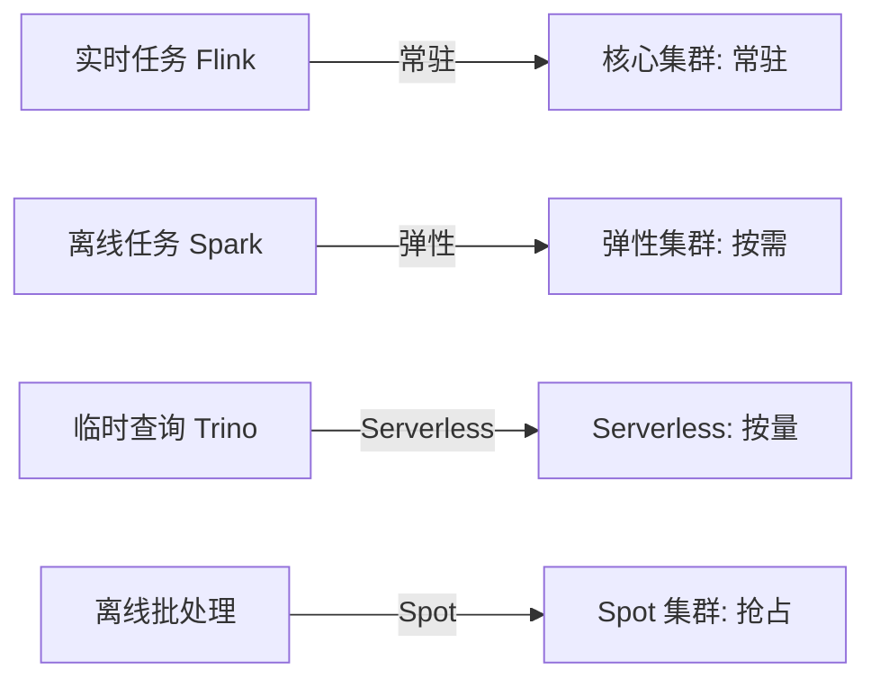
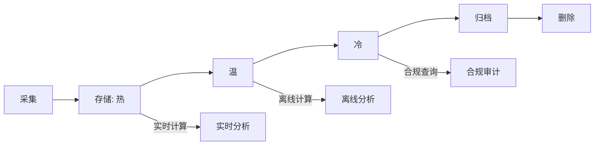

# 大数据成本优化

## 〇、本体介绍

**大数据成本优化**：在保证数据链路 SLA 的前提下，降低存储、计算、网络、人力的综合成本。大数据成本通常占企业 IT 预算的 20%~40%，且随数据量指数增长，**成本失控是大数据团队最常见的痛点**。

**核心矛盾**：
1. 数据量**只增不减**（存储成本指数增长）与**预算有限**的矛盾；
2. 计算资源**峰值预留**（双 11 10x QPS）与**日常闲置**的矛盾；
3. **数据可用性**（保留全量历史）与**存储成本**（只保留热数据）的矛盾。

**核心主线**：成本全景 → 存储优化 → 计算优化 → 架构优化 → 治理优化。

---

## 一、成本全景与度量

### 1.1 成本构成

| 维度 | 占比 | 典型值 |
|------|------|--------|
| **存储** | 30%~50% | HDFS/对象存储，PB 级数据月费数万~数十万 |
| **计算** | 30%~40% | Spark/Flink 集群，常驻 + 弹性 |
| **网络** | 10%~15% | 跨 AZ/跨 Region 数据传输 |
| **人力** | 10%~20% | 数据开发、运维、治理 |

### 1.2 成本度量指标

| 指标 | 公式 | 意义 |
|------|------|------|
| **每 TB 存储成本** | 存储总费用 / 总数据量 | 存储效率 |
| **每 TB 计算成本** | 计算总费用 / 处理数据量 | 计算效率 |
| **每查询成本** | 计算费用 / 查询次数 | 查询效率 |
| **数据价值密度** | 活跃数据量 / 总数据量 | 冷温热分层依据 |
| **人力产出比** | 数据任务数 / 团队人数 | 工具化程度 |

> 口诀：**"存储计算网络人，五维度看成本；TB 成本是基线，价值密度定分层。"**

---

## 二、存储优化

### 2.1 冷热温分层

| 层级 | 访问频率 | 存储介质 | 成本 | 例子 |
|------|----------|----------|------|------|
| **热数据** | 日/小时级访问 | SSD / 高性能存储 | 高 | 近 7 天订单、实时报表 |
| **温数据** | 周/月级访问 | 标准对象存储（S3 Standard） | 中 | 近 30 天明细、周报 |
| **冷数据** | 季度/年级访问 | 低频存储（S3 IA） | 低 | 历史明细、合规留存 |
| **冰数据** | 极少访问 | 归档存储（Glacier/深度归档） | 极低 | 法律合规留存、审计日志 |

### 2.2 分层策略

- **自动分层**：基于访问时间自动迁移（对象存储 Lifecycle Policy）。
- **分层依据**：Last Access Time（对象存储访问日志）+ 业务规则（订单表 30 天后转冷）。
- **成本收益**：热:温:冷:冰 成本比约 10:3:1:0.3，合理分层可降存储成本 40%~60%。

### 2.3 存储格式优化

| 优化手段 | 做法 | 收益 |
|----------|------|------|
| **列式存储** | Parquet/ORC 替代 CSV/JSON | 压缩率提升 5~10x |
| **压缩算法** | ZSTD/Snappy 替代 GZIP | 压缩率提升 20%~30%，解压更快 |
| **数据湖格式** | Iceberg/Paimon 替代原始文件 | 避免小文件 + ACID + 时间旅行 |
| **小文件合并** | 定时 compaction | 减少 NameNode 压力 + 提升读取性能 |
| **数据去重** | 消除重复采集/重复存储 | 减少冗余数据 |

- **列式 vs 行式**：列式只读查询所需列，I/O 减少 80%+；压缩率更高（同列数据类型一致）。
- **压缩算法选择**：ZSTD 压缩率高但 CPU 开销大；Snappy 压缩率低但速度快；按场景选择。

> 口诀：**"冷热温冰四层分，自动迁移靠 Lifecycle；列式压缩选 ZSTD，小文件要合并。"**

### 2.4 存储成本 CheckList

- [ ] 冷热温冰分层策略已配置（Lifecycle Policy）
- [ ] 列式存储（Parquet/ORC）已全量切换
- [ ] 压缩算法已优化（ZSTD/Snappy）
- [ ] 小文件定时合并（compaction）
- [ ] 冗余数据定期清理（重复采集/过期快照）
- [ ] 存储成本按团队/项目分摊（账单标签）

---

## 三、计算优化

### 3.1 计算资源模型

| 模型 | 做法 | 适用 | 成本 |
|------|------|------|------|
| **常驻集群** | 固定集群 7×24 运行 | 核心链路、实时计算 | 高（闲置浪费） |
| **弹性集群** | 按需扩缩容 | 离线批处理、非核心 | 低（按使用付费） |
| **Serverless** | 按需付费，无需管理集群 | 轻量查询、临时任务 | 最低（但单价高） |
| **Spot/抢占式** | 低价抢占闲置资源 | 容错性好的批处理 | 极低（可能被回收） |

### 3.2 计算优化策略

| 优化手段 | 做法 | 收益 |
|----------|------|------|
| **Spot 实例** | 批处理任务用 Spot 实例 | 成本降 60%~70% |
| **弹性扩缩容** | 按负载自动扩缩（HPA/K8s Cluster Autoscaler） | 避免闲置 |
| **任务错峰** | 非紧急任务调度到低价时段（夜间/周末） | 利用低价资源 |
| **SQL 优化** | 分区裁剪/列裁剪/谓词下推 | 减少扫描量 50%+ |
| **数据倾斜治理** | 热点 key 加盐/两阶段聚合 | 避免长尾任务 |
| **缓存中间结果** | 重复查询结果缓存 | 避免重复计算 |

### 3.3 任务调度优化

- **实时任务**：常驻集群保障低延迟，但需合理设置资源上限避免浪费。
- **离线任务**：弹性集群 + 夜间低价时段调度，Spot 实例兜底。
- **临时查询**：Serverless（如 Athena/Presto on demand），按查询付费。

> 口诀：**"实时常驻保延迟，离线弹性降成本；Spot 批处理不怕断，Serverless 临时算；任务错峰跑夜间，SQL 优化少扫描。"**

---

## 四、架构优化

### 4.1 存算分离

| 模式 | 存储 | 计算 | 成本影响 |
|------|------|------|----------|
| **存算耦合** | HDFS DataNode 兼计算 | MapReduce/Spark 同节点 | 扩容需扩存储+计算 |
| **存算分离** | 对象存储（S3/OSS）独立 | 计算集群独立扩缩 | 存储计算独立计费，弹性更优 |

- **存算分离优势**：存储按量付费（对象存储），计算按需扩缩；存储成本降 30%+。
- **典型架构**：数据湖（对象存储）+ 弹性计算（K8s 上 Spark/Flink）+ 交互查询（Trino/Doris）。

### 4.2 湖仓一体的成本优势

| 维度 | 传统数仓 | 湖仓一体 | 成本影响 |
|------|----------|----------|----------|
| 存储 | 专用存储（昂贵） | 对象存储（便宜） | 存储成本降 50%+ |
| 计算 | 耦合，扩容贵 | 独立弹性扩缩 | 计算成本降 30%+ |
| 双链路 | Lambda 批+流两份 | 流批一份 | 开发+计算成本降 50% |
| 数据冗余 | 多份副本 | 一份数据多引擎读 | 存储冗余降 60% |

### 4.3 数据生命周期管理

- **自动过期**：按数据生命周期自动转冷/归档/删除。
- **合规保留**：法律要求保留的数据单独标记，不受自动删除影响。
- **价值评估**：定期评估数据价值密度，低价值数据优先归档/删除。

---

## 五、治理优化

### 5.1 成本治理框架

| 治理手段 | 做法 | 收益 |
|----------|------|------|
| **成本分摊** | 按团队/项目/业务线分摊存储+计算费用 | 明确成本 Owner |
| **预算管控** | 设置预算上限，超预算告警/限流 | 防止成本失控 |
| **资源配额** | 按团队分配计算资源配额 | 防止资源抢占 |
| **成本看板** | 实时展示各团队/任务成本 | 透明化驱动优化 |
| **任务审计** | 审计低效任务（全表扫描/重复计算） | 清理浪费 |

### 5.2 成本看板指标

| 指标 | 说明 |
|------|------|
| 各团队存储成本 | 按团队分摊，识别成本大户 |
| 各任务计算成本 | 按任务分摊，识别低效任务 |
| 冷热数据占比 | 评估分层策略效果 |
| 存储增长率 | 预测未来成本 |
| 查询成本 | 识别高频/高成本查询 |

> 口诀：**"成本分摊到团队，预算管控设上限；资源配额防抢占，成本看板促优化；审计低效清浪费，生命周期自动管。"**

---

## 六、与其他板块的关系

- **04 分布式存储与 HDFS** — 存储层成本优化（HDFS → 对象存储）；
- **10 资源调度：YARN 与 Kubernetes** — 计算资源调度与弹性扩缩；
- **11 实时数仓与湖仓一体** — 湖仓一体架构的成本优势；
- **12 数据治理与数据质量** — 成本治理是数据治理的维度之一；
- **13 新技术趋势与生态全景** — Serverless、存算分离等降本技术趋势；
- **SRE与稳定性工程** — 成本优化不能牺牲 SLA。

---

## 七、速查表

| 主题 | 一句话 |
|------|--------|
| 存储分层 | 冷热温冰四层，自动迁移降 40%~60% |
| 存储格式 | 列式（Parquet）+ 压缩（ZSTD）+ 小文件合并 |
| 计算模型 | 实时常驻、离线弹性、临时 Serverless、批处理 Spot |
| 计算优化 | Spot 实例、弹性扩缩、错峰调度、SQL 优化 |
| 架构优化 | 存算分离 + 湖仓一体 + 生命周期管理 |
| 治理优化 | 成本分摊、预算管控、配额、看板、审计 |

---

## 面试高频问题（10+ 条）

1. **大数据成本怎么优化？** 存储分层（冷热温冰）+ 计算弹性（Spot/Serverless）+ 架构（存算分离/湖仓一体）+ 治理（分摊/预算）。
2. **冷热数据怎么分层？** 基于访问频率：热（SSD/高性能）、温（标准存储）、冷（低频）、冰（归档），自动 Lifecycle Policy 迁移。
3. **Spot 实例是什么？** 云厂商低价出售的闲置资源，价格低 60%~70%，但可能被回收，适合容错性好的批处理。
4. **存算分离的优势？** 存储（对象存储）和计算独立扩缩，存储按量付费，计算按需弹性，整体成本降 30%+。
5. **列式存储为什么省成本？** 只读查询所需列，I/O 减少 80%+；同列数据类型一致，压缩率更高。
6. **小文件问题怎么治？** 定时 compaction 合并小文件；写入端用 Iceberg/Paimon 自动合并；避免高频小批量写入。
7. **数据倾斜怎么优化成本？** 热点 key 加盐打散、两阶段聚合、避免长尾任务浪费计算资源。
8. **成本怎么分摊到团队？** 存储按数据归属标签分摊，计算按任务 Owner 分摊，账单打标签。
9. **Serverless 适合什么场景？** 临时查询、轻量任务、负载波动大的场景；不适合常驻低延迟任务。
10. **数据生命周期怎么管理？** 采集→热存储→温→冷→归档→删除，自动迁移 + 合规保留 + 价值评估。
