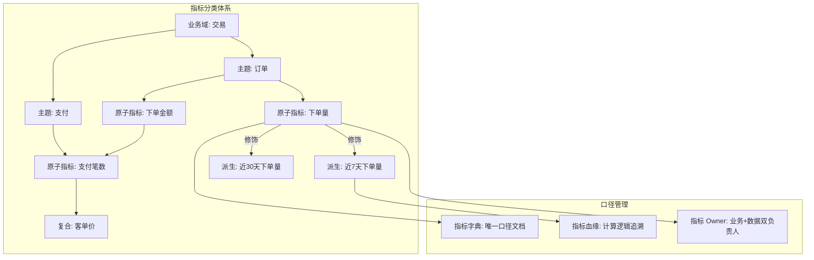
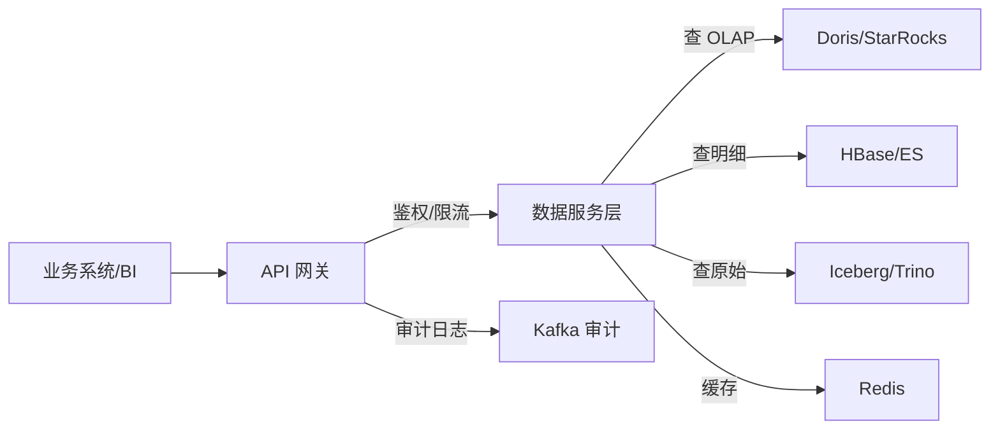
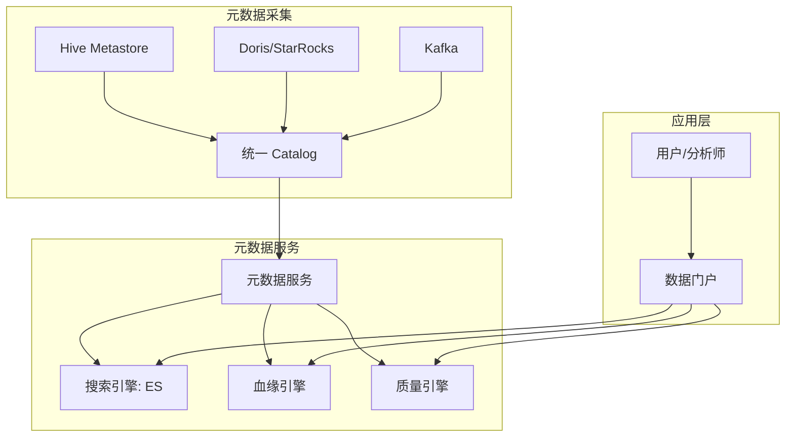
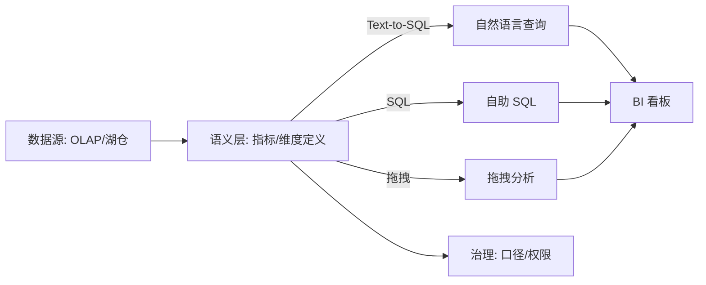

# 数据服务化与指标管理

## 〇、本体介绍

**数据服务化**：把数据团队产出（表、指标、报表、API）变成**可发现、可理解、可信赖、可复用**的数据产品。数据中台的最终价值不在"建了多少张表"，而在"业务能多快拿到可信的数据"。

**核心矛盾**：
1. 数据团队**产能有限**（需求排期长）与业务**需求爆炸**（每个团队都要数据）的矛盾；
2. **指标口径不一致**（同一个"GMV"三个团队三个数）是数据团队最大的信任危机；
3. 数据**服务化程度低**（每次取数都写 SQL）导致重复开发和响应延迟。

**核心主线**：数据产品化 → 指标管理 → 数据 API → 数据目录 → 数据民主化。

---

## 一、数据产品化

### 1.1 数据产品层次

| 层次 | 产品形态 | 用户 | 例子 |
|------|----------|------|------|
| **L1 原始数据** | 数据湖/数仓表 | 数据开发 | Iceberg 表、Hive 表 |
| **L2 数据资产** | 主题宽表/指标 | 分析师/BI | DWS 汇总表、ADS 应用表 |
| **L3 数据服务** | API/报表/推送 | 业务系统/运营 | 数据接口、BI 报表、消息推送 |
| **L4 数据应用** | 产品化应用 | 终端用户 | 数据看板、推荐引擎、风控系统 |

### 1.2 数据产品设计原则

| 原则 | 说明 |
|------|------|
| **以用户为中心** | 从业务场景出发，不是从数据表出发 |
| **口径唯一** | 同一指标只在一处定义，多处引用 |
| **自助优先** | 80% 需求用户自助完成，20% 才找数据团队 |
| **可发现** | 数据资产有目录、有文档、有血缘 |
| **可信赖** | 数据有质量监控、有 SLA、有 Owner |

> 口诀：**"产品化看层次，L1 原始 L4 应用；口径唯一是生命，自助优先提效率。"**

---

## 二、指标管理

### 2.1 指标分类

| 类型 | 定义 | 例子 | 管理要求 |
|------|------|------|----------|
| **原子指标** | 不可再分的最小度量 | 订单金额、支付笔数 | 口径文档 + 唯一计算逻辑 |
| **派生指标** | 原子指标 + 修饰词 + 时间 | 近7天新用户GMV | 由原子指标自动生成 |
| **复合指标** | 多个指标运算 | 客单价=GMV/订单数 | 由原子/派生指标组合 |

### 2.2 指标体系设计

### 2.3 口径一致性保障

| 保障手段 | 做法 |
|----------|------|
| **唯一计算逻辑** | 同一指标只在一个 DWS 层计算，ADS 层只读不重算 |
| **指标字典** | 指标名称、口径、维度、更新频率、Owner 统一文档 |
| **指标血缘** | 从 ADS 回溯到 ODS 的完整计算链路 |
| **口径校验** | 新旧口径并行跑，差异归零后切流 |
| **Owner 制** | 每个指标有业务 Owner（定口径）+ 数据 Owner（保质量） |

- **典型问题**：业务 A 的"GMV"含退款，业务 B 的不含 → 指标字典明确标注口径，禁止同名不同义。
- **命名规范**：`[业务域]_[主题]_[原子指标]_[修饰词]_[时间周期]`，如 `trade_order_gmv_newuser_7d`。

> 口诀：**"原子指标打基础，派生靠修饰；复合做运算，口径要唯一；字典定规范，血缘可追溯。"**

---

## 三、数据 API 设计

### 3.1 API 类型

| 类型 | 接口 | 适用 | 例子 |
|------|------|------|------|
| **明细查询** | GET /data/detail?条件 | 少量数据查询 | 查单用户近30天订单 |
| **聚合查询** | POST /data/aggregate | 报表/看板 | 查近7天各城市GMV |
| **人群圈选** | POST /data/crowd | 营销/推荐 | 导出"近30天高价值用户" |
| **数据推送** | Webhook/MQ | 下游订阅 | 订单状态变更通知 |
| **文件导出** | POST /data/export | 大批量导出 | 导出全量用户标签 |

### 3.2 API 设计原则

| 原则 | 说明 |
|------|------|
| **无状态** | 不依赖会话，每次请求独立鉴权 |
| **幂等** | 重复调用结果一致（防重复扣减/重复推送） |
| **分页** | 大结果集必须分页（cursor 分页优于 offset） |
| **限流** | 按 AppKey/用户限流，防雪崩 |
| **脱敏** | 返回数据按用户权限自动脱敏 |
| **版本化** | API 版本化（/v1/、/v2/），兼容升级 |

### 3.3 数据服务架构

- **API 网关**：统一鉴权、限流、路由、审计。
- **数据服务层**：封装查询逻辑，屏蔽底层存储差异。
- **多级缓存**：热点查询结果缓存 Redis（TTL 5min~1h），减少 OLAP 压力。

> 口诀：**"网关统一出入口，服务层封装存储；热点结果缓存化，审计日志不能少。"**

---

## 四、数据目录 / 数据地图

### 4.1 数据目录能力

| 能力 | 说明 |
|------|------|
| **资产搜索** | 按关键词搜索表/字段/指标 |
| **数据画像** | 表规模、更新频率、质量评分、热度 |
| **血缘追溯** | 上下游依赖关系、影响分析 |
| **标签体系** | 业务标签、安全分级、质量标签 |
| **数据预览** | 样本数据预览（脱敏后） |
| **申请审批** | 数据权限在线申请+审批流 |

### 4.2 数据地图架构

- **元数据采集**：从 Hive Metastore、Doris、Kafka、Flink 等采集表/字段/血缘信息。
- **统一 Catalog**：Apache Polaris / Nessie / Hive Metastore 作为统一元数据中心。
- **数据门户**：搜索 + 画像 + 血缘 + 质量 + 申请审批的一站式入口。

---

## 五、数据民主化与自助分析

### 5.1 自助分析层次

| 层次 | 用户 | 工具 | 数据团队介入 |
|------|------|------|-------------|
| **L1 固定报表** | 运营/管理层 | BI 报表（Grafana/Superset） | 开发报表 |
| **L2 自助查询** | 分析师 | SQL 查询（Hue/DBeaver） | 建表/优化 |
| **L3 拖拽分析** | 业务人员 | 拖拽式 BI（Tableau/PowerBI） | 建数据模型 |
| **L4 智能分析** | 全员 | 自然语言查询（Text-to-SQL） | 维护语义层 |

### 5.2 自助分析架构

- **语义层**：把物理表映射为业务可理解的指标/维度；自助工具基于语义层查询。
- **Text-to-SQL**：LLM 把自然语言转 SQL，降低查询门槛（需语义层约束防幻觉）。

> 口诀：**"民主化靠分层，L1 报表 L4 智能；语义层承上启下，Text-to-SQL 降门槛；治理保口径，自助不失控。"**

---

## 六、与其他板块的关系

- **14 大数据场景设计实战/数据中台建设** — 数据中台的服务层就是数据服务化；
- **12 数据治理与数据质量** — 指标管理、数据目录是治理的核心能力；
- **09 数据仓库与 OLAP 引擎** — OLAP 是数据服务的查询引擎；
- **05 列式存储与数据湖格式** — 数据湖格式支撑数据服务的多引擎查询；
- **技术选型/04 主流技术域选型对比** — BI 工具、数据目录工具的选型；
- **SRE与稳定性工程** — 数据 API 的稳定性保障（SLA/限流/降级）。

---

## 七、速查表

| 主题 | 一句话 |
|------|--------|
| 产品化 | L1 原始→L4 应用，以用户为中心 |
| 指标管理 | 原子/派生/复合，口径唯一+字典+血缘 |
| 数据 API | 明细/聚合/人群/推送/文件，无状态+幂等+限流 |
| 数据目录 | 搜索+画像+血缘+质量+申请审批 |
| 自助分析 | L1 报表→L4 智能，语义层承上启下 |

---

## 面试高频问题（10+ 条）

1. **数据服务化是什么？** 把数据团队产出（表/指标/API）变成可发现、可理解、可信赖、可复用的数据产品。
2. **指标口径怎么统一？** 唯一计算逻辑 + 指标字典 + 血缘追溯 + Owner 制，同指标只在一处计算。
3. **原子/派生/复合指标区别？** 原子不可再分，派生=原子+修饰词+时间，复合=多指标运算。
4. **数据 API 怎么设计？** 无状态、幂等、分页、限流、脱敏、版本化；网关统一入口。
5. **数据目录有什么能力？** 资产搜索、数据画像、血缘追溯、标签体系、数据预览、申请审批。
6. **什么是语义层？** 把物理表映射为业务指标/维度，自助工具基于语义层查询，屏蔽物理存储差异。
7. **Text-to-SQL 怎么防幻觉？** 语义层约束（只能查已定义的指标/维度）+ SQL 校验 + 结果合理性检查。
8. **数据民主化怎么实现？** 分层（固定报表→自助查询→拖拽分析→智能分析）+ 语义层 + 治理保口径。
9. **指标 Owner 制是什么？** 每个指标有业务 Owner（定口径）+ 数据 Owner（保质量），双负责人。
10. **数据服务怎么保证稳定性？** API 网关限流/熔断 + 多级缓存 + SLA 监控 + 降级策略（返回缓存/排队）。
